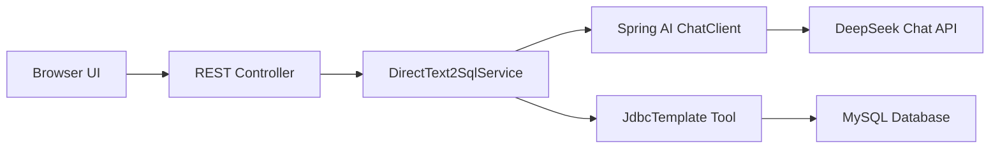
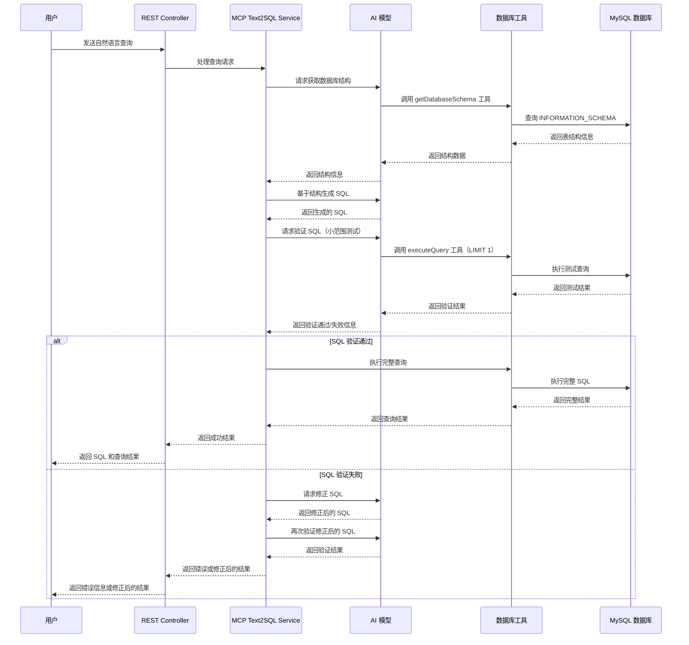
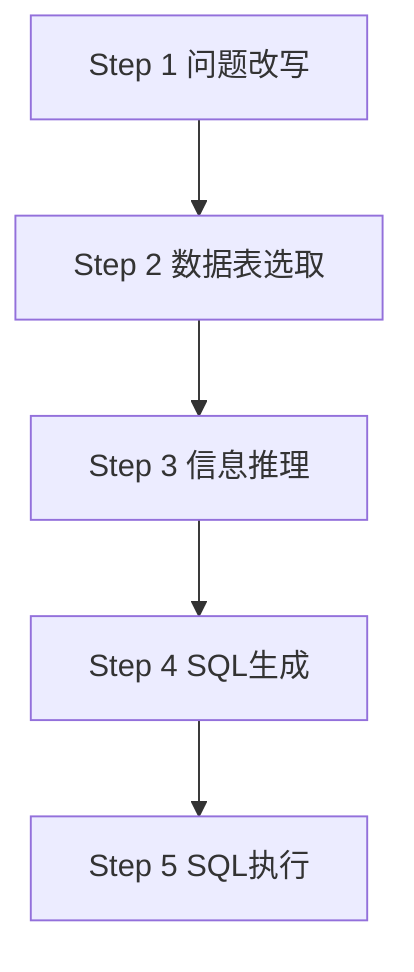

"能不能让数据库直接听懂中文问题，然后自动生成 SQL？" 这个想法在我脑海中盘旋了很久。最近终于用 **Spring AI** 实现了这个功能，从最初的简单实现到后来的 **MCP 工具集成**，再到**分步骤查询模式**，整个过程充满了惊喜和踩坑。今天就来分享一下我的 **Text2SQL** 实践心得。

<!--more-->

## 源代码

如果您想亲自尝试，可以随时查看我的源代码。为此，您必须克隆我的示例 [GitHub 仓库](https://github.com/chensoul/spring-ai-text2sql-showcase)。然后，您只需按照我的说明进行操作即可。

## 为什么选择 Text2SQL

想象一下这样的场景：产品经理问"上个月技术部的平均工资是多少？"，你不需要写复杂的 **SQL 查询语句**，只需要用**自然语言描述**，系统就能自动生成并执行查询。这就是 **Text2SQL**（也称 **NL2SQL**）的魅力所在。

我选择 **Spring AI** 作为**自然语言处理**框架，主要看中了它的：

- **简单易用**：几行配置就能接入各种 **LLM 大语言模型**（OpenAI、DeepSeek、通义千问等）
- **工具集成**：支持 **MCP（Model Context Protocol）**工具调用，实现**函数调用**能力
- **Spring 生态**：与现有 **Spring Boot** 项目无缝集成，支持**依赖注入**和**自动配置**

**核心技术栈** ：
- **Spring Boot 3.5.7** + **Spring AI 1.1.0**（企业级 Java 框架）
- **MySQL 9** (Docker容器化部署)
- **DeepSeek Chat API**（国产大语言模型）
- **Bootstrap 5** + **Thymeleaf**（响应式前端框架）
- **Maven** 构建工具

**关键特性**：
- 支持三种**智能查询模式**：直接模式、**MCP工具模式**、**分步骤模式**
- 内置**SQL注入防护**（仅允许SELECT查询，防止数据泄露）
- **现代化Web界面**（支持移动端适配）
- **数据库结构自动获取**（支持多表关联查询）

## 10 分钟快速体验

让我们先快速跑起来，看看**自然语言数据库查询**的效果如何：

**第一步：环境准备**
```bash
# 设置 DeepSeek API Key（支持 OpenAI、Claude、通义千问等多种 LLM）
export DEEPSEEK_API_KEY="your-deepseek-api-key-here"

# 启动 MySQL 数据库容器（Docker 容器化部署）
docker-compose up -d

# Maven 编译并运行 Spring Boot 应用
mvn clean spring-boot:run
```

**第二步：体验智能查询**

- **直接查询模式**：http://localhost:8080 （单步 SQL 生成）
- **分步骤模式**：http://localhost:8080/step （多步推理查询）

> 💡 **小贴士**：首次启动会自动执行**数据库初始化脚本**，加载员工、部门、项目示例数据。

## 第一版：简单粗暴的直接模式

最开始，我采用了最简单直接的方式：把**数据库 Schema** 作为**上下文信息**注入到**提示词工程**中，让 **LLM 大语言模型**直接生成 SQL。这种**零样本学习**方式虽然简单，但效果出奇地好。

**核心思路**：**数据库结构** + **用户问题** → **AI 模型推理** → **SQL 语句** → **安全校验** → **执行查询**

### 系统架构图


### 核心代码实现

让我来展示一下最核心的 `DirectText2SqlService` 类：

```java
@Slf4j
@RequiredArgsConstructor
public class DirectText2SqlService implements Text2SqlService {
    private final ChatClient chatClient;
    private final DatabaseTool databaseTool;

    // SQL 生成提示模板
    private static final String SQL_GENERATION_PROMPT = """
            你是一个专业的 SQL 生成助手。基于以下数据库结构信息，将用户的自然语言查询转换为 SQL 语句。
            
            数据库结构信息：
            {schema}
            
            请遵循以下规则：
            1. 只生成 SELECT 查询语句
            2. 使用正确的表名和字段名
            3. 添加适当的 WHERE 条件
            4. 使用 LIMIT 限制结果数量（最多 1000 条）
            5. 确保 SQL 语法正确
            6. 如果查询涉及多表，请使用适当的 JOIN
            7. 只返回 SQL 语句，不要包含其他解释
            
            用户查询：{userQuery}
            """;

    /**
     * 将自然语言转换为 SQL 并执行查询
     *
     * @param userQuery 用户自然语言查询
     * @return 查询结果
     */
    @Override
    public Text2SqlResult processQuery(String userQuery) {
        try {
            // 1. 验证输入
            if (userQuery == null || userQuery.trim().isEmpty()) {
                return Text2SqlResult.error("查询内容不能为空");
            }

            // 2. 生成 SQL
            String sql = generateSql(userQuery);
            if (sql == null || sql.trim().isEmpty()) {
                return Text2SqlResult.error("无法生成有效的SQL查询，请检查您的查询描述");
            }

            // 3. 验证 SQL 安全性
            if (!SqlUtils.isSqlSafe(sql)) {
                return Text2SqlResult.error("生成的 SQL 包含不安全的操作，请重新描述您的查询需求");
            }

            log.info("sql: {}", sql);

            // 4. 执行 SQL 查询
            List<Map<String, Object>> results = databaseTool.executeQuery(sql);

            return Text2SqlResult.success(sql, results);

        } catch (Exception e) {
            log.error("处理查询时发生错误: {}", e.getMessage(), e);
            return Text2SqlResult.error("处理查询时发生错误: " + e.getMessage());
        }
    }

    /**
     * 生成 SQL 查询语句
     */
    private String generateSql(String userQuery) {
        // 获取数据库结构信息
        String schema = databaseTool.getDatabaseSchema();

        // 创建提示模板
        PromptTemplate promptTemplate = new PromptTemplate(SQL_GENERATION_PROMPT);

        // 构建提示
        Prompt prompt = promptTemplate.create(Map.of(
                "schema", schema,
                "userQuery", userQuery
        ));

        // 调用 AI 生成 SQL
        ChatResponse response = chatClient.prompt(prompt).call().chatResponse();
        String sql = response.getResult().getOutput().getText();

        // 清理 SQL 语句（移除可能的代码块标记）
        sql = sql.replaceAll("```sql", "").replaceAll("```", "").trim();

        return sql;
    }
}
```


### 核心配置

让我来展示一下关键的配置文件。首先是 `application.yml`：
```yaml
spring:
  datasource:
    url: jdbc:mysql://localhost:3306/text2sql_db?useUnicode=true&characterEncoding=UTF-8
    username: root
    password: root123
  ai:
    openai:
      base-url: https://api.deepseek.com
      api-key: ${DEEPSEEK_API_KEY}
      chat:
        options:
          model: deepseek-chat
          temperature: 0.1
```

然后是 `docker-compose.yml` 的数据库配置：
```yaml
services:
  mysql:
    image: mysql:8
    container_name: text2sql-mysql
    environment:
      MYSQL_ROOT_PASSWORD: root123
      MYSQL_DATABASE: text2sql_db
    ports:
      - "3306:3306"
    volumes:
      - ./mysql.cnf:/etc/mysql/conf.d/mysql.cnf
      - ./src/main/resources/schema.sql:/docker-entrypoint-initdb.d/01-schema.sql
      - ./src/main/resources/data.sql:/docker-entrypoint-initdb.d/02-data.sql
```

### Spring AI 配置类

```java
@Configuration
public class AppConfig {
    @Bean
    public ChatClient chatClient(OpenAiChatModel chatModel) {
        return ChatClient.builder(chatModel)
                .defaultAdvisors(new SimpleLoggerAdvisor())
                .build();
    }
}
```

这个配置类做了一件事：
1. **基础 ChatClient**：用于直接模式的 SQL 生成

### API 接口设计

我设计了两个核心接口：

- **查询接口**：`POST /api/query` - 接收自然语言问题，返回 SQL 和查询结果
- **结构接口**：`GET /api/schema` - 获取数据库结构信息

### REST Controller 实现

```java
@Controller
@RequiredArgsConstructor
public class Text2SqlController {
    private final Text2SqlService text2SqlService;
    private final DatabaseTool databaseTool;

    /**
     * 处理自然语言查询的 API 接口
     */
    @PostMapping("/api/query")
    @ResponseBody
    public ResponseEntity<Map<String, Object>> processQuery(@RequestBody Map<String, String> request) {
        String query = request.get("query");

        if (query == null || query.trim().isEmpty()) {
            Map<String, Object> response = new HashMap<>();
            response.put("success", false);
            response.put("error", "查询内容不能为空");
            return ResponseEntity.badRequest().body(response);
        }

        // 处理查询
        Text2SqlResult result = text2SqlService.processQuery(query);

        Map<String, Object> response = new HashMap<>();
        response.put("success", result.isSuccess());

        if (result.isSuccess()) {
            response.put("sql", result.getSql());
            response.put("data", result.getData());
            response.put("count", result.getData().size());
        } else {
            response.put("error", result.getError());
        }

        return ResponseEntity.ok(response);
    }

    /**
     * 获取数据库结构信息的 API
     */
    @GetMapping("/api/schema")
    @ResponseBody
    public ResponseEntity<Map<String, String>> getSchema() {
        Map<String, String> response = new HashMap<>();
        response.put("schema", databaseTool.getDatabaseSchema());
        return ResponseEntity.ok(response);
    }
}
```

让我们看看实际的使用效果：

```bash
curl -X POST http://localhost:8080/api/query \
  -H "Content-Type: application/json" \
  -d '{"query": "统计每个部门的员工数量"}'
```

**返回结果**：
```json
{
  "success": true,
  "sql": "SELECT department, COUNT(*) as count FROM employees GROUP BY department",
  "data": [ { "department": "技术部", "count": 3 } ],
  "count": 1
}
```

看到没？AI 不仅生成了正确的 SQL，还直接返回了查询结果！这就是 Text2SQL 的魅力。

### 前端界面展示

我设计了一个简洁美观的 Web 界面，让用户能够直观地体验 Text2SQL 功能：


**主要功能**：
- **自然语言输入**：用户可以直接用中文描述查询需求
- **示例查询**：提供常用的查询模板，点击即可使用
- **实时结果展示**：显示生成的 SQL 和查询结果
- **数据库结构查看**：可以查看完整的数据库结构信息

**界面特色**：
- 使用 Bootstrap 5 构建，响应式设计
- 渐变色背景，视觉效果现代
- 代码高亮显示，SQL 语句清晰可读
- 表格结果展示，数据一目了然

**示例数据表结构**：

```sql
-- 员工表数据
INSERT IGNORE INTO employees (name, department, position, salary, hire_date, email) VALUES
('张三', '技术部', '高级工程师', 15000, '2022-01-15', 'zhangsan@company.com'),
('李四', '技术部', '工程师', 12000, '2022-03-20', 'lisi@company.com'),
('王五', '销售部', '销售经理', 18000, '2021-11-10', 'wangwu@company.com'),
('赵六', '销售部', '销售代表', 10000, '2023-02-01', 'zhaoliu@company.com'),
('钱七', '人事部', '人事经理', 16000, '2021-08-05', 'qianqi@company.com'),
('孙八', '财务部', '会计师', 14000, '2022-06-15', 'sunba@company.com'),
('周九', '技术部', '架构师', 25000, '2020-12-01', 'zhoujiu@company.com'),
('吴十', '市场部', '市场专员', 11000, '2023-01-10', 'wushi@company.com');

-- 项目表数据
INSERT IGNORE INTO projects (name, description, start_date, end_date, status, budget) VALUES
('电商平台重构', '重构现有电商平台，提升性能和用户体验', '2023-01-01', '2023-06-30', '进行中', 500000),
('移动端应用开发', '开发公司移动端应用', '2023-03-01', '2023-08-31', '进行中', 300000),
('数据分析系统', '构建企业数据分析平台', '2022-10-01', '2023-02-28', '已完成', 200000),
('客户管理系统', '升级客户关系管理系统', '2023-02-15', '2023-07-15', '进行中', 150000),
('财务系统优化', '优化财务系统性能', '2022-12-01', '2023-01-31', '已完成', 80000);

-- 项目成员关系表数据
INSERT IGNORE INTO project_members (project_id, employee_id, role, join_date) VALUES
(1, 1, '开发负责人', '2023-01-01'),
(1, 2, '开发工程师', '2023-01-01'),
(1, 7, '技术架构师', '2023-01-01'),
(2, 1, '项目经理', '2023-03-01'),
(2, 2, '开发工程师', '2023-03-01'),
(3, 7, '技术负责人', '2022-10-01'),
(3, 6, '数据分析师', '2022-10-01'),
(4, 3, '项目经理', '2023-02-15'),
(4, 4, '业务分析师', '2023-02-15'),
(5, 6, '项目经理', '2022-12-01');

-- 部门表数据
INSERT IGNORE INTO departments (name, manager_id, budget, location) VALUES
('技术部', 7, 2000000, '北京'),
('销售部', 3, 1500000, '上海'),
('人事部', 5, 800000, '北京'),
('财务部', 6, 600000, '北京'),
('市场部', 8, 1000000, '上海');
```

## 第二版：MCP 工具集成模式 - 让 AI 更聪明

直接模式虽然简单，但遇到**复杂数据库查询**时就开始力不从心了。比如**多表关联查询**、**字段语义理解**等情况，AI 容易产生**幻觉问题**。

这时候，我引入了 **MCP（Model Context Protocol）工具集成**，让 **LLM 大语言模型**能够：
1. **先认知**：通过**函数调用**获取真实的**数据库 Schema**
2. **再生成**：基于真实结构生成**精准 SQL**
3. **后验证**：执行前先做**语法校验**和**安全检查**

### 为什么需要 MCP 工具调用？

想象一下，你的数据库有 50 张表，每张表都有复杂的**外键关联**。如果把这些信息都塞进**提示词上下文**，不仅会超出**模型上下文窗口**限制，还容易让 AI 产生**数据幻觉**。

**MCP 工具模式**的核心优势：

- **动态获取**：实时从数据库获取**元数据信息**，避免过时数据
- **安全验证**：生成 SQL 后先做**语法检查**，确保查询正确
- **智能纠错**：如果 SQL 有问题，AI 可以根据**错误信息**自动修正

**适用场景**：

- **复杂多表关联查询**（JOIN、子查询）
- 对**字段语义**敏感的查询
- 需要**高准确性**的生产环境

### MCP 工具调用流程图



### Spring AI 配置类

```java
@Configuration
public class AppConfig {
    @Bean
    public ChatClient chatClient(OpenAiChatModel chatModel) {
        return ChatClient.builder(chatModel).defaultAdvisors(new SimpleLoggerAdvisor()).build();
    }

    @Bean("mcpChatClient")
    public ChatClient mcpChatClient(ChatClient.Builder chatClientBuilder, DatabaseTool databaseTool) {
        return chatClientBuilder
                .defaultTools(databaseTool)
                .build();
    }
}
```

mcpChatClient 设置了默认的工具 databaseTool，DatabaseTool 的方法需要添加 MCP 的 @Tool 注解：

```java
@Slf4j
@Service
@RequiredArgsConstructor
public class DatabaseTool {
    private final JdbcTemplate jdbcTemplate;

    @Tool(name = "getTableNames", description = "获取数据库中所有表的名称列表")
    public List<String> getTableNames() {
        try {
            String sql = """
                    SELECT TABLE_NAME 
                    FROM INFORMATION_SCHEMA.TABLES 
                    WHERE TABLE_SCHEMA = DATABASE()
                    AND TABLE_TYPE = 'BASE TABLE'
                    ORDER BY TABLE_NAME
                    """;

            return jdbcTemplate.queryForList(sql, String.class);
        } catch (Exception e) {
            log.error("获取表列表失败", e);
            return List.of();
        }
    }
    //...
}
```

### McpText2SqlService

```java
@Slf4j
@Service
@RequiredArgsConstructor
public class McpText2SqlService implements Text2SqlService {

    @Qualifier("mcpChatClient")
    private final ChatClient mcpChatClient;

    // SQL 生成提示模板（MCP版本）
    private static final String SQL_GENERATION_PROMPT = """
            你是一个专业的 SQL 生成助手。你可以使用以下工具来获取数据库结构信息：
            
            可用工具：
            - getTableNames(): 获取所有表名
            - getTableSchema(tableName): 获取指定表的完整结构
            - getDatabaseSchema(): 获取所有表的完整结构
            - getTableColumns(tableName): 获取指定表的列信息
            - executeQuery(sql): 执行 SQL 查询验证结果
            
            请遵循以下规则：
            1. 首先使用 getTableNames() 了解数据库中有哪些表
            2. 根据用户查询需求，使用 getTableSchema() 获取相关表的结构信息
            3. 只生成 SELECT 查询语句
            4. 使用正确的表名和字段名
            5. 添加适当的 WHERE 条件
            6. 使用 LIMIT 限制结果数量（最多 1000 条）
            7. 确保 SQL 语法正确
            8. 如果查询涉及多表，请使用适当的 JOIN
            9. 生成 SQL 后，可以使用 executeQuery() 验证结果
            10. 只返回 SQL 语句，不要包含其他解释
            
            用户查询：{userQuery}
            """;

    /**
     * 将自然语言转换为 SQL 并执行查询（MCP版本）
     */
    @Override
    public Text2SqlResult processQuery(String userQuery) {
        try {
            // 1. 验证输入
            if (userQuery == null || userQuery.trim().isEmpty()) {
                return Text2SqlResult.error("查询不能为空");
            }

            // 2. 使用 MCP 工具生成 SQL
            String sql = generateSqlWithMcpTools(userQuery);
            if (sql == null || sql.trim().isEmpty()) {
                return Text2SqlResult.error("无法生成有效的 SQL 查询");
            }

            // 3. 验证 SQL 安全性
            if (!SqlUtils.isSqlSafe(sql)) {
                return Text2SqlResult.error("生成的 SQL 不安全，包含危险操作");
            }

            // 4. 执行查询
            List<Map<String, Object>> results = executeQuery(sql);
            return Text2SqlResult.success(sql, results);

        } catch (Exception e) {
            log.error("MCP Text2SQL 处理失败", e);
            return Text2SqlResult.error("处理查询时发生错误: " + e.getMessage());
        }
    }

    private String generateSqlWithMcpTools(String userQuery) {
        try {
            PromptTemplate promptTemplate = new PromptTemplate(SQL_GENERATION_PROMPT);
            Prompt prompt = promptTemplate.create(Map.of("userQuery", userQuery));

            ChatResponse response = mcpChatClient.prompt(prompt).call().chatResponse();
            String sql = response.getResult().getOutput().getText();

            // 清理 SQL 语句，移除可能的解释文本
            sql = SqlUtils.cleanSql(sql);

            log.info("MCP 工具生成的 SQL: {}", sql);
            return sql;

        } catch (Exception e) {
            log.error("使用 MCP 工具生成 SQL 失败", e);
            return null;
        }
    }

    private List<Map<String, Object>> executeQuery(String sql) {
        log.info("使用 MCP 工具执行查询: {}", sql);

        List<Map<String, Object>> result = mcpChatClient.prompt()
                .user("请使用 executeQuery 工具执行以下 SQL 查询: " + sql)
                .call()
                .entity(new ParameterizedTypeReference<List<Map<String, Object>>>() {
                });

        log.info("MCP 工具执行查询完成，返回 {} 条记录", result.size());
        return result;
    }
}
```

## 第三版：分步骤查询模式 - 让 AI 推理过程透明化 

有时候，我们不仅想要结果，还想知道 **AI 大语言模型**是怎么**逻辑推理**的。特别是在**教学演示**、**调试复杂查询**或者**生产环境监控**时，**分步骤展示**就显得尤为重要。

参考阿里的**析言产品**，把整个 **Text2SQL 自然语言处理**过程拆解成了 5 个清晰的**推理步骤**：



### 每一步都在做什么？

以执行 "找出工资最高的员工" 为例，展示**多步推理**过程：

**步骤 1：自然语言问题改写**
```bash
问题改写，改写为：查询工资最高的员工信息
```

**步骤 2：数据表智能选取**
```bash
数据表选取，选择表为：employees
```

**步骤 3：业务逻辑信息推理**
```markdown
信息推理，本次推理参考业务信息是：

- 需要查询的字段：id, name, department, position, salary, hire_date, email
- 筛选条件：无特定筛选条件
- 表关联关系：单表查询，无需表关联
- 排序规则：按salary字段降序排列，以找到工资最高的员工
- 分组统计：无需分组统计
- 结果限制：使用LIMIT 1限制结果数量，确保只返回工资最高的员工信息
- 业务含义：用于识别公司中薪酬最高的员工，便于人力资源管理和薪酬结构分析
```

**步骤 4：SQL 语句智能生成**
```markdown
查询SQL生成，生成SQL查询语句为：

SELECT 
    id,
    name,
    department,
    position,
    salary,
    hire_date,
    email
FROM employees
ORDER BY salary DESC
LIMIT 1

**SQL智能注释**
> 1. **查询目的**: 查询公司中工资最高的员工信息，用于识别薪酬最高的员工
> 2. **字段说明**:
>    - id: 员工唯一标识符，用于精确识别员工
>    - name: 员工姓名，便于人力资源识别具体人员
>    - department: 所属部门，分析高薪员工分布情况
>    - position: 职位信息，了解高薪对应的岗位级别
>    - salary: 工资数额，核心查询字段
>    - hire_date: 入职日期，分析高薪与入职时间的关系
>    - email: 联系方式，便于后续沟通
> 3. **表关联**: 单表查询，直接从employees表中获取数据，无需表关联
> 4. **条件筛选**: 无特定筛选条件，查询全公司所有员工
> 5. **分组聚合**: 无需分组统计，直接查询单个最高薪员工
> 6. **排序逻辑**: 按salary字段降序排列(DESC)，确保工资最高的员工排在第一位
> 7. **性能优化**: 使用LIMIT 1限制结果数量，避免返回不必要的数据，提高查询效率
> 8. **业务价值**: 该查询结果有助于人力资源部门了解公司薪酬结构，识别关键人才，为薪酬调整和人才保留策略提供数据支持
```

**步骤 5：SQL执行**

```markdown
执行成功，找到 1 条记录

| id | name | department | position | salary | hire_date | email |
|----|------|------------|----------|--------|-----------|-------|
| 7 | 周九 | 技术部 | 架构师 | 25000.00 | 1606752000000 | zhoujiu@company.com |
```

### 分步骤查询的提示词设计

为了实现这种分步骤展示，为每个步骤设计了专门的提示词模板：

比如以下是步骤 1 的提示词模板，为了识别出不是数据库查询的输入，对提示词做了一些修改。

```java
    // 步骤1: 问题改写提示模板
    private static final String STEP1_PROMPT = """
            请将用户的自然语言查询改写为更清晰、更具体的查询描述。
            
            用户查询：{userQuery}
            
            判断规则：
            1. 数据库查询特征词：查询、统计、查找、获取、显示、列出、计算、汇总、分析、筛选、排序、分组、连接、关联
            2. 非数据库查询特征：问候语、自我介绍、聊天、天气、新闻、娱乐、技术问题、编程问题、系统问题
            
            请使用 getDatabaseSchema MCP工具查询数据库表结构
            
            判断流程：
            1. 检查是否包含数据库查询特征词
            2. 检查是否涉及数据库里面的业务实体
            3. 检查是否包含数据操作意图
            4. 排除明显的非数据库查询内容
            5. 使用MCP工具查询实际表结构，判断查询是否可行
            
            请严格按照以下格式返回，不要包含任何其他内容：
            
            如果是数据库查询且与现有表相关：
            问题改写，改写为：[改写后的查询描述]
            
            如果不是数据库查询：
            提示：请输入与数据库查询相关的问题，例如"查询员工信息"、"统计销售数据"等
            
            如果是数据库查询但与现有表无关：
            提示：当前数据库中没有相关的业务表，请查询员工、部门、项目等相关信息
            
            要求：
            1. 必须严格按照上述格式返回
            2. 对于数据库查询，改写后的描述要简洁明了，突出查询的核心需求
            3. 使用标准的数据库查询术语
            4. 不要包含任何分析过程或额外说明
            5. 必须使用MCP工具查询数据库结构后再做判断
            """;
```

**这种方式的优势**：

- **教学友好**：每一步都可以单独观察和调整
- **调试便利**：出问题时能快速定位到具体步骤
- **可干预**：可以在任意步骤插入人工检查或规则修正
- **结果清晰**：使用 Markdown 表格让查询结果更加直观易读

### 分步骤查询的前端界面

启动应用之后，访问 http://localhost:8080/step 即可访问分步骤查询的前端界面： 


## 第四版：智能业务规则推理，让AI更懂业务

在前面的版本中，AI 虽然能够生成 SQL，但在理解业务含义和推理逻辑方面还有提升空间。第四版引入了**智能业务规则推理**，让 AI 不仅会写 SQL，更能理解业务逻辑。

### 为什么需要业务规则推理？

想象一下这样的场景：
- 用户问："近两年入职的员工平均薪水是多少？"
- 用户问："技术部工资最高的前3名员工"
- 用户问："每个部门的人数统计"

这些查询不仅需要正确的 SQL 语法，更需要理解：
- **时间推理**：什么是"近两年"？如何转换为具体的日期范围？
- **业务术语**：什么是"平均薪水"？应该用哪个字段？
- **排序逻辑**：如何找到"最高"的员工？
- **分组统计**：如何按部门分组？

### 业务规则推理的核心组件

第四版引入了 `BusinessRuleService`，提供五大核心推理能力：

#### 1. 业务术语解释
```java
// 业务术语映射
BUSINESS_TERMS.put("员工", "employees表中的员工记录");
BUSINESS_TERMS.put("工资", "salary字段，使用decimal(10,2)类型存储");
BUSINESS_TERMS.put("部门", "department字段，表示员工所属部门");

// 同义词处理
SYNONYMS.put("薪水", "工资");
SYNONYMS.put("薪资", "工资");
SYNONYMS.put("收入", "工资");
```

#### 2. 时间推理引擎

```java
// 支持多种时间表达式
"近两年" → "时间范围: 2022-01-01 至 2024-12-31"
"过去6个月" → "时间范围: 2024-06-01 至 2024-12-31"
"今年" → "时间范围: 2024-01-01 至 2024-12-31"
```

#### 3. 聚合规则推理

```java
// 根据指标类型推荐聚合函数
"工资总数" → "建议使用SUM聚合函数"
"员工人数" → "建议使用COUNT聚合函数"
"平均工资" → "建议使用AVG聚合函数"
```

#### 4. 表关联规则

```java
// 智能识别表关联关系
employees + project_members → "通过employee_id字段关联"
projects + project_members → "通过project_id字段关联"
```

#### 5. 字段需求推理

```java
// 根据查询内容推断需要的字段
"查询员工姓名" → "需要name字段"
"按部门统计" → "需要department字段"
"工资排序" → "需要salary字段"
```

### 步骤3：信息推理的智能化升级

在分步骤查询模式中，步骤3"信息推理"得到了显著增强：

#### 原始步骤3（第三版）

```markdown
信息推理，本次推理参考业务信息是：

- 需要查询的字段：id, name, department, position, salary, hire_date, email
- 筛选条件：无特定筛选条件
- 表关联关系：单表查询，无需表关联
- 排序规则：按salary字段降序排列，以找到工资最高的员工
- 分组统计：无需分组统计
- 结果限制：使用LIMIT 1限制结果数量，确保只返回工资最高的员工信息
- 业务含义：用于识别公司中薪酬最高的员工，便于人力资源管理和薪酬结构分析
```

#### 增强版步骤3（第四版）

```markdown
信息推理，本次推理参考业务信息是：

- 需要查询的字段：id, name, department, position, salary, hire_date, email
- 筛选条件：无特定筛选条件
- 表关联关系：单表查询，无需表关联
- 排序规则：按salary字段降序排列，以找到工资最高的员工
- 分组统计：无需分组统计
- 结果限制：使用LIMIT 1限制结果数量，确保只返回工资最高的员工信息
- 业务含义：用于识别公司中薪酬最高的员工，便于人力资源管理和薪酬结构分析

**业务规则参考**：
- 时间范围: 无特定时间限制
- 业务规则: 需要添加ORDER BY子句进行排序; 需要添加LIMIT子句限制返回结果数量
- 关键字段: salary, name, department, position
- 聚合建议: 无需聚合，直接查询单个记录
- 同义词映射: 工资 → salary字段
```

### 业务规则推理的实际效果

让我们看看几个具体的例子：

#### 例子1：时间推理
**用户查询**："近一年入职的员工信息"

**业务规则推理**：
- 时间范围: 2023-12-01 至 2024-12-31
- 筛选条件: hire_date >= '2023-12-01'
- 业务规则: 需要添加WHERE条件进行时间筛选

**生成的SQL**：
```sql
SELECT * FROM employees 
WHERE hire_date >= '2023-12-01' 
ORDER BY hire_date DESC
```

#### 例子2：聚合推理
**用户查询**："每个部门的平均工资"

**业务规则推理**：
- 分组统计: 按department字段分组
- 聚合建议: 使用AVG聚合函数计算平均工资
- 关键字段: department, salary
- 业务规则: 需要添加GROUP BY子句进行分组统计

**生成的SQL**：
```sql
SELECT department, AVG(salary) as avg_salary 
FROM employees 
GROUP BY department 
ORDER BY avg_salary DESC
```

#### 例子3：排序推理
**用户查询**："技术部工资最高的前3名员工"

**业务规则推理**：
- 筛选条件: department = '技术部'
- 排序规则: 按salary字段降序排列
- 结果限制: 使用LIMIT 3限制结果数量
- 关键字段: name, salary, department, position

**生成的SQL**：
```sql
SELECT name, salary, position 
FROM employees 
WHERE department = '技术部' 
ORDER BY salary DESC 
LIMIT 3
```

### 技术实现细节

#### BusinessRuleService 核心方法

```java
@Service
public class BusinessRuleService {
    
    /**
     * 时间推理 - 解析相对时间表达式
     */
    public String parseTimeExpression(String timeExpression) {
        // 支持"近X年"、"过去X个月"、"今年"、"去年"等表达式
        // 自动转换为具体的日期范围
    }
    
    /**
     * 聚合规则推理
     */
    public String getAggregationRule(String metric, String dimension) {
        // 根据指标类型推荐合适的聚合函数
        // SUM、COUNT、AVG、MAX、MIN等
    }
    
    /**
     * 表关联规则推理
     */
    public String getTableJoinRule(String table1, String table2) {
        // 智能识别表之间的关联字段
        // 支持外键关联、业务字段关联等
    }
    
    /**
     * 业务逻辑推理
     */
    public String getBusinessLogic(String query, String selectedTables) {
        // 综合推理查询的业务逻辑
        // 包括时间、状态、排序、分组、限制等
    }
    
    /**
     * 字段需求推理
     */
    public String getFieldRequirements(String query, String tableName) {
        // 根据查询内容推断需要的字段
        // 支持同义词映射和业务术语解释
    }
}
```

#### 步骤3的提示词模板

```java
private static final String STEP3_PROMPT = """
        基于选中的表和查询需求，进行智能信息推理。
        
        查询需求：{rewrittenQuery}
        选中表：{selectedTables}
        业务规则参考：{businessRules}
        
        请严格按照以下格式返回，不要添加任何其他内容：
        
        信息推理，本次推理参考业务信息是：
        
        - 需要查询的字段：[具体列出需要查询的字段名]
        - 筛选条件：[说明WHERE条件，如无特定条件则说明"无特定筛选条件"]
        - 表关联关系：[说明表关联情况，如单表查询则说明"单表查询，无需表关联"]
        - 排序规则：[说明ORDER BY的排序逻辑和目的]
        - 分组统计：[说明是否需要GROUP BY，如不需要则说明"无需分组统计"]
        - 结果限制：[说明LIMIT限制数量和目的]
        - 业务含义：[解释查询的业务价值和实际应用场景]
        
        要求：
        1. 严格按照上述格式输出，每行一个要点
        2. 基于业务规则参考信息进行推理
        3. 推理结果要具体、准确、有业务价值
        4. 不要包含SQL语句，只做逻辑推理
        """;
```

### 业务规则推理的优势

1. **智能化程度更高**：AI 不仅会写 SQL，更能理解业务含义
2. **准确性显著提升**：通过业务规则约束，减少 SQL 生成错误
3. **用户体验更好**：支持自然语言表达，无需学习 SQL 语法
4. **可扩展性强**：业务规则可以持续优化和扩展
5. **教学价值高**：分步骤展示让用户理解 AI 的思考过程

通过引入智能业务规则推理，第四版让 Text2SQL 系统真正具备了"理解业务"的能力，不仅能够生成正确的 SQL，更能理解用户的真实意图，提供更有价值的业务洞察。

### 实际应用场景

**人力资源场景**：
- "近半年入职的员工平均工资"
- "各部门工资分布情况"
- "技术部薪资最高的前5名"

**项目管理场景**：
- "进行中的项目预算统计"
- "每个项目的参与人数"
- "项目完成率分析"

**财务分析场景**：
- "各部门年度预算使用情况"
- "项目成本效益分析"
- "员工薪酬结构分析"

### 版本演进对比

| 特性 | 第一版 | 第二版 | 第三版 | 第四版 |
|------|--------|--------|--------|--------|
| **实现方式** | 直接模式 | MCP工具 | 分步骤查询 | 智能业务规则 |
| **准确性** | ⭐⭐⭐ | ⭐⭐⭐⭐ | ⭐⭐⭐⭐ | ⭐⭐⭐⭐⭐ |
| **可解释性** | ⭐⭐ | ⭐⭐⭐ | ⭐⭐⭐⭐⭐ | ⭐⭐⭐⭐⭐ |
| **业务理解** | ⭐⭐ | ⭐⭐⭐ | ⭐⭐⭐ | ⭐⭐⭐⭐⭐ |
| **教学价值** | ⭐⭐ | ⭐⭐⭐ | ⭐⭐⭐⭐⭐ | ⭐⭐⭐⭐⭐ |
| **适用场景** | 简单查询 | 复杂查询 | 教学演示 | 生产环境 |

## 安全第一：SQL 注入防护与数据安全策略

**Text2SQL 自然语言查询**虽然方便，但**数据库安全**问题绝对不能忽视。我在开发过程中总结了几条**安全防护**铁律：

### 核心安全防护策略

**1. 只读权限策略**

- 严格限制只能执行 `SELECT` 查询语句
- 拒绝所有 `DROP`、`DELETE`、`UPDATE`、`INSERT` 等**危险操作**
- 在**代码层面**和**数据库层面**做双重检查

**2. 系统表保护**

- 拦截访问 `INFORMATION_SCHEMA` 的查询
- 禁止访问**系统数据库**和**敏感表**
- 限制查询范围，避免**数据泄露**

**3. 输出内容控制**

- 清理 **AI 模型输出**中的代码块包裹
- 自动添加 `LIMIT` 限制，防止**大数据量查询**
- 对**敏感字段**进行脱敏处理

**4. 智能安全校验**

- **MCP 模式**下先做小范围测试
- 失败时提供具体的**错误信息**和修正建议
- 建立查询**白名单**和**黑名单**机制

### SQL 注入防护代码示例

```java
public class SqlUtils {

    // 危险操作黑名单
    private static final Set<String> DANGEROUS_KEYWORDS = Set.of(
        "DROP", "DELETE", "UPDATE", "INSERT", "ALTER", "CREATE", 
        "TRUNCATE", "EXEC", "EXECUTE", "CALL", "MERGE", "REPLACE",
        "UNION", "INFORMATION_SCHEMA"
    );
    
    // 系统表黑名单
    private static final Set<String> SYSTEM_TABLES = Set.of(
        "information_schema", "mysql", "performance_schema", 
        "sys", "test", "tmp"
    );

    /**
     * 清理 SQL 语句
     */
    public static String cleanSql(String sql) {
        if (sql == null) return "";

        // 移除可能的代码块标记
        sql = sql.replaceAll("```sql\\s*", "").replaceAll("```\\s*", "");

        // 查找第一个 SELECT 语句
        Pattern pattern = Pattern.compile("(SELECT.*?)(?=\\n\\n|$)", Pattern.DOTALL | Pattern.CASE_INSENSITIVE);
        Matcher matcher = pattern.matcher(sql);

        if (matcher.find()) {
            return matcher.group(1).trim();
        }

        return sql.trim();
    }

    /**
     * 验证 SQL 安全性
     */
    public static boolean isSqlSafe(String sql) {
        if (sql == null || sql.trim().isEmpty()) {
            return false;
        }
        
        String upperSql = sql.toUpperCase().trim();
        
        // 1. 检查是否只包含SELECT语句
        if (!upperSql.startsWith("SELECT")) {
            return false;
        }
        
        // 2. 检查危险关键词
        for (String keyword : DANGEROUS_KEYWORDS) {
            if (upperSql.contains(keyword)) {
                return false;
            }
        }
        
        // 3. 检查系统表访问
        for (String systemTable : SYSTEM_TABLES) {
            if (upperSql.contains(systemTable)) {
                return false;
            }
        }
        
        // 4. 检查SQL注入模式
        if (containsSqlInjection(sql)) {
            return false;
        }
        
        return true;
    }
    
    /**
     * 检测SQL注入攻击
     */
    private static boolean containsSqlInjection(String sql) {
        // 检测常见的SQL注入模式
        String[] injectionPatterns = {
            "'.*--", "'.*;", "'.*UNION", "'.*OR.*=", 
            "'.*AND.*=", "'.*OR.*1=1", "'.*AND.*1=1"
        };
        
        for (String pattern : injectionPatterns) {
            if (sql.matches(".*" + pattern + ".*")) {
                return true;
            }
        }
        
        return false;
    }
    
    /**
     * 清理和标准化SQL
     */
    public static String sanitizeSql(String sql) {
        if (sql == null) return "";
        
        // 移除代码块标记
        sql = cleanSql(sql);
        
        // 确保有LIMIT限制
        if (!sql.toUpperCase().contains("LIMIT")) {
            sql += " LIMIT 1000";
        }
        
        return sql;
    }
    
    /**
     * 获取SQL安全验证的详细错误信息
     */
    public static String getSecurityError(String sql) {
        if (sql == null || sql.trim().isEmpty()) {
            return "SQL语句不能为空";
        }
        
        String upperSql = sql.toUpperCase().trim();
        
        if (!upperSql.startsWith("SELECT")) {
            return "只允许执行SELECT查询语句";
        }
        
        for (String keyword : DANGEROUS_KEYWORDS) {
            if (upperSql.contains(keyword)) {
                return "检测到危险操作: " + keyword;
            }
        }
        
        for (String systemTable : SYSTEM_TABLES) {
            if (upperSql.contains(systemTable)) {
                return "禁止访问系统表: " + systemTable;
            }
        }
        
        if (containsSqlInjection(sql)) {
            return "检测到SQL注入攻击模式";
        }
        
        return "SQL语句安全";
    }
}
```

## 常见问题排查指南与故障诊断

开发过程中遇到问题很正常，这里是我总结的**Text2SQL 系统**常见问题及**故障排查**解决方案：

### 环境配置问题

**API Key 配置问题**

- 确保 `DEEPSEEK_API_KEY` **环境变量**已正确设置
- 检查**网络连接**，确保能访问 **DeepSeek API 服务**

**数据库连接问题**

- **端口冲突**：3306 被占用时，修改 `docker-compose.yml` 中的**端口映射**
- **字符集问题**：确保 `mysql.cnf` 正确挂载，字符集统一为 `utf8mb4`

### 功能性问题

**AI 自然语言理解不准确**

- 提供更具体的**上下文信息**（表名、字段含义、业务规则）
- 在**提示词模板**中加入更多示例
- 考虑使用 **MCP 模式**获取真实**数据库 Schema 结构**

**SQL 语法错误**

- 启用 MCP 模式，先做小范围测试
- 根据错误信息调整提示词
- 建立 SQL 语法检查机制

### 性能问题

**查询速度慢**

- 为常用查询字段添加索引
- 限制查询结果数量
- 考虑添加查询缓存机制

### 最佳实践建议

**1. 提示词优化**

- 使用具体的业务场景描述
- 提供足够的上下文信息
- 定期更新和测试提示词

**2. 错误处理**

- 实现完善的异常捕获机制
- 提供用户友好的错误信息
- 记录详细的错误日志用于调试

**3. 性能监控**

- 监控SQL执行时间
- 记录AI模型调用次数和成本
- 设置合理的超时时间

**4. 用户体验**

- 提供查询进度指示
- 支持查询历史记录
- 实现查询结果导出功能

## 项目总结与技术展望

从最初的一个想法，到现在的完整实现，这个过程让我深刻体会到了 **AI 技术**的魅力。**Text2SQL 自然语言查询**不仅仅是一个技术功能，它真正改变了我们与**数据库**交互的方式。

### 技术收获与成长

1. **AI 技术成长**：从简单的**提示词工程**到复杂的 **MCP 工具集成**，每一步都是学习
2. **问题解决能力**：**中文乱码**、**安全防护**、**性能优化**，每个坑都让我更强大
3. **产品思维**：从**技术实现**到**用户体验**，考虑用户真正需要什么

### 未来技术规划

这个 **Spring AI Text2SQL** 项目还有很多可以改进的地方：

**短期技术目标**：

- 支持**多模型切换**（OpenAI、Gemini、Claude 等）
- 添加**查询历史**和**多轮对话**功能
- 优化**提示词模板**，提高 **SQL 生成准确率**

**长期技术愿景**：

- **智能查询优化**建议
- **数据可视化报表**生成
- 更严格的**权限控制**和**审计机制**
- 支持更多**数据库类型**（PostgreSQL、Oracle、MongoDB）

### 给开发者的建议

如果你也想尝试 **Text2SQL 开发**，我的建议是：

1. **从简单开始**：先用**直接模式**快速验证想法
2. **逐步优化**：根据实际需求引入 **MCP** 和**分步骤模式**
3. **安全第一**：从一开始就考虑**安全问题**，不要事后补救
4. **持续学习**：**AI 技术**发展很快，保持学习的心态

### 技术选型与架构建议

**AI 大语言模型选择**：
- **DeepSeek**：性价比高，**中文理解**好，适合个人项目
- **OpenAI GPT-4**：准确率高，但成本较高
- **Claude**：**推理能力**强，适合复杂查询
- **本地模型**：数据安全，但需要强大的硬件支持

**数据库支持**：
- **MySQL**：最常用，生态完善
- **PostgreSQL**：功能强大，支持复杂查询
- **SQLite**：轻量级，适合原型开发
- **ClickHouse**：适合大数据分析场景

### 项目扩展方向

**短期扩展**：
- 支持更多数据库类型
- 添加查询历史和管理功能
- 实现查询结果可视化
- 支持多语言查询

**长期规划**：
- 集成向量数据库，支持语义搜索
- 实现智能查询优化建议
- 添加数据血缘分析功能
- 支持自然语言到复杂报表的生成

## 学习资源推荐

**官方文档**：
- [Spring AI 官方文档](https://docs.spring.io/spring-ai/reference/) - Spring AI 框架完整指南
- [OpenAI API 文档](https://platform.openai.com/docs) - GPT 模型 API 使用文档
- [MySQL 官方文档](https://dev.mysql.com/doc/) - MySQL 数据库完整文档
- [DeepSeek API 文档](https://platform.deepseek.com/api-docs) - DeepSeek 大语言模型 API

**相关技术框架**：
- [LangChain](https://python.langchain.com/) - Python 生态的 AI 应用开发框架
- [LlamaIndex](https://www.llamaindex.ai/) - 数据索引和检索框架
- [MCP 协议](https://modelcontextprotocol.io/) - 模型上下文协议标准
- [Spring Boot](https://spring.io/projects/spring-boot) - Java 企业级应用开发框架

**Text2SQL 相关资源**：
- [Text2SQL 论文集合](https://github.com/eosphoros-ai/awesome-text2sql) - Text2SQL 学术研究资源
- [SQL 注入防护指南](https://owasp.org/www-community/attacks/SQL_Injection) - OWASP SQL 注入防护
- [数据库设计最佳实践](https://www.sqlstyle.guide/) - SQL 编码规范指南

希望这篇文章能对你有帮助。如果你在实现过程中遇到问题，欢迎交流讨论！

## 致谢

感谢 [Spring AI 团队](https://spring.io/projects/spring-ai) 提供的优秀框架，感谢 [DeepSeek](https://www.deepseek.com/) 提供的 AI 服务支持，感谢所有 [开源社区](https://github.com/) 的贡献者们。正是有了这些优秀的工具和社区，我们才能快速构建出如此强大的 **Text2SQL 自然语言查询系统**。

---

*本文基于 Spring AI 1.1.0 版本编写，[项目代码已开源](https://github.com/chensoul/spring-ai-text2sql-showcase)，欢迎 Star 和 Fork！*

