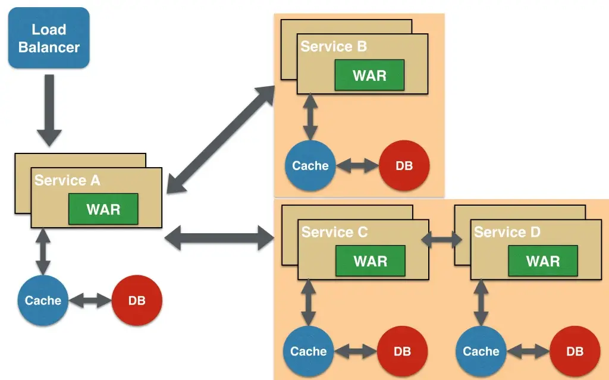
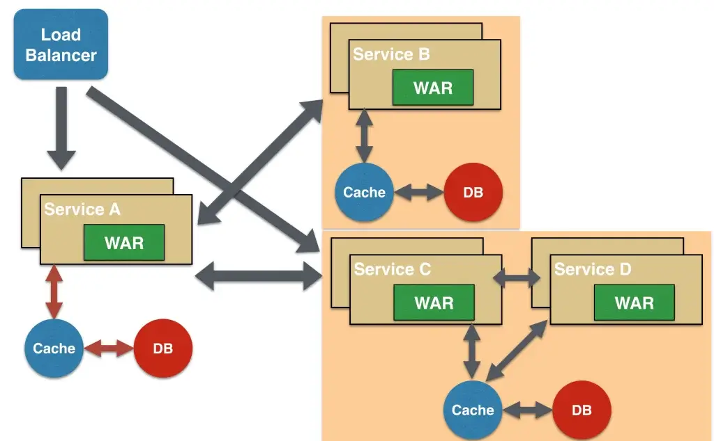
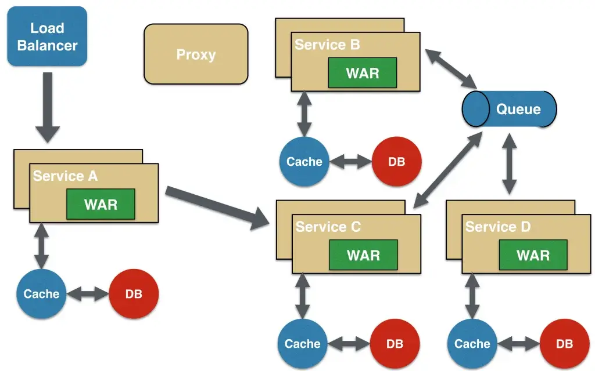

基于微服务的应用程序的主要特征在 [微服务、单体和 NoOps](http://web.archive.org/web/20190705163602/http://blog.arungupta.me/microservices-monoliths-noops/) 中定义。它们是功能分解或领域驱动设计、定义良好的接口、明确发布的接口、单一责任原则和潜在的多语言。每项服务都是完全自主和全栈的。

因此，更改服务实现不会影响其他服务，因为它们使用定义良好的接口进行通信。这种应用程序有几个优点，但它不是 [免费的午餐](http://web.archive.org/web/20190705163602/http://highscalability.com/blog/2014/4/8/microservices-not-a-free-lunch.html)，需要在 NoOps 方面付出大量努力。

但是假设您了解构建此类应用程序所需的工作或至少其中的一部分，并且愿意跳槽。你做什么工作？您构建此类应用程序的方法是什么？

是否有任何关于这些微服务如何相互协作的设计模式？

应用程序和团队的功能分解是构建成功的微服务架构的关键。

这允许您实现松耦合（REST 接口）和高内聚（多个服务可以相互组合以定义更高级别的服务或应用程序）。

应用程序的动词（例如 Checkout）或名词（Product）是实现现有应用程序分解的有效方法之一。

例如，产品、目录和结帐可以是三个独立的微服务，然后相互协作以提供完整的购物车体验。

功能分解提供了敏捷性、灵活性、可扩展性和其他能力，但业务目标仍然是创建应用程序。因此，一旦识别出不同的微服务，您如何组合它们以提供应用程序的功能？

本博客将讨论一些关于如何将微服务组合在一起的推荐模式。

## 聚合微服务设计模式

第一个，也可能是最常见的，是聚合器微服务设计模式。

在其最简单的形式中，聚合器将是一个简单的网页，它调用多个服务来实现应用程序所需的功能。由于每个服务（服务 A、服务 B 和服务 C）都使用轻量级 REST 机制公开，因此网页可以检索数据并相应地处理/显示数据。如果需要某种处理，比如将业务逻辑应用于从各个服务接收的数据，那么您可能有一个 CDI bean 可以转换数据，以便网页可以显示它。

聚合器的另一个选择是不需要显示，它只是一个更高级别的复合微服务，可以被其他服务使用。

在这种情况下，聚合器只需从每个单独的微服务收集数据，对其应用业务逻辑，然后将其进一步发布为 REST 端点。然后可以由需要它的其他服务使用。

这种设计模式遵循 DRY 原则。

如果有多个服务需要访问服务 A、B 和 C，那么建议将该逻辑抽象为一个复合微服务，并将该逻辑聚合到一个服务中。在此级别进行抽象的一个优点是各个服务，即服务 A、B 和 C，并且可以独立发展，业务需求仍然由组合微服务提供。

请注意，每个单独的微服务都有自己的（可选）缓存和数据库。如果聚合器是一个复合微服务，那么它也可能有自己的缓存和数据库层。

聚合器也可以在 X 轴和 Z 轴上独立缩放。因此，如果它是一个网页，那么您可以启动额外的 Web 服务器，或者如果它是一个使用 Java EE 的复合微服务，那么您可以启动额外的 WildFly 实例来满足不断增长的需求。

## 代理微服务设计模式

代理微服务设计模式是聚合器的一种变体。在这种情况下，客户端不需要进行聚合，但可以根据业务需要调用不同的微服务。

就像 Aggregator 一样，Proxy 也可以在 X 轴和 Z 轴上独立扩展。您可能喜欢这样做，因为每个单独的服务都不需要向消费者公开，而是应该通过一个界面。

代理可能是一个哑代理，在这种情况下，它只是将请求委托给其中一项服务。或者，它可能是一个智能代理，在将响应提供给客户端之前应用一些数据转换。一个很好的例子就是可以将不同设备的表示层封装在智能代理中。

## 链式微服务设计模式

链式微服务设计模式对请求产生单一的综合响应。在这种情况下，来自客户端的请求由服务 A 接收，然后服务 A 与服务 B 通信，而服务 B 又可能与服务 C 通信。

所有服务都可能使用同步 HTTP 请求/响应消息传递。

要记住的关键部分是客户端被阻塞，直到完成请求/响应链，即服务<->服务 B 和服务 B<->服务 C，完成。从服务 B 到服务 C 的请求可能看起来与从服务 A 到服务 B 的请求完全不同。

同样，服务 B 对服务 A 的响应可能看起来与服务 C 对服务 B 的响应完全不同。无论如何，这就是不同服务增加其业务价值的全部要点。

这里要理解的另一个重要方面是不要让链条太长。这一点很重要，因为链的同步特性在客户端看起来像是一个漫长的等待，特别是如果它是一个等待显示响应的网页。

这个阻塞请求/响应有变通方法，并在后续设计模式中讨论。

具有单个微服务的链称为单例链。这可能允许链在以后扩展。

## 分支微服务设计模式

分支微服务设计模式扩展了聚合器设计模式，并允许同时处理来自两个可能互斥的微服务链的响应。此模式还可用于根据业务需求调用不同的链或单个链。

服务 A（网页或复合微服务）可以同时调用两个不同的链，在这种情况下，这类似于聚合器设计模式。或者，服务 A 可以根据从客户端收到的请求仅调用一个链。

这可以使用 JAX-RS 或 Camel 端点的路由进行配置，并且需要动态配置。

## 共享数据微服务设计模式

微服务的设计原则之一是自治。这意味着该服务是全栈式的，并且可以控制所有组件——UI、中间件、持久性、事务。这允许服务是多语言的，并使用正确的工具来完成正确的工作。

例如，如果可以使用 NoSQL 数据存储而不是将数据塞入 SQL 数据库中更合适的话。

然而，一个典型的问题，尤其是在从现有的单体应用程序重构时，是数据库规范化，这样每个微服务都有正确数量的数据——仅此而已。

即使在单体应用程序中仅使用 SQL 数据库，对数据库进行非规范化也会导致数据重复，并可能导致不一致。在过渡阶段，一些应用程序可能会受益于共享数据微服务设计模式。

在这种设计模式中，一些微服务（可能在一个链中）可以共享缓存和数据库存储。

这只有在两种服务之间存在强耦合时才有意义。有些人可能认为这是一种反模式，但在某些情况下业务需求可能需要遵循这一点。对于基于微服务设计的全新应用程序，这肯定是一种反模式。

这也可以看作是一个过渡阶段，直到微服务过渡到完全自主。

## 异步消息微服务设计模式

虽然 REST 设计模式非常普遍且易于理解，但它具有同步和阻塞的局限性。

可以实现异步，但这是以特定于应用程序的方式完成的。因此，一些微服务架构可能会选择使用消息队列而不是 REST 请求/响应。

在这种设计模式中，服务 A 可以同步调用服务 C，然后服务 C 使用共享消息队列与服务 B 和 D 异步通信。

服务 A -> 服务 C 通信可能是异步的，可能使用 WebSockets，以实现所需的可伸缩性。

可以使用 REST 请求/响应和发布/订阅消息传递的组合来完成业务需求。

[Coupling vs Autonomy in Microservices](http://web.archive.org/web/20190705163602/https://www.voxxed.com/blog/2015/04/coupling-versus-autonomy-in-microservices/) 是一本关于为您的微服务选择哪种消息传递模式的好读物。

希望您发现这些设计模式很有用。

您使用什么微服务设计模式？

善于交际，分享！

原文链接：[http://web.archive.org/web/20190705163602/http://blog.arungupta.me/microservice-design-patterns/](http://web.archive.org/web/20190705163602/http://blog.arungupta.me/microservice-design-patterns/)
