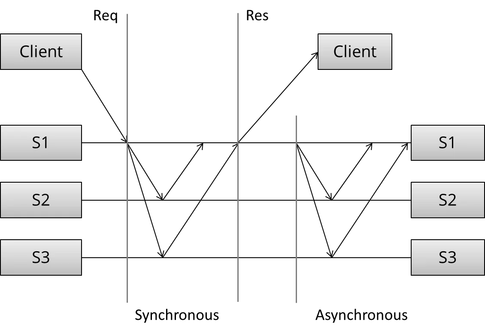
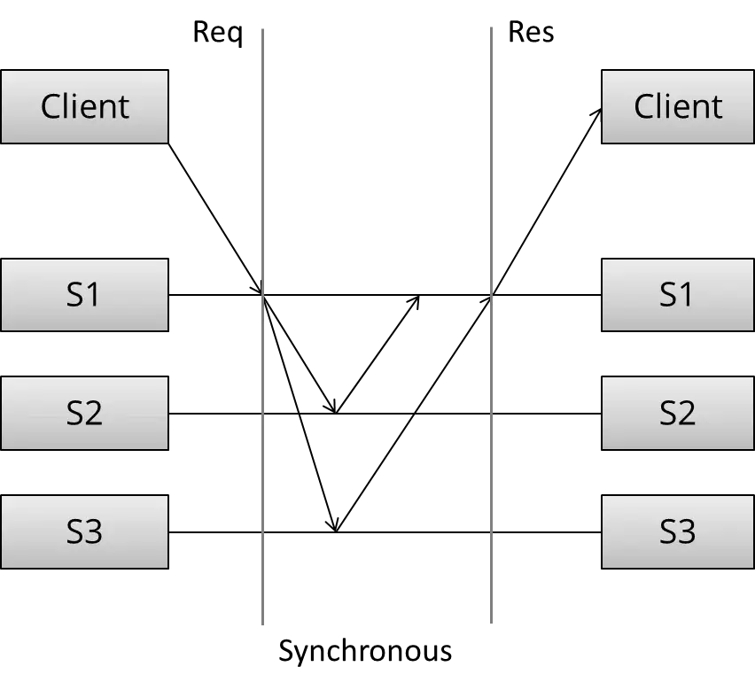
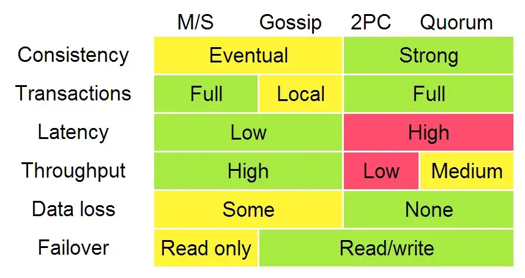
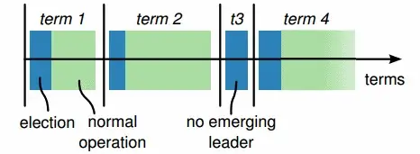

> 《分布式系统：为了乐趣和利益》是一本广受欢迎的资源，用于理解和学习分布式系统。该书由作者 Mikito Takada 撰写，介绍了构建分布式系统的基本概念、原则和挑战。
>
> 这本书涵盖了与分布式系统相关的广泛主题，包括网络、容错性、一致性模型、分布式算法、可扩展性等等。它旨在以清晰易懂的方式解释复杂的概念，适合初学者和有经验的分布式系统从业者阅读。
>
> 在整本书中，作者提供了各种实际案例和案例研究，以说明分布式系统的实际应用和实践方面。它还强调了构建分布式系统涉及的权衡和设计考虑，帮助读者全面理解这个主题。
>
> 《分布式系统：为了乐趣和利益》作为开源资源，可以免费在线获取，非常适合任何对学习分布式系统感兴趣的人。
>
> 原文链接：[Distributed systems: for fun and profit](https://book.mixu.net/distsys/single-page.html)

# 4. 复制

复制问题是分布式系统中的众多问题之一。与诸如领导者选举、故障检测、互斥、共识和全局快照等其他问题相比，我选择关注复制问题，因为这通常是人们最感兴趣的部分。并行数据库在复制特性方面的差异化就是一个例子。此外，复制为许多子问题提供了一个上下文，例如领导者选举、故障检测、共识和原子广播。

复制是一个组通信问题。什么样的安排和通信模式能够满足我们所期望的性能和可用性特性？在面对网络分区和同时节点故障的情况下，我们如何确保容错性、耐久性和非发散性？

同样，有许多方法可以解决复制问题。我在这里采用的方法只是看一下具有复制功能的系统可能具有的高级模式。从可视化的角度来看，有助于将讨论集中在整体模式上，而不是具体涉及的消息传递。我在这里的目标是探索设计空间，而不是解释每个算法的具体细节。

让我们首先定义一下复制是什么样子。我们假设我们有一些初始数据库，并且客户端发出请求来改变数据库的状态。



这种安排和通信模式可以分为几个阶段：

- （请求）客户端向服务器发送请求
- （同步）进行复制的同步部分
- （响应）将响应返回给客户端
- （异步）进行复制的异步部分

根据这些阶段，我们可以创建不同的通信模式。我们选择的模式将对性能和可用性产生影响，具体取决于所选择的算法。

## 同步复制

第一个模式是同步复制（也称为主动复制、急切复制、推送复制或悲观复制）。让我们画出它的示意图：



在这里，我们可以看到三个明显的阶段：首先，客户端发送请求。接下来，我们所称的同步复制的部分发生。这个术语指的是客户端被阻塞 - 等待系统的回复。

在同步阶段期间，第一个服务器会联系其他两个服务器，并等待收到所有其他服务器的回复。最后，它向客户端发送一个响应，告知其结果（例如成功或失败）。

这一切似乎很简单。在不讨论同步阶段算法的细节的情况下，我们能从这个特定的通信模式安排中得出什么结论呢？首先，注意这是一种 N-对-N 的写入方式：在返回响应之前，它必须被系统中的每个服务器看到并确认。

从性能的角度来看，这意味着系统的速度将取决于其中最慢的服务器。该系统还对网络延迟的变化非常敏感，因为它要求在继续之前每个服务器都必须回复。

考虑到 N-对-N 的方式，系统无法容忍任何服务器的丢失。当一个服务器丢失时，系统无法再写入所有节点，因此无法继续进行。在这种设计中，它可能能够对数据提供只读访问，但在节点故障后不允许进行修改。

这种安排可以提供非常强大的耐久性保证：当返回响应时，客户端可以确信所有 N 个服务器都已接收、存储和确认了请求。为了丢失一个已接受的更新，所有 N 个副本都需要丢失，这是一个非常好的保证。

## 异步复制

让我们将其与第二种模式进行对比 - 异步复制（也称为被动复制、拉式复制或惰性复制）。正如您可能已经猜到的，这与同步复制相反：


在这种情况下，主节点（也称为领导者或协调者）立即向客户端返回响应。它最多只会在本地存储更新，但不会同步执行任何重要工作，客户端也不需要等待更多的服务器之间的通信轮次。

在稍后的阶段，复制任务的异步部分发生。在这里，主节点使用某种通信模式联系其他服务器，并更新它们的数据副本。具体的实现取决于所使用的算法。

在不涉及算法细节的情况下，我们对这种具体的安排能得出什么结论呢？嗯，这是一种写 1-对-N 的方式：立即返回响应，更新传播在稍后发生。

从性能的角度来看，这意味着系统很快：客户端不需要额外花费时间等待系统内部完成工作。系统对网络延迟更具容忍性，因为内部延迟的波动不会导致客户端需要额外等待。

这种安排只能提供弱的或概率性的耐久性保证。如果没有出现问题，数据最终会复制到所有 N 台机器上。然而，如果在此之前包含数据的唯一服务器丢失，数据将永久丢失。

考虑到 1-对-N 的方式，只要至少有一个节点正常运行，系统就可以保持可用性（理论上至少如此，但实际上负载可能会太高）。这种纯粹的惰性方式不提供耐久性或一致性保证；你可以向系统写入数据，但如果发生任何故障，不能保证能够读取你所写入的内容。

最后值得注意的是，被动复制无法确保系统中的所有节点始终包含相同的状态。如果在多个位置接受写入操作，并且不要求这些节点同步一致，那么就会存在发散的风险：不同位置的读取可能返回不同的结果（特别是在节点故障和恢复后），并且无法强制执行全局约束（需要与所有人通信）。

我没有详细讨论读取（而不是写入）时的通信模式，因为读取模式实际上是根据写入模式来确定的：在读取过程中，你希望与尽可能少的节点进行联系。我们将在仲裁机制的背景下进一步讨论这个问题。

我们只讨论了两种基本的安排，并没有涉及具体的算法。然而，我们已经能够了解可能的通信模式以及它们的性能、耐久性保证和可用性特性的一些信息。

## 主要复制方法概述

在讨论了同步和异步复制这两种基本复制方法之后，让我们来看一下主要的复制算法。

有很多不同的方式来对复制技术进行分类。在同步与异步之后，我想引入的第二个区别是：

- 防止发散的复制方法（单副本系统）和
- 存在发散风险的复制方法（多主系统）

第一组方法具有“行为像单一系统”的特性。特别是在部分故障发生时，系统确保只有一个副本处于活动状态。此外，系统确保副本始终保持一致。这被称为共识问题。

当多个进程（或计算机）就某个值达成共识时，它们实现了共识。更具体地说：

- 一致性：每个正确的进程必须就同一个值达成一致。
- 完整性：每个正确的进程最多决定一个值，并且如果它决定了某个值，则该值必须由某个进程提出。
- 终止性：所有进程最终都会达成决策。
- 有效性：如果所有正确的进程提议相同的值 V，则所有正确的进程都决定 V。
  互斥、领导者选举、组播和原子广播都是共识问题的更一般实例。维护单一副本一致性的复制系统需要以某种方式解决共识问题。

维护单一副本一致性的复制算法包括：

- 1n 消息（异步主/备份）
- 2n 消息（同步主/备份）
- 4n 消息（两阶段提交，多 Paxos）
- 6n 消息（三阶段提交，带有重复领导者选举的 Paxos）

这些算法在容错性方面有所不同（例如，它们可以容忍的故障类型）。我根据算法执行期间交换的消息数量进行了简单的分类，因为我认为尝试回答“通过增加消息交换我们得到了什么？”这个问题很有趣。

下面的图表，改编自 Google 的 Ryan Barret，描述了不同选项的一些方面：



上述图表中的一致性、延迟、吞吐量、数据丢失和故障转移特性实际上可以追溯到两种不同的复制方法：同步复制（例如，在响应之前等待）和异步复制。当您等待时，性能会变差，但可以获得更强的保证。在讨论分区（和延迟）容忍性时，2PC 和仲裁系统之间的吞吐量差异将变得明显。

在该图表中，强制弱（/最终）一致性的算法被归类为一类（"gossip"）。然而，我将更详细地讨论弱一致性的复制方法 - gossip 和（部分）仲裁系统。"事务"行实际上更多地涉及全局谓词评估，而在具有弱一致性的系统中不支持（尽管可以支持本地谓词评估）。

值得注意的是，强制弱一致性要求的系统拥有较少的通用算法，而更多的是可以选择性应用的技术。由于不强制单副本一致性的系统可以像由多个节点组成的分布式系统一样自由操作，因此修复的目标较少，重点更多地放在为人们提供一种推理系统特性的方式上。

例如：

- 以客户为中心的一致性模型试图提供更可理解的一致性保证，同时允许发散。
- CRDTs（收敛且可交换的复制数据类型）利用某些状态和基于操作的数据类型的半格特性（结合律、交换律、幂等性）。
- 收敛分析（如 Bloom 语言中的分析）利用关于计算单调性的信息来最大程度地利用无序性。
- PBS（概率有界陈旧度）使用模拟和从现实系统收集的信息来表征部分仲裁系统的预期行为。
  接下来，我将稍微介绍所有这些内容，首先让我们来看一下维护单副本一致性的复制算法。

## 主/备份复制

主/备份复制（也称为主副本复制、主从复制或日志传送）可能是最常用的复制方法和最基本的算法。所有更新都在主节点上执行，并通过网络将操作日志（或更改）发送到备份副本。有两种变体：

- 异步主/备份复制
- 同步主/备份复制

同步版本需要两个消息（"更新" + "确认接收"），而异步版本只需要一个消息（"更新"）就可以运行。

主/备份复制非常常见。例如，默认情况下，MySQL 复制使用异步变体。MongoDB 也使用主/备份复制（并附带一些故障转移的额外过程）。所有操作都在一个主服务器上执行，它将它们序列化到本地日志，然后异步地复制到备份服务器。

正如我们在异步复制的背景下讨论过的那样，任何异步复制算法只能提供弱持久性保证。在 MySQL 复制中，这表现为复制延迟：异步备份始终至少落后于主节点一个操作。如果主节点失败，则尚未发送到备份的更新将丢失。

同步主/备份复制的变体确保在返回给客户端之前已将写操作存储在其他节点上，但需要等待其他副本的响应。然而，值得注意的是，即使这个变体也只能提供弱保证。考虑以下简单的故障场景：

- 主节点接收到写操作并将其发送到备份副本。
- 备份副本持久化并确认写操作。
- 然后主节点在发送确认给客户端之前失败。

现在客户端假设提交失败，但备份副本已经提交了它；如果将备份副本提升为主节点，那将是错误的。可能需要手动清理来调和失败的主节点或不一致的备份。

当然，我在这里进行了简化。尽管所有主/备份复制算法都遵循相同的一般消息模式，但它们在故障转移、副本长时间离线等方面的处理方式有所不同。然而，在这种方案中，无法对主节点的不适时故障具有弹性。

在基于日志传送/主/备份的方案中，关键在于它们只能提供尽力而为的保证（例如，如果节点在不适时故障，可能会出现丢失更新或不正确更新的情况）。此外，主/备份方案容易出现分裂脑（split-brain）问题，即由于临时网络问题导致切换到备份，使得主节点和备份同时处于活动状态。

为了防止不适时故障导致一致性保证被违反，我们需要增加另一轮消息交换，这将得到两阶段提交协议（2PC）。

## 两阶段提交（2PC）

[两阶段提交](https://en.wikipedia.org/wiki/Two-phase_commit_protocol)（2PC）是许多经典关系数据库中使用的协议。例如，MySQL Cluster（不要与常规 MySQL 混淆）使用 2PC 提供同步复制。下图说明了消息流：

```
[ Coordinator ] -> OK to commit?     [ Peers ]
                <- Yes / No

[ Coordinator ] -> Commit / Rollback [ Peers ]
                <- ACK
```

在第一阶段（投票阶段）中，协调者将更新发送给所有参与者。每个参与者处理更新并投票决定是否提交或中止。当投票决定提交时，参与者将更新存储在临时区域（预写日志）中。在第二阶段完成之前，更新被视为临时的。

在第二阶段（决策阶段）中，协调者决定最终结果并通知每个参与者。如果所有参与者都投票决定提交，那么更新将从临时区域中取出并变为永久性。

在提交变为永久性之前引入第二阶段是有用的，因为它允许系统在节点故障时回滚更新。相比之下，在主/备份（"1PC"）中，没有回滚操作的步骤，因此在一些节点上失败而在其他节点上成功的操作可能导致副本发散。

两阶段提交容易受到阻塞的影响，因为单个节点故障（参与者或协调者）会阻塞进展，直到节点恢复。在第二阶段期间，由于其他节点被告知系统状态，因此通常可以进行恢复。请注意，两阶段提交假设每个节点的稳定存储数据永远不会丢失，并且没有节点永久崩溃。如果稳定存储中的数据在崩溃时损坏，仍然可能发生数据丢失。

有关节点故障期间的恢复程序的详细信息非常复杂，所以我不会详细介绍。主要任务包括确保写入磁盘是持久的（例如，刷新到磁盘而不是缓存）以及确保进行正确的恢复决策（例如，了解轮次的结果，然后本地重新执行或撤消更新）。

正如我们在有关 CAP 的章节中了解到的那样，两阶段提交是 CA（一致性和可用性）的，而不是分区容忍性。两阶段提交所涉及的故障模型不包括网络分区；从一个节点故障中恢复的规定方法是等待网络分区恢复。没有安全的方式来提升新的协调者如果一个失败；相反，需要手动干预。两阶段提交对延迟也非常敏感，因为它是一个写 N-of-N 的方法，在最慢的节点确认之前无法进行写入。

两阶段提交在性能和容错性之间取得了很好的平衡，这就是为什么它在关系数据库中非常流行的原因。然而，较新的系统通常使用具有分区容忍性的共识算法，因为这种算法可以提供从临时网络分区自动恢复以及更优雅地处理节点之间延迟增加的能力。

让我们接下来看一下分区容忍的共识算法。

## 分区容忍共识算法

分区容忍的共识算法是我们在维护单副本一致性方面所能达到的最高容错算法。还有一类更进一步的容错算法：能够容忍任意[（拜占庭）故障](https://en.wikipedia.org/wiki/Byzantine_fault_tolerance)的算法；这些故障包括以恶意方式运作的节点。这类算法在商业系统中很少使用，因为它们的运行成本更高，实现起来更复杂，因此我将不对其进行介绍。

当涉及到分区容忍的共识算法时，最著名的算法是 Paxos 算法。然而，Paxos 算法以其难以实现和解释而闻名，因此我将重点介绍 Raft 算法，这是一种较新的（约于 2013 年初）旨在易于教学和实现的算法。让我们首先看一下网络分区以及分区容忍的共识算法的一般特点。

### 什么是网络分区？

网络分区是指网络链路对一个或多个节点的故障。节点本身继续保持活动状态，甚至可以接收来自网络分区一侧的客户端请求。正如我们之前在讨论 CAP 定理时了解到的那样，网络分区确实会发生，而不是所有系统都能优雅地处理它们。

网络分区很棘手，因为在网络分区期间，无法区分远程节点的故障和节点的不可访问性。如果发生网络分区但没有节点故障，那么系统将分为两个同时活动的分区。下面的两个图示展示了网络分区如何与节点故障类似。

两个节点的系统，一个是故障，一个是网络分区：


具有 3 个节点的系统，出现故障与网络分区：


强制执行单副本一致性的系统必须有一种方法来打破对称性，否则它将分裂为两个独立的系统，这些系统可能会发散，并且无法再保持单副本的幻象。

对于强制执行单副本一致性的系统来说，网络分区容忍要求在网络分区期间，只有系统的一个分区保持活动状态，因为在网络分区期间无法防止发散（例如，CAP 定理）的发生。

### 多数决定

这就是为什么分区容忍的共识算法依赖多数投票。要求大多数节点（而不是全部节点，如 2PC 中的情况）对更新达成一致意见，可以容忍少数节点故障、运行缓慢或由于网络分区而无法访问的情况。只要有（N/2 + 1）个或更多的节点正常运行并可访问，系统就可以继续运行。

分区容忍的共识算法使用奇数个节点（例如 3、5 或 7）。如果只有两个节点，发生故障后就无法形成明确的多数。例如，如果节点数为三，那么系统可以容忍一个节点故障；如果有五个节点，那么系统可以容忍两个节点故障。

当发生网络分区时，不同分区的行为是不对称的。一个分区将包含大多数节点，而少数分区将停止处理操作，以防止在网络分区期间发生发散，但是多数分区可以保持活动状态。这确保只有系统状态的单个副本保持活动。

多数投票也有助于容忍不同意见：如果发生干扰或故障，节点可能会投票出现不同的结果。然而，由于只能有一个多数决策，临时的不一致最多只能阻塞协议的继续进行（放弃活性），但不能违反单副本一致性准则（安全性属性）。

### 角色

系统可以采用两种方式进行结构化：所有节点可以具有相同的责任，或者节点可以具有独立的、不同的角色。

复制的共识算法通常选择为每个节点分配不同的角色。拥有单个固定的领导者或主服务器是一种优化，可以使系统更高效，因为我们知道所有的更新都必须通过该服务器进行。非领导者节点只需将其请求转发给领导者。

需要注意的是，拥有不同的角色并不意味着系统无法从领导者（或任何其他角色）的故障中恢复。即使在正常操作期间角色是固定的，也并不意味着在故障发生后不能通过重新分配角色（例如通过领导者选举阶段）来恢复。节点可以重复使用领导者选举的结果，直到发生节点故障和/或网络分区。

Paxos 和 Raft 都使用了不同的节点角色。特别是，它们都有一个领导者节点（Paxos 中称为"proposer"），负责在正常操作期间进行协调。在正常操作期间，其余的节点是跟随者（Paxos 中的"acceptors"或"voters"）。

### 纪元

每个正常运行期间在 Paxos 和 Raft 中被称为一个时代（在 Raft 中称为"term"）。在每个时代中，只有一个节点被指定为领导者（类似的系统在日本被用于天皇继位时更换年号）。



选举成功后，同一领导者将协调工作直到时代结束。如 Raft 论文中所示的图表，有些选举可能会失败，导致时代立即结束。

时代充当逻辑时钟的作用，允许其他节点识别过时节点开始通信的时间。那些被划分或处于停止运行状态的节点将具有较小的时代编号，其命令将被忽略。

### 通过决斗更换领导者

在正常运行期间，具有分区容错性的共识算法相对较简单。正如之前所看到的，如果我们不关心容错性，可以使用两阶段提交（2PC）。大部分复杂性实际上是由于确保一旦达成共识决策，它将不会丢失，并且协议能够处理由于网络或节点故障而引起的领导者更改。

所有节点最初都是跟随者；在开始时选举一个节点成为领导者。在正常运行期间，领导者会发送心跳信号，以便跟随者可以检测到领导者是否失效或分区。

当节点检测到领导者变为无响应状态（或在初始情况下没有领导者存在），它将切换到一个中间状态（在 Raft 中称为"candidate"），此时它会将时代/轮次值增加一，并发起领导者选举并竞争成为新的领导者。

为了当选为领导者，一个节点必须获得大多数的选票。一种分配选票的方法是简单地按照先到先得的原则进行分配；这样，最终会选出一个领导者。在尝试当选时添加随机的等待时间可以减少同时尝试当选的节点数量。

### 一个纪元内的编号提案

在每个时期，领导者每次都会提出一个值进行投票。在每个时期内，每个提案都使用唯一的严格递增的编号进行编号。追随者（投票者/接受者）接受他们收到的针对特定提案编号的第一个提案。

### 正常运行期

在正常运行期间，所有提案都通过领导者节点进行处理。当客户端提交一个提案（例如更新操作）时，领导者会联系配额中的所有节点。如果没有竞争性的提案存在（基于跟随者的响应），领导者提出该值。如果大多数跟随者接受该值，那么该值被视为已接受。

由于可能有另一个节点也在尝试充当领导者，我们需要确保一旦一个提案被接受，其值就不能改变。否则，已经被接受的提案可能会被竞争对手领导者撤销。Lamport 将此规定为：

> P2：如果选择了一个值为 v 的提案，那么被选择的每个更高编号的提案都具有值 v。

确保该属性成立要求跟随者和提议者都受到算法的约束，不能改变已被大多数接受的值。注意，“值永远不会改变”是指协议的单个执行（或运行/实例/决策）的值。典型的复制算法将运行多个算法的执行，但大多数关于算法的讨论都集中在单个运行上，以保持简单。我们希望防止决策历史被修改或覆盖。

为了强制执行这个属性，提议者必须首先向跟随者询问它们（最高编号的）已接受的提案和值。如果提议者发现已经存在一个提案，那么它必须简单地完成该协议的执行，而不是提出自己的提案。Lamport 将此规定为：

> P2b. 如果选择了一个值为 v 的提案，那么由任何提议者发出的每个更高编号的提案都具有值 v。

更具体地说：

> P2c. 对于任何 v 和 n，如果一个值为 v 且编号为 n 的提案被发出（由领导者），那么存在一个由大多数接受者（跟随者）组成的集合 S，其中要么（a）S 中的没有接受任何编号小于 n 的提案的接受者，要么（b）v 是 S 中的跟随者接受的所有编号小于 n 的提案中最高编号提案的值。

这是 Paxos 算法以及从中衍生的算法的核心。要提出的值直到协议的第二阶段才会被选择。为了确保安全性（例如 P2c 中的 b 条款），提议者有时必须简单地重传先前做出的决策，直到达到一个他们知道可以自由提出自己的提案值的点（例如 P2c 中的 a 条款）。

如果存在多个先前的提案，则提议的是最高编号的提案值。只有在没有竞争性提案的情况下，提议者才可以尝试施加自己的值。

为了确保在提议者询问每个接受者其最新值之间不会出现竞争性提案，提议者要求跟随者不接受低于当前提案编号的提案。

将这些部分整合在一起，使用 Paxos 达成决策需要两轮通信：

```
[ Proposer ] -> Prepare(n)                                [ Followers ]
             <- Promise(n; previous proposal number
                and previous value if accepted a
                proposal in the past)

[ Proposer ] -> AcceptRequest(n, own value or the value   [ Followers ]
                associated with the highest proposal number
                reported by the followers)
                <- Accepted(n, value)
```

准备阶段允许提议者了解任何竞争或先前的提案。第二阶段是提出新值或先前接受的值的阶段。在某些情况下，比如同时存在两个提议者（竞争），消息丢失，或者大多数节点发生故障时，没有提案被大多数接受。但这是可以接受的，因为关于提出哪个值的决策规则会趋向于收敛到一个值（上一次尝试中具有最高提案编号的值）。

的确，根据 FLP 不可能性结果，这是我们能做到的最好的：解决共识问题的算法在消息传递的界限不满足时，必须在安全性和活性之间做出权衡。Paxos 放弃了活性：它可能不得不无限期地延迟决策，直到没有竞争的领导者，并且大多数节点接受提案。这比违反安全性保证要好。

当然，实现这个算法要比听起来的要困难得多。即使在专家的手中，许多小问题加在一起也会形成相当大量的代码。这些问题包括：

- 实际优化：
  - 通过领导租约（而不是心跳）避免重复的领导者选举
  - 在处于稳定状态且领导者身份不变的情况下避免重复的提出消息
- 确保跟随者和提议者不会丢失稳定存储中的项目，并且稳定存储中的结果不会被细微损坏（例如磁盘损坏）
- 以安全方式启用群集成员资格的更改（例如，基本的 Paxos 依赖于大多数节点总是在一个节点中相交，如果成员资格可以任意更改，则不成立）
- 在崩溃、磁盘丢失或新节点供应时以安全高效的方式使新副本保持最新
- 在一段合理的时间后对保证安全性所需的数据进行快照和垃圾回收的程序（例如，平衡存储需求和容错需求）
  Google 的《Paxos Made Live》论文详细介绍了其中的一些挑战。

## 分区容忍共识算法：Paxos、Raft、ZAB

希望这些信息让你对容错共识算法的工作原理有了一定的了解。我鼓励你阅读进一步阅读部分中的其中一篇论文，以更好地了解不同算法的具体细节。

Paxos：Paxos 是编写强一致性容错复制系统时最重要的算法之一。它被广泛应用于谷歌的许多系统中，包括 BigTable/Megastore 使用的 Chubby 锁管理器、Google 文件系统以及 Spanner。

Paxos 的名称来自希腊岛屿帕克索斯，最初由 Leslie Lamport 在 1998 年的一篇名为《兼职议会》的论文中提出。人们通常认为 Paxos 的实现很困难，因此有一系列来自在分布式系统领域具有相当经验的公司的论文，进一步解释了实际细节（请参阅进一步阅读部分）。你可能会想阅读 Lamport 在此问题上的评论（链接 1 和链接 2）。

这些问题主要与 Paxos 被描述为一轮共识决策相关，但实际的工作实施通常希望能够高效地运行多轮共识。这导致了许多对核心协议的扩展的开发，任何想构建基于 Paxos 的系统的人都需要理解这些扩展。此外，还存在其他实际挑战，例如如何实现集群成员资格的变更。

ZAB：ZAB（Zookeeper Atomic Broadcast）协议在 Apache Zookeeper 中使用。Zookeeper 是一个为分布式系统提供协调原语的系统，许多以 Hadoop 为中心的分布式系统用于协调（例如 HBase、Storm、Kafka）。Zookeeper 基本上是开源社区对 Chubby 的实现。从技术上讲，原子广播是一个与纯共识不同的问题，但它仍属于确保强一致性的容错算法的范畴。

Raft：Raft 是这类算法的最新成员（于 2013 年提出）。它的设计目标是比 Paxos 更容易教授，同时提供相同的保证。特别是，该算法的不同部分更清晰地分离，论文还描述了一种集群成员资格变更的机制。最近，etcd 在受到 ZooKeeper 的启发下开始采用 Raft。

## 强一致性的复制方法

在本章中，我们研究了强一致性的复制方法。从同步工作和异步工作的对比开始，逐步介绍了能够容忍越来越复杂故障的算法。以下是每个算法的一些关键特点：

- 主/备份

  - 单个固定的主节点
  - 复制日志，从节点不参与执行操作
  - 没有对复制延迟设置界限
  - 不具备容错性，不支持分区容忍性
  - 手动/临时故障转移，不具备容错性，热备份

- 2PC（两阶段提交）

  - 全体投票：提交或中止
  - 静态主节点
  - 2PC 无法在协调者和节点在提交期间同时发生故障时生存
  - 不具备容错性，对尾延迟敏感

- Paxos
  - 多数派投票
  - 动态主节点
  - 作为协议的一部分，能够容忍 n/2-1 同时发生的故障
  - 对尾延迟不太敏感

---

## 进一步阅读

#### 主备和 2PC

- [Replication techniques for availability](https://scholar.google.com/scholar?q=Replication+techniques+for+availability) - Robbert van Renesse & Rachid Guerraoui, 2010
- [Concurrency Control and Recovery in Database Systems](http://research.microsoft.com/en-us/people/philbe/ccontrol.aspx)

#### Paxos

- [The Part-Time Parliament](http://research.microsoft.com/users/lamport/pubs/lamport-paxos.pdf) - Leslie Lamport
- [Paxos Made Simple](http://research.microsoft.com/users/lamport/pubs/paxos-simple.pdf) - Leslie Lamport, 2001
- [Paxos Made Live - An Engineering Perspective](https://research.google.com/archive/paxos_made_live.html) - Chandra et al
- [Paxos Made Practical](https://scholar.google.com/scholar?q=Paxos+Made+Practical) - Mazieres, 2007
- [Revisiting the Paxos Algorithm](http://groups.csail.mit.edu/tds/paxos.html) - Lynch et al
- [How to build a highly available system with consensus](http://research.microsoft.com/lampson/58-Consensus/Acrobat.pdf) - Butler Lampson
- [Reconfiguring a State Machine](http://research.microsoft.com/en-us/um/people/lamport/pubs/reconfiguration-tutorial.pdf) - Lamport et al - changing cluster membership
- [Implementing Fault-Tolerant Services Using the State Machine Approach: a Tutorial](http://citeseer.ist.psu.edu/viewdoc/summary?doi=10.1.1.20.4762) - Fred Schneider

#### Raft and ZAB

- [In Search of an Understandable Consensus Algorithm](https://ramcloud.stanford.edu/wiki/download/attachments/11370504/raft.pdf), Diego Ongaro, John Ousterhout, 2013
- [Raft Lecture - User Study](https://www.youtube.com/watch?v=YbZ3zDzDnrw)
- [A simple totally ordered broadcast protocol](http://labs.yahoo.com/publication/a-simple-totally-ordered-broadcast-protocol/) - Junqueira, Reed, 2008
- [ZooKeeper Atomic Broadcast](http://labs.yahoo.com/publication/zab-high-performance-broadcast-for-primary-backup-systems/) - Reed, 2011
