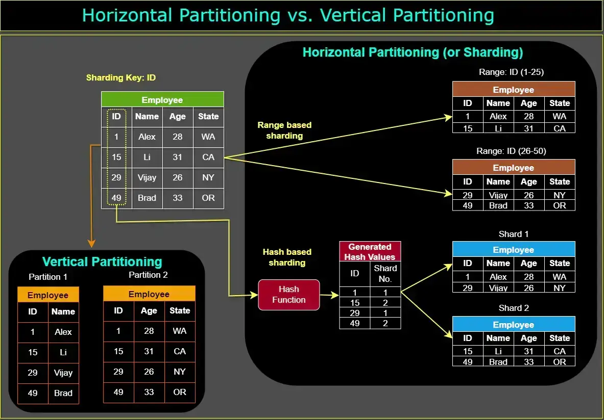
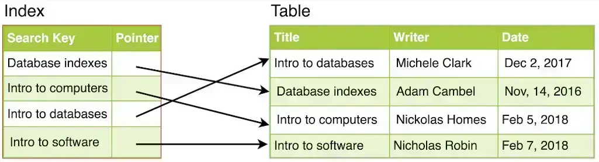

这是一篇双语翻译的文章，原文出自《Grokking the System Design Interview》教程的 [System Design Master Template](https://www.designgurus.io/course-play/grokking-the-system-design-interview/doc/645d5161fff33a24ccce4bb1) 这篇章节。

---

System design interviews are unstructured by design. In these interviews, you are asked to take on an open-ended design problem that doesn’t have a standard solution.

> 系统设计面试在设计上是非结构化的。在这些面试中，您被要求解决一个没有标准解决方案的开放式设计问题。

The two biggest challenges of answering a system design interview question are:

> 回答系统设计面试问题的两个最大挑战是：

1. To know where to start.
  
   > 知道从哪里开始。
2. To know if you have talked about all the important parts of the system.
  
   > 了解您是否已经讨论过系统的所有重要部分。

To simplify this process, the course offers a comprehensive system design template that can effectively guide you in addressing any system design interview question.

> 为了简化这个过程，本课程提供了一个全面的系统设计模板，可以有效地指导您解决任何系统设计面试问题。

Have a look at the following image to understand the major components that could be part of any system design and how these components interact with each other.
查看下图，了解可能成为任何系统设计一部分的主要组件以及这些组件如何相互交互。

With this master template in mind, we will discuss the 18 essential system design concepts. Here is a brief description of each:

> 考虑到这个主模板，我们将讨论 18 个基本的系统设计概念。以下是每项的简要说明：

## 1. Domain Name System (DNS) 

> 1.域名系统（DNS）

The Domain Name System (DNS) serves as a fundamental component of the internet infrastructure, translating user-friendly domain names into their corresponding IP addresses. It acts as a phonebook for the internet, enabling users to access websites and services by entering easily memorable domain names, such as [www.designgurus.io](http://www.designgurus.io/), rather than the numerical IP addresses like "192.0.2.1" that computers utilize to identify each other.

> 域名系统 (DNS) 是互联网基础设施的基本组成部分，它将用户友好的域名转换为其相应的 IP 地址。它充当互联网的电话簿，使用户能够通过输入易于记忆的域名（例如 www.designgurus.io）来访问网站和服务，而不是计算机用来识别彼此的数字 IP 地址（例如“192.0.2.1”） 。

When you input a domain name into your web browser, the DNS is responsible for finding the associated IP address and directing your request to the appropriate server. This process commences with your computer sending a query to a recursive resolver, which then searches a series of DNS servers, beginning with the root server, followed by the Top-Level Domain (TLD) server, and ultimately the authoritative name server. Once the IP address is located, the recursive resolver returns it to your computer, allowing your browser to establish a connection with the target server and access the desired content.

> 当您在网络浏览器中输入域名时，DNS 负责查找关联的 IP 地址并将您的请求定向到适当的服务器。此过程首先是您的计算机向递归解析器发送查询，然后递归解析器搜索一系列 DNS 服务器，从根服务器开始，然后是顶级域 (TLD) 服务器，最后是权威名称服务器。一旦找到 IP 地址，递归解析器会将其返回到您的计算机，从而允许您的浏览器与目标服务器建立连接并访问所需的内容。

## 2. Load Balancer 

> 2.负载均衡器

A load balancer is a networking device or software designed to distribute incoming network traffic across multiple servers, ensuring optimal resource utilization, reduced latency, and maintained high availability. It plays a crucial role in scaling applications and efficiently managing server workloads, particularly in situations where there is a sudden surge in traffic or uneven distribution of requests among servers.

> 负载均衡器是一种网络设备或软件，旨在跨多个服务器分配传入的网络流量，确保最佳的资源利用率、减少延迟并保持高可用性。它在扩展应用程序和有效管理服务器工作负载方面发挥着至关重要的作用，特别是在流量突然激增或服务器之间请求分布不均匀的情况下。

Load balancers employ various algorithms to determine the distribution of incoming traffic. Some common algorithms include:

> 负载均衡器采用各种算法来确定传入流量的分配。一些常见的算法包括：

- **Round Robin:** Requests are sequentially and evenly distributed across all available servers in a cyclical manner.
  
  > 循环：请求以循环方式顺序均匀地分布在所有可用服务器上。
- **Least Connections:** The load balancer assigns requests to the server with the fewest active connections, giving priority to less-busy servers.
  
  > 最少连接：负载均衡器将请求分配给活动连接最少的服务器，并优先考虑不太繁忙的服务器。
- **IP Hash:** The client's IP address is hashed, and the resulting value is used to determine which server the request should be directed to. This method ensures that a specific client's requests are consistently routed to the same server, helping maintain session persistence.
  
  > IP 哈希：对客户端的 IP 地址进行哈希处理，结果值用于确定请求应定向到哪个服务器。此方法可确保特定客户端的请求一致路由到同一服务器，从而有助于维护会话持久性。

## 3. API Gateway 

> 3.API网关

An API Gateway serves as a server or service that functions as an intermediary between external clients and the internal microservices or API-based backend services of an application. It is a vital component in contemporary architectures, particularly in microservices-based systems, where it streamlines the communication process and offers a single entry point for clients to access various services.

> API 网关充当服务器或服务，充当外部客户端与应用程序的内部微服务或基于 API 的后端服务之间的中介。它是当代架构中的重要组成部分，特别是在基于微服务的系统中，它简化了通信流程，并为客户端访问各种服务提供了单一入口点。

The primary functions of an API Gateway encompass:

> API网关的主要功能包括：

1. Request Routing: The API Gateway directs incoming API requests from clients to the appropriate backend service or microservice, based on predefined rules and configurations.
  
   > 请求路由：API 网关根据预定义的规则和配置，将来自客户端的传入 API 请求定向到适当的后端服务或微服务。
2. Authentication and Authorization: The API Gateway manages user authentication and authorization, ensuring that only authorized clients can access the services. It verifies API keys, tokens, or other credentials before routing requests to the backend services.
  
   > 身份验证和授权：API网关管理用户身份验证和授权，确保只有授权的客户端才能访问服务。它在将请求路由到后端服务之前验证 API 密钥、令牌或其他凭据。
3. Rate Limiting and Throttling: To safeguard backend services from excessive load or abuse, the API Gateway enforces rate limits or throttles requests from clients according to predefined policies.
  
   > 速率限制和节流：为了保护后端服务免受过度负载或滥用，API 网关根据预定义的策略强制执行速率限制或节流来自客户端的请求。
4. Caching: In order to minimize latency and backend load, the API Gateway caches frequently-used responses, serving them directly to clients without the need to query the backend services.
  
   > 缓存：为了最大程度地减少延迟和后端负载，API 网关会缓存常用的响应，将其直接提供给客户端，而无需查询后端服务。
5. Request and Response Transformation: The API Gateway can modify requests and responses, such as converting data formats, adding or removing headers, or altering query parameters, to ensure compatibility between clients and services.
  
   > 请求和响应转换：API网关可以修改请求和响应，例如转换数据格式、添加或删除标头或更改查询参数，以确保客户端和服务之间的兼容性。

## 4. CDN 

>4.CDN

A Content Delivery Network (CDN) is a distributed network of servers that store and deliver content, such as images, videos, stylesheets, and scripts, to users from locations that are geographically closer to them. CDNs are designed to enhance the performance, speed, and reliability of content delivery to end-users, irrespective of their location relative to the origin server. Here's how a CDN operates:

> 内容交付网络 (CDN) 是一种分布式服务器网络，用于存储并向地理位置较近的用户交付内容（例如图像、视频、样式表和脚本）。 CDN 旨在增强向最终用户交付内容的性能、速度和可靠性，无论其相对于源服务器的位置如何。 CDN 的运作方式如下：

1. When a user requests content from a website or application, the request is directed to the nearest CDN server, also known as an edge server.
  
   > 当用户从网站或应用程序请求内容时，请求将被定向到最近的 CDN 服务器（也称为边缘服务器）。
2. If the edge server has the requested content cached, it directly serves the content to the user. This process reduces latency and improves the user experience, as the content travels a shorter distance.
  
   > 如果边缘服务器缓存了所请求的内容，则它直接向用户提供内容。由于内容传输的距离较短，因此此过程减少了延迟并改善了用户体验。
3. If the content is not cached on the edge server, the CDN retrieves it from the origin server or another nearby CDN server. Once the content is fetched, it is cached on the edge server and served to the user.
  
   > 如果内容未缓存在边缘服务器上，则 CDN 会从源服务器或其他附近的 CDN 服务器检索内容。获取内容后，它会缓存在边缘服务器上并提供给用户。
4. To ensure the content stays up-to-date, the CDN periodically checks the origin server for changes and updates its cache accordingly.
  
   > 为了确保内容保持最新，CDN 定期检查源服务器是否有更改并相应更新其缓存。

## 5. Forward Proxy vs. Reverse Proxy 

>5. 正向代理与反向代理

A forward proxy, also referred to as a "proxy server" or simply "proxy," is a server positioned in front of one or more client machines, acting as an intermediary between the clients and the internet. When a client machine requests a resource on the internet, the request is initially sent to the forward proxy. The forward proxy then forwards the request to the internet on behalf of the client machine and returns the response to the client machine.

> 转发代理也称为“代理服务器”或简称为“代理”，是位于一台或多台客户端计算机前面的服务器，充当客户端和互联网之间的中介。当客户端计算机请求互联网上的资源时，该请求最初被发送到转发代理。然后，转发代理代表客户端计算机将请求转发到互联网，并将响应返回到客户端计算机。

On the other hand, a reverse proxy is a server that sits in front of one or more web servers, serving as an intermediary between the web servers and the internet. When a client requests a resource on the internet, the request is first sent to the reverse proxy. The reverse proxy then forwards the request to one of the web servers, which returns the response to the reverse proxy. Finally, the reverse proxy returns the response to the client.

> 另一方面，反向代理是位于一个或多个 Web 服务器前面的服务器，充当 Web 服务器和互联网之间的中介。当客户端请求互联网上的资源时，请求首先发送到反向代理。然后，反向代理将请求转发到其中一台 Web 服务器，该服务器将响应返回给反向代理。最后，反向代理将响应返回给客户端。

## 6. Caching 

>6. 缓存

Cache is a high-speed storage layer positioned between the application and the original data source, such as a database, file system, or remote web service. When an application requests data, the cache is checked first. If the data is present in the cache, it is returned to the application. If the data is not found in the cache, it is retrieved from its original source, stored in the cache for future use, and then returned to the application. In a distributed system, caching can occur in multiple locations, including the client, DNS, CDN, load balancer, API gateway, server, database, and more.

> 缓存是位于应用程序和原始数据源（例如数据库、文件系统或远程 Web 服务）之间的高速存储层。当应用程序请求数据时，首先检查缓存。如果数据存在于缓存中，则将其返回给应用程序。如果在缓存中找不到数据，则会从原始来源检索该数据，将其存储在缓存中以供将来使用，然后返回给应用程序。在分布式系统中，缓存可以发生在多个位置，包括客户端、DNS、CDN、负载均衡器、API 网关、服务器、数据库等。

## 7. Data Partitioning 

>7. 数据分区

In a database, **horizontal partitioning**, often referred to as **sharding**, entails dividing the rows of a table into smaller tables and storing them on distinct servers or database instances. This method is employed to distribute the database load across multiple servers, thereby enhancing performance.

> 在数据库中，水平分区（通常称为分片）需要将表的行划分为更小的表，并将它们存储在不同的服务器或数据库实例上。该方法用于将数据库负载分散到多个服务器上，从而提高性能。

Conversely, **vertical partitioning** involves splitting the columns of a table into separate tables. This technique aims to reduce the column count in a table and boost the performance of queries that only access a limited number of columns.

> 相反，垂直分区涉及将表的列拆分为单独的表。该技术旨在减少表中的列数并提高仅访问有限数量列的查询的性能。

## 8. Database Replication 

>8. 数据库复制

Database replication is a method employed to maintain multiple copies of the same database across various servers or locations. The main objective of database replication is to enhance data availability, redundancy, and fault tolerance, ensuring the system remains operational even in the face of hardware failures or other issues.

> 数据库复制是一种用于跨不同服务器或位置维护同一数据库的多个副本的方法。数据库复制的主要目标是增强数据可用性、冗余和容错能力，确保系统即使在遇到硬件故障或其他问题时也能保持运行。

In a replicated database configuration, one server serves as the primary (or master) database, while others act as replicas (or slaves). This process involves synchronizing data between the primary database and replicas, ensuring all possess the same up-to-date information. Database replication provides several advantages, including:

> 在复制数据库配置中，一台服务器充当主（或主）数据库，而其他服务器充当副本（或从）数据库。此过程涉及在主数据库和副本之间同步数据，确保所有数据库都拥有相同的最新信息。数据库复制具有多种优势，包括：

1. Improved Performance: By distributing read queries among multiple replicas, the load on the primary database can be reduced, leading to faster query response times.
  
   > 提高性能：通过在多个副本之间分配读取查询，可以减少主数据库上的负载，从而加快查询响应时间。
2. High Availability: If the primary database experiences failure or downtime, replicas can continue to provide data, ensuring uninterrupted access to the application.
  
   > 高可用性：如果主数据库出现故障或停机，副本可以继续提供数据，确保对应用程序的不间断访问。
3. Enhanced Data Protection: Maintaining multiple copies of the database across different locations helps safeguard against data loss due to hardware failures or other disasters.
  
   > 增强的数据保护：在不同位置维护数据库的多个副本有助于防止由于硬件故障或其他灾难而导致的数据丢失。
4. Load Balancing: Replicas can handle read queries, allowing for better load distribution and reducing overall stress on the primary database.
  
   > 负载平衡：副本可以处理读取查询，从而实现更好的负载分配并减少主数据库的整体压力。

## 9. Distributed Messaging Systems 

>9.分布式消息系统

Distributed messaging systems provide a reliable, scalable, and fault-tolerant means for exchanging messages between numerous, possibly geographically-dispersed applications, services, or components. These systems facilitate communication by decoupling sender and receiver components, enabling them to develop and function independently. Distributed messaging systems are especially valuable in large-scale or intricate systems, like those seen in microservices architectures or distributed computing environments. Examples of these systems include Apache Kafka and RabbitMQ.

> 分布式消息传递系统提供了一种可靠、可扩展且容错的方式，用于在众多可能在地理上分散的应用程序、服务或组件之间交换消息。这些系统通过解耦发送器和接收器组件来促进通信，使它们能够独立开发和运行。分布式消息传递系统在大规模或复杂的系统中尤其有价值，例如微服务架构或分布式计算环境中的系统。这些系统的示例包括 Apache Kafka 和 RabbitMQ。

## 10. Microservices 

> 10. 微服务

Microservices represent an architectural style wherein an application is organized as an assembly of small, loosely-coupled, and autonomously deployable services. Each microservice is accountable for a distinct aspect of functionality or domain within the application and communicates with other microservices via well-defined APIs. This method deviates from the conventional monolithic architecture, where an application is constructed as a single, tightly-coupled unit.

> 微服务代表了一种架构风格，其中应用程序被组织为小型、松散耦合且可自主部署的服务的集合。每个微服务负责应用程序内功能或领域的不同方面，并通过定义良好的 API 与其他微服务进行通信。此方法不同于传统的整体架构，在传统的整体架构中，应用程序被构建为单个紧密耦合的单元。

The primary characteristics of microservices include:

> 微服务的主要特征包括：

1. Single Responsibility: Adhering to the Single Responsibility Principle, each microservice focuses on a specific function or domain, making the services more straightforward to comprehend, develop, and maintain.
  
   > 单一职责：遵循单一职责原则，每个微服务都专注于特定的功能或领域，使服务更易于理解、开发和维护。
2. Independence: Microservices can be independently developed, deployed, and scaled, offering increased flexibility and agility in the development process. Teams can work on various services simultaneously without impacting the entire system.
  
   > 独立性：微服务可以独立开发、部署和扩展，从而提高开发过程的灵活性和敏捷性。团队可以同时处理各种服务，而不会影响整个系统。
3. Decentralization: Typically, microservices are decentralized, with each service possessing its data and business logic. This approach fosters separation of concerns and empowers teams to make decisions and select technologies tailored to their unique requirements.
  
   > 去中心化：通常，微服务是去中心化的，每个服务都拥有自己的数据和业务逻辑。这种方法促进了关注点分离，并使团队能够做出决策并选择适合其独特需求的技术。
4. Communication: Microservices interact with each other using lightweight protocols, such as HTTP/REST, gRPC, or message queues. This fosters interoperability and facilitates the integration of new services or the replacement of existing ones.
  
   > 通信：微服务使用轻量级协议（例如 HTTP/REST、gRPC 或消息队列）相互交互。这促进了互操作性并促进新服务的集成或现有服务的替换。
5. Fault Tolerance: As microservices are independent, the failure of one service does not necessarily result in the collapse of the entire system, enhancing the application's overall resiliency.
  
   > 容错性：由于微服务是独立的，一个服务的故障并不一定会导致整个系统崩溃，增强了应用程序的整体弹性。

## 11. NoSQL Databases 

>11.NoSQL 数据库

[NoSQL databases](https://www.designgurus.io/blog/no-slq-database), or “Not Only SQL” databases, are non-relational databases designed to store, manage, and retrieve unstructured or semi-structured data. They offer an alternative to traditional relational databases, which rely on structured data and predefined schemas. NoSQL databases have become popular due to their flexibility, scalability, and ability to handle large volumes of data, making them well-suited for modern applications, big data processing, and real-time analytics.

> NoSQL 数据库或“Not Only SQL”数据库是非关系数据库，旨在存储、管理和检索非结构化或半结构化数据。它们提供了传统关系数据库的替代方案，传统关系数据库依赖于结构化数据和预定义模式。 NoSQL 数据库因其灵活性、可扩展性和处理大量数据的能力而变得流行，使其非常适合现代应用程序、大数据处理和实时分析。

NoSQL databases can be categorized into four main types:

> NoSQL 数据库可分为四种主要类型：

1. Document-Based: These databases store data in document-like structures, such as JSON or BSON. Each document is self-contained and can have its own unique structure, making them suitable for handling heterogeneous data. Examples of document-based NoSQL databases include MongoDB and Couchbase.
  
   > 基于文档：这些数据库以类似文档的结构存储数据，例如 JSON 或 BSON。每个文档都是独立的，可以有自己独特的结构，使它们适合处理异构数据。基于文档的 NoSQL 数据库的示例包括 MongoDB 和 Couchbase。
2. Key-Value: These databases store data as key-value pairs, where the key acts as a unique identifier, and the value holds the associated data. Key-value databases are highly efficient for simple read and write operations, and they can be easily partitioned and scaled horizontally. Examples of key-value NoSQL databases include Redis and Amazon DynamoDB.
  
   > 键值：这些数据库将数据存储为键值对，其中键充当唯一标识符，值保存关联的数据。键值数据库对于简单的读写操作非常高效，并且可以轻松地进行分区和水平扩展。键值 NoSQL 数据库的示例包括 Redis 和 Amazon DynamoDB。
3. Column-Family: These databases store data in column families, which are groups of related columns. They are designed to handle write-heavy workloads and are highly efficient for querying data with a known row and column keys. Examples of column-family NoSQL databases include Apache Cassandra and HBase.
  
   > 列族：这些数据库将数据存储在列族中，列族是相关列的组。它们旨在处理写入繁重的工作负载，并且对于使用已知的行键和列键查询数据非常高效。列族 NoSQL 数据库的示例包括 Apache Cassandra 和 HBase。
4. Graph-Based: These databases are designed for storing and querying data that has complex relationships and interconnected structures, such as social networks or recommendation systems. Graph databases use nodes, edges, and properties to represent and store data, making it easier to perform complex traversals and relationship-based queries. Examples of graph-based NoSQL databases include Neo4j and Amazon Neptune.
  
   > 基于图：这些数据库旨在存储和查询具有复杂关系和互连结构的数据，例如社交网络或推荐系统。图数据库使用节点、边和属性来表示和存储数据，从而更容易执行复杂的遍历和基于关系的查询。基于图形的 NoSQL 数据库的示例包括 Neo4j 和 Amazon Neptune。

## 12. Database Index 

>12. 数据库索引

Database indexes are data structures that enhance the speed and efficiency of query operations within a database. They function similarly to an index in a book, enabling the database management system (DBMS) to swiftly locate data associated with a specific value or group of values, without the need to search through every row in a table. By offering a more direct route to the desired data, indexes can considerably decrease the time required to retrieve information from a database.

> 数据库索引是提高数据库内查询操作速度和效率的数据结构。它们的功能类似于书中的索引，使数据库管理系统 (DBMS) 能够快速定位与特定值或一组值关联的数据，而无需搜索表中的每一行。通过提供获取所需数据的更直接途径，索引可以大大减少从数据库检索信息所需的时间。

Indexes are typically constructed on one or more columns of a database table. The B-tree index is the most prevalent type, organizing data in a hierarchical tree structure, which allows for rapid search, insertion, and deletion operations. Other types of indexes, such as bitmap indexes and hash indexes, exist as well, each with their particular use cases and advantages.

> 索引通常构建在数据库表的一列或多列上。 B 树索引是最流行的类型，以分层树结构组织数据，允许快速搜索、插入和删除操作。还存在其他类型的索引，例如位图索引和哈希索引，每种索引都有其特定的用例和优点。

Although indexes can significantly enhance query performance, they also involve certain trade-offs:

> 虽然索引可以显着提高查询性能，但它们也涉及某些权衡：

- **Storage Space:** Indexes require additional storage space since they generate and maintain separate data structures alongside the original table data.
  
  > 存储空间：索引需要额外的存储空间，因为它们与原始表数据一起生成和维护单独的数据结构。
- **Write Performance:** When data is inserted, updated, or deleted in a table, the corresponding indexes must also be updated, which may slow down write operations.
  
  > 写入性能：当在表中插入、更新或删除数据时，相应的索引也必须更新，这可能会减慢写入操作。

## 13. Distributed File Systems 

> 13.分布式文件系统

Distributed file systems are storage systems designed to manage and grant access to files and directories across multiple servers, nodes, or machines, frequently distributed across a network. They allow users and applications to access and modify files as though they were situated on a local file system, despite the fact that the actual files may be physically located on various remote servers. Distributed file systems are commonly employed in large-scale or distributed computing environments to offer fault tolerance, high availability, and enhanced performance.

> 分布式文件系统是一种存储系统，旨在管理和授予对跨多个服务器、节点或机器的文件和目录的访问权限，这些服务器、节点或机器经常分布在网络上。它们允许用户和应用程序访问和修改文件，就像它们位于本地文件系统上一样，尽管实际文件可能物理上位于各种远程服务器上。分布式文件系统通常用于大规模或分布式计算环境中，以提供容错、高可用性和增强的性能。

## 14. Notification System 

>14.通知系统

These are used to send notifications or alerts to users, such as emails, push notifications, or text messages.

> 它们用于向用户发送通知或警报，例如电子邮件、推送通知或短信。

## 15. Full-text Search 

> 15. 全文检索

Full-text search allows users to search for particular words or phrases within an application or website. Upon receiving a user query, the application or website delivers the most relevant results. To accomplish this rapidly and effectively, full-text search utilizes an inverted index, a data structure that associates words or phrases with the documents where they are found. Elastic Search is an example of such systems.

> 全文搜索允许用户在应用程序或网站中搜索特定单词或短语。收到用户查询后，应用程序或网站会提供最相关的结果。为了快速有效地完成此任务，全文搜索使用倒排索引，这是一种将单词或短语与找到它们的文档相关联的数据结构。 Elastic Search 就是此类系统的一个示例。

## 16. Distributed Coordination Services 

> 16.分布式协调服务

Distributed coordination services are systems engineered to regulate and synchronize the actions of distributed applications, services, or nodes in a dependable, efficient, and fault-tolerant way. They assist in maintaining consistency, addressing distributed synchronization, and overseeing the configuration and state of diverse components in a distributed setting. Distributed coordination services are especially valuable in large-scale or intricate systems, like those encountered in microservices architectures, distributed computing environments, or clustered databases. Apache ZooKeeper, etcd, and Consul are examples of such services.

> 分布式协调服务是旨在以可靠、高效和容错的方式调节和同步分布式应用程序、服务或节点的操作的系统。它们有助于维护一致性、解决分布式同步以及监督分布式环境中不同组件的配置和状态。分布式协调服务在大规模或复杂的系统中尤其有价值，例如微服务架构、分布式计算环境或集群数据库中遇到的系统。 Apache ZooKeeper、etcd 和 Consul 是此类服务的示例。

## 17. Heartbeat 

> 17. 心跳

In a distributed environment, work/data is distributed among servers. To efficiently route requests in such a setup, servers need to know what other servers are part of the system. Furthermore, servers should know if other servers are alive and working. In a decentralized system, whenever a request arrives at a server, the server should have enough information to decide which server is responsible for entertaining that request. This makes the timely detection of server failure an important task, which also enables the system to take corrective actions and move the data/work to another healthy server and stop the environment from further deterioration.

> 在分布式环境中，工作/数据分布在服务器之间。为了在这样的设置中有效地路由请求，服务器需要知道系统中还有哪些其他服务器。此外，服务器应该知道其他服务器是否处于活动状态并正在工作。在去中心化系统中，每当请求到达服务器时，服务器都应该有足够的信息来决定哪个服务器负责处理该请求。这使得及时检测服务器故障成为一项重要任务，这也使系统能够采取纠正措施并将数据/工作转移到另一台健康的服务器上，并阻止环境进一步恶化。

To solve this, each server periodically sends a heartbeat message to a central monitoring server or other servers in the system to show that it is still alive and functioning.

> 为了解决这个问题，每个服务器定期向中央监控服务器或系统中的其他服务器发送心跳消息，以表明它仍然活着并且正在运行。

Heartbeating is one of the mechanisms for detecting failures in a distributed system. If there is a central server, all servers periodically send a heartbeat message to it. If there is no central server, all servers randomly choose a set of servers and send them a heartbeat message every few seconds. This way, if no heartbeat message is received from a server for a while, the system can suspect that the server might have crashed. If there is no heartbeat within a configured timeout period, the system can conclude that the server is not alive anymore and stop sending requests to it and start working on its replacement.

> 心跳是分布式系统中检测故障的机制之一。如果有一个中心服务器，所有服务器都会定期向它发送心跳消息。如果没有中心服务器，则所有服务器随机选择一组服务器，每隔几秒向它们发送一条心跳消息。这样，如果一段时间内没有收到服务器的心跳消息，系统就会怀疑该服务器可能已经崩溃了。如果在配置的超时时间内没有心跳，系统可以断定服务器不再活动，并停止向其发送请求并开始进行替换。

## 18. Checksum 

> 18. 校验和

In a distributed system, while moving data between components, it is possible that the data fetched from a node may arrive corrupted. This corruption can occur because of faults in a storage device, network, software, etc. How can a distributed system ensure data integrity, so that the client receives an error instead of corrupt data?

> 在分布式系统中，当在组件之间移动数据时，从节点获取的数据可能会损坏。这种损坏可能是由于存储设备、网络、软件等的故障而发生的。分布式系统如何确保数据完整性，以便客户端收到错误而不是损坏的数据？

To solve this, we can calculate a checksum and store it with data.

> 为了解决这个问题，我们可以计算校验和并将其与数据一起存储。

To calculate a checksum, a cryptographic hash-function like `MD5`, `SHA-1`, `SHA-256`, or `SHA-512` is used. The hash function takes the input data and produces a string (containing letters and numbers) of fixed length; this string is called the checksum.

> 要计算校验和，需要使用`MD5`、`SHA-1`、`SHA-256`或`SHA-512`等加密哈希函数。哈希函数获取输入数据并生成固定长度的字符串（包含字母和数字）；该字符串称为校验和。

When a system is storing some data, it computes a checksum of the data and stores the checksum with the data. When a client retrieves data, it verifies that the data it received from the server matches the checksum stored. If not, then the client can opt to retrieve that data from another replica.

> 当系统存储某些数据时，它会计算数据的校验和并将校验和与数据一起存储。当客户端检索数据时，它会验证从服务器接收的数据是否与存储的校验和匹配。如果没有，那么客户端可以选择从另一个副本检索该数据。