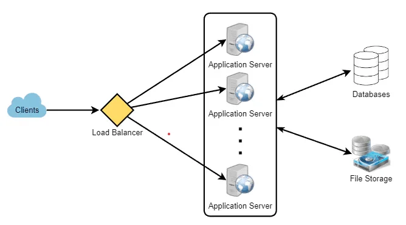

这是一篇双语翻译的文章，原文出自 [grok_system_design_interview.pdf](https://github.com/sharanyaa/grok_sdi_educative/blob/master/grok_system_design_interview.pdf) 的一篇文章《System Design Interviews: A step by step guide》系统设计访谈：分步指南。

---

A lot of software engineers struggle with system design interviews (SDIs) primarily because of three reasons:

> 许多软件工程师在系统设计面试（SDI）中遇到困难，主要是因为以下三个原因：

- The unstructured nature of SDIs, where they are asked to work on an open-ended design problem that doesn’t have a standard answer.

  > SDI 的非结构化性质，要求他们解决没有标准答案的开放式设计问题。
- Their lack of experience in developing large scale systems.
  
  > 他们缺乏开发大型系统的经验。
- They did not prepare for SDIs.
  
  > 他们没有为 SDI 做好准备。

Like coding interviews, candidates who haven’t put a conscious effort to prepare for SDIs, mostly perform poorly especially at top companies like Google, Facebook, Amazon, Microsoft, etc. In these companies, candidates who don’t perform above average, have a limited chance to get an offer. On the other hand, a good performance always results in a better offer (higher position and salary), since it shows the candidate’s ability to handle a complex system.

> 与编码面试一样，没有刻意准备 SDI 的候选人大多表现不佳，尤其是在 Google、Facebook、亚马逊、微软等顶级公司。在这些公司中，表现不高于平均水平的候选人获得报价的机会有限。另一方面，良好的表现总是会带来更好的工作机会（更高的职位和薪水），因为它显示了候选人处理复杂系统的能力。

In this course, we’ll follow a step by step approach to solve multiple design problems. First, let’s go through these steps:

> 在本课程中，我们将遵循逐步的方法来解决多个设计问题。首先，让我们完成以下步骤：

## Step 1: Requirements clarifications

> **步骤 1：需求澄清**

It is always a good idea to ask questions about the exact scope of the problem we are solving. Design questions are mostly open-ended, and they don’t have ONE correct answer, that’s why clarifying ambiguities early in the interview becomes critical. Candidates who spend enough time to define the end goals of the system always have a better chance to be successful in the interview. Also, since we only have 35-40 minutes to design a (supposedly) large system, we should clarify what parts of the system we will be focusing on.

> 询问我们正在解决的问题的确切范围总是一个好主意。设计问题大多是开放式的，并且没有一个正确的答案，这就是为什么在面试初期澄清歧义变得至关重要。花足够时间来定义系统最终目标的候选人总是有更好的机会在面试中取得成功。另外，由于我们只有 35-40 分钟的时间来设计一个（据称）大型系统，因此我们应该明确我们将重点关注系统的哪些部分。

Let’s expand this with an actual example of designing a Twitter-like service. Here are some questions for designing Twitter that should be answered before moving on to the next steps:

> 让我们通过设计类似 Twitter 的服务的实际示例来扩展这一点。以下是设计 Twitter 时应回答的一些问题，然后再继续下一步：

- Will users of our service be able to post tweets and follow other people?
  
  > 我们服务的用户能够发布推文并关注其他人吗？
  
- Should we also design to create and display the user’s timeline?
  
  > 我们还应该设计创建和显示用户的时间线吗？
  
- Will tweets contain photos and videos?
  
  > 推文会包含照片和视频吗？
  
- Are we focusing on the backend only or are we developing the front-end too?
  
  > 我们只关注后端还是也开发前端？
  
- Will users be able to search tweets?
  
  > 用户能够搜索推文吗？
  
- Do we need to display hot trending topics?
  
  > 我们需要展示热门话题吗？
  
- Will there be any push notification for new (or important) tweets?
  
  > 新的（或重要的）推文会有推送通知吗？

All such question will determine how our end design will look like.

> 所有这些问题将决定我们的最终设计会是什么样子。

## Step 2: System interface definition

> **步骤2 ：系统接口定义**

Define what APIs are expected from the system. This will not only establish the exact contract expected from the system, but will also ensure if we haven’t gotten any requirements wrong. Some examples for our Twitter-like service will be:

> 定义系统期望提供哪些 API。这不仅可以建立系统所期望的准确合同，而且还可以确保我们没有错误地提出任何要求。我们类似 Twitter 的服务的一些示例如下：

```
postTweet(user_id, tweet_data, tweet_location, user_location, timestamp, ...)
generateTimeline(user_id, current_time, user_location, ...)
markTweetFavorite(user_id, tweet_id, timestamp, ...)
```

## Step 3: Back-of-the-envelope estimation

> **步骤 3：粗略估计**

It is always a good idea to estimate the scale of the system we’re going to design. This will also help later when we will be focusing on scaling, partitioning, load balancing and caching.

> 估计我们要设计的系统的规模总是一个好主意。当我们稍后关注扩展、分区、负载平衡和缓存时，这也会有所帮助。

- What scale is expected from the system (e.g., number of new tweets, number of tweet views, number of timeline generations per sec., etc.)?
  
  > 系统的预期规模是多少（例如，新推文数量、推文浏览量、每秒生成的时间线数量等）？
- How much storage will we need? We will have different numbers if users can have photos and videos in their tweets.
  
  > 我们需要多少存储空间？如果用户的推文中可以包含照片和视频，我们将得到不同的数字。
- What network bandwidth usage are we expecting? This will be crucial in deciding how we will manage traffic and balance load between servers.
  
  > 我们期望使用多少网络带宽？这对于决定我们如何管理流量和平衡服务器之间的负载至关重要。

## Step 4: Defining data model

> **步骤 4：定义数据模型**

Defining the data model early will clarify how data will flow among different components of the system. Later, it will guide towards data partitioning and management. The candidate should be able to identify various entities of the system, how they will interact with each other, and different aspect of data management like storage, transportation, encryption, etc. Here are some entities for our Twitter- like service:

> 尽早定义数据模型将阐明数据如何在系统的不同组件之间流动。稍后，它将指导数据分区和管理。考生应该能够识别系统的各种实体，它们如何相互交互，以及数据管理的不同方面，如存储、传输、加密等。以下是我们类似 Twitter 服务的一些实体：

**User:** UserID, Name, Email, DoB, CreationDate, LastLogin, etc.

**Tweet:** TweetID, Content, TweetLocation, NumberOfLikes, TimeStamp, etc.

**UserFollow:** UserID1, UserID2

**FavoriteTweets:** UserID, TweetID, TimeStamp

Which database system should we use? Will NoSQL like [Cassandra](https://en.wikipedia.org/wiki/Apache_Cassandra) best fit our needs, or should we use a MySQL-like solution? What kind of block storage should we use to store photos and videos?

> 我们应该使用哪种数据库系统？像 Cassandra 这样的 NoSQL 是否最适合我们的需求，或者我们应该使用类似 MySQL 的解决方案？我们应该使用什么样的块存储来存储照片和视频？

## Step 5: High-level design

> **步骤 5：高层设计**

Draw a block diagram with 5-6 boxes representing the core components of our system. We should identify enough components that are needed to solve the actual problem from end-to-end.

> 绘制一个框图，其中 5-6 个方框代表我们系统的核心组件。我们应该确定端到端解决实际问题所需的足够组件。

For Twitter, at a high-level, we will need multiple application servers to serve all the read/write requests with load balancers in front of them for traffic distributions. If we’re assuming that we will have a lot more read traffic (as compared to write), we can decide to have separate servers for handling these scenarios. On the backend, we need an efficient database that can store all the tweets and can support a huge number of reads. We will also need a distributed file storage system for storing photos and videos.

> 对于 Twitter，在较高层面上，我们需要多个应用程序服务器来服务所有读/写请求，并在它们前面提供负载均衡器以进行流量分配。如果我们假设我们将有更多的读取流量（与写入相比），我们可以决定使用单独的服务器来处理这些场景。在后端，我们需要一个高效的数据库来存储所有的推文，并且可以支持海量读取。我们还需要一个分布式文件存储系统来存储照片和视频。





## Step 6: Detailed design

> **步骤 6：详细设计**

Dig deeper into two or three components; interviewer’s feedback should always guide us what parts of the system need further discussion. We should be able to present different approaches, their pros and cons, and explain why we will prefer one approach on the other. Remember there is no single answer, the only important thing is to consider tradeoffs between different options while keeping system constraints in mind.

> 深入挖掘两个或三个组件；面试官的反馈应该始终指导我们系统的哪些部分需要进一步讨论。我们应该能够展示不同的方法及其优缺点，并解释为什么我们更喜欢一种方法而不是另一种方法。请记住，没有单一的答案，唯一重要的是考虑不同选项之间的权衡，同时牢记系统约束。

- Since we will be storing a massive amount of data, how should we partition our data to distribute it to multiple databases? Should we try to store all the data of a user on the same database? What issue could it cause?
  
  > 由于我们将存储大量数据，我们应该如何对数据进行分区以将其分布到多个数据库？我们是否应该尝试将用户的所有数据存储在同一个数据库中？它可能会导致什么问题？
  
- How will we handle hot users who tweet a lot or follow lots of people?
  
  > 我们将如何处理经常发推文或关注很多人的热门用户？
  
- Since users’ timeline will contain the most recent (and relevant) tweets, should we try to store our data in such a way that is optimized for scanning the latest tweets?
  
  > 由于用户的时间线将包含最新的（和相关的）推文，我们是否应该尝试存储我们的数据是否以针对扫描最新推文进行优化的方式？
  
- How much and at which layer should we introduce cache to speed things up?
  
  > 我们应该在多大程度上以及在哪一层引入缓存来加快速度？
  
- What components need better load balancing?
  
  > 哪些组件需要更好的负载平衡？

## Step 7: Identifying and resolving bottlenecks

> **步骤 7：识别并解决瓶颈**

Try to discuss as many bottlenecks as possible and different approaches to mitigate them.

> 尝试讨论尽可能多的瓶颈以及缓解瓶颈的不同方法。

- Is there any single point of failure in our system? What are we doing to mitigate it?
  
  > 我们的系统中是否存在单点故障？我们正在采取什么措施来缓解这种情况？
  
- Do we have enough replicas of the data so that if we lose a few servers we can still serve our users?
  
  > 我们是否有足够的数据副本，以便在失去一些服务器时我们仍然可以为我们的服务提供服务用户？
  
- Similarly, do we have enough copies of different services running such that a few failures will not cause total system shutdown?
  
  > 同样，我们是否有足够的运行不同服务的副本，以便少数故障会发生不会导致整个系统关闭吗？
  
- How are we monitoring the performance of our service? Do we get alerts whenever critical components fail or their performance degrades?
  
  > 我们如何监控我们的服务表现？我们是否会在关键时刻收到警报组件出现故障或性能下降？

## Summary

>**概括**

In short, preparation and being organized during the interview are the keys to be successful in system design interviews. The above-mentioned steps should guide you to remain on track and cover all the different aspects while designing a system.

> 简而言之，面试过程中的准备和组织是系统设计面试成功的关键。上述步骤应指导您在设计系统时保持正轨并涵盖所有不同方面。

Let’s apply the above guidelines to design a few systems that are asked in SDIs.

> 让我们应用上述指南来设计 SDI 中要求的一些系统。


---

参考文章：

- https://www.designgurus.io/course-play/grokking-the-system-design-interview/doc/638c0b5aac93e7ae59a1af63