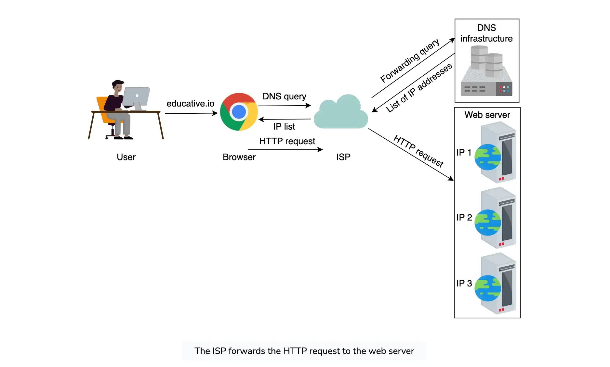
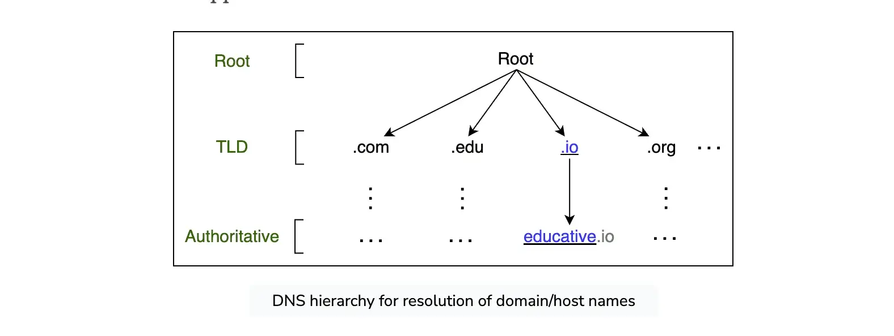
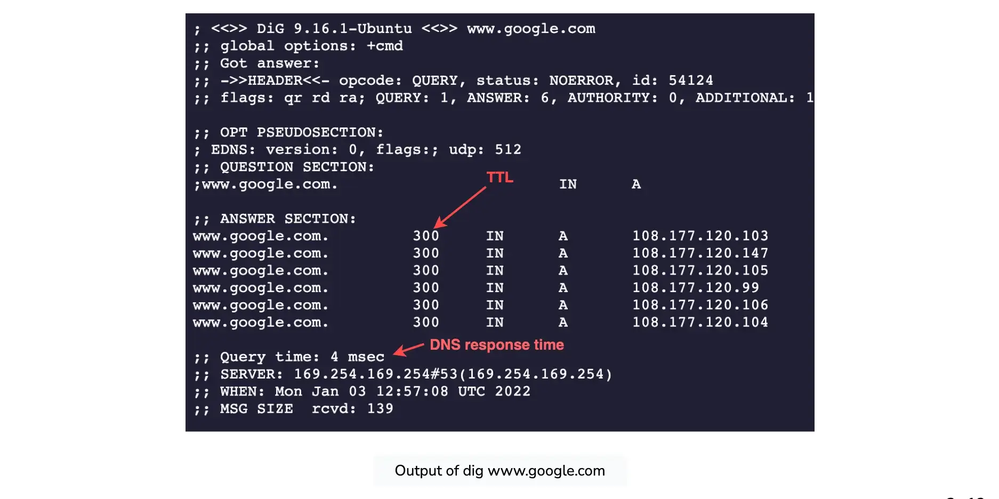

这是一篇双语翻译的文章，原文出自《Grokking the System Design Interview》教程的 [Domain Name System](https://www.educative.io/courses/grokking-modern-system-design-interview-for-engineers-managers/introduction-to-domain-name-system-dns) 这篇章节。

---

# Introduction to Domain Name System (DNS) 

> 域名系统 (DNS) 简介

# The origins of DNS 

> DNS 的起源

Let’s consider the example of a mobile phone where a unique number is associated with each user. To make calls to friends, we can initially try to memorize some of the phone numbers. However, as the number of contacts grows, we’ll have to use a phone book to keep track of all our contacts. This way, whenever we need to make a call, we’ll refer to the phone book and dial the number we need.

> 让我们考虑一个移动电话的示例，其中每个用户都有一个唯一的号码。为了给朋友打电话，我们首先可以尝试记住一些电话号码。然而，随着联系人数量的增加，我们将不得不使用电话簿来跟踪所有联系人。这样，每当我们需要打电话时，我们都会查阅电话簿并拨打我们需要的号码。

Similarly, computers are uniquely identified by IP addresses—for example, `104.18.2.119` is an IP address. We use IP addresses to visit a website hosted on a machine. Since humans cannot easily remember IP addresses to visit domain names (an example domain name being [educative.io](http://educative.io/)), we need a phone book-like repository that can maintain all mappings of domain names to IP addresses. In this chapter, we’ll see how DNS serves as the Internet’s phone book.

> 同样，计算机由 IP 地址唯一标识，例如， `104.18.2.119` 是一个 IP 地址。我们使用 IP 地址来访问计算机上托管的网站。由于人类无法轻易记住 IP 地址来访问域名（例如域名 eduducative.io），因此我们需要一个类似电话簿的存储库来维护域名到 IP 地址的所有映射。在本章中，我们将了解 DNS 如何充当互联网的电话簿。

## What is DNS? 

>什么是 DNS？

The **domain name system (DNS)** is the Internet’s naming service that maps human-friendly domain names to machine-readable IP addresses. The service of DNS is transparent to users. When a user enters a domain name in the browser, the browser has to translate the domain name to IP address by asking the DNS infrastructure. Once the desired IP address is obtained, the user’s request is forwarded to the destination web server.

> 域名系统 (DNS) 是互联网的命名服务，它将人类友好的域名映射到机器可读的 IP 地址。 DNS服务对用户是透明的。当用户在浏览器中输入域名时，浏览器必须通过询问 DNS 基础设施将域名转换为 IP 地址。一旦获得所需的 IP 地址，用户的请求就会转发到目标 Web 服务器。

The slides below show the high-level flow of the working of DNS:

> 下面的幻灯片显示了 DNS 工作的高级流程：

The entire operation is performed very quickly. Therefore, the end user experiences minimum delay. We’ll also see how browsers save some of the frequently used mappings for later use in the next lesson.

> 整个操作进行得非常快。因此，最终用户体验到的延迟最小。我们还将了解浏览器如何保存一些常用的映射以供下一课稍后使用。

## Important details 

>重要细节

Let’s highlight some of the important details about DNS, some of which we’ll cover in the next lesson:

> 让我们重点介绍有关 DNS 的一些重要细节，其中一些我们将在下一课中介绍：

- **Name servers:** It’s important to understand that the DNS isn’t a single server. It’s a complete infrastructure with numerous servers. DNS servers that respond to users’ queries are called **name servers**.

  > 名称服务器：重要的是要了解 DNS 不是单个服务器。它是一个拥有大量服务器的完整基础设施。响应用户查询的 DNS 服务器称为名称服务器。

- **Resource records:** The DNS database stores domain name to IP address mappings in the form of resource records (RR). The RR is the smallest unit of information that users request from the name servers. There are different types of RRs. The table below describes common RRs. The three important pieces of information are *type*, *name*, and *value*. The *name* and *value* change depending upon the *type* of the RR.

  > 资源记录：DNS 数据库以资源记录 (RR) 的形式存储域名到 IP 地址的映射。 RR 是用户从名称服务器请求的最小信息单元。 RR 有不同类型。下表描述了常见的 RR。三个重要的信息是类型、名称和值。名称和值根据 RR 的类型而变化。

## Common Types of Resource Records 

> 资源记录的常见类型

| **Type ** | **Description **                                             | **Name **   | **Value**      | **Example (Type, Name, Value) **                         |
| --------- | ------------------------------------------------------------ | ----------- | -------------- | -------------------------------------------------------- |
| A         | Provides the hostname to IP address mapping                  | Hostname    | IP address     | (A, relay1.main.educative.io,104.18.2.119)               |
| NS        | Provides the hostname that is the authoritative DNS for a domain name | Domain name | Hostname       | (NS, educative.io, dns.educative.io)                     |
| CNAME     | Provides the mapping from alias to canonical hostname        | Hostname    | Canonical name | (CNAME, educative.io, server1.primary.educative.io)      |
| MX        | Provides the mapping of mail server from alias to canonical hostname | Hostname    | Canonical name | (MX, mail.educative.io, mailserver1.backup.educative.io) |

- **Caching:** DNS uses caching at different layers to reduce request latency for the user. Caching plays an important role in reducing the burden on DNS infrastructure because it has to cater to the queries of the entire Internet.

  > 缓存：DNS 使用不同层的缓存来减少用户的请求延迟。缓存在减轻 DNS 基础设施的负担方面发挥着重要作用，因为它必须满足整个互联网的查询。

- **Hierarchy:** DNS name servers are in a hierarchical form. The hierarchical structure allows DNS to be highly scalable because of its increasing size and query load. In the next lesson, we’ll look at how a tree-like structure is used to manage the entire DNS database.

  > 层次结构：DNS 名称服务器采用层次结构形式。由于其规模和查询负载不断增加，分层结构使 DNS 具有高度可扩展性。在下一课中，我们将了解如何使用树状结构来管理整个 DNS 数据库。

Let’s explore more details of the above points in the next lesson to get more clarity.

> 让我们在下一课中探讨上述要点的更多细节，以便更加清晰。

# How the Domain Name System Works 

>域名系统如何运作

Through this lesson, we’ll answer the following questions:

> 通过本课，我们将回答以下问题：

- How is the DNS hierarchy formed using various types of DNS name servers?

  > 如何使用各种类型的 DNS 名称服务器形成 DNS 层次结构？

- How is caching performed at different levels of the Internet to reduce the querying burden over the DNS infrastructure?

  > 如何在互联网的不同级别执行缓存以减轻 DNS 基础设施的查询负担？

- How does the distributed nature of the DNS infrastructure help its robustness?

  > DNS 基础设施的分布式特性如何有助于其稳健性？

Let’s get started. 

> 让我们开始吧。

## DNS hierarchy 

> DNS层次结构

As stated before, the DNS isn’t a single server that accepts requests and responds to user queries. It’s a complete infrastructure with name servers at different hierarchies.

> 如前所述，DNS 不是接受请求并响应用户查询的单个服务器。它是一个完整的基础设施，具有不同层次结构的名称服务器。

There are mainly four types of servers in the DNS hierarchy:

> DNS 层次结构中主要有四种类型的服务器：

1. **DNS resolver:** Resolvers initiate the querying sequence and forward requests to the other DNS name servers. Typically, DNS resolvers lie within the premise of the user’s network. However, DNS resolvers can also cater to users’ DNS queries through caching techniques, as we will see shortly. These servers can also be called local or default servers.

   > DNS 解析器：解析器启动查询序列并将请求转发到其他 DNS 名称服务器。通常，DNS 解析器位于用户网络的内部。然而，DNS 解析器还可以通过缓存技术来满足用户的 DNS 查询，我们很快就会看到。这些服务器也可以称为本地或默认服务器。

2. **Root-level name servers:** These servers receive requests from local servers. Root name servers maintain name servers based on top-level domain names, such as `.com`, `.edu`, `.us`, and so on. For instance, when a user requests the IP address of [educative.io](http://educative.io/), root-level name servers will return a list of top-level domain (TLD) servers that hold the IP addresses of the `.io` domain.

   > 根级名称服务器：这些服务器接收来自本地服务器的请求。根名称服务器维护基于顶级域名的名称服务器，例如 `.com` 、 `.edu` 、 `.us` 等。例如，当用户请求 educative.io 的 IP 地址时，根级名称服务器将返回保存 `.io` 域的 IP 地址的顶级域 (TLD) 服务器列表。

3. **Top-level domain (TLD) name servers:** These servers hold the IP addresses of authoritative name servers. The querying party will get a list of IP addresses that belong to the authoritative servers of the organization.

   > 顶级域名 (TLD) 名称服务器：这些服务器保存权威名称服务器的 IP 地址。查询方将获得属于该组织的权威服务器的IP地址列表。

4. **Authoritative name servers:** These are the organization’s DNS name servers that provide the IP addresses of the web or application servers.

   > 权威名称服务器：这些是组织的 DNS 名称服务器，提供 Web 或应用程序服务器的 IP 地址。

> **Question** 
>
> > 问题
>
> How are DNS names processed? For example, will [educative.io](http://educative.io/) be processed from left to right or right to left?
>
> > DNS 名称是如何处理的？例如，educative.io 是从左到右还是从右到左处理？
>
> Unlike UNIX files, which are processed from left to right, DNS names are processed from right to left. In the case of [educative.io](http://educative.io/), the resolvers will first resolve the `.io` part, then `educative`, and so on.
>
> > 与从左到右处理的 UNIX 文件不同，DNS 名称是从右到左处理的。对于 educative.io，解析器将首先解析 `.io` 部分，然后解析 `educative` ，依此类推。
>
> Visually, however, the DNS hierarchy can be viewed as a tree.
>
> > 然而，从视觉上看，DNS 层次结构可以视为一棵树。

### Iterative versus recursive query resolution 

>迭代与递归查询解析

There are two ways to perform a DNS query:

> 有两种方法可以执行 DNS 查询：

1. **Iterative:** The local server requests the root, TLD, and the authoritative servers for the IP address.

   > 迭代：本地服务器向根服务器、TLD 和权威服务器请求 IP 地址。

2. **Recursive:** The end user requests the local server. The local server further requests the root DNS name servers. The root name servers forward the requests to other name servers.

   > 递归：最终用户请求本地服务器。本地服务器进一步请求根 DNS 名称服务器。根名称服务器将请求转发到其他名称服务器。

In the following illustration (on the left), DNS query resolution is iterative from the perspective of the local/ISP server:

> 在下图中（左），从本地/ISP服务器的角度来看，DNS查询解析是迭代的：

**Note:** Typically, an iterative query is preferred to reduce query load on DNS infrastructure.

> 注意：通常，首选迭代查询来减少 DNS 基础设施上的查询负载。

These days, we’ll find many third-party public DNS resolvers offered by Google, Cloudflare, OpenDNS, and many more. The interesting fact is that these public DNS servers may provide quicker responses than the local ISP DNS facilities.

> 如今，我们会发现 Google、Cloudflare、OpenDNS 等提供的许多第三方公共 DNS 解析器。有趣的是，这些公共 DNS 服务器可能比本地 ISP DNS 设施提供更快的响应。

## Caching 

>缓存

**Caching** refers to the temporary storage of frequently requested [resource records](https://www.educative.io/edpresso/what-is-the-difference-between-dns-a-record-and-cname). A record is a data unit within the DNS database that shows a name-to-value binding. Caching reduces response time to the user and decreases network traffic. When we use caching at different hierarchies, it can reduce a lot of querying burden on the DNS infrastructure. Caching can be implemented in the browser, operating systems, local name server within the user’s network, or the ISP’s DNS resolvers.

> 缓存是指临时存储经常请求的资源记录。 记录是 DNS 数据库中的一个数据单元，显示名称到值的绑定。缓存减少了用户的响应时间并减少了网络流量。当我们在不同的层次结构中使用缓存时，它可以减轻 DNS 基础设施的大量查询负担。缓存可以在浏览器、操作系统、用户网络内的本地名称服务器或 ISP 的 DNS 解析器中实现。

The slideshow below demonstrates the power of caching in the DNS:

> 下面的幻灯片展示了 DNS 中缓存的强大功能：

**Note:** Even if there is no cache available to resolve a user’s query and it’s imperative to visit the DNS infrastructure, caching can still be beneficial. The local server or ISP DNS resolver can cache the IP addresses of TLD servers or authoritative servers and avoid requesting the root-level server.

> 注意：即使没有可用的缓存来解析用户的查询并且必须访问 DNS 基础设施，缓存仍然是有益的。本地服务器或ISP DNS解析器可以缓存TLD服务器或权威服务器的IP地址，并避免请求根级服务器。

## DNS as a distributed system 

>DNS 作为分布式系统

Although the DNS hierarchy facilitates the distributed Internet that we know today, it’s a distributed system itself. The distributed nature of DNS has the following advantages:

> 尽管 DNS 层次结构促进了我们今天所知的分布式互联网，但它本身就是一个分布式系统。 DNS的分布式特性具有以下优点：

- It avoids becoming a single point of failure (SPOF).

  > 它避免成为单点故障 (SPOF)。

- It achieves low query latency so users can get responses from nearby servers.

  > 它实现了低查询延迟，因此用户可以从附近的服务器获得响应。

- It gets a higher degree of flexibility during maintenance and updates or upgrades. For example, if one DNS server is down or overburdened, another DNS server can respond to user queries.

  > 它在维护和更新或升级过程中获得更高程度的灵活性。例如，如果一台 DNS 服务器发生故障或负载过重，另一台 DNS 服务器可以响应用户查询。

There are 13 logical root name servers (named letter **A** through **M**) with many instances spread throughout the globe. These servers are managed by 12 different organizations.

> 有 13 个逻辑根名称服务器（命名为字母 A 到 M），其中许多实例遍布全球。这些服务器由 12 个不同的组织管理。

Let’s now go over how DNS is scalable, reliable, and consistent.

> 现在让我们回顾一下 DNS 如何实现可扩展、可靠和一致。

### Highly scalable 

> 高度可扩展

Due to its hierarchical nature, DNS is a highly scalable system. Roughly 1,000 replicated instances of 13 root-level servers are spread throughout the world strategically to handle user queries. The working labor is divided among TLD and root servers to handle a query and, finally, the authoritative servers that are managed by the organizations themselves to make the entire system work. As shown in the DNS hierarchy tree above, different services handle different portions of the tree enabling scalability and manageability of the system.

> 由于其分层性质，DNS 是一个高度可扩展的系统。 13 台根级服务器的大约 1,000 个复制实例战略性地分布在世界各地，以处理用户查询。工作劳力被分配到 TLD 和根服务器来处理查询，最后分配到由组织自己管理的权威服务器以使整个系统正常运行。如上面的 DNS 层次结构树所示，不同的服务处理树的不同部分，从而实现系统的可扩展性和可管理性。

### Reliable 

>可靠性

Three main reasons make the DNS a reliable system:

> DNS 成为可靠系统的三个主要原因：

1. **Caching:** The caching is done in the browser, the operating system, and the local name server, and the ISP DNS resolvers also maintain a rich cache of frequently visited services. Even if some DNS servers are temporarily down, cached records can be served to make DNS a reliable system.

   > 缓存：缓存是在浏览器、操作系统和本地名称服务器中完成的，ISP DNS 解析器还维护着经常访问的服务的丰富缓存。即使某些 DNS 服务器暂时关闭，也可以提供缓存记录，使 DNS 成为一个可靠的系统。

2. **Server replication:** DNS has replicated copies of each logical server spread systematically across the globe to entertain user requests at low latency. The redundant servers improve the reliability of the overall system.

   > 服务器复制：DNS 系统地复制了遍布全球的每个逻辑服务器的副本，以低延迟处理用户请求。冗余服务器提高了整个系统的可靠性。

3. **Protocol:** Although many clients rely on the unreliable User Datagram Protocol (UDP) to request and receive DNS responses, it is important to acknowledge that UDP also offers distinct advantages. UDP is much faster and, therefore, improves DNS performance. Furthermore, Internet service’s reliability has improved since its inception, so UDP is usually favored over TCP. A DNS resolver can resend the UDP request if it didn’t get a reply to a previous one. This request-response needs just one round trip, which provides a shorter delay as compared to TCP, which needs a three-way handshake before data exchange.

   > 协议：尽管许多客户端依赖不可靠的用户数据报协议 (UDP) 来请求和接收 DNS 响应，但重要的是要承认 UDP 也提供了独特的优势。 UDP 速度更快，因此可以提高 DNS 性能。此外，自诞生以来，互联网服务的可靠性已得到提高，因此 UDP 通常比 TCP 更受青睐。如果 DNS 解析器没有收到前一个请求的回复，则可以重新发送 UDP 请求。这种请求-响应仅需要一次往返，与在数据交换之前需要三次握手的 TCP 相比，延迟更短。

> **Question** 
>
> > 问题
>
> What happens if a network is congested? Should DNS continue using UDP?
>
> > 如果网络拥塞会发生什么？ DNS 是否应该继续使用 UDP？
>
> 
>
> Typically, DNS uses UDP. However, DNS can use TCP when its message size exceeds the original packet size of 512 Bytes. This is because large-size packets are more prone to be damaged in congested networks. DNS always uses TCP for zone transfers.
>
> > 通常，DNS 使用 UDP。但是，当 DNS 的消息大小超过原始数据包大小 512 字节时，DNS 可以使用 TCP。这是因为大尺寸数据包在拥塞的网络中更容易被损坏。 DNS 始终使用 TCP 进行区域传输。
>
> Some clients prefer DNS over TCP to employ transport layer security for privacy reasons.
>
> > 出于隐私原因，某些客户端更喜欢使用 DNS 而不是 TCP 来采用传输层安全性。

### Consistent 

> 一致性

DNS uses various protocols to update and transfer information among replicated servers in a hierarchy. DNS compromises on strong consistency to achieve high performance because data is read frequently from DNS databases as compared to writing. However, DNS provides eventual consistency and updates records on replicated servers lazily. Typically, it can take from a few seconds up to three days to update records on the DNS servers across the Internet. The time it takes to propagate information among different DNS clusters depends on the DNS infrastructure, the size of the update, and which part of the DNS tree is being updated.

> DNS 使用各种协议在层次结构中的复制服务器之间更新和传输信息。 DNS 会在强一致性方面做出妥协以实现高性能，因为与写入相比，从 DNS 数据库中读取数据的频率更高。然而，DNS 提供最终一致性并延迟更新复制服务器上的记录。通常，更新 Internet 上 DNS 服务器上的记录可能需要几秒钟到三天的时间。在不同 DNS 集群之间传播信息所需的时间取决于 DNS 基础设施、更新的大小以及正在更新 DNS 树的哪一部分。 

Consistency can suffer because of caching too. Since authoritative servers are located within the organization, it may be possible that certain resource records are updated on the authoritative servers in case of server failures at the organization. Therefore, cached records at the default/local and ISP servers may be outdated. To mitigate this issue, each cached record comes with an expiration time called **time-to-live (TTL)**.

> 由于缓存，一致性也会受到影响。由于权威服务器位于组织内，因此在组织中的服务器发生故障的情况下，权威服务器上的某些资源记录可能会被更新。因此，默认/本地和 ISP 服务器上的缓存记录可能会过时。为了缓解此问题，每个缓存记录都带有一个称为生存时间 (TTL) 的过期时间。

> **Question** 
>
> > 问题
>
> To maintain high availability, should the TTL value be large or small?
>
> > 为了保持高可用性，TTL值应该大还是小？
>
> To maintain high availability, the TTL value should be small. This is because if any server or cluster fails, the organization can update the resource records right away. Users will experience non-availability only for the time the TTL isn’t expired. However, if the TTL is large, the organization will update its resource records, whereas users will keep pinging the outdated server that would have crashed long ago. Companies that long for high availability maintain a TTL value as low as 120 seconds. Therefore, even in case of a failure, the maximum downtime is a few minutes.
>
> > 为了保持高可用性，TTL值应该很小。这是因为如果任何服务器或集群发生故障，组织可以立即更新资源记录。仅在 TTL 未过期期间，用户才会遇到不可用的情况。然而，如果 TTL 很大，组织将更新其资源记录，而用户将继续 ping 早就崩溃的过时服务器。渴望高可用性的公司将 TTL 值维持在低至 120 秒。因此，即使发生故障，最长停机时间也只有几分钟。

## Test it out 

>测试一下

Let’s run a couple of commands. Click on the terminal to execute the following commands. Copy the following commands in the terminal to run them. Study the output of the commands:

> 让我们运行几个命令。单击终端以执行以下命令。在终端中复制以下命令来运行它们。研究命令的输出：

1. `nslookup www.google.com`
2. `dig www.google.com`

The following slide deck highlights some important aspects of `nslookup` and `dig` output.

> 以下幻灯片重点介绍了 `nslookup` 和 `dig` 输出的一些重要方面。

Let’s go through the meaning of the output:

> 我们来看看输出的含义：

### The `nslookup` output 

>`nslookup` 输出

- The `Non-authoritative answer`, as the name suggests, is the answer provided by a server that is not the authoritative server of Google. It isn’t in the list of authoritative nameservers that Google maintains. So, where does the answer come from? The answer is provided by second, third, and fourth-hand name servers configured to reply to our DNS query—for example, our university or office DNS resolver, our ISP nameserver, our ISP’s ISP nameserver, and so on. In short, it can be considered as a cached version of Google’s authoritative nameservers response. If we try multiple domain names, we’ll realize that we receive a cached response most of the time.

  > `Non-authoritative answer` ，顾名思义，是由非 Google 权威服务器提供的答案。它不在 Google 维护的权威域名服务器列表中。那么，答案从何而来？答案由配置为回复我们的 DNS 查询的第二手、第三手和第四手名称服务器提供，例如，我们的大学或办公室 DNS 解析器、我们的 ISP 名称服务器、我们 ISP 的 ISP 名称服务器等。简而言之，它可以被视为 Google 权威域名服务器响应的缓存版本。如果我们尝试多个域名，我们会发现大多数时候我们都会收到缓存的响应。

- If we run the same command multiple times, we’ll receive the same IP addresses list but in a different order each time. The reason for that is DNS is indirectly performing [load balancing](https://www.educative.io/collection/page/10370001/4941429335392256/4521972679049216). It’s an important term that we’ll gain familiarity with in the coming lessons.

  > 如果我们多次运行相同的命令，我们将收到相同的 IP 地址列表，但每次的顺序不同。原因是 DNS 间接执行负载平衡。这是一个重要的术语，我们将在接下来的课程中熟悉它。

### The `dig` output

> `dig` 输出

- The `Query time: 4 msec` represents the time it takes to get a response from the DNS server. For various reasons, these numbers may be different in our case.

  > `Query time: 4 msec` 表示从 DNS 服务器获取响应所需的时间。由于各种原因，这些数字在我们的案例中可能有所不同。

- The `300` value in the *`ANSWER SECTION`* represents the number of seconds the cache is maintained in the DNS resolver. This means that Google’s ADNS keeps a TTL value of five minutes (300/60 *sec*).

  > `ANSWER SECTION` 中的 `300` 值表示 DNS 解析器中维护缓存的秒数。这意味着 Google 的 ADNS 将 TTL 值保持为五分钟（300/60 秒）。

**Note:** We invite you to test different services for their TTL and query times to strengthen your understanding. You may use the above terminal for this purpose.

> 注意：我们邀请您测试不同服务的 TTL 和查询时间，以加深您的理解。您可以使用上述终端来实现此目的。

> **Question** 
>
> > 问题
>
> If we need DNS to tell us which IP to reach a website or service, how will we know the DNS resolver’s IP address? (It seems like a chicken-and-egg problem!)
>
> > 如果我们需要 DNS 告诉我们哪个 IP 可以访问网站或服务，我们如何知道 DNS 解析器的 IP 地址？ （这似乎是一个先有鸡还是先有蛋的问题！）
>
> 
>
> End users’ operating systems have configuration files (`/etc/resolv.conf` in Linux) with the DNS resolvers’ IP addresses, which in turn obtain all information for them. (Often, DHCP provides the default DNS resolver IP address along with other configurations.) The end-systems request DNS resolves for any DNS queries. DNS resolvers have special software installed to resolve queries through the DNS infrastructure. The root server’s IP addresses are within the special software. Typically, the Berkeley Internet Name Domain (BIND) software is used on DNS resolvers. The [InterNIC](https://www.internic.net/domain/named.root) maintains the updated list of 13 root servers.
>
> > 最终用户的操作系统具有包含 DNS 解析器 IP 地址的配置文件（Linux 中为 `/etc/resolv.conf` ），而 DNS 解析器又会获取其所有信息。 （通常，DHCP 提供默认 DNS 解析器 IP 地址以及其他配置。）终端系统请求 DNS 解析任何 DNS 查询。 DNS 解析器安装了特殊软件来通过 DNS 基础设施解析查询。根服务器的IP地址位于特殊软件内。通常，伯克利互联网名称域 (BIND) 软件用于 DNS 解析器。 InterNIC 维护着 13 个根服务器的更新列表。
>
> So, we break the chicken-and-egg problem by seeding each resolver with prior knowledge of root DNS servers (whose IPs rarely change).
>
> > 因此，我们通过为每个解析器提供根 DNS 服务器（其 IP 很少更改）的先验知识来解决先有鸡还是先有蛋的问题。