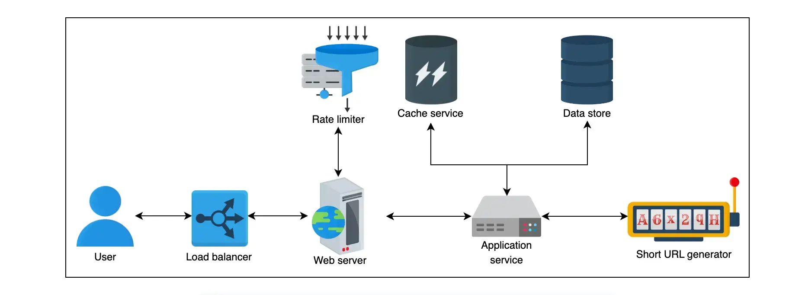

如何生成一个短网址服务，参考 [Design a URL Shortening Service / TinyURL](https:/www.educative.io/courses/grokking-modern-system-design-interview-for-engineers-managers/system-design-tinyurl) 和 [Designing a URL Shortening service like TinyURL](https:/www.designgurus.io/course-play/grokking-the-system-design-interview/doc/638c0b5dac93e7ae59a1af6b) 两篇文章，整理如下笔记。

其中主要包括以下内容：

- 设计一个系统有哪些步骤
  - 需求
  - 预估
  - 设计
    - 高层次设计
    - API 设计
    - 细节设计
  - 评估
- 设计一个短网址服务的细节

## 设计步骤

- Requirements 需求
  - 功能性需求
    - 短 URL 生成：我们的服务应该能够为给定 URL 生成唯一的较短别名。
    - 重定向：给定一个短链接，我们的系统应该能够将用户重定向到原始 URL。
    - 自定义短链接：用户应该能够使用我们的系统为其 URL 生成自定义短链接。
    - 删除：在赋予权限的情况下，用户应该能够删除我们系统生成的短链接。
    - 更新：如果有适当的权限，用户应该能够更新与短链接关联的长 URL。
    - 过期时间：短链接必须有一个默认的过期时间，但用户应该可以根据自己的需求设置过期时间。
  - 分功能性需求：可用性、可靠性、扩展性、可维护性、容错性
    - 可用性：我们的系统应该具有高可用性，因为即使是第二次停机的一小部分也会导致 URL 重定向失败。由于我们系统的域位于 URL 中，因此我们没有停机时间的优势，并且我们的设计必须灌输容错条件。
    - 可扩展性：我们的系统应该能够随着需求的增加而水平扩展。
    - 可读性：我们的系统生成的短链接应该易于阅读、区分和输入。
    - 延迟：系统应以低延迟执行，以便为用户提供流畅的体验。
    - 不可预测性：从安全角度来看，我们的系统生成的短链接应该是高度不可预测的。这确保了下一个短 URL 不会连续生成，从而消除了有人猜测我们的系统已经生成或将生成的所有短 URL 的可能性。
  
- Estimation 估计
  - 流量
    - 读写比：1:100
    - 每月请求数：2 亿
    - 单条记录占用空间：500B
    - 记录保存多长时间：5 年
    - 每日活跃用户 (DAU) ：1 亿
  - 存储
    - 5 年记录数：2 亿  x 5 x 12 =120 亿
    - 总存储：120 亿 x 500B= 120 亿 x 0.5KB=6TB
  - 带宽
    - 每秒写请求：2 亿 / 30 /24 /60 /60 = 77次/s
    - 写入带宽：77 x 500B =38KB/s
    - 读带宽：38 x 100 =3.8MB/s
  - 内存：存储的 20%
    - 每天缓存内存：77 x 100 x 24 x 3600 x 20% x 500B = 66GB
  - 服务器：
    - 数据量：1亿 /8000=12500
      - 为什么按单台服务器处理并发请求 8000 计算？
  
- Design 设计
  
  - High-Level design 高层次设计
  
    - 组件
  
      - 数据库：需要数据库来存储长 URL 和相应的短 URL 的映射。
      - 序列器：Sequencer 将提供唯一的 ID，作为每个短 URL 生成的起点。
      - 负载均衡：各个层的负载均衡器将确保可用服务器之间的请求平稳分配。
      - 缓存：缓存将用于存储最频繁的短 URL 相关请求。
      - 限流器：将使用速率限制器来避免系统被利用。
      - 服务器：用于处理和导航服务请求以及运行应用程序逻辑。
      - Base-58 编码器：用于将序列器的数字输出转换为更可读和更可用的字母数字形式。
  
    - 设计图
  
      
  
  - Application Programming Interfaces (APIs) API 设计
  
    - REST API
      - 创建短网址
        - `shortURL(api_dev_key, original_url, custom_alias=None, expiry_date=None)`
      - 重定向短网址
        - `redirectURL(api_dev_key, url_key)`
      - 删除短网址
        - `deleteURL(api_dev_key, url_key)`
  
  - Detailed design 详细设计
  
    - 组件
      - 数据库：
        - 存储
          - 用户表
            - ID、name
  
          - URL 的映射
            - ID、url、createDate、expireDate、userId
  
        - 选择 NoSQL：
          - 选择 MongoDB：
            - 它使用领导者-跟随者协议，使得使用副本进行大量读取成为可能。
            - MongoDB 确保并发写入操作的原子性，并通过针对记录重复问题返回重复键错误来避免冲突。
          
          - 为什么不选择 Cassandra、Riak 和 DynamoDB 等 NoSQL 数据库？
            - Cassandra、Riak 和 DynamoDB 等 NoSQL 数据库在读取阶段需要读取修复，因此读取写入性能较慢。
          
            - 它们是无领导者的 NoSQL 数据库，在并发写入时提供较弱的数据一致性保证。
        
      - 序列器：
        - 用于生成唯一 ID 的序列器
          - 序列器生成 64 位的整数 ID，大小限制为从 1 亿到 2^63-1，最大位数为 20
            - 表示一个十进制数字所需的位数 log2(10) ≈ 3.32
            - 64位数值ID中的十进制数字的总位数 64/3.32 ≈ 20
          - 将生成的 ID 转换为 58 进制，最大位数为 11
            - 表示一个58进制数字所需的位数 log2(58) ≈ 5.8585
            - 64位数值ID中的58进制数字的总位数 64/5.8585 ≈ 11
          - 生命周期
            - 可用的 ID 数量 2^64 -10^9= 18446644 亿
            - 可以使用多少年  18446644 亿 / 24亿=7686143363.63年
        - Base-58 编码器
          - 从 64 字符（包括 A-Z、a-z、0-9、 `+` 和 `/` ）删除 6 个（`+`、`/`、`0` 、 `O` 、 `I` 和 `l`）以增强可读性
      - 负载均衡
        - 本地负载均衡
          - 客户端和应用服务器之间
          - 应用服务器和数据库服务器之间
          - 应用服务器和缓存服务器之间
        - 全局负载均衡
          - 数据库地理位置一致
          - 如果使用数据中心，则可以在短地址中添加字符表示数据中心：[http:/service.com/x/short123](http:/service.com/x/short123/)
      - 缓存
        - 限制每个用户的配额
        - 读密集型，选择 Memcached
        - 使用 LRU 缓存来淘汰不经常访问的网址
      - 限流器：固定窗口计数器算法
    - 设计图
    - 工作流
      - 创建短网址
        - 自定义非必填，别名长度不能大于 11，不能小于 3
  
      - 重定向短网址
        - 使用 302 重定向：可以对短网址进行统计
          - 301 永久重定向：第一次请求拿到长链接后，下次浏览器再去请求短链的话，不会向短网址服务器请求了，而是直接从浏览器的缓存里拿，减少对服务器的压力
          - 302 临时重定向：每次去请求短链都会去请求短网址服务器（除非响应中用 Cache-Control 或 Expired 暗示浏览器进行缓存）
      - 删除短网址
        - 用户通过 Rest API 删除
        - 用户访问过期的短网址时，删除
        - 运行定时任务，先删数据库记录，再删缓存。如果需要再保险一点，再启用延时双删，或者直接同步数据库的 binlog 来删缓存
  
- Evaluation 评估
  - 高可用
    - 每天备份存储和缓存服务器，最好一天两次
    - 全局服务器负载平衡来处理系统的流量。
    - 速率限制器限制每个用户的资源分配。
  - 扩展性
    - 数据库的水平分片。
    - MongoDB - 作为 NoSQL 数据库。
    - 基于一致性哈希的数据分布。
  - 可读性
    - 引入 Base-58 编码器来生成短 URL。
    - 删除非字母数字字符。
    - 删除相似的字符。
  - 延迟
    - MongoDB 低延迟和高吞吐量。
    - 分布式缓存，最大限度减少服务延迟。
  - 不可预计性
    - ID 唯一且不可预测

  

## 参考文章

- [Designing a URL Shortening service like TinyURL](https:/www.designgurus.io/course-play/grokking-the-system-design-interview/doc/638c0b5dac93e7ae59a1af6b)

- [Design a URL Shortening Service / TinyURL](https:/www.educative.io/courses/grokking-modern-system-design-interview-for-engineers-managers/system-design-tinyurl)
- [后端面试之系统设计-短网址（Short URL）服务怎么设计？](https:/www.techxiaofei.com/post/system_design/short_url/)

- [[万字长文] 系统设计之路：如何设计一个URL短链服务](https:/mp.weixin.qq.com/s?__biz=Mzg3NjU1NzM1Mw==&mid=2247490066&idx=1&sn=d133a358dbc79f2ca9293dae57f31532&chksm=cf313f54f846b642bff07d81d94ab42ea744fca0e7a299b8e76f1f6a97a74685222ec80b0ca1&token=996492862&lang=zh_CN#rd)
- [短 URL 系统是怎么设计的？ - iammutex 的回答 - 知乎](https:/www.zhihu.com/question/29270034/answer/46446911)