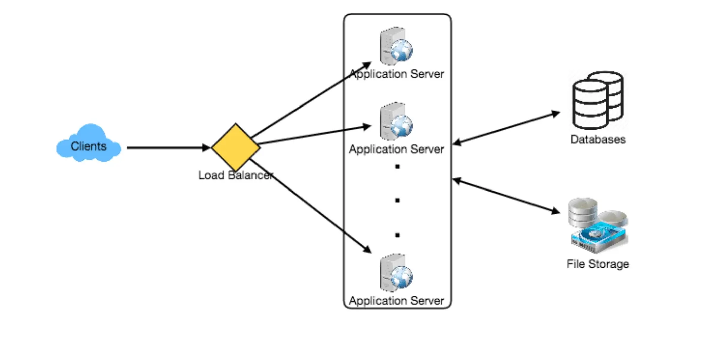
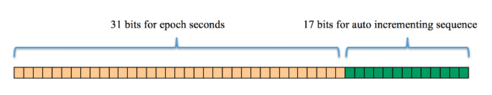

这是一篇双语翻译的文章，原文出自 [grok_system_design_interview.pdf](https:/github.com/sharanyaa/grok_sdi_educative/blob/master/grok_system_design_interview.pdf) 的一篇文章《Designing Twitter》设计 Twitter。

---

Let’s design a Twitter-like social networking service. Users of the service will be able to post tweets, follow other people, and favorite tweets. Difficulty Level: Medium

> 让我们设计一个类似 Twitter 的社交网络服务。该服务的用户将能够发布推文、关注其他人以及喜欢的推文。难度级别：中等

## 1. What is Twitter? 

> 1.什么是推特？

Twitter is an online social networking service where users post and read short 140-character messages called “tweets.” Registered users can post and read tweets, but those who are not registered can only read them. Users access Twitter through their website interface, SMS, or mobile app.

> Twitter 是一种在线社交网络服务，用户可以在其中发布和阅读称为“推文”的 140 个字符的简短消息。注册用户可以发布和阅读推文，但未注册的用户只能阅读推文。用户通过网站界面、短信或移动应用程序访问 Twitter。

## 2. Requirements and Goals of the System

> 2. 系统的要求和目标

We will be designing a simpler version of Twitter with the following requirements:

> 我们将设计一个更简单的 Twitter 版本，并满足以下要求：

**Functional Requirements**

> 功能要求

1. Users should be able to post new tweets.
  
   > 用户应该能够发布新的推文。
   
2. A user should be able to follow other users.
  
   > 用户应该能够关注其他用户。
   
3. Users should be able to mark tweets as favorites.
  
   > 用户应该能够将推文标记为收藏夹。
   
4. The service should be able to create and display a user’s timeline consisting of top tweets from all the people the user follows.
  
   > 该服务应该能够创建并显示用户的时间线，其中包含来自以下位置的热门推文：用户关注的所有人员。
   
5. Tweets can contain photos and videos.
  
   > 推文可以包含照片和视频。

**Non-functional Requirements**

> 非功能性需求

1. Our service needs to be highly available.
  
   > 我们的服务需要高度可用。
   
2. Acceptable latency of the system is 200ms for timeline generation.
  
   > 时间线生成系统可接受的延迟为 200 毫秒。
   
3. Consistency can take a hit (in the interest of availability); if a user doesn’t see a tweet for a while, it should be fine.
  
   > 一致性可能会受到影响（为了可用性）；如果用户没有看到某条推文同时，应该没问题。

**Extended Requirements**

> 扩展要求

1. Searching for tweets. 

   > 正在搜索推文。

2. Replying to a tweet.

   > 回复推文。

3. Trending topics – current hot topics/searches. 

   > 热门话题 – 当前的热门话题/搜索。 

4. Tagging other users.

   > 标记其他用户。

5) Tweet Notification. 

   > 推文通知。

6) Who to follow? Suggestions?

   > 跟随谁？建议？

7) Moments.

   > 时刻。

## 3. Capacity Estimation and Constraints

> 3. 容量估计和约束

Let’s assume we have one billion total users with 200 million daily active users (DAU). Also assume we have 100 million new tweets every day and on average each user follows 200 people.

> 假设我们的总用户数为 10 亿，其中每日活跃用户 (DAU) 为 2 亿。还假设我们每天有 1 亿条新推文，平均每个用户关注 200 人。

**How many favorites per day?** If, on average, each user favorites five tweets per day we will have: 200M users * 5 favorites => 1B favorites

> 每天有多少个收藏夹？如果平均每个用户每天收藏 5 条推文，我们将拥有：2 亿用户 * 5 个收藏 => 1B 个收藏

**How many total tweet-views will our system generate?** Let’s assume on average a user visits their timeline two times a day and visits five other people’s pages. On each page if a user sees 20 tweets, then our system will generate 28B/day total tweet-views:

> 我们的系统总共会产生多少推文浏览量？假设用户平均每天访问自己的时间线两次，并访问其他五个人的页面。如果用户在每个页面上看到 20 条推文，那么我们的系统将生成 28B/天的总推文浏览量：

200M DAU * ((2 + 5) * 20 tweets) => 28B/day

**Storage Estimates** Let’s say each tweet has 140 characters and we need two bytes to store a character without compression. Let’s assume we need 30 bytes to store metadata with each tweet (like ID, timestamp, user ID, etc.). Total storage we would need:

> 存储估算 假设每条推文有 140 个字符，我们需要两个字节来存储一个字符而不进行压缩。假设我们需要 30 个字节来存储每条推文的元数据（如 ID、时间戳、用户 ID 等）。我们需要的总存储空间：

100M * (280 + 30) bytes => 30GB/day


What would our storage needs be for five years? How much storage we would need for users’ data, follows, favorites? We will leave this for the exercise.

> 五年内我们的存储需求是多少？我们需要多少存储空间来存储用户数据、关注数据、收藏夹？我们将把它留给练习。

Not all tweets will have media, let’s assume that on average every fifth tweet has a photo and every tenth has a video. Let’s also assume on average a photo is 200KB and a video is 2MB. This will lead us to have 24TB of new media every day.

> 并非所有推文都会有媒体，我们假设平均每五条推文有一张照片，每十分之一有一个视频。我们还假设平均一张照片为 200KB，一段视频为 2MB。这将使我们每天拥有 24TB 的新媒体。

(100M/5 photos * 200KB) + (100M/10 videos * 2MB) ~= 24TB/day


**Bandwidth Estimates** Since total ingress is 24TB per day, this would translate into 290MB/sec.

> 带宽估计 由于总入口量为每天 24TB，这将转化为 290MB/秒。

Remember that we have 28B tweet views per day. We must show the photo of every tweet (if it has a photo), but let’s assume that the users watch every 3rd video they see in their timeline. So, total egress will be:

> 请记住，我们每天的推文浏览量为 28B。我们必须显示每条推文的照片（如果它有照片），但我们假设用户观看他们在时间线中看到的每第三个视频。因此，总出口将为：

## 4. System APIs 

> **4. 系统API**

**Once we’ve finalized the requirements, it’s always a good idea to define the system APIs. This should explicitly state what is expected from the system.**

> **一旦我们最终确定了需求，定义系统 API 总是一个好主意。这应该明确说明系统的期望。**

We can have SOAP or REST APIs to expose the functionality of our service. Following could be the definition of the API for posting a new tweet:

> 我们可以使用 SOAP 或 REST API 来公开我们服务的功能。以下是用于发布新推文的 API 的定义：

```
tweet(api_dev_key, tweet_data, tweet_location, user_location, media_ids,
maximum_results_to_return)
```

**Parameters: 参数：**

api_dev_key (string): The API developer key of a registered account. This will be used to, among other things, throttle users based on their allocated quota. tweet_data (string): The text of the tweet, typically up to 140 characters. tweet_location (string): Optional location (longitude, latitude) this Tweet refers to. user_location (string): Optional location (longitude, latitude) of the user adding the tweet.

> api_dev_key (string): 注册账户的API开发者密钥。除其他外，这将用于根据分配的配额限制用户。 tweet_data（字符串）：推文的文本，通常最多 140 个字符。 tweet_location（字符串）：此推文所指的可选位置（经度、纬度）。 user_location（字符串）：添加推文的用户的可选位置（经度、纬度）。

media_ids (number[]): Optional list of media_ids to be associated with the Tweet. (All the media photo, video, etc. need to be uploaded separately).

> media_ids (number[])：与推文关联的可选 media_ids 列表。 （所有媒体照片、视频等需单独上传）。

**Returns:** (string) A successful post will return the URL to access that tweet. Otherwise, an appropriate HTTP error is returned.

> 返回：（字符串）成功发布的帖子将返回用于访问该推文的 URL。否则，将返回适当的 HTTP 错误。

## 5. High Level System Design

> 5. 高层系统设计

We need a system that can efficiently store all the new tweets, 100M/86400s => 1150 tweets per second and read 28B/86400s => 325K tweets per second. It is clear from the requirements that this will be a read-heavy system.

> 我们需要一个能够高效存储所有新推文的系统，每秒 100M/86400s => 1150 条推文，每秒读取 28B/86400s => 325K 条推文。从需求中可以清楚地看出，这将是一个读取繁重的系统。

At a high level, we need multiple application servers to serve all these requests with load balancers in front of them for traffic distributions. On the backend, we need an efficient database that can store all the new tweets and can support a huge number of reads. We also need some file storage to store photos and videos.

> 在较高层面上，我们需要多个应用程序服务器来服务所有这些请求，并在它们前面提供负载均衡器以进行流量分配。在后端，我们需要一个高效的数据库，能够存储所有新的推文，并且能够支持海量的读取。我们还需要一些文件存储来存储照片和视频。



Although our expected daily write load is 100 million and read load is 28 billion tweets. This means on average our system will receive around 1160 new tweets and 325K read requests per second. This traffic will be distributed unevenly throughout the day, though, at peak time we should expect at least a few thousand write requests and around 1M read requests per second. We should keep this in mind while designing the architecture of our system.

> 尽管我们预计每日写入负载为 1 亿条推文，读取负载为 280 亿条推文。这意味着我们的系统平均每秒将收到大约 1160 条新推文和 325K 读取请求。不过，该流量在一天中的分布不均匀，但在高峰时段，我们预计每秒至少有几千个写入请求和大约 100 万个读取请求。我们在设计系统架构时应该牢记这一点。

## 6. Database Schema

> 6. 数据库架构

We need to store data about users, their tweets, their favorite tweets, and people they follow.

> 我们需要存储有关用户、他们的推文、他们最喜欢的推文以及他们关注的人的数据。

For choosing between SQL and NoSQL databases to store the above schema, please see ‘Database schema’ under Designing Instagram.

> 要在 SQL 和 NoSQL 数据库之间进行选择来存储上述架构，请参阅设计 Instagram 下的“数据库架构”。

## 7. Data Sharding

> 7.数据分片

Since we have a huge number of new tweets every day and our read load is extremely high too, we need to distribute our data onto multiple machines such that we can read/write it efficiently. We have many options to shard our data; let’s go through them one by one:

> 由于我们每天都会有大量的新推文，并且读取负载也非常高，因此我们需要将数据分发到多台机器上，以便能够高效地读/写。我们有很多选择来分片我们的数据；让我们一一分析一下：

**Sharding based on UserID:** We can try storing all the data of a user on one server. While storing, we can pass the UserID to our hash function that will map the user to a database server where we will store all of the user’s tweets, favorites, follows, etc. While querying for tweets/follows/favorites of a user, we can ask our hash function where can we find the data of a user and then read it from there. This approach has a couple of issues:

> 基于UserID的分片：我们可以尝试将一个用户的所有数据存储在一台服务器上。在存储时，我们可以将 UserID 传递给我们的哈希函数，该函数将用户映射到数据库服务器，我们将在其中存储用户的所有推文、收藏夹、关注等。在查询用户的推文/关注/收藏夹时，我们可以询问我们的哈希函数在哪里可以找到用户的数据，然后从那里读取它。这种方法有几个问题：

1. What if a user becomes hot? There could be a lot of queries on the server holding the user. This high load will affect the performance of our service.
  
   > 如果用户变得热门怎么办？持有用户的服务器上可能有很多查询。这种高负载会影响我们服务的性能。
2. Over time some users can end up storing a lot of tweets or having a lot of follows compared to others. Maintaining a uniform distribution of growing user data is quite difficult.
  
   > 随着时间的推移，与其他用户相比，一些用户最终可能会存储大量推文或拥有大量关注者。保持不断增长的用户数据的均匀分布是相当困难的。

To recover from these situations either we have to repartition/redistribute our data or use consistent hashing.

> 为了从这些情况中恢复，我们必须重新分区/重新分布我们的数据或使用一致的散列。

**Sharding based on TweetID:** Our hash function will map each TweetID to a random server where we will store that Tweet. To search for tweets, we have to query all servers, and each server will return a set of tweets. A centralized server will aggregate these results to return them to the user. Let’s look into timeline generation example; here are the number of steps our system has to perform to generate a user’s timeline:

> 基于 TweetID 的分片：我们的哈希函数会将每个 TweetID 映射到一个随机服务器，我们将在其中存储该推文。要搜索推文，我们必须查询所有服务器，每个服务器都会返回一组推文。中央服务器将汇总这些结果并将其返回给用户。让我们看一下时间线生成示例；以下是我们的系统生成用户时间线必须执行的步骤数：

1. Our application (app) server will find all the people the user follows.
  
   > 我们的应用程序（app）服务器将找到用户关注的所有人员。
   
2. App server will send the query to all database servers to find tweets from these people.
  
   > 应用服务器会将查询发送到所有数据库服务器以查找这些人的推文。
   
3. Each database server will find the tweets for each user, sort them by recency and return the top tweets. 
  
   > 每个数据库服务器都会找到每个用户的推文，按新近度对它们进行排序并返回顶部推文。
   
4. App server will merge all the results and sort them again to return the top results to the user.
  
   > 应用服务器将合并所有结果并再次排序，将排名靠前的结果返回给用户。

This approach solves the problem of hot users, but, in contrast to sharding by UserID, we have to query all database partitions to find tweets of a user, which can result in higher latencies.

> 这种方法解决了热点用户的问题，但是，与按 UserID 分片相比，我们必须查询所有数据库分区才能找到用户的推文，这可能会导致更高的延迟。

We can further improve our performance by introducing cache to store hot tweets in front of the database servers.

> 我们可以通过在数据库服务器前面引入缓存来存储热门推文来进一步提高性能。

**Sharding based on Tweet creation time:** Storing tweets based on creation time will give us the advantage of fetching all the top tweets quickly and we only have to query a very small set of servers. The problem here is that the traffic load will not be distributed, e.g., while writing, all new tweets will be going to one server and the remaining servers will be sitting idle. Similarly, while reading, the server holding the latest data will have a very high load as compared to servers holding old data.

> 基于推文创建时间的分片：基于创建时间存储推文将为我们提供快速获取所有热门推文的优势，并且我们只需要查询非常小的一组服务器。这里的问题是流量负载不会被分配，例如，在写入时，所有新推文将发送到一台服务器，而其余服务器将闲置。类似地，在读取时，与保存旧数据的服务器相比，保存最新数据的服务器将具有非常高的负载。

**What if we can combine sharding by TweedID and Tweet creation time?** If we don’t store tweet creation time separately and use TweetID to reflect that, we can get benefits of both the approaches. This way it will be quite quick to find the latest Tweets. For this, we must make each TweetID universally unique in our system and each TweetID should contain a timestamp too.

> 如果我们可以将 TweedID 和推文创建时间的分片结合起来会怎么样？如果我们不单独存储推文创建时间并使用 TweetID 来反映这一点，我们就可以从这两种方法中受益。这样就可以很快找到最新的推文。为此，我们必须使每个 TweetID 在我们的系统中普遍唯一，并且每个 TweetID 也应该包含一个时间戳。

We can use epoch time for this. Let’s say our TweetID will have two parts: the first part will be representing epoch seconds and the second part will be an auto-incrementing sequence. So, to make a new TweetID, we can take the current epoch time and append an auto-incrementing number to it. We can figure out the shard number from this TweetID and store it there.

> 我们可以为此使用纪元时间。假设我们的 TweetID 将有两部分：第一部分将表示纪元秒，第二部分将是自动递增序列。因此，要创建一个新的 TweetID，我们可以获取当前纪元时间并向其附加一个自动递增的数字。我们可以从这个 TweetID 中找出分片编号并将其存储在那里。

What could be the size of our TweetID? Let’s say our epoch time starts today, how many bits we would need to store the number of seconds for the next 50 years?

> 我们的 TweetID 的大小是多少？假设我们的纪元时间从今天开始，我们需要多少位来存储未来 50 年的秒数？

86400 sec/day * 365 (days a year) * 50 (years) => 1.6B



We would need 31 bits to store this number. Since on average we are expecting 1150 new tweets per second, we can allocate 17 bits to store auto incremented sequence; this will make our TweetID 48 bits long. So, every second we can store (2^17 => 130K) new tweets. We can reset our auto incrementing sequence every second. For fault tolerance and better performance, we can have two database servers to generate auto-incrementing keys for us, one generating even numbered keys and the other generating odd numbered keys.

> 我们需要 31 位来存储这个数字。由于我们平均每秒预计有 1150 条新推文，因此我们可以分配 17 位来存储自动递增序列；这将使我们的 TweetID 长为 48 位。因此，每一秒我们都可以存储 (2^17 => 130K) 条新推文。我们可以每秒重置自动递增序列。为了容错和更好的性能，我们可以有两台数据库服务器为我们生成自动递增键，一台生成偶数键，另一台生成奇数键。

If we assume our current epoch seconds are “1483228800,” our TweetID will look like this:

> 如果我们假设当前的纪元秒是“1483228800”，我们的 TweetID 将如下所示：

1483228800 000001 1483228800 000002 1483228800 000003 1483228800 000004 …

If we make our TweetID 64bits (8 bytes) long, we can easily store tweets for the next 100 years and also store them for mili-seconds granularity.

> 如果我们将 TweetID 设为 64 位（8 字节）长，我们​​就可以轻松存储未来 100 年的推文，并以毫秒为粒度进行存储。

In the above approach, we still have to query all the servers for timeline generation, but our reads (and writes) will be substantially quicker.

> 在上述方法中，我们仍然需要查询所有服务器以生成时间线，但我们的读取（和写入）将会快得多。

1. Since we don’t have any secondary index (on creation time) this will reduce our write latency. 2. While reading, we don’t need to filter on creation-time as our primary key has epoch time included in it. 
  
   > 由于我们没有任何二级索引（在创建时），这将减少我们的写入延迟。 2.在读取时，我们不需要过滤创建时间，因为我们的主键有纪元时间包含在其中。

## 8. Cache

> 8.缓存

We can introduce a cache for database servers to cache hot tweets and users. We can use an off-the- shelf solution like Memcache that can store the whole tweet objects. Application servers, before hitting database, can quickly check if the cache has desired tweets. Based on clients’ usage patterns we can determine how many cache servers we need.

> 我们可以为数据库服务器引入缓存来缓存热门推文和用户。我们可以使用像 Memcache 这样的现成解决方案来存储整个推文对象。应用服务器在访问数据库之前可以快速检查缓存中是否有所需的推文。根据客户的使用模式，我们可以确定需要多少个缓存服务器。

**Which cache replacement policy would best fit our needs?** When the cache is full and we want to replace a tweet with a newer/hotter tweet, how would we choose? Least Recently Used (LRU) can be a reasonable policy for our system. Under this policy, we discard the least recently viewed tweet first.

> 哪种缓存替换策略最适合我们的需求？当缓存已满并且我们想用更新/更热门的推文替换一条推文时，我们会如何选择？最近最少使用（LRU）对于我们的系统来说是一个合理的策略。根据此政策，我们首先丢弃最近最少查看的推文。

**How can we have a more intelligent cache?** If we go with 80-20 rule, that is 20% of tweets generating 80% of read traffic which means that certain tweets are so popular that a majority of people read them. This dictates that we can try to cache 20% of daily read volume from each shard.

> 如何才能拥有更智能的缓存呢？如果我们采用 80-20 规则，即 20% 的推文产生 80% 的阅读流量，这意味着某些推文非常受欢迎，以至于大多数人都会阅读它们。这表明我们可以尝试缓存每个分片每日读取量的 20%。

**What if we cache the latest data?** Our service can benefit from this approach. Let’s say if 80% of our users see tweets from the past three days only; we can try to cache all the tweets from the past three days. Let’s say we have dedicated cache servers that cache all the tweets from all the users from the past three days. As estimated above, we are getting 100 million new tweets or 30GB of new data every day (without photos and videos). If we want to store all the tweets from last three days, we will need less than 100GB of memory. This data can easily fit into one server, but we should replicate it onto multiple servers to distribute all the read traffic to reduce the load on cache servers. So whenever we are generating a user’s timeline, we can ask the cache servers if they have all the recent tweets for that user. If yes, we can simply return all the data from the cache. If we don’t have enough tweets in the cache, we have to query the backend server to fetch that data. On a similar design, we can try caching photos and videos from the last three days.

> 如果我们缓存最新的数据怎么办？我们的服务可以从这种方法中受益。假设我们 80% 的用户只看到过去三天的推文；我们可以尝试缓存过去三天的所有推文。假设我们有专用的缓存服务器，可以缓存过去三天所有用户的所有推文。根据上述估计，我们每天会收到 1 亿条新推文或 30GB 新数据（不包括照片和视频）。如果我们想要存储过去三天的所有推文，我们将需要不到 100GB 的内存。这些数据可以很容易地放入一台服务器中，但我们应该将其复制到多台服务器上以分配所有读取流量，从而减少缓存服务器上的负载。因此，每当我们生成用户的时间线时，我们都可以询问缓存服务器是否拥有该用户最近的所有推文。如果是，我们可以简单地从缓存中返回所有数据。如果缓存中没有足够的推文，我们必须查询后端服务器来获取该数据。在类似的设计中，我们可以尝试缓存最近三天的照片和视频。

Our cache would be like a hash table where ‘key’ would be ‘OwnerID’ and ‘value’ would be a doubly linked list containing all the tweets from that user in the past three days. Since we want to retrieve the most recent data first, we can always insert new tweets at the head of the linked list, which means all the older tweets will be near the tail of the linked list. Therefore, we can remove tweets from the tail to make space for newer tweets.

> 我们的缓存就像一个哈希表，其中“key”是“OwnerID”，“value”是一个双向链表，其中包含该用户在过去三天内的所有推文。由于我们希望首先检索最新的数据，因此我们始终可以在链表的头部插入新的推文，这意味着所有较旧的推文将位于链表的尾部附近。因此，我们可以从尾部删除推文，为新的推文腾出空间。


## 9. Timeline Generation

> **9. 时间线生成**

For a detailed discussion about timeline generation, take a look at Designing Facebook’s Newsfeed. 

> 有关时间线生成的详细讨论，请查看设计 Facebook 的新闻源。 

## 10. Replication and Fault Tolerance

> 10.复制和容错

Since our system is read-heavy, we can have multiple secondary database servers for each DB partition. Secondary servers will be used for read traffic only. All writes will first go to the primary server and then will be replicated to secondary servers. This scheme will also give us fault tolerance, since whenever the primary server goes down we can failover to a secondary server.

> 由于我们的系统是读取密集型的，因此我们可以为每个数据库分区拥有多个辅助数据库服务器。辅助服务器将仅用于读取流量。所有写入将首先发送到主服务器，然后复制到辅助服务器。该方案还为我们提供了容错能力，因为每当主服务器出现故障时，我们都可以故障转移到辅助服务器。

## 11. Load Balancing

> **11.负载均衡**

We can add Load balancing layer at three places in our system 1) Between Clients and Application servers 2) Between Application servers and database replication servers and 3) Between Aggregation servers and Cache server. Initially, a simple Round Robin approach can be adopted; that distributes incoming requests equally among servers. This LB is simple to implement and does not introduce any overhead. Another benefit of this approach is that if a server is dead, LB will take it out of the rotation and will stop sending any traffic to it. A problem with Round Robin LB is that it won’t take servers

> 我们可以在系统中的三个位置添加负载平衡层：1）客户端和应用程序服务器之间，2）应用程序服务器和数据库复制服务器之间，3）聚合服务器和缓存服务器之间。最初，可以采用简单的循环方法；在服务器之间平均分配传入请求。该LB实现简单，不会引入任何开销。这种方法的另一个好处是，如果服务器死机，LB 会将其从轮换中删除，并停止向其发送任何流量。循环负载均衡的一个问题是它不会占用服务器

load into consideration. If a server is overloaded or slow, the LB will not stop sending new requests to that server. To handle this, a more intelligent LB solution can be placed that periodically queries backend server about their load and adjusts traffic based on that.

> 负载考虑。如果服务器过载或速度缓慢，负载均衡器不会停止向该服务器发送新请求。为了解决这个问题，可以放置更智能的 LB 解决方案，定期查询后端服务器的负载并据此调整流量。

## 12. Monitoring

> **12. 监控**

Having the ability to monitor our systems is crucial. We should constantly collect data to get an instant insight into how our system is doing. We can collect following metrics/counters to get an understanding of the performance of our service:

> 拥有监控我们系统的能力至关重要。我们应该不断收集数据，以便立即了解我们的系统的运行情况。我们可以收集以下指标/计数器来了解我们服务的性能：

1. New tweets per day/second, what is the daily peak?
  
   > 每天/每秒新推文，每日峰值是多少？
2. Timeline delivery stats, how many tweets per day/second our service is delivering. 3. Average latency that is seen by the user to refresh timeline.
  
   > 时间轴传送统计数据，我们的服务每天/每秒传送多少条推文。 3. 用户看到的刷新时间线的平均延迟。

By monitoring these counters, we will realize if we need more replication, load balancing, or caching.

> 通过监视这些计数器，我们将意识到是否需要更多复制、负载平衡或缓存。

## 13. Extended Requirements

> 13.扩展要求

**How do we serve feeds?** Get all the latest tweets from the people someone follows and merge/sort them by time. Use pagination to fetch/show tweets. Only fetch top N tweets from all the people someone follows. This N will depend on the client’s Viewport, since on a mobile we show fewer tweets compared to a Web client. We can also cache next top tweets to speed things up.

> 我们如何提供 Feed？获取某人关注的人的所有最新推文，并按时间对它们进行合并/排序。使用分页来获取/显示推文。只获取所有关注者的前 N ​​条推文。这个 N 将取决于客户端的视口，因为与 Web 客户端相比，我们在移动设备上显示的推文更少。我们还可以缓存下一个热门推文以加快速度。

Alternately, we can pre-generate the feed to improve efficiency; for details please see ‘Ranking and timeline generation’ under Designing Instagram.

> 或者，我们可以预先生成 feed 以提高效率；有关详细信息，请参阅“设计 Instagram”下的“排名和时间线生成”。

**Retweet:** With each Tweet object in the database, we can store the ID of the original Tweet and not store any contents on this retweet object.

> 转推：对于数据库中的每个推文对象，我们可以存储原始推文的 ID，并且在此转推对象上不存储任何内容。

**Trending Topics:** We can cache most frequently occurring hashtags or search queries in the last N seconds and keep updating them after every M seconds. We can rank trending topics based on the frequency of tweets or search queries or retweets or likes. We can give more weight to topics which are shown to more people.

> 热门主题：我们可以缓存最近 N 秒内最常出现的主题标签或搜索查询，并在每 M 秒后不断更新它们。我们可以根据推文、搜索查询、转发或点赞的频率对热门主题进行排名。我们可以更加重视向更多人展示的主题。

**Who to follow? How to give suggestions?** This feature will improve user engagement. We can suggest friends of people someone follows. We can go two or three levels down to find famous people for the suggestions. We can give preference to people with more followers.

> 跟随谁？如何提出建议？此功能将提高用户参与度。我们可以推荐某人关注的人的朋友。我们可以下两三层去找名人提建议。我们可以优先考虑拥有更多关注者的人。

As only a few suggestions can be made at any time, use Machine Learning (ML) to shuffle and re- prioritize. ML signals could include people with recently increased follow-ship, common followers if the other person is following this user, common location or interests, etc.

> 由于任何时候只能提出一些建议，因此请使用机器学习 (ML) 来重新排列和重新确定优先级。机器学习信号可能包括最近关注量增加的人、共同关注者（如果其他人正在关注该用户）、共同位置或兴趣等。

**Moments:** Get top news for different websites for past 1 or 2 hours, figure out related tweets, prioritize them, categorize them (news, support, financial, entertainment, etc.) using ML – supervised learning or Clustering. Then we can show these articles as trending topics in Moments.

> 时刻：获取过去 1 或 2 小时内不同网站的热门新闻，找出相关推文，对它们进行优先级排序，使用 ML（监督学习或聚类）对它们进行分类（新闻、支持、金融、娱乐等）。然后我们就可以把这些文章作为朋友圈的热门话题展示出来。

**Search:** Search involves Indexing, Ranking, and Retrieval of tweets. A similar solution is discussed in our next problem Design Twitter Search.

> 搜索：搜索涉及推文的索引、排名和检索。我们的下一个问题“设计 Twitter 搜索”中讨论了类似的解决方案。
