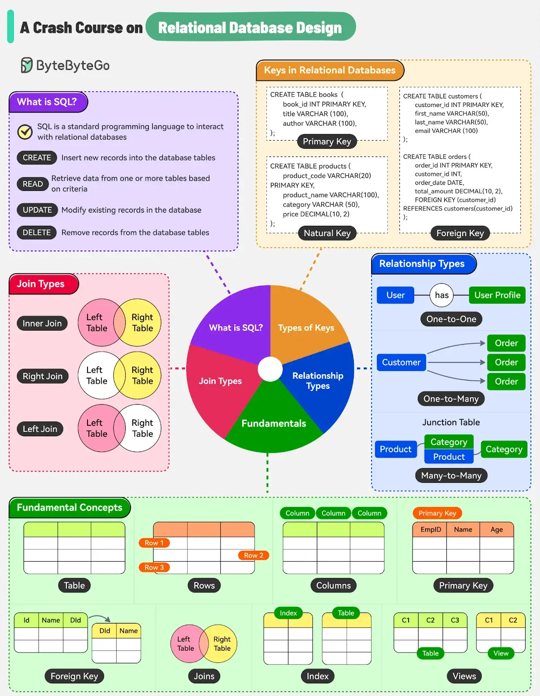
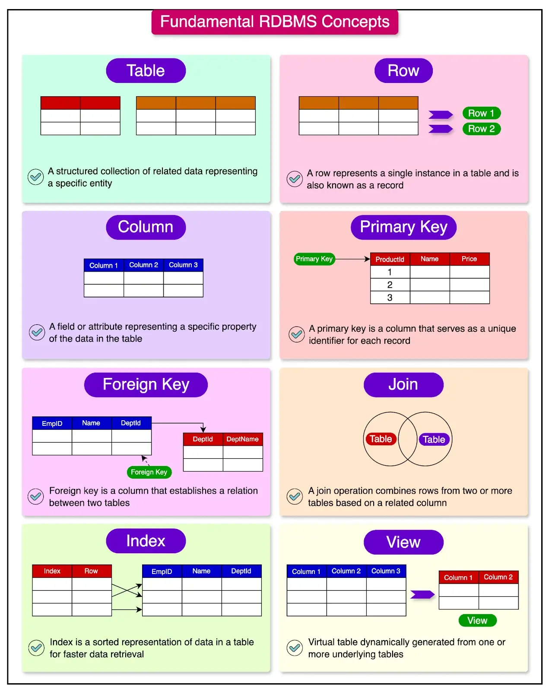

原文链接：[https://blog.bytebytego.com/p/a-crash-course-on-relational-database](https://blog.bytebytego.com/p/a-crash-course-on-relational-database)

在当今数据驱动的世界中，高效存储和管理信息是各种规模的企业和组织的关键要求。

<!--more-->

关系数据库提供了一个强大的框架，用于根据实体之间明确定义的关系来存储和检索数据。它们提供了一种结构化的数据管理方法，使用户能够：

- 定义表 
- 建立关系
- 执行复杂查询以从存储的信息中提取有意义的见解

然而，仅仅使用关系数据库还不足以获得其好处。 

有效的数据库设计对于优化性能、确保数据完整性和促进高效的数据检索至关重要。数据库设计原则（例如规范化、索引、连接和关系）在创建结构良好且性能良好的数据库中起着至关重要的作用。

在这篇文章中，我们将研究关系数据库的基础知识，探讨其关键概念、管理系统以及有效数据库设计的基础原则。




## 什么是关系数据库？

关系数据库是一种将数据组织成结构化表格（也称为关系）的数据库。这些表格由行（记录）和列（字段）组成，形成表格结构，可实现高效的数据存储和检索。

关系数据库的强大之处在于它能够在多个表之间建立关系。 

通过定义相关表之间的连接，可以链接和组合信息。这允许跨多个表进行复杂的查询和数据检索操作，使您能够以各种方式访问和分析数据。

为了有效地使用关系数据库，我们需要一个关系数据库管理系统 (RDBMS)。 

RDBMS 是一种用于创建、管理和与关系数据库交互的软件应用程序。

RDBMS 提供的一些关键功能包括：

- **数据定义**： 定义数据库的结构，包括表、列、数据类型和约束。
- **数据操作**： 对数据库中存储的数据执行各种操作。包括插入新记录、更新现有记录、删除记录等。
- **数据完整性**： RDBMS 强制执行数据完整性规则来维护数据的准确性和一致性。
- **数据安全**： RDBMS 还通过定义用户角色、权限和身份验证措施来提供控制数据库访问的机制。
- **查询优化**： RDBMS 优化复杂查询的执行，以高效检索数据。它采用各种技术，例如索引和查询优化算法。

市场上有多种 RDBMS，每种都具有一组特性和功能。以下是一些示例：

- **MySQL**： 一种开源 RDBMS，以其简单性、可靠性和广泛采用而闻名。
- **PostgreSQL**： 一个强大的开源 RDBMS，具有高级功能和对数据完整性的强大支持。
- **Oracle** 数据库： 一种功能全面、丰富的 RDBMS，常用于企业环境。

## SQL：关系数据库语言

SQL（结构化查询语言）是用于与关系数据库交互的标准编程语言。 

其主要优势之一是通用性。在 MySQL、PostgreSQL、Oracle 等上工作时，语法基本保持不变。 

这种可移植性使开发人员能够以最小的学习曲线从一个 RDBMS 切换到另一个 RDBMS。

SQL 提供了一套全面的命令和语法，允许开发人员和数据库管理员对数据库中存储的数据执行各种操作。

SQL 支持四种基本的数据操作，通常称为 CRUD：

1. **创建**： 将新记录插入数据库表，有效地创建新的数据条目。
2. **读取**： 根据特定条件从一个或多个表中检索数据。 
3. **更新**： 修改数据库中现有的记录。
4. **删除**： 从数据库表中删除不再需要或满足特定删除条件的记录。

除了数据操作之外，SQL 还提供定义和修改数据库结构的命令。

## 基本 RDBMS 概念

使用关系数据库时，了解基本概念和术语至关重要。

让我们探讨一些关键术语：

- **表**： 按行和列组织的相关数据的结构化集合。每个表代表一个特定的实体或概念，例如客户、订单或产品。
- **行**： 行，也称为记录或元组，表示表中的单个实例或条目。例如，在“客户”表中，每一行都属于具有某些属性的单个客户。
- **列**： 列，也称为字段或属性，表示表中特定记录的特定特征或属性。列用于组织和分类表中的数据。
- **主键**： 主键是一列或多列的组合，用作表中每条记录的唯一标识符。它通过防止主键列中的重复值或空值来确保数据的唯一性和完整性。
- **外键**： 外键是表中引用另一个表的主键的列或列组合。它建立两个表之间的关系，并有助于加强引用完整性和数据一致性。
- **连接**： 连接是一种根据相关列将两个或多个表中的行组合在一起的操作。通过指定组合表的条件，可以从多个表中检索数据。
- **索引**： 索引是一种数据结构，可提高数据库中数据检索操作的性能。它根据一个或多个列创建表中数据的排序表示。 
- **视图**： 视图是从一个或多个基础表动态生成的虚拟表。它提供数据的自定义和简化表示。视图可用于安全性、简化或数据抽象目的。




## 关系数据库中的键

键是关系数据库设计中的基本组件，在数据完整性和建立表间关系方面发挥着至关重要的作用。 

它们作为记录的唯一标识符，使数据检索和处理更加高效。 

让我们看看不同类型的键及其在关系数据库设计中的意义。

### 主键和索引

主键是唯一标识表中每条记录的一列或多列的组合。

它确保每条记录都是唯一的，并且可以在表中轻松找到。主键约束强制主键列的唯一性和非空性。

下面的示例显示如何将表中的某一列定义为主键：

```sql
CREATE TABLE books (
    book_id INT PRIMARY KEY,
    title VARCHAR(100),
    author VARCHAR(100),
    isbn VARCHAR(20) UNIQUE,
    publication_year INT,
    genre VARCHAR(50)
);
```

通过指定 book_id INT PRIMARY KEY，我们将 book_id 列声明为“books”表的主键。换句话说，book_id 列中的每个值都必须是唯一的，并且不能为空。

为了提高查询性能，数据库会自动在主键列上创建索引。 

如前所述，索引是一种单独的数据结构，有助于根据索引列更快地检索数据。通过在主键上创建索引，数据库可以快速定位和访问特定记录，而无需扫描整个表。

### 代理键和自然键

键也可以按两种方式分类：代理键和自然键。

**代理键**是数据库系统生成的人工键。它通常是序列号或全局唯一标识符 (GUID)，与数据没有固有含义或关系。代理键通常用作主键，因为它们确保唯一性并简化表间关系的管理。

下面的示例显示了一个名为“customers”的表，其中 customer_id 作为代理键：

```sql
CREATE TABLE customers (
    customer_id INT PRIMARY KEY AUTO_INCREMENT,
    first_name VARCHAR(50),
    last_name VARCHAR(50),
    email VARCHAR(100) UNIQUE
);
```

相比之下，**自然键**是从数据本身派生出来的键。它是基于数据固有特征自然地唯一标识每条记录的一列或多列组合。 

自然键的示例包括员工 ID、产品代码、电子邮件地址或个人的“名字”和“姓氏”等列的组合。

下面的示例显示了“产品”表，其中产品代码是自然键。此键是产品数据的固有特征。它可以是制造商分配的代码或标准标识符。

```sql
CREATE TABLE products (
    product_code VARCHAR(20) PRIMARY KEY,
    product_name VARCHAR(100),
    category VARCHAR(50),
    price DECIMAL(10, 2)
);
```

### 外键

外键是表中引用另一个表的主键的列或列的组合。它建立了两个表之间的链接或关系。

下面的示例显示了“customers”表和“orders”表。“orders”表有一个外键，引用“customers”表中的 customer_id。

```sql
CREATE TABLE customers (
    customer_id INT PRIMARY KEY,
    first_name VARCHAR(50),
    last_name VARCHAR(50),
    email VARCHAR(100)
);


CREATE TABLE orders (
    order_id INT PRIMARY KEY,
    customer_id INT,
    order_date DATE,
    total_amount DECIMAL(10, 2),
    FOREIGN KEY (customer_id) REFERENCES customers(customer_id)
);
```

外键的目的是强制参照完整性。 

参照完整性确保子表（具有外键的表）中的数据与父表（具有主键的表）中的数据一致。它可以防止在子表中创建在父表中没有对应记录的孤立记录。

引用完整性是通过使用约束来强制执行的。约束定义了在父表中引用的记录被更新或删除时应采取的规则和操作，以确保表之间的关系保持一致和有效。

以下是一些常见的限制：

- **CASCADE**： 当父表中的记录被更新或删除时，CASCADE 操作会自动将更改传播到子表。例如，如果删除了父表中的记录，则子表中的相应记录也会被删除。
- **SET NULL**： 当父表中的记录被更新或删除时，SET NULL 操作会将子表中相应的外键值设置为 NULL。
- **无操作**： 如果任何子表引用了父行，则此操作将阻止删除该父行。 

下面的示例显示如何定义外键约束：

```sql
CREATE TABLE Orders (
    OrderID INT PRIMARY KEY,
    CustomerID INT,
    OrderDate DATE,
    FOREIGN KEY (CustomerID) REFERENCES Customers(CustomerID) ON DELETE CASCADE
);
```

## 关系数据库中的关系类型

在关系数据库中，表之间的关系在定义数据如何连接方面起着关键作用。这些关系决定了数据库的结构和完整性。 

让我们探讨三种主要的关系类型：一对一、一对多和多对多。

### 一对一关系

一对一关系是一种关系类型，其中一个表中的每个记录都与另一个表中的一个记录相关联，反之亦然。 

这意味着表 A 中的每条记录，表 B 中都有一个对应的唯一记录，并且表 B 中没有其他记录与表 A 中的该记录相关联。

一对一关系在实践中相对少见，因为它们通常表示两个表可以合并为一个表。但是，在某些情况下，一对一关系很有用，例如当您出于安全或性能原因想要将某些属性分离到单独的表中时。

下面的示例显示了“用户”和“用户配置文件”表之间的一对一关系。


此外，下面的 SQL 显示了如何创建这种关系。

```sql
-- Create the Users table
CREATE TABLE Users (
    UserID INT PRIMARY KEY,
    Username VARCHAR(50),
    Email VARCHAR(100)
);

-- Create the UserProfiles table

CREATE TABLE UserProfiles (
    ProfileID INT PRIMARY KEY,
    UserID INT UNIQUE,
    FirstName VARCHAR(50),
    LastName VARCHAR(50),
    Bio VARCHAR(500),
    FOREIGN KEY (UserID) REFERENCES Users(UserID)
);
```

### 一对多关系

一对多关系是关系数据库中最常见的关系类型。 

在这种关系中，一个表（“一”方）中的每个记录可以与另一个表（“多”方）中的多个记录相关联，但是“多”表中的每个记录仅与“一”表中的一条记录相关联。

一对多关系通常使用“多”表中的外键来实现，该外键引用“一”表的主键。此外键确保引用完整性并维护两个表之间的关系。

下图显示了两个表“客户”和“订单”之间的一对多关系。每个客户可以有多个订单，但每个订单只属于一个客户。


以下是实际创建表和建立一对多关系的 SQL 代码：

```sql
-- Create the Customers table
CREATE TABLE Customers (
    CustomerID INT PRIMARY KEY,
    FirstName VARCHAR(50),
    LastName VARCHAR(50),
    Email VARCHAR(100)
);

-- Create the Orders table
CREATE TABLE Orders (
    OrderID INT PRIMARY KEY,
    CustomerID INT,
    OrderDate DATE,
    TotalAmount DECIMAL(10, 2),
    FOREIGN KEY (CustomerID) REFERENCES Customers(CustomerID)
);
```

### 多对多关系

多对多关系是一种关系类型，其中一个表中的每条记录可以与另一个表中的多个记录相关联，反之亦然。换句话说，两个表中的记录都可以在另一个表中有多个对应的记录。

多对多关系通常使用连接表（也称为桥接表或关联表）来实现。 

连接表包含引用关系中涉及的两个表的主键的外键。连接表中的每个记录都表示两个表中的记录之间的关联。

下图显示了“产品”表和“类别”表之间的多对多关系。连接表“ProductCategories”巩固了这种关系。


以下是创建表和建立多对多关系的 SQL 代码。

```sql
-- Create the Products table
CREATE TABLE Products (
    ProductID INT PRIMARY KEY,
    ProductName VARCHAR(100),
    Description VARCHAR(500),
    Price DECIMAL(10, 2)
);


-- Create the Categories table
CREATE TABLE Categories (
    CategoryID INT PRIMARY KEY,
    CategoryName VARCHAR(50),
    Description VARCHAR(500)
);


-- Create the ProductCategories table (junction table)
CREATE TABLE ProductCategories (
    ProductCategoryID INT PRIMARY KEY,
    ProductID INT,
    CategoryID INT,
    FOREIGN KEY (ProductID) REFERENCES Products(ProductID),
    FOREIGN KEY (CategoryID) REFERENCES Categories(CategoryID)

);
```

## 数据库规范化

数据库规范化是数据库设计中用于优化关系数据库结构的一种有用技术。 

它涉及将数据组织成更小、更易于管理的表，并根据称为范式的明确规则建立它们之间的关系。

数据库规范化的主要目标是减少数据冗余并最大限度地减少数据异常。 

- 当相同的信息存储在数据库的多个位置时，就会出现数据冗余。这可能会导致不一致并使数据维护更加困难。 
- 数据异常有三种类型：
  - **插入异常**： 当没有其他数据时无法将某些数据插入数据库时，就会发生这种情况。例如，如果客户详细信息和产品详细信息存储在同一张表中，则可能无法在不将新产品与客户关联的情况下创建新产品。
  - **更新异常**： 当在一个地方更新数据需要在多个其他地方更新相同的数据时，就会出现更新异常。
  - **删除异常**： 删除异常是指删除一个表的数据时会删除其他相关数据。例如，如果学生和课程信息存储在同一张表中，删除学生记录可能也会删除课程信息。

最常用的范式是：

- 第一范式（1NF）
- 第二范式（2NF）
- 第三范式（3NF）

让我们逐一看一下。

### 1NF（数据库规范化的第一范式）

1NF 的关键原则是表中的每个属性（列）必须包含原子值。 

在此上下文中，原子性意味着表中的每个单元格应包含一个不可分割的值。换句话说，如果表在单个列中不包含任何重复的数据组或数组，则该表被视为符合 1NF。

通过遵守这些要求，1NF 消除了在单个单元格中存储多个值的需要，并防止创建重复的数据组。

例如，这里有一个违反第一范式的表定义：

```sql
CREATE TABLE Students (
    StudentID INT PRIMARY KEY,
    Name VARCHAR(100),
    Courses VARCHAR(200)
);

INSERT INTO Students (StudentID, Name, Courses)
VALUES (1, 'John Doe', 'Math, Science, History');
```

在此表中，Students 表中的 Courses 列包含每个学生所注册的课程的逗号分隔列表。这违反了第一范式，因为 Courses 列在单个单元格中包含多个值。

解决这个问题的一种方法是建立单独的表来存储学生和课程之间的映射。

```sql
-- Create the Courses table
CREATE TABLE Courses (
    CourseID INT PRIMARY KEY,
    CourseName VARCHAR(100)
);

-- Create the StudentCourses table
CREATE TABLE StudentCourses (
    StudentID INT,
    CourseID INT,
    PRIMARY KEY (StudentID, CourseID),
    FOREIGN KEY (StudentID) REFERENCES Students(StudentID),
    FOREIGN KEY (CourseID) REFERENCES Courses(CourseID)
);
```

### 2NF（数据库规范化的第二范式）

第二范式 (2NF) 是实现第一范式 (1NF) 之后规范化过程的下一步。它专注于消除表内的部分依赖关系，确保所有非键属性完全依赖于整个主键。

为了理解 2NF，我们首先定义函数依赖的概念。 

当一个属性的值决定另一个属性的值时，就存在函数依赖关系。在 2NF 上下文中，我们关注非键属性和主键之间的函数依赖关系。

如果表满足以下条件，则认为它符合 2NF：

- 该表符合 1NF。
- 每个非主属性（非键列）完全依赖于整个主键。

为了更好地理解它，请考虑一个“订单”表，该表存储有关客户订单的信息，其结构如下：

```sql
CREATE TABLE Orders (
    OrderID INT,
    ProductID INT,
    CustomerID INT,
    CustomerName VARCHAR(100),
    OrderDate DATE,
    PRIMARY KEY (OrderID, ProductID)
);
```

该表中，主键是由OrderID和ProductID组成的复合键。 

但是，CustomerName 列仅依赖于 CustomerID，而 CustomerID 不属于主键。这违反了第二范式。

为了使该表符合 2NF，我们需要将其拆分为两个独立的表：“订单”和“客户”。

请参阅下面的 SQL 代码：

```sql
-- Create the Customers table
CREATE TABLE Customers (
    CustomerID INT PRIMARY KEY,
    CustomerName VARCHAR(100)
);

-- Create the Orders table
CREATE TABLE Orders (
    OrderID INT,
    ProductID INT,
    CustomerID INT,
    OrderDate DATE,
    PRIMARY KEY (OrderID, ProductID),
    FOREIGN KEY (CustomerID) REFERENCES Customers(CustomerID)
);
```

### 3NF（数据库规范化的第三范式）

第三范式（3NF）是实现第二范式（2NF）之后规范化过程的下一步。 

它专注于消除表内的传递依赖关系，确保所有非关键属性仅依赖于主键，而不依赖于其他非关键属性。

为了理解 3NF，我们首先来定义传递依赖的概念。当一个非键属性依赖于另一个非键属性，而后者又依赖于主键时，就会发生传递依赖。

如果表满足以下条件，则认为它符合 3NF：

- 该表符合 2NF。
- 不存在传递依赖关系。

例如，考虑一个名为“Employee”的表，如下所示：

```sql
-- Create the Employee Table
CREATE TABLE Employee (
    EmployeeID INT PRIMARY KEY,
    Name VARCHAR(100),
    DepartmentID INT,
    DepartmentName VARCHAR(100),
    DepartmentLocation VARCHAR(100)
);
```

此表违反了第三范式，因为它包含传递依赖关系。DepartmentName 和 DepartmentLocation 列依赖于 DepartmentID，而 DepartmentID 又依赖于 EmployeeID 列。

为了使表符合 3NF，我们需要将“员工”表拆分为两个独立的表：“员工”表和“部门”表。

请参阅下面的 SQL 代码示例：

```sql
-- Create the Department table
CREATE TABLE Department (
    DepartmentID INT PRIMARY KEY,
    DepartmentName VARCHAR(100),
    DepartmentLocation VARCHAR(100)
);

-- Create the Employee table
CREATE TABLE Employee (
    EmployeeID INT PRIMARY KEY,
    Name VARCHAR(100),
    DepartmentID INT,
    FOREIGN KEY (DepartmentID) REFERENCES Department(DepartmentID)
);
```

## 关系数据库中的连接

连接是关系数据库中强大且重要的概念，它允许您组合并检索来自多个表的相关数据。 

它们充当桥梁，根据关系连接不同的表，使您能够有效地查询和操作数据。

当您需要检索跨多个表的数据时，连接就会发挥作用。

例如，您可能有一个“客户”表用于存储客户信息，还有一个“订单”表用于存储订单详细信息。虽然这些表是分开的，但它们通常通过公共列（例如客户 ID）相关联。

主要有 3 种连接类型。

### 内部联接

内连接是一种连接操作，它根据两个或多个表之间的相关列将行组合在一起。它仅返回在连接的两个表中都匹配的行。

考虑两个表：“客户”和“订单”。 “客户”表包含客户信息，包括唯一的“客户 ID”。 “订单”表包含订单详细信息，包括下订单的客户的“客户 ID”。

要检索客户信息及其相应的订单详细信息，可以使用如下内连接：

```sql
SELECT Customers.CustomerName, Orders.OrderDate, Orders.TotalAmount
FROM Customers
INNER JOIN Orders ON Customers.CustomerID = Orders.CustomerID;
```

在此示例中，内连接根据匹配的“CustomerID”列组合了“Customers”表和“Orders”表中的行。 

结果集将仅包含已下订单的客户以及其对应的订单详细信息。换句话说，它会排除未下订单的客户以及没有对应客户的任何订单。 

### 右外连接

右连接，也称为右外连接，是一种连接操作，它返回右表（连接中提到的第二个表）中的所有行以及左表（连接中提到的第一个表）中的匹配行。

考虑两个表：“员工”和“部门”。“员工”表包含员工信息，包括其部门 ID。“部门”表包含部门信息。

要检索所有部门及其相应的员工详细信息，可以使用右连接，如下所示：

```sql
SELECT Departments.DepartmentName, Employees.EmployeeName
FROM Employees
RIGHT JOIN Departments ON Employees.DepartmentID = Departments.DepartmentID;
```

在此示例中，右连接确保“部门”表中的所有部门都包含在结果集中。如果某个部门没有关联的员工，则结果集仍将包含该部门，但员工姓名将为 NULL 值。

这对于识别和分析表之间存在缺失或不匹配关系的情况非常有用。

### 左外连接

左连接返回左表（连接中提到的第一个表）中的所有行以及右表中匹配的行。如果右表中没有匹配项，则右表的列将返回 NULL 值。

考虑两个表：“客户”和“订单”。“客户”表包含客户信息，“订单”表包含订单详细信息，包括与每个订单关联的客户 ID。

要检索所有客户及其相应的订单详细信息，可以使用如下左连接：

```sql
SELECT Customers.CustomerName, Orders.OrderDate, Orders.TotalAmount 
FROM Customers
LEFT JOIN Orders ON Customers.CustomerID = Orders.CustomerID;
```

## 概括

在本文中，我们探讨了关系数据库的基础知识以及有效数据库设计的重要原则。

让我们简要总结一下所学内容：

- 关系数据库是一种将数据组织成结构化表（也称为关系）的数据库类型。
- SQL（结构化查询语言）是用于与关系数据库交互的标准编程语言。 
- 键是基本组件，充当记录的唯一标识符，以实现高效的数据检索和操作。键有多种类型，例如主键、代理键和外键
- 关系决定了数据库的结构和完整性。关系主要有三种类型：一对一、一对多和多对多。
- 数据库规范化涉及将数据组织成更小、更易于管理的表并建立关系。有三种主要范式 - 1NF、2NF 和 3NF。
- 连接充当桥梁，根据关系连接不同的表，使您能够有效地查询和操作数据。
