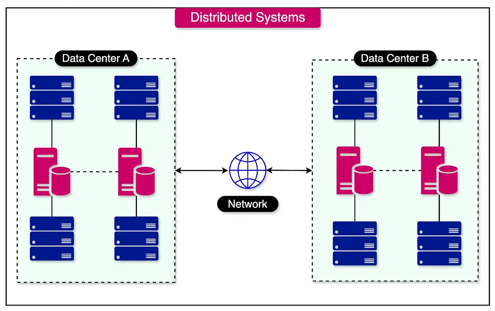
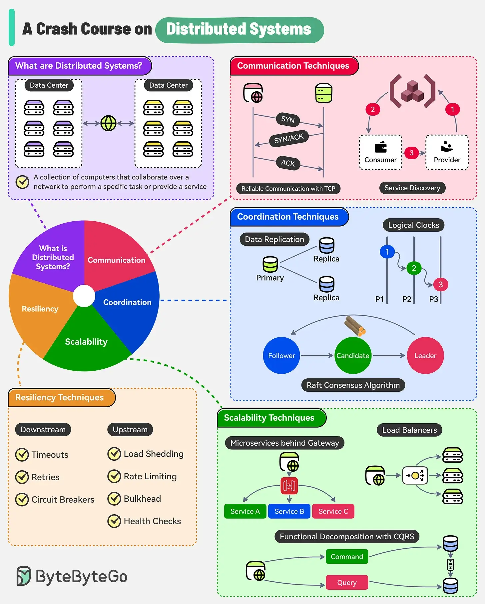

原文链接：[https://blog.bytebytego.com/p/a-crash-course-on-distributed-systems](https://blog.bytebytego.com/p/a-crash-course-on-distributed-systems)

分布式系统是多台计算机（也称为节点）的集合，它们协作执行特定任务或提供服务。

<!--more-->
这些节点在物理上是分开的，并通过网络传递消息相互通信。分布式系统可以跨越地理边界，使其能够利用来自不同位置的资源。

分布式系统有几个区别于传统集中式系统的特点：

- 分布式系统中的计算机在物理上是分开的，并通过网络连接。它们不共享内存或公共时钟。
- 从外部视角来看，分布式系统对于最终用户来说是一个单一、统一的实体。
- 分布式系统提供了在系统中添加或删除计算机的灵活性。
- 分布式系统中的节点需要相互协调并达成一致才能一致地执行操作。
- 分布式系统中的节点可能独立发生故障，并且消息可能会在网络上丢失或延迟。

分布式系统在我们的日常生活中无处不在。例如 Google 搜索等大型 Web 应用程序、在线银行系统、多人游戏等。这些系统利用多台计算机协同工作，提供无缝且响应迅速的用户体验。

在本文中，我们将探讨分布式系统的优势和挑战。我们还将讨论用于解决这些挑战并确保分布式系统可靠运行的常用方法和技术。

## 理解分布式系统 

“分布式系统”这个术语有时会让开发人员感到困惑。 

一些常见的混淆是关于分散系统和并行系统。 

让我们在分布式系统的背景下了解这些术语的含义以及它们有何异同。

### 分散式系统与分布式系统

“分散式系统”和“分布式系统”等术语经常互换使用，但它们有一个关键的区别。 

虽然这两种类型的系统都涉及多个组件协同工作，但决策过程却使它们有所区别。 

在去中心化系统中，这也是一种分布式系统，没有任何一个组件能够完全控制决策过程。相反，每个组件都拥有决策的一部分，但不拥有做出独立决策所需的完整信息。

### 并行系统与分布式系统

与分布式系统密切相关的另一个术语是并行系统。 

分布式和并行系统都旨在扩大计算能力，但它们使用不同的方法实现这一目标。

在并行计算中，一台机器内的多个处理器同时执行多个任务。这些处理器通常可以访问共享内存，从而可以交换数据并高效地协调其活动。

另一方面，分布式系统由多台不共享内存的自主机器组成。这些机器通过网络传递消息来通信和协调其操作。每台机器独立运行，通过执行分配的任务为整体计算做出贡献。

## 分布式系统的主要优点

虽然设计和构建分布式系统比传统的集中式系统更复杂，但它们的优势使得付出的努力值得。

让我们探索分布式系统的一些主要优势：

- **可扩展性**：垂直扩展涉及增加单台机器的硬件资源，通常受到物理约束的限制。例如，单台机器可以添加的处理器核心数量是有限的。相比之下，分布式系统支持水平扩展，可以将其他商用机器添加到系统中。这样可以通过添加相对便宜的硬件来扩展系统。
- **可靠性**：与集中式系统相比，分布式系统对故障的恢复能力更强。由于数据在多个节点上复制，因此单个节点或部分节点的故障不一定会导致整个系统崩溃。其余节点可以继续运行，尽管容量会降低，但可以确保整个系统保持正常运行。 
- **性能**：分布式计算通常涉及将复杂的工作负载分解为更小、更易于管理的部分，这些部分可以在多台机器上同时处理。这种并行处理能力可以提高计算密集型任务（例如矩阵乘法或大规模数据处理）的性能。 

## 分布式系统的挑战

分布式系统在操作方面也面临多重挑战。 

了解这些挑战和克服这些挑战的技术是利用分布式系统的关键。

让我们探讨分布式系统的主要挑战以及处理这些挑战的技术。

### 沟通

在分布式系统中，节点需要通过网络相互通信和协调，以作为一个有凝聚力的单元发挥作用。 

然而，由于底层网络基础设施不可靠，这种通信具有挑战性。

负责在节点之间传递数据包的互联网协议 (IP) 仅提供“尽力而为”的服务。这意味着网络无法保证数据包的可靠传递。

数据包传输过程中可能会出现几个问题：

- **数据包丢失**：由于网络拥塞、硬件故障或其他因素，数据包可能在传输过程中丢失或丢弃。 
- **数据包重复**：在某些情况下，数据包可能会被重复，导致同一数据包的多个副本被传送到目标节点。
- **数据包损坏**：数据包在传输过程中可能会损坏。损坏的数据包可能包含无效或不正确的数据，从而导致通信错误。
- **无序传送**：数据包到达目标节点的顺序可能与发送时的顺序不同。 

在这个不可靠的基础上建立可靠的沟通是一项重大挑战。

分布式系统处理这些问题的一些关键技术如下：

#### 1 - 使用 TCP 进行可靠通信

传输控制协议 (TCP) 是一种基础协议，它提供了一种强大的机制来确保进程之间字节流的可靠、按序传输，使其成为分布式系统中可靠数据传输的基石。

它采用了几种关键机制来克服网络固有的不可靠性：

- TCP 将字节流分割成更小的、有序的数据包（称为段）。
- 它要求接收方在收到数据包后向发送方发送确认（ACK）。
- TCP 使用校验和来验证传输数据的完整性。
- TCP 实现流量控制以防止发送方用大量数据淹没接收方。
- 最后，TCP 采用拥塞控制机制来适应可用的网络带宽。

下图显示了客户端和服务器之间建立连接的 TCP 三次握手过程。

#### 2 - 使用 TLS 确保通信安全

尽管 TCP 能够确保在不可靠的网络上进行可靠通信，但它并未解决数据传输的安全问题。这时，传输层安全性 (TLS) 协议便应运而生。

TLS 是一种加密协议，为 TCP 建立的通信通道添加加密、身份验证和完整性。

TLS 使用多种机制来保护节点之间的通信：

- TLS 使用非对称和对称加密的组合来保护数据的机密性。
- TLS 依靠数字证书来验证通信方的身份。
- 为了确保传输数据的完整性，TLS 在每条消息中都包含校验和或消息认证码。

#### 3 - 使用 DNS 进行服务发现

在分布式系统中，节点需要一种机制来发现彼此并相互通信。这就是域名系统 (DNS) 发挥作用的地方，它解决了服务发现问题。

DNS 充当“互联网电话簿”，提供人类可读域名与其对应的 IP 地址之间的映射。它允许节点使用容易记住的名称（而不是复杂的数字 IP 地址）来定位和连接彼此。

下图显示了消费者和提供者之间的服务发现过程。

从本质上讲，DNS 是作为分布式、分层的键值存储实现的。它由一个服务器网络组成，这些服务器共同协作将域名解析为 IP 地址。 

DNS 的分层结构使得整个互联网的名称解析变得高效且可扩展。

### 协调

构建分布式系统时，节点之间的协调是一项关键挑战。 

与协调相关的一些关键问题如下：

- **故障可能性**：在分布式系统中，服务器或网络设备等单个组件随时都可能出现故障。如果处理不当，这些故障可能会扰乱信息流并导致不一致。
- **不可靠的网络**：如前所述，分布式系统通过容易出现延迟、数据包丢失和其他问题的网络进行通信。这使得可靠地协调信息交换成为一项巨大挑战。
- **缺乏全局时钟**：由于分布式系统缺乏全局时钟，因此很难在所有组件之间建立一致的时间概念。

让我们来看看解决分布式系统协调相关挑战的一些关键技术：

#### 1 - 故障检测

在分布式环境中，不可能明确区分失败的进程和响应非常慢的进程。

造成这种模糊性的原因在于，网络延迟、数据包丢失或临时网络分区可能会导致进程看起来无响应，即使它可能仍在正常运行。

为了应对这一挑战，分布式系统采用了故障检测器。 

故障检测器是监控进程状态并确定其可用性的组件。但是，故障检测器必须在检测时间和误报率之间做出权衡。

如果故障检测器配置为快速检测故障，它可能会错误地将缓慢的进程归类为失败，从而导致更高的误报率。另一方面，如果故障检测器配置得更保守，并允许进程有更多时间做出响应，它可能需要更长时间才能检测到实际故障，从而导致检测时间变慢。

#### 2 - 事件顺序和时间

就事件的时间和顺序达成一致是分布式系统中的一大协调挑战。

造成这一挑战的主要原因之一是分布式系统中物理时钟的不完善性。系统中的每个节点都有自己的物理时钟，通常基于石英晶体振荡器。这些物理时钟容易发生漂移，并且会随着时间的推移逐渐彼此偏离。时钟频率的微小变化也会导致节点间感知时间出现显著差异。

此外，在分布式系统中实现事件的全序需要节点之间的协调。在全序中，所有节点都同意事件的确切顺序，而不管它们之间的因果关系如何。 

为了应对这些挑战，分布式系统通常依赖逻辑时钟和矢量时钟来捕捉事件的因果顺序。

- **逻辑时钟**（例如 Lamport 时间戳）根据每个节点的本地时钟为事件分配单调递增的时间戳。这些时间戳建立了事件的部分顺序，捕获了它们之间的“先发生”关系。
- 另一方面，**向量时钟可以更全面地表示事件之间的因果关系。每个节点维护一个逻辑时间戳向量，系统中每个节点一个条目。当事件发生时，节点会增加其时间戳，并包含与其通信的所有其他节点的最大时间戳**。通过比较向量时钟值，节点可以确定事件之间的因果关系并检测潜在的冲突或不一致。

下图显示了逻辑 Lamport 时钟和矢量时钟之间的区别。

#### 3 - 领导者选举

在分布式系统中，许多协调任务（例如持有锁或提交事务）都需要单个“领导”进程的存在。 

领导者负责管理和协调这些任务的执行。

Raft 是一种被广泛采用的共识算法，用于解决分布式环境中领导者选举的难题。它提供了一种在一组进程中选举领导者的机制，确保每个任期最多只有一名领导者。

Raft 算法以“任期”为单位运行，任期代表一个逻辑时钟或一个时间段，领导者在此时间段内被选举并发挥作用。每个任期都被分配一个唯一的、单调递增的数字。 

Raft 的一个关键原则是，候选进程只有在其日志是最新的时才能成为领导者。换句话说，与系统中的其他进程相比，候选进程必须拥有最新且完整的日志条目集。

下图展示了 Raft 共识算法中节点可以经历的状态变化（追随者、候选人和领导者）的映射。

#### 4 - 数据复制和一致性

保持多个节点间复制数据同步是分布式系统中一项基本的协调挑战。 

复制对于确保数据可用性和容错能力至关重要，但它带来了维护副本之间一致性的复杂性。

CAP定理指出，在分布式系统中，不可能同时提供一致性、可用性和分区容忍性。

根据该定理，分布式系统在任何给定时间只能提供三个保证中的两个。在存在网络分区的情况下，一致性和可用性之间存在权衡。系统必须选择以降低可用性为代价保持强一致性，或者优先考虑可用性，同时接受较弱的一致性保证。

此外，分布式系统支持多种一致性模型，这些模型定义了对复制数据的读写操作的保证。

- **线性化**：线性化是最强的一致性模型。它确保每个操作在其调用和完成之间的某个时间点立即生效。
- **顺序一致性**：顺序一致性比线性一致性弱。它保证任何执行的结果都与所有进程的操作按某种顺序执行的结果相同。
- **因果一致性**：确保因果相关的操作（例如，影响后续读取的写入）在所有进程中以相同的顺序被看到。
- **最终一致性**：这是最弱的一致性模型。它保证如果没有对数据项进行新的更新，则最终对该项目的所有读取都将返回最后更新的值。

### 可扩展性

如前所述，可扩展性是采用分布式系统的主要优势之一。可扩展的系统可以通过添加资源来提高处理更多负载的能力。

然而，选择正确的可扩展性模式也很重要。

让我们看一下扩展分布式系统的几个关键模式。

#### 1. 功能分解

功能分解的一个例子是将单片应用程序分解为更小、可独立部署的服务。每个服务都有明确定义的职责，并通过 API 与其他服务进行通信。

API 网关充当外部客户端与微服务交互的单一入口点。它通过向客户端提供统一的接口来处理请求路由和组合。

另一种功能分解方法是类似 CQRS（命令查询职责分离）的模式。 

CQRS 是一种分离应用程序的读写路径的模式。 

通过允许读写操作独立扩展，这可以优化性能。CQRS 通常与微服务结合使用，以实现高效的数据检索和修改。

功能分解方法还依赖于异步消息传递作为通信模式。 

它有助于分离服务，实现弹性和可扩展性。服务通过消息队列或发布-订阅系统进行通信，使它们能够按照自己的节奏处理请求并防止过载。

#### 2 - 分区

分区是分布式系统中使用的一种基本技术，当大型数据集太大而无法在单个节点上存储和处理时，分区会将其拆分到多个节点上。

通过分发数据，分区可以实现水平可扩展性并允许系统处理不断增加的数据量。

下图显示了数据分区的概念，其中书籍表根据类别字段进行分区。

有几种用于分区数据的技术：

- **范围分区**：它涉及根据特定键范围拆分数据。每个分区负责存储连续的键范围。虽然这种方法可以加快范围扫描速度，但如果某些键范围接收不成比例的流量或数据，它也可能导致潜在的热点。
- **哈希分区**：哈希分区使用哈希函数将数据均匀分布在各个分区中。虽然哈希分区可以确保数据分布更加均匀，但它会失去键的自然顺序，从而降低范围扫描的效率。
- **重新平衡**：重新平衡是随着集群大小的变化在节点之间移动分区以维持数据平衡分布的过程。
- **一致性哈希**：一致性哈希是一种分区技术，可在集群中添加或删除节点时最大限度地减少数据移动。

#### 3 - 复制

复制是分布式系统中用于扩展容量和提高可用性的重要技术，通过引入组件冗余。 

通过复制服务器、数据和其他资源，系统可以处理更高的负载并提供抵御故障的能力。

实现复制的一些关键技术如下：

- **负载平衡**：负载平衡是在服务器池中分配传入请求以确保最佳资源利用率的过程。负载平衡器使用各种算法来确定哪个服务器应该处理特定请求。此外，我们可以在网络堆栈的不同层实现负载平衡，例如：
  - 基于 DNS 的负载平衡，在 DNS 级别分配请求。
  - 第 4 层负载平衡，根据 IP 地址和端口号等传输层信息分配请求。
  - 第 7 层负载平衡根据应用程序级信息（例如 HTTP 标头、URL 或会话数据）分配请求。
- **服务器端发现**：为了支持动态扩展，分布式系统采用服务器端发现。它使服务器能够动态地向中央注册中心或发现服务注册。执行健康检查以监视服务器的状态并检测故障。
- **数据复制**：复制涉及在分布式系统中跨不同节点创建多个数据副本。有不同的复制样式，例如：
  - **单主复制**：一个节点充当主节点，处理写入操作和关键读取，而其他节点充当跟随者。
  - **多领导复制**：多个节点可以接受写操作，并且更改在领导之间异步传播。
  - **无领导复制**：所有节点都接受写入操作，并通过仲裁共识等技术保持一致性。

下图显示了负载均衡器如何帮助在多个服务实例之间分配流量。

### 弹性

弹性是指系统在出现故障时继续正常运行的能力。 

随着分布式系统规模和复杂性的扩大，故障不仅可能发生，而且不可避免。一些最常见的故障原因如下：

- 服务器、存储和网络的硬件故障。
- 软件错误和内存泄漏。
- 配置和部署中的人为错误。
- 级联故障，其中一个组件的故障会触发其他组件的故障。
- 意外的负载峰值超出了容量范围。

管理分布式系统内组件的弹性主要有两种方式。

#### 1 - 下游弹性 

当服务通过同步请求/响应通信进行交互时，阻止故障从一个组件或服务传播到另一个组件或服务非常重要。

实现这一目标的关键技术如下：

- **超时**：它们用于防止服务无限期地等待另一个服务的响应。通过设置合理的超时值，调用服务可以避免在被调用服务无响应时被长时间阻塞。发生超时时，调用服务可以采取适当的措施，例如返回错误或恢复到默认行为。
- **使用指数退避重试**：重试是处理瞬时故障（例如临时网络问题）的常见模式。当请求失败时，调用服务可以在一定延迟后重试该请求。但是，为了避免大量重试使调用服务不堪重负，我们采用了指数退避。每次重试之间的延迟呈指数增加，从而为调用服务提供恢复时间。
- **断路器**：当服务不健康或无响应时，断路器有助于防止级联故障。断路器充当调用服务和被调用服务之间的中介。它监视请求的成功和失败。如果故障率超过某个阈值，断路器就会跳闸并拒绝后续请求。这种快速失败方法可防止调用服务等待故障服务。

下图显示了断路器模式和断路器的三种状态。

#### 2 - 上游弹性

弹性技术甚至在服务所有者层面也很重要。有多种策略可以保护服务免受传入请求的冲击。

让我们看看最重要的几点：

- **负载削减**：当服务过载或需求量大时，它会拒绝一部分传入请求。通过有选择地丢弃请求，服务可以保持其响应能力并防止完全崩溃。
- **速率限制和节流**：这两种技术用于确保客户端公平使用服务。速率限制设置客户端在特定时间窗口内可以发出的最大请求数。另一方面，节流涉及在客户端超过某个阈值时减慢请求的处理速度。
- **隔板**：隔板是一种弹性模式，其灵感来自船舶设计中使用的隔间技术。在服务环境中，隔板涉及隔离系统的不同部分，以防止某一部分的故障蔓延到其他部分。
- **集成负载均衡器的健康检查**：健康检查是对服务实例的健康和可用性的定期评估。通过定期监控服务实例的健康状况，负载均衡器可以检测出不健康或无响应的实例，并将流量路由出这些实例。 

## 概括

在本文中，我们详细探讨了分布式系统。我们了解了分布式系统的含义、其优势以及它们为开发人员带来的挑战。

让我们简要总结一下所学内容：

- 分布式系统是多台计算机（也称为节点）的集合，它们协作执行特定任务或提供服务。 
- 在分布式系统中，每台机器独立运行，通过执行分配的任务为整体计算做出贡献。
- 分布式系统的主要优点包括可扩展性、可靠性和性能。
- 分布式系统在通信、协调、可扩展性和弹性方面也带来了一些挑战。不过，可以使用多种技术来解决这些挑战。
- 由于底层网络基础设施的不可靠性，分布式系统中的通信具有挑战性。可以使用 TCP 等协议进行可靠通信、使用 TLS 进行安全通信以及使用 DNS 进行服务发现来解决此问题。
- 由于分布式系统由多个组件组成，因此协调它们是一项巨大的挑战。故障检测、事件排序和定时、领导者选举和一致性级别等技术有助于改善分布式系统内的协调。
- 可扩展性是分布式系统的主要优势。然而，选择正确的扩展模式也很重要。一些常见的模式包括将功能分解为微服务、数据分区以及使用复制和负载平衡来复制资源。
- 随着分布式系统规模的扩大，故障变得不可避免，弹性成为一项重大挑战。下游弹性（例如超时、重试和断路器）和上游弹性（负载削减、速率限制和隔墙模式）可以使用多种技术。
