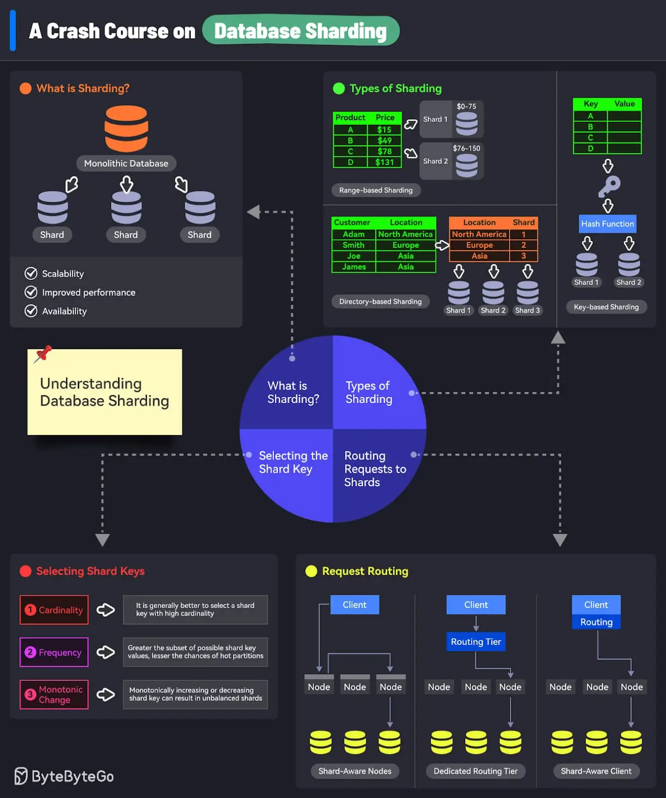
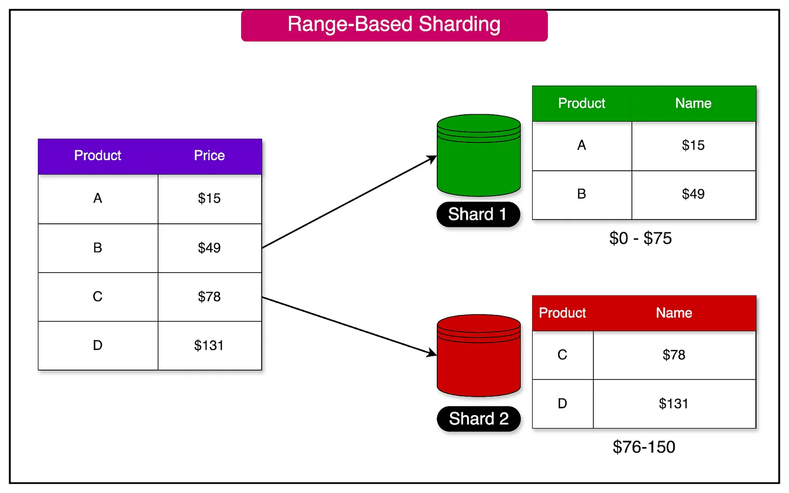
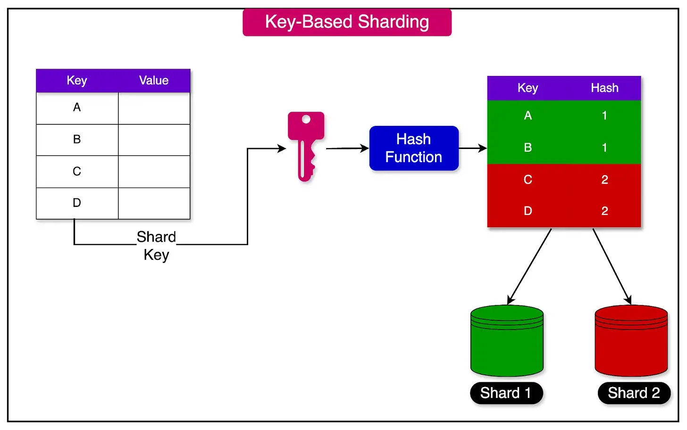
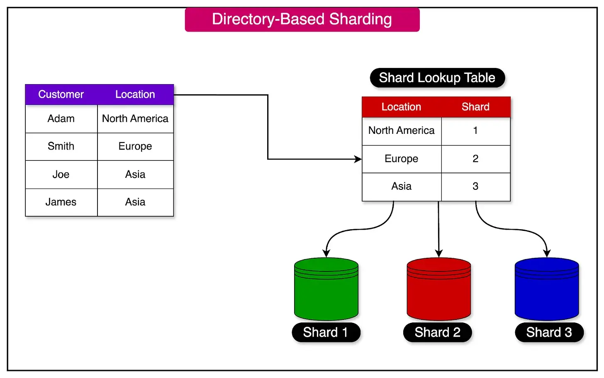
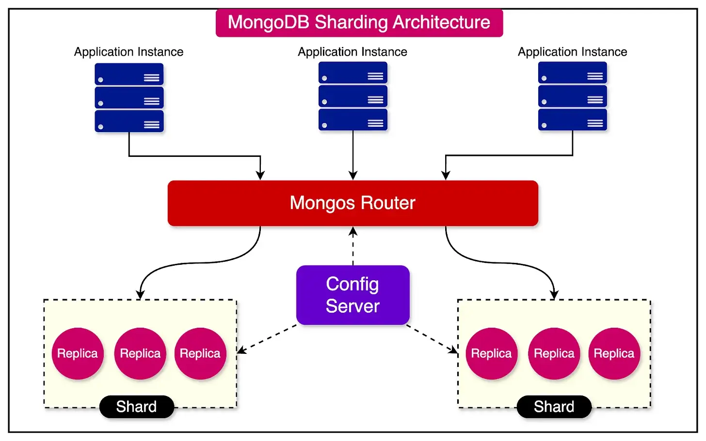
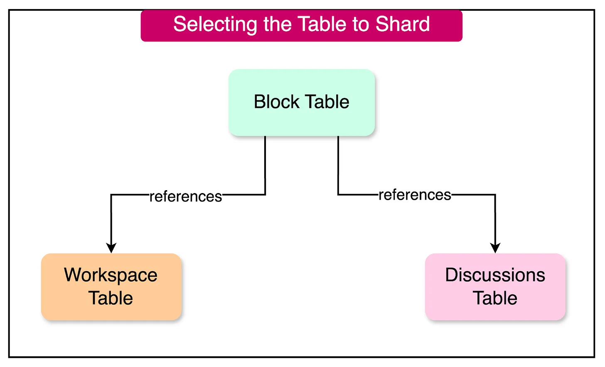
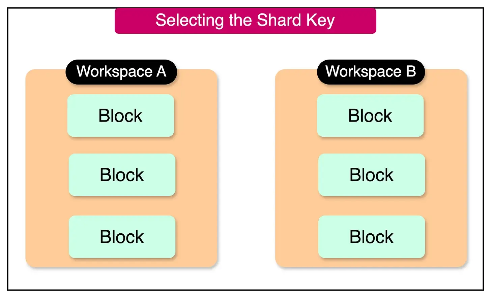
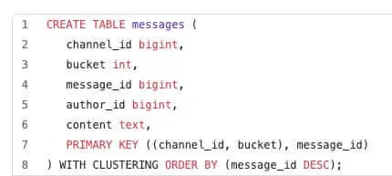

原文链接：[https:/blog.bytebytego.com/p/a-crash-course-in-database-sharding](https:/blog.bytebytego.com/p/a-crash-course-in-database-sharding)

随着应用程序越来越受欢迎，它会吸引更多活跃用户并加入更多功能。这种增长导致每日数据生成量增加，从业务角度来看，这是一个积极的指标。 

然而，它也给应用程序的架构带来挑战，特别是在数据库可扩展性方面。

数据库是任何应用程序的关键组件，但它也是最难水平扩展的组件之一。当应用程序的流量和数据量增加时，数据库可能会成为性能瓶颈，影响用户体验。

分片是一种解决数据库横向扩展难题的技术。它涉及将数据库划分为更小、更易于管理的单元（称为分片）。

在这篇文章中，我们将介绍数据库分片的基础知识，探讨其各种方法、技术考虑因素，以及展示公司如何实施分片来扩展其数据库的真实案例研究。

## 什么是分片？

分片是一种架构模式，用于解决管理和查询数据库中大型数据集的难题。它涉及将大型数据库拆分为更小、更易于管理的部分（称为分片）。

共享建立在水平分区的概念之上，水平分区涉及根据分区键将表的行分成多个表。这些表称为分区。跨分区分布数据可减少查询和操作数据所需的工作量。

下图说明了水平分区的一个例子。

数据库分片将水平分区提升到了一个新的水平。分区将所有数据组存储在同一台计算机中，而分片则将它们分布在不同的计算机或节点上。这种方法通过利用多台机器的资源来实现更好的可扩展性和性能。

值得注意的是，不同数据库使用的分片术语有所不同。

- 在 MongoDB 中，分区称为分片 (shard)。
- Couchbase 使用术语 vBucket 来表示分片。
- Cassandra 将分片称为 vNode。

尽管术语存在差异，但其基本概念保持不变：将数据分成更小、更易于管理的单元，以提高查询性能和可扩展性。

### 数据库分片的好处

数据库分片有几个主要优点：

- **可扩展性：** 分片的主要动机是实现可扩展性。通过将大型数据集分布在多个分片上，查询负载可以分散到多个节点上。对于对单个分片进行操作的查询，每个节点都可以独立执行针对其分配数据的查询。此外，可以在运行时动态添加新分片，而无需关闭应用程序进行维护。
- **性能提升：** 从单个大型数据库中检索数据可能非常耗时。查询需要搜索大量行才能找到所需数据。相比之下，与整个数据库相比，分片包含的行子集更小。由于查询需要处理的行更少，因此搜索空间的减少可加快数据检索速度。
- **可用性：** 在单片数据库架构中，如果托管数据库的节点发生故障，依赖该数据库的应用程序也会停机。数据库分片通过将数据分布在多个节点上来降低这种风险。如果发生节点故障，应用程序可以使用剩余的分片继续运行。

### 分片和复制

分片通常与复制一起使用，以实现分布式数据库系统中的高可用性和容错能力。 

复制涉及创建数据的多个副本并将其存储在不同的节点上。在主从复制模型中，一个节点充当主节点并处理写入操作，而从节点复制主节点的数据并处理读取操作。

通过在多个节点上复制每个分片，系统可确保即使个别节点发生故障，数据仍可访问。一个节点可以存储多个分片，每个分片在主从复制模型中可以是主分片或从分片。

下图说明了一种安排，其中每个分片的领导者被分配给一个节点，而其追随者分布在其他节点上：

在此设置中，一个节点可以同时充当某些分区的领导者和其他分区的追随者。这种分布式架构允许系统在发生节点故障或网络中断时保持数据可用性和弹性。

## 分片类型

数据库分片的主要目标是在多个节点上均匀分布数据和查询负载。 

然而，如果数据分区不平衡，一些分片最终可能会处理比其他分片多得多的数据或查询。这种情况称为倾斜分片，它会削弱分片的优势。

在极端情况下，设计不良的分片策略可能导致单个分片承担全部负载，而其余分片保持空闲状态。 

这种情况称为热点，其中一个节点因过高的负载而变得不堪重负。

为了减轻分片倾斜和热点的风险，选择适当的分片策略以确保数据和查询在分片之间均匀分布至关重要。

我们来了解一些常用的分片策略：

### 基于范围的分片

基于范围的分片是一种根据一系列值拆分数据库行的技术。 

在这种方法中，每个分片都会分配一个连续的键范围，从最小值到最大值。每个分片内的键都按排序顺序维护，以实现高效的范围扫描。

为了说明这个概念，让我们考虑一个存储产品信息的产品数据库。 

可以应用基于范围的分片，根据产品的价格范围将数据库拆分为不同的分片。例如，一个分片可以存储价格范围在 0 美元到 75 美元之间的所有产品，而另一个分片可以包含价格范围在 76 美元到 150 美元之间的产品。

需要注意的是，键的范围不一定需要均匀分布。在实际应用中，数据分布可能不均匀，可以相应地调整键范围，以实现分片间数据分布的平衡。

然而，基于范围的分片有一个潜在的缺点。 
某些访问模式可能会导致热点的形成。例如，如果数据库中很大一部分产品属于特定价格范围，则负责存储该范围的分片可能会承受不成比例的高负载，而其他分片仍未得到充分利用。

### 基于键或哈希的分片

基于密钥的分片（也称为基于哈希的分片）是一种使用哈希函数将特定密钥分配给分片的技术。 

精心设计的哈希函数对于实现密钥的均衡分布起着至关重要的作用。基于哈希的分片不会为每个分片分配一系列密钥，而是为每个分片分配一系列哈希。一致性哈希是一种常用于实现基于哈希的分片的技术。

下图说明了基于键或哈希的分片的基本概念：

基于哈希的分片的主要优势之一是它能够在分片之间公平分配密钥。通过对密钥应用哈希函数，该技术有助于降低热点风险。

但是，基于哈希的分片也存在弊端。通过使用键的哈希而不是键本身，我们失去了执行高效范围查询的能力。这是因为相邻的键可能分散在不同的分区中，并且在此过程中会丢失它们的自然排序顺序。

需要注意的是，基于哈希的分片虽然有助于减少热点，但无法消除热点。在所有读取和写入都集中在单个键上的极端情况下，所有请求仍可能被路由到同一分区。例如，在社交媒体网站上，名人用户可以发布对同一键产生大量写入的内容。

### 基于目录的分片

基于目录的分片是一种依赖查找表来确定分片间记录分布的方法。 

查找表充当目录或地址簿，映射数据与其所在的特定分片之间的关系。此表与分片本身分开存储。

下图说明了基于目录的分片的概念，使用“位置”字段作为分片键：

与其他分片策略相比，基于目录的分片的主要优势之一是灵活性。它允许更好地控制分片间数据的放置，因为数据和分片之间的映射在查找表中明确定义。

然而，基于目录的分片也有一个明显的缺点：它严重依赖查找表。与查找表相关的任何问题或故障都可能影响数据库的整体性能和可用性。

## 选择分片键时要考虑的因素

选择合适的分片键对于实施有效的分片策略至关重要。数据库设计人员在做出此决定时应考虑几个关键因素：

### 基数

基数是指分片键可以具有的可能值的数量。它决定了可以创建的最大分片数量。

例如，如果选择布尔数据字段作为分片键，则系统将仅限于两个分片。

为了最大限度地发挥水平扩展的优势，通常建议选择具有高基数的分片键。

### 频率

分片键的频率表示特定分片键值在数据集中出现的频率。

如果大部分记录仅包含可能的分片键值的子集，则负责存储该子集的分片可能会成为热点。 

例如，如果健身网站的数据库使用年龄作为分片键，则大多数记录可能最终会出现在包含 30 至 45 岁之间的订阅者的分片中，从而导致数据分布不均匀。

### 单调变化

单调变化是指对于给定的记录，分片键值随着时间的推移而增加或减少。

如果分片键基于单调增加或减少的值，则可能导致分片不平衡。

考虑存储用户评论的数据库的分片方案。

- 分片A存储评论少于10条的用户的数据。
- 分片B存储有11-20条评论的用户的数据。
- 分片 C 存储了评论超过 30 条的用户的数据。

随着用户随着时间的推移不断添加评论，他们会逐渐迁移到分片 C，这使得它比分片 A 和 B 更加不平衡。

## 重新平衡碎片

随着时间的推移，数据库会发生各种变化，需要在节点之间重新分配数据和工作负载。这些变化包括：

- 增加查询吞吐量需要额外的 CPU 资源。
- 数据集大小的增长需要更多的存储容量。
- 某台机器发生故障会导致其他机器接管其职责。

所有这些场景都有一个共同的主题：需要将数据和请求从集群中的一个节点移动到另一个节点。这个过程称为分片重新平衡。

分片重新平衡旨在实现几个关键目标：

- **公平负载分配：** 重新平衡过程之后，工作负载应在集群中的各个节点之间均匀分配。
- **最小中断：** 数据库应在重新平衡过程中继续接受读写操作。
- **高效的数据移动：** 节点之间移动的数据量应保持在最低限度。

考虑到这些目标，可以采用几种方法进行分片重新平衡，每种方法都有其权衡和考虑。

### 固定分片数量

在固定分区配置中，分片的数量在数据库最初设置时就已确定，并且通常在此后保持不变。 

例如，假设一个数据库在 10 个节点的集群上运行。它可以被拆分成 100 个分片，每个节点分配 10 个分片。分片总数（本例中为 100 个）保持不变。

如果有新节点添加到集群，系统可以通过将一些分片从现有节点迁移到新节点来重新平衡分片，以保持公平分布。

下图说明了固定分区的概念：

值得注意的是，在这种方法中，分片的数量和分片的密钥分配都不会改变。在重新平衡过程中，只有整个分片会在节点之间移动。

然而，如果数据的总大小变化很大，固定分区方法在选择适当的分片数量时会面临挑战。 

此外，确定单个分片的大小还需要考虑一些因素：

- 如果分片太大，重新平衡和从节点故障中恢复可能会变得耗时且耗费资源。 
- 另一方面，如果分片太小，维护和管理它们的开销就会增加。

### 动态碎片

动态分片是一种根据数据库中存储的数据总量来调整分片数量的方法。

当数据集相对较小时，动态分片会维持较少数量的分片，从而最大限度地减少与分片管理和维护相关的开销。

随着数据集的增长并达到相当大的规模，动态分片会自动增加分片数量以适应扩大的数据量。每个分区的大小通常限制为可配置的最大阈值。

添加新分片时，系统会将部分数据从现有分片重新分配到新创建的分片。此过程可确保数据在所有分片中均匀分布。

动态分片的一个关键优势是其灵活性。它既可以应用于基于范围的分片策略，也可以应用于基于哈希的分片策略。

## 分片数据库中的请求路由

对数据集进行分片后，最关键的考虑是确定客户端如何知道要连接哪个节点来处理传入的请求。 

这个问题变得具有挑战性，因为分片可以重新平衡，并且分片到节点的分配可以动态改变。

应对这一挑战的主要方法有三种：

- **分片感知节点：** 在这种方法中，客户端可以使用循环负载均衡器联系任何节点。如果联系的节点拥有与请求相关的分片，则它可以直接处理该请求。否则，它会将请求转发到适当的分片，并将响应路由回客户端。
- **路由层：** 使用这种方法，客户端请求将被发送到专用的路由层，该路由层确定负责处理每个请求的节点。路由层将请求转发到适当的节点，并将响应返回给客户端。应用程序与路由层通信，而不是直接与节点通信。
- **分片感知客户端：** 在这种方法中，客户端知道分片在节点间的分布情况。客户端首先联系配置服务器以获取当前分片到节点的映射。利用此知识，客户端可以直接连接到每个请求的相应节点。

下图显示了这三种方法：

无论选择哪种方法，都需要做出一个共同的决定：如何让做出路由决策的组件及时更新分片到节点的映射。

不同的数据库采用不同的机制来实现这一点：

- LinkedIn 的 Espresso 使用 Helix 进行集群管理，依靠 Zookeeper 来存储配置信息。
- MongoDB 使用单独的配置服务器和专用的路由层。
- Cassandra 在节点之间采用八卦协议来将映射的任何更改传播到所有节点。

## MongoDB 的分片架构 - 案例研究

在探索了分片的概念之后，让我们来探索流行的数据库在实践中如何实现分片。 

我们将使用最广泛使用的文档数据库之一 MongoDB 作为示例。MongoDB 的分片架构演示了我们讨论过的组件（分片、路由和配置）如何协同工作以创建可扩展的分布式数据库。

MongoDB 的分片架构依赖于一组互连的服务器（也称为节点）。该集群称为分片集群，由三个关键组件组成：

- 分片
- Mongos 路由器
- 配置服务器

下图显示了这三个组件之间的互连：

### 分片

分片是集群中数据的子集。

每个分片都作为副本集实现，即单个 MongoDB 实例的集群。 

MongoDB 通过将每个分片部署为副本集，实现了分片内的数据复制。这种设计选择可确保高可用性和容错能力。

### Mongos 路由器

Mongos Router 是集群的核心。它是协调客户端应用程序和分片之间交互的核心组件。

Mongos 路由器执行两个基本功能：

- **查询路由和负载平衡：** 路由器充当客户端应用程序的单一入口点。它接收传入的查询，并根据分片键和数据分布将其路由到适当的分片。 
- **元数据缓存：** 路由器还维护元数据缓存，将数据映射到相应的分片。它从配置服务器检索此元数据并将其缓存在本地以获得更好的性能。

### 配置服务器

配置服务器存储和管理整个集群的元数据。

配置服务器中存储的元数据包括以下详细信息：

- **分片配置：** 有关每个分片的信息，包括其名称、主机和端口。
- **块分布：** 将数据块映射到特定的分片，实现高效的数据检索。
- **集群状态：** 分片集群的当前状态和健康状况，包括各个分片和 Mongos 实例的状态。

Mongos 实例严重依赖配置服务器来做出正确的路由决策。 

这种架构有以下几个好处：

- **可扩展性：** 通过将数据分布在多个分片上，MongoDB 可以处理大型数据集和高查询量。
- **高可用性：** 在每个分片内复制数据可确保数据冗余和容错能力。
- **负载平衡：** Mongos 路由器在分片之间分配查询，确保工作负载均匀分布。

## 分片技术在现实世界的行业案例研究

让我们研究一下一些使用分片来扩展数据库的实际案例以及他们面临的问题。

### 概念

2020 年中，流行的生产力和协作平台 Notion 面临着生存威胁。

该公司依靠单体 PostgreSQL 数据库已经五年了，该数据库支持了公司数个数量级的迅猛增长。然而，随着 Notion 的持续快速扩张，数据库却难以跟上步伐。

有多项指标表明数据库的压力越来越大：

- 数据库节点频繁出现 CPU 峰值。
- 不安全的迁移。
- 大量的待命请求。

此外，还有两个主要问题凸显出来：

- **VACUUM 停滞：** 负责清理和回收磁盘空间的 PostgreSQL VACUUM 进程开始停滞。这意味着数据库无法有效管理其存储，从而导致性能下降。
- **TXID 回绕：** Notion 遇到了 TXID 回绕形式的生存威胁。当 PostgreSQL 中的事务 ID 计数器达到其最大值并回绕为零时，就会发生此问题。如果不解决，可能会导致数据损坏和故障。

面对这些挑战，Notion 的工程团队决定实施数据库分片。

虽然他们探索了垂直扩展作为一种选择，但事实证明，在他们的规模下，这是成本过高的。 

然而，为了确保分片过程的成功，Notion 需要制定一个良好的分片策略。

一些关键考虑因素包括：

#### 1、选择要分片的表

Notion 的数据模型以区块的概念为中心，Notion 页面上的每一项都表示为一个区块。较大的区块可以由较小的区块组成，形成层级结构。

由于块表在 Notion 数据模型中的重要性，它成为了分片的最佳候选者。 

但是，Block 表依赖于其他表，例如 Workspace 和 Discussions。为了保持数据完整性并避免复杂的跨分片查询（这会影响性能），Notion 决定对所有与 Block 表有传递关系的表进行分片。

#### 2、选择分片键

好的分片键对于高效分片至关重要。 

由于 Notion 是一个团队产品，其中 Block 属于 Workspace，因此他们决定使用 Workspace ID 作为分区键。 

此决定旨在尽量减少获取数据时的跨分片连接，因为与同一工作区关联的块将存储在同一分片内。

#### 3、分片数量

确定最佳分片数量是另一个关键决策，因为它直接影响 Notion 的可扩展性。目标是在考虑 2 年使用量预测的同时容纳现有数据量。

经过分析，Notion得出了以下配置：

- 480 个分片分布在 32 个节点上，每个节点有 15 个分片。这种方法与固定分片数策略一致，其中分片数是预先确定的。
- 每个表的存储上限为 500 GB。

#### 得到教训

最终，Notion 成功迁移到分片数据库。他们在此过程中学到的一些宝贵经验如下：

- 过早优化是坏事。然而，等待分片太久也会产生限制。
- 实现零停机迁移对于良好的用户体验至关重要。
- 选择合适的分片键是获得良好结果的最重要因素。

### 不和谐

即时通讯社交平台Discord在数据库分片方面存在一个有趣的问题，值得讨论。

2017 年，Discord 存储了来自全球用户的数十亿条消息，并决定从 MongoDB 迁移到 Cassandra，以寻求可扩展、容错且低维护的数据库解决方案。 

在接下来的几年里，随着 Discord 的用户群和消息量不断增长，他们发现自己存储了数万亿条消息。他们的数据库集群从 12 个 Cassandra 节点扩展到 177 个。然而，尽管节点数量增加了，集群仍然遇到了严重的性能问题。

虽然有多种因素导致了性能下降，但主要原因是 Discord 的分片策略。

在他们的数据库架构中，每条消息都属于一个特定的频道，并存储在名为“消息”的表中。消息表根据两个字段进行分区：“channel_id”和“bucket”。“bucket”字段表示消息所属的静态时间窗口。

来源：[Discord 工程博客](https:/discord.com/blog/how-discord-stores-trillions-of-messages)

这意味着给定频道和时间段（存储桶）内的所有消息都存储在同一个分区中。因此，拥有数十万活跃用户的热门 Discord 服务器可能会在短时间内生成大量消息，从而压垮特定分片。

由于 Cassandra 的 LSM-Tree 结构使得读取操作通常比写入操作更昂贵，因此在高容量 Discord 频道中并发读取可能会在特定分片上创建热点。这些热点会导致整个数据库集群出现级联延迟问题，最终影响最终用户体验。

为了应对这些挑战，Discord 对其架构进行了几项更改，包括：

- **迁移到 ScyllaDB：** Discord 从 Cassandra 迁移到 ScyllaDB，这是一个与 Cassandra 兼容的数据库，可保证更好的性能和资源隔离。
- **优化数据访问：** Discord 在其 API 和数据库集群之间引入了中间服务（称为数据服务）。这些服务实现了请求合并和基于哈希的一致路由，以最大限度地减少数据库的负载，并在分片之间更均匀地分配流量。

Discord 的经验表明，特定访问模式下的良好分片策略可能会在应用程序中产生意外的性能问题。通过优化其分片策略和数据访问模式，Discord 成功缓解了热点问题并提高了其消息存储系统的性能和可扩展性。

## 概括

在本文中，我们详细探讨了数据库分片，从各个方面对其进行了介绍。

以下是主要观点的简要回顾：

- **分片基础知识：** 数据库分片是一种通过在多个节点上对数据库进行分区来水平扩展数据库的技术。 
- **分片策略：** 分片策略主要有三种类型：基于范围的分片、基于键或哈希的分片以及基于目录的分片。每种策略都有优点和缺点，其中基于哈希的分片是最常用的方法，因为它能够在各个分片之间均匀分布数据。
- **分片键选择：** 数据库设计人员在选择分片键时应考虑基数、频率和单调变化等因素。选择合适的分片键对于确保均匀分布和最大限度地减少热点至关重要。 
- **分片重新平衡：** 数据库不是静态的，而是不断变化，因此需要重新平衡分片。可以采用固定分区和动态分片等各种方法来处理重新平衡。
- **请求路由：** 有多种方法可以将请求路由到适当的分片：分区感知客户端、中央路由器和分区感知节点。
- **MongoDB的分片架构：** 它由一个中央路由器和一个独立的配置服务器组成，用于将请求路由到正确的分片。
- **真实案例研究：** Notion 从单体数据库到分片架构的发展历程凸显了分片对支持快速增长的重要性。Discord 的经验表明，分片策略如何因特定访问模式而导致热点。

参考：

- [Discord 如何存储数万亿条消息？](https:/discord.com/blog/how-discord-stores-trillions-of-messages)
- [放牧大象：从 Notion 的 Postgres 分片中吸取的教训](https:/www.notion.so/blog/sharding-postgres-at-notion)
- [MongoDB 中的分片](https:/www.mongodb.com/resources/products/capabilities/sharding)
