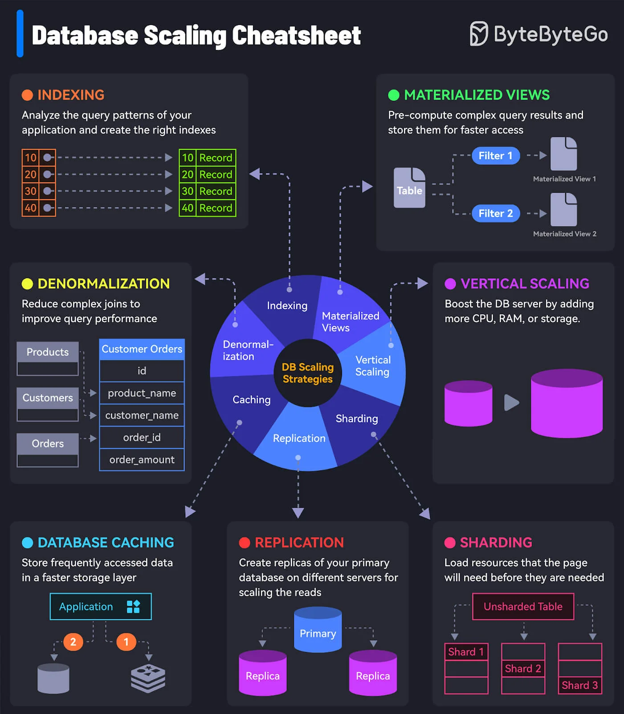
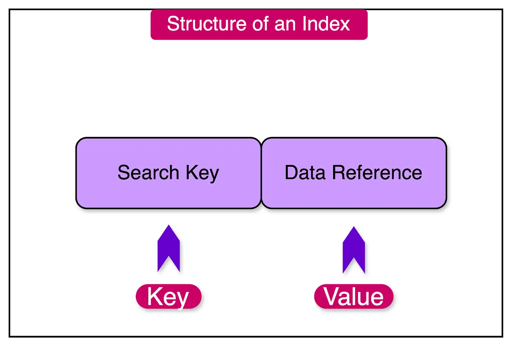
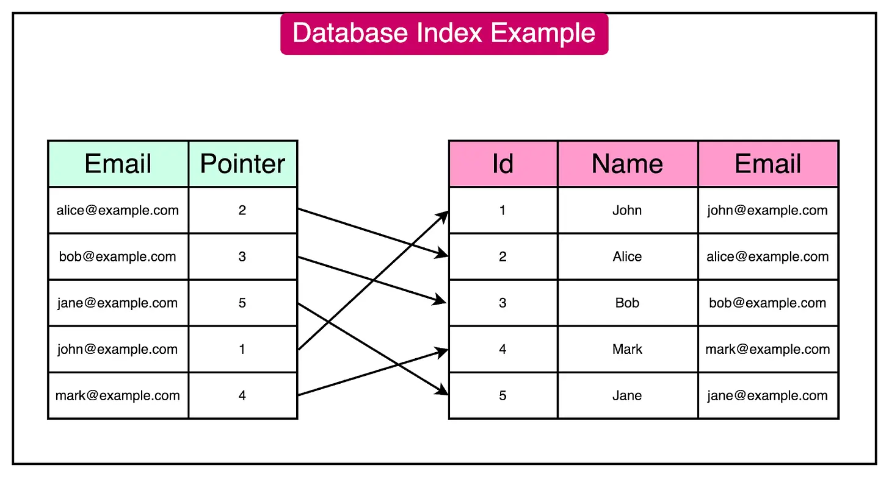
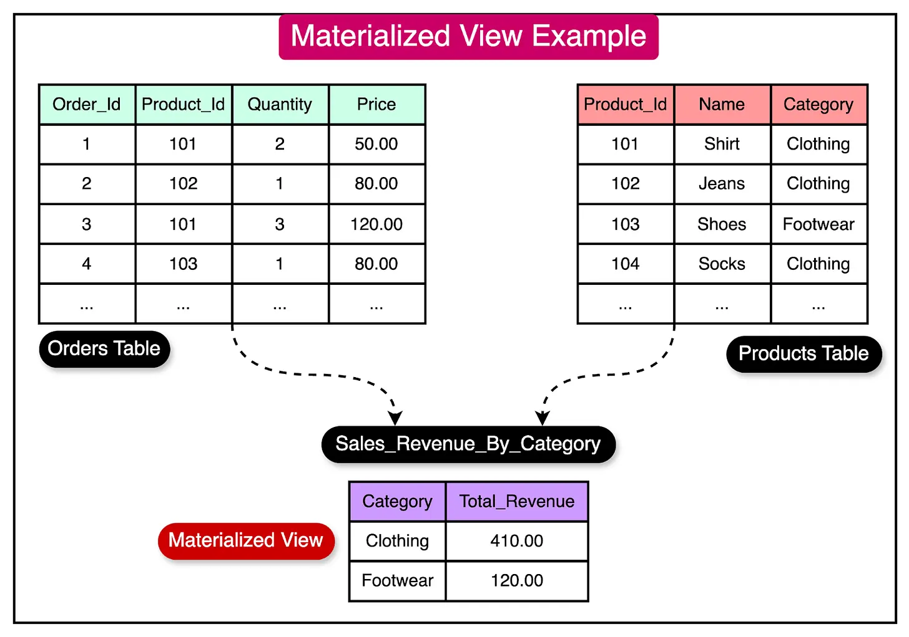
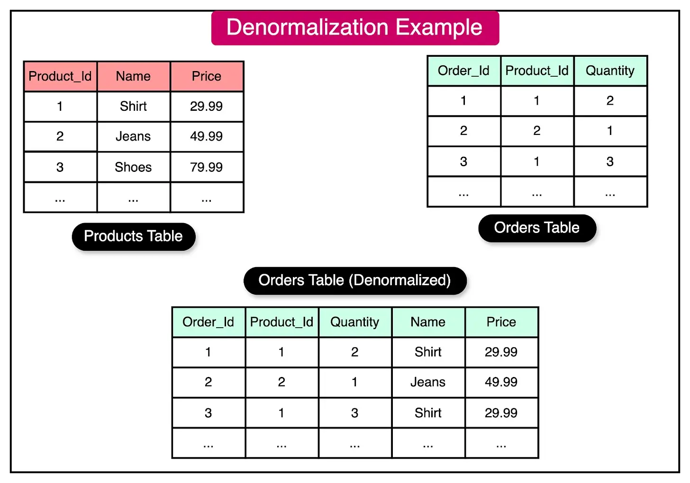
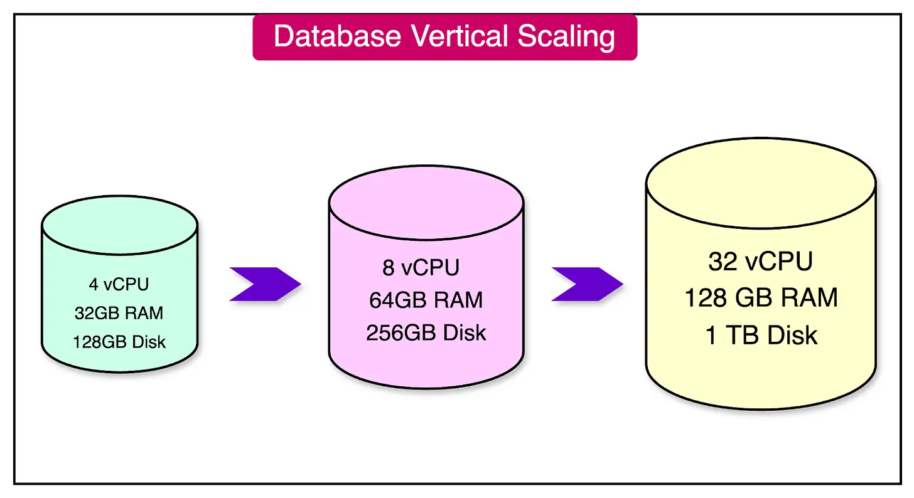
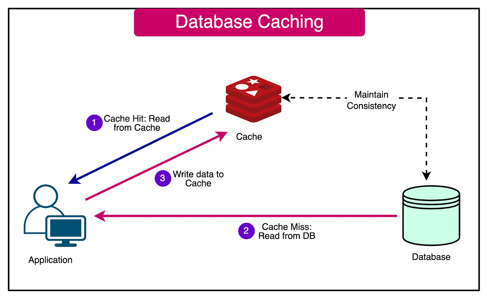
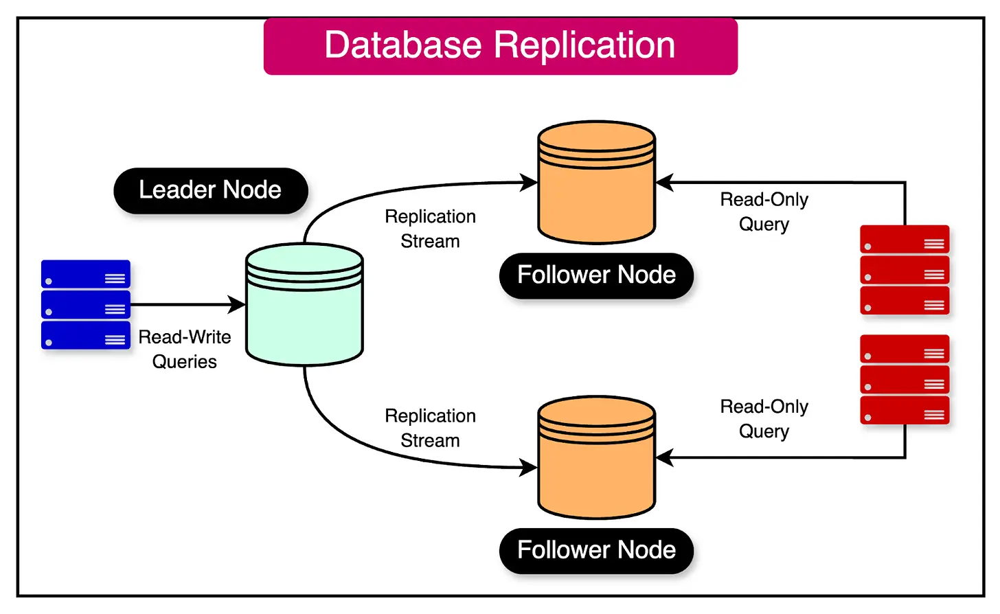
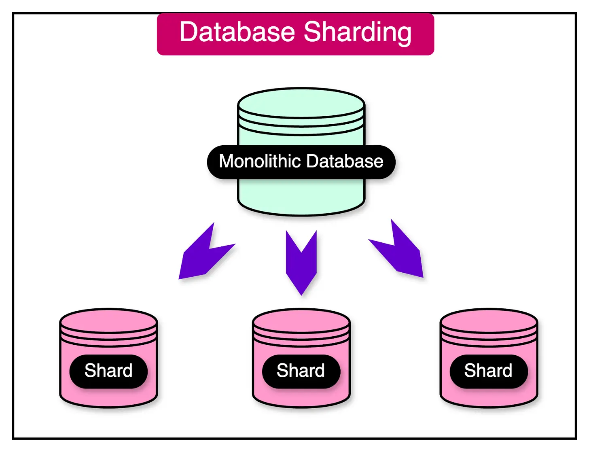

原文链接：[https://blog.bytebytego.com/p/a-crash-course-in-database-scaling](https://blog.bytebytego.com/p/a-crash-course-in-database-scaling)

数据库是现代应用程序开发的支柱。它们在存储、管理和检索数据方面发挥着至关重要的作用，使应用程序和服务能够有效运行。

随着应用程序越来越受欢迎并吸引越来越多的用户群，数据库面临着处理不断增加的数据量、并发用户和复杂查询的挑战。

有效地扩展数据库以确保最佳性能和良好的用户体验变得至关重要。 

数据库扩展是调整和扩展数据库基础架构以适应增长并在负载增加的情况下保持性能的过程。它涉及采用各种技术和策略来有效地分配数据，优化查询执行并明智地利用硬件资源。

组织和开发人员必须了解并实施正确的数据库扩展策略。针对特定情况选择错误的策略可能会弊大于利。

在这篇文章中，我们将详细介绍最流行的数据库扩展策略，讨论它们的优点和权衡。

## 索引

索引是增强数据库可扩展性和性能的基础技术之一。 

索引可以看作是数据库的“目录”。它包含对主数据库表中特定数据位置的引用，以便快速搜索和检索。

通过创建单独的数据结构（例如索引），数据库可以快速定位和检索特定数据，而无需扫描主表中的每个记录。

索引本身是数据的一个子集，以针对高效查询进行优化的方式组织。

为了更清楚地理解这个概念，我们假设有一个名为“客户”的数据库表，其中包含“ID”、“姓名”、“电子邮件”和“城市”等列。如果经常需要根据客户的电子邮件地址搜索客户，则在“电子邮件”列上创建索引可以提高搜索性能。

如果没有索引，通过电子邮件搜索客户将需要数据库扫描“客户”表中的每一行，直到找到匹配的记录。这个过程可能非常耗时，尤其是当表的大小增加时，这会导致查询响应时间变慢。

但是，通过在“电子邮件”列上创建索引，数据库可以使用索引数据结构快速查找所需的电子邮件地址并直接检索相应的行。这样就无需进行全表扫描，从而加快了搜索操作。

请参阅下图中的“电子邮件”列的示例索引：

### 索引的好处

索引提供了几个显著的好处，在处理大型数据库时这些好处变得越来越重要：

- **提高查询性能：** 随着数据量的增长，如果数据库必须扫描大量记录，查询性能可能会下降。创建正确的索引可使数据库快速定位和检索特定的数据子集，而无需进行全表扫描。
- **减少资源消耗：** 索引允许数据库有效地定位数据子集，从而最大限度地减少所需的磁盘 I/O 量和内存使用量。 
- **提高并发性：** 借助索引，数据库可以处理更多查询并容纳更多并发用户。这种改进的并发性在数据库必须扩展以支持大量用户的情况下尤其有益。

### 与索引的权衡

值得注意的是，索引会带来多重权衡。 

- 当在列上创建索引时（例如我们示例中的电子邮件地址列），数据库会将索引数据与主表分开存储。这意味着对于每个索引列，都有一个额外的数据结构占用磁盘空间。
- 需要考虑的另一个权衡是索引对写入操作的潜在影响。在表中插入、更新或删除数据时，应更新相应的索引以保持准确性和一致性。这个额外的步骤增加了写入操作的开销，随着表上索引数量的增加，这种开销会变得更加明显。

为了达到正确的平衡，根据特定的查询模式和应用程序的性能要求仔细选择要索引的列非常重要。

## 物化视图

物化视图是一个数据库对象，它将查询结果存储为单独的、预先计算的结果集。 

它源自一个或多个基表或视图，并且独立于底层数据源进行维护。 

为了解释物化视图的概念，我们来考虑一个电子商务应用程序，它有一个包含数百万条记录的大型“订单”表。该应用程序经常生成每个产品类别的总销售收入报告。 

如果没有物化视图，每次生成报告都需要扫描整个“订单”表，将其与“产品”表连接以获取类别信息，并执行聚合以计算每个类别的总收入。随着数据的增长，此查询会变得更慢且占用大量资源。

通过创建存储预先聚合的数据（例如每个产品类别的总收入）的物化视图，可以加快报告生成过程。

请参见下图，其中显示了存储每个产品类别的总收入的物化视图。

物化视图可以定期刷新，例如每天或每小时刷新一次，以确保数据保持最新状态。然后，可以直接从物化视图执行销售报告查询，提供即时结果，而无需处理整个“订单”表。

### 物化视图的好处

物化视图可以通过多种方式极大地增强数据库的可扩展性：

- **改进的查询性能：** 物化视图存储预先计算的结果，无需重复执行复杂且耗时的查询。
- **减少基表的负载：** 通过将计算成本高的查询结果存储在物化视图中，可以减少基表的负载。

### 与物化视图的权衡

虽然物化视图提供了显着的可伸缩性提升，但仍需要牢记一些权衡：

- 物化视图会消耗额外的存储空间，因为它们存储了结果集的单独副本。
- 刷新物化视图可能很耗时，尤其是对于大型数据集而言。
- 物化视图最终与源数据一致。换句话说，物化视图可以在短时间内包含陈旧数据。

## 反规范化

在规范化数据库设计中，数据被组织到单独的表中，以最大限度地减少冗余并确保数据完整性。每个表代表一个实体或概念，并使用外键建立表关系。这种方法遵循规范化的原则，旨在减少数据重复并保持数据一致性。

然而，严格遵守规范化规则有时会导致性能挑战，特别是在处理涉及跨表的多个连接的复杂查询时。 

这就是非规范化发挥作用的地方。

非规范化是一种放宽严格规范化规则并允许受控数据冗余的技术。它涉及在多个表中策略性地复制数据以优化查询性能。目标是减少检索数据所需的连接和计算次数，从而提高查询速度和可扩展性。

为了理解非规范化的概念，请考虑一个包含“产品”表和“订单”表的电子商务应用程序。 

在规范化设计中，“订单”表将仅存储对“产品”表的外键引用。需要将两个表连接起来才能检索带有订单信息的产品详细信息。

但随着订单数量的增长，如果应用程序经常需要在订单详情旁边显示产品名称和价格，那么连接操作可能会成为性能瓶颈。在这种情况下，可以应用非规范化来提高查询性能。

下图显示了在“订单”表上应用非规范化的示例：

通过对数据库进行非规范化并将产品名称和价格直接存储在“订单”表中，查询订单详细信息以及产品信息变得更简单、更快捷。冗余数据消除了连接的需求，使数据库在高查询负载下具有更好的扩展性。

### 非规范化如何帮助提高可扩展性？

非规范化可以通过多种方式提高数据库的可伸缩性：

- **更快的查询执行：** 消除或减少连接可以显著加快查询执行速度，尤其是对于经常访问或性能至关重要的查询。换句话说，数据库可以处理大量并发查询，从而提高整体可扩展性。
- **减少数据检索开销：** 由于派生数据与主数据一起存储在同一张表中，因此无需执行昂贵的即时计算。
- **提高读取性能：** 非规范化对于扩展读取密集型工作负载特别有益，因为查询无需连接多个表即可访问信息。

### 与非规范化的权衡

虽然非规范化可以提高查询性能和可伸缩性，但它也有一些缺点：

- 非规范化会引入数据冗余，从而增加存储需求。
- 非规范化使数据修改操作（插入、更新、删除）变得更加复杂和缓慢，因为冗余数据需要在多个表之间保持同步。
- 如果实施不当，非规范化可能会损害数据一致性。

## 垂直扩展

垂直扩展，也称为“向上扩展”，是一种通过增加单个服务器的硬件资源来提高数据库性能和可扩展性的技术。 

这种方法侧重于通过为单个服务器分配更多资源来增强其功能。

垂直扩展的过程可能涉及几个关键升级：

- 用更快或多核处理器替换现有的 CPU，以提高处理能力并实现更快的查询执行。
- 向服务器添加更多 RAM 以增加内存容量，从而改善缓存。
- 升级到更快的存储设备，例如固态硬盘 (SSD)。

为了了解垂直扩展的好处，我们来考虑一个在购物旺季流量激增的电子商务应用程序。随着数据库服务器上的负载增加，查询响应时间可能会受到影响，从而导致用户体验不佳。

为了解决这一可扩展性挑战，应用程序所有者决定垂直扩展数据库服务器。他们使用更强大的 CPU 升级服务器，将 RAM 容量增加一倍，并用 SSD 替换硬盘驱动器 (HDD)。

这些硬件增强功能显著提高了数据库服务器的性能。更快的 CPU 和更大的内存可实现更快的查询执行和高效的缓存，而 SSD 则可提供更快的数据检索和写入速度。 

因此，数据库服务器可以处理更多并发用户并提供更高的性能。

### 垂直扩展与数据库可扩展性的优势

垂直扩展可以通过多种方式提高数据库的可扩展性：

- **提高查询性能**： 借助更强大的硬件，数据库可以更快地执行查询。额外的 RAM 允许更大的内存缓存，从而实现更快的数据检索。
- **增加并发性**： 垂直扩展允许数据库服务器处理更多并发用户和连接。
- **更大的数据集处理**： 垂直扩展使数据库服务器能够容纳更大的数据集。

### 垂直扩展的权衡

使用垂直扩展时需要牢记以下几点：

- 垂直扩展受限于可用的最大硬件能力。单台服务器的升级程度是有上限的。
- 垂直扩展无法提供与水平扩展相同级别的容错能力和高可用性。如果单个数据库服务器发生故障，则整个数据库将不可用。
- 垂直扩展可能需要在硬件升级过程中停机，从而影响数据库的可用性。

## 缓存

缓存是一种将经常访问的数据存储在与主数据库分开的高速存储层中的技术。 

这种高速存储层通常使用内存或快速磁盘存储来实现。缓存的主要目标是通过直接从缓存中提供频繁访问的数据来减少对数据库的请求数量。

缓存的工作原理如下：

- 当应用程序收到数据请求时，它首先检查缓存以确定所请求的数据是否可用。 
- 如果在缓存中找到数据（称为缓存命中），则可快速从缓存中检索数据，而无需查询数据库。这大大缩短了响应时间并提高了应用程序的性能。
- 另一方面，如果在缓存中找不到所请求的数据（称为缓存未命中），则应用程序将从主数据库检索数据。 
- 除了将数据返回给客户端之外，应用程序还会将检索到的数据的副本存储在缓存中。这确保了对相同数据的后续请求可以从缓存中得到满足，而无需重复进行数据库查询。

下图展示了数据库的缓存过程：

举个例子，假设有一个社交媒体应用程序显示用户个人资料及其最近的活动。当用户访问个人资料页面时，应用程序需要从数据库中检索用户的信息及其最新帖子。

如果没有缓存，每次查看用户个人资料时，应用程序都会查询数据库以获取用户的数据及其最近的活动。随着用户数量和个人资料查看次数的增加，数据库可能会被请求淹没，导致响应时间变慢和可扩展性降低。

应用程序可以使用缓存来存储经常访问或受欢迎的用户个人资料及其近期活动。这种方法减少了对数据库的查询次数，缩短了响应时间，并允许应用程序处理大量个人资料视图而不会使数据库过载。

### 缓存如何帮助实现可扩展性？

缓存通过多种方式提高数据库的可伸缩性：

- **减少数据库负载： **缓存减少了对数据库的查询数量，使其能够处理更多的并发请求并扩展。
- **更快的查询响应： **缓存消除了对磁盘 I/O 的需要，从而减少了查询响应时间。
- **更好的读取性能： **缓存有助于分配读取工作负载。通过从缓存中处理大部分读取请求，数据库可以专注于大规模处理写入操作和更复杂的查询。

### 与缓存的权衡

缓存时需要考虑的一些权衡如下：

- 缓存给系统架构带来了额外的复杂性。
- 缓存会消耗额外的内存或磁盘空间来存储缓存的数据。这会产生额外的成本。
- 缓存中的陈旧数据会导致缓存不一致。必须采用适当的失效策略来保持缓存与数据库的一致性。
- 对于很少访问或频繁更新的数据，缓存可能无效，因为缓存命中率较低。

## 水平扩展

水平扩展，即“向外扩展”，涉及向数据库系统添加更多服务器或节点以分配工作负载并提高性能。 

与垂直扩展相比，它通过消除单点故障提供了更好的可扩展性和容错能力。

在水平扩展方面，有两种主要的数据库扩展策略：

### 复制

复制是数据库系统中采用的一种技术，用于在不同服务器或节点上创建和维护数据的多个副本。通过在多个副本之间分发数据，复制可增强数据可用性、容错能力和可扩展性。

在典型的领导者-追随者复制模型中，一个节点被指定为领导者，而其他节点被称为追随者。领导者节点处理所有写入操作，例如插入、更新和删除，以确保数据的一致性和完整性。它还可以处理一些需要先读后写一致性的重要读取操作。

每当在领导节点上执行写入操作时，更改都会自动复制到跟随节点。此复制过程可确保跟随节点维护存储在领导节点上的数据的精确副本。

下图显示了典型的领导者-追随者复制设置：

另一方面，跟随节点用于处理读取操作。它们可以与领导节点并行处理读取查询，从而有效地将读取工作负载分布在多个节点上。这种读取操作的分布有助于水平扩展数据库并提高其性能。

#### 复制的好处

复制为数据库可扩展性提供了多种好处：

- **提高读取性能**： 通过将读取工作负载分布到多个副本服务器，复制可实现读取查询的并行处理。这可减少领导节点的负载并提高工作负载的整体读取性能。
- **高可用性**： 复制通过维护数据的多个副本来提供高可用性。如果领导者节点发生故障，则可以提升其中一个跟随节点来接管领导者的职责。
- **持久性**：复制通过创建数据的多个副本来提高数据库的持久性。

#### 与复制的权衡

复制时需要考虑的一些权衡如下：

- 复制会导致主服务器和副本服务器之间的数据同步出现延迟。在领导者服务器上所做的更改反映到追随者服务器上之前，会有延迟（称为复制滞后）。
- 复制增加了数据库设置的复杂性。
- 在主从复制中，写入操作仍由单个服务器处理，这可能会成为写入繁重的工作负载的瓶颈。这可能需要采用其他复制类型，例如多主复制。

### 分片

数据库分片是一种将单个大型数据库划分为更小、更易于管理的单元（称为分片）的技术。通过将数据划分为独立的部分，分片使数据库能够水平扩展并处理增加的数据量。

在分片数据库架构中，数据根据特定的分片键分布在多个分片中。分片键的选择至关重要，因为它决定了如何将数据分配到不同的分片中。

常见的分片策略有以下几种：

- **基于范围的分片：** 根据分片键的值范围对数据进行分区。
- **基于哈希的分片：** 它涉及将哈希函数应用于分片键以确定每个数据记录的目标分片。
- **基于目录的分片：** 维护一个单独的查找表，以将分片键映射到相应的分片。

分片数据库架构中的每个分片都独立运行，托管整体数据的子集。查询和写入操作会根据分片键路由到适当的分片。

#### 分片的好处：

分片为数据库可扩展性提供了多种好处：

- **水平可扩展性：** 分片允许通过根据需要添加更多分片来实现数据库的水平扩展。 
- **提高性能：** 查询和写入操作可以跨分片并行处理，从而提高整体性能。
- **降低硬件成本：** 分片允许使用商品硬件代替昂贵的高端机器来实现可扩展性。

#### 与分片的权衡

对于分片，需要牢记一些权衡：

- 分片给数据库架构和应用程序设计带来了复杂性，尤其是在处理跨分片查询和事务时。
- 随着数据量的增长，重新分片或跨分片重新平衡数据可能是一个复杂且耗时的过程。
- 跨分片连接数据可能具有挑战性，并且可能需要额外的努力或非规范化技术。

## 概括

在本文中，我们探讨了扩展数据库以适应不断增长的数据量、流量和性能需求的基本策略。

这些策略提供了各种方法来优化数据库性能、分配工作负载和促进增长。 

让我们总结一下这些策略：

- **索引**： 通过创建单独的数据结构来增强查询性能和可扩展性，从而无需扫描整个表即可实现更快的数据检索。
- **物化视图**： 物化视图存储预先计算的查询结果，允许更快地访问经常请求的数据。
- **非规范化**： 非规范化涉及有意向表中添加冗余数据，以尽量减少复杂连接的需要并加快查询速度。
- **垂直扩展**： 专注于通过增加单个数据库服务器的硬件资源（例如 CPU、RAM 和存储）来提高性能。
- **缓存**： 缓存涉及将经常访问的数据存储在与主数据库分开的快速访问内存层中。
- **复制**： 在不同的服务器上创建数据库的多个副本，实现读取可扩展性和高可用性。
- **分片**： 将数据库划分为更小的、独立的分片的技术，每个分片存储整体数据的一个子集。

最后，需要理解的一点是，没有必要同时使用所有策略。应用程序开发人员应该根据工作量要求、团队能力和成本相关考虑选择适当的策略。
