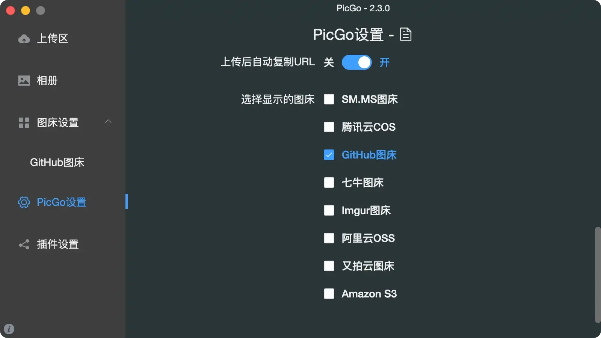
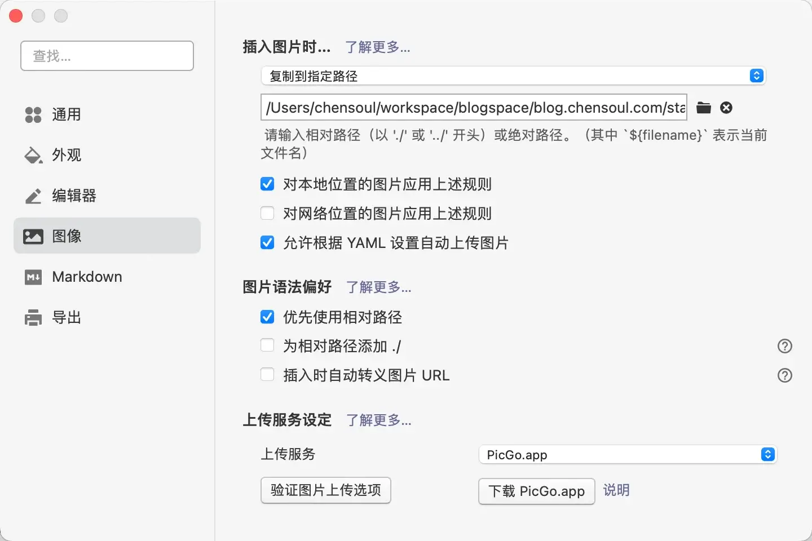

最近编写文档或者写博客，喜欢用 Typora 编辑器通过 Markdown 语法完成编写所有内容。为此，还付费购买了许可证。


喜欢 Typora 的理由：

- 所见即所得的编辑，Markdown 的语法都支持快捷键操作，非常方便

- 可以自定义主题的 CSS，包括文章内容就可以粘贴到公众号里

- 上传图片，支持图床服务。可以将图片上传到指定的图床，前提是需要先安装一个客户端，这里我使用的是 PicGo。然后，PicGo 支持常见的一些图床服务。

  

- 支持导出

## Typora 图片复制到本地

接下来，聊聊 Typora 的图片上传设置：



当你插入图片时，你可以分情况对图片进行设置。比如：

1、对本地位置的图片，可以设置一个上传规则：复制到指定路径或者是当前路径下的一个文件夹、上传图片。

- 如果是编写一个文档，我们就设置把图片保存到本地的 assets 文件夹内，这样方便管理。
- 如果是编写博客，图片一般是集中管理的，我们可以设置复制到一个指定路径

2、类似的，对网络位置的图片也可以使用上面的规则。

注意，如果将图片保存到本地目录，在文章中引用图片是使用的相对或者绝对路径。如果只是在本地查看，是可以预览图片的。但是，如果将博客上传到服务器，则因为路径问题可能会出现无法预览图片的情况。

所以，这种情况我们需要做一些修改。通常我会设置图片复制到博客的静态页面目录下面，比如，我现在使用的是 Hugo 构建静态博客，会将图片保存到 static/img 目录下，并且，还需要修改图片的 markdown 引用路径为 `/images/image-20220819124422239.webp` ，以表示绝对路径查找图片，在博客服务器上就是相对根域名目录去 img 路径下查找图片。待 hugo 编译完成上传静态文件到服务器之后，可以通过 https://blog.chensoul.cc/images/ 加上图片名称的方式访问到图片。

但是，显然，这时候在 Typora 是无法预览图片的，因为在本地查找不到这个绝对路径地址。这时候可以在 Typora 里面设置一个绝对路径，操作方法是，在 显示 -> 图片 -> 图像 -> 设置图片根目录 里进行设置。

设置完成之后，在当前文件的 md 文件的顶部元数据代码里会多一行代码：

```yaml
title: "博客中如何使用图床服务"
date: 2022-08-19
slug: using-images-in-blog
categories: [日志]
tags: ['devops', 'tutorial', 'javascript', 'css', 'git', 'github', 'hugo']
draft: true
typora-root-url: ../../static
```

这样博客里所有的图片都会保存的博客服务器，如果博客访问量增大，则图片加载时间会变慢。为了解决这个问题，需要将图片进行压缩，并给博客设置 CDN 加速。

## Typora 图片上传到网络

将图片保存到本地，待博客静态页面部署到服务器上之后，可以实现正常预览情况。但是，如果我们想把 md 文件打包上传到一些云笔记，比如：语雀，你会发现上传之后会出现图片无法预览的情况。

这时候，我们需要将图片上传到网络。首先，我们需要安装 PicGo，然后设置图床服务，这里我使用的是 github 作为图床来保存图片，并使用 [jsDelivr](https://www.jsdelivr.com) 的 CDN 服务进行加速访问。

如何利用 Github 搭建自己的免费图床？可以参考这篇 [文章](https://zhuanlan.zhihu.com/p/353775844)。这里，记录一下我的操作步骤。

1、使用博客的[托管仓库](https://github.com/chensoul/blog.chensoul.cc) 的 static/img 目录来保存图片，这样方便图片的管理（比如：压缩、重命名，删除无用图片），如果图床服务不可用了，所有博客图片还有一个备份，只需要修改博客内图片的引用地址。前提是需要将仓库设置为 public。

2、在 github 设置里面创建一个 Token。以此打开 `Settings -> Developer settings -> Personal access tokens`，最后点击 `generate new token`

3、在 PicGo 里设置 github 图床：

- 设定仓库名：chensoul/blog.chensoul.cc
- 设定分支：main
- 设定 Token：XXXXXXXXXXXXXXXXX

- 指定存储路径：static/images/
- 设置自定义域名：https://cdn.jsdelivr.net/gh/chensoul/blog.chensoul.cc

4、需要修改博客文章内引用的图片地址，将 /images/ 替换为 https://cdn.jsdelivr.net/gh/chensoul/blog.chensoul.cc/images/ ，可以使用[脚本批量替换](https://dvel.me/posts/macos-replace-contents-multiple-files/)：

```bash
grep -lr --null '](\/img\/' | xargs -0 sed -i '' 's/](\/img\/](https:\/\/cdn.jsdelivr.net\/gh\/chensoul\/blog.chensoul.cc\/static\/img\/g'
```

> 参数说明：
>
> - grep
>   - `-i, --ignore-case` 查找文件时不区分大小写
>   - `-l, --files-with-matches` 返回文件名
>   - `-R, -r, --recursive` 递归搜索子目录
> - sed
>   - `-i` 默认 `sed` 会打印到标准输出，使用 `-i` 将直接在文件内编辑替换
>   - `s` 替换
>   - `g` 全局替换标志
>   - `I` 大小写不敏感标志

反过来，查询 https://cdn.jsdelivr.net/gh/chensoul/blog.chensoul.cc/static/images/ 下的图片地址替换 `/img`

```bash
grep -lr --null '](https://cdn.jsdelivr.net/gh/chensoul/blog.chensoul.cc/static/images/' | xargs -0 sed -i '' 's/](https:\/\/cdn.jsdelivr.net\/gh\/chensoul\/blog.chensoul.cc\/static\/img\/](\/img\/g'
```

另外，在博客编译部署的流程之中，可以定制化一些步骤将博客同步发布到其他系统。当然，在发布之前，也可以先将本地图片的 url 替换成图床地址的 url。等后续实现了，再发布一篇文章。

如果 github 或者 jsdelivr 服务不稳定，则需要考虑使用其他图床了。

> 可以通过这个地址 [https://tcp.ping.pe/](https://tcp.ping.pe/) 来检测 IP 或者域名是否可以访问
