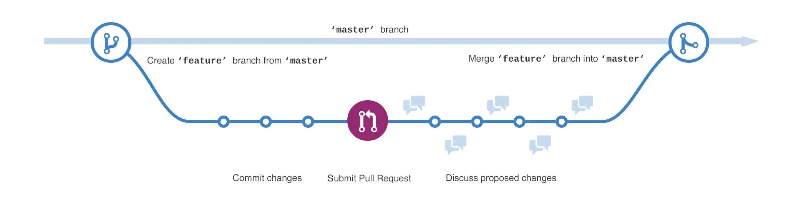

## 介绍

[Git Flow](https://nvie.com/posts/a-successful-git-branching-model/) 是由 Vincent Driessen 在 2010 年提出的一种 Git 工作流。在这之前，Git 没有一个明确的标准工作流，导致团队在使用 Git 时往往会遇到一些问题，如分支管理、版本控制等。为了解决这些问题，Vincent Driessen 提出了 Git Flow 分支模型，成为了 Git 在实际应用中的一种标准工作流。

随着时间的推移，Git Flow 也在不断发展和完善。在 2011 年，Atlassian 发布了 SourceTree，这是一款图形化的 Git 客户端，支持 Git Flow 分支模型。在 2013 年，Git Flow 的一些开发者发布了 Git Flow AVH Edition，这是 Git Flow 的一个增强版本，提供了更多的功能和选项。此外，Git Flow 还得到了其他开源工具和平台的支持，如 GitHub、GitLab 等。

## Git Flow 分支模型

Git Flow 分支模型定义了一种标准的 Git 分支模型，它将代码分为两个长期分支（master 和 develop）和三个短期分支（feature、release 和 hotfix），使得团队可以更好地管理代码的版本和发布。

以下是 Git Flow 分支模型的详细介绍：

1. master 分支
   master 分支是代码库的主分支，它包含了所有已发布的代码和版本。所有代码都应该在该分支上进行测试和验证，以确保代码的质量和稳定性。`master分支只能通过合并release或hotfix分支来更新`。
2. develop 分支
   develop 分支是代码库的开发分支，它包含了所有开发中的代码和功能。所有新的代码都应该在该分支上进行开发和测试，以确保代码的可靠性和稳定性。`develop分支只能通过合并feature分支来更新`。
3. feature 分支
   feature 分支是为开发新的功能或修复 bug 而创建的临时分支。`每个feature分支都是从develop分支分离出来的，开发完成后会合并回develop分支`。feature 分支的命名应该清晰明确，以反映该分支所涉及的功能或问题。
4. release 分支
   release 分支是为发布新版本而创建的临时分支。`每个release分支都是从develop分支分离出来的，发布完成后会合并回develop分支和master分支`。在 release 分支上可以进行一些小的修复和调整，以确保发布的代码的质量和稳定性。
5. hotfix 分支
   hotfix 分支是为快速修复生产环境中的问题而创建的临时分支。每个 hotfix 分支都是从 master 分支分离出来的，修复完成后会合并回 develop 分支和 master 分支。`hotfix分支的优先级比其他分支更高，因为它们需要尽快修复生产环境中的问题。`


根据上面的理论，我们来实际操作一遍。首先，是 develop 分支创建一个 feature 分支。

```bash
$ git checkout -b feature-test develop
Switched to a new branch "feature-test"
```

将 feature 分支的修改合并到 develop 分支，然后删除 feature 分支：

```bash
$ git checkout develop
Switched to branch 'develop'

$ git merge --no-ff feature-test
Updating ea1b82a..05e9557
(Summary of changes)

$ git branch -d feature-test
Deleted branch feature-test (was 05e9557).

$ git push origin develop
```

合并分支时，添加`--no-ff` 参数和不添加的区别：


从 develop 分支创建一个 release 分支，并将版本号改为 1.2 ：

```bash
$ git checkout -b release-1.2 develop
Switched to a new branch "release-1.2"

$ ./bump-version.sh 1.2
Files modified successfully, version bumped to 1.2.
$ git commit -a -m "Bumped version number to 1.2"
[release-1.2 74d9424] Bumped version number to 1.2
1 files changed, 1 insertions(+), 1 deletions(-)
```

release 分支完成开发之后，将 release 分支合并到 master 分支，并创建一个标签：

```bash
$ git checkout master
Switched to branch 'master'

$ git merge --no-ff release-1.2
Merge made by recursive.
(Summary of changes)

$ git tag -a 1.2
```

将 release 分支合并到 develop 分支：

```bash
$ git checkout develop
Switched to branch 'develop'

$ git merge --no-ff release-1.2
Merge made by recursive.
(Summary of changes)
```

最后删除 release 分支：

```bash
$ git branch -d release-1.2
Deleted branch release-1.2 (was ff452fe).
```

对于 hoftfix 分支，操作步骤和 release 分支类似，故不在赘述。

## git-flow 工具

git-flow 工具可以简化上面的操作步骤，关于 git-flow 的介绍可以参考文章：[Using git-flow to automate your git branching workflow](https://jeffkreeftmeijer.com/git-flow/)。

macos 上安装 git-flow：

```bash
brew install git-flow
```

git-flow 首先需要初始化，如果不存在 develop 分支，则会新建一个 develop 分支：

```bash
git flow init
No branches exist yet. Base branches must be created now.
Branch name for production releases: [master]
Branch name for "next release" development: [develop]

How to name your supporting branch prefixes?
Feature branches? [feature-]
Release branches? [release-]
Hotfix branches? [hotfix/]
Support branches? [support/]
Version tag prefix? []
```

### feature 分支

开发一个新功能，创建一个新分支 foo

```php
$ git flow feature start foo
```

等价于

```bash
#切换到develop分支,确保新的 feature 分支是基于最新的 develop 分支创建的。
$ git checkout -b feature-foo develop
```

取消正在进行中的功能分支，并且会将分支删除

```bash
$ git flow feature delete foo
```

等价于

```bash
$ git branch -D feature-foo
```

foo 功能自测通过后，合并到 develop

```bash
$ git flow feature finish foo
```

等价于

```bash
/切换到 develop 分支
$ git checkout develop
/将 feature-foo 分支中的更改合并到 develop 分支。 --no-ff 参数将保留 foo 分支的commit记录。
$ git merge --no-ff feature-foo
/删除已完成的分支
$ git branch -d feature-foo
```

### release 分支

当所有新的功能和必要的修复已经被彻底的测试过了，那就开始生成一个新的 release , 在此之后不能添加新功能，只有错误修复、文档生成和其他面向发布的任务应该在该分支中进行。

```bash
# 1.0.0 是版本号
$ git flow release start 1.0.0
```

等价于

```bash
# 从 develop 分支 创建release分支
$ git checkout -b release-1.0.0 develop
```

取消正在进行中的发布分支，并且会将分支删除。

```bash
$ git flow release delete 1.0.0
```

等价于

```bash
git branch -D release-1.0.0
```

添加完发布文档之后，完成 release

```bash
$ git flow release finish 1.0.0
```

等价于

```bash
#切换到 develop 分支。
$ git checkout develop
#将 release-1.0.0 分支合并到 develop 分支，--no-ff 选项以保留 feature 分支的 commit 记录
$ git merge --no-ff release-1.0.0
#创建一个名为 1.0.0 的标签
$ git tag -a 1.0.0 -m "Release 1.0.0"
#切换到 master 分支。
$ git checkout master
#将 release-1.0.0 分支合并到 master 分支，--no-ff 选项以保留 feature 分支的 commit 记录
$ git merge --no-ff release-1.0.0
#删除 release-1.0.0 分支。
$ git branch -d release-1.0.0
```

### Hotfixes 分支

线上发生问题的时候，先回滚到之前的稳定版本，稳定局势
然后创建热修复分支开始改 BUG

```bash
$ git flow hotfix start 1.0.1
```

等价于

```bash
#从master分支 创建一个hotfix/1.0.1分支
$ git checkout -b hotfix/1.0.1 foo master
```

紧急修复完毕

```bash
$ git flow hotfix finish 1.0.1
```

等价于

```bash
#切换 master 分支
$ git checkout master
#合并热修复分支到master,--no-ff 选项以保留 feature 分支的 commit 记录
$ git merge --no-ff hotfix/ohno
#创建一个名为 1.0.1 的标签
$ git tag 1.0.1
#切换到 develop 分支
$ git checkout develop
#合并热修复分支到 develop ,--no-ff 选项以保留 feature 分支的 commit 记录
$ git merge --no-ff hotfix/1.0.1
#删除热修复分支
$ git branch -d hotfix/1.0.1
```

## git-flow (AVH Edition)

Git-flow (AVH Edition)是 Git Flow 的一个增强版本，由一些 Git Flow 的开发者开发和维护。Git-flow (AVH Edition)在保留 Git Flow 基本思想的前提下，增加了一些新的功能和选项，使得 Git Flow 更加灵活和适用于不同的团队和项目。

Git-flow (AVH Edition)的主要增强功能包括：

1. 支持 git-flow init 命令，可以在一个新的 Git 仓库中快速初始化 Git Flow。
2. 支持 git flow feature pull 命令，可以拉取其他团队成员的 feature 分支。
3. 支持 git flow feature publish 命令，可以将 feature 分支发布到远程仓库。
4. 支持 git flow hotfix finish 命令，可以在修复生产环境问题时自动合并到 develop 分支和 master 分支并发布新版本。
5. 支持 git flow support 分支，可以为旧版本提供长期支持。
6. 允许使用 Hooks and Filters 来扩展和自定义 Git Flow 的行为。

除了以上功能之外，Git-flow (AVH Edition)还提供了更多的选项和配置，使得团队可以根据不同的需求和情况来自定义 Git Flow 的分支模型和工作流程。

### 初始化

使用下面命令初始化 git fow，`-d` 是可选参数，表示使用默认参数：

```bash
git flow init [-d]
```

### 创建 feature/release/hotfix/support 分支

查看、开始、完成、删除 feature 分支：

```bash
git flow feature

# <base> 参数必须是分支名称，缺失时，默认为 develop 分支
git flow feature start <name> [<base>]

git flow feature finish <name>

git flow feature delete <name>
```

发布或者跟踪 feature 分支：

```bash
#如果当前在 feature/name 分支，则可以省略 <name> 参数
git flow feature publish <name>
git flow feature track <name>
```

当 feature 分支发布之后，其他人可以拉取该分支：

```bash
git pull
git checkout feature/<name>
```

类似地，查看、开始、完成、删除 release 分支：

```bash
git flow release
git flow release start <name> [<base>]
git flow release finish <name>
git flow release delete <name>
```

类似地，查看、开始、完成、删除 hotfix 分支：

```
git flow hotfix
git flow hotfix start <name> [<base>]
git flow hotfix finish <name>
git flow hotfix delete <name>
```

查看、开始 support 分支：

```bash
git flow support
git flow support start <name> <base>
```

### Hooks 和 Filters

Git-flow (AVH Edition)允许使用 Hooks and Filters 来扩展和自定义 Git Flow 的行为。Hooks 和 Filters 是 Git Flow 中的两个关键概念，它们可以在 Git Flow 的不同阶段执行自定义脚本或命令，从而实现 Git Flow 的高度定制化。

Hooks 是一些脚本或命令，它们会在 Git Flow 的不同阶段被调用。Git Flow (AVH Edition)支持以下 Hooks：

1. git-flow-init: 该 Hook 会在 git-flow init 命令执行时被调用。
2. git-flow-feature-start: 该 Hook 会在创建新的 feature 分支时被调用。
3. git-flow-feature-finish: 该 Hook 会在完成 feature 分支时被调用。
4. git-flow-release-start: 该 Hook 会在创建新的 release 分支时被调用。
5. git-flow-release-finish: 该 Hook 会在完成 release 分支时被调用。
6. git-flow-hotfix-start: 该 Hook 会在创建新的 hotfix 分支时被调用。
7. git-flow-hotfix-finish: 该 Hook 会在完成 hotfix 分支时被调用。

Filters 是一些命令或参数，它们会在 Git Flow 的不同阶段被过滤或修改。Git Flow (AVH Edition)支持以下 Filters：

1. git-flow-feature-start-message: 可以用于修改 feature 分支创建时的提交信息。
2. git-flow-feature-finish-message: 可以用于修改 feature 分支完成时的提交信息。
3. git-flow-release-start-message: 可以用于修改 release 分支创建时的提交信息。
4. git-flow-release-finish-message: 可以用于修改 release 分支完成时的提交信息。
5. git-flow-hotfix-start-message: 可以用于修改 hotfix 分支创建时的提交信息。
6. git-flow-hotfix-finish-message: 可以用于修改 hotfix 分支完成时的提交信息。

下面是一些使用 Hooks 和 Filters 的例子：

1. 使用 git-flow-init Hook

如果需要在执行 git-flow init 命令时执行一些自定义脚本，可以使用 git-flow-init Hook。假设我们想在 git-flow init 命令执行时输出一些信息，可以在`.git/hooks/git-flow-init`文件中添加以下内容：

```bash
#!/bin/bash

echo "Executing git-flow-init Hook"
```

2. 使用 git-flow-feature-start Hook

如果需要在创建新的 feature 分支时执行一些自定义脚本，可以使用 git-flow-feature-start Hook。假设我们想在创建新的 feature 分支时自动为该分支设置一些默认值，可以在`.git/hooks/git-flow-feature-start`文件中添加以下内容：

```bash
#!/bin/bash

# Set default values for feature branch
git config branch.$GIT_BRANCH_NAME.some_config_value "default_value"
```

3. 使用 git-flow-feature-finish-message Filter

如果需要修改 feature 分支完成时的提交信息，可以使用 git-flow-feature-finish-message Filter。假设我们想在 feature 分支完成时强制要求填写提交信息，可以在`.git/config`文件中添加以下内容：

```toml
[gitflow "feature"]
    finishmessage = Please provide a meaningful commit message for the feature branch
```

4. 使用 git-flow-hotfix-start Hook

如果需要在创建新的 hotfix 分支时执行一些自定义脚本，可以使用 git-flow-hotfix-start Hook。假设我们想在创建新的 hotfix 分支时自动为该分支设置一些默认值，可以在`.git/hooks/git-flow-hotfix-start`文件中添加以下内容：

```bash
#!/bin/bash

# Set default values for hotfix branch
git config branch.$GIT_BRANCH_NAME.some_config_value "default_value"
```

5. 使用 git-flow-hotfix-finish Hook

在`.git/hooks/git-flow-hotfix-finish`文件中添加以下内容：

```bash
#!/bin/bash

# Update version number in package.json
VERSION=$(cat package.json | jq -r '.version')
NEW_VERSION=$(echo $VERSION | awk -F. '{$NF++;print}' | sed 's/ /./g')
sed -i '' "s/\"version\": \"$VERSION\"/\"version\": \"$NEW_VERSION\"/g" package.json
```

> 该脚本用于修改前端项目中的版本号。

## GitHub Flow 模型

GitHub Flow 是一种基于 GitHub 的分支模型和代码开发工作流程，它是一个简单而灵活的模型，在敏捷开发和持续交付方面具有很高的效率。相比于 Git Flow，GitHub Flow 更加适合团队和开发者进行快速迭代和快速上线。

GitHub Flow 的分支模型非常简单：只有一个主分支（通常是 master 分支）和多个特性分支。主分支始终处于稳定状态并用于生产环境。每个特性分支用于开发新功能或修复 bug，并在开发人员完成相应的开发和测试工作后合并到主分支中。


GitHub Flow 遵循以下 6 条原则：

1. `master` 分支永远是随时可部署发布的
2. 需求新增基于 `master` 分支，并创建一个语义化分支
3. 定期推送本地分支到远端
4. 合并到 `master` 需要提 `PR`
5. `PR` 一旦经过 `code review` 无误后即可合并到 `master`
6. `master` 一旦接收到合并请求，即可立即部署发布



GitHub Flow 的代码开发工作流程如下：

1. 创建特性分支：从主分支中创建一个新的特性分支，用于开发新功能或修复 bug。
2. 开发和测试：在特性分支上进行开发和测试，确保代码符合质量标准，并通过自动化测试。
3. 发起合并请求：将特性分支合并到主分支中，发起一个合并请求（pull request），并邀请其他开发者进行代码审查和讨论。
4. 代码审查：其他开发者对代码进行审查和讨论，提出意见和建议，并确保代码符合质量标准和最佳实践。
5. 合并代码：在经过审查和讨论后，将特性分支合并到主分支中，并将代码部署到生产环境。
6. 部署代码：在合并到主分支后，使用自动化部署工具将代码部署到生产环境。

## Gitlab flow 模型

GitLab Flow 是一个基于 GitLab 的分支模型和开发工作流程，旨在支持敏捷开发和持续交付。

`GitLab` 在 2014 年提出 `11` 条最佳实践，更多请点击[这里](https://about.gitlab.com/topics/version-control/what-are-gitlab-flow-best-practices/)，其相对 `GitHub` 增加了环境分支，且代码必须由`上游`（`master`）向`下游`（`staging`）发展，并且针对持续发布和版本发布都提出了相应的准则，下面是其大致流程图：


GitLab Flow 的主要特点包括：

1. 简单的分支模型：GitLab Flow 使用一个简单的分支模型，包括一个主分支（通常命名为“master”或“production”）和一个开发分支（通常命名为“develop”或“staging”）。特性分支从开发分支创建，并在特性或错误修复完成并通过测试后合并回开发分支中。
2. 持续集成和交付：GitLab Flow 强调持续集成和交付（CI/CD），这意味着每次对代码的更改都会自动构建、测试和部署到测试环境或生产环境（如果测试通过）。
3. 代码审查：GitLab Flow 鼓励进行代码审查，这意味着每次对代码的更改都会由至少一个其他开发人员进行审查，以确保其符合质量标准并不会引入任何安全漏洞。
4. 合并请求：GitLab Flow 使用合并请求来管理将代码更改合并到主分支的过程。合并请求允许开发人员在将更改合并到主分支之前对其进行审查和讨论。
5. 环境管理：GitLab Flow 提供高级的环境管理功能，允许团队创建和管理不同的开发、测试、暂存和生产环境。

> GitLab Flow 提供了高级的环境管理功能，可以帮助团队更好地管理不同的开发、测试、暂存和生产环境。以下是使用 GitLab Flow 进行环境管理的一些方法：
>
> 1.  创建不同的环境分支：在 GitLab Flow 中，可以为不同的环境创建分支。例如，可以创建一个名为“develop”的开发分支，一个名为“staging”的暂存分支，和一个名为“production”的生产分支。这些分支可以帮助团队更好地管理不同环境的代码，确保每个环境都有自己的代码版本。
> 2.  配置环境变量：在 GitLab 中，可以为每个环境设置不同的环境变量。这些环境变量可以用于配置不同环境中的应用程序和服务，例如数据库连接字符串、API 密钥等。通过设置正确的环境变量，可以确保应用程序在不同环境中正确运行。
> 3.  自动化部署和测试：GitLab Flow 支持自动化部署和测试，可以帮助团队更快地部署代码到不同环境中。可以使用 GitLab 的 CI/CD 管道来自动化测试和部署过程，并将代码推送到正确的环境分支中。
> 4.  环境监控和报告：GitLab Flow 还支持环境监控和报告功能，可以帮助团队更好地了解不同环境的运行状况和性能。可以使用 GitLab 的监控和报告工具来监视不同环境的性能指标、错误率等，并及时发现和解决问题。

GitLab Flow 的分支模型如下：

1. 主分支：主分支始终处于稳定状态，并用于生产环境。在 GitLab Flow 中，主分支通常是 master 分支或 production 分支。
2. 特性分支：特性分支用于开发新功能或修复 bug，并从主分支中创建。在 GitLab Flow 中，特性分支通常以 feature/或 fix/为前缀。
3. 集成分支：集成分支用于将特性分支集成到主分支中，并进行测试和部署。在 GitLab Flow 中，集成分支通常是 develop 分支或 staging 分支。
4. 发布分支：发布分支用于将特性分支和集成分支的代码发布到生产环境中。在 GitLab Flow 中，发布分支通常是 release/为前缀的分支。

GitLab Flow 的开发工作流程如下：

1. 创建特性分支：从主分支中创建一个新的特性分支，用于开发新功能或修复 bug。
2. 开发和测试：在特性分支上进行开发和测试，确保代码符合质量标准，并通过自动化测试。
3. 合并到集成分支：将特性分支合并到集成分支中，并进行集成测试和自动化部署。
4. 发布到生产环境：将集成分支的代码发布到生产环境中，并进行最终测试和部署。
5. 合并到主分支：在发布到生产环境后，将集成分支合并到主分支中，并将代码部署到生产环境。

GitLab Flow 强调 CI/CD 集成和测试自动化，以确保代码质量和快速迭代。它还支持自动化部署和环境管理，以帮助开发人员更轻松地管理不同环境和部署代码。GitLab Flow 是一个灵活和强大的开发工作流程，适用于各种类型的项目和团队。

## GitLab Flow、Git Flow 和 GitHub Flow

GitLab Flow、Git Flow 和 GitHub Flow 都是三种常见的基于 Git 的工作流程。下面是 GitLab Flow 与其他工作流程的主要区别：

1. GitLab Flow 与 Git Flow 的比较：

- GitLab Flow 比 Git Flow 更简单和更灵活。Git Flow 有一个更复杂的分支模型，包含多个长期存在的分支，而 GitLab Flow 只使用几个主要分支和特性分支。

- GitLab Flow 强调持续集成和持续部署（CI/CD），鼓励频繁合并到主要分支。Git Flow 更注重版本控制和发布管理。

- GitLab Flow 与 GitLab 内置的 CI/CD 管道更紧密地集成在一起，更容易自动化开发工作流程。

2. GitLab Flow 与 GitHub Flow 的比较：

- GitLab Flow 和 GitHub Flow 有许多相似之处，例如它们都以 GitHub 或 GitLab 作为中央仓库，使用特性分支进行开发。
- GitLab Flow 强调 CI/CD 集成和测试自动化，而 GitHub Flow 更注重代码审查和协作。
- GitLab Flow 还提供更高级的环境管理、部署和监控功能，更适合于大型、复杂的项目。

总体而言，GitLab Flow 比 Git Flow 更简单和更灵活，强调 CI/CD 集成和自动化。与 GitHub Flow 相比，GitLab Flow 提供更高级的环境管理和部署功能，更适合于大型、复杂的项目。选择哪种工作流程最终取决于项目和开发团队的具体需求和要求。

## 其他 flow

- TrunkBased
- OneFlow
- AoneFlow

## 总结

目前公司代码部署在自建的 gitlab 上面，对于公司的项目，个人倾向于使用 git-flow 分支模型，并且使用 git-flow (AVH Edition) 来简化操作。

目前，我参与的大多数项目都是 java 项目并且使用 maven 进行构建。

在 Maven 项目中，可以使用 Maven 版本控制器来区分 release 版本和 snapshot 版本。

- **Release 版本**

  对于 Git Flow 中的 release 分支，通常用于为生产环境准备代码。

  在 Maven 项目中，可以使用 Maven Release 插件来自动化创建和发布 release 版本。

  ```bash
  mvn release:prepare
  mvn release:perform
  ```

  使用这些命令，Maven Release 插件会自动更新项目版本号、创建 tag、构建 release 版本，并发布到 Maven 仓库中。发布的版本号不包含 `-SNAPSHOT` 后缀。

  或者，使用 `mvn versions`：

  ```bash
  mvn versions:set -DnewVersion=1.0.0-SNAPSHOT
  mvn versions:commit
  ```

- **Snapshot 版本**

  对于 Git Flow 中的 feature 和 develop 分支，通常用于开发和测试新功能或 bug 修复，这些分支使用 snapshot 版本。在 Maven 中，snapshot 版本的版本号包含 `-SNAPSHOT` 后缀，表示当前版本是正在开发的版本。

对于这些项目，git-flow 操作步骤如下：

1、初始化

```bash
git flow init -d
```

2、开始 feature 分支

```bash
git flow feature start test
```

设置 maven 项目中版本为 snapshot 版本。

```bash
mvn versions:set -DnewVersion=1.0.0-SNAPSHOT
mvn versions:commit
```

对于 maven 多模块项目，如果使用 revision 来统一定义版本号，则使用下面命令：

```bash
mvn versions:set-property -Dproperty=revision -DnewVersion=1.0.0-SNAPSHOT
mvn versions:commit
```

3、本地在 feature 分支上完成一些开发之后，完成 feature 分支

```bash
git flow feature finish test
```

4、开始 release 分支

```bash
git flow release start 1.0.0
```

5、本地在 release 分支上完成一些开发之后，完成 feature 分支

设置 maven 项目中版本为 release 版本。

```bash
mvn versions:set -DnewVersion=1.0.0

mvn versions:commit
```

对于 maven 多模块项目，如果使用 revision 来统一定义版本号，则使用下面命令：

```bash
mvn versions:set-property -Dproperty=revision -DnewVersion=1.0.0

mvn versions:commit
```

另外，对于多模块项目，需要在每个模块执行下面命令将 jar 推送到 maven 中央仓库：

```bash
mvn deploy -DskipTests
```

然后完成分支：

```bash
git flow release finish 1.0.0
```

6、推送主分支和开发分支

```bash
git push origin develop


git checkout main
git push origin main
```

以上。
