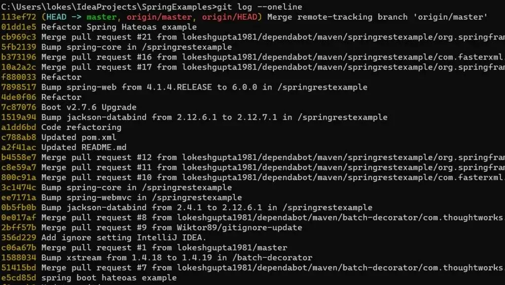
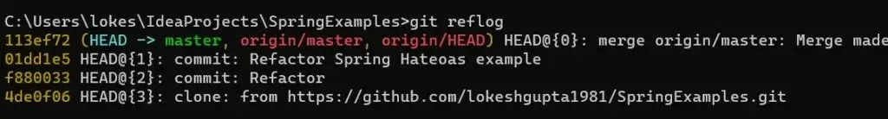

欢迎来到 Git 面试准备指南，我们将在这里向初学者和经验丰富的专业人士讨论最常见的 Git 面试问题。无论您是准备参加 DevOps 或测试面试，还是希望提高 Git 技能，此资源都可以通过深入研究一些与 Git 基本概念和实践相关的最常见面试问题来帮助您。

我们将涵盖所有重要主题，例如分支、存储库管理、处理合并冲突和协作工作流程。通过探索这些问题，您将更深入地了解 Git 的版本控制系统，并更好地应对开发项目中的现实挑战。

## 1.什么是版本控制系统？

[版本控制系统](https://www.atlassian.com/git/tutorials/what-is-version-control) (VCS) 是一种帮助跟踪和管理文件和代码随时间变化的软件。它允许多人协作处理一个项目，跟踪修订，并在需要时轻松恢复到以前的版本。

版本控制系统主要分为三种类型：

- 本地版本控制系统 (LVCS)：在 LVCS 中，版本控制数据库存储在本地计算机上。更改和修订在位于用户计算机上的本地存储库中进行跟踪。但此类系统缺乏协作功能，不利于团队开发。


- 集中版本控制系统 (CVCS)：在 CVCS 中，版本控制数据库存储在中央服务器上。用户可以从服务器检出文件、进行更改并将其提交回服务器。这允许多个用户在同一项目上进行协作，并提供对存储库的集中控制。然而，CVCS 的一个缺点是，如果中央服务器出现故障，协作者将无法执行某些操作，直到服务器恢复为止。


- 分布式版本控制系统 (DVCS)：在 DVCS 中，每个用户都有一个包含整个版本历史记录的本地存储库。这意味着每个用户都拥有项目存储库的完整副本，包括所有分支和修订。用户可以在本地存储库上独立工作，并与其他存储库同步更改。 DVCS 为分布式和分散式工作流程提供更好的支持，允许用户离线工作并更有效地协作。


## 2. Git 中的 Origin 是什么？

在 Git 中，“origin”是指我们从中克隆的远程存储库。当我们从远程服务器克隆存储库时，Git 会自动创建一个名为“origin”的远程引用，该引用指向原始远程存储库。

默认情况下，当我们克隆存储库时，Git 会设置“来源”并将其与我们克隆的原始存储库关联起来。我们可以通过运行命令“git remote -v”来验证这一点。此命令显示与本地存储库关联的远程存储库列表及其 URL。

```bash
git remote -v
origin https://github.com/lokeshgupta1981/Spring-Boot3-Demos.git (fetch)
origin https://github.com/lokeshgupta1981/Spring-Boot3-Demos.git (push)
```

请注意，“origin”只是一个未硬编码的别名，可以使用以下命令提示符进行更改：

```bash
git remote rename origin newName
```

## 3.我们如何在 Git 中配置全局用户名和电子邮件？

设置全局一致的用户名和电子邮件地址非常重要，因为 Git 使用此信息将提交与正确的作者关联起来。它有助于识别每个提交的人员，并允许在项目内进行适当的协作和归属。

要在 Git 中配置全局用户名和电子邮件，我们可以使用以下命令：

```bash
git config --global user.name "MyName"
git config --global user.email "myname@gmail.com"
```

这些命令将全局设置用户名和电子邮件，这意味着它们将用于您计算机上的所有 Git 存储库，除非在存储库级别覆盖。

您可以通过运行以下命令来验证更改。这些命令将分别显示配置的用户名和电子邮件。

```bash
git config --global user.name   # Prints 'lokeshgupta1981'
git config --global user.email    # Prints 'howtodoinjava@gmail.com'
```

## 4. Git 中的“暂存区”是什么意思？

Git 中的“暂存区域”也称为“索引”，是一个中间区域，在将文件提交到 Git 存储库之前，在此区域准备对文件的更改。

当我们对项目文件进行更改时，Git 提供了一个两步过程来提交这些更改。暂存区域充当工作目录（进行修改的位置）和存储库（存储提交的位置 => .git 文件夹）之间的桥梁。


通过使用暂存区，我们可以将不相关的更改分离到多个提交中，或者有选择地包含特定修改而排除其他修改。它提供了一个在变更成为项目历史的一部分之前审查和完善我们的变更的机会。

## 5. Git 中的分叉、分支和克隆之间的区别？

分叉、分支和克隆都是 Git 操作，在版本控制工作流程中具有不同的用途。在深入研究之前，让我们先对它们进行比较。

以下是 Git 中分叉、分支和克隆的表格比较：

| 特征       | 分叉                                                     | 分枝                                                   | 克隆                                           |
| ---------- | -------------------------------------------------------- | ------------------------------------------------------ | ---------------------------------------------- |
| 目的       | 在您的 GitHub 帐户上创建远程存储库的副本。               | 在 Git 存储库中创建单独的开发线。                      | 在您的计算机上创建 Git 存储库的本地副本。      |
| 所有权     | 创建一个由您拥有的完全独立的存储库。                     | 在同一存储库中，分支归原始存储库所有。                 | 本地副本；所有权没有变化。                     |
| 起源       | 源自远程存储库，通常位于 GitHub 上。                     | 源自现有的本地或远程存储库。                           | 源自现有的远程或本地存储库。                   |
| 改变可见性 | 在创建拉取请求之前，在分叉中所做的更改独立于原始存储库。 | 在分支中所做的更改将被隔离，直到您将它们合并回主分支。 | 在将更改推送到远程存储库之前，更改都是本地的。 |
| 用例       | 通常用于为开源项目做出贡献或创建单独的副本供个人使用。   | 用于协作环境中的功能开发、错误修复和隔离更改。         | 用于处理存储库的本地副本，通常用于个人开发。   |

### 分叉

分叉是一个与远程存储库相关的概念，特别是在 GitHub、GitLab 和 Bitbucket 等平台上。分叉在我们自己的帐户中创建原始存储库的副本。

要在 GitHub（或类似平台）上分叉存储库，通常在存储库页面上有一个“分叉”按钮。单击此按钮将在您的 GitHub 帐户中创建原始存储库的分支。

当我们想要为开源项目做出贡献或创建我们自己的独立项目版本时，通常会使用分叉。分叉存储库与原始存储库分开，允许我们进行更改、实验和提交拉取请求，而不会影响原始项目。

### 分枝

分支允许在存储库中创建单独的开发线。它使我们能够彼此独立地处理不同的功能、错误修复或实验。

要在 Git 中创建分支，我们使用以下命令：

```bash
git branch <branch_name>
```

通过创建分支，我们实质上创建了一个新的时间线，我们可以在不影响主分支（通常称为“master”或“main”）的情况下进行更改。一旦我们对分支中所做的更改感到满意，我们就可以将分支合并回主分支以合并更改。

分支是协作开发的强大工具，使多个开发人员能够同时处理不同的任务，同时保持干净且有组织的提交历史记录。

### 克隆

克隆创建远程存储库的本地副本。当我们克隆存储库时，我们会将整个项目的历史记录、文件和分支下载到本地计算机。

要将远程存储库克隆到本地计算机，我们使用以下命令：

```bash
git clone <repository_url>
```

克隆在本地存储库和远程存储库之间建立连接，使我们能够获取更新、推送更改以及与其他人协作。当我们想要开始使用现有存储库时，通常会进行克隆。

## 6. 什么是 Git Stash？

在 Git 中，“存储”功能允许我们临时保存对工作目录所做的更改，而无需提交它们。它提供了一种存储我们的修改并切换到不同分支或应用其他操作的方法，而无需提交不完整或实验性更改。

存储存储在本地，不会推送到远程存储库，这使得它们适合个人工作流程组织和实验。

`git stash` 命令用于创建和管理存储。以下是与 Git stash 相关的一些常见用例和命令：

### Creating a stash

```bash
git stash save "Stash message"
```

此命令将我们的修改保存在新的存储中，并带有描述存储的可选消息。 Git 将从我们的工作目录中恢复更改，使其保持干净。

### Viewing stashes

```bash
git stash list
```

此命令显示您已创建的存储的列表，以及它们的存储引用和消息。

### Applying a stash

```bash
git stash apply stash@{n} / n in [0.....P]
```

此命令将特定存储中的更改应用到当前分支。 `stash@{n}` 指的是列表中的存储引用。默认情况下，它适用于最新的存储。

### Applying and removing a stash

```bash
git stash pop stash@{n}
```

此命令应用特定存储中的更改，并一步将其从存储列表中删除。它相当于应用存储然后使用 `git stash drop` 将其删除。

### Applying a stash to a different branch

```bash
git stash branch branch-name stash@{n}
```

此命令创建一个新分支 ( `new-branch-name` ) 并将特定存储中的更改应用到该分支。这是切换到新分支并一步应用隐藏的更改的便捷方法。

### Discarding a stash

```bash
git stash drop stash@{n}
```

此命令从存储列表中删除特定存储，而不应用其更改。

当我们正在处理某件事但需要切换到不同的任务或分支时，Git stash 非常有用。它允许我们暂时保存更改、切换上下文，然后返回到保存的状态以继续我们上次中断的地方。

## 7. ‘git fetch’ 和 ‘git pull’ 有什么区别？

`git fetch` 和 `git pull` 都用于从远程存储库获取更改并将其合并到本地存储库中。然而，它们在处理获取的更改和更新本地分支的方式上有所不同。

以下是 `git fetch` 和 `git pull` 之间的主要区别：

### git fetch git 获取

- 从远程存储库检索最新更改，包括新分支、提交和标签，而不自动将它们合并到当前分支中。
- 更新远程跟踪分支（例如 `origin/master` ）以反映远程存储库的状态。
- 不修改您的本地分支或工作目录。
- 允许我们在手动合并之前检查和审查获取的更改，从而提供决定如何集成更改的机会。

要从远程存储库获取最新更改，我们使用以下命令：

```bash
git fetch origin
```

### git pull

- 执行 `git fetch` ，然后将获取的更改自动合并到当前分支中。
- 更新远程跟踪分支和本地分支，合并获取的更改。
- 如果当前分支有本地修改， `git pull` 会尝试自动合并更改。如果存在冲突，则需要手动解决。
- 自动更新您的工作目录以反映合并的更改。

要从远程存储库中提取最新更改，我们使用以下命令：

```bash
git pull
```

`git fetch` 和 `git pull` 之间的选择取决于我们的工作流程以及我们想要对集成更改进行控制的级别。

- 如果我们想在合并之前查看更改并对集成过程有更多的控制， `git fetch` 是合适的。
- 如果我们更喜欢更自动化的方法并且对自动合并更改有信心， `git pull` 可能会更方便。

## 8. 解释一下 Git checkout、rebase 和 merge？

这是 Git 中的三个重要命令，用于管理分支并将更改从一个分支合并到另一个分支。

| git 命令 | 目的                                                               | 常见用例                                                  |
| -------- | ------------------------------------------------------------------ | --------------------------------------------------------- |
| checkout | 切换到不同的分支或提交，使其成为当前工作分支/提交。                | – 分支的创建和切换 - 检查特定提交以进行检查或测试         |
| rebase   | 将更改从一个分支重新应用到另一分支。通常用于维护线性提交历史记录。 | – 将功能分支集成到主分支中 – 维护干净、线性的提交历史记录 |
| merge    | 将一个分支的更改合并到另一个分支。保留提交，创建合并提交。         | – 将功能分支集成到主分支中 – 合并多个贡献者的更改         |

让我们逐一解释一下：

### git checkout

`git checkout` 用于在项目的不同分支或版本之间切换。

要切换到另一个分支，我们使用以下命令：

```bash
git checkout <branch-name>
```

- 当您运行 `git checkout <branch-name>` 时，它会更新您的工作目录以匹配指定分支的内容。
- 您还可以使用 `git checkout` 切换到特定的提交或标记，从而允许您查看历史记录中特定状态的项目。
- 此外， `git checkout -b <new-branch-name>` 创建一个新分支并在单个命令中切换到它。

### git rebase

`git rebase` 用于将一个分支的更改集成到另一个分支，通常用于将功能分支的更改合并到主分支中。

假设我们有两个分支：源分支（我们称之为“feature”）和目标分支（通常是“master”或“main”）。 “feature”分支包含一些更改，我们希望将这些更改合并到“master”分支中。但是，我们不想执行标准合并，因为我们想维护线性提交历史记录。

首先，您需要确保您位于目标分支（git checkout master）。在这种情况下，它将是 master，然后，启动 rebase 命令，指定要 rebase 到当前分支（目标分支）的源分支。

```bash
git rebase feature
```

- 当您运行 `git rebase <target-branch>` 时，Git 会识别当前分支和目标分支的共同祖先，然后将当前分支的提交重新应用到目标分支之上。
- Rebase 通过按顺序放置提交来允许线性历史记录，使其看起来好像更改是直接在目标分支之上进行的。
- 这可以帮助维护干净的提交历史记录，特别是在处理长期存在的功能分支时。

### git merge

`git merge` 将不同分支的更改合并到当前分支中。

要将分支的更改合并到目标分支，我们使用以下命令（在 git checkout 之后）：

```bash
git merge <source-branch>
```

- 当您运行 `git merge <source-branch>` 时，Git 会创建一个新的提交，将源分支中的更改合并到当前分支中。
- 合并提交保留了两个分支的历史记录，包括它们分歧的点。
- 默认情况下，如果可能，Git 会执行“快进”合并，这意味着它将当前分支指针向前移动到源分支的提交，而不创建额外的合并提交。
- 但是，如果由于不同的更改而无法进行快进合并，Git 会执行“递归”或“非快进”合并，创建一个新的合并提交。

## 9. “gitcherry-pick”命令的用途是什么？

“gitcherry-pick”命令用于将特定提交从一个分支应用到另一个分支。它允许我们选择单独的提交并将它们应用到不同的分支，将它们的更改合并到目标分支中。

以下是我们如何使用 `git cherry-pick` 命令：

- 识别提交：确定要应用于另一个分支的提交。您可以找到提交哈希或使用其他 Git 命令（例如 `git log` 或 `gitk` ）来可视化提交历史记录。
- 切换到目标分支：确保您位于要应用所选提交的分支上。您可以使用 `git checkout` 切换到目标分支。
- 运行 `git cherry-pick` ：执行 `git cherry-pick` 命令，后跟要应用的提交的提交哈希值。例如：

```bash
git cherry-pick <commit-hash>
```

需要注意的是， `git cherry-pick` 会复制选定的提交并将它们作为新提交应用到目标分支上。这意味着新提交将具有不同的提交哈希值，因为它们是单独的副本，而不是原始提交的直接传输。

## 10. 解释 Git 重置和恢复

在 Git 中，重置和恢复是撤消更改的两种不同方法。它们用于纠正错误、撤消提交或将存储库恢复到以前的状态。

| Action   | Git Reset                                                                | Git Revert                                        |
| -------- | ------------------------------------------------------------------------ | ------------------------------------------------- |
| 目的     | 将 HEAD 和分支指针移动到指定的提交。                                     | 创建一个新的提交来撤消特定提交所做的更改。        |
| 常见用例 | – 在推送到远程存储库之前在本地撤消提交 – 重组提交历史 – 从暂存区删除更改 | – 安全撤消提交而不更改提交历史记录 – 协作代码修正 |

### git reset

`git reset` 将当前分支指针移动到特定提交，从而有效地将分支重置为该提交。

```bash
#Let's say we have a commit history like this: A - B - C - D (master)
#To Perform a hard reset to move the branch pointer to commit B, discarding changes in C and D.
git reset --hard B
```

复位命令有三种模式：软复位、混合复位和硬复位。

- 软重置 ( `git reset --soft` ) 将分支指针移动到指定的提交，同时保持暂存区域和工作目录中的更改不变。它允许您“撤消”提交并根据先前的状态进行其他修改。
- 混合重置（默认行为， `git reset --mixed` ）将分支指针移动到指定的提交，重置暂存区域，但保留工作目录中的更改。它“取消暂存”更改，允许您在提交之前修改并再次暂存它们。
- 硬重置 ( `git reset --hard` ) 将分支指针移动到指定的提交，丢弃暂存区域和工作目录中的任何更改。它完全删除更改，将分支和整个存储库恢复到指定提交的状态。

### git revert

`git revert` 创建一个新的提交，撤消先前提交中所做的更改。它提供了一种安全的方式来撤消提交而不更改提交历史记录。

```bash
git revert C  # This command will Create a new commit that undoes the changes in commit C.
```

`git revert` 创建新的提交来反转指定提交引入的更改，而不是修改或删除现有提交。每个恢复提交都专门用于撤消特定提交的更改，确保提交历史记录保持完整。

## 11.“.gitignore”文件的用途是什么？

`.gitignore` 文件指定不应提交到存储库的有意未跟踪的文件和目录。它允许我们定义 Git 在跟踪更改和暂存文件时应忽略的文件和目录名称模式。

使用“.gitignore”文件的一些常见用例和好处包括：

- 忽略构建工件，例如编译的二进制文件、目标文件、日志文件或临时文件。
- 忽略单独管理的依赖项或库。在存储库中包含这些依赖项是不必要的，并且可能会导致存储库臃肿。
- 忽略包含 API 密钥、数据库凭据或特定于环境的设置等敏感信息的配置文件。
- 忽略与其他团队成员无关的个人开发环境文件，例如项目设置、编辑器备份文件或缓存文件。

以下是包含 3 个条目的 `.gitignore` 文件的示例：

```
# Ignore build artifacts
*.exe
*.o
*.log

# Ignore dependency directories
/node_modules
/vendor

# Ignore sensitive configuration files
config.ini
secrets.json
```

## 12. Git reflog 和 log 有什么区别？

`git log` 主要用于查看特定分支或提交的提交历史记录，而 `git reflog` 更专注于跟踪整个存储库中的引用移动，这使得它对于恢复和提交特别有用。调试目的。

| 方面     | `git log`                                        | `git reflog`                                       |
| -------- | ------------------------------------------------ | -------------------------------------------------- |
| 目的     | 显示分支的提交历史记录。                         | 显示存储库的参考日志。                             |
| 常见用例 | – 回顾项目历史 –检查提交消息和随时间所做的更改。 | –恢复丢失的提交或分支 – 调试和了解存储库中的更改。 |

### git log

`git log` 命令提供存储库中按时间顺序提交的列表，显示提交哈希、作者、日期和提交消息等详细信息。默认情况下，它显示当前分支的提交历史记录，从最近的提交开始并按时间倒退。各种选项和标志允许自定义，例如按作者、日期范围或分支进行过滤。

```bash
# To see the commit history for the current branch
git log
```

要以紧凑的一行格式显示提交历史记录，我们使用以下命令：

```bash
git log --oneline
```



### git reflog

另一方面， `git reflog` 给出了引用（分支或标签）更新和修改提交指针的其他操作的详细日志。

```bash
# To view the reflog for the repository
git reflog
```



与 `git log` 不同，引用日志记录影响提交历史记录的分支移动和操作，即使不创建新的提交也是如此。它是恢复丢失的提交或可能被意外删除或移动的分支的宝贵工具，在发生错误或不可预见的事件时充当安全网。

## 13.“git bisect”命令的用途是什么？

`git bisect` 命令通过提交历史记录执行二分搜索，以识别引入错误或导致回归的特定提交。它通过有效地缩小要调查的提交范围，有助于隔离和查明负责特定问题的提交。

以下是 `git bisect` 工作原理的概述：

- 识别已知的好的和坏的提交：首先识别项目历史记录中的两个提交：一个代表已知的良好状态（不存在错误或问题的提交），另一个代表已知的坏状态（不存在 bug 或问题的提交）存在错误或问题）。
- 开始二等分过程：使用 `git bisect start` 开始二等分过程。使用 `git bisect good <commit>` 指定已知良好状态的提交哈希，使用 `git bisect bad <commit>` 指定已知不良状态的提交哈希。 Git 将在已知的好状态和坏状态之间创建一系列提交。

```bash
git bisect start
git bisect good <good_commit_hash>
git bisect bad <bad_commit_hash>
```

## 14. 我们如何在 Git 中将多个提交压缩为单个提交？

为了在 Git 中将多个提交压缩为单个提交，我们可以使用交互式变基功能。确保我们位于包含我们想要压缩的提交的分支上。

运行以下命令启动交互式变基：

```bash
git rebase -i HEAD~n
```

将 `n` 替换为我们想要压缩的提交数。例如，如果我们想压缩最后 3 次提交，请使用 `HEAD~3` 。

将打开一个交互式文本编辑器，显示我们在上一步中指定的提交列表。每个提交前面都会有“pick”一词。


要压缩提交，请将除第一个提交之外的所有提交的“pick”更改为“squash”（或“s”）。将第一个提交保留为“pick”，因为它将是生成的提交消息。如果需要，您还可以通过移动文本编辑器中的行来重新排列提交的顺序。


- 保存并退出文本编辑器。
- 将打开另一个文本编辑器，允许您修改提交消息。您可以合并压缩提交的提交消息或写入新消息。根据需要编辑消息，保存并退出编辑器。
- Git 将执行变基，将提交压缩为单个提交。
- 如果变基成功，您将看到一条消息，表明变基已完成。
- 如果存在任何冲突，Git 将停止 rebase 过程并允许我们解决它们。解决冲突后，使用 `git rebase --continue` 继续变基过程。
- 如有必要，将更改推送到远程存储库。

警告：压缩提交时要小心，因为它会重写历史。如果提交已经被推送到共享存储库并且其他人已经基于这些提交进行了工作，通常不建议压缩它们，因为这可能会导致其他团队成员发生冲突。

## 15、如何判断某个分支是否已经合并到 Master 中？

要识别某个分支是否已合并到 Git 中的 `master` 分支中，我们可以运行以下命令：

```bash
git checkout master
```

然后运行以下命令，将 `<branch_name>` 替换为我们要检查的分支名称：

```bash
git branch --merged <branch_name>
```

- 如果分支已合并到 `master` 中，它将出现在运行此命令后显示的分支列表中。
- 如果分支尚未合并到 `master` 中，它将不会出现在合并分支列表中。

或者，我们可以使用以下命令来查看合并分支的简明视图：

```bash
git branch --merged
```

此命令将列出已合并到当前分支的所有分支，在本例中为 `master` 。

## 16. 什么是 Git 存储库？如何初始化 Git 存储库？

Git 存储库是 Git 跟踪和管理一组文件和目录更改的存储位置。它包含对文件所做的所有更改的完整历史记录，使我们能够跟踪和恢复更改、与其他人协作以及维护项目的不同版本。

要初始化目录中的 Git 存储库，我们可以使用 `git init` 命令。我们是这样做的：

```bash
cd /path/to/your/local-repo-path
git init
```

此命令在当前目录中初始化一个空的 Git 存储库。 Git 创建一个隐藏的 `.git` 目录，其中存储所有存储库数据，包括提交历史记录和配置。

## 17. 如何显示版本库的当前状态，包括修改的文件和分支信息？

要显示存储库的当前状态，包括修改的文件和分支信息，我们可以使用 `git status` 命令。

```bash
git status
# Sample Output
Changes not staged for commit:
  (use "git add <file>..." to update what will be committed)
  (use "git restore <file>..." to discard changes in working directory)
        modified:   spring-boot-actuator-example/pom.xml
        modified:   spring-boot-actuator-example/src/main/java/com/howtodoinjava/demo/SimpleRestController.java
        modified:   spring-boot-actuator-example/src/main/resources/application.properties
        modified:   spring-webflux-demo/src/test/java/com/howtodoinjava/demo/EmployeeControllerTest.java
no changes added to commit (use "git add" and/or "git commit -a")
```

此命令将显示我们的存储库当前状态的摘要。它将向我们显示以下信息：

- 我们当前所在的分支。
- 未跟踪的文件（Git 当前未跟踪的文件）。
- 已修改的文件（已修改但未暂存的文件）。
- 暂存文件（已修改并暂存以供下一次提交的文件）。
- 分支状态（例如，“您的分支已更新为‘origin/master’”）。

## 18. 如何连接本地仓库到远程仓库？

要将本地存储库连接到远程存储库，我们需要将远程 URL 添加到本地 Git 存储库。此远程 URL 指向我们要存储和同步代码的远程存储库的位置（例如，在 GitHub、GitLab 或 Bitbucket 上）。

```bash
git remote add origin <remote_url>
```

此命令添加一个名为“origin”的远程（如果愿意，我们可以选择不同的名称）并将其与指定的远程 URL 关联。

## 19. 如何列出已有的分行？如何创建新分支？

要列出现有分支，我们可以使用“gitbranch”命令。它显示存储库中所有分支的列表，并突出显示当前分支。

```bash
git branch
```

要创建新分支，我们可以使用以下命令：

```bash
git branch <branch-name>
```

## 20. 如何切换到特定分支？

我们可以使用以下命令切换到特定分支：

```bash
 git checkout <branch-name>
```

## 21. 如何将不同分支的更改合并到当前分支？

确保我们位于要合并更改的分支（例如 main 分支）后，使用 merge 命令将指定分支的更改合并到当前分支。

```bash
git checkout < main-branch >
git merge <branch-name>
```

## 22.如何删除 Git 中的分支？

要删除分支，我们可以传递 `-d` 标志。

```bash
 git branch -d <branch-name>
```

## 23. 如何将文件添加到暂存区？

要将文件添加到暂存区，我们使用 git add 命令：

```bash
git add <file>
```

为了轻松地将所有文件添加到暂存区域，我们可以使用“.”。而不是特定的文件：

```bash
git add .
```

## 24. 如何使用描述性消息在暂存区提交更改？

将文件添加到暂存区域后，我们可以使用以下命令提交更改：

```bash
git commit -m "message".
```

将“消息”替换为总结更改的描述性消息。

## 25. 如何将提交的更改推送到远程存储库？

要将提交的更改推送到远程存储库，我们使用以下命令：

```bash
git push <remote-name> <branch-name>
```

## 26. 如何撤消 Git 中的最后一次提交？

要撤消最后一次提交，同时将更改保留为未提交的修改，我们可以使用以下命令：

```bash
git reset HEAD~1
```

这会将 HEAD 指针向后移动一次提交。更改仍将在您的工作目录中，允许我们修改它们或进行新的提交。

## 27. 什么是合并冲突，如何解决？

当 Git 由于同一行代码上的修改冲突而无法自动合并来自不同分支的更改时，就会发生合并冲突。

要解决合并冲突，我们需要手动编辑冲突文件，以选择所需的更改。解决冲突后，我们可以添加并提交更改以完成合并。

## 28. 如何从远程存储库中提取更改？

要从 Git 中的远程存储库提取更改，我们可以使用 `git pull` 命令。 `git pull` 命令从远程存储库获取最新更改并将它们合并到我们的本地分支中。

```bash
git pull origin <branch-name>
```

例如，如果我们想从 `master` 分支中提取更改，我们可以使用 `git pull origin master` 。如果我们克隆存储库，默认远程名称通常为 `origin` ，但如果您自定义它，它可能会有所不同。

如果有任何冲突，Git 会通知我们，我们需要手动解决冲突。如果合并成功，我们的本地分支将使用远程存储库中的最新更改进行更新。

在拉取更改之前，建议提交或存储本地更改以避免冲突。如果您有未提交的更改，Git 可能会拒绝拉取，直到您提交或存储它们。

## 29. 如何显示两次提交之间的差异？

要显示两个 Git 提交之间的差异，可以使用以下命令：

```bash
 git diff <commit1> <commit2>
```

## 30. 如何在 Git 中恢复提交？

要恢复提交并创建一个撤消更改的新提交，我们可以使用以下命令：

```bash
 git revert <commit-hash>
```

将 替换为您要恢复的提交哈希。 Git 将创建一个新的提交来撤消在指定提交中所做的更改。

## 31.如何查看 Git 中的提交历史记录？

Git 中的每个分支都维护自己的提交历史记录。要访问和查看与特定分支关联的提交，我们可以使用以下命令：

```bash
 git log branch-name
```

以下是使用“git log”的不同场景：

- 不指定分支名称：“git log”显示当前签出的分支的提交历史记录。如果没有签出分支，它会显示整个存储库的提交历史记录。
- 使用特定分支名称：“git log ”显示指定分支的提交历史记录，包括其父分支共享的任何提交。

## 32. 如何取消暂存文件？

要在 Git 中取消暂存文件，我们可以使用以下命令：

```bash
git reset HEAD -- path/to/file
```

与递归使用“git add”类似，您可以按目录取消暂存文件或执行批量取消暂存操作。要立即取消所有内容，请从存储库的根目录运行以下命令：

```bash
git reset HEAD -- .
```

## 33. 如何从远程存储库中删除文件？

要从远程存储库中删除文件，可以使用以下命令：

```bash
 git rm <file>
```

这将从工作目录和 Git 存储库中删除该文件。删除文件后，您需要提交并推送更改以更新远程存储库。

## 结论

总之，这份关于常见 Git 面试问题和答案的综合指南对 Git 版本控制系统中的基本概念和实践进行了彻底的探索。

通过深入研究存储库管理、分支、合并、解决冲突和协作工作流程等主题，您可以对 Git 的关键方面有深入的了解。

快乐学习！

原文链接：[Git Interview Questions for DevOps and Testers ](https://howtodoinjava.com/interview-questions/git-interview-questions/)
