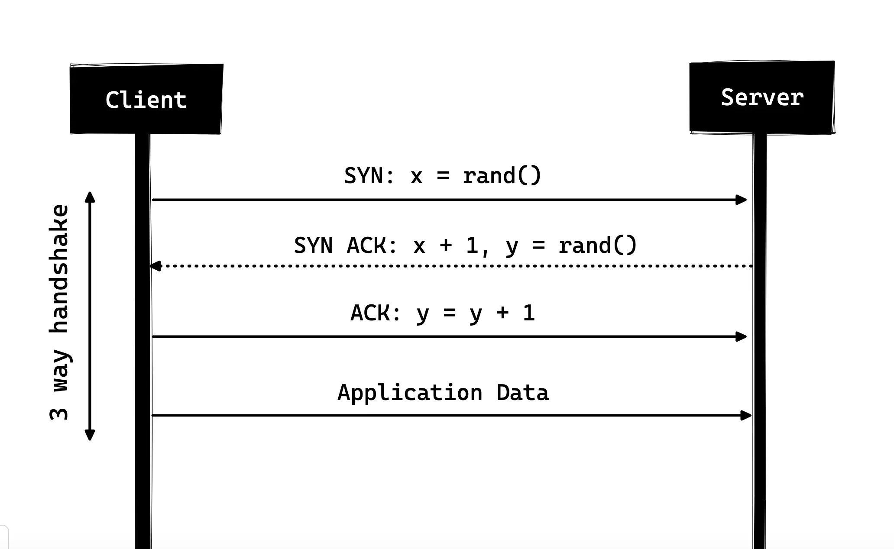
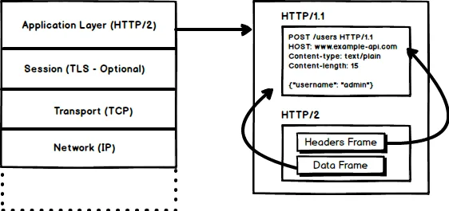

HTTP 是每个 Web 开发人员都应该了解的协议，因为它为整个 Web 提供动力。了解 HTTP 当然可以帮助您开发更好的应用程序。

在本文中，我将讨论 HTTP 是什么、它是如何产生的、它今天的状况以及我们是如何走到这一步的

## 什么是 HTTP？

首先，什么是 HTTP？ HTTP 是基于 TCP/IP 的应用层通信协议，它标准化了客户端和服务器之间的通信方式。它定义了如何通过互联网请求和传输内容。通过应用层协议，我的意思是它只是一个标准化主机（客户端和服务器）通信方式的抽象层。 HTTP 本身依赖于 TCP/IP 来获取客户端和服务器之间的请求和响应。

默认情况下，使用 TCP 端口 80，但也可以使用其他端口。然而，HTTPS 使用端口 443。

## HTTP/0.9 - One Liner (1991)

HTTP 的第一个有记录的版本是 1991 年提出的 [HTTP/0.9](HTTP/0.9)。它是有史以来最简单的协议；有一个名为 GET 的方法。如果客户端必须访问服务器上的某个网页，它会发出如下所示的简单请求

```
GET /index.html
```

服务器的响应如下所示

```
(response body)
(connection closed)
```

也就是说，服务器将收到请求，回复 HTML 作为响应，一旦内容传输完毕，连接就会关闭。有

- 无标题
- `GET` 是唯一允许的方法
- 响应必须是 HTML

正如您所看到的，该协议实际上只不过是未来的踏脚石。

## HTTP/1.0 - 1996

1996 年，HTTP 的下一个版本（即 HTTP/1.0）得到了发展，比原始版本有了很大的改进。与仅针对 HTML 响应设计的 HTTP/0.9 不同，HTTP/1.0 现在也可以处理其他响应格式，即图像、视频文件、纯文本或任何其他内容类型。它添加了更多方法（即 POST 和 HEAD）、更改了请求/响应格式、将 HTTP 标头添加到请求和响应中、添加了状态代码来标识响应、引入了字符集支持、多部分类型、授权、缓存、内容编码等都包括在内。

以下是示例 HTTP/1.0 请求和响应的样子：

```
GET / HTTP/1.0
Host: cs.fyi
User-Agent: Mozilla/5.0 (Macintosh; Intel Mac OS X 10_10_5)
Accept: */*
```

正如您所看到的，除了请求之外，客户端还发送了它的个人信息、所需的响应类型等。而在 HTTP/0.9 中，客户端永远无法发送此类信息，因为没有标头。

对上述请求的响应示例可能如下所示

```
HTTP/1.0 200 OK
Content-Type: text/plain
Content-Length: 137582
Expires: Thu, 05 Dec 1997 16:00:00 GMT
Last-Modified: Wed, 5 August 1996 15:55:28 GMT
Server: Apache 0.84

(response body)
(connection closed)
```

响应的开头是 HTTP/1.0（HTTP 后跟版本号），然后是状态代码 200，后跟原因短语（或者状态代码的描述，如果您愿意的话）。

在此较新版本中，请求和响应标头仍保留为 ASCII 编码，但响应正文可以是任何类型，即图像、视频、HTML、纯文本或任何其他内容类型。因此，现在服务器可以向客户端发送任何内容类型；推出后不久，HTTP 中的“超文本”一词就变得用词不当。 HMTP 或超媒体传输协议可能更有意义，但我想，我们终生都坚持这个名字。

HTTP/1.0 的主要缺点之一是每个连接不能有多个请求。也就是说，每当客户端需要从服务器获取某些内容时，它都必须打开一个新的 TCP 连接，并且在满足该单个请求后，连接将被关闭。对于任何下一个要求，都必须建立在新的连接上。为什么不好？

好吧，假设您访问的网页包含 10 个图像、5 个样式表和 5 个 JavaScript 文件，总共有 20 个项目需要在向该网页发出请求时获取。由于服务器在满足请求后立即关闭连接，因此将存在一系列 20 个单独的连接，其中每个项目都将在其单独的连接上一个接一个地提供服务。

如此大量的连接会导致严重的性能损失，因为由于三向握手和慢启动，需要新的 TCP 连接会造成显着的性能损失。

### 三方握手

三向握手最简单的形式是，所有 TCP 连接都以三向握手开始，其中客户端和服务器在开始共享应用程序数据之前共享一系列数据包。

- SYN - 客户端选取一个随机数（假设为 x）并将其发送到服务器。
- SYN ACK - 服务器通过将 ACK 数据包发送回客户端来确认请求，该数据包由随机数组成，假设服务器拾取 y 和数字 x+1，其中 x 是客户端发送的数字
- ACK - 客户端递增从服务器接收到的数字 y，并发送回带有数字 y+1 的 ACK 数据包

一旦三向握手完成，客户端和服务器之间的数据共享就可以开始。应该注意的是，客户端可以在发送最后一个 ACK​​ 数据包后立即开始发送应用程序数据，但服务器仍然必须等待收到 ACK 数据包才能满足请求。



然而，HTTP/1.0 的一些实现试图通过引入一个名为 Connection: keep-alive 的新标头来克服这个问题，该标头旨在告诉服务器“嘿服务器，不要关闭此连接，我再次需要它”。但它仍然没有得到广泛的支持，问题仍然存在。

除了无连接之外，HTTP 也是一种无状态协议，即服务器不维护有关客户端的信息，因此每个请求都必须具有服务器自己完成请求所需的信息，而不与任何旧协议有任何关联。要求。因此，这火上浇油，即除了客户端必须打开大量连接之外，它还必须在线路上发送一些冗余数据，从而导致带宽使用量增加。

## HTTP/1.1 - 1997

HTTP/1.0 仅仅 3 年后，下一个版本即 HTTP/1.1 于 1999 年发布；比前身做了很多改进。相对于 HTTP/1.0 的主要改进包括

- 添加了新的 HTTP 方法，其中引入了 PUT、PATCH、OPTIONS、DELETE

- 主机名标识 在 HTTP/1.0 中，主机标头不是必需的，但 HTTP/1.1 使其成为必需的。

- 持久连接 如上所述，在 HTTP/1.0 中，每个连接只有一个请求，一旦请求完成，连接就会关闭，这会导致严重的性能影响和延迟问题。 HTTP/1.1 引入了持久连接，即连接默认情况下不会关闭，而是保持打开状态，从而允许多个连续请求。要关闭连接，请求头 Connection: close 必须可用。

  客户端通常在最后一个请求中发送此标头以安全地关闭连接。

- 管道化 它还引入了对管道化的支持，客户端可以在同一连接上向服务器发送多个请求，而无需等待服务器的响应，并且服务器必须按照接收请求的顺序发送响应。但是，您可能会问，客户端如何知道这是第一个响应下载完成并且下一个响应内容开始的点！

  好吧，为了解决这个问题，必须存在 Content-Length 标头，客户端可以使用它来识别响应结束的位置，并且可以开始等待下一个响应。

> 应该注意的是，为了从持久连接或管道中受益，Content-Length 标头必须在响应上可用，因为这会让客户端知道传输何时完成并且可以发送下一个请求（以正常的顺序方式）发送请求）或开始等待下一个响应（当启用管道时）。
>
> 但这种方法仍然存在一个问题。也就是说，如果数据是动态的并且服务器无法事先找到内容长度怎么办？那么在这种情况下，您真的无法从持久连接中受益，不是吗？！为了解决这个问题，HTTP/1.1 引入了分块编码。在这种情况下，服务器可能会省略内容长度以支持分块编码（稍后会详细介绍）。但是，如果它们都不可用，则必须在请求结束时关闭连接。

- 分块传输 在动态内容的情况下，当服务器在传输开始时无法真正找出 Content-Length 时，它可能会开始分块（逐块）发送内容，并在发送时为每个块添加 Content-Length 。当所有块都发送完毕（即整个传输已完成）时，它会发送一个空块（即 Content-Length 设置为零的块），以便识别传输已完成的客户端。

  为了通知客户端有关分块传输的信息，服务器包含标头 Transfer-Encoding: chunked

- 与仅具有基本身份验证的 HTTP/1.0 不同，HTTP/1.1 包括摘要和代理身份验证

- 缓存

- 字节范围

- 字符集

- 语言谈判

- 客户端 cookie

- 增强的压缩支持

- 新的状态代码

- 更多

我不会在这篇文章中详细介绍 HTTP/1.1 的所有功能，因为它本身就是一个主题，您已经可以找到很多相关内容。我建议您阅读的这样一份文档是 HTTP/1.0 和 HTTP/1.1 之间的关键差异，这里是优秀者的原始 RFC 链接。

HTTP/1.1 于 1999 年推出，多年来一直是一个标准。尽管如此，它比它的前身有了很大的改进；随着网络每天都在变化，它开始显示出它的年龄。如今加载网页比以往更加消耗资源。如今，一个简单的网页必须打开 30 多个连接。那么 HTTP/1.1 有持久连接，那为什么有这么多连接呢？你说！原因是，在 HTTP/1.1 中，任何时刻只能有一个未完成的连接。

HTTP/1.1 试图通过引入管道来解决这个问题，但它并没有完全解决这个问题，因为队头阻塞，缓慢或繁重的请求可能会阻塞后面的请求，一旦请求卡在管道中，它就会被阻塞。必须等待下一个请求得到满足。

为了克服 HTTP/1.1 的这些缺点，开发人员开始实施解决方法，例如使用 spritesheet、CSS 中的编码图像、单个庞大的 CSS/Javascript 文件、域分片等。

## SPDY-2009

谷歌继续尝试替代协议，以提高网络速度并提高网络安全性，同时减少网页延迟。 2009 年，他们宣布了 SPDY。

> SPDY 是 Google 的商标，而不是缩写词。

可以看出，如果我们不断增加带宽，网络性能一开始会有所提高，但到了某个阶段，性能增益就不会太大了。但如果你对延迟也采取同样的做法，即如果我们不断降低延迟，那么性能就会持续提升。这是 SPDY 背后性能增益的核心思想，减少延迟以提高网络性能。

> 对于那些不知道区别的人来说，延迟是延迟，即数据在源和目的地之间传输所需的时间（以毫秒为单位），而带宽是每秒传输的数据量（每秒比特数）。

SPDY 的功能包括多路复用、压缩、优先级、安全性等。我不打算详细介绍 SPDY，因为当我们在下一节中深入了解 HTTP/2 的本质时，您就会明白了。据说 HTTP/2 主要是受到 SPDY 的启发。

SPDY 并没有真正尝试取代 HTTP；而是它是 HTTP 上的转换层，存在于应用程序层并在将请求发送到线路之前对其进行修改。它开始成为事实上的标准，大多数浏览器开始实现它。

2015 年，在 Google，他们不想有两个相互竞争的标准，因此决定将其合并到 HTTP 中，同时诞生了 HTTP/2 并弃用了 SPDY。

## HTTP/2 - 2015

到现在为止，您必须确信为什么我们需要对 HTTP 协议进行另一次修订。 HTTP/2 专为低延迟内容传输而设计。与旧版本 HTTP/1.1 的主要功能或区别包括

- 二进制而不是文本
- 多路复用 - 单个连接上的多个异步 HTTP 请求
- 使用 HPACK 进行标头压缩
- 服务器推送 - 单个请求的多个响应
- 请求优先级
- 安全



### 1. 二进制协议

HTTP/2 倾向于通过使其成为二进制协议来解决 HTTP/1.x 中存在的延迟增加的问题。作为一种二进制协议，它更容易解析，但与 HTTP/1.x 不同，它不再是人眼可读的。 HTTP/2 的主要构建块是帧和流

#### 帧和流

HTTP 消息现在由一个或多个帧组成。有一个用于元数据的 HEADERS 帧和用于有效负载的 DATA 帧，并且存在多种其他类型的帧（HEADERS、DATA、RST_STREAM、SETTINGS、PRIORITY 等），您可以通过 HTTP/2 规范进行检查。

每个 HTTP/2 请求和响应都会被赋予一个唯一的流 ID，并被分为帧。帧只不过是二进制数据。帧的集合称为流。每个帧都有一个流 ID，用于标识其所属的流，并且每个帧都有一个公共标头。另外，除了流 ID 是唯一的之外，值得一提的是，客户端发起的任何请求都使用奇数，而服务器响应的流 ID 则为偶数。

除了 HEADERS 和 DATA 之外，我认为这里值得一提的另一种帧类型是 RST_STREAM，它是一种特殊的帧类型，用于中止某些流，即客户端可以发送此帧以让服务器知道我不需要此流不再了。在 HTTP/1.1 中，使服务器停止向客户端发送响应的唯一方法是关闭连接，这会导致延迟增加，因为必须为任何连续请求打开新连接。

在 HTTP/2 中，客户端可以使用 RST_STREAM 并停止接收特定流，同时连接仍处于打开状态并且其他流仍将在播放中。

### 2. 多路复用

由于 HTTP/2 现在是一个二进制协议，并且正如我上面所说，它使用帧和流来进行请求和响应，因此一旦打开 TCP 连接，所有流都将通过同一连接异步发送，而无需打开任何其他连接。反过来，服务器以相同的异步方式响应，即响应没有顺序，客户端使用分配的流 ID 来标识特定数据包所属的流。

这也解决了 HTTP/1.x 中存在的队头阻塞问题，即客户端不必等待需要时间的请求，而其他请求仍将得到处理。

### 3. 报头压缩

它是单独 RFC 的一部分，专门用于优化发送的标头。其本质是，当我们不断地从同一个客户端访问服务器时，我们会在标头中一遍又一遍地发送大量冗余数据，有时可能会有 cookie 增加标头大小，从而导致带宽使用和延迟增加。为了克服这个问题，HTTP/2 引入了标头压缩。

与请求和响应不同，标头不会以 gzip 或 compress 等格式压缩，但标头压缩有不同的机制，即使用霍夫曼代码对文字值进行编码，标头表由客户端和服务器以及客户端维护服务器在后续请求中省略任何重复的标头（例如用户代理等），并使用两者维护的标头表引用它们。当我们谈论标头时，让我在这里补充一点，标头仍然与 HTTP/1.1 中的相同，除了添加一些伪标头，即 `:method` 、 `:scheme` 、 `:host` 和 `:path`

### 4. 服务器推送

服务器推送是 HTTP/2 的另一个巨大功能，服务器知道客户端将请求某个资源，可以将其推送给客户端，甚至无需客户端请求。例如，假设浏览器加载网页，它会解析整个页面以找出必须从服务器加载的远程内容，然后向服务器发送后续请求以获取该内容。

服务器推送允许服务器通过推送它知道客户端将需要的数据来减少往返次数。其工作原理是，服务器发送一个名为 PUSH_PROMISE 的特殊帧，通知客户端：“嘿，我即将将此资源发送给您！别向我要。” PUSH_PROMISE 帧与导致推送发生的流相关联，它包含承诺的流 ID，即服务器将在其上发送要推送的资源的流。

### 5. 请求优先级

客户端可以通过在打开流的 HEADERS 帧中包含优先级信息来为流分配优先级。在任何其他时间，客户端都可以发送 PRIORITY 帧来更改流的优先级。

没有任何优先级信息，服务器异步处理请求，即没有任何顺序。如果为流分配了优先级，则服务器根据此优先级信息决定需要分配多少资源来处理哪个请求。

### 6. 安全

关于是否应该对 HTTP/2 强制执行安全性（通过 TLS）进行了广泛的讨论。最终决定不强制执行。然而，大多数供应商表示，他们仅在通过 TLS 使用 HTTP/2 时才支持 HTTP/2。因此，尽管 HTTP/2 不要求按规范进行加密，但无论如何它在默认情况下已成为强制性的。排除了这一点，HTTP/2 在通过 TLS 实现时确实提出了一些要求，即必须使用 TLS 版本 1.2 或更高版本，必须有一定水平的最小密钥大小，需要临时密钥等。

原文链接：[https://cs.fyi/guide/http-in-depth](https://cs.fyi/guide/http-in-depth)
