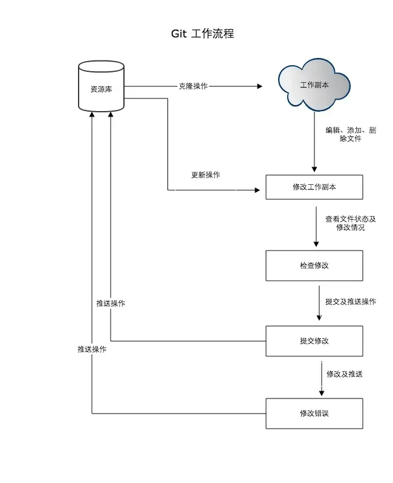
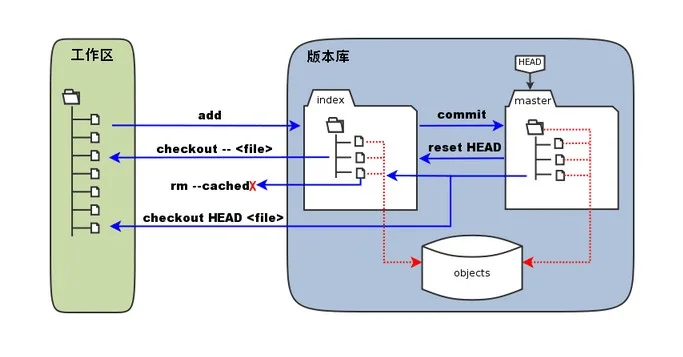

## Git、Github、Gitlab 的区别

Git是一个开源的分布式版本控制系统，用于敏捷高效地处理任何或小或大的项目。

是 Linus Torvalds 为了帮助管理 Linux 内核开发而开发的一个开放源码的版本控制软件。

Github是在线的基于Git的代码托管服务。 GitHub是2008年由Ruby on Rails编写而成。GitHub同时提供付费账户和免费账户。这两种账户都可以创建公开的代码仓库，只有付费账户可以创建私有的代码仓库。 Gitlab解决了这个问题, 可以在上面创建免费的私人repo。 

- git：是一套软件 可以做本地私有仓库

- github：本身是一个代码托管网站   公有和私有仓库(收费)   不能做本地私有仓库

- gitlab：本身也是一个代码托管的网站 功能上和github没有区别   公有和私有仓库（免费）  可以部署本地私有仓库

## Git 与 SVN 区别

GIT不仅仅是个版本控制系统，它也是个内容管理系统(CMS),工作管理系统等。

如果你是一个具有使用SVN背景的人，你需要做一定的思想转换，来适应GIT提供的一些概念和特征。

**Git 与 SVN 区别**

1. Git是分布式的，svn不是：这是GIT和其它非分布式的版本控制系统，例如SVN，CVS等，最核心的区别。
2. GIT把内容按元数据方式存储，而SVN是按文件：所有的资源控制系统都是把文件的元信息隐藏在一个类似.svn,.cvs等的文件夹里。
3. GIT分支和SVN的分支不同：分支在SVN中一点不特别，就是版本库中的另外的一个目录。
4. GIT没有一个全局的版本号，而SVN有：目前为止这是跟SVN相比GIT缺少的最大的一个特征。
5. GIT的内容完整性要优于SVN：GIT的内容存储使用的是SHA-1哈希算法。这能确保代码内容的完整性，确保在遇到磁盘故障和网络问题时降低对版本库的破坏。

git   是分布式的版本控制器  没有客户端和服务器端的概念。

svn 它是C/S结构的版本控制器  有客户端和服务器端  服务器如果宕机而且代码没有备份的情况下  完整代码就会丢失

## Git 工作流程

一般工作流程如下：

- 克隆 Git 资源作为工作目录。
- 在克隆的资源上添加或修改文件。 
- 如果其他人修改了，你可以更新资源。
- 在提交前查看修改。
- 提交修改。
- 在修改完成后，如果发现错误，可以撤回提交并再次修改并提交。

 　　Git 的工作流程示意图：

## Git 基本概念

- **工作区：**就是你在电脑里能看到的目录。
- **暂存区：**英文叫stage, 或index。一般存放在"git目录"下的index文件（.git/index）中，所以我们把暂存区有时也叫作索引（index）。
- **版本库：**工作区有一个隐藏目录.git，这个不算工作区，而是Git的版本库。

　　工作区、版本库中的暂存区和版本库之间的关系的示意图：

- 　　图中左侧为工作区，右侧为版本库。在版本库中标记为 "index" 的区域是暂存区（stage, index），标记为 "master" 的是 master 分支所代表的目录树。 

- 　　图中我们可以看出此时 "HEAD" 实际是指向 master 分支的一个"游标"。所以图示的命令中出现 HEAD 的地方可以用 master 来替换。 

- 　　图中的 objects 标识的区域为 Git 的对象库，实际位于 ".git/objects" 目录下，里面包含了创建的各种对象及内容。 

- 　　当对工作区修改（或新增）的文件执行 "git add" 命令时，暂存区的目录树被更新，同时工作区修改（或新增）的文件内容被写入到对象库中的一个新的对象中，而该对象的ID被记录在暂存区的文件索引中。 

- 　　当执行提交操作（git commit）时，暂存区的目录树写到版本库（对象库）中，master 分支会做相应的更新。即 master 指向的目录树就是提交时暂存区的目录树。 

- 　　当执行 "git reset HEAD" 命令时，暂存区的目录树会被重写，被 master 分支指向的目录树所替换，但是工作区不受影响。 

- 　　当执行 "git rm --cached \<file\>" 命令时，会直接从暂存区删除文件，工作区则不做出改变。 

- 　　当执行 "git checkout ." 或者 "git checkout -- \<file\>" 命令时，会用暂存区全部或指定的文件替换工作区的文件。这个操作很危险，会清除工作区中未添加到暂存区的改动。 

- 　　当执行 "git checkout HEAD ." 或者 "git checkout HEAD \<file\>" 命令时，会用 HEAD 指向的 master 分支中的全部或者部分文件替换暂存区和以及工作区中的文件。这个命令也是极具危险性的，因为不但会清除工作区中未提交的改动，也会清除暂存区中未提交的改动。
