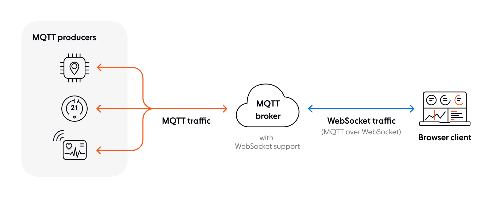

原文链接：[https://ably.com/topic/websocket-alternatives](https://ably.com/topic/websocket-alternatives)

## 什么是 WebSocket？

简而言之，WebSocket 是一种实时 Web 技术，可通过持久连接在客户端和服务器之间实现双向、全双工通信。 WebSocket 连接会根据需要保持活动状态（理论上，它可以永远持续），从而允许服务器和客户端以最小的开销随意发送数据。

了解更多：

- [什么是 WebSocket？](https://ably.com/topic/websockets)
- [WebSocket 是如何工作的？](https://ably.com/topic/how-do-websockets-work)

## 什么时候应该考虑使用 WebSocket 替代方案？

对于实时或近实时发送和使用数据至关重要（或至少是理想的）的用例，WebSocket 是一个绝佳的选择。示例包括[聊天应用程序](https://ably.com/solutions/chat)、[多人协作体验](https://ably.com/solutions/multiplayer-collaboration)以及[广播实时路况更新](https://ably.com/solutions/data-broadcast)。 

[了解有关 WebSocket 用例的更多信息](https://ably.com/topic/what-are-websockets-used-for)

然而，很少有一种放之四海而皆准的协议：不同的协议比其他协议更好地服务于不同的目的。例如，如果您的应用程序严重依赖 CRUD 操作，并且用户不需要快速对更改做出反应，那么 HTTP 是比 WebSockets 更好的选择。另一个例子 - 如果您想传输音频和视频数据，WebRTC 是比 WebSockets 更好的选择。  

我们要提到的最后一个例子：如果您只需要将文本（字符串）数据推送到浏览器客户端，并且您从不期望需要双向通信，那么您可以使用服务器发送事件（SSE）之类的东西。与 WebSocket 相比，SSE 的复杂性和要求较低，并且更易于扩展。 

[了解 WebSocket 的优点和缺点](https://ably.com/topic/websockets-pros-cons)

## WebSocket 协议的五种替代方案

现在，我们将研究 WebSocket 协议的五种替代方案 - 您可以使用这些技术来构建实时应用程序，这些技术有些类似。

### 服务器发送的事件

[服务器发送事件 (SSE)](https://ably.com/topic/server-sent-events)是一种 HTTP 服务器推送技术。这个想法很简单：浏览器客户端可以订阅服务器生成的事件流，并在新事件发生时接收更新。 

**服务器发送事件的优点**

- 内置对重新连接的支持。
- 所有现代浏览器都支持。
- 轻量级协议。

**服务器发送事件的缺点**

- 它是单向的；只有服务器可以将数据推送到客户端。
- 每个浏览器在同一时间只能有六个并发 SSE 连接。
- 仅支持UTF-8文本数据； SSE 无法处理二进制数据。

对于不需要双向消息传递的场景（例如实时比分更新），SSE 是一个不错的选择。对于需要双向通信的用例，WebSocket 是更好的选择。 

[查看 SSE 与 WebSocket 的比较](https://ably.com/blog/websockets-vs-sse)

### 长轮询

[长轮询](https://ably.com/topic/long-polling)是一种客户端拉取技术，它采用 HTTP 请求/响应轮询并使其更加高效。在长轮询中，服务器选择尽可能长时间地保持客户端连接打开，并在新数据可用或达到超时阈值时发送响应。

**长轮询的优点**

- [长轮询是在XMLHttpRequest](https://developer.mozilla.org/en-US/docs/Web/API/XMLHttpRequest)的基础上实现的，它几乎受到设备的普遍支持，因此通常不需要实现任何后备。
- 在必须处理异常的情况下，或者可以查询服务器以获取新数据但不支持长轮询（更不用说其他更现代的技术标准）时，基本轮询有时仍然具有有限的用途，并且可以使用XMLHttpRequest，或通过简单的 HTML 脚本标记通过 JSONP。

**长轮询的缺点**

- 与 WebSocket 相比，长轮询在服务器上消耗更多资源。
- 长轮询可能会带来延迟开销，因为它需要在服务器和设备之间进行多次跳跃。 
- 可靠的消息排序可能是一个问题。

长轮询是 WebSocket 的早期先驱。当谈到构建高性能、低延迟的实时应用程序时，WebSocket 几乎在各个方面都是一个优越的选择。这并不是说长轮询已经过时；而是说长轮询已经过时。在某些环境中，例如带有代理服务器的公司网络会阻止 WebSocket 连接。在这种情况下，长轮询作为 WebSocket 的后备机制非常有用。

[查看轮询与 WebSocket 相比需要多长时间](https://ably.com/blog/websockets-vs-long-polling)

### MQTT

[MQTT](https://ably.com/topic/mqtt)（消息队列遥测传输）是一种[发布-订阅](https://ably.com/topic/pub-sub)消息传递协议，其历史可以追溯到 1999 年，当时 IBM 的 Andy Stanley-Clark 和 Cirrus Link 的 Arlen Nipper[发布了第一个迭代](http://mqtt.org/2009/07/10th-birthday-party)。

在 MQTT 架构中，我们有：

- 发布者（生产者）和订阅者（消费者）。请注意，发布者也可以是订阅者。
- 充当中间件 MQTT 服务器的代理，管理发布者和订阅者之间的消息交换。

**MQTT 优势**

- 轻量级协议非常适合带宽有限或连接不可预测的网络以及 CPU、内存和电池寿命有限的设备。
- 可靠协议，具有三种不同级别的数据传递保证：0（最多传递一次）、1（至少传递一次）和2（恰好传递一次）。 
- 双向且灵活 - 它提供一对一、一对多和多对多通信。

**MQTT 缺点**

- 对于发送照片、视频或音频数据来说不是一个好的选择。
- 您无法将 MQTT 消息发送到浏览器，因为 Web 浏览器没有内置 MQTT 支持。
- 基本 MQTT 协议不使用加密通信。某些 MQTT 代理允许您使用 MQTT over TLS 来增强安全性，但这会导致 CPU 使用率增加，这对于受限设备来说可能是一个问题。

由于设计轻量，对于许多物联网用例（例如从温度或压力传感器实时收集数据）来说，MQTT 是比 WebSocket 更好的选择。但是，如前所述，MQTT 无法直接向浏览器发送消息。这就是为什么 WebSocket 通常被用作将 MQTT 数据流式传输到浏览器客户端的传输方式（基于 WebSocket 的 MQTT）。

[查看 MQTT 与 WebSocket 的比较](https://ably.com/topic/mqtt-vs-websocket)

### 网络RTC

[Web 实时通信 (WebRTC)](https://ably.com/blog/what-is-webrtc)是一个框架，可让您向 Web 和移动应用程序添加实时通信 (RTC) 功能。 WebRTC 允许*以点对点方式传输任意数据（视频、语音和通用数据）。* 

**WebRTC优势**

- [强大的安全保证，通过 WebRTC 传输的数据在安全实时传输协议 (SRTP)](https://datatracker.ietf.org/doc/html/rfc3711)的帮助下进行加密和验证。 
- 开源且免费使用。
- 平台和设备无关； WebRTC 应用程序可以在任何支持 WebRTC 的浏览器上运行，无论操作系统或设备类型如何。

**WebRTC 的缺点**

- 尽管 WebRTC 是一种点对点技术，您仍然需要管理 Web 服务器并为其付费。为了使两个对等点能够相互“交谈”，您需要使用信令服务器来建立、管理和终止 WebRTC 通信会话。
- 在处理视频内容和大量用户时，WebRTC 可能会占用大量 CPU 资源。 
- WebRTC 入门很难。有很多概念需要探索和掌握：各种接口、编解码器、网络地址转换 (NAT) 和防火墙、UDP（WebRTC 使用的主要底层通信协议）等等。

WebRTC 主要设计用于流式传输音频和视频内容（通过 UDP），在这种情况下通常是比 WebSocket 更好的选择。另一方面，当数据完整性（保证排序和交付）至关重要时，WebSocket 是更好的选择，因为您可以从 TCP 的底层可靠性中受益。 

通常，WebRTC 和 WebSocket 是互补技术。 WebRTC 对等点通过称为信令的过程来协调通信。需要注意的是，WebRTC 不提供标准的信令实现，允许开发人员为此目的使用不同的协议。*WebSocket 协议通常用作 WebRTC 应用程序的信令机制*。

[了解 WebRTC 与 WebSocket 的比较](https://ably.com/topic/webrtc-vs-websocket)

### 网络传输

[WebTransport](https://ably.com/blog/can-webtransport-replace-websockets)是一项新兴的实时技术，通过[HTTP/3](https://ably.com/topic/http3)提供客户端-服务器消息传递。 WebTransport 有两个关键概念： 

- **数据报**。数据报是一个独立的数据包，可以按任何特定顺序到达。专为需要低延迟且尽力而为的数据传输就足够好的用例而设计。 
- **溪流**。 Streams API 提供可靠、有序的数据传输。请注意，您可以创建单向和双向流。

**网络传输优势**

- 通过使用 Datagrams API 或通过多个 Streams API 实例，您不必担心队头阻塞。
- 建立新连接非常快——这是因为 HTTP/3 在底层使用了 QUIC；众所周知，QUIC 握手比通过 TLS 启动 TCP 更快。

**Web传输的缺点**

- WebTransport 仍然是一项新兴技术。截至 2022 年 11 月，[WebTransport 是 W3C 的草案规范](https://w3c.github.io/webtransport/)，与其工作方式相关的方面始终有可能发生变化。
- [并非所有浏览器都支持 WebTransport](https://caniuse.com/webtransport)。例如，您无法在 Firefox 和 Safari 中使用 WebTransport。 

与我们在本文中介绍的其他 WebSocket 替代方案（这些都是已经存在一段时间的成熟技术）不同，WebTransport 更像是 WebSocket 的未来潜在替代方案。我们不知道它在未来几年将如何发展，开发人员采用它的可能性有多大，或者它在生产就绪系统中使用时可能存在哪些陷阱。相比之下，WebSocket 已经存在十多年了；它是一种强大、稳定的技术，拥有庞大而活跃的社区，目前使其成为 WebTransport 的卓越替代品。

[了解有关 WebTransport 的更多信息](https://ably.com/blog/can-webtransport-replace-websockets)

## WebSocket 及其替代方案：头对头比较

下表显示了 WebSocket 与我们在本文中介绍的替代实时技术之间的主要区别和相似之处。

| **标准**         | **WebSockets**                 | **长轮询**                 | **上证所**                 | **MQTT**                                   | **网络RTC**                            | **网络传输**                            |
| :--------------- | :----------------------------- | :------------------------- | :------------------------- | :----------------------------------------- | :------------------------------------- | :-------------------------------------- |
| 底层协议         | 传输控制协议                   | 传输控制协议               | 传输控制协议               | 传输控制协议                               | UDP、TCP                               | WHO                                     |
| 双向？           | 是的                           | 不                         | 不                         | 是的                                       | 是的                                   | 是的                                    |
| 潜伏             | 低的                           | 高的                       | 低的                       | 低的                                       | 低的                                   | 低的                                    |
| 带宽             | 低的                           | 高的                       | 低的                       | 低的                                       | 高的                                   | 高的                                    |
| 浏览器支持       | 广泛支持                       | 广泛支持                   | 广泛支持                   | 浏览器没有内置的 MQTT 支持                 | Internet Explorer 和 Opera Mini 不支持 | 支持有限                                |
| 使用方便         | 缓和                           | 简单的                     | 简单的                     | 缓和                                       | 难的                                   | 简单的                                  |
| 到期             | 技术成熟                       | 技术成熟                   | 技术成熟                   | 技术成熟                                   | 技术成熟                               | 新兴科技                                |
| 数据的完整性     | 高的                           | 缓和                       | 高的                       | 高的                                       | 高的                                   | 高的                                    |
| 可扩展性         | 高的                           | 缓和                       | 高的                       | 高的                                       | 低的                                   | 高的                                    |
| 它是干什么用的？ | 服务器和客户端之间的实时通信。 | 客户端发起的实时更新通信。 | 单向数据流（服务器推送）。 | 用于 IoT 和 M2M 通信的轻量级消息传递协议。 | 用于实时音频和视频流的点对点通信。     | 用于低延迟 Web 通信的多路复用传输协议。 |

## 使用多种协议提供实时体验

我们希望您发现本文对您发现 WebSocket 的潜在替代方案有所帮助。然而，现实情况是，许多生产就绪的实时系统不仅仅使用一种协议，而是多种协议的混合。 

例如，如果您正在开发视频会议解决方案，WebRTC 是在对等点之间发送音频和视频数据的绝佳选择。在这种情况下，WebSocket 补充了 WebRTC，并经常用作WebRTC 对等方的[信令机制](https://ably.com/blog/solving-the-webrtc-signalling-challenge)。 

另一个例子：由于其轻量级设计，MQTT 是从物联网传感器收集遥测数据的绝佳选择。但是，如果您想使用这些数据来支持可以在浏览器中监控的实时仪表板，则 MQTT 不适合，因为浏览器不支持它。您可以做的就是通过 WebSocket 将数据发送到浏览器。这就是为什么现在许多 MQTT 代理也支持 WebSocket（或基于 WebSocket 的 MQTT）。

如果您确实决定使用 WebSocket 作为您的用例的主要传输协议，您仍然需要考虑支持后备传输，因为某些环境会阻止 WebSocket 连接（例如，限制性的公司网络）。 SSE 和长轮询通常用作 WebSocket 的后备方案。

## Ably，在任何规模下都能可靠运行的多协议实时平台

Ably 是一家实时体验基础设施提供商。我们的 API 和 SDK 可帮助开发人员构建和提供实时体验，而无需担心维护和扩展混乱的实时基础设施。 

Ably 的主要特性和功能：

- 具有丰富功能的发布/订阅消息传递，例如消息增量压缩、连续性自动重新连接、用户状态、消息历史记录和消息交互。
- 多协议功能。 Ably 协议基于 WebSocket，但我们还支持长轮询作为后备、SSE、MQTT、AMQP、STOMP 和 HTTP/REST。
- 全球分布式数据中心网络和边缘加速接入点。 
- 保证消息排序和传递。 
- 全球容错和 99.999% 的正常运行时间 SLA。
- < 65 毫秒往返延迟 (P99)。
- 动态弹性，因此我们可以快速扩展以处理任何需求（发送到数百万个发布/订阅通道和客户端连接的数十亿条消息）。
