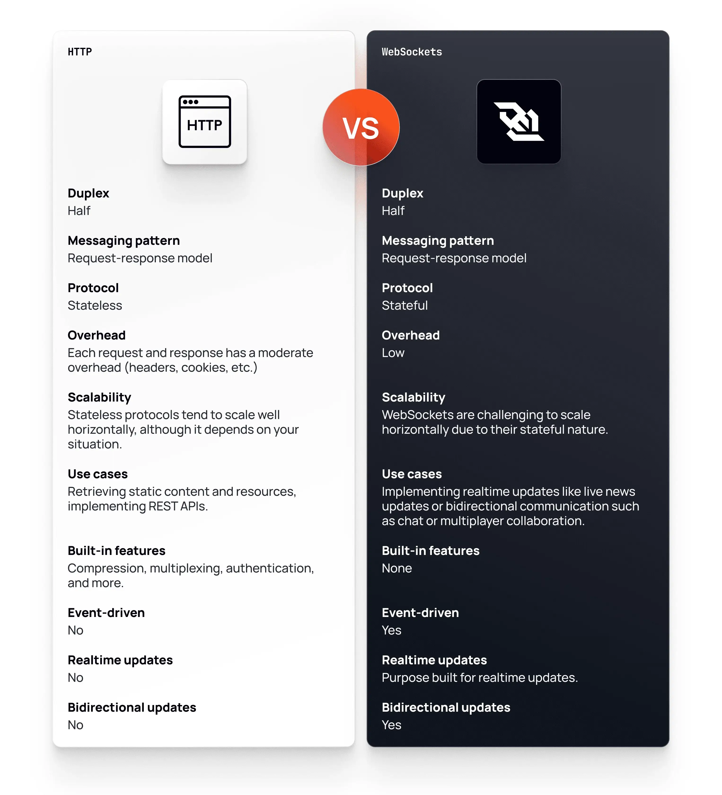
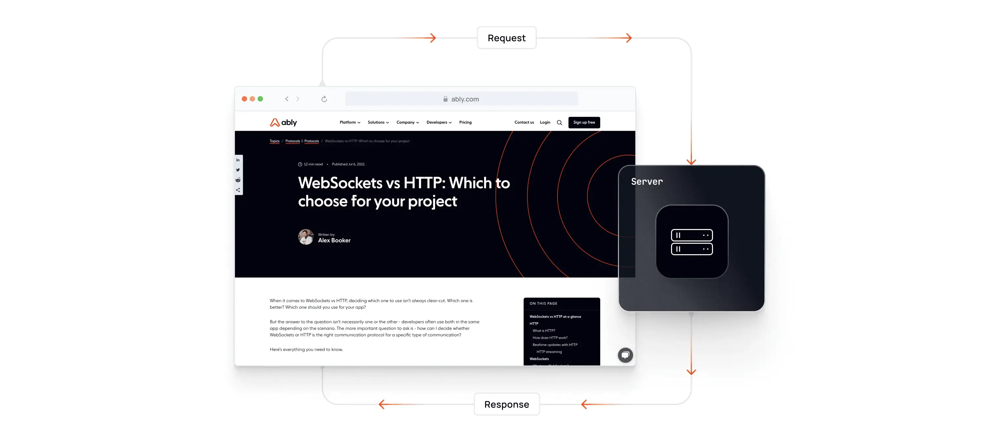

原文链接：[https://ably.com/topic/websockets-vs-http](https://ably.com/topic/websockets-vs-http)


当谈到 WebSocket 与 HTTP 时，决定使用哪一种并不总是那么明确。哪一个更好？您的应用程序应该使用哪一款？

但问题的答案不一定是其中之一 - 开发人员经常根据场景在同一个应用程序中同时使用 WebSocket 和 HTTP。更重要的问题是 - 我如何确定 WebSockets 还是 HTTP 是特定类型通信的正确通信协议？

这是您需要了解的一切。


## WebSocket 与 HTTP 概览

在此页面上，我们将探讨这些技术的工作原理、它们在实现实时通信方面的表现如何，并就在哪些场景中使用哪些技术提供具体指导。

如果您正在寻找高级比较，以下是主要差异一目了然：



请继续阅读以详细了解这两种流行协议的比较。


## HTTP协议

### 什么是 HTTP？

从根本上讲，HTTP 是一种通信协议，使客户端（例如 Web 浏览器）和服务器能够共享信息。 

例如，HTML 文档、图像、应用程序数据 (JSON) 等。 

很难想出比您**现在**正在阅读的此页面更好的 HTTP 实际示例。

当您加载此页面时，您的浏览器会发出 HTTP 请求，服务器会使用您当前正在阅读的 HTML 文档来响应该请求。 




### HTTP 是如何工作的？

HTTP 遵循请求-响应消息传递模式，其中客户端发出请求，Web 服务器发送响应，该响应不仅包括请求的内容，还包括有关请求的相关信息。 

在底层，每个请求都会打开一个与服务器的短暂连接，然后关闭。


**HTTP 示例**

- 网页浏览。
- 下载图像、视频或二进制文件，例如桌面应用程序。
- 使用 JavaScript 中的 fetch 函数向 API 发出异步请求。

由于每个 HTTP 请求都包含处理它所需的所有信息，因此服务器无需跟踪连接和请求。 

这种无状态设计是有利的，因为它使得可以部署额外的服务器来处理请求，而不需要在服务器之间同步状态逻辑。

此外，由于每个请求都是独立的，因此通过代理路由消息以执行缓存、加密和压缩等增值功能变得非常简单。 

这种无状态方法的缺点是客户端打开一个临时连接并为每个请求发送元数据，从而产生少量开销。 

当加载网页或下载文件时，这种开销可以忽略不计。但是，如果您发送负载较小的高频请求，它可能会对应用程序的性能产生显着影响。 


### 通过 HTTP 进行实时更新

这种模式（客户端发出请求，服务器发出响应）非常适合网页、文件或应用程序数据等静态资源。

但是，请考虑这样一种情况：客户不知道新信息何时可用。 

例如，假设您正在为 BBC 实施突发新闻功能。 

在这种情况下，客户不知道故事的下一次更新何时会发生。

现在，您*可以*对客户端进行编码，以频繁地发出 HTTP 请求，以防万一发生某些情况，并且对于少数客户端来说，这可能工作得足够好。

但是假设您有成百上千个客户端（在 BBC 的情况下有数十万个）向服务器发送请求，而这些请求在更新之间没有产生任何新内容。 

这不仅浪费带宽和服务器资源，而且在最近的请求完成后不久更新就会中断 - 可能需要几秒钟才能发送下一个请求并且用户获得更新。一般来说，这种方法称为[HTTP 轮询](https://ably.com/topic/long-polling)，它既不高效也不实时！ 


相反，如果服务器能够在新信息可用时将数据推送到客户端，那就更好了，但这从根本上违背了请求-响应模式的原则。 

或者确实如此？


#### HTTP 流式传输

尽管 HTTP 从根本上遵循请求-响应模式，但有一种解决方法可用于实现实时更新。 

服务器不是发出完整的响应，而是发出部分 HTTP 响应并保持底层连接打开。

基于上一节的突发新闻示例，通过 HTTP 流，服务器可以在每次新闻更新中断时将部分响应（如果您愿意，可以是块）附加到响应流 - 连接无限期保持打开状态，使服务器能够推送当新信息可用时，以最短的延迟向客户端提供新信息。

如果您有兴趣了解有关此模式在实践中如何工作的更多信息，我们已经在 Ably 网站上的其他地方撰写了有关[HTTP 流](https://ably.com/blog/websockets-vs-http-streaming-vs-sse)和[服务器发送事件（HTTP 流的标准实现）的文章。](https://ably.com/topic/server-sent-events)

使用 HTTP 流，服务器必须维护大量长期连接的状态，并且不能再被视为无状态。这给扩展 HTTP 流带来了新的挑战，并且还带来了单点故障。 


**HTTP 流式传输的缺点**

HTTP流是实现[实时更新的](https://ably.com/blog/building-realtime-updates-into-your-application)可行方法，但是，我们不能将其视为全面的实时解决方案。

与 WebSocket 等其他实时解决方案相比，HTTP 流的主要缺点是 HTTP 是半双工协议。这意味着，就像对讲机一样，信息一次只能通过连接向一个方向流动。 

对于突发新闻或实时图表等实时更新（更新主要从服务器到客户端的单向流动），HTTP 是半双工这一事实不太可能立即带来限制（尽管您可能希望通过以下方式来保证消息传递层的未来安全）从本质上全双工的东西开始）。

然而，对于信息需要通过同一连接同时在两个方向流动的情况，如多人游戏、[聊天](https://ably.com/blog/live-chat-features)或Figma 等[协作应用程序](https://ably.com/blog/the-rise-of-realtime-collaboration)，即使流媒体出现，HTTP 也显然不合适。

对于此类情况，我们需要考虑 WebSocket，这是一种用于实时更新和双向通信的一体化解决方案。 


## WebSockets


### 什么是 WebSocket？

与 HTTP 一样，[WebSocket](https://ably.com/topic/websockets)是一种通信协议，使客户端（通常是 Web 浏览器，因此得名）和服务器能够相互通信

与具有请求-响应模型的 HTTP 不同，WebSocket 专门设计用于实现服务器和客户端之间的实时双向通信。 

这意味着服务器可以在实时更新（例如突发新闻）可用时立即推送它们，而无需等待客户端发出请求。

更重要的是，WebSockets 是一种全双工协议。 

简单来说，这意味着数据可以通过同一连接同时在两个方向上流动，这使得 WebSocket 成为客户端和服务器同样“频繁”且需要高吞吐量的应用程序的首选。我们谈论的是聊天、协作编辑等等。 


### WebSocket 是如何工作的？

尽管我们正在比较两者，但值得注意的是 HTTP 和 WebSocket 并不相互排斥。 

一般来说，您的应用程序默认使用 HTTP，然后使用 WebSocket 进行实时通信代码。 

有趣的是，WebSocket 内部工作的方式是将HTTP 连接 *升级为 WebSocket 连接。*

当您建立 WebSocket 连接时，WebSocket 会向 WebSocket 服务器发出 HTTP 请求，询问：“嘿！你们支持 WebSocket 吗？” 

如果服务器响应“是”，则 HTTP 连接将升级为 WebSocket 连接 - 这称为打开握手。 


Websocket 连接/断开的顺序

这不是您通常需要考虑的事情，因为大多数 WebSocket API 都会为您处理这个问题。尽管如此，它还是说明了 HTTP 和 WebSocket 之间的关系。

一旦建立连接，客户端和服务器都可以以最小的延迟实时传输和接收数据，直到任何一方决定关闭连接。


### 使用 WebSocket 进行实时更新

HTTP 通常由 Web 浏览器无缝处理（例如，当您加载此页面时），而 WebSocket 始终要求您编写自定义代码。

为了将这个想法变为现实，下面是一个使用 JavaScript 和内置[WebSocket Web API](https://developer.mozilla.org/en-US/docs/Web/API/WebSocket)运行 WebSocket 的示例：

```Javascript
/ Create WebSocket connection.
const socket = new WebSocket("ws://localhost:8080");

/ Connection opened
socket.addEventListener("open", (event) => {
  socket.send("Hello Server!");
});

/ Listen for messages
socket.addEventListener("message", (event) => {
  console.log("Message from server ", event.data);
});
```

上面，我们使用 WebSocket 服务器的 URL 启动[WebSocket构造函数（本文中未显示）。](https://developer.mozilla.org/en-US/docs/Web/API/WebSocket)

请注意 URL 的前缀`ws://`是“WebSocket”而不是`http://`“HTTP”。同样，当使用加密时，您将使用`wss://`而不是。`https://`

就协议而言，WebSocket 并不是低级协议，但它们很灵活。

在您需要对 WebSockets 代码进行绝对细粒度控制的特殊情况下，所提供的灵活性可能非常有利。然而，对于许多开发人员来说，WebSocket 的准系统实际上是一种负担，因为它会带来大量额外的工作。

- WebSocket 不知道如何检测断开连接或如何从断开连接中恢复。您需要自己实现称为[心跳的](https://ably.com/topic/websockets-javascript#device-power-management-and-heartbeats)东西。
- 因为 WebSockets 是一个完全独立于 HTTP 的协议，所以您无法从 HTTP 从 HTTP 代理获得的增值内容（例如压缩）中受益。 
- 与相当标准化的 HTTP 相比，您需要决定自己的身份验证和错误代码实现方式。 

在许多方面，当您构建一个全面的 WebSocket 消息传递层时，您最终会重新发明轮子，并且这需要时间 - 您可能更愿意花时间来构建应用程序独有的东西。

尽管上面的代码示例中使用的 WebSocket Web API 为我们提供了一种方便的方法来说明 WebSocket 的工作原理，但通常开发人员会避开它，而转而使用实现身份验证、错误处理、压缩等所有功能的开源库，以便你，以及像 pub/sub 或“rooms”这样的模式，为你提供一种简单的方式来路由消息。

这些 WebSocket 库往往专注于前端。在后端，您仍在使用有状态协议，这使得跨服务器分散工作以将应用程序与可能导致拥塞（高延迟）甚至中断的故障隔离开来变得很棘手。 

虽然开源库提供了全面的前端解决方案，但如果您想确保实时代码稳健可靠且延迟较低，通常需要在服务器上完成更多工作。

开发人员越来越依赖[Ably](http://ably.com/)等实时体验平台来解决所有烦人的数据和基础设施问题，以便您可以专注于为用户构建出色的实时体验。 


## 比较 HTTP 与 WebSocket

考虑 HTTP 和 WebSocket 之间差异的一个有用方法是邮件与电话。

- **HTTP**当 Tim Bernes-Lee 于 1989 年发明万维网和 HTTP 时，主要想法是通过网络在计算机之间交换文档。从这个意义上说，HTTP 很像邮件——客户端（通常是 Web 浏览器）从服务器请求 HTML 文档，后端将其路由到客户端的地址。如果客户端想要更多信息，它会发出另一个请求，服务器会发送其他内容。
- **WebSockets**想象一下像聊天、协作编辑器或多人游戏这样的网络应用程序，其中信息确实需要在两个方向上同时流动。借用前面的类比，邮件是可靠的，但它速度慢且单向。当您需要信息双向流动时，电话将是更好的选择，这就是 WebSocket 的作用 - 在服务器和客户端之间打开连续的双向对话，以便信息可以在任一方向以高吞吐量实时流动方向。


## 选择哪个：WebSockets 还是 HTTP？


### 当 HTTP 更好时 

- **请求资源：**当客户端需要资源的当前状态并且不需要实时更新时，HTTP 将是一个不错的选择。 
- **请求可缓存资源：**经常访问但不经常更改的资源可以从 HTTP 缓存中受益。 WebSocket 不支持缓存。
- **实现 REST API：** POST、GET 和 UPDATE 等 HTTP 方法与 REST 原则完美契合。 
- **同步事件：**请求-响应模式非常适合需要同步或需要按特定顺序执行的操作。这是因为 HTTP 请求总是伴随着一个响应，告诉您操作的结果（无论是“200 OK”还是不是）。相比之下，WebSocket 不保证消息将以任何形式立即得到确认。
- **最大限度地提高兼容性：** HTTP 无处不在且得到广泛支持。在越来越罕见的情况下，过时的企业防火墙配置错误可能会干扰 WebSocket 升级握手，从而阻止建立连接。在这种情况下，需要回退到 HTTP 流或[长轮询。](https://ably.com/topic/long-polling)


### 当 WebSocket 更好时

- **实时更新：**当有新信息可用时需要通知客户端时，WebSockets 通常是一个不错的选择。 
- **双向通信：** WebSocket 提供低延迟双向通信，允许客户端和服务器之间进行即时数据传输。与 HTTP（每次服务器响应都需要一个新请求）不同，WebSocket 保持持久连接，使其成为聊天、游戏和实时更新等实时应用程序的理想选择。
- **低延迟更新：**与 HTTP 相比，WebSocket 的开销更少，因为它们不需要每个请求响应周期的标头和握手。这种效率可以降低数据传输成本并提高实时情况的性能。


## WebSocket 与 HTTP 常见问题解答


### WebSockets 是 HTTP 的替代品吗？

不，WebSocket 不会取代 HTTP。虽然这两种通信协议都用于 Web 开发，但它们各自有不同的用途。 HTTP遵循请求-响应模型，主要用于检索网页等静态资源或发出无状态API请求。另一方面，WebSocket 支持客户端和服务器之间的实时双向通信 - 它们非常适合实时更新或需要连续数据交换的应用程序。


### 人们还在使用 WebSockets 吗？

WebSocket 仍然被广泛使用，并且仍然是在 Web 开发中实现实时体验的流行选择。 Slack 和 Uber 等流行应用程序利用 WebSocket 来实现实时数据交换。

虽然 Web Transport 等新技术和协议不断出现，但 WebSocket 已被证明对于实时场景来说是可靠且有效的，开发人员经常选择它们，因为它们简单且广泛的浏览器支持。


### HTTP/2 与 WebSockets？

HTTP/2 引入了多项功能，例如多路复用、标头压缩和每个域的无限连接。这样，当您需要实时更新时，HTTP/2 使 HTTP 流和 SSE（HTTP 流的标准化实现）成为 WebSocket 的可行替代方案。话虽如此，WebSockets 是目前在浏览器中实现全双工双向通信的唯一方法。


### WebSocket 比 HTTP 更好吗？

WebSocket 本质上并不比 HTTP 更好 - 相反，它们服务于不同的目的。 HTTP 是一种请求-响应协议，最适合客户端偶尔向服务器发出数据和资源请求的传统 Web 应用程序。另一方面，WebSocket 在实时、双向通信方面表现出色，使其成为需要持续数据流和即时更新的应用程序的理想选择，例如实时聊天、在线游戏和协作工具。 


### 为什么不使用 WebSockets 来完成所有事情呢？

HTTP 是 Web 浏览器用来请求数据和资源的标准协议。例如，当涉及到获取网页时，WebSockets 就不合适了。 

理论上，您可以使用 WebSocket 进行 API 通信（例如，而不是 HTTP REST API）。实际上，没有任何令人信服的理由这样做，并且 HTTP 的无状态性质更适合这些类型的短期请求。一般来说，您应该假设您的 API 默认是传统的 HTTP，然后升级到 WebSockets 以获得实时功能。
