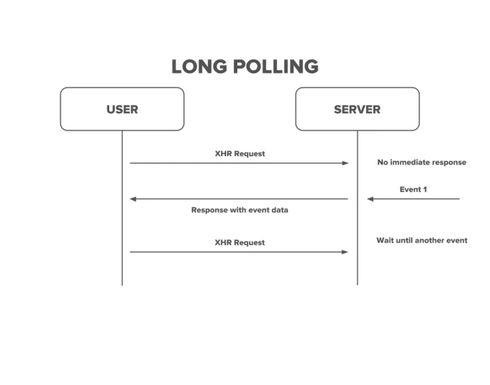
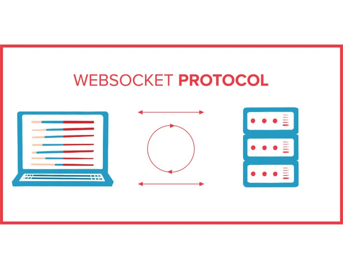

原文链接：[https:/www.pubnub.com/guides/websockets/](https:/www.pubnub.com/guides/websockets/)

## 什么是 WebSocket？

[WebSocket 是一种通过单个TCP](https:/www.pubnub.com/guides/tcp-ip/)连接提供全双工通信通道的通信协议。它支持客户端和服务器之间的实时、事件驱动的连接。

与遵循请求-响应模型的传统 HTTP 软件不同，WebSocket 允许双向（双向）通信。这意味着客户端和服务器可以随时向对方发送数据，而无需持续轮询。

## WebSocket 有何用途？

WebSocket 用于客户端和服务器之间的实时、事件驱动的通信。它们对于构建需要即时更新的软件应用程序特别有用，例如实时聊天、消息传递和多人游戏。

在传统的 HTTP 中，客户端向服务器发送请求，服务器用请求的数据进行响应。这种请求-响应模型需要从客户端到服务器进行连续轮询，这可能会导致延迟增加和效率降低。

另一方面，WebSockets 在客户端和服务器之间建立持久连接。这意味着一旦建立连接，客户端和服务器就可以随时向对方发送数据，而无需不断轮询请求。这允许实时通信，可以立即发送和接收更新。

例如，当用户在聊天应用程序中发送消息时，该消息可以立即传递给所有其他用户，而无需刷新页面或发出频繁的 HTTP 请求。这将带来更加无缝和高效的用户体验。

此外，Web Sockets 还允许双向通信，这意味着客户端和服务器都可以相互发送数据。这为更具交互性和吸引力的应用程序提供了可能性，其中服务器可以处理向客户端推送更新或通知，而无需客户端明确请求它们。

## Web 套接字的缺点

WebSocket 的缺点包括：

- 浏览器支持：虽然大多数现代浏览器支持 WebSocket，但一些旧浏览器不支持。这可能会限制应用程序的范围，并且需要针对旧版浏览器的额外后备机制。
- 代理和防火墙限制：某些代理服务器和防火墙可能会阻止或干扰 WebSocket 连接。这可能会导致连接问题，尤其是在安全的公司或受限的网络环境中。
- 可扩展性：Web Sockets 在客户端和服务器之间维护持久连接，这在处理许多并发连接时可能会导致服务器资源紧张。必须实施适当的[负载平衡](https:/www.pubnub.com/guides/load-balancing/)和资源管理技术以确保可扩展性。像 Socket.io 这样的开源资源不适合大规模运营或快速增长。
- 有状态性：与无状态的传统 HTTP 不同，WebSocket 是有状态的。这意味着服务器需要维护每个客户端的连接状态，从而导致内存使用量增加和潜在的可扩展性挑战。
- 安全注意事项：通过 WebSocket 建立持久连接，需要采取适当的安全措施来防止潜在的漏洞，例如跨站点脚本 (XSS) 和[跨站点请求伪造](https:/owasp.org/www-community/attacks/csrf)(CSRF)。应实施使用[SSL/TLS](https:/www.pubnub.com/guides/ssl-tls/)加密的安全 WebSocket 连接 (wss:/)，以确保数据隐私和完整性。
- 如果通过 Web 套接字的连接丢失，则不包含负载平衡或重新连接机制。
- 在可能不支持 Web Sockets 的环境中，仍然需要有后备选项，例如[HTTP 流或长轮询。](https:/www.pubnub.com/guides/what-is-http-streaming/)
- [像Presence](https:/www.pubnub.com/docs/sdks/redux/api-reference/presence)这样的功能在 WebSocket 连接上不能很好地工作，因为断开连接很难检测到。

## WebSockets、HTTP、Web 服务器、轮询

### HTTP 连接与 WebSockets

要了解[WebSocket API](https:/www.pubnub.com/blog/websocket-api-an-introduction/)，了解其构建基础 — HTTP（超文本传输协议）及其请求/响应模型也很重要。 HTTP 是一种应用层协议，是所有基于 Web 的通信和数据传输的基础。

使用 HTTP 时，客户端（例如 Web 浏览器）向服务器发送请求，然后服务器发回消息（称为响应）。我们今天所知道的网络是建立在这种基本的客户端-服务器循环之上的，尽管对 HTTP 进行了许多添加和更新以使其更具交互性。当前有一些可行且受支持的 HTTP 版本（HTTP/1.1 和 HTTP/2）以及称为 HTTPS 的安全版本。

基本 HTTP 请求适用于许多用例，例如当有人需要在网页上搜索并接收相关的、非时间敏感的信息时。然而，它并不总是最适合需要实时通信或需要以最小延迟快速更新的数据的 Web 应用程序。 

每当客户端发出新的 HTTP 服务器请求时，默认行为是打开新的 HTTP 连接。这是低效的，因为它使用循环非有效负载数据的带宽并增加了数据传输之间的延迟。

 此外，HTTP 请求只能从客户端向一个方向流动。传统上没有服务器发起与客户端通信的机制。除非服务器首先请求数据，否则服务器无法向客户端发送数据。这可能会给需要从服务器端实时发出消息的用例带来问题。 

### 短轮询与 WebSockets

HTTP 轮询是接收定期数据更新的第一个解决方案。轮询是一种客户端重复向服务器发送请求直到服务器更新的技术。例如，所有现代 Web 浏览器都提供对 XMLHttpRequest 的支持，这是轮询服务器的原始方法之一。

这些早期的解决方案对于高效的实时通信来说仍然不是理想的——短轮询是密集的，因为对于每个请求，非有效负载数据都被重新发送并且必须被解析，包括标头 HTML、Web URL 和其他重复的数据。浪费资源的信息。

### 长轮询与 Web 套接字

改善延迟的下一个逻辑步骤是[HTTP 长轮询](https:/www.pubnub.com/blog/http-long-polling/)。当长轮询时，客户端轮询服务器，并且该连接保持打开状态，直到服务器有新数据。服务器发送带有相关信息的响应，然后客户端立即打开另一个请求，再次保留直到下一次更新。长轮询可以使连接保持打开状态最多 280 秒，然后自动发送另一个请求。此方法有效地模拟 HTTP 服务器推送。

[长轮询在许多环境中提供快速通信，并且被广泛使用，通常与 WebSocket 连接或服务器端事件 (SSE)](https:/www.pubnub.com/guides/server-sent-events/)等真正的基于推送的方法相反。长轮询在服务器端看起来可能很密集，因为它需要连续的资源来保持连接打开，但它使用的资源比重复发送轮询请求要少得多。

[阅读更多内容：长轮询与 Websockets](https:/www.pubnub.com/blog/long-polling-vs-websockets/)

## WebSocket 有何用途？

开发人员发明了 WebSocket 来有效地促进实时结果。 WebSocket 在客户端和 WebSocket 服务器之间启动连续的全双工通信。这减少了不必要的网络流量，因为数据可以通过单个开放连接立即双向传输。这提供了网络上的速度和实时功能。 Websockets 还使服务器能够跟踪客户端并根据需要向它们“推送”数据，而仅使用 HTTP 是不可能实现这一点的。

WebSocket 连接支持通过消息传输文本字符串和二进制数据。 WebSocket 消息包括帧、有效负载和数据部分。通过这种方式通过现有网络连接发送的非有效负载数据非常少，这有助于减少延迟和开销，特别是与 HTTP 请求和流模型相比。

Google Chrome 于 2009 年成为第一个包含 WebSocket 标准支持的浏览器。RFC [6455](https:/datatracker.ietf.org/doc/html/rfc6455)（WebSocket 协议）于 2011 年正式在线发布。WebSocket[协议](https:/tools.ietf.org/html/rfc6455)和[WebSocket API](https:/html.spec.whatwg.org/multipage/web-sockets.html)由 W3C 和 IETF 标准化，跨浏览器的支持非常广泛。常见的。

### WebSockets 如何工作（及其连接）

在客户端和服务器交换数据之前，必须使用 TCP（传输控制协议）层建立连接。使用 WebSocket 协议，webSocket 可以有效地作为 TCP 连接上的传输层运行。

通过 HTTP 请求/响应对连接后，客户端可以使用 HTTP/1.1 升级标头将其连接从 HTTP 切换到 WebSockets。然而，与 HTTP/1.1 不同，WebSocket 连接是完全异步的。 WebSocket 连接是通过 TCP 上的 WebSocket 握手建立的。在新的 WebSocket 握手期间，客户端和服务器还会传达后续交互将使用哪个子协议。建立后，连接将在 WebSocket 协议上运行。

需要注意的是，当在 WebSocket 协议层上运行时，WebSocket 需要统一资源标识符 (URI) 才能使用“ws:”或“wss:”方案，类似于 HTTP URL 始终使用“http:”的方式或“https:”方案。

## 有哪些库可用于实现 WebSocket？

在实时聊天和消息传递应用程序中实现 WebSocket 时，多个库可以提供必要的工具和功能。这些库提供了广泛的功能并支持不同的编程语言，使开发人员可以更轻松地将 WebSocket 集成到他们的应用程序中。以下是您可以考虑的一些流行库：

1. Socket.IO 是一个广泛使用的库，它提供浏览器和服务器之间基于事件的实时双向通信。它提供自动重新连接、后备选项以及对各种传输的支持等功能，使其成为构建可扩展且可靠的应用程序的绝佳选择。 Socket.IO 支持多种编程语言，包括[JavaScript](https:/www.pubnub.com/guides/javascript/)、Python 和 Java。
2. [SignalR](https:/www.pubnub.com/guides/what-is-signalr/)是微软开发的实时通信库。它允许您通过提供用于创建 WebSocket 连接的简单 API 来构建实时 Web 应用程序。 SignalR 支持服务器端和客户端实现，并且可以与 .NET、JavaScript 和其他语言一起使用。它还提供自动连接管理、广播消息以及跨多个服务器的扩展。
3. SockJS是一个JavaScript库，即使服务器不支持WebSockets，它也可以在浏览器中提供类似WebSocket的对象。它提供了一种使用替代传输协议（例如 HTTP 长轮询）的回退机制，允许您的应用程序在 Websocket 不可用的环境中工作。 SockJS 可以与各种后端和编程语言一起使用，包括[Node.js](https:/www.pubnub.com/blog/nodejs-websocket-programming-examples/)、 Java 和[Python](https:/www.pubnub.com/blog/socket-programming-in-python-client-server-p2p/)。
4. WS 是 Node.js 的一个简单且轻量级的 WebSocket 实现。它提供了一个简单的 API 用于创建 WebSocket 服务器和客户端，从而可以轻松地将 websocket 集成到 Node.js 应用程序中。 ws 提供每消息压缩、自动重新连接以及用于处理传入和传出消息的可自定义选项。
5. Django Channels：[Django Channels](https:/channels.readthedocs.io/en/latest/)是一个扩展 Django Web 框架处理实时应用程序功能的库。它支持 websockets 和其他协议，如 HTTP 长轮询和服务器发送事件。 Django Channels 允许您使用熟悉的 Django 语法和工具构建实时聊天和消息传递应用程序。

## 考虑使用 WebSocket 进行实时通信的原因

- Websockets 提供实时更新和开放的通信线路。
- Websocket 符合 HTML5 标准，并提供与旧版 HTML 文档的向后兼容性。因此，所有现代网络浏览器（Google Chrome、Mozilla Firefox、Apple Safari 等）都支持它们。 
- WebSockets 兼容[Android](https:/www.pubnub.com/docs/sdks/android)、iOS、Web 和桌面平台。
- 单个服务器可以同时打开多个 WebSocket 连接，并且可以与同一客户端建立多个连接，这为可扩展性打开了大门。
- WebSocket 可以通过许多代理和防火墙进行流式传输。
- 有许多开源资源和教程可用于将 WebSocket 合并到应用程序中，例如 Javascript 库 Socket.io。 

## PubNub 对 WebSockets 与长轮询的看法

PubNub 采取与协议无关的立场，但在我们当前的操作中，我们发现长轮询是大多数用例的最佳选择。部分原因是在后端扩展 WebSocket 所需的维护和保养，以及当您无法轻松识别断开连接时可能出现的潜在问题。 WebSocket 是一个很棒的工具，但长轮询在任何情况下都能可靠地工作。

PubNub 使用长轮询来确保所有网络环境（而不仅仅是大多数）的可靠性、安全性和可扩展性。在许多现实世界的实时实现中，长轮询可以与 WebSocket 一样高效。我们开发了一种高效长轮询的方法——用 C 语言编写，并针对规模进行了多个内核优化。

PubNub 是一个实时通信平台，为真实的虚拟体验提供基础，例如实时更新、应用内聊天、推送通知等。我们平台的构建块结构允许合并额外的功能，例如状态、操作仪表板或[地理定位](https:/www.pubnub.com/solutions/geolocation/)。 PubNub 还使其非常容易扩展，特别是与 Socket.io 或 SocksJS 等套接字框架相比。

## 概括

总而言之，WebSocket 是一种非常有用的协议，可用于跨 Web、移动和桌面变体构建实时功能，但它们并不是一种万能的方法。 WebSocket 只是一种软件工具，在开发需要低延迟的实时、基于通信的应用程序时，它可以融入到更大的库中。可以基于基本的 WebSocket 协议构建，结合 SSE 或长轮询等其他方法，并构建更好、更具可扩展性的实时应用程序。问题是，当您使用 WebSockets 时，如果您不是构建实时系统的专家，这些缺点可能很难管理。
