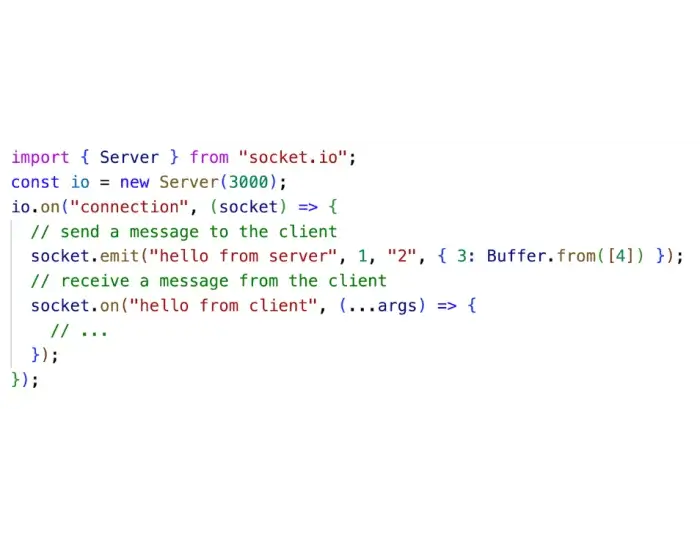
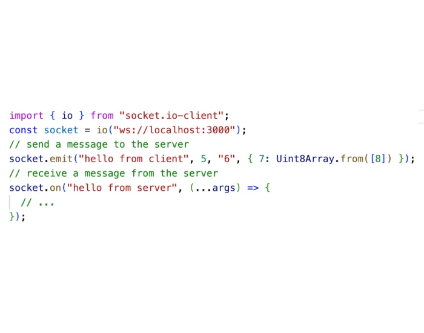

原文链接：[https://www.pubnub.com/guides/socket-io/](https://www.pubnub.com/guides/socket-io/)

# 什么是Socket.IO？

[Socket.IO](https://socket.io/)是一个开源的跨平台库，它提供客户端和服务器之间基于事件的[全双工双向通信](https://www.geeksforgeeks.org/transmission-modes-computer-networks/)。它基于 WebSocket 协议构建，提供附加功能，例如自动重新连接以及在无法使用 [WebSocket时回退到](https://www.pubnub.com/guides/what-are-websockets-and-when-should-you-use-them/)[HTTP 长轮询。](https://www.pubnub.com/blog/http-long-polling/)

Socket.IO 客户端由客户端和服务器端库组成。虽然最初在服务器上支持[NodeJS ，在客户端支持](https://www.pubnub.com/blog/nodejs-websocket-programming-examples/)[JavaScript](https://www.pubnub.com/guides/javascript/)，但现在它支持各种服务器和客户端技术，包括[Java](https://www.pubnub.com/docs/sdks/java)、[Python](https://www.pubnub.com/docs/sdks/python)、[Swift](https://www.pubnub.com/docs/sdks/swift)和[Kotlin](https://www.pubnub.com/docs/sdks/kotlin)，它们都是官方代码库的一部分，由活跃社区贡献。

### Socket.io 有何用途？

Socket.IO 允许您实现依赖于消息交换的各种应用程序，例如[即时消息传递](https://www.pubnub.com/solutions/chat/)、[多用户协作](https://www.pubnub.com/solutions/multiuser-collaboration/)、[实时分析](https://www.pubnub.com/solutions/data-streaming/)、文件共享和[通知](https://www.pubnub.com/products/mobile-push-notifications/)。

### Socket.io 适合实时应用程序吗？

是的，Socket.IO 是构建实时 Web 应用程序的不错选择，因为它提供了许多对开发人员有用的开箱即用功能，包括：

- [房间和命名空间支持](https://dev.to/wpreble1/socket-io-namespaces-and-rooms-d5h)允许您将客户端分组到可以接收广播或多播消息的房间中。
- 自动重连意味着您无需担心客户端上线或离线。
- 二进制数据支持，使您不仅可以交换聊天消息，还可以交换图像或其他媒体。

### Socket.io 是 API 吗？

Socket.IO不是传统意义上的API。它是一个库或框架，抽象了底层传输机制，并提供了一组用于在客户端和服务器之间构建实时双向通信的工具和实用程序。 

Socket.IO 包含[客户端和服务器组件](https://socket.io/docs/v4/)，每个组件都公开其 API。

### Socket.io是TCP还是UDP，有什么区别？

Socket.IO可以使用[TCP](https://www.pubnub.com/guides/tcp-ip/)和[UDP](https://www.pubnub.com/guides/udp/)作为底层传输协议，但它主要使用TCP。

[TCP（传输控制协议）](https://www.geeksforgeeks.org/what-is-transmission-control-protocol-tcp/)是一种可靠的、面向连接的协议，可确保数据按顺序且无错误地传送。

另一方面，UDP（用户数据报协议）是一种无连接、不可靠的协议，它发送数据时不检查数据是否已成功接收。

UDP 比 TCP 更轻量级，因为只有后者在客户端和服务器之间建立连接，但它只能由能够抵御丢失消息的应用程序使用。

## Socket.io 与 Web Sockets

虽然 Socket.IO 明确不是[WebSocket](https://www.pubnub.com/learn/glossary/what-is-websocket/)实现，但有一些相似之处。两者都是基于事件的，这意味着您可以“侦听”连接、断开连接或 new_message 等事件，并且都允许您发送[JSON 对象等结构化数据。](https://www.w3schools.com/js/js_json_objects.asp)

您可以将 Socket.IO 视为底层传输协议之上的抽象层。除了底层通信层之外，该库还实现了其他功能，例如自动重新连接、数据包缓冲和消息确认，以及在 WebSocket 不可用时回退到 HTTP 长轮询，从而增加了鲁棒性。

## Socket.io 示例：客户端/服务器

JavaScript 中 Socket.IO 的 Hello World 客户端/服务器实现将编写如下，摘自[4.x Socket.IO 文档](https://socket.io/docs/v4/)：

**Socket.io 服务器示例：**

**Socket.io 客户端示例：**

## Socket.IO 是如何工作的？

该库支持两种传输方法：HTTP 长轮询和 WebSockets。首先建立 HTTP 长轮询连接，然后在可能的情况下升级为 WebSocket 连接。 WebSocket 不能在任何地方运行，例如，它们被许多公司代理和防火墙阻止，因此首先发起 HTTP 长轮询，因为它更有可能成功。 HTTP 长轮询连接建立后，会在对最终用户完全透明的过程中“[升级”为 WebSocket 连接。](https://socket.io/docs/v4/how-it-works/#upgrade-mechanism)

### Socket.IO的架构是怎样的？

Socket.IO 由两个不同的层组成，分别存在于客户端和服务器上：

- 底层管道由一个名为[Engine.IO的单独库提供](https://www.npmjs.com/package/engine.io)
- Socket.IO 提供的高级 API

作为开发人员或用户，您通常不会直接与 Engine.IO 交互，但它在幕后运行以建立连接、协商传输机制并检测任何断开连接。将 Engine.IO 与 WebSocket 进行比较时，两者在功能上非常相似，只是 Engine.IO 提供了一个抽象层，允许您从 HTTP 长轮询连接迁移，而不会（至关重要）丢失任何消息。 

[高级 Socket.IO API](https://socket.io/docs/v4/server-api/)在Engine.IO 提供的基本连接之上添加了一些值得注意的功能：

- 缓冲事件允许您在未连接时发送事件，这些事件将在客户端重新连接时传递。如果客户端需要很长时间才能重新连接，这可能会导致流量激增，因此您需要对[客户端进行相应的编码](https://socket.io/docs/v4/client-offline-behavior/#buffered-events)。
- 确认允许您指定一个回调，当另一方确认已收到消息时将调用该回调。
- 广播和多播（Socket.IO 称为[Rooms](https://socket.io/docs/v4/rooms/)的概念）允许服务器向多个客户端发送消息，但客户端无法向其他客户端广播。

## 交付 Socket.IO 解决方案时面临哪些挑战？

与任何涉及侦听和发送消息的解决方案一样，最大的挑战是如何扩展到数千名用户之外。

Socket.IO 是一个库，它不是**一个基础设施**。作为解决方案架构师或开发人员，您负责决定解决方案如何可靠地扩展，这将涉及使用[多个服务器节点](https://socket.io/docs/v4/using-multiple-nodes/)以及在它们之间[平衡客户端连接的负载](https://www.pubnub.com/guides/load-balancing/)。负载平衡有其自身的一系列挑战，但由于 Socket.io 已经存在十多年了，社区已经提出了一组强大的最佳实践，例如，[适配器](https://socket.io/docs/v4/adapter/)的概念允许您在客户端之间发送广播消息使用[Pub/Sub](https://www.pubnub.com/guides/everything-you-need-to-know-about-pub-sub/)机制连接到不同的服务器。

尽管如此，即使确实存在可扩展 Socket.IO 的解决方案，您的开发团队仍需要进行大量考虑，并且很难考虑每种边缘情况。 

*使用 Socket.IO 在服务器实例之间广播消息的建议架构：*

