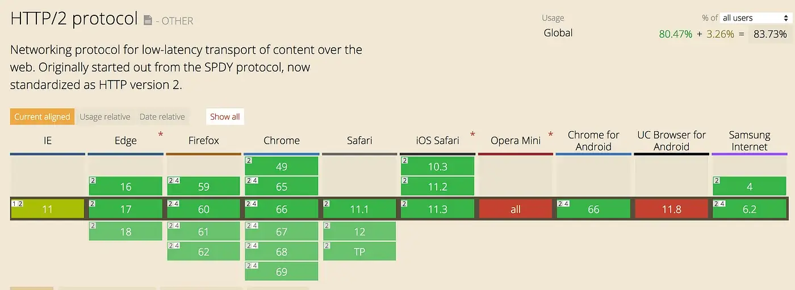

原文链接：[https://noobj.medium.com/exploring-http2-part-1-overview-dc3e9b53968f](https://noobj.medium.com/exploring-http2-part-1-overview-dc3e9b53968f)

> *让我们来谈谈* **http2 的内容、原因、时间和方式**

完整的代码可以在[github](https://github.com/noobg1/http1_vs_http2)上找到。

**第 1 部分：概述**
第 2 部分：[使用 node-http2 核心和 hapijs 进行探索](https://medium.com/@noobj/exploring-http2-part-2-with-node-http2-core-and-hapijs-74e3df14249)

## 什么是http2？

> ***http2\***是自 1999 年以来使用的***http1.1\***之后的最新更新

*http2*协议注重**性能**；具体来说，最终用户感知的延迟、网络和服务器资源的使用情况。 （[*在此处*](https://http2.github.io/)*阅读有关规格的信息**）*

## 为什么是http2？

> 换句话说http1.1有什么问题

加载网页是一项资源密集型工作，因为 HTTP/1.1 只允许每个 TCP 连接有一个未完成的请求。网络需要进行更新，以提高效率、安全性和速度。

**http2如何解决性能问题？**

http2 带来的改进：

- **单一连接：**仅使用一个与服务器的连接来加载网站，并且只要网站打开，该连接就保持打开状态。这减少了建立多个 TCP 连接所需的往返次数。*（更多信息*[*在这里*](https://stackoverflow.com/questions/44864273/http-2-0-one-tcp-ip-connections-vs-6-parallel?utm_medium=organic&utm_source=google_rich_qa&utm_campaign=google_rich_qa)*）*
- **多路复用：**同一连接上同时允许多个请求。以前，在 HTTP/1.1 中，每个传输都必须等待其他传输完成。*（更多信息*[*在这里*](https://stackoverflow.com/questions/36517829/what-does-multiplexing-mean-in-http-2?utm_medium=organic&utm_source=google_rich_qa&utm_campaign=google_rich_qa)*）*
- **服务器推送：**可以将其他资源发送到客户端以供将来使用。*（更多信息*[*在这里*](https://blogs.akamai.com/2017/03/http2-server-push-the-what-how-and-why.html)*）*
- **优先级：**请求被分配依赖级别，服务器可以使用它来更快地交付更高优先级的资源。*（更多信息*[*在这里*](https://http2.github.io/http2-spec/#priority-gc)*）*
- **二进制：**使 HTTP/2 更易于服务器解析、更紧凑且不易出错。将信息从文本转换为二进制不会浪费额外的时间。*（更多信息*[*在这里*](https://http2.github.io/faq/#why-is-http2-binary)*）*
- **标头压缩：** HTTP/2 使用[HPACK](https://tools.ietf.org/html/rfc7541)压缩，从而减少开销。在 HTTP/1.1 中，每个请求中的许多标头都使用相同的值发送。*（更多信息*[*在这里*](https://http2.github.io/faq/#why-hpack)*）*

## 我们什么时候可以开始使用http2？

现在！

这是时间线，

来源：[https://www.polyglotdeveloper.com/](https://www.polyglotdeveloper.com/timeline/2016-08-22-HTTP-Protocol-timeline/)

是的，从 1999 年到今天，我们（大多数）都在使用同样好的旧 http1.1； 15年！

## 如何开始使用http2？

> [以下](https://github.com/http2/http2-spec/wiki/Implementations)是各种语言的 http2 库实现列表。

根据[Can I Use](https://caniuse.com/#search=http2)的统计，大约 83% 的在线浏览器已经支持 http2

> 查看实际情况，http1.1 与 http2（网络节流：**快速 3g**）

http1.1（左）与http2（右）；让我们在下一节中构建它

> 在下[**一部分**](https://medium.com/@noobj/exploring-http2-part-2-with-node-http2-core-and-hapijs-74e3df14249)中，我们将构建一个支持 http2 的简单服务器；具有http1.1向后兼容性；一步一步使用[**http2-node**](https://nodejs.org/dist/latest-v10.x/docs/api/http2.html) core 和[**hapi**](https://hapijs.com/) **js**。

第 1 部分：概述
**第 2 部分：**[**使用 node-http2 核心和 hapijs 进行探索**](https://medium.com/@noobj/exploring-http2-part-2-with-node-http2-core-and-hapijs-74e3df14249)

完整的代码可以在[github](https://github.com/noobg1/http1_vs_http2)上找到。
