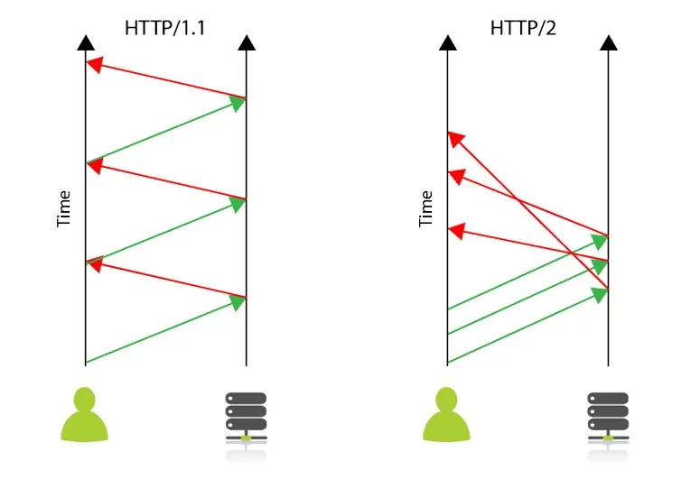
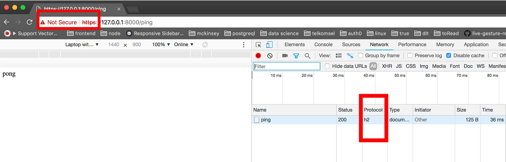
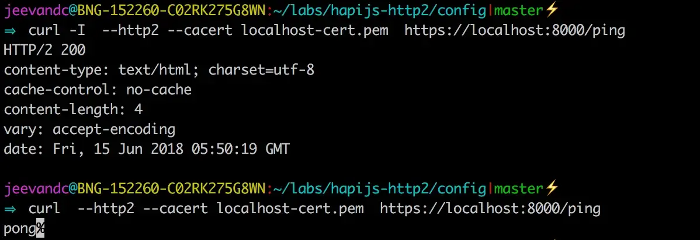
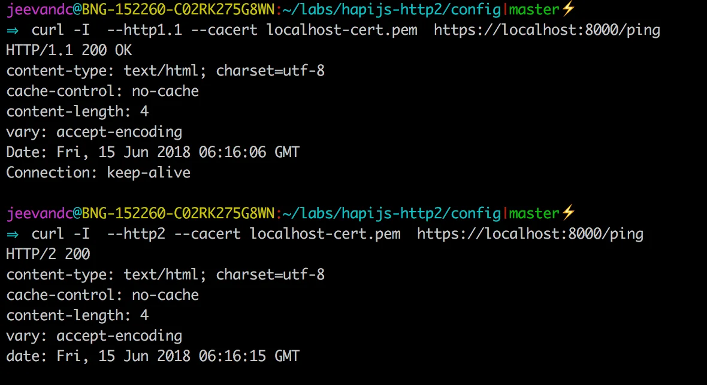
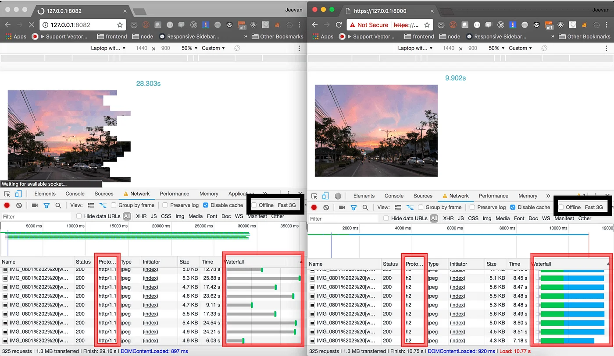

原文链接：[https://noobj.medium.com/exploring-http2-part-2-with-node-http2-core-and-hapijs-74e3df14249](https://noobj.medium.com/exploring-http2-part-2-with-node-http2-core-and-hapijs-74e3df14249)




来源：[https://www.thewebmaster.com/](https://www.thewebmaster.com/hosting/2015/dec/14/what-is-http2-and-how-does-it-compare-to-http1-1/)

**先决条件**：了解 javascript、客户端-服务器架构。

完整的代码可以在[github](https://github.com/noobg1/http1_vs_http2)上找到。

第 1 部分：[概述（*http2 的原因、内容、时间、方式*）](https://medium.com/@noobj/exploring-http2-part-1-overview-dc3e9b53968f)**第 2 部分：使用 node-http2 核心和 hapijs 进行探索**

> 免责**声明**：本文将使用**node@v9+**附带的**http2模块。**[这里](https://github.com/http2/http2-spec/wiki/Implementations)列出了其他几个 http2 客户端-服务器库实现。

让我们开始创建一个具有单一路由的简单 http1.1 服务器。

```
mkdir hapijs-http2 && \ 
cd hapijs-http2 && \ 
npm init -y && \ 
npm i hapi@^16.6 -s && \ 
touch http1Server.js
```

将下面的代码复制到此处或从[此处](https://github.com/noobg1/http1_vs_http2)`http1Server.js`克隆整个存储库。

```javascript
const Hapi = require('hapi');
const server = new Hapi.Server();

// define server config
server.connection({
  port: '8000'
});

// define route config
server.route([{
  method: 'GET',
  path: '/ping',
  handler: (request, reply) => {
    reply('pong');
  }
}]);

// start server
server.start(err => {
  if (err) console.error(err)
  console.log(`Started ${server.connections.length} connections`)
});
```

现在，让我们进行健全性检查。

启动服务器，`node http1Server.js`

```
⇒ http://127.0.0.1:8000/ping
 pong
```

凉爽的！如果我们得到 pong 的 ping，让我们尝试将**http2**集成到我们的 hapijs 服务器中。

本质上，http2 需要与 https 一起运行。为了实现这一点，我们需要[ssl 证书](https://www.globalsign.com/en/ssl-information-center/what-is-an-ssl-certificate/)。我们将使用[OpenSSL](https://www.openssl.org/)创建一个自签名证书，或者您也可以使用[此处](https://github.com/noobg1/http1_vs_http2/tree/master/config/secrets)的一个。

```
openssl req -x509 -newkey rsa:2048 -nodes -sha256 -subj '/CN=localhost' \ 
  -keyout localhost-privkey.pem -out localhost-cert.pem
```

我们将`localhost-privkey.pem`在`localhost-cert.pem`我们的`http2Server.js`.

让我们进行以下更改，

```javascript
const Hapi = require('hapi');
const fs = require('fs');
const Http2 = require('http2');
const server = new Hapi.Server();

// read certificate and private key
const serverOptions = {
  key: fs.readFileSync('localhost-privkey.pem'),
  cert: fs.readFileSync('localhost-cert.pem')
};

// create http2 secure server listener
const listener = Http2.createSecureServer(serverOptions);

// create a connection object with listener and other options
server.connection({
  listener,
  port: '8000'
});

// define routes
server.route([{
  method: 'GET',
  path: '/ping',
  handler: (request, reply) => {
    reply('pong');
  }
}]);

// start server
server.start(err => {
  if (err) console.error(err)
  console.log(`Started ${server.connections.length} connections`)
});
```

发生了什么变化？

> **第 7-10 行**：我们正在读取之前生成的证书和私钥。
>
> **第 13 行**：创建一个安全的 Http2 服务器，其中证书和私钥作为服务器[选项](https://nodejs.org/dist/latest-v10.x/docs/api/http2.html#http2_http2_createsecureserver_options_onrequesthandler)从`http2`模块传递。
>
> **第 17 行**：我们可以在使用该选项创建连接时提供我们自己的服务器实现`listener`。 （更多信息[在这里](https://github.com/hapijs/hapi/blob/master/API.md#serverconnectionoptions)）。
>
> **仅供参考**：我使用的是 node@v10.4.1，任何高于 9 的值都可以。

重新启动服务器，然后使用浏览器`https://127.0.0.1:8000/ping`

瞧！



服务器用 pong 回复

> 需要注意的地方，

- 协议值为**h2**别名**http2**
- 尽管我们使用 https 运行，但我们在浏览器地址栏中看到**不安全**；因为我们对ssl 证书*进行了自签名*，并且浏览器无法将其识别为来自有效的[*证书颁发机构*](https://www.globalsign.com/en/ssl-information-center/what-are-certification-authorities-trust-hierarchies/)。
- 如果我们尝试使用curl，我们可能会得到This is because http2 may not support with default curly by your OS.您可以按照[此操作](https://simonecarletti.com/blog/2016/01/http2-curl-macosx/)升级您的curl (macOS)。
  `➜ curl https://127.0.0.1:8000/ping curl: Unsupported protocol`
- 一旦我们完成设置，我们可以尝试我们可以使用带有标志的curl来支持http2协议，我们还需要传递带有标志的证书文件，因为它是自签名的并且不能被curl识别。
  `curl --http2 --cacert localhost-cert.pem https://127.0.0.1:8000/ping`
  `—-http2``—-cacert`



- `-I`我们可以通过要求curl仅返回带有（head）或带有（verbose）的响应头来验证协议`-v`。

到目前为止，一切都很好。但我们所有的客户可能支持也可能不支持 http2。我们通过添加额外的服务器选项来处理这个问题：
`allowHttp1: true`

```bash
// read certificate and private-key
const serverOptions = {
  key: fs.readFileSync('localhost-privkey.pem'),
  cert: fs.readFileSync('localhost-cert.pem'),
  allowHTTP1: true
};
```

在 serverOptions 中添加“allowHTTP1: true”
在 serverOptions 中添加“allowHTTP1： true”

现在我们开始！当客户端不支持 http2 时，回退到提供 http1.1



同时为 http1.1 和 http2 客户端提供服务

仅通过这些更改，我们就可以获得约 135% 的性能[提升](https://medium.com/the-node-js-collection/node-js-can-http-2-push-b491894e1bb1)。

仔细观察差异，



> 通过**瀑布**部分，可以明显地掌握单个 TCP 连接使用与多个 TCP 连接使用之间的差异。

如果您想获得 http2 可以提供的第一手经验，请按照[此处的](https://github.com/noobg1/http1_vs_http2)说明在您的计算机中运行上述演示。

*因此，*[*选择*](https://github.com/http2/http2-spec/wiki/Implementations)*您的客户端或服务器库实现并开始使用 http2！*

完整的代码可以在[github](https://github.com/noobg1/http1_vs_http2)上找到。

> 参考：

- https://http2.github.io/faq
- https://http2.akamai.com/demo
- https://github.com/http2/http2-spec/wiki/Implementations
- https://caniuse.com/#feat=http2
- https://nodejs.org/dist/latest-v10.x/docs/api/http2.html

*如果你觉得这个故事有用的话，请点个赞支持一下👏*
