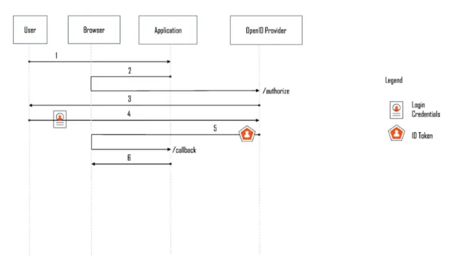

## 认证和授权

**认证 (Authentication)**：

- 认证是验证用户、设备或系统身份的过程。
- 常见的认证方式包括用户名/密码、生物特征(如指纹、人脸)、单点登录(SSO)等。
- 认证确保只有被授权的实体才能访问系统或资源。

**授权 (Authorization)**：

- 授权是确定已认证的实体被允许执行哪些操作或访问哪些资源的过程。
- 授权通常基于预定义的策略和规则，如角色、权限、访问控制列表(ACL)等。
- 授权决定了经过身份验证的实体可以执行的操作和访问的资源。

认证和授权的关系：

- 认证是先决条件，在授权之前必须先完成用户或实体的身份验证。
- 认证确保只有合法的实体可以访问系统，授权则决定了这些实体可以执行哪些操作。
- 认证和授权通常结合使用，共同构成完整的访问控制机制。

在实际应用中，认证和授权通常遵循以下流程:

1. 用户或客户端提供身份凭证进行认证。
2. 系统验证用户或客户端的身份，确认其身份有效。
3. 根据已验证的身份，授予用户或客户端相应的访问权限和操作权限。
4. 用户或客户端可以在授权范围内执行操作和访问资源。

## OIDC

OAuth 2.0 代表开放授权，是一种标准，旨在代表用户提供对资源的同意访问，而无需共享用户的凭据。OAuth 2.0 是一种授权协议，而不是身份验证协议，它主要被设计为授予对一组资源（例如远程 API 或用户数据）的访问权限的一种方式。

OAuth 2.0 仅用于*授权*，用于授予从一个应用程序到另一个应用程序的数据和功能的访问权限。OpenID Connect (OIDC) 是一个位于 OAuth 2.0 之上的薄层，它添加了有关登录人员的登录和个人资料信息。

​												图片来自[Azure 文档](https://learn.microsoft.com/en-us/azure/active-directory/fundamentals/auth-oidc)

### OIDC 的工作原理

#### 授权码流程

要验证用户身份，应用程序首先将用户的浏览器重定向到 OpenID 提供商。OpenID 提供商验证用户身份，并使用授权码将用户的浏览器重定向回应用程序。然后，应用程序使用授权码获取`ID Token`和`Access Token`：

#### 隐式流

传统上，无法安全存储机密的应用程序会使用隐式流程。使用此流程不再被视为请求访问令牌的最佳实践。

#### 混合流

混合流程是一种 OpenID Connect 流程，它结合了隐式流程和授权码流程的特征。它使客户端能够直接从授权端点获取一些令牌，同时仍然可以从令牌端点获取其他令牌。

### OpenID 演示

您可以使用以下网站来玩自己的：[https://openidconnect.net/](https://openidconnect.net/)

## OAuth2 和 OIDC

OAuth 2.0 和 OpenID Connect (OIDC) 是两个不同但相关的协议，它们之间有以下主要区别:

1. **目的不同**：
   - OAuth 2.0 是一种授权框架，目的是授予第三方应用程序有限的访问权限，而不需要共享用户的凭证。
   - OIDC 是构建在 OAuth 2.0 之上的身份验证协议，目的是提供安全的身份验证和用户信息交换。
2. **认证和授权的区别**：
   - OAuth 2.0 主要处理授权，即允许第三方应用程序访问受保护资源的过程。
   - OIDC 在 OAuth 2.0 的基础上增加了认证功能，即验证用户身份的过程。
3. **返回的数据不同**：
   - OAuth 2.0 返回的是访问令牌(Access Token)，用于访问受保护资源。
   - OIDC 返回的是 ID 令牌(ID Token)，包含了有关已验证用户的声明信息。
4. **协议流程不同**：
   - OAuth 2.0 定义了四种授权许可类型，如授权码、隐式、客户端凭证等。
   - OIDC 在 OAuth 2.0 的基础上定义了标准化的身份验证流程，如授权码流、隐式流等。
5. **应用场景不同**：
   - OAuth 2.0 主要用于授权第三方应用程序访问受保护资源，如 API、文件等。
   - OIDC 主要用于提供安全的身份验证和用户信息交换，如单点登录(SSO)、用户信息管理等。

OAuth2缺点：

- 缺乏内置安全功能。
- 没有标准实施。
- 没有一套共同的scope。

OIDC = OAuth2 + 认证

- 角色

  - OAuth2 角色：

    - 授权服务器

    - 资源服务器

    - 资源所有者

    - 客户端

  - OIDC 聚焦在认证环境，主要角色：

    - 授权服务器 -> OpenID Provider

    - 资源所有者 -> End User

    - 客户端 -> Relying Party

- 接口
  - OAuth2 规定了两个服务接口：授权接口（Authorization Endpoint）和令牌接口（Token Endpoint）
  - OIDC 新增了 UserInfo 接口，用于通过 ID Token 获取用户信息
- Scope 范围
  - OAuth2：规范没有定义，而是由服务实现方定义
  - OIDC：新增了 openid 的 scope，这样调用令牌接口返回的响应中就会携带 ID Token
- 令牌
  - OAuth2 定义了两种令牌：访问令牌和刷新令牌
  - OIDC 新增了 OpenID 令牌。当 scope 中指定了 openid，就会得到 OpenID 令牌
