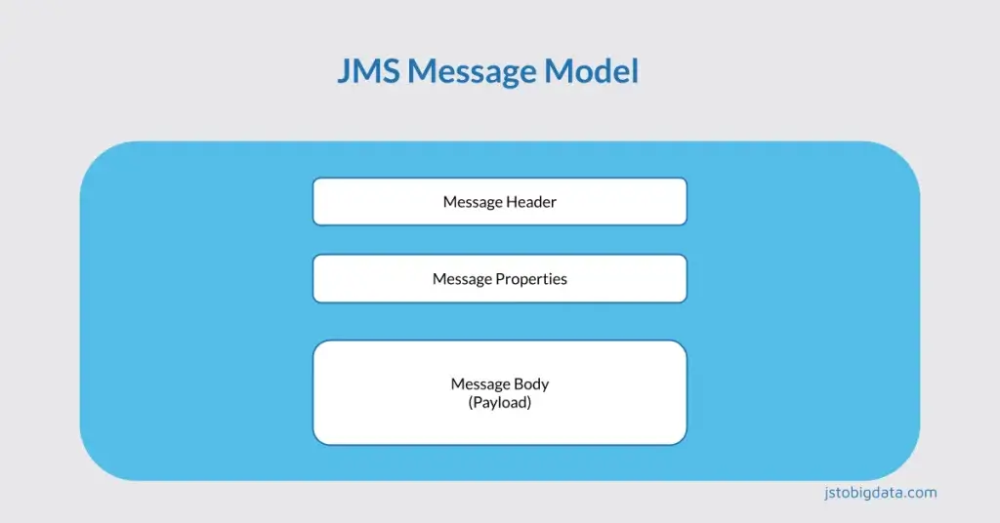

消息是 JMS 的核心，无论是事件还是业务数据。消息由标头、自定义属性和正文组成。这是您将在 JMS 消息模型（JMS 消息剖析）中学习的内容。



JMS 消息由 Header、Properties 和 Body（Payload）组成。我们将在下面详细讨论它们。

- **消息头**是有关消息的元数据。消息头有两种类型：开发人员设置的头和 JMS 提供商设置的头。

- 消息属性是用于向消息添加可选标头字段的附加标头字段。属性字段基本上有 3 种类型。

  - 应用程序特定属性 - 允许设置应用程序特定的自定义标题。
  - 标准属性 – JMS 定义的标准属性。
  - JMS-Provider 特定属性。
  
- **消息主体**是发送到目的地的有效负载。JMS 支持多种类型（格式）的有效负载。

## 1. 消息头字段

一些消息头由程序员设置，一些由 JMS 提供商内部设置。消息头是 JMS 消息模型中首先要探讨的内容。

### **1.1. JMS 目标**

此标头包含消息发送的目的地。收到消息时，目的地必须与分配的值相等。

```java
javax.jms.Message#setJMSDestination(Destination)
javax.jms.Message#getJMSDestination()
```

### **1.2. JMS交付模式**

JMS 支持 *PERSISTEN T*和 NON_PERSISTENT 消息传输模式。此标头表示传递模式。

```java
javax.jms.Message#setJMSDeliveryMode（int）
javax.jms.Message#getJMSDeliveryMode()
javax.jms.DeliveryMode
```

### **1.3. JMS消息ID**

此标头字段值唯一标识提供商发送的每个消息。它是一个字符串值。程序员不需要处理它。

```java
javax.jms.Message#getJMSMessageID()
javax.jms.Message#setJMSMessageID(String)
javax.jms.MessageProducer#setDisableMessageID(boolean)
```

### **1.4. JMS时间戳**

消息被交给提供商处理的时间戳。

```java
javax.jms.Message#setJMSTimestamp(long)
javax.jms.MessageProducer#setDisableMessageTimestamp(boolean)
```

### **1.5. JMS重新交付**

当客户端收到带有此标头的消息时，很可能该消息已在过去送达，但未收到确认。程序员无法更改此值。

```java
javax.jms.Message#setJMSRedelivered（boolean）
javax.jms.Message#getJMSRedelivered()
```

### **1.6. JMSExpiration** – 设置消息生存时间

JMS 通过添加生存时间值来为每条消息设置过期值。生存时间值在方法中指定`send()`。如果生存时间值设置为零，则 JMSExpiration 标头值也会变为零，这意味着消息不会过期。

```java
jmsProducer.setTimeToLive(long timeToLive);
javax.jms.Message#setJMSExpiration(long)
javax.jms.Message#getJMSExpiration()
```

下面的示例演示了如何使用`producer.setTimeToLive()`方法来设置消息过期时间。正如您在输出中看到的那样，消息的生命周期只有 2 秒，5 秒后它将从队列中删除。因此，消费者不会收到该消息并记录 NullPointer 异常。

```Java
package lab01.message.model;

import labxx.common.settings.CommonSettings;
import javax.jms.*;

public class MessageExpirationTest {
  public static void main(String[] args) throws InterruptedException, JMSException {
    ConnectionFactory connectionFactory = CommonSettings.getConnectionFactory();
    Queue queue = CommonSettings.getDefaultQueue();

    try (JMSContext jmsContext = connectionFactory.createContext()) {
      JMSProducer producer = jmsContext.createProducer();
      producer.setTimeToLive(2000);
      producer.send(queue, "This message will expire soon");

      Thread.sleep(5000);

      JMSConsumer consumer = jmsContext.createConsumer(queue);
      TextMessage message = (TextMessage) consumer.receive(10000);
      System.out.println(message.getText());
    }
  }
}
```

**输出**

```
Exception in thread "main" java.lang.NullPointerException
```

### **1.7. JMSPriority 标头**

JMS 定义了 10 个优先级别，从 0（最低）到 9（最高）。应用程序客户端应将 0 到 4 视为*普通*优先级消息，将 5 到 9 视为*加急*消息。加急消息优先于普通优先级消息传送。

```java
jmsProducer.setPriority(int priority);
```

更多讨论请参阅**[优先考虑 JMS 消息教程](https://jstobigdata.com/jms/jms-prioritize-messages/)**。

### **1.8. JMSDeliveryTime** – 消息传递延迟

表示投递时间。这意味着消息将在此标头所表示的时间或之后投递。通过将投递时间与指定的投递延迟相加来计算。

```java
jmsProducer.setDeliveryDelay(long deliveryDelay);
```

```Java
package lab01.message.model;

import labxx.common.settings.CommonSettings;
import javax.jms.*;

public class MessageDelayDelivery {
  public static void main(String[] args) throws JMSException {
    ConnectionFactory connectionFactory = CommonSettings.getConnectionFactory();
    Queue queue = CommonSettings.getDefaultQueue();

    try (JMSContext jmsContext = connectionFactory.createContext()) {
      JMSProducer producer = jmsContext.createProducer();
      producer.setDeliveryDelay(3000);/delivered after 3 seconds
      producer.send(queue, "Message with a delay");

      JMSConsumer consumer = jmsContext.createConsumer(queue);
      TextMessage textMsg = (TextMessage) consumer.receive(5000);/Wait for 5 seconds
      System.out.println("Received message: " + textMsg.getText());
    }
  }
}
```

当您运行该示例时，您将看到消息在 3 秒后送达。

### **1.9. JMS关联ID**

客户端使用此标头字段将一条消息与另一条消息链接起来。在请求-响应场景中很有用。

```java
jmsProducer.setJMSCorrelationID(String correlationID)
jmsProducer.setJMSCorrelationIDAsBytes(byte[])
```

我将在本教程的后半部分讨论在请求-响应场景中使用 CorrelationID。

### **1.10. JMS类型**

表示客户端在消息中设置的消息类型 ID。在少数 JMS 提供商中很有用。

```java
jmsProducer.setJMSType(String type);
```

### **1.11. JMSReplyTo**

此标头包含应发送消息回复的目的地（队列或主题）。

```java
jmsProducer.setJMSReplyTo(Destination replyTo);
javax.jms.Message#setJMSReplyTo(Destination)
javax.jms.Message#getJMSReplyTo()
```

您将在本教程的后半部分学习 JMSReplyTo 标头的使用。

## 2. 消息属性

如前所述，消息属性是向消息添加可选标头字段的附加字段。消息属性有 3 种类型：自定义属性、JMS 定义属性和可选 JMS 提供程序特定属性。

### 2.1. 自定义属性

- 属性名称（键）应遵循 java 标识符规则。
- 属性值可以是`boolean`、`byte`、`short`、`int`、和。`long`、`float`、`double`、`String`

下面的示例演示了消息中自定义属性的用法。

```Java
package lab01.message.model;

import labxx.common.settings.CommonSettings;
import org.junit.jupiter.api.Test;
import javax.jms.*;
import java.util.Enumeration;
import java.util.UUID;

public class MessageCustomProperties {
  @Test
  public void test()
      throws JMSException {
    ConnectionFactory connectionFactory = CommonSettings.getConnectionFactory();
    Queue queue = CommonSettings.getDefaultQueue();

    try (JMSContext jmsContext = connectionFactory.createContext()) {
      JMSProducer producer = jmsContext.createProducer();
      TextMessage message = jmsContext.createTextMessage("Message with a custom property");
      message.setBooleanProperty("priorityUser", true);
      message.setStringProperty("authToken", UUID.randomUUID().toString());
      producer.send(queue, message);
 
      JMSConsumer consumer = jmsContext.createConsumer(queue);
  
      //Delay for testing purpose Only
      TextMessage textMsg = (TextMessage) consumer.receive(1000);
      Enumeration customProperties = textMsg.getPropertyNames();
      while (customProperties.hasMoreElements()) {
        System.out.println(customProperties.nextElement());
      }
      System.out.println("priorityUser: " + textMsg.getBooleanProperty("priorityUser"));
      System.out.println("authToken: " + textMsg.getStringProperty("authToken"));
      System.out.println("Received message: " + textMsg.getText());
    }
  }
}
```

**输出**

```
JMSXDeliveryCount
priorityUser
authToken
priorityUser: true
authToken: 010a908f-a3a6-4a2b-8d9f-5e177f1c223b
Received message: Message with a custom property
```

您可以迭代各种消息属性，如上例所示（第 28-31 行）。

### 2.2. JMS 定义的属性

所有 JMS 定义的属性都有`JMSX`属性名前缀。下面是属性列表、属性类型、JMS 必须实现的可选或强制属性及其用途。

**1. JMSXUserID** — 字符串 — 可选 — 由提供商在发送时设置，
用于识别发送消息的用户。

**2. JMSXAppID** — 字符串 — 可选 — 由提供商在发送时设置
这是发送消息的应用程序的身份。

**3. JMSXDeliveryCount** – int – 强制 – 由提供商在接收时设置
消息传递尝试的次数。

**4. JMSXGroupID** – 字符串 – 可选 – 由客户端设置
此消息所属消息组的标识。

**5. JMSXGroupSeq** – int – 可选 – 由客户端设置
此消息在组内的序列号。

**6. JMSXProducerTXID** — 字符串 — 可选 — 由提供商在发送
生成消息的事务 ID 时设置。

**7. JMSXConsumerTXID** — 字符串 — 可选 — 由提供商在接收
使用消息的交易 ID 时设置。

**8. JMSXRcvTimestamp** — long — 可选 — 由提供商在接收时设置
JMS 将消息传递给消费者的时间。

**9. JMSXState** – int – 可选 – 由提供商设置
消息是否处于等待、就绪、过期或保留状态。没有 API 可供程序员检查这一点。

### 2.3. JMS 提供程序特定属性

JMS`JMS_<vendor_name>`为特定于供应商的属性保留了属性名称前缀。这些特定于供应商的属性适用于本机供应商/提供商客户端。程序员不能在 JMS 代码中使用。

## 3. JMS 消息体 – JMS 中的 5 种消息类型

最后，在本次 JMS 消息模型讨论中，我们将讨论实际的消息内容。JMS 提供了 5 种形式的消息类型。

### **1. StreamMessage**

消息主体包含 Java 原始值流。

```java
StreamMessage message = jmsContext.createStreamMessage();
message.writeString("String Content");

StreamMessage receivedMessage = (StreamMessage) consumer.receive();
```

### **2. MapMessage**

消息主体包含键值对，键是字符串对象，值是 Java 原始类型。

```java
MapMessage message = jmsContext.createMapMessage();
message.setString("sampleKey", "sampleValue");

MapMessage receivedMessage = (MapMessage) consumer.receive();
```

### **3. **TextMessage

正文包含字符串的消息。

```java
TextMessage message = jmsContext.createTextMessage("Test TextMessage Type");

TextMessage receivedMessage = (TextMessage) jmsContext.createConsumer(queue).receive();
```

### **4. ObjectMessage**

包含可序列化 Java 对象的消息。

```java
ObjectMessage message = jmsContext.createObjectMessage();
message.setObject(new UserCommand("John", "john@gmail.com"));

ObjectMessage receivedMessage = (ObjectMessage) consumer.receive();
```

### **5. BytesMessage**

包含未解释的字节流的消息。

```java
BytesMessage message = jmsContext.createBytesMessage();
message.writeUTF("नमस्ते");

BytesMessage receivedMessage = (BytesMessage) consumer.receive();
```

以下代码从高层次演示了各种消息类型的工作方式。您还可以探索更多方法。

```Java
package lab01.message.model;

import labxx.common.settings.CommonSettings;
import org.junit.jupiter.api.BeforeAll;
import org.junit.jupiter.api.Test;

import javax.jms.*;
import java.io.Serializable;
import java.util.StringJoiner;
import java.util.UUID;

/**
 * Test - TextMessage, ByteMessage, ObjectMessage, StreamMessage, MapMessage.
 */
public class MessageTypesTest {
  private static ConnectionFactory connectionFactory = null;
  private static Queue queue = null;

  @BeforeAll
  public static void setUp() {
    connectionFactory = CommonSettings.getConnectionFactory();
    queue = CommonSettings.getDefaultQueue();
  }

  /**
   * @throws JMSException
   */
  @Test
  public void testTextMessage() throws JMSException {
    try (JMSContext jmsContext = connectionFactory.createContext()) {
      JMSProducer producer = jmsContext.createProducer();
      TextMessage message = jmsContext.createTextMessage("Test TextMessage Type");
      producer.send(queue, message);
      TextMessage receivedMessage = (TextMessage) jmsContext.createConsumer(queue).receive();
      System.out.println("Received message: " + receivedMessage.getText());
    }
  }

  @Test
  public void testByteMessage() throws JMSException {
    try (JMSContext jmsContext = connectionFactory.createContext()) {
      JMSProducer producer = jmsContext.createProducer();
      BytesMessage message = jmsContext.createBytesMessage();
      message.writeUTF("नमस्ते");
      message.writeBoolean(true);
      message.writeLong(12345L);
      producer.send(queue, message);
      JMSConsumer consumer = jmsContext.createConsumer(queue);
      BytesMessage receivedMessage = (BytesMessage) consumer.receive();
      System.out.println("==== ByteMessage Demo ====");
      System.out.println(receivedMessage.readUTF());
      System.out.println(receivedMessage.readBoolean());
      System.out.println(receivedMessage.readLong());
    }
  }

  @Test
  public void testStreamMessage() throws JMSException {
    try (JMSContext jmsContext = connectionFactory.createContext()) {
      JMSProducer producer = jmsContext.createProducer();
      StreamMessage message = jmsContext.createStreamMessage();
      message.writeString("String Content");
      message.writeString("Another string");
      message.writeInt(101);
      producer.send(queue, message);
      JMSConsumer consumer = jmsContext.createConsumer(queue);
      StreamMessage receivedMessage = (StreamMessage) consumer.receive();
      System.out.println("===== StreamMessage =====");
      System.out.println(receivedMessage.readString());
      System.out.println(receivedMessage.readString());
      System.out.println(receivedMessage.readInt());
    }
  }

  @Test
  public void testMapMessage() throws JMSException {
    try (JMSContext jmsContext = connectionFactory.createContext()) {
      JMSProducer producer = jmsContext.createProducer();
      MapMessage message = jmsContext.createMapMessage();
      message.setString("sampleKey", "sampleValue");
      producer.send(queue, message);
      JMSConsumer consumer = jmsContext.createConsumer(queue);
      MapMessage receivedMessage = (MapMessage) consumer.receive();
      System.out.println("===== MapMessage Demo =====");
      System.out.println(receivedMessage.getString("sampleKey"));
    }
  }

  @Test
  public void testObjectMessage() throws JMSException {
    try (JMSContext jmsContext = connectionFactory.createContext()) {
      JMSProducer producer = jmsContext.createProducer();
      ObjectMessage message = jmsContext.createObjectMessage();
      message.setObject(new UserCommand("John", "john@gmail.com"));
      producer.send(queue, message);
      JMSConsumer consumer = jmsContext.createConsumer(queue);
      ObjectMessage receivedMessage = (ObjectMessage) consumer.receive();
      System.out.println("===== ObjectMessage Demo =====");
      System.out.println(receivedMessage.getObject());
    }
  }

  private static class UserCommand implements Serializable {
    private String id;
    private String name;
    private String email;
    public UserCommand(String name, String email) {
      id = UUID.randomUUID().toString();
      this.name = name;
      this.email = email;
    }

    @Override
    public String toString() {
      return new StringJoiner(", ", UserCommand.class.getSimpleName() + "[", "]")
          .add("id='" + id + "'")
          .add("name='" + name + "'")
          .add("email='" + email + "'")
          .toString();
    }
  }
}
```

**输出**

您的输出可能会略有不同，但结果应该相似。

```
===== StreamMessage =====
String Content
Another string
101

===== ObjectMessage Demo =====
UserCommand[id='e5e80542-7201-4418-bced-064d49bb5b8f', name='John', email='john@gmail.com']

Received message: Test TextMessage Type

===== MapMessage Demo =====
sampleValue

==== ByteMessage Demo ====
नमस्ते
true
12345
```

在本教程中，我通过示例简要讨论了 JMS 消息模型。请在下面的评论中告诉我您的反馈或问题。我将在单独的文章中讨论**[消息优先级](https://jstobigdata.com/jms/jms-prioritize-messages/)**和**消息** **请求-响应**。


原文链接：[JMS Message Model](https://jstobigdata.com/jms/jms-message-model/)
