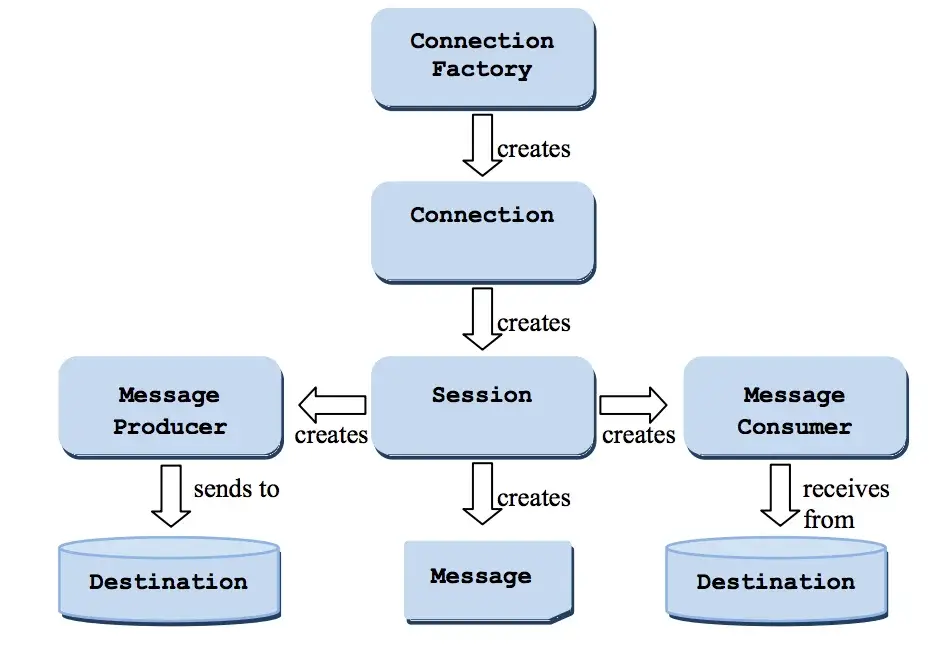
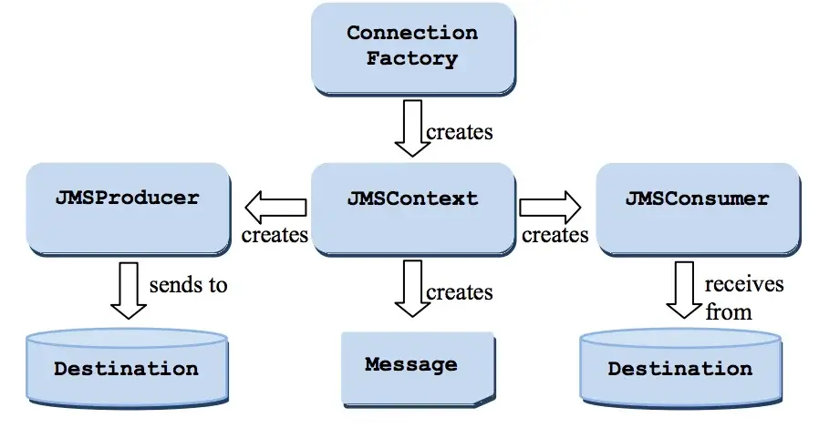

您将了解 JMS 架构，学习如何在 JMS 中发送和接收消息。我将介绍管理对象、JMS 1.1 API 和 JMS 2.0 API。我们还将看到与 JMS 1.1 API 相比，JMS 2.0 API 的使用有多么简单。在继续学习本课程之前，请确保您已完成 JMS 设置。如果您是初学者，请确保您已了解[JMS 的基础知识](https://jstobigdata.com/jms/jms-introduction-java-message-service/)。

- 请记住，当您使用 JMS 时，需要在 JMS 提供程序中配置ConnectionFactory和Destination对象（队列和主题）。这就是它们被称为**受管理**对象的原因。
- 您通常会执行 JNDI 查找以获取**ConnectionFactory**，然后从 ConnectionFactory获取物理**Connection对象。**
- 获得连接后，您将需要打开一个**会话**来发送/接收消息。

## JMS API 版本

您需要了解基本上有两组用于发送和接收消息的主要接口。

- **JMS 1.1** – 也称为**经典 API**，这是遗留 API。
- **JMS 2.0** – 被称为**简化 API**，提供更简单的 API，需要更少的接口。这正是您在新项目中需要使用的。

### 通用接口

- **队列**– 用于点对点消息传递的受管理对象。单个生产者和单个接收者。
- **主题**– 用于发布/订阅消息的受管对象。单个生产者，但多个接收者。
- **目的地**– 队列和主题的共同超类型。
- **Message、ByteMessage、MapMessage、ObjectMessage、StreamMessage**和**StreamMessage** – 表示发送到 JMS 提供程序或从 JMS 提供程序接收的消息类型。

## 使用 JMS 发送和接收消息

我们将看到使用 JMS 1.1（经典 API）和 JMS 2.0（简化 API）发送和接收文本消息的简单示例。我建议使用 JMS 2.0 API，本教程将对此进行更多讨论。但是，如果您碰巧使用的是旧版应用程序，最好也关注一下旧版 API。

### 使用 JMS 1.1 开发客户端

下面是一个示例，演示了如何使用经典 API。它创建一条简单的文本消息并将其发送到队列。然后，消息消费者从同一队列读取同一条消息。

```Java
package lab00.classic.helloworld;

import javax.jms.*;
import javax.naming.InitialContext;
import javax.naming.NamingException;

public class TestHelloWorldQueue {
  public static void main(String[] args) throws NamingException {
    InitialContext initialContext = null;

    try {
      initialContext = new InitialContext();

      /Step-1 Create ConnectionFactory
      ConnectionFactory connectionFactory
          = (ConnectionFactory) initialContext.lookup("jms/__defaultConnectionFactory");
 
      /Step-2 Create connection
      Connection connection = connectionFactory.createConnection();
 
      /Step-3 Create Session
      /Any number of sessions can be created from a connection
      Session session = connection.createSession();

      /Step-4 Get the Queue
      Queue queue = (Queue) initialContext.lookup("jms/PTPQueue");

      /Step-5a Create the message Producer
      MessageProducer messageProducer = session.createProducer(queue);

      /Step-6a Create the Text Message
      TextMessage textMessage = session.createTextMessage("Test message - Hello");
 
      /Step-7a Send the message
      messageProducer.send(textMessage);

      /Step-5b Create the message consumer
      MessageConsumer messageConsumer = session.createConsumer(queue);

      /Step-6b Start the connection
      connection.start(); /to start delivery

      /step-7b Receive the message
      TextMessage message = (TextMessage) messageConsumer.receive();
      System.out.println(message.getText());
    } catch (NamingException | JMSException ex) {
      ex.printStackTrace();
    } finally {
      if (initialContext != null) {
        initialContext.close();
      }
    }
  }
}
```

正如您在上面的代码中看到的，使用 JMS 1.1（经典 API）发送和接收消息需要遵循几个步骤。总结以下步骤。

1. 使用 JNDI 查找创建`ConnectionFactory`。JNDI 信息在文件中配置`jndi.properties`。每个应用程序/服务只需要一个 ConnectionFactory。
2. 之后，`Connection`从ConnectionFactory获取对象。
3. `Session`从连接创建。
4. 使用 Session 来创建`MessageProducer`对象`MessageConsumer`。
5. 告诉连接开始传递消息。
6. 最重要的是，记得在 finally 块或[try-with-resources块中](https://docs.oracle.com/javase/tutorial/essential/exceptions/tryResourceClose.html)**关闭**Session、Connection、MessageProducer 和 MessageConsumer 对象。为了简洁起见，我跳过了这一步。

下图以流程图的形式表示上述步骤。



图片来源 – Oracle JMS 2.0 规范

### 在 JMS 2.0 中开发客户端

我将执行相同的任务，即向队列发送一条问候消息并使用消费者读取它。让我们看看下面的代码。请注意，下面的示例只是为了让您了解 JMS 2.0。不要在您的项目中以相同的方式编写代码，在本教程的后半部分，我将讨论更多适合项目的代码示例。

```java
package lab00.simple.helloworld;

import javax.jms.*;
import javax.naming.InitialContext;
import javax.naming.NamingException;

public class TestHelloWorld {
  public static void main(String[] args) {
    ConnectionFactory connectionFactory = null;
    Queue queue = null;

    try {
      InitialContext initialContext = new InitialContext();

      /Step-1 Create ConnectionFactory
      connectionFactory
          = (ConnectionFactory) initialContext.lookup("jms/__defaultConnectionFactory");

      /Step-2
      queue = (Queue) initialContext.lookup("jms/PTPQueue");
    } catch (NamingException e) {
      e.printStackTrace();
    }

    /Step-3
    try (JMSContext jmsContext = connectionFactory.createContext()) {
 
      /Step-4a
      TextMessage textMessage = jmsContext.createTextMessage("Message using JMS 2.0");
      JMSProducer jmsProducer = jmsContext.createProducer().send(queue, textMessage);

      /Step-4b
      TextMessage message = (TextMessage) jmsContext.createConsumer(queue).receive();
      System.out.println(message.getText());
    } catch (JMSException e) {
      e.printStackTrace();
    }
  }
}
```

我认为发送和接收消息的步骤是不言自明的。

1. 获取`ConnectionFactory`。与 Classic API 不同，无需创建 Connection 和 Session。
2. 获取`Destination`，在此示例中它来自`Queue`InitialContext。
3. `JMSContext`从 connectionFactory创建一个。
4. 使用`JMSProducer`向消息服务器发送消息。
5. 类似地，使用`JMSConsumer`从 JMS 接收消息。

下图来自官方 JMS 2.0 规范文档。



图片来源 – Oracle JMS2.0 规范

## JMS API 的线程安全

使用 JMS API 编写代码时，了解接口的线程安全（多线程）行为非常重要。下表说明了这一点。

| **API 2.0 JMS 对象** | **线程安全** （允许并发使用） |
| -------------------- | ----------------------------- |
| 目的地（队列、主题） | 是的                          |
| 连接工厂             | 是的                          |
| JMS上下文            | 不                            |
| JMS生产者            | 不                            |
| JMS消费者            | 不                            |

| **JMS 1.1 对象**     | **线程安全** （允许并发使用） |
| -------------------- | ----------------------------- |
| 目的地（队列、主题） | 是的                          |
| 连接工厂             | 是的                          |
| 联系                 | 是的                          |
| 会议                 | 不                            |
| 消息生产者           | 不                            |
| 消息消费者           | 不                            |

请记住，从今以后我们将专注于 JMS 2.0 API。这都是入门教程的一部分，您在其中学习了如何在 JMS 队列中发送和接收消息。我们将在接下来的教程中探讨其他几个主题。请在下面的评论中分享您对本教程的反馈。


原文链接：[Send and Receive a message in JMS](https://jstobigdata.com/jms/send-and-receive-message-in-jms/)
