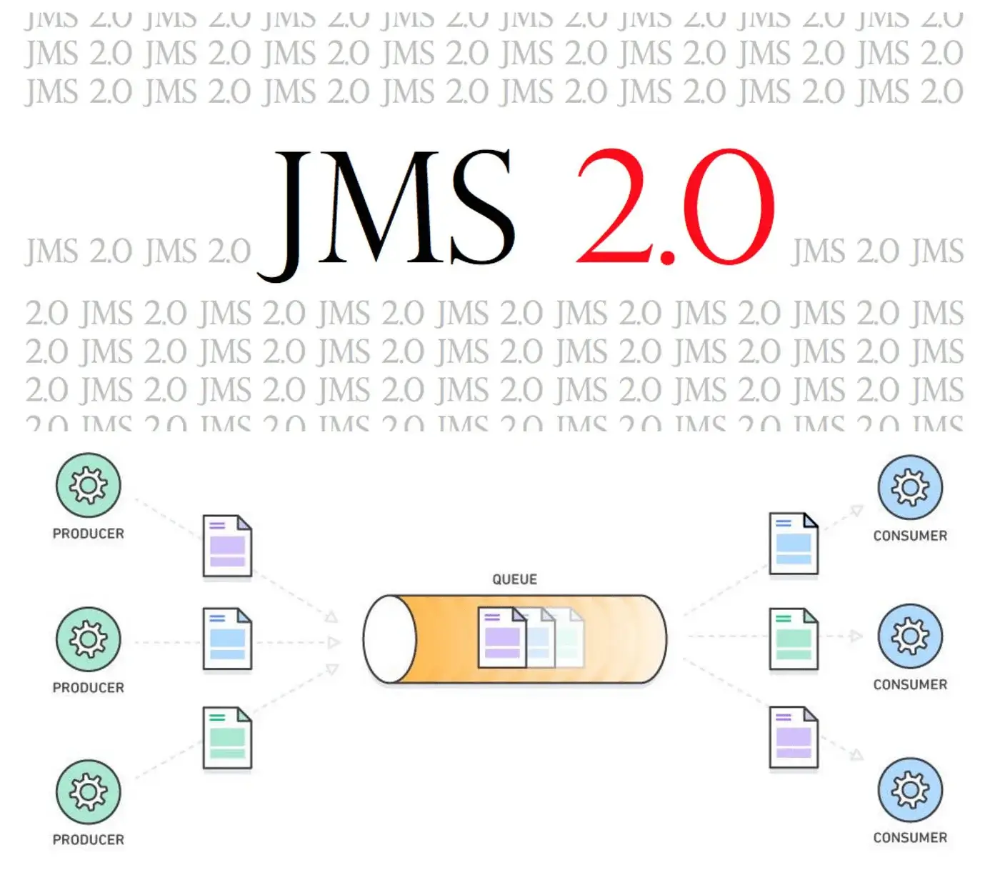

原文链接：[What is new in JMS 2.0](https://hasithah.medium.com/what-is-new-in-jms-2-0-821266fc1bf0)


在在软件集成领域，从一个软件组件到另一个软件组件进行通信是一项基本要求。虽然已经出现了许多具有这种能力的技术，但 Java 编程语言为我们提供了一个 API，以促进用 Java 编写的组件之间的消息传递。此 API 的实现将由不同的供应商（JMS 提供商）通过代理软件提供。

这个API被称为Java消息服务（JMS）。




JMS 规范的最后一次更新是在 2002 年，当时推出了**JMS 1.1**。从那时起，多年来，该 API 已在全球许多软件组件中使用，证明了其对开发人员的友好性。JMS 的下一个版本（**JMS 2.0**）于 2013 年 4 月问世，距离 1.1 版已有数年之久。

**JMS 2.0 只能与Java SE 7 及更高版本**一起使用。了解 JMS 2.0 中的新功能将会很有趣。

# 易于使用的语言功能

从语言角度来看，对 API 所做的最重大的更改是减少了开发人员需要编写的代码量。让我们将 JMS 2.0 与 1.1 进行比较，看看它们有什么区别。

## 连接和会话对象纳入单个 JMSContext

不再需要创建连接和会话对象。您可以创建 JMSContext 并直接使用它来创建消息生产者。

```java
//JMS 1.1

public void sendMessageJMS11(ConnectionFactory connectionFactory, Queue queueString text) {
   try {
      Connection connection = connectionFactory.createConnection();
      try {
         Session session =connection.createSession(false,Session.AUTO_ACKNOWLEDGE);
         MessageProducer messageProducer = session.createProducer(queue);
         TextMessage textMessage = session.createTextMessage(text);
         messageProducer.send(textMessage);
      } finally {
         connection.close();
      }
   } catch (JMSException ex) {
      / handle exception (details omitted)
   }
}

//JMS 2.0

public void sendMessageJMS20(ConnectionFactory connectionFactory, Queue queue, 
String text) {
   try (JMSContext context = connectionFactory.createContext();){
      context.createProducer().send(queue, text);
   } catch (JMSRuntimeException ex) {
      / handle exception (details omitted)
   }
}
```


## 无需调用 connection.close()

但是，无需从代码中显式调用 close。JMSContext 实现了 Java SE 7 *java.lang.AutoCloseable*接口。这意味着，如果我们在 try-with-resources 块中创建 JMSContext（这也是 Java SE 7 的一项新功能），close 方法将在该块末尾自动调用，而无需将其显式添加到代码中。

请参考上面的例子。

## 创建会话时无需传递两个参数

在 JMS 1.1 中，需要传递一个附加参数来指定会话是否是事务性的。在 JMS 2.0 中，传递 就足够了`Session.SESSION_TRANSACTED`。

```java
//JMS 1.1

Session session = connection.createSession(true,Session.SESSION_TRANSACTED);

//JMS 2.0

Session session = connection.createSession(Session.SESSION_TRANSACTED);
//JMS 2.0 - a session with Session.AUTO_ACKNOWLEDGE
Session session = connection.createSession();
```

如果我们想指定其他会话模式（本地事务、CLIENT_ACKNOWLEDGE 或 DUPS_OK_ACKNOWLEDGE），我们只需传递一个参数，而不是两个。如果您需要会话处于 Session.AUTO_ACKNOWLEDGE 模式，则无需传递任何参数，因为它是默认模式。

## 支持方法链

这大大减少了需要编写的代码量。请参考以下示例。

```java
//JMS 1.1

MessageProducer messageProducer = session.createProducer(demoQueue);
messageProducer.setPriority(1);
TextMessage textMessage = session.createTextMessage(body);
textMessage.setStringProperty("foo", "bar");
messageProducer.send(textMessage);


//JMS 2.0

TextMessage textMessage = context.createTextMessage(body); context.createProducer().setPriority(1).setProperty(“foo”, “bar”).send(demoQueue, textMessage);


//JMS 1.1

MessageProducer messageProducer = session.createProducer(demoQueue);
messageProducer.send(message1);
messageProducer.send(message2);

//JMS 2.0

context.createProducer().send(demoQueue,message1);
context.createProducer().send(demoQueue,message2);
```

## 在 Java EE 中，注入 JMSContext 意味着您不需要创建或关闭它

```java
//JMS 1.1

try {
  Connection connection = connectionFactory.createConnection();
  try {
    Session session = connection.createSession(false,Session.AUTO_ACKNOWLEDGE);
    MessageProducer messageProducer = session.createProducer(demoQueue);
    TextMessage textMessage = session.createTextMessage(body);
    messageProducer.send(textMessage);
  } finally {
    connection.close();
  }
} catch (JMSException ex) {
  ex.printStackTrace();
}

//JMS 2.0

try {
  context.createProducer().send(inboundQueue, body);
} catch (JMSRuntimeException ex){
  ex.printStackTrace();
}
```


## 发送时不需要实例化Message对象

请注意，即使您想要设置消息属性，也可以执行此操作，因为可以在 JMSProducer 上设置这些属性。

```java
//JMS 1.1

MessageProducer messageProducer = session.createProducer(demoQueue);
TextMessage textMessage = session.createTextMessage("Hello world");
messageProducer.send(textMessage);

//JMS 2.0

context.createProducer().send(demoQueue,"Hello world");
```


## 直接接收消息有效负载

同步接收时，您会得到一个 Message 对象，并且需要将其转换为适当的子类型，然后才能提取其主体。

```java
//JMS 1.1

MessageConsumer messageConsumer = session.createConsumer(demoQueue);
TextMessage textMessage = (TextMessage) messageConsumer.receive(1000);
if (textMessage==null){
  return "Received null";
} else {
  return "Received "+textMessage.getText();
}

//JMS 2.0

JMSConsumer consumer = context.createConsumer(demoQueue);
return "Received " + consumer.receiveBody(String.class, 1000);
```


## 提取邮件正文前无需进行强制类型转换

异步接收消息时，传递给 onMessage 方法的消息是 javax.jms.Message 您需要将其转换为预期的子类型，然后才能提取正文。如果消息是 ObjectMessage，则会为您提供 Serializable 正文，您必须再次将其转换为预期的正文类型。新方法`getBody`允许您从中提取正文，而`Message`无需先将其转换为适当的子类型。

```java
//JMS 1.1

Message message = consumer.receive(1000); / returns a TextMessage
String body = ((TextMessage) message).getText();

//JMS 2.0

Message message = consumer.receive(1000); / returns a TextMessage
String body = message.getBody(String.class);
```


# 五大新功能

JMS 2.0 还引入了一些新的消息传递功能。

## 1. 同一主题订阅允许多个消费者

JMS 1.1 有一个限制，即对于一个主题，只能创建一个具有特定**订阅 ID 的**订阅者。这限制了我们将负载分布在多个 JVM 和机器之间，因为我们无法创建具有相同 ID 的另一个订阅。

JMS 2.0 提供了一种解决方案。您可以使用新方法 createSharedConsumer 创建“共享”非持久订阅。此方法在 Session（对于使用经典 API 的应用程序）和 JMSContext（对于使用简化 API 的应用程序）上都可用。由于两个 JVM 需要能够识别它们需要共享的订阅，因此它们需要提供一个名称来标识共享订阅，如下所示。

```java
//non durable
MessageConsumer messageConsumer = session.createSharedConsumer(topic,"mySubscription");

//durable
MessageConsumer messageConsumer = session.createSharedDurableConsumer(topic,"myDurableSub");
```

如果您在两个单独的 JVM 中运行上述代码，则发送到主题的每条消息都将传递给两个消费者中的一个。这样他们就可以共享处理来自订阅的消息的工作。

## 2. 发送延迟

您现在可以指定消息的延迟时间。JMS 提供程序将在指定的延迟时间过去后才发送消息。

```java
MessageProducer messageProducer = session.createProducer(queue);
      messageProducer.setDeliveryDelay(20000);
      
context.createProducer().setDeliveryDelay(20000).send(queue,"Hello world");
```

## 3.异步发送消息

此功能适用于在 Java SE 或 Java EE 应用程序客户端容器中运行的应用程序。不适用于在 Java EE Web 或 EJB 容器中运行的应用程序。

通常，发送持久消息时，send 方法直到 JMS 客户端将消息发送到服务器并收到回复以通知客户端该消息已被安全接收并持久化后才会返回。我们称此为**同步发送**。

**JMS 2.0 引入了执行异步发送的**功能。异步发送消息时，发送方法会将消息发送到服务器，然后将控制权返回给应用程序，而无需等待服务器的回复。

当收到服务器返回的回复以表明消息已被服务器接收并持久保存时，JMS 提供程序将通过调用应用程序指定的 CompletionListener 对象上的回调方法 onCompletion来通知应用程序。

这对于允许连续发送大量消息而无需等待每条消息之后服务器的回复非常有用。

```java
MyCompletionListener myCompletionListener = new MyCompletionListener(latch);
context.createProducer().setAsync(myCompletionListener).send(queue,"Hello world");

latch.await();
      if (myCompletionListener.getException()==null){
         System.out.println("Reply received from server");
      } else {
         throw myCompletionListener.getException();
      }
```


## 4. JMSXDeliveryCount

JMS 2.0 允许接收消息的应用程序确定该消息被重新传送的次数。可以从消息属性 JMSXDeliveryCount 中获取此信息：

int deliveryCount = 消息.getIntProperty(“JMSXDeliveryCount”);

JMSXDeliveryCount 属性允许消费应用程序检测某条消息是否已被多次重新传送，因此在某种程度上是“坏的”。应用程序可以使用此信息采取一些特殊操作（而不是简单地触发另一次重新传送），例如消费该消息并将其发送到单独的“坏”消息队列以供管理员操作。

## 5. MDB 配置属性

需要异步接收消息的 Java EE 应用程序使用 MDB 来实现，MDB 是通过指定多个配置属性来配置的。

- **destinationLookup**：管理定义的队列或主题对象的 JNDI 名称，该对象表示 MDB 将从中接收消息的队列或主题
- **connectionFactoryLookup**：管理定义的 ConnectionFactory 对象的 JNDI 名称，MDB 将使用该对象连接到 JMS 提供程序
- **clientId：** MDB 连接到 JMS 提供程序时使用的客户端标识符
  subscriptionName：subscriptionDurability 设置为 Durable 时使用的持久订阅名称

# 来自 WSO2 的中间件

现在，[WSO2](https://wso2.com/)的[Enterprise Integrator](https://wso2.com/integration/)可立即支持 JMS 2.0。此产品可让您在发送或接收来自支持 JMS 2.0 的第三方代理上定义的队列或主题的消息时使用上述新功能。
