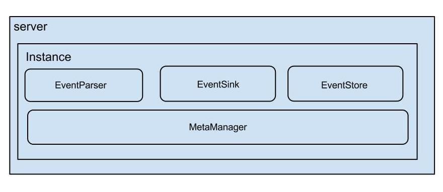
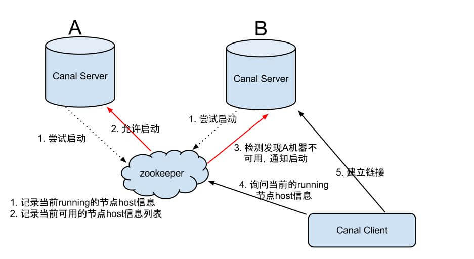

Canal 是阿里巴巴开源的一款分布式增量数据同步工具，主要用于基于 MySQL 数据库的增量日志 Binlog 解析，提供增量数据的订阅和消费。

Canal github 地址：https://github.com/alibaba/canal，目前最新版本为 [1.1.8](https://github.com/alibaba/canal/releases/tag/canal-1.1.8)，当前的 canal 支持源端 MySQL 版本包括 5.1.x、5.5.x 、5.6.x、5.7.x、8.0.x。

Canal 1.1.1版本之后，默认支持将canal server接收到的binlog数据直接投递到MQ。目前默认支持的MQ系统有:

- Kafka: https://github.com/apache/kafka
- RocketMQ : https://github.com/apache/rocketmq
- RabbitMQ : https://github.com/rabbitmq/rabbitmq-server
- Pulsarmq : https://github.com/apache/pulsar

## Canal 原理

Canal 通过模拟 MySQL slave 的交互协议，伪装自己为 MySQL slave，向 MySQL master 发送 dump 协议。MySQL master 收到 dump 请求后，开始推送 binary log 给 slave（即 Canal）。Canal 解析 binary log 对象（原始为 byte 流），从而实现增量数据的订阅和消费。

Canal 架构说明，参考 [文章](https://github.com/alibaba/canal/wiki/%E7%AE%80%E4%BB%8B#%E6%9E%B6%E6%9E%84)。



说明：

- server代表一个canal运行实例，对应于一个jvm
- instance对应于一个数据队列 （1个server对应1..n个instance)

instance模块：

- eventParser (数据源接入，模拟slave协议和master进行交互，协议解析)
- eventSink (Parser和Store链接器，进行数据过滤，加工，分发的工作)
- eventStore (数据存储)
- metaManager (增量订阅&消费信息管理器)

## MySQL 的 Binlog

MySQL 的 Binlog（Binary Log）是 MySQL 数据库用于记录所有更改数据操作的日志文件，包括数据库的插入、更新、删除等操作。Binlog 主要用于数据库的增量备份、数据恢复、主从复制等场景。

Binlog 的作用：

- **数据恢复**：通过 Binlog 可以恢复数据库到某个时间点的状态，用于灾难恢复。
- **主从复制**：在主从复制架构中，从库通过读取主库的 Binlog 来同步数据，确保数据一致性。
- **增量备份**：定期备份 Binlog，可以实现增量备份，减少全量备份的频率和数据量。

MySQL 提供了三种主要的 Binlog 格式：

- **Statement**：记录 SQL 语句，适用于简单的操作，但可能在某些情况下无法精确还原数据。
- **Row**：记录每一行数据的变化，适用于复杂操作，确保数据一致性。
- **Mixed**：结合了 Statement 和 Row 的优点，根据操作类型自动选择合适的日志格式。

Binlog 的模式

- **OFF**：不记录 Binlog，适用于不需要日志的场景。
- **ROW**：记录每一行数据的变化，确保数据一致性。
- **STATEMENT**：记录 SQL 语句，适用于简单的操作。

可以通过以下命令查看 Binlog 文件的内容：

```bash
mysqlbinlog binlog_file_name
```

Binlog 的管理：

- **查看 Binlog 文件**：使用 `SHOW BINARY LOGS` 命令查看当前 MySQL 实例中的所有 Binlog 文件。
- **备份 Binlog 文件**：定期备份 Binlog 文件，用于增量备份和数据恢复。
- **配置 Binlog 保留策略**：通过 `expire_logs_days` 参数配置 Binlog 文件的保留天数。在 MySQL 8.0 版本中，推荐使用 `binlog_expire_logs_seconds` 参数。

## 安装和配置

### 配置 mysql

通过 docker-compose 安装 MySQL，在 MySQL 中开启 Binlog，用于记录数据库的增量变化。

```yaml
  chensoul-mysql:
    image: mysql:8
    restart: always
    container_name: chensoul-mysql
    command: [
      'mysqld',
      '--log-bin=mysql-bin',
      '--binlog_format=ROW',
      '--default-time-zone=+8:00',
      '--lower-case-table-names=1'
    ]
    environment:
      MYSQL_ROOT_HOST: "%"
      MYSQL_ROOT_PASSWORD: root
    healthcheck:
      test: [ "CMD", "mysqladmin" ,"ping", "-h", "localhost" ]
      interval: 5s
      timeout: 2s
      retries: 10
    ports:
      - "3306:3306
```

查看状态：

```sql
mysql -u root -p
> show variables like 'log_%';

> show variables like 'binlog_format';

> SHOW BINARY LOGS
```

### 创建 canal 用户

```sql
mysql -u root -p
> CREATE USER canal IDENTIFIED BY 'canal';
> GRANT SELECT, REPLICATION SLAVE, REPLICATION CLIENT ON *.* TO 'canal'@'%';
> FLUSH PRIVILEGES;
```

### 安装 canal-server

通过 docker-compose 安装

```yaml
  chensoul-canal-server:
    image: canal/canal-server
    container_name: chensoul-canal-server
    ports:
      - "11111:11111"
    environment:
      - canal.auto.scan=false
      - canal.instance.mysql.slaveId=123
      - canal.instance.master.address=chensoul-mysql:3306
      - canal.instance.dbUsername=canal
      - canal.instance.dbPassword=canal
      - canal.instance.filter.regex=.*\\..*
      - canal.destinations=test
      - canal.instance.tsdb.enable=false
      - canal.instance.connectionCharset=UTF-8
```

注意：

- canal.instance.filter.regex 指定需要同步的表
- canal.destinations 指定实例名称。客户端连接 canal 时，需要指定实例名称。

### 安装 canal-admin

在 mysql 数据库里创建 canal_manager ，并执行 [sql 语句](https://github.com/alibaba/canal/blob/master/admin/admin-web/src/main/resources/canal_manager.sql)。

```sql
wget https://raw.githubusercontent.com/alibaba/canal/refs/heads/master/admin/admin-web/src/main/resources/canal_manager.sql;

mysql -u root -p
> create database canal_manager;
> GRANT ALL PRIVILEGES ON canal_manager TO 'canal'@'%';
> FLUSH PRIVILEGES;
> use canal_manager;
> source canal_manager.sql;
```


通过 docker-compose 安装 canal-admin：

```yaml
  chensoul-canal-admin:
    image: canal/canal-admin
    container_name: chensoul-canal-admin
    ports:
      - "8089:8089"
    environment:
      - canal.adminUser=admin
      - canal.adminPasswd=123456
      - spring.datasource.url=jdbc:mysql://chensoul-mysql:3306/canal_manager?autoReconnect=true&useUnicode=true
      - spring.datasource.username=canal
      - spring.datasource.password=canal
```

## 客户端配置

配置 CanalConnector：

```java
@Configuration
@EnableScheduling
@EnableAsync
public class CanalConfig {

	@Value("${canal.server.ip}")
	private String canalServerIp;

	@Value("${canal.server.port}")
	private int canalServerPort;

	@Value("${canal.server.username:canal}")
	private String username;

	@Value("${canal.server.password:canal}")
	private String password;

	@Value("${canal.destinations:test}")
	private String destination;

	@Bean("newSingleConnector")
	public CanalConnector newSingleConnector() {
		return CanalConnectors.newSingleConnector(new InetSocketAddress(canalServerIp,
			canalServerPort), destination, username, password);
	}
}
```

注意：

- canal.destinations 的值和 canal-server 的配置中 canal.destinations  保持一致。

定时获取 canal 数据：

```java
@Service
@Slf4j
public class CanalRunner {
	int BATCH_SIZE = 5 * 1024;
	@Resource
	private CanalConnector connector;

	private static void printEntry(List<CanalEntry.Entry> entrys) {
		for (CanalEntry.Entry entry : entrys) {
			/开启/关闭事务的实体类型，跳过
			if (entry.getEntryType() == CanalEntry.EntryType.TRANSACTIONBEGIN || entry.getEntryType() == CanalEntry.EntryType.TRANSACTIONEND) {
				continue;
			}
			CanalEntry.RowChange rowChage;
			try {
				rowChage = CanalEntry.RowChange.parseFrom(entry.getStoreValue());
			} catch (Exception e) {
				throw new RuntimeException("ERROR ## parser of eromanga-event has an error , data:" + entry.toString(), e);
			}
			CanalEntry.EventType eventType = rowChage.getEventType();
			if (rowChage.getIsDdl()) {
				log.info("binlog: {}:{}, table: {}.{}, eventType: {}, ddlSql: {}", entry.getHeader().getLogfileName(), entry.getHeader().getLogfileOffset(),
					entry.getHeader().getSchemaName(), entry.getHeader().getTableName(), eventType, rowChage.getSql());
			} else {
				log.info("binlog: {}:{}, table: {}.{}, eventType: {}", entry.getHeader().getLogfileName(), entry.getHeader().getLogfileOffset(),
					entry.getHeader().getSchemaName(), entry.getHeader().getTableName(), eventType);
			}

			/获取RowChange对象里的每一行数据，打印出来
			for (CanalEntry.RowData rowData : rowChage.getRowDatasList()) {
				log.info("eventType:{}", eventType);

				if (eventType == CanalEntry.EventType.DELETE) {
					printColumn(rowData.getAfterColumnsList());
				} else if (eventType == CanalEntry.EventType.INSERT) {
					printColumn(rowData.getAfterColumnsList());
				} else {
					printColumn(rowData.getBeforeColumnsList());
					printColumn(rowData.getAfterColumnsList());
				}
			}
		}
	}

	private static void printColumn(List<CanalEntry.Column> columns) {
		for (CanalEntry.Column column : columns) {
			System.out.println(column.getName() + ": " + column.getValue() + ",updated=" + column.getUpdated());
		}
	}

	@PostConstruct
	public void connect() {
		connector.connect();
		connector.subscribe(); / 监听所有的表结构
		connector.rollback();
	}

	@Async
	@Scheduled(initialDelayString = "${canal.scheduled.initialDelay:2000}", fixedDelayString = "${canal.scheduled.fixedDelay:2000}")
	public void processData() {
		try {
			if (!connector.checkValid()) {
				log.warn("与Canal服务器的连接失效！！！重连，下个周期再检查数据变更");
				this.connect();
			} else {
				Message message = connector.getWithoutAck(BATCH_SIZE);
				long batchId = message.getId();
				int size = message.getEntries().size();
				if (batchId == -1 || size == 0) {
					log.info("本次[{}]没有检测到数据更新。", batchId);
				} else {
					log.info("本次[{}]数据共有[{}]次更新需要处理", batchId, size);
					printEntry(message.getEntries());

					connector.ack(batchId); / 提交确认
					log.info("本次[{}]处理Canal同步数据完成", batchId);
				}
			}
		} catch (Exception e) {
			log.error("处理Canal同步数据失效，请检查：", e);
		}
	}

	@PreDestroy
	public void disConnect() {
		connector.disconnect();
	}
}
```

说明：

- `connector.subscribe()`：客户端订阅，重复订阅时会更新对应的filter信息：
  - 如果本次订阅中filter信息为空，则直接使用canal server服务端配置的filter信息
  - 如果本次订阅中filter信息不为空，目前会直接替换canal server服务端配置的filter信息，以本次提交的为准

## 客户端适配器

Canal 的 ClientAdapter 是一个用于数据同步的组件，它提供了多种数据源的适配功能，支持将数据从 MySQL 同步到其他数据存储系统，如关系型数据库、HBase、ElasticSearch 等。

ClientAdapter 的下载链接在 github release 页面，比如 https://github.com/alibaba/canal/releases/tag/canal-1.1.8，目前官方没有提供 docker 镜像。

ClientAdapter 功能：

- **数据同步**：支持将数据从 MySQL 同步到关系型数据库、HBase、ElasticSearch 等。
- **日志适配**：提供日志打印功能，便于调试和监控。
- **ETL 功能**：支持表对表的数据同步和 ETL 功能。
- **REST 管理接口**：提供 REST 接口，用于管理数据同步任务。

## Canal 集群模式

Canal 集群模式是一种高可用的部署方式，用于确保在单个实例失效时服务仍能持续运行。

高可用性机制：

- **Canal Server**：在 Canal 集群中，不同服务器上的实例（instance）要求同一时间只能有一个处于 running 状态，其他实例处于 standby 状态。这种机制确保了对 MySQL dump 的请求不会过于频繁。
- **Canal Client**：为了保证有序性，一份实例同一时间只能由一个 Canal Client 进行远程操作（如 get/ack/rollback 等），否则客户端接收无法保证有序。
- **Zookeeper 协调**：整个 HA 机制的控制主要依赖 Zookeeper 的特性，包括 watcher 和 EPHEMERAL 节点（与 session 生命周期绑定）。Zookeeper 负责协调 Canal Server 和 Client 的状态，确保高可用性。



canal server HA 步骤：

1. canal server要启动某个canal instance时都先向zookeeper进行一次尝试启动判断 (实现：创建EPHEMERAL节点，谁创建成功就允许谁启动)
2. 创建zookeeper节点成功后，对应的canal server就启动对应的canal instance，没有创建成功的canal instance就会处于standby状态。
3. 一旦zookeeper发现canal server A创建的节点消失后，立即通知其他的canal server再次进行步骤1的操作，重新选出一个canal server启动instance。
4. canal client每次进行connect时，会首先向zookeeper询问当前是谁启动了canal instance，然后和其建立链接，一旦链接不可用，会重新尝试connect。

Canal Client的方式和canal server方式类似，也是利用zookeeper的抢占EPHEMERAL节点的方式进行控制。

以下是一个典型的 Canal 集群配置示例：

```ini
canal.zkServers = 192.168.56.121:2181
canal.destinations = test
canal.auto.scan = true
```

这个配置指定了 Zookeeper 服务器地址、实例名称，并启用了自动扫描功能。

客户端连接 canal server 时，可以使用下面 api：

```java
/ 创建带cluster模式的客户端链接，自动完成failover切换
CanalConnector newClusterConnector(List<? extends SocketAddress> addresses, String destination,String username, String password)
  
/ 创建带cluster模式的客户端链接，自动完成failover切换，服务器列表自动扫描
CanalConnector newClusterConnector(String zkServers, String destination, String username, String password)
```

## 常见问题

### Canal 如何保证顺序性？

Canal 通过以下机制保证顺序性：

Canal Server 机制：

- **高可用架构**：Canal Server 采用高可用集群架构，通过 Zookeeper 协调多个 Canal Server 实例。同一时间，只有一个 Canal Server 实例处于 running 状态，其他实例处于 standby 状态。这样可以减少对 MySQL dump 的请求，同时保证数据同步的顺序性。
- **故障转移**：如果某个 Canal Server 实例发生故障，Zookeeper 会检测到该实例对应的临时节点消失，并触发故障转移机制。其他健康的 Canal Server 实例会竞争接管故障实例的工作，确保数据同步服务的不间断运行。

Canal Client 机制：

- **有序监听**：Canal Client 通过与 Zookeeper 交互，确保同一时间只有一个 Canal Client 能够进行 get/ack/rollback 等远程操作，从而保证客户端接收数据的有序性。

与消息队列的结合：

- **有序发送**：Canal 支持将数据发送到 Kafka 或 RocketMQ 等消息队列。通过合理配置消息队列的分区数量（`canal.mq.partitionsNum`）和分区哈希规则（`canal.mq.partitionHash`），可以确保同一实体的变更进入同一个分区，从而保证其有序性。
- **顺序存储与消费**：在消息队列中，同一分区内的消息是有序的。只要保证同一实体的变更进入同一个分区，就能保证其有序性。

数据同步机制：

- **位点管理**：Canal 会记录每个数据同步任务已经消费到的 binary log 位点（position），并在 Zookeeper 中持久化这些信息。当 Canal Server 实例发生故障时，新的接管实例可以从上次消费的位点继续同步数据，确保数据不丢失。
- **事件顺序保障**：Canal 会严格按照 binary log 中事件的顺序进行同步，确保数据的一致性和完整性。
