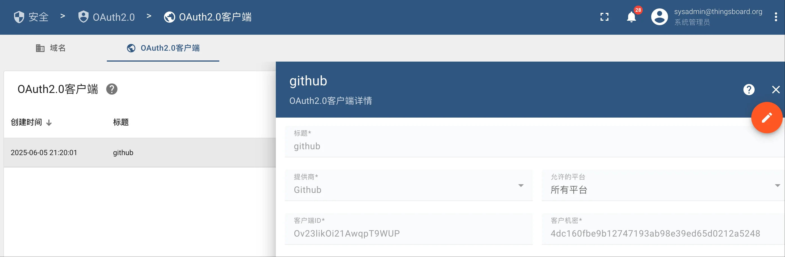
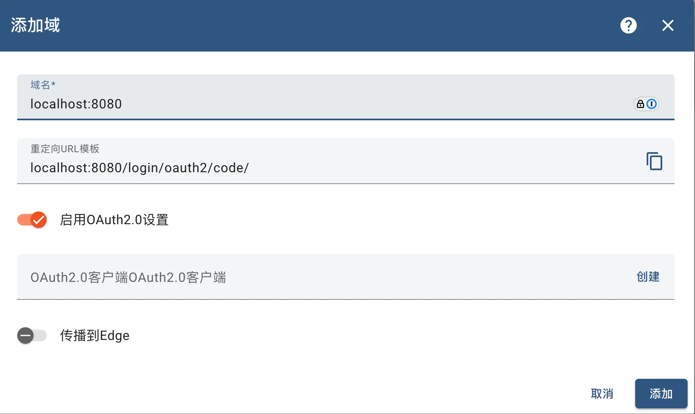
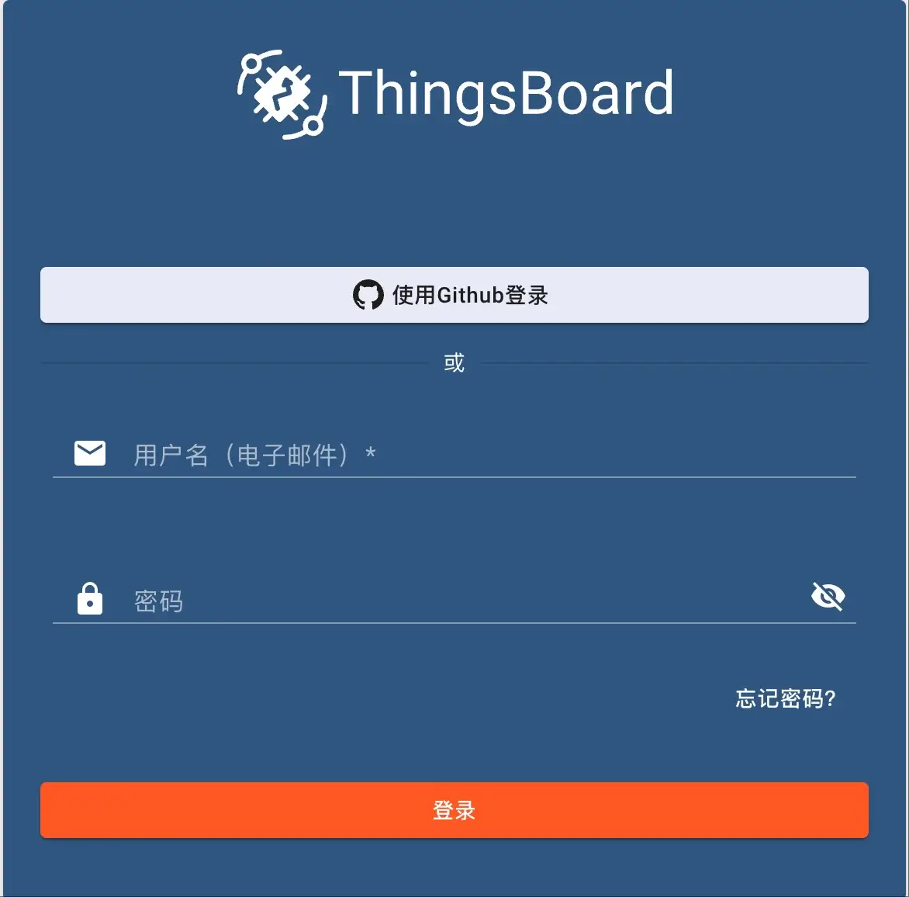

## Thingsboard 启用 OAuth2 功能

使用 [sysadmin@thingsboard.org](mailto:sysadmin@thingsboard.org) / sysadmin 账号登录 Thingsboard 系统之后，在安全 -> OAuth2.0 页面，点击OAuth2.0客户端，先创建一个客户端，这里我创建的是 Github 客户端。

<!--more-->



然后，创建一个域：



域名的名称可以是 ip 加端口，也可以是域名，如果是名称，需要做好 DNS 解析。

> 注意：
>
> 这里的重定向 URL 模版是 `localhost:8080/login/oauth2/code/`，而不是 `localhost:8080/login/oauth2/code/{registrationId}`。


注销登录之后，在登录页面可以看到 使用 Github 登录的按钮。



## 源码实现

Thingsboard OAuth2 的相关配置在 ThingsboardSecurityConfiguration 类的 filterChain(HttpSecurity http) 方法中。

```java
				if (oauth2Configuration != null) {
            http.oauth2Login(login -> login
                    .authorizationEndpoint(config -> config
                            .authorizationRequestRepository(httpCookieOAuth2AuthorizationRequestRepository)
                            .authorizationRequestResolver(oAuth2AuthorizationRequestResolver))
                    .loginPage("/oauth2Login")
                    .loginProcessingUrl(oauth2Configuration.getLoginProcessingUrl())
                    .successHandler(oauth2AuthenticationSuccessHandler)
                    .failureHandler(oauth2AuthenticationFailureHandler));
        }
```

以上代码对 OAuth2 Login 配置了 5 ：

- loginProcessingUrl：处理登录请求的地址，默认值为 "/login/oauth2/code/*"，该地址由 OAuth2LoginAuthenticationFilter 过滤器使用正则表达式进行批判和处理。
- loginPage：登录页面地址。

- httpCookieOAuth2AuthorizationRequestRepository：持久化 OAuth2AuthorizationRequest，默认是使用 Seesion 持久化，对应实现类是 HttpSessionOAuth2AuthorizationRequestRepository。Thingsboard 提供了 HttpCookieOAuth2AuthorizationRequestRepository 使用 Cookie  来持久化 。
- oAuth2AuthorizationRequestResolver：从 Request 中解析 OAuth2AuthorizationRequest，默认实现是 DefaultOAuth2AuthorizationRequestResolver。Thingsboard 使用 CustomOAuth2AuthorizationRequestResolver 重写了该类。
- oauth2AuthenticationSuccessHandler：登录成功处理器
- oauth2AuthenticationFailureHandler：登录失败处理器

OAuth2Configuration 类上也 @Configuration 注解，在应用启动过程中会由 SpringBoot 自动装配。

```java
@Configuration
@ConfigurationProperties(prefix = "security.oauth2")
@Data
public class OAuth2Configuration {
    private String loginProcessingUrl;
    private Map<String, String> githubMapper;
}
```

其默认值在 thingsboard.yml：

```yaml
# Security parameters
security:
  oauth2:
    # Redirect URL where access code from external user management system will be processed
    loginProcessingUrl: "${SECURITY_OAUTH2_LOGIN_PROCESSING_URL://login/oauth2/code/}"
    githubMapper:
      # The email addresses that will be mapped from the URL
      emailUrl: "${SECURITY_OAUTH2_GITHUB_MAPPER_EMAIL_URL_KEY:https://api.github.com/user/emails}"
```

CustomOAuth2AuthorizationRequestResolver 相对于默认实现 DefaultOAuth2AuthorizationRequestResolver 的主要修改之处在于代expandRedirectUri 方法：

```java
		private String expandRedirectUri(HttpServletRequest request, ClientRegistration clientRegistration, String action) {
        //.....

        String redirectUri = getRedirectUri(request);
        log.trace("Redirect URI - {}.", redirectUri);

        return UriComponentsBuilder.fromUriString(redirectUri)
                .buildAndExpand(uriVariables)
                .toUriString();
    }
```

DefaultOAuth2AuthorizationRequestResolver 中获取的重定向地址为 ClientRegistration 中的 redirectUri 值（`localhost:8080/login/oauth2/code/{registrationId}`），而 CustomOAuth2AuthorizationRequestResolver 将其修改为了 

`localhost:8080/login/oauth2/code/`。

通过调试代码，可以发现 OAuth2LoginAuthenticationFilter、CustomOAuth2AuthorizationRequestResolver、HttpCookieOAuth2AuthorizationRequestRepository 调用顺序如下：

```java
OAuth2AuthorizationRequestRedirectFilter 
  -> CustomOAuth2AuthorizationRequestResolver 
  	 -> OAuth2LoginAuthenticationFilter  
  			-> HttpCookieOAuth2AuthorizationRequestRepository
```

这里涉及到 OAuth2 的过滤器调用顺序，在 ThingsboardSecurityConfiguration 类的 @EnableWebSecurity 注解上添加 `(debug = true)`打开调试模式，重新启动应用，或者观察日志输出。

```
Securing GET /oauth2/authorization/c9494410-420f-11f0-951d-e335fb26d32c
Invoking DisableEncodeUrlFilter (1/20)
Invoking WebAsyncManagerIntegrationFilter (2/20)
Invoking SecurityContextHolderFilter (3/20)
Invoking CorsFilter (4/20)
Invoking LogoutFilter (5/20)
Invoking OAuth2AuthorizationRequestRedirectFilter (6/20)
Securing GET /login/oauth2/code?code=dbf3e2bb44683ffd2d2f&state=azMRmzAZY_qd5owaQmxekq_YNcvM80yqsQZrCweAaN4%3D
Invoking DisableEncodeUrlFilter (1/20)
Invoking WebAsyncManagerIntegrationFilter (2/20)
Invoking SecurityContextHolderFilter (3/20)
Invoking CorsFilter (4/20)
Invoking LogoutFilter (5/20)
Invoking OAuth2AuthorizationRequestRedirectFilter (6/20)
Invoking OAuth2LoginAuthenticationFilter (7/20)
Invoking AuthExceptionHandler (8/20)
Invoking RestLoginProcessingFilter (9/20)
Invoking RestPublicLoginProcessingFilter (10/20)
Invoking JwtTokenAuthenticationProcessingFilter (11/20)
Invoking RefreshTokenProcessingFilter (12/20)
Invoking PayloadSizeFilter (13/20)
Invoking RateLimitProcessingFilter (14/20)
Invoking RequestCacheAwareFilter (15/20)
Invoking SecurityContextHolderAwareRequestFilter (16/20)
Invoking AnonymousAuthenticationFilter (17/20)
Invoking SessionManagementFilter (18/20)
Invoking ExceptionTranslationFilter (19/20)
Invoking AuthorizationFilter (20/20)
```

在登录页面，点击 github 登录按钮，访问的是 /oauth2/authorization/c9494410-420f-11f0-951d-e335fb26d32c 请求，该请求经过一系列的过滤器，其中 OAuth2AuthorizationRequestRedirectFilter 过滤器会对用 authorizationRequestResolver 生成 OAuth2AuthorizationRequest 对象，让后进行重定向。

```java
protected void doFilterInternal(HttpServletRequest request, HttpServletResponse response, FilterChain filterChain)
       throws ServletException, IOException {
    try {
       OAuth2AuthorizationRequest authorizationRequest = this.authorizationRequestResolver.resolve(request);
       if (authorizationRequest != null) {
          this.sendRedirectForAuthorization(request, response, authorizationRequest);
          return;
       }
    }
    catch (Exception ex) {
       AuthenticationException wrappedException = new OAuth2AuthorizationRequestException(ex);
       this.authenticationFailureHandler.onAuthenticationFailure(request, response, wrappedException);
       return;
    }
  
}  
```

CustomOAuth2AuthorizationRequestResolver 解析出来的重定向的地址为 /login/oauth2/code?code=dbf3e2bb44683ffd2d2f&state=azMRmzAZY_qd5owaQmxekq_YNcvM80yqsQZrCweAaN4%3D，然后该请求又经过一系列的过滤器，直到遇到 OAuth2LoginAuthenticationFilter ，OAuth2LoginAuthenticationFilter 拿到拼装后的 github 授权地址 https://github.com/login/oauth/authorize?response_type=code&client_id=Ov23likOi21AwqpT9WUP&scope=read:user%20user:email&state=5wYRD23XSe4xSqV-Qfp3phlhxfMrA4cnF_sTh8IkjTs%3D&redirect_uri=http://localhost:8080/login/oauth2/code/c9494410-420f-11f0-951d-e335fb26d32c ，调用 authenticationManager 进行认证。

```java
	/ OAuth2LoginAuthenticationFilter 的 attemptAuthentication 方法代码片段
	String redirectUri = UriComponentsBuilder.fromHttpUrl(UrlUtils.buildFullRequestUrl(request))
				.replaceQuery(null)
				.build()
				.toUriString();
		/ @formatter:on
		OAuth2AuthorizationResponse authorizationResponse = OAuth2AuthorizationResponseUtils.convert(params,
				redirectUri);
		Object authenticationDetails = this.authenticationDetailsSource.buildDetails(request);
		OAuth2LoginAuthenticationToken authenticationRequest = new OAuth2LoginAuthenticationToken(clientRegistration,
				new OAuth2AuthorizationExchange(authorizationRequest, authorizationResponse));
		authenticationRequest.setDetails(authenticationDetails);
		OAuth2LoginAuthenticationToken authenticationResult = (OAuth2LoginAuthenticationToken) this
			.getAuthenticationManager()
			.authenticate(authenticationRequest);
```

OAuth2AuthorizationRequestRedirectFilter 和 OAuth2LoginAuthenticationFilter 之间的联系就在于 loginProcessingUrl 。不管 loginProcessingUrl 长成什么样，OAuth2LoginAuthenticationFilter 都能通过 requiresAuthenticationRequestMatcher 匹配到地址并进行处理。

因此，将 thingsboard.yml 中的 loginProcessingUrl 修改为 /login/oauth2/code/{registrationId}，应用也能正常启动。

```yaml
# Security parameters
security:
  oauth2:
    # Redirect URL where access code from external user management system will be processed
    loginProcessingUrl: "${SECURITY_OAUTH2_LOGIN_PROCESSING_URL://login/oauth2/code/{registrationId}}"
```

OAuth2LoginAuthenticationFilter 通过 AuthorizationRequestRepository 可以取到 OAuth2AuthorizationRequest 对象，通过 authorizationRequest 的参数可以获取到 registrationId，然后，通过 clientRegistrationRepository 可以查询到 ClientRegistration 对象。

```java
@Override
	public Authentication attemptAuthentication(HttpServletRequest request, HttpServletResponse response)
			throws AuthenticationException {
		MultiValueMap<String, String> params = OAuth2AuthorizationResponseUtils.toMultiMap(request.getParameterMap());
		if (!OAuth2AuthorizationResponseUtils.isAuthorizationResponse(params)) {
			OAuth2Error oauth2Error = new OAuth2Error(OAuth2ErrorCodes.INVALID_REQUEST);
			throw new OAuth2AuthenticationException(oauth2Error, oauth2Error.toString());
		}
		OAuth2AuthorizationRequest authorizationRequest = this.authorizationRequestRepository
			.removeAuthorizationRequest(request, response);
		if (authorizationRequest == null) {
			OAuth2Error oauth2Error = new OAuth2Error(AUTHORIZATION_REQUEST_NOT_FOUND_ERROR_CODE);
			throw new OAuth2AuthenticationException(oauth2Error, oauth2Error.toString());
		}
		String registrationId = authorizationRequest.getAttribute(OAuth2ParameterNames.REGISTRATION_ID);
		ClientRegistration clientRegistration = this.clientRegistrationRepository.findByRegistrationId(registrationId);
    /....
}    
```

在 thingsboard 中 clientRegistrationRepository 的实现者是 HybridClientRegistrationRepository，当然，默认实现是 InMemoryClientRegistrationRepository。InMemoryClientRegistrationRepository 是从 spring boot 配置文件中读取，例如：下面的配置定义了三个 ClientRegistration 对象，他们的 registrationId 分别是 google、github、okta，而不是 thingsboard 中自定义的 UUID 字符串。

```yaml
spring:
  security:
    oauth2:
      client:
        registration:
          google:
            client-id: your-app-client-id
            client-secret: your-app-client-secret
            scope:
              - email
              - profile
          github:
            client-id: ${GITHUB_CLIENT_ID:Ov23likOi21AwqpT9WUP}
            client-secret: ${GITHUB_CLIENT_SECRET:2cd0d78fe7a1c34add13c3452fd94c75db70995f}
            scope:
              - user:email
              - read:user
          okta:
            client-id: your-app-client-id
            client-secret: your-app-client-secret
        provider:
          google:
            user-name-attribute: email
          github:
            user-name-attribute: login
          okta:
            authorization-uri: https://your-subdomain.oktapreview.com/oauth2/v1/authorize
            token-uri: https://your-subdomain.oktapreview.com/oauth2/v1/token
            user-info-uri: https://your-subdomain.oktapreview.com/oauth2/v1/userinfo
            jwk-set-uri: https://your-subdomain.oktapreview.com/oauth2/v1/keys

```

假如修改下 thingsboard 源码，将 registrationId 改为使用认证提供商的名称（小写形式），则和配置文件中一样了。

再来看 HybridClientRegistrationRepository 的实现。

```java
@Component
public class HybridClientRegistrationRepository implements ClientRegistrationRepository {
    private static final String defaultRedirectUriTemplate = "{baseUrl}/login/oauth2/code/{registrationId}";

    @Autowired
    private OAuth2ClientService oAuth2ClientService;

    @Override
    public ClientRegistration findByRegistrationId(String registrationId) {
        OAuth2Client oAuth2Client = oAuth2ClientService.findOAuth2ClientById(TenantId.SYS_TENANT_ID, new OAuth2ClientId(UUID.fromString(registrationId)));
        return oAuth2Client == null ?
                null : toSpringClientRegistration(oAuth2Client);
    }

    private ClientRegistration toSpringClientRegistration(OAuth2Client oAuth2Client){
    	//...
    }
}
```

HybridClientRegistrationRepository 内部使用 OAuth2ClientService 来获取 OAuth2Client 再转换为 ClientRegistration。因此，可以使用编程的方式来动态维护 ClientRegistration 了。

在 thingsboard 中，OAuth2Client 主要字段如下：

```java
@Data
public class OAuth2Client {
    private UUID tenantId;
    private String title;
    private String clientId;
    private String clientSecret;
    private OAuth2MapperConfig mapperConfig;
    private String authorizationUri;
    private String tokenUri;
    private String scope;
    private String platforms;
    private String userInfoUri;
    private String userNameAttributeName;
    private String jwkSetUri;
    private String clientAuthenticationMethod;
    private String loginButtonLabel;
    private String loginButtonIcon;
    private Boolean activateUser;
    private MapperType type;
    private String emailAttributeKey;
    private String firstNameAttributeKey;
    private String lastNameAttributeKey;
    private TenantNameStrategyType tenantNameStrategy;
    private String tenantNamePattern;
    private String customerNamePattern;
    private String url;
    private String username;
    private String password;
    private Boolean sendToken;
    private JsonNode additionalInfo;
}
```

OAuth2MapperConfig 是映射配置：

```java
@Data
public class OAuth2MapperConfig {
    private boolean allowUserCreation;
    private boolean activateUser;
    private MapperType type;
    private OAuth2BasicMapperConfig basic;
    private OAuth2CustomMapperConfig custom;
}

public enum MapperType {
    BASIC, CUSTOM, GITHUB, APPLE;
}
```

映射类型有四种： BASIC, CUSTOM, GITHUB, APPLE，在创建 OAuth2Client 对象时，thingsboard 针对这四种类型做了一个模版 OAuth2ClientRegistrationTemplate，用于简化和统一创建流程。

OAuth2ClientRegistrationTemplate 类主要字段：

```java
@Data
public class OAuth2ClientRegistrationTemplate {
    private String providerId;
    private String authorizationUri;
    private String tokenUri;
    private String scope;
    private String userInfoUri;
    private String userNameAttributeName;
    private String jwkSetUri;
    private String clientAuthenticationMethod;
    private MapperType type;
    private String emailAttributeKey;
    private String firstNameAttributeKey;
    private String lastNameAttributeKey;
    private TenantNameStrategyType tenantNameStrategy;
    private String tenantNamePattern;
    private String customerNamePattern;
    private String comment;
    private String loginButtonIcon;
    private String loginButtonLabel;
    private String helpLink;

    private JsonNode additionalInfo;
}
```

另外，thingsboar 在安装部署时进行了初始化，提前创建了一些模版。模版在 application/src/main/data/json/system/ oauth2_config_templates 目录下面，主要有 apple、facebook、google、github。

apple_config.json

```json
{
  "providerId": "Apple",
  "additionalInfo": null,
  "accessTokenUri": "https://appleid.apple.com/auth/token",
  "authorizationUri": "https://appleid.apple.com/auth/authorize?response_mode=form_post",
  "scope": ["email","openid","name"],
  "jwkSetUri": "https://appleid.apple.com/auth/keys",
  "userInfoUri": null,
  "clientAuthenticationMethod": "POST",
  "userNameAttributeName": "email",
  "mapperConfig": {
    "type": "APPLE",
    "basic": {
      "emailAttributeKey": "email",
      "firstNameAttributeKey": "firstName",
      "lastNameAttributeKey": "lastName",
      "tenantNameStrategy": "DOMAIN"
    }
  },
  "comment": null,
  "loginButtonIcon": "apple-logo",
  "loginButtonLabel": "Apple",
  "helpLink": "https://developer.apple.com/sign-in-with-apple/get-started/"
}
```

facebook_config.json：

```json
{
  "providerId": "Facebook",
  "accessTokenUri": "https://graph.facebook.com/v2.8/oauth/access_token",
  "authorizationUri": "https://www.facebook.com/v2.8/dialog/oauth",
  "scope": ["email","public_profile"],
  "jwkSetUri": null,
  "userInfoUri": "https://graph.facebook.com/me?fields=id,name,first_name,last_name,email",
  "clientAuthenticationMethod": "BASIC",
  "userNameAttributeName": "email",
  "mapperConfig": {
    "type": "BASIC",
    "basic": {
      "emailAttributeKey": "email",
      "firstNameAttributeKey": "first_name",
      "lastNameAttributeKey": "last_name",
      "tenantNameStrategy": "DOMAIN"
    }
  },
  "comment": null,
  "loginButtonIcon": "facebook-logo",
  "loginButtonLabel": "Facebook",
  "helpLink": "https://developers.facebook.com/docs/facebook-login/web#logindialog"
}
```

github_config.json：

```json
{
  "providerId": "Github",
  "accessTokenUri": "https://github.com/login/oauth/access_token",
  "authorizationUri": "https://github.com/login/oauth/authorize",
  "scope": ["read:user","user:email"],
  "jwkSetUri": null,
  "userInfoUri": "https://api.github.com/user",
  "clientAuthenticationMethod": "BASIC",
  "userNameAttributeName": "login",
  "mapperConfig": {
    "type": "GITHUB",
    "basic": {
      "firstNameAttributeKey": "name",
      "tenantNameStrategy": "DOMAIN"
    }
  },
  "comment": "In order to log into ThingsBoard you need to have user's email. You may configure and use Custom OAuth2 Mapper to get email information. Please refer to <a href=\"https://docs.github.com/en/rest/reference/users#list-email-addresses-for-the-authenticated-user\">Github Documentation</a>",
  "loginButtonIcon": "github-logo",
  "loginButtonLabel": "Github",
  "helpLink": "https://docs.github.com/en/developers/apps/creating-an-oauth-app"
}

```

google_config.json：

```json
{
  "providerId": "Google",
  "additionalInfo": null,
  "accessTokenUri": "https://oauth2.googleapis.com/token",
  "authorizationUri": "https://accounts.google.com/o/oauth2/v2/auth",
  "scope": ["email","openid","profile"],
  "jwkSetUri": "https://www.googleapis.com/oauth2/v3/certs",
  "userInfoUri": "https://openidconnect.googleapis.com/v1/userinfo",
  "clientAuthenticationMethod": "BASIC",
  "userNameAttributeName": "email",
  "mapperConfig": {
    "type": "BASIC",
    "basic": {
      "emailAttributeKey": "email",
      "firstNameAttributeKey": "given_name",
      "lastNameAttributeKey": "family_name",
      "tenantNameStrategy": "DOMAIN"
    }
  },
  "comment": null,
  "loginButtonIcon": "google-logo",
  "loginButtonLabel": "Google",
  "helpLink": "https://developers.google.com/adwords/api/docs/guides/authentication"
}
```

登录成功之后，由 oauth2AuthenticationSuccessHandler 进行处理，对应的实现类是 Oauth2AuthenticationSuccessHandler，该类的逻辑：

- 通过 httpCookieOAuth2AuthorizationRequestRepository 获取 OAuth2AuthorizationRequest
- 通过 OAuth2ClientService 获取 OAuth2Client
- 通过 oAuth2AuthorizedClientService 加载 OAuth2AuthorizedClient
- 通过 oauth2ClientMapperProvider 获取 OAuth2ClientMapper ，每个 MapperType 都有一个 OAuth2ClientMapper
- 通过 tokenFactory 创建 JwtPair
- 重定向到登录成功地址

OAuth2ClientMapper 定义如下，作用是将 OAuth2 返回的用户信息转换为 SecurityUser 对象。

```java
public interface OAuth2ClientMapper {
    SecurityUser getOrCreateUserByClientPrincipal(HttpServletRequest request, OAuth2AuthenticationToken token, String providerAccessToken, OAuth2Client oAuth2Client);
}
```

SecurityUser 集成 User 对象：

OAuth2ClientMapperProvider 类主要方法：

```java
		public OAuth2ClientMapper getOAuth2ClientMapperByType(MapperType oauth2MapperType) {
        switch (oauth2MapperType) {
            case CUSTOM:
                return customOAuth2ClientMapper;
            case BASIC:
                return basicOAuth2ClientMapper;
            case GITHUB:
                return githubOAuth2ClientMapper;
            case APPLE:
                return appleOAuth2ClientMapper;
            default:
                throw new RuntimeException("OAuth2ClientRegistrationMapper with type " + oauth2MapperType + " is not supported!");
        }
    }
```

User 对象主要定义了 email、firstName、lastName、phone，其他用户信息在 additionalInfo 对象中：

```java
@Data
public class User {
    private String email;
    /    private String authority;
    private String firstName;
    private String lastName;
    private String phone;
    private transient JsonNode additionalInfo;
}

```

对应 github ，OAuth2Configuration 单独定义了 email 的获取地址：

```java
public class GithubOAuth2ClientMapper extends AbstractOAuth2ClientMapper implements OAuth2ClientMapper {
    private static final String EMAIL_URL_KEY = "emailUrl";
    private static final String AUTHORIZATION = "Authorization";
    private RestTemplateBuilder restTemplateBuilder = new RestTemplateBuilder();
    @Autowired
    private OAuth2Configuration oAuth2Configuration;

    @Override
    public SecurityUser getOrCreateUserByClientPrincipal(HttpServletRequest request, OAuth2AuthenticationToken token, String providerAccessToken, OAuth2Client oAuth2Client) {
        OAuth2MapperConfig config = oAuth2Client.getMapperConfig();
        Map<String, String> githubMapperConfig = oAuth2Configuration.getGithubMapper();
        String email = getEmail(githubMapperConfig.get(EMAIL_URL_KEY), providerAccessToken);
        Map<String, Object> attributes = token.getPrincipal().getAttributes();
        OAuth2User oAuth2User = BasicMapperUtils.getOAuth2User(email, attributes, config);
        return getOrCreateSecurityUserFromOAuth2User(oAuth2User, oAuth2Client);
    }

    private synchronized String getEmail(String emailUrl, String oauth2Token) {
        restTemplateBuilder = restTemplateBuilder.defaultHeader(AUTHORIZATION, "token " + oauth2Token);

        RestTemplate restTemplate = restTemplateBuilder.build();
        GithubEmailsResponse githubEmailsResponse;
        try {
            githubEmailsResponse = restTemplate.getForEntity(emailUrl, GithubEmailsResponse.class).getBody();
            if (githubEmailsResponse == null){
                throw new RuntimeException("Empty Github response!");
            }
        } catch (Exception e) {
            log.error("There was an error during connection to Github API", e);
            throw new RuntimeException("Unable to login. Please contact your Administrator!");
        }
        Optional<String> emailOpt = githubEmailsResponse.stream()
                .filter(GithubEmailResponse::isPrimary)
                .map(GithubEmailResponse::getEmail)
                .findAny();
        if (emailOpt.isPresent()){
            return emailOpt.get();
        } else {
            log.error("Could not find primary email from {}.", githubEmailsResponse);
            throw new RuntimeException("Unable to login. Please contact your Administrator!");
        }
    }
    private static class GithubEmailsResponse extends ArrayList<GithubEmailResponse> {}

    @Data
    @ToString
    private static class GithubEmailResponse {
        private String email;
        private boolean verified;
        private boolean primary;
        private String visibility;
    }
}
```

另外，对应登录失败，Oauth2AuthenticationFailureHandler 也有相应的处理。Oauth2AuthenticationFailureHandler 依赖 HttpCookieOAuth2AuthorizationRequestRepository，会删除 OAuth2AuthorizationRequest ，然后进行重定向到登录页面。
