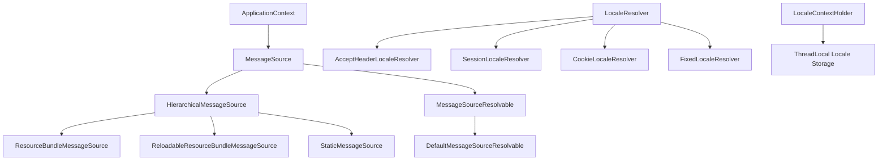

## 📜 一、设计背景
### 1.1 国际化需求的产生

随着软件应用的全球化发展，企业级应用需要支持多种语言和地区设置。Spring Framework 作为 Java 企业级开发的核心框架，必须提供完善的国际化（i18n）支持来满足以下需求：

<!--more-->

- **多语言支持**：应用程序需要根据用户的语言偏好显示相应的文本内容
- **地区化适配**：不同地区的日期、数字、货币格式需要本地化处理
- **动态切换**：用户可以在运行时动态切换语言环境
- **企业级特性**：需要支持大规模、高并发的企业级应用场景

### 1.2 Java 平台基础

Spring 的国际化设计基于 Java 平台的标准国际化机制：

- **ResourceBundle**：Java SE 提供的标准资源包机制
- **Locale**：表示特定的地理、政治或文化区域
- **MessageFormat**：用于格式化带参数的消息文本
- **Properties 文件**：存储键值对形式的国际化资源

### 1.3 Spring 的设计理念

Spring 在 Java 标准国际化基础上，遵循以下设计理念：

- **抽象化**：通过接口抽象屏蔽底层实现细节
- **可扩展性**：支持多种资源加载策略和存储方式
- **集成性**：与 Spring 容器和其他组件无缝集成
- **一致性**：提供统一的 API 和配置方式

---

## 🧱 二、架构与核心组件

### 1. 核心接口

Spring 国际化的核心架构围绕以下几个关键接口展开：

```java
// 核心消息源接口
public interface MessageSource {
    String getMessage(String code, Object[] args, String defaultMessage, Locale locale);
    String getMessage(String code, Object[] args, Locale locale) throws NoSuchMessageException;
    String getMessage(MessageSourceResolvable resolvable, Locale locale) throws NoSuchMessageException;
}

// 层次化消息源接口
public interface HierarchicalMessageSource extends MessageSource {
    void setParentMessageSource(MessageSource parent);
    MessageSource getParentMessageSource();
}

// 消息源可解析对象
public interface MessageSourceResolvable {
    String[] getCodes();
    Object[] getArguments();
    String getDefaultMessage();
}
```

- Spring 的国际化消息解析核心接口，定义了根据 key 和 Locale 获取本地化消息的方法。
- 常用实现有：
  - `ResourceBundleMessageSource`
  - `ReloadableResourceBundleMessageSource`
  - 自定义实现（如本项目的 `AbstractResourceMessageSource`）


### 2. 核心架构



组件职责分工

| 组件                                      | 职责                     | 特点                       |
| ----------------------------------------- | ------------------------ | -------------------------- |
| **MessageSource**                         | 定义消息解析的核心接口   | 提供统一的消息获取API      |
| **HierarchicalMessageSource**             | 支持父子关系的消息源     | 实现消息的层次化查找       |
| **AbstractMessageSource**                 | 提供消息解析的通用逻辑   | 处理参数解析、默认消息等   |
| **ResourceBundleMessageSource**           | 基于ResourceBundle的实现 | 性能高，但不支持热重载     |
| **ReloadableResourceBundleMessageSource** | 支持热重载的实现         | 灵活性高，支持多种资源位置 |
| **LocaleResolver**                        | 解析当前请求的Locale     | 支持多种Locale确定策略     |
| **LocaleContextHolder**                   | 线程级Locale存储         | 提供线程安全的Locale访问   |

### 3. 技术实现

#### 3.1 MessageSource 实现类详解

##### 3.1.1 ResourceBundleMessageSource

```java
public class ResourceBundleMessageSource extends AbstractResourceBasedMessageSource {
    // 缓存ResourceBundle实例
    private final Map<String, Map<Locale, ResourceBundle>> cachedResourceBundles = 
        new ConcurrentHashMap<>();
    
    // 缓存生成的MessageFormat实例
    private final Map<String, Map<Locale, MessageFormat>> cachedBundleMessageFormats = 
        new ConcurrentHashMap<>();
    
    @Override
    protected MessageFormat resolveCode(String code, Locale locale) {
        // 从缓存获取或创建MessageFormat
        MessageFormat messageFormat = getCachedMessageFormat(code, locale);
        if (messageFormat != null) {
            return messageFormat;
        }
        
        // 获取ResourceBundle
        ResourceBundle bundle = getResourceBundle(getBasename(), locale);
        if (bundle != null) {
            String message = getStringOrNull(bundle, code);
            if (message != null) {
                messageFormat = createMessageFormat(message, locale);
                cacheMessageFormat(code, locale, messageFormat);
                return messageFormat;
            }
        }
        return null;
    }
}
```

**特点分析：**

- **高性能**：基于JDK原生ResourceBundle，性能优异
- **强缓存**：ResourceBundle和MessageFormat都被缓存，避免重复创建
- **类路径限制**：只能加载类路径下的资源文件
- **无热重载**：资源文件修改后需要重启应用

##### 3.1.2 ReloadableResourceBundleMessageSource

```java
public class ReloadableResourceBundleMessageSource extends AbstractResourceBasedMessageSource {
    // 属性持有者缓存
    private final ConcurrentHashMap<String, PropertiesHolder> cachedProperties = 
        new ConcurrentHashMap<>();
    
    // 合并后的属性缓存
    private final ConcurrentHashMap<Locale, PropertiesHolder> cachedMergedProperties = 
        new ConcurrentHashMap<>();
    
    @Override
    protected MessageFormat resolveCode(String code, Locale locale) {
        PropertiesHolder propHolder = getMergedProperties(locale);
        if (propHolder != null) {
            MessageFormat messageFormat = propHolder.getMessageFormat(code);
            if (messageFormat != null) {
                return messageFormat;
            }
            
            String message = propHolder.getProperty(code);
            if (message != null) {
                messageFormat = createMessageFormat(message, locale);
                propHolder.setMessageFormat(code, messageFormat);
                return messageFormat;
            }
        }
        return null;
    }
    
    // 属性持有者内部类
    protected class PropertiesHolder {
        private Properties properties;
        private long fileTimestamp = -1;
        private volatile Map<String, MessageFormat> cachedMessageFormats;
        
        // 检查文件是否需要重新加载
        public boolean isRefreshTimestamp() {
            return (this.fileTimestamp >= 0 && 
                    System.currentTimeMillis() - this.fileTimestamp > getCacheMillis());
        }
    }
}
```

**特点分析：**

- **热重载支持**：支持运行时重新加载资源文件
- **多位置支持**：支持文件系统、类路径、URL等多种资源位置
- **时间戳检查**：通过文件时间戳判断是否需要重新加载
- **并发优化**：支持并发刷新，减少线程阻塞

#### 3.2 Locale 解析机制

##### 3.2.1 LocaleResolver 策略模式

```java
// 基于HTTP Accept-Language头的解析器
public class AcceptHeaderLocaleResolver implements LocaleResolver {
    @Override
    public Locale resolveLocale(HttpServletRequest request) {
        Locale defaultLocale = getDefaultLocale();
        if (defaultLocale != null && request.getHeader("Accept-Language") == null) {
            return defaultLocale;
        }
        Locale requestLocale = request.getLocale();
        List<Locale> supportedLocales = getSupportedLocales();
        if (supportedLocales.isEmpty() || supportedLocales.contains(requestLocale)) {
            return requestLocale;
        }
        // 查找最匹配的Locale
        Locale supportedLocale = findSupportedLocale(request, supportedLocales);
        return (supportedLocale != null ? supportedLocale : 
                (defaultLocale != null ? defaultLocale : requestLocale));
    }
}

// 基于Session的解析器
public class SessionLocaleResolver implements LocaleResolver {
    public static final String LOCALE_SESSION_ATTRIBUTE_NAME = 
        SessionLocaleResolver.class.getName() + ".LOCALE";
    
    @Override
    public Locale resolveLocale(HttpServletRequest request) {
        Locale locale = (Locale) WebUtils.getSessionAttribute(
            request, LOCALE_SESSION_ATTRIBUTE_NAME);
        return (locale != null ? locale : determineDefaultLocale(request));
    }
    
    @Override
    public void setLocale(HttpServletRequest request, HttpServletResponse response, 
                         Locale locale) {
        WebUtils.setSessionAttribute(request, LOCALE_SESSION_ATTRIBUTE_NAME, locale);
    }
}
```

##### 3.2.2 LocaleContextHolder 线程安全实现

```java
public abstract class LocaleContextHolder {
    private static final ThreadLocal<LocaleContext> localeContextHolder = 
        new NamedThreadLocal<>("LocaleContext");
    
    private static final ThreadLocal<LocaleContext> inheritableLocaleContextHolder = 
        new NamedInheritableThreadLocal<>("LocaleContext");
    
    public static void setLocale(Locale locale) {
        setLocale(locale, false);
    }
    
    public static void setLocale(Locale locale, boolean inheritable) {
        LocaleContext localeContext = (locale != null ? new SimpleLocaleContext(locale) : null);
        setLocaleContext(localeContext, inheritable);
    }
    
    public static Locale getLocale() {
        return getLocale(getLocaleContext());
    }
    
    public static Locale getLocale(LocaleContext localeContext) {
        if (localeContext != null) {
            Locale locale = localeContext.getLocale();
            if (locale != null) {
                return locale;
            }
        }
        return Locale.getDefault();
    }
}
```

#### 3.3 消息格式化机制

##### 3.3.1 MessageFormat 集成与优化

```java
public abstract class MessageSourceSupport {
    private boolean alwaysUseMessageFormat = false;
    
    protected String formatMessage(String msg, Object[] args, Locale locale) {
        if (msg == null || (!this.alwaysUseMessageFormat && ObjectUtils.isEmpty(args))) {
            return msg;
        }
        MessageFormat messageFormat = null;
        synchronized (this) {
            messageFormat = createMessageFormat(msg, locale);
        }
        if (messageFormat != null) {
            synchronized (messageFormat) {
                return messageFormat.format(resolveArguments(args, locale));
            }
        }
        return msg;
    }
    
    protected MessageFormat createMessageFormat(String msg, Locale locale) {
        try {
            return new MessageFormat(msg, locale);
        } catch (IllegalArgumentException ex) {
            // 处理格式错误，返回null或抛出异常
            throw new IllegalArgumentException("Invalid message format for locale [" + 
                locale + "]: " + ex.getMessage());
        }
    }
}
```

##### 3.3.2 参数解析与处理

```java
public abstract class AbstractMessageSource extends MessageSourceSupport 
    implements HierarchicalMessageSource {
    
    protected Object[] resolveArguments(Object[] args, Locale locale) {
        if (ObjectUtils.isEmpty(args)) {
            return args;
        }
        List<Object> resolvedArgs = new ArrayList<>(args.length);
        for (Object arg : args) {
            if (arg instanceof MessageSourceResolvable) {
                resolvedArgs.add(getMessage((MessageSourceResolvable) arg, locale));
            } else {
                resolvedArgs.add(arg);
            }
        }
        return resolvedArgs.toArray();
    }
}
```

### 4. 主要功能特性

#### 4.1 消息解析功能

##### 4.1.1 基础消息解析

```java
// 简单消息获取
String message = messageSource.getMessage("welcome.message", null, locale);

// 带默认值的消息获取
String message = messageSource.getMessage("unknown.key", null, "Default Message", locale);

// 参数化消息
String message = messageSource.getMessage("welcome.user", new Object[]{"John"}, locale);
```

##### 4.1.2 层次化消息查找

```java
// 父子MessageSource配置
@Configuration
public class MessageConfig {
    @Bean
    public MessageSource messageSource() {
        ReloadableResourceBundleMessageSource messageSource = 
            new ReloadableResourceBundleMessageSource();
        messageSource.setBasename("classpath:messages/app");
        
        // 设置父MessageSource
        ResourceBundleMessageSource parentSource = new ResourceBundleMessageSource();
        parentSource.setBasename("messages/common");
        messageSource.setParentMessageSource(parentSource);
        
        return messageSource;
    }
}
```

#### 4.2 资源加载功能

##### 4.2.1 多格式支持

```java
// Properties格式 (messages.properties)
welcome.message=Welcome to our application!
user.greeting=Hello, {0}!

// XML格式 (messages.xml)
<?xml version="1.0" encoding="UTF-8"?>
<!DOCTYPE properties SYSTEM "http://java.sun.com/dtd/properties.dtd">
<properties>
    <entry key="welcome.message">Welcome to our application!</entry>
    <entry key="user.greeting">Hello, {0}!</entry>
</properties>
```

##### 4.2.2 编码处理

```java
@Bean
public MessageSource messageSource() {
    ReloadableResourceBundleMessageSource messageSource = 
        new ReloadableResourceBundleMessageSource();
    messageSource.setBasename("classpath:messages/app");
    messageSource.setDefaultEncoding("UTF-8");
    
    // 设置特定文件的编码
    Properties fileEncodings = new Properties();
    fileEncodings.setProperty("messages/app_zh_CN", "GBK");
    messageSource.setFileEncodings(fileEncodings);
    
    return messageSource;
}
```

#### 4.3 Spring 集成功能

##### 4.3.1 Web MVC 集成

```java
@Controller
public class HomeController {
    @Autowired
    private MessageSource messageSource;
    
    @GetMapping("/welcome")
    public String welcome(Model model, Locale locale) {
        String message = messageSource.getMessage("welcome.message", null, locale);
        model.addAttribute("message", message);
        return "welcome";
    }
}

// 在JSP中使用
<spring:message code="welcome.message" />
<spring:message code="user.greeting" arguments="${username}" />
```

##### 4.3.2 验证框架集成

```java
@Configuration
public class ValidationConfig {
    @Bean
    public LocalValidatorFactoryBean validator(MessageSource messageSource) {
        LocalValidatorFactoryBean validator = new LocalValidatorFactoryBean();
        validator.setValidationMessageSource(messageSource);
        return validator;
    }
}

// 验证消息配置 (ValidationMessages.properties)
javax.validation.constraints.NotNull.message=Field cannot be null
javax.validation.constraints.Size.message=Size must be between {min} and {max}
```

### 5. 存在的缺陷和不足

#### 5.1 性能问题

##### 5.1.1 ResourceBundle 性能瓶颈

```java
// 问题代码示例
public class ResourceBundleMessageSource {
    protected MessageFormat resolveCode(String code, Locale locale) {
        // 每次都可能触发ResourceBundle.getBundle()调用
        ResourceBundle bundle = ResourceBundle.getBundle(basename, locale, bundleClassLoader);
        // 问题：
        // 1. 频繁的类加载器查找
        // 2. 文件系统访问开销
        // 3. Properties文件解析开销
        if (bundle != null) {
            try {
                MessageFormat messageFormat = createMessageFormat(bundle.getString(code), locale);
                return messageFormat;
            } catch (MissingResourceException ex) {
                // 异常处理也有性能开销
            }
        }
        return null;
    }
}
```

**性能问题分析：**

- **重复加载**：相同的ResourceBundle可能被重复加载
- **同步开销**：ResourceBundle.getBundle()方法内部使用同步机制
- **内存占用**：大量MessageFormat实例占用内存
- **GC压力**：频繁创建临时对象增加GC压力

##### 5.1.2 MessageFormat 创建开销

```java
// 性能瓶颈代码
protected MessageFormat createMessageFormat(String msg, Locale locale) {
    try {
        // 问题：每次都创建新的MessageFormat实例
        return new MessageFormat(msg, locale);
    } catch (IllegalArgumentException ex) {
        // 异常处理开销
        throw new IllegalArgumentException("Invalid message format: " + ex.getMessage());
    }
}
```

#### 5.2 功能限制

##### 5.2.1 资源格式限制

```properties
# Properties格式的局限性
# 1. 只支持key-value格式，不支持嵌套结构
user.profile.name=Name
user.profile.email=Email
user.profile.address.street=Street
user.profile.address.city=City

# 2. Unicode编码问题
welcome.chinese=\u6b22\u8fce  # 需要转义中文字符

# 3. 注释功能有限
# This is a comment - 只支持行注释
user.message=Hello World
```

**对比现代格式的优势：**

```json
// JSON格式 - 支持嵌套结构
{
  "user": {
    "profile": {
      "name": "Name",
      "email": "Email",
      "address": {
        "street": "Street",
        "city": "City"
      }
    }
  },
  "welcome": {
    "chinese": "欢迎"  // 直接支持Unicode
  }
}
```

##### 5.2.2 动态更新限制

```java
// ResourceBundleMessageSource的限制
public class ResourceBundleMessageSource {
    // 问题：缓存无法动态清理
    private final Map<String, Map<Locale, ResourceBundle>> cachedResourceBundles = 
        new ConcurrentHashMap<>();
    
    // 没有提供清理缓存的方法
    // 资源文件更新后必须重启应用
}

// ReloadableResourceBundleMessageSource的限制
public class ReloadableResourceBundleMessageSource {
    // 问题：只支持基于时间戳的重载检查
    protected boolean isRefreshTimestamp(PropertiesHolder propHolder) {
        return (propHolder.getRefreshTimestamp() < 0 ||
                propHolder.getRefreshTimestamp() > System.currentTimeMillis() - getCacheMillis());
    }
    
    // 限制：
    // 1. 无法感知文件内容变化，只能定时检查
    // 2. 在集群环境下无法同步更新
    // 3. 重载粒度粗糙，整个文件重新加载
}
```

#### 5.3 扩展性问题

##### 5.3.1 数据源单一化

```java
// 当前实现只支持文件系统数据源
public abstract class AbstractResourceBasedMessageSource {
    private Set<String> basenameSet = new LinkedHashSet<>(4);
    
    // 限制：只能从文件系统加载资源
    public void setBasenames(String... basenames) {
        this.basenameSet.clear();
        addBasenames(basenames);
    }
    
    // 问题：无法支持数据库、Redis、HTTP API等数据源
}
```

**扩展需求示例：**

```java
// 理想的扩展接口
public interface MessageSourceProvider {
    Map<String, String> loadMessages(Locale locale);
    void saveMessage(String key, String value, Locale locale);
    boolean supportsHotReload();
    void addChangeListener(MessageChangeListener listener);
}

// 数据库实现
public class DatabaseMessageSourceProvider implements MessageSourceProvider {
    @Autowired
    private JdbcTemplate jdbcTemplate;
    
    @Override
    public Map<String, String> loadMessages(Locale locale) {
        return jdbcTemplate.query(
            "SELECT message_key, message_value FROM i18n_messages WHERE locale = ?",
            new Object[]{locale.toString()},
            (rs, rowNum) -> Map.entry(rs.getString("message_key"), rs.getString("message_value"))
        ).stream().collect(Collectors.toMap(Map.Entry::getKey, Map.Entry::getValue));
    }
}
```

##### 5.3.2 缓存策略固化

```java
// 当前缓存策略不够灵活
public abstract class AbstractMessageSource {
    // 问题：缓存策略硬编码，无法配置
    private final Map<String, MessageFormat> messageFormatsPerMessage = 
        new ConcurrentHashMap<>();
    
    // 限制：
    // 1. 无法配置缓存大小限制
    // 2. 无法配置过期策略
    // 3. 无法配置缓存淘汰算法
    // 4. 无法支持分布式缓存
}
```

#### 5.4 开发体验问题

##### 5.4.1 配置复杂性

```xml
<!-- 传统XML配置方式繁琐 -->
<bean id="messageSource" 
      class="org.springframework.context.support.ReloadableResourceBundleMessageSource">
    <property name="basenames">
        <list>
            <value>classpath:messages/application</value>
            <value>classpath:messages/validation</value>
            <value>classpath:messages/security</value>
        </list>
    </property>
    <property name="defaultEncoding" value="UTF-8"/>
    <property name="cacheSeconds" value="300"/>
    <property name="fallbackToSystemLocale" value="false"/>
    <property name="fileEncodings">
        <props>
            <prop key="messages/application_zh_CN">GBK</prop>
        </props>
    </property>
</bean>

<!-- LocaleResolver配置 -->
<bean id="localeResolver" 
      class="org.springframework.web.servlet.i18n.SessionLocaleResolver">
    <property name="defaultLocale" value="en"/>
</bean>

<!-- LocaleChangeInterceptor配置 -->
<mvc:interceptors>
    <bean class="org.springframework.web.servlet.i18n.LocaleChangeInterceptor">
        <property name="paramName" value="lang"/>
    </bean>
</mvc:interceptors>
```

##### 5.4.2 调试困难

```java
// 问题：错误信息不够详细
public String getMessage(String code, Object[] args, Locale locale) 
    throws NoSuchMessageException {
    
    MessageFormat format = resolveCode(code, locale);
    if (format != null) {
        return formatMessage(format, args, locale);
    }
    
    // 问题：异常信息不够详细，难以定位问题
    throw new NoSuchMessageException(code, locale);
}

// 实际开发中遇到的问题：
// 1. 不知道消息是从哪个文件加载的
// 2. 不知道是否有父MessageSource参与查找
// 3. 参数格式化失败时错误信息不明确
// 4. 缺乏调试工具来查看当前加载的所有消息
```

##### 5.4.3 测试支持不足

```java
// 当前测试方式比较原始
@Test
public void testMessageSource() {
    MessageSource messageSource = new StaticMessageSource();
    ((StaticMessageSource) messageSource).addMessage("test.message", Locale.ENGLISH, "Test Message");
    
    String message = messageSource.getMessage("test.message", null, Locale.ENGLISH);
    assertEquals("Test Message", message);
    
    // 问题：
    // 1. 需要手动创建MessageSource
    // 2. 无法模拟复杂的资源加载场景
    // 3. 缺乏专门的测试工具类
    // 4. 难以测试热重载功能
}
```

### 6. 可以优化改进的地方

#### 6.1 性能优化方案

##### 6.1.1 智能缓存策略

```java
// 改进的多级缓存架构
public class EnhancedMessageSource implements MessageSource {
    // L1缓存：本地高速缓存
    private final Cache<String, String> localCache = Caffeine.newBuilder()
        .maximumSize(10000)
        .expireAfterWrite(Duration.ofMinutes(30))
        .recordStats()
        .build();
    
    // L2缓存：分布式缓存
    @Autowired
    private RedisTemplate<String, String> redisTemplate;
    
    // 缓存预热
    @PostConstruct
    public void preloadCache() {
        CompletableFuture.runAsync(() -> {
            Set<Locale> supportedLocales = getSupportedLocales();
            Set<String> commonKeys = getCommonMessageKeys();
            
            for (Locale locale : supportedLocales) {
                for (String key : commonKeys) {
                    try {
                        getMessage(key, null, locale);
                    } catch (Exception e) {
                        // 忽略预加载失败的消息
                    }
                }
            }
        });
    }
    
    // 批量消息获取
    public Map<String, String> getMessages(Set<String> codes, Locale locale) {
        Map<String, String> result = new HashMap<>();
        Set<String> missedKeys = new HashSet<>();
        
        // 先从L1缓存获取
        for (String code : codes) {
            String cacheKey = buildCacheKey(code, locale);
            String message = localCache.getIfPresent(cacheKey);
            if (message != null) {
                result.put(code, message);
            } else {
                missedKeys.add(code);
            }
        }
        
        // 从L2缓存批量获取
        if (!missedKeys.isEmpty()) {
            List<String> cacheKeys = missedKeys.stream()
                .map(key -> buildCacheKey(key, locale))
                .collect(Collectors.toList());
            
            List<String> cachedMessages = redisTemplate.opsForValue().multiGet(cacheKeys);
            // 处理L2缓存结果...
        }
        
        return result;
    }
}
```

##### 6.1.2 异步加载优化

```java
// 异步消息加载
@Component
public class AsyncMessageLoader {
    @Autowired
    private TaskExecutor taskExecutor;
    
    @EventListener
    public void onApplicationReady(ApplicationReadyEvent event) {
        // 应用启动后异步预加载消息
        taskExecutor.execute(this::preloadMessages);
    }
    
    private void preloadMessages() {
        // 预加载常用消息到缓存
        Set<String> commonKeys = Arrays.asList(
            "common.save", "common.cancel", "common.confirm",
            "error.validation", "error.network", "error.system"
        );
        
        for (Locale locale : getSupportedLocales()) {
            loadMessagesAsync(commonKeys, locale);
        }
    }
    
    @Async
    public CompletableFuture<Map<String, String>> loadMessagesAsync(
            Set<String> keys, Locale locale) {
        return CompletableFuture.supplyAsync(() -> {
            return keys.stream()
                .collect(Collectors.toMap(
                    key -> key,
                    key -> loadMessage(key, locale)
                ));
        });
    }
}
```

#### 6.2 功能增强方案

##### 6.2.1 现代化配置格式支持

```java
// 支持多种现代配置格式
@Configuration
public class ModernI18nConfig {
    
    @Bean
    public MessageSource messageSource() {
        return MultiFormatMessageSourceBuilder.create()
            .addJsonResource("classpath:i18n/messages.json")
            .addYamlResource("classpath:i18n/messages.yml")
            .addPropertiesResource("classpath:i18n/messages.properties")
            .setDefaultLocale(Locale.ENGLISH)
            .setSupportedLocales(Locale.ENGLISH, Locale.SIMPLIFIED_CHINESE)
            .enableHotReload(Duration.ofMinutes(5))
            .enableCache(CacheConfig.builder()
                .maxSize(10000)
                .expireAfterWrite(Duration.ofHours(1))
                .build())
            .build();
    }
}

// JSON格式消息文件
{
  "common": {
    "buttons": {
      "save": "Save",
      "cancel": "Cancel",
      "confirm": "Confirm"
    },
    "messages": {
      "success": "Operation completed successfully",
      "error": "An error occurred: {0}"
    }
  },
  "user": {
    "profile": {
      "title": "User Profile",
      "fields": {
        "name": "Name",
        "email": "Email"
      }
    }
  }
}

// YAML格式消息文件
common:
  buttons:
    save: Save
    cancel: Cancel
    confirm: Confirm
  messages:
    success: Operation completed successfully
    error: "An error occurred: {0}"
user:
  profile:
    title: User Profile
    fields:
      name: Name
      email: Email
```

##### 6.2.2 多数据源支持

```java
// 可插拔的数据源提供者
public interface MessageSourceProvider {
    String getName();
    Map<String, String> loadMessages(Locale locale);
    void saveMessage(String key, String value, Locale locale);
    boolean supportsHotReload();
    void addChangeListener(MessageChangeListener listener);
    int getPriority(); // 数据源优先级
}

// 数据库数据源实现
@Component
public class DatabaseMessageSourceProvider implements MessageSourceProvider {
    @Autowired
    private MessageRepository messageRepository;
    
    @Override
    public Map<String, String> loadMessages(Locale locale) {
        return messageRepository.findByLocale(locale.toString())
            .stream()
            .collect(Collectors.toMap(
                Message::getKey, 
                Message::getValue
            ));
    }
    
    @Override
    public void saveMessage(String key, String value, Locale locale) {
        Message message = messageRepository.findByKeyAndLocale(key, locale.toString())
            .orElse(new Message());
        message.setKey(key);
        message.setValue(value);
        message.setLocale(locale.toString());
        messageRepository.save(message);
        
        // 通知变更
        notifyChange(key, value, locale);
    }
}

// HTTP API数据源实现
@Component
public class HttpApiMessageSourceProvider implements MessageSourceProvider {
    @Autowired
    private RestTemplate restTemplate;
    
    @Value("${i18n.api.base-url}")
    private String apiBaseUrl;
    
    @Override
    public Map<String, String> loadMessages(Locale locale) {
        String url = apiBaseUrl + "/messages?locale=" + locale.toString();
        ResponseEntity<Map<String, String>> response = 
            restTemplate.exchange(url, HttpMethod.GET, null, 
                new ParameterizedTypeReference<Map<String, String>>() {});
        return response.getBody();
    }
}

// 组合数据源管理器
@Component
public class CompositeMessageSourceManager {
    private final List<MessageSourceProvider> providers;
    
    public CompositeMessageSourceManager(List<MessageSourceProvider> providers) {
        // 按优先级排序
        this.providers = providers.stream()
            .sorted(Comparator.comparingInt(MessageSourceProvider::getPriority))
            .collect(Collectors.toList());
    }
    
    public String getMessage(String key, Locale locale) {
        for (MessageSourceProvider provider : providers) {
            Map<String, String> messages = provider.loadMessages(locale);
            if (messages.containsKey(key)) {
                return messages.get(key);
            }
        }
        return null;
    }
}
```

#### 6.3 开发体验改进

##### 6.3.1 注解驱动配置

```java
// 简化的注解配置
@EnableI18n
@I18nConfiguration(
    basenames = {"classpath:i18n/messages", "classpath:i18n/validation"},
    defaultLocale = "en",
    supportedLocales = {"en", "zh_CN", "ja"},
    cacheStrategy = CacheStrategy.MULTI_LEVEL,
    hotReload = @HotReload(enabled = true, checkInterval = "5m"),
    providers = {
        @DataSource(type = DataSourceType.PROPERTIES, location = "classpath:i18n/"),
        @DataSource(type = DataSourceType.DATABASE, table = "i18n_messages"),
        @DataSource(type = DataSourceType.HTTP_API, url = "${i18n.api.url}")
    }
)
@Configuration
public class I18nConfig {
    // 自动配置，无需手动创建Bean
}

// 类型安全的消息键
@MessageKeys("classpath:i18n/messages")
public interface AppMessages {
    @MessageKey("common.save")
    String COMMON_SAVE = "common.save";
    
    @MessageKey("common.cancel")
    String COMMON_CANCEL = "common.cancel";
    
    @MessageKey("user.validation.email.invalid")
    String USER_EMAIL_INVALID = "user.validation.email.invalid";
}

// 使用方式
@Service
public class UserService {
    @Autowired
    private MessageSource messageSource;
    
    public void validateUser(User user) {
        if (!isValidEmail(user.getEmail())) {
            String message = messageSource.getMessage(
                AppMessages.USER_EMAIL_INVALID, 
                null, 
                LocaleContextHolder.getLocale()
            );
            throw new ValidationException(message);
        }
    }
}
```

##### 6.3.2 开发工具支持

```java
// 消息管理REST API
@RestController
@RequestMapping("/admin/i18n")
public class I18nManagementController {
    
    @Autowired
    private MessageSourceManager messageSourceManager;
    
    @GetMapping("/messages")
    public ResponseEntity<PageResult<MessageInfo>> getMessages(
            @RequestParam(required = false) String locale,
            @RequestParam(required = false) String key,
            @RequestParam(defaultValue = "0") int page,
            @RequestParam(defaultValue = "20") int size) {
        
        PageRequest pageRequest = PageRequest.of(page, size);
        Page<MessageInfo> messages = messageSourceManager.findMessages(locale, key, pageRequest);
        return ResponseEntity.ok(PageResult.of(messages));
    }
    
    @PostMapping("/messages")
    public ResponseEntity<Void> updateMessage(@RequestBody MessageUpdateRequest request) {
        messageSourceManager.updateMessage(
            request.getKey(), 
            request.getValue(), 
            Locale.forLanguageTag(request.getLocale())
        );
        return ResponseEntity.ok().build();
    }
    
    @DeleteMapping("/messages/{key}")
    public ResponseEntity<Void> deleteMessage(
            @PathVariable String key,
            @RequestParam String locale) {
        messageSourceManager.deleteMessage(key, Locale.forLanguageTag(locale));
        return ResponseEntity.ok().build();
    }
    
    @PostMapping("/cache/clear")
    public ResponseEntity<Void> clearCache() {
        messageSourceManager.clearCache();
        return ResponseEntity.ok().build();
    }
    
    @GetMapping("/statistics")
    public ResponseEntity<I18nStatistics> getStatistics() {
        I18nStatistics stats = messageSourceManager.getStatistics();
        return ResponseEntity.ok(stats);
    }
}

// Web管理界面
@Controller
@RequestMapping("/admin/i18n/ui")
public class I18nManagementUIController {
    
    @GetMapping("/")
    public String index() {
        return "i18n/index";
    }
    
    @GetMapping("/editor")
    public String editor(@RequestParam String key, @RequestParam String locale, Model model) {
        MessageInfo message = messageSourceManager.getMessage(key, Locale.forLanguageTag(locale));
        model.addAttribute("message", message);
        return "i18n/editor";
    }
}
```

##### 6.3.3 IDE插件支持

```java
// IDE插件接口定义
public interface I18nIDESupport {
    
    // 验证消息键的存在性
    ValidationResult validateMessageKey(String key, Set<Locale> locales);
    
    // 自动完成消息键
    List<String> getMessageKeyCompletions(String prefix);
    
    // 查找消息键的使用位置
    List<Usage> findMessageKeyUsages(String key);
    
    // 生成缺失的消息键
    void generateMissingKeys(Set<String> keys, Set<Locale> locales);
    
    // 重构消息键
    void refactorMessageKey(String oldKey, String newKey);
}

// 消息键验证器
@Component
public class MessageKeyValidator implements I18nIDESupport {
    
    @Override
    public ValidationResult validateMessageKey(String key, Set<Locale> locales) {
        ValidationResult result = new ValidationResult();
        
        for (Locale locale : locales) {
            try {
                String message = messageSource.getMessage(key, null, locale);
                if (message == null || message.equals(key)) {
                    result.addWarning("Message key '" + key + "' not found for locale " + locale);
                }
            } catch (NoSuchMessageException e) {
                result.addError("Message key '" + key + "' missing for locale " + locale);
            }
        }
        
        return result;
    }
    
    @Override
    public void generateMissingKeys(Set<String> keys, Set<Locale> locales) {
        for (String key : keys) {
            for (Locale locale : locales) {
                if (!messageExists(key, locale)) {
                    // 生成默认消息
                    String defaultMessage = generateDefaultMessage(key);
                    messageSourceManager.saveMessage(key, defaultMessage, locale);
                }
            }
        }
    }
}
```

#### 6.4 云原生和微服务支持

##### 6.4.1 配置中心集成

```java
// 与Spring Cloud Config集成
@Component
@RefreshScope
public class ConfigCenterMessageSource implements MessageSource {
    
    @Value("${i18n.config.enabled:true}")
    private boolean configEnabled;
    
    @Autowired
    private ConfigurableEnvironment environment;
    
    @EventListener
    public void onRefreshScopeRefreshed(RefreshScopeRefreshedEvent event) {
        if (configEnabled) {
            refreshMessages();
        }
    }
    
    private void refreshMessages() {
        // 从配置中心重新加载消息
        for (Locale locale : getSupportedLocales()) {
            String prefix = "i18n.messages." + locale.toString() + ".";
            Map<String, Object> properties = environment.getSystemProperties();
            
            Map<String, String> messages = properties.entrySet().stream()
                .filter(entry -> entry.getKey().toString().startsWith(prefix))
                .collect(Collectors.toMap(
                    entry -> entry.getKey().toString().substring(prefix.length()),
                    entry -> entry.getValue().toString()
                ));
            
            updateMessages(locale, messages);
        }
    }
}

// Kubernetes ConfigMap集成
@Component
public class KubernetesConfigMapMessageSource {
    
    @Autowired
    private KubernetesClient kubernetesClient;
    
    @Scheduled(fixedDelay = 30000) // 每30秒检查一次
    public void watchConfigMapChanges() {
        try {
            ConfigMap configMap = kubernetesClient.configMaps()
                .inNamespace("default")
                .withName("i18n-messages")
                .get();
            
            if (configMap != null && hasChanged(configMap)) {
                reloadFromConfigMap(configMap);
            }
        } catch (Exception e) {
            log.error("Failed to watch ConfigMap changes", e);
        }
    }
}
```

##### 6.4.2 服务网格支持

```java
// 分布式消息服务
@FeignClient(name = "i18n-service", fallback = I18nServiceFallback.class)
public interface I18nServiceClient {
    
    @GetMapping("/api/v1/messages")
    Map<String, String> getMessages(
        @RequestParam String locale,
        @RequestParam(required = false) Set<String> keys
    );
    
    @GetMapping("/api/v1/messages/{key}")
    String getMessage(
        @PathVariable String key,
        @RequestParam String locale,
        @RequestParam(required = false) String defaultMessage
    );
    
    @PostMapping("/api/v1/messages")
    void updateMessage(@RequestBody MessageUpdateRequest request);
    
    @GetMapping("/api/v1/locales")
    Set<String> getSupportedLocales();
}

// 降级处理
@Component
public class I18nServiceFallback implements I18nServiceClient {
    
    @Autowired
    private LocalMessageSource localMessageSource;
    
    @Override
    public Map<String, String> getMessages(String locale, Set<String> keys) {
        // 降级到本地消息源
        return localMessageSource.getMessages(Locale.forLanguageTag(locale), keys);
    }
    
    @Override
    public String getMessage(String key, String locale, String defaultMessage) {
        try {
            return localMessageSource.getMessage(key, null, Locale.forLanguageTag(locale));
        } catch (NoSuchMessageException e) {
            return defaultMessage != null ? defaultMessage : key;
        }
    }
}

// 消息同步服务
@Service
public class MessageSyncService {
    
    @Autowired
    private I18nServiceClient i18nServiceClient;
    
    @Autowired
    private LocalMessageSource localMessageSource;
    
    @EventListener
    @Async
    public void onMessageChanged(MessageChangedEvent event) {
        // 同步消息变更到其他服务实例
        try {
            i18nServiceClient.updateMessage(MessageUpdateRequest.builder()
                .key(event.getKey())
                .value(event.getValue())
                .locale(event.getLocale().toString())
                .build());
        } catch (Exception e) {
            log.error("Failed to sync message change", e);
            // 可以考虑使用消息队列进行异步重试
        }
    }
}
```

### 7. 总结

Spring 的国际化设计在企业级应用中发挥了重要作用，其基于接口抽象的设计理念、层次化的消息查找机制、以及与Spring生态的深度集成都体现了优秀的架构设计。然而，随着技术发展和应用场景的变化，现有实现在性能、功能、扩展性和开发体验等方面都存在改进空间。

**主要优势：**

- 成熟稳定的架构设计
- 良好的Spring生态集成
- 支持层次化消息查找
- 提供多种LocaleResolver策略

**主要不足：**

- 性能瓶颈（缓存策略、MessageFormat创建）
- 功能限制（资源格式、数据源单一）
- 扩展性问题（缓存策略固化、数据源限制）
- 开发体验（配置复杂、调试困难、工发工具缺少）