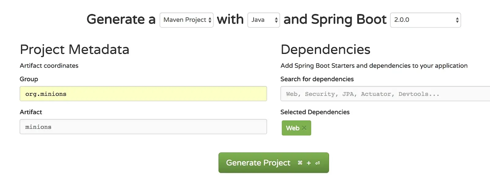
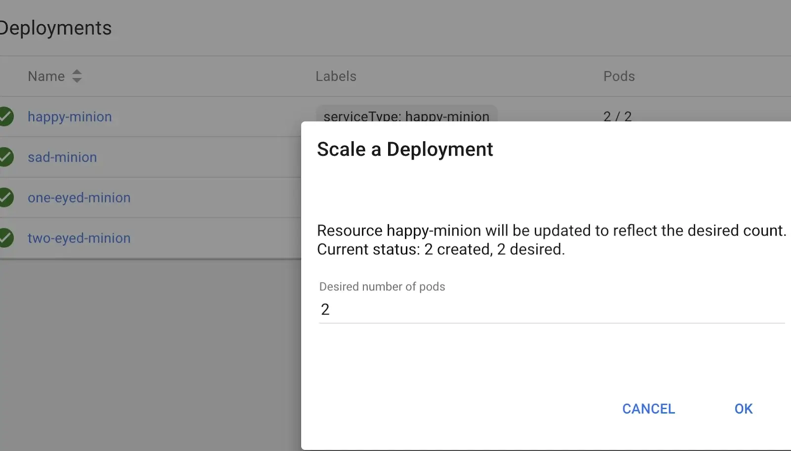

我们希望我们的微服务是可复制、可替换的工作程序，我们可以轻松升级或降级，无需停机，管理也只需最少。我们可能会说我们希望他们是我们的奴才。在本文中，我们将通过一个简单的示例来了解 Kubernetes 通过创建和编排奴才大军可以为我们做些什么。您可以按照本文进行编码，也可以从[此处](https://github.com/ryandawsonuk/minions/blob/master/minion-army.yml)克隆项目。

## 先决条件

我们需要将微服务容器化，以便在 Kubernetes 中运行它们 — 我们将使用Docker来实现这一点。我们将使用[Minikube](https://kubernetes.io/docs/tasks/tools/install-minikube/)，而不是使用云托管的 Kubernetes，这样我们就可以在本地进行沙盒处理。

## 目的

我们的仆从大军将是 Java 微服务。我们希望我们的大军中有不同类型的仆从，这样我们才能看到 Kubernetes 能为我们做些什么。因此，我们的目标是让每个微服务都响应一个简单的 http 请求，响应如下：


我们将使用 ASCII 艺术来代表仆从类型。

## 构建Java Minion服务

我们可以使用带有 Web starter 依赖项的[Spring Initializr ](https://start.spring.io/)将我们的微服务作为 Spring Boot Web 应用程序启动：



在项目中，我们将创建一个带注释的控制器来 `@RestController` 处理请求。我们将使用 `@RequestMapping(method=GET)` 来提供响应主体。因此，首先我们可以执行以下操作：

```java
@RequestMapping( method=GET)
@ResponseBody
public String minion() throws UnknownHostException {
   StringBuilder stringBuilder = new StringBuilder();
   stringBuilder.append("Host: ").append(InetAddress.getLocalHost().getHostName()).append("<br/>");
   return stringBuilder.toString();
}
```

但这并不能完全满足我们的要求。我们可以在这里输出 ASCII 艺术，但是我们要选择哪种类型的 Minion？为此，我们可以使用一个技巧。我们将创建一个可以采用我们选择的任何 Minion 类型的应用程序。为此，我们需要它包含一个 ASCII 艺术 Minion 库。因此，我们创建了一个名为 MinionsLibrary 的类，我们用它来注释， `@Component` 并在其中创建一个映射，我们用来自此[博客](http://textart4u.blogspot.co.uk/2013/08/minions-emoticons-text-art-for-facebook.html) 的一些 Minion 来初始化它：

```java
@Component
public class MinionsLibrary {
    private Map<String,String> map = new HashMap<>();

    public MinionsLibrary(){
      map.put("one-eyed-minion",<COPY-PASTE MINION ASCII ART HERE>);
      map.put("two-eyed-minion",<COPY-PASTE MINION ASCII ART HERE>);
      map.put("sad-minion",<COPY-PASTE MINION ASCII ART HERE>);
      map.put("happy-minion",<COPY-PASTE MINION ASCII ART HERE>);
    }
}
```

或者，您可以从 [https://github.com/ryandawsonuk/minions/tree/master/src/main/java/org/minions/demo](https://github.com/ryandawsonuk/minions/tree/master/src/main/java/org/minions/demo) 获取该类。

然后我们可以告诉我们的微服务要使用哪种类型的 minion。我们可以使用 spring 应用程序名称属性（稍后我们将能够使用 docker 环境变量进行设置）来执行此操作。它还将帮助我们稍后在响应中显示应用程序的版本，因此现在我们的控制器变为：

```java
@RestController
public class Controller {
    private final String version = "0.1";
    private MinionsLibrary minionsLibrary;

    @Value("${spring.application.name}")
    private String appName;

    public Controller(MinionsLibrary minionsLibrary){
        this.minionsLibrary=minionsLibrary;
    }

    @RequestMapping( method=GET)
    @ResponseBody
    public String minion() throws UnknownHostException {

        StringBuilder stringBuilder = new StringBuilder();
        stringBuilder.append("Host: ").append(InetAddress.getLocalHost().getHostName()).append("<br/>");
        stringBuilder.append("Minion Type: ").append(appName).append("<br/>");
        stringBuilder.append("IP: ").append(InetAddress.getLocalHost().getHostAddress()).append("<br/>");
        stringBuilder.append("Version: ").append(version).append("<br/>");
        stringBuilder.append(minionsLibrary.getMinion(appName));
        return stringBuilder.toString();
    }
}
```

现在将选择库“image”来匹配应用程序名称，该名称将是minion类型名称（例如“one-eyed-minion”）。

## Docker 化和部署

我们需要为我们的应用程序创建一个 Docker 镜像。我们希望在 Docker 镜像中构建可执行 jar，然后在容器启动时启动 Java 应用程序。我们可以使用多阶段 Docker 构建来执行此操作。Dockerfile 是：

```dockerfile
FROM maven:3.5-jdk-8 as BUILDMINION
COPY src /usr/src/myapp/src
COPY pom.xml /usr/src/myapp
RUN mvn -f /usr/src/myapp/pom.xml clean package -DskipTests

FROM openjdk:alpine
COPY --from=BUILDMINION /usr/src/myapp/target/*.jar /maven/
CMD java $JAVA_OPTS -jar maven/*.jar
```

直到“FROM openjdk:alpine”为止，所有步骤都会构建 JAR，然后只需将 jar 复制到基于轻量级 openjdk:alpine 映像的后续构建阶段即可。我们从公开的 `JAVA_OPTS` 参数开始，这样我们就可以选择限制内存消耗（请参阅有关减少内存消耗的[文章](https://dzone.com/articles/how-to-decrease-jvm-memory-consumption-in-docker-u)）。

`docker build . -t minion`然后我们可以使用命令“ ”构建图像

我们可以通过创建一个 Kubernetes 部署文件来部署它——我们称之为“minion-army.yml”。它将包含每个 minion 类型的条目。以下是一个 minion 类型的条目：

```yaml
apiVersion: apps/v1beta1
kind: Deployment
metadata:
 name: one-eyed-minion
labels:
   serviceType: one-eyed-minion
spec:
 replicas: 2
template:
   metadata:
     name: one-eyed-minion
     labels:
       serviceType: one-eyed-minion
   spec:
     containers:
       - name: one-eyed-minion
         image: minion:latest
         imagePullPolicy: Never
         ports:
         - containerPort: 8080
         env:
         - name: JAVA_OPTS
           value: -Xmx64m -Xms64m
         - name: SPRING_APPLICATION_NAME
           value: "one-eyed-minion"
---
apiVersion: v1
kind: Service
metadata:
 name: one-eyed-minion-entrypoint
namespace: default
spec:
 selector:
   serviceType: one-eyed-minion
ports:
   - port: 8080
     targetPort: 8080
     nodePort: 30080
type: NodePort
```

请注意，“SPRING_APPLICATION_NAME”变量会自动与 · 属性匹配，因此此 minion 服务将成为 one-eyed-minion。此 minion 类型将有两个实例（副本）可用，Kubernetes 服务将自动将请求路由到其中一个。

该服务将暴露给 Kubernetes 之外的世界——使用 Minikube，对端口 30080 的请求将发送到该服务。（该服务的这一部分对于真正的 Kubernetes 来说会有所不同，因为我们将使用 LoadBalancer 而不是 NodePort，并且不会受限于 minikube 端口范围。）该服务将使用与该服务匹配的 Pod 来处理它。我们将为每种 minion 类型提供一个服务。

Minion 类型的 Deployment 将创建两个 Pod。每个 Pod 都是该类型的 Minion。

我们可以针对每种类型的 minion 重复上述配置，每次增加外部端口号，以便使用不同的端口。或者，我们可以使用此[Github 存储库](https://github.com/ryandawsonuk/minions/blob/master/minion-army.yml)，它还具有额外的配置，可以在不停机的情况下进行 minion 版本升级。（如果我们使用 helm，我们可以避免此处的重复，但我们不想添加不必要的工具。）

## 创建军队

首先启动minikube：

```bash
minikube start --memory 4000 --cpus 3
```

等待它启动，然后将你的 Docker 注册表链接到 Minikube 注册表并为 Minikube 构建 minion 映像：

```bash
eval $(minikube docker-env)
docker build . -t minion
```

然后我们就可以部署军队：

```bash
kubectl create -f minion-army.yml
```

查看部队类型：

```bash
open http://$(minikube ip):30080
open http://$(minikube ip):30081
open http://$(minikube ip):30082
open http://$(minikube ip):30083
```

每个页面看起来都很像文章开头的 happy-minion 页面。

`kubectl get pods` 我们可以通过执行“ ”或执行“ `minikube dashboard`”并进入 Pods 页面来查看整个军队 ：


## 创造更多部队

我们可以在 minikube 仪表板的 Deployments 部分下创建更多特定类型的 minions：




## 一个小兵倒下，另一个小兵接替他的位置

假设当我们从浏览器访问 Happy Minion 服务时，我们得到了以下结果：


如果我们杀死“happy-minion-58c9c46d67-j84s9”会发生什么？我们可以尝试从仪表板的 Pods 部分删除，或者：

```bash
kubectl delete pod happy-minion-58c9c46d67-j84s9
```

如果您在浏览器中多次点击刷新（可能需要一段时间才能杀死该 minion），您会看到该服务正在使用该类型的另一个 minion。如果您转到仪表板的 Pods 部分，您会看到 Kubernetes 创建了一个新的 Pod 来代替您删除的 Pod，这样该部署就剩下两个了。

## 升级 Minion

我们还可以看到我们的 minions 上的滚动升级。为此，我们应该在 minions-army.yml 文件中的每个部署部分的“spec”部分下（它可以直接位于同一级别的“replicas”下方）包含以下内容：

```yaml
minReadySeconds: 10
strategy:
   type: RollingUpdate
   rollingUpdate:
     maxUnavailable: 1
     maxSurge: 1
```

然后我们可以将Controller类中的版本改为0.2，保存然后执行：

```bash
docker build . -t minion:0.2
```

然后打开 minion-army.yml 并查找并将所有“latest”替换为“0.2”。保存更改并执行以下操作：

```bash
kubectl apply -f minion-army.yml --record
```

刷新其中一个 minion 类型的浏览器以查看版本变化，该变化与从 `kubectl rollout status deploy` 中看到的变化一致，其中 `<deployment_name>` 是一种 minion 类型（例如 `one-eyed-minion`）。

## Minion 回滚

要查看已部署的历史记录，请执行 `kubectl rollout history deploy <deployment_name>`并回滚，请执行 `kubectl rollout undo deploy <deployment_name> --to-revision=1` （可能需要一点时间）

## 销毁军队

用以下方法消灭军队：

```
kubectl delete -f minion-army.yml
```

使用“minikube stop”停止 minikube。


原文链接：[https://dzone.com/articles/minions-in-minikube-a-kubernetes-intro-for-java-de](https://dzone.com/articles/minions-in-minikube-a-kubernetes-intro-for-java-de)
