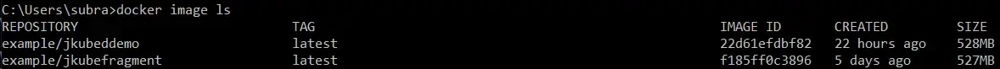

> 有一类新工具可用于将应用程序 docker 化并部署到 Kubernetes，这些工具专门面向开发人员。该类别中的最新工具是 RedHat 的 JKube。

微服务是一种架构风格，由一个小型的、单独的应用程序组件组成，该组件具有单一职责，在部署和可扩展性方面具有高度的自主性。这些组件通过轻量级协议（如 REST over HTTP）进行通信。因此，开发团队规模很小（两个披萨规则），专注于微服务。实际上，团队拥有从开发到部署的整个生命周期——如果你构建了它，你就会运行它。这就产生了一个问题。毕竟，开发团队的核心竞争力通常是 Maven、微服务框架（例如 Spring Boot）、测试框架（如 JUnit）等。但是，如果我们看一下部署微服务所涉及的步骤：

- 将应用程序打包到 Docker 等容器中。这涉及编写 Dockerfile。
- 将容器部署到 Kubernetes 等编排器。这涉及编写一些资源；服务描述文件、部署等。

用开发人员熟悉的术语来说，这就是“阻抗不匹配”。为了解决这个问题，我们需要一类能够使用开发人员的语言并使整个部署步骤对他们透明的工具。其中最著名的是[Jib ](https:/github.com/GoogleContainerTools/jib)，我们在[之前的](https:/dzone.com/articles/dockerizing-a-spring-boot-application)论文中讨论过它，它可以为您的 Java 应用程序构建优化的 Docker 和[OCI](https:/github.com/opencontainers/image-spec)映像，并以 Maven 插件的形式提供。此类别中还有其他工具，例如[Dekorate](https:/dekorate.io/dekorate/)，它允许我们仅使用 Maven 和 Java 注释来生成 Kubernetes 清单。此类别中最新且最全面的条目是 RedHat 的 JKube，这是我们的*当日主题。*

[JKube](https:/www.eclipse.org/jkube/docs/kubernetes-maven-plugin)是一个 Maven 插件，其目标包括构建 Docker 映像和创建 Kubernetes 资源描述符。映像和描述符可以在没有配置的情况下生成，基于基于 pom 文件中条目的一些默认设置，或者可以使用 pom 中的 XML 条目进行自定义，或者在极端情况下使用 Dockerfile 和资源片段进行自定义。以下是该插件的目标：

| **目标**     | **描述**                     |
| ------------ | ---------------------------- |
| k8s:build    | 将应用程序 Docker 化为映像。 |
| k8s:resource | 生成 k8s 资源描述符。        |
| k8s:apply    | 应用这些清单。               |
| k8s:log      | 查看容器的日志。             |
| K8s:undeploy | 撤消部署。                   |

首先，我假设您已在本地安装了 Docker 和 Kubernetes。有[几种](https:/seroter.com/2020/03/10/lets-look-at-your-options-for-local-development-with-kubernetes/)方法可以做到这一点。我还假设您具备 Docker 和 Kubernetes 的基本知识，如 [ [Docker](https:/www.oreilly.com/library/view/docker-up/9781492036722/) ] 和 [ [Kubernetes](https:/www.oreilly.com/library/view/kubernetes-up-and/9781492046523/) ] 中所述。

```xml
<plugin>
     <groupId>org.eclipse.jkube</groupId>
     <artifactId>kubernetes-maven-plugin</artifactId>
     <version>1.2.0</version>
</plugin>
```

现在我们可以生成图像：

```bash
mvn k8s:build
```

在通常的 Spring Boot 歌舞之后，您可以列出图像：



您可以自定义图像。例如，您可能希望通过配置`from`pom 中的元素来选择插件使用的默认图像以外的基础图像：

```xml
<configuration>
     <images>
      <image>
       <build>
           <from>your-base-image</from>
```

您也可以使用自己的 Dockerfile。例如，您可能希望使用 JLink 创建自定义 JRE 以最小化镜像大小。我们之前展示了如何做到这一点。我们现在可以生成资源文件。

```bash
mvn k8s:resource
```

这会在 `target\classes\META-INF\jkube\kubernetes`中生成两个文件``<artifactid>-deployment.yml`和`<artifactid>-service.yml`。

请注意，部署 YML 具有活跃度和就绪度探测：

```yaml
livenessProbe:
  failureThreshold: 3
  httpGet:
    path: /actuator/health
    port: 8080
    scheme: HTTP
  initialDelaySeconds: 180
  successThreshold: 1
```

和 

```yaml
readinessProbe:
  failureThreshold: 3
  httpGet:
    path: /actuator/health
    port: 8080
    scheme: HTTP
  initialDelaySeconds: 10
  successThreshold: 1
```

这是因为我们包含了对 Spring Boot Actuator 的依赖。（活跃度探测确定容器是否健康且不需要重新启动。就绪度探测确定服务何时准备好满足用户请求。）这是 JKube 使用 pom 中的信息和一些默认值来配置部署的示例。

创建的默认服务类型为 ClusterIP。但您无法从集群外部访问它。为此，您需要向 Jkube 提供一个附加参数（见下文）。

您可以使用*资源片段*来更具体。资源片段就是听起来的样子——资源的片段。例如，我们将使用资源片段来配置`configMap`。（ConfigMap 是一组键值对，用于配置每个环境的图像，例如 dev、QA、test、prod 等）。您可以在 src/main/jkube 目录中包含资源片段。

```yaml
metadata:
  name: ${project.artifactId}
data:
  application.properties:
    welcome = Hello from Kubernetes in Dev!!!
```

在同一目录下的deployments.yml中，您可以指定如何将其作为卷挂载。

```yaml
spec:
  volumes:
    - name: config
      configMap:
        name: ${project.artifactId}
        items:
          - key: application.properties
            path: application.properties
  containers:
    - volumeMounts:
        - name: config
          mountPath: /deployments/config
```

运行 `k8s:resource` 时，您将在 `target\classes\META-INF\jkube\kubernetes` 中看到 `<artifactid>-configmap.yml`。（生成配置映射的资源描述时似乎存在错误。与其他资源片段不同，它不会将资源描述的artifactid 小写。因此，您应该将artifactid 全部小写。问题是，除非您遵循 Kubernetes 命名约定，否则[您](https:/kubernetes.io/docs/concepts/overview/working-with-objects/names/#dns-subdomain-names)的资源将无法部署。）

现在我们准备部署到 Kubernetes。

```bash
mvn install k8s:build k8s:resource k8s:apply
```

您可以检查部署是否成功：


为了提供从集群外部的访问，我们将服务类型更改为 NodePort：

```bash
mvn install k8s:build k8s:resource k8s:apply -Djkube.enricher.jkube-service.type=NodePort
```

如果你修改pom，则可以一步完成此操作：

```xml
<plugin>
 <groupId>org.eclipse.jkube</groupId>
 <artifactId>kubernetes-maven-plugin</artifactId>
 <version>1.2.0</version>
 <executions>
   <execution>
   <id>jkube</id>
   <goals>
     <goal>apply</goal>
     <goal>resource</goal>
     <goal>build</goal>
    </goals>
   </execution>
  </executions>
</plugin>
```

现在您只需一步即可部署：`mvn install`**。**

最后，您可以通过取消部署资源来自行清理：`mvn k8s:undeploy`**。**

源代码可以在 Github 上[找到。你可以](https:/github.com/Taruvai/DZoneJkube)[在这里](https:/gitter.im/eclipse/jkube)、[这里](https:/rohaan.medium.com/)和[这里](https:/www.eclipse.org/jkube/docs/kubernetes-maven-plugin)获取有关 JKube 的更多信息。

*非常感谢 Rohan Kumar 的帮助。*


原文链接：https:/dzone.com/articles/kubernetes-for-java-developers
