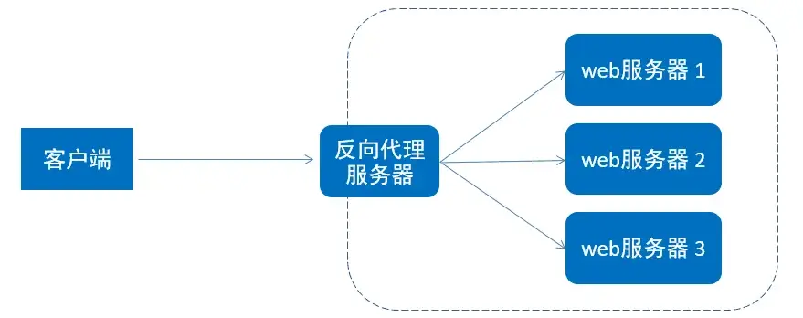
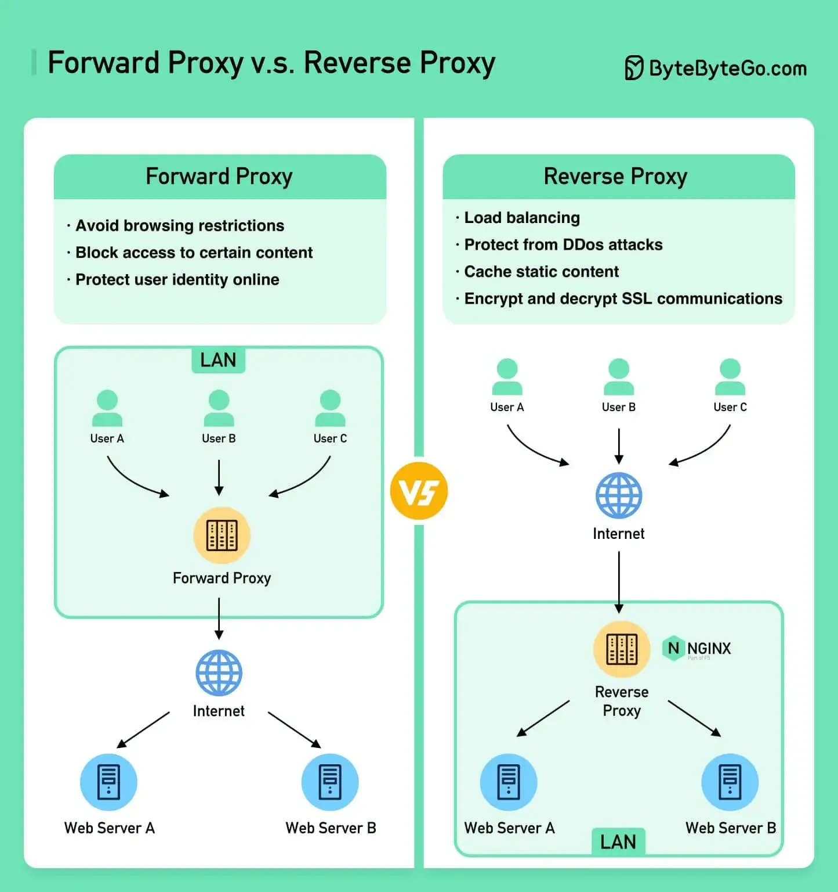

今天做了什么：

- Nginx、正向代理和反向代理

## Nginx 介绍

Nginx（发音为"engine-x"）是一个高性能的开源Web服务器和反向代理服务器。它专注于高并发、低内存消耗和高度模块化的架构，因此被广泛用于构建性能出色的网站、应用程序和服务。

以下是一些关于 Nginx 的关键特点：

1. 高性能：Nginx 的设计目标之一是在高并发情况下提供卓越的性能。它使用异步、事件驱动的架构来处理请求，有效地管理系统资源，提供快速响应和高吞吐量。
2. 高度可定制化：Nginx 的模块化架构使其高度可定制。它支持许多第三方模块和插件，可以根据具体需求进行扩展和定制。这使得开发人员可以根据自己的要求添加额外的功能和扩展 Nginx 的能力。
3. 轻量级和低内存消耗：Nginx 是一个轻量级的服务器，具有低内存消耗。这使得它能够在资源受限的环境中高效运行，并处理大量的并发连接。
4. 简单的配置和易于使用：Nginx 的配置文件采用简单的语法，易于理解和修改。它提供了清晰的文档和丰富的示例，使得用户可以快速上手并进行必要的配置。

功能：

1. 反向代理和负载均衡：Nginx 可以作为反向代理服务器，将客户端请求转发到后端服务器。它还支持负载均衡，可以将流量分配到多个后端服务器，提高系统的可靠性和性能。
2. 静态文件服务：Nginx 可以快速、可靠地提供静态文件，减轻后端应用程序的负担。它可以通过高效的文件传输和缓存机制提供静态内容，提高网站的响应速度。
3. SSL/TLS 加密：Nginx 支持 SSL/TLS 加密，可以安全地传输数据。它提供强大的加密功能和配置选项，以保护网站和应用程序的安全性。
4. 动态内容支持：尽管 Nginx 主要用于处理静态内容，但它也可以与后端应用程序（如 PHP、Python、Node.js 等）集成，以处理动态生成的内容。
5. HTTP/2 和 HTTP/3 支持：Nginx 支持最新的 HTTP/2 和 HTTP/3 协议，这些协议提供更快的数据传输和更低的延迟，改善用户体验。
6. 高度可扩展：Nginx 的模块化架构使得它可以轻松地扩展和定制。它支持各种第三方模块和插件，可以满足不同场景和需求的要求。

## 正向代理和反向代理

### 正向代理

正向代理（Forward Proxy）是一种代理服务器的使用方式，它代表客户端向其他服务器发送请求。当客户端想要访问互联网上的资源时，它首先发送请求到正向代理服务器，然后由代理服务器代表客户端向目标服务器发起请求，获取响应并将其返回给客户端。

正向代理的典型用途是为在防火墙内的局域网客户端提供访问Internet的途径。

正向代理一般是**在客户端设置代理服务器**，通过代理服务器转发请求，最终访问到目标服务器。

 

以下是正向代理的主要特点和用途：

1. 隐藏客户端身份：正向代理可以隐藏客户端的真实IP地址和身份，保护客户端的隐私和安全。目标服务器只能看到正向代理服务器的IP地址和请求，无法直接识别和追踪客户端。
2. 访问控制和过滤：正向代理可以实施访问控制和过滤策略，限制客户端对特定资源的访问。它可以用于实施访问权限、URL过滤、内容过滤等，以便控制和管理客户端对互联网资源的访问。
3. 缓存和加速：正向代理服务器可以缓存经常请求的资源，以提高访问速度并减轻目标服务器的负载。当多个客户端请求相同的资源时，代理服务器可以直接提供缓存的副本，而无需每次都向目标服务器发送请求。
4. 对抗访问限制：在某些情况下，客户端可能无法直接访问某些资源，例如由于地理位置限制或网络防火墙的阻塞。通过使用正向代理，客户端可以通过代理服务器来访问被限制的资源，代理服务器充当中间人来获取资源并传递给客户端。
5. 匿名上网：正向代理可以为用户提供匿名上网的功能，隐藏用户的真实身份和位置信息。这对于保护用户隐私、绕过地域限制和访问受限资源等情况非常有用。

总而言之，正向代理充当客户端和目标服务器之间的中间人，代表客户端发送请求并获取响应。它可以隐藏客户端身份、实施访问控制、提供缓存和加速等功能，为用户提供更安全和更灵活的访问互联网的方式。

### 反向代理

反向代理（Reverse Proxy）服务器位于用户与目标服务器之间，但是对于用户而言，反向代理服务器就相当于目标服务器，即用户直接访问反向代理服务器就可以获得目标服务器的资源，反向代理服务器负责将请求转发给目标服务器。用户不需要知道目标服务器的地址，也无须在用户端作任何设定，对于用户来说，访问反向代理服务器是完全无感知的。

 

以下是反向代理的主要特点和用途：

1. 负载均衡：反向代理可以作为负载均衡器，将客户端请求分发给多个后端服务器，以实现负载均衡。它可以根据服务器的负载情况、响应时间等指标动态地决定将请求发送到哪个后端服务器，以确保请求被合理地分散处理。
2. 高可用性和故障恢复：通过反向代理，可以配置多个后端服务器作为冗余的备份。如果某个后端服务器出现故障或不可用，反向代理可以自动将请求转发到其他正常工作的后端服务器，以确保服务的可用性。
3. SSL 加密和安全性：反向代理可以与客户端之间建立安全的 SSL/TLS 连接，提供加密和身份验证功能。这样可以保护客户端与反向代理之间的通信，增强数据的安全性。
4. 缓存和加速：反向代理可以缓存后端服务器返回的静态资源，如图片、CSS、JavaScript 文件等。当客户端请求这些资源时，反向代理可以直接提供缓存的副本，减轻后端服务器的负载并提高响应速度。
5. 提供统一入口：反向代理可以将多个后端服务器提供的不同服务（如Web应用、API服务等）通过统一的入口点进行访问。这样客户端只需与反向代理通信，并由反向代理根据请求的路径将其转发到适当的后端服务器。

总结起来，反向代理充当了客户端和后端服务器之间的中间人，负责接收客户端的请求并将其转发给后端服务器。它可以实现负载均衡、提供高可用性、增加安全性、缓存和加速等功能，为客户端提供更高效、安全和可靠的访问体验。

### 总结

- 正向代理：客户端请求目标服务器，请求会先经过代理服务器，然后再转发请求到目标服务器，获得内容后最后再响应给客户端。
- 反向代理：用户请求目标服务器，由代理服务器决定访问哪个 IP。

转发代理是位于用户设备和互联网之间的服务器。

正向代理通常用于：

1. 保护客户端
2. 避免浏览限制
3. 阻止访问某些内容

反向代理是一种服务器，它接受客户端的请求，将请求转发到 Web 服务器，并将结果返回给客户端，就好像代理服务器已经处理了请求一样。

反向代理适用于：

1. 保护服务器
2. 负载均衡
3. 缓存静态内容
4. 加密和解密 SSL 通信
