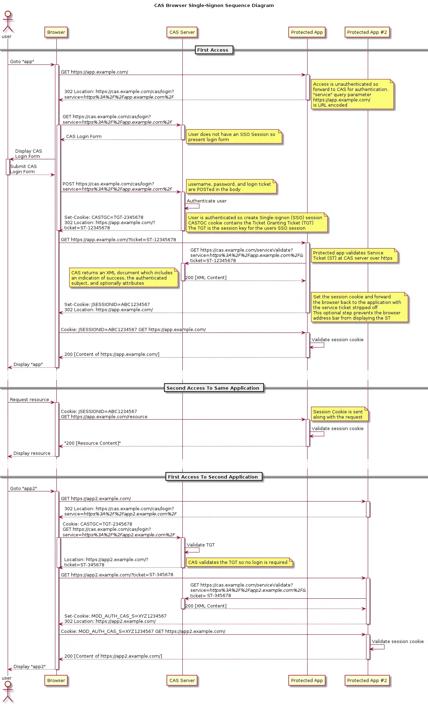

今天做了什么：

- [使用 renovate 监控第三方依赖更新](https://zexo.dev/posts/2020/03/01/keep-your-repo-dependencies-up-to-date-with-renovate/) ，renovate 貌似需要付费，放弃。
- spring-security-oauth2-samples 示例工程重命名模块和包名，代码见 [spring-security-oauth2-boot](https://github.com/chensoul/spring-security-oauth2-boot) 
- 实现单点登录并测试

## 实现单点登录并测试

实现单点登录（Single Sign-On，SSO）可以采用多种思路和技术。下面是几种常见的实现思路：

1. 基于令牌（Token）的SSO：用户在登录时，认证服务器颁发一个令牌给用户，该令牌包含用户的身份信息。用户在访问其他应用时，将令牌发送给应用服务器进行验证，从而实现单点登录。
2. 基于会话（Session）的SSO：用户在登录时，认证服务器创建一个会话，并将会话ID发送给用户的浏览器。用户在访问其他应用时，浏览器将会话ID发送给应用服务器进行验证，从而实现单点登录。
3. 基于身份提供者（Identity Provider，IdP）的SSO：使用一个独立的身份提供者（如OpenID Connect、SAML等），用户在登录时将身份验证委托给身份提供者。身份提供者负责验证用户身份，并向应用程序提供令牌或身份凭证，实现单点登录。
4. 基于代理（Proxy）的SSO：通过在前端部署反向代理服务器或负载均衡器，将用户的登录状态存储在代理服务器中。用户访问其他应用时，代理服务器将用户的身份信息传递给应用服务器，从而实现单点登录。
5. 基于统一认证系统（CAS）的SSO：使用CAS作为中央认证服务器，用户在登录时通过CAS进行认证，并获取一个票据（ticket）。用户访问其他应用时，应用服务器将票据发送给CAS进行验证，从而实现单点登录。

这些思路和技术并非互斥，可以根据具体需求和系统架构的复杂性选择适合的实现方式。此外，还可以使用现有的SSO解决方案和身份管理平台，如Auth0、Okta、Keycloak等，简化SSO的实现过程。

### 基于 OAuth2 单点登录

在 [spring-security-oauth2-legacy-examples](https://github.com/chensoul/spring-security-oauth2-legacy-examples) 添加单点登录 github 示例。参考了 [oauth2-sample-java-webapp](https://github.com/apereo/oauth2-sample-java-webapp)

### CAS 实现单点登录

CAS（Central Authentication Service）是一套完整的统一身份认证解决方案，完整资料可查阅其 [官方网站](https://www.apereo.org/projects/cas)。CAS包括对应的协议(CAS Protocol)、协议的实现(CAS Server)和与CAS服务交互的软件包(CAS Client)。

CAS Client接入示例：https://github.com/apereo?q=client

CAS 交互时序图：

参考 [SpringBoot+CAS整合服务端和客户端实现SSO单点登录与登出快速入门上手](https://blog.csdn.net/dgfdhgghd/article/details/129321234) 这篇文章，代码在 [这里](https://github.com/chensoul/cas-examples)。
