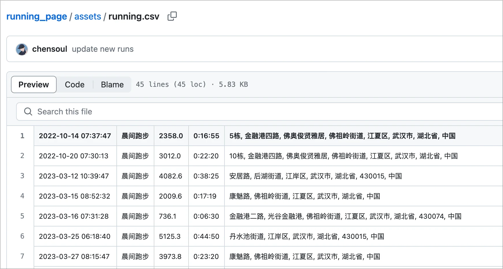
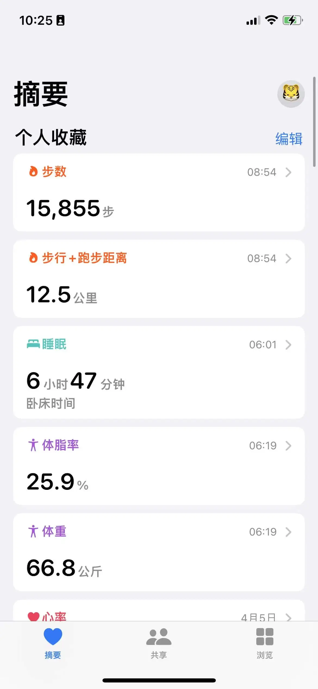
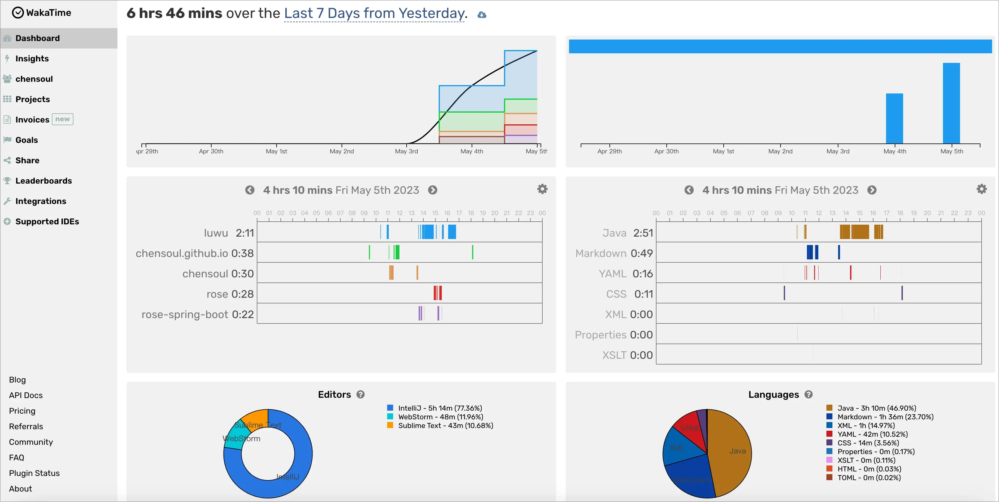
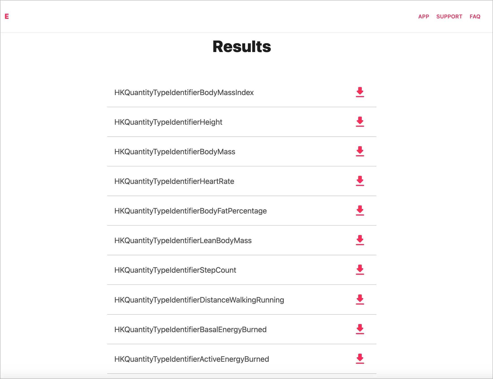
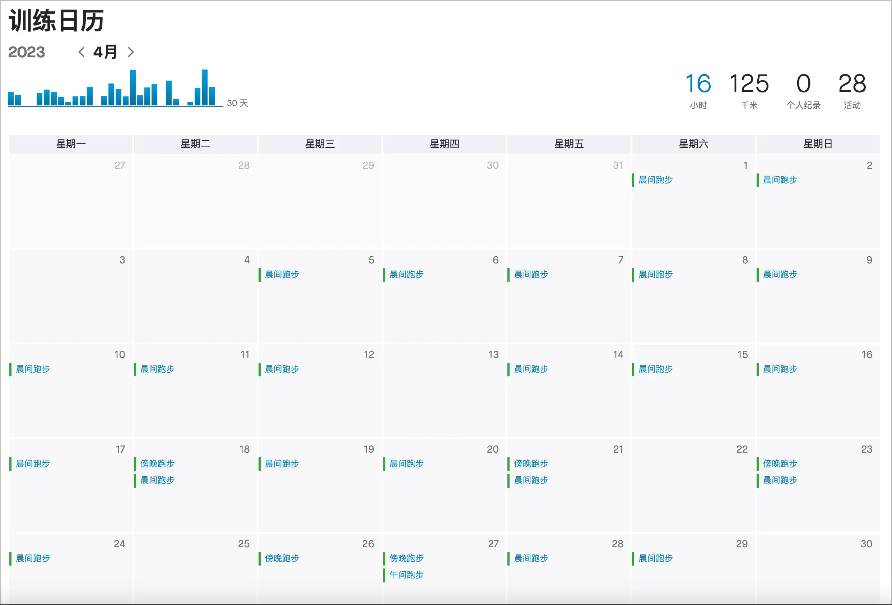

## 前言

本篇是对 `2023-04-24` 到 `2023-04-30` 这周生活的记录与思考。首发在我的个人 [博客](https://blog.chensoul.cc/)，你可以移步了解更多或者给我留言。

本周二早上跑步右小腿抽筋，跑步暂停了两天，所以有两天走路没有到一万步。在小腿恢复之后，继续跑步，查看 strava 上的统计，这周总共跑了 27 公里，比上周 41 公里少了 14 公里。

这周空闲时间就在想，能不能每天自动收集个人的一些数据，比如，目前我能想到的数据包括跑步、走路、体重、编码、早起等等。

目前是使用 strava app 记录跑步数据，通过 [running_page](https://github.com/chensoul/running_page) 可以实时收集我的每天 [跑步数据](https://github.com/chensoul/running_page/blob/master/assets/running.csv)。



走路、体重数据可以从苹果健康数据获取：



编码数据可以从 wakatime 获取：



早起的数据，我目前是通过 ios workflow 自动化来实现的。当早起闹钟响起时，往 memos 写入一条记录。


如果可以获取到苹果屏幕使用时间数据，则可以从苹果手机获取每日第一次拿起手机的时间作为早起时间（待研究）。

## 导出苹果健康数据

如何导出苹果健康数据？可以参考这篇文章 [想要分析或备份 iPhone 「健康」应用数据？教你 3 种方法将其导出](https://sspai.com/post/42135) 。这篇文章提到的 Health Export 工具和 python 脚本我都试过，QS Access 在手机上没有找到。

### 1. Health Export 在线解析

[Health Export](https://sspai.com/link?target=http%3A%2F%2Fericwolter.com%2Fprojects%2Fhealth-export.html) 是国外一名独立开发者写的在线解析工具，它专门用于将健康应用导出的 XML 文件转换为 CSV 文件。

Health Export 提供了一个 [web 网站](https://www.ericwolter.com/projects/apple-health-export/) 可以解析传苹果手机导出的健康数据。


如何从 IPhone 手机导出苹果健康数据呢？您可以通过以下步骤导出这些数据：

1. 打开“健康”应用程序。
2. 点击屏幕右上角的“个人资料”图标。
3. 滚动到页面底部，找到“导出健康数据”选项，并点击它。
4. 在弹出窗口中选择要导出的数据类型，例如步数、心率等。
5. 点击“下一步”按钮。
6. 在下一个页面中，您可以选择要导出的时间范围。您可以选择“全部数据”或指定日期范围。
7. 点击“请求导出”按钮。
8. 您将被要求输入一个密码以保护您的数据。输入密码后，点击“下一步”按钮。
9. 在弹出窗口中，您可以选择将数据发送到您的电子邮件地址或其他应用程序。
10. 点击“导出”按钮。

完成这些步骤后，您的健康数据将被导出为一个可下载的 zip 文件。您可以将其保存到您的设备上或发送到其他应用程序或云存储服务。

将导出的文件 export.xml 上传到 [web 网站](https://www.ericwolter.com/projects/apple-health-export/) ，稍等片刻可以导出结果。导出的健康数据是一个指标一个 csv 文件，如果想合并数据，需要做进一步处理。



另外，Health Export 也提供了 IOS APP，功能好用，支持选择指定指标数据按日期聚合导出为一个 csv，还有定时导出的功能，遗憾的是需要收费。

### 2、使用 python 脚本

这里使用了 [@Radcliffe](https://sspai.com/link?target=https%3A%2F%2Fgithub.com%2Ftdda%2Fapplehealthdata) 提供的开源代码。目前，Github 可以在国内自由访问，所以直接通过[此链接](https://sspai.com/link?target=https%3A%2F%2Fgithub.com%2Ftdda%2Fapplehealthdata%2Fraw%2Fmaster%2Fapplehealthdata.py)下载名称为 `applehealthdata.py` 的脚本文件。

然后，将之前下载好的 `导出.xml` 与该脚本文件放置在**同一目录**下方。为了防止报错，这里需要将 `导出.xml` 更名为 `export.xml`。

接下来，在该文件夹下打开终端（macOS & Linux）或者命令行工具（Windows），使用 Python 2 执行该脚本：

```bash
python applehealthdata.py export.xml
```

稍等片刻，XML 文件就会被解析为数个 CSV 文件了。

这里，我对 applehealthdata.py 这个文件做了一点修改，只导出指定的指标的指定列的数据，修改后的脚本在 [applehealthdata.py](https://github.com/chensoul/chensoul/blob/main/applehealthdata.py)。目前，我只关注以下 6 个指标：

```python
RECORDS=[
    'BodyFatPercentage',
    'BodyMass',
    'BodyMassIndex',
    'DistanceWalkingRunning',
    'LeanBodyMass',
    'StepCount'
]
```

这 6 个指标中文含义分别是：

- BodyFatPercentage：脂肪率
- BodyMass：体重
- BodyMassIndex：BMI 指数
- LeanBodyMass：净体重
- DistanceWalkingRunning：走路跑步距离
- StepCount：走路步数

导出的列只需要 type、startDate、value 这 3 个：

```python
RECORD_FIELDS = OrderedDict((
    # ('sourceName', 's'),
    # ('sourceVersion', 's'),
    # ('device', 's'),
    ('type', 's'),
    # ('unit', 's'),
    # ('creationDate', 'd'),
    ('startDate', 'd'),
    # ('endDate', 'd'),
    ('value', 'n'),
))
```

这样导出了这 6 个 csv 文件：

```bash
BodyMass.csv
DistanceWalkingRunning.csv
StepCount.csv
BodyFatPercentage.csv
BodyMassIndex.csv
LeanBodyMass.csv
```

接下来，把这 6 个文件导入数据库，并进行合并处理。数据库我选择的是 postgres，以上 6 个文件对于 6 个建表语句：

```sql
CREATE SEQUENCE IF NOT EXISTS health_id_seq;

CREATE TABLE "public"."BodyFatPercentage" (
    "id" int4 NOT NULL DEFAULT nextval('health_id_seq'::regclass),
    "type" varchar,
    "start_date" timestamp,
    "value" float8,
    PRIMARY KEY ("id")
);

CREATE TABLE "public"."BodyMass" (
    "id" int4 NOT NULL DEFAULT nextval('health_id_seq'::regclass),
    "type" varchar,
    "start_date" timestamp,
    "value" float8,
    PRIMARY KEY ("id")
);

CREATE TABLE "public"."BodyMassIndex" (
    "id" int4 NOT NULL DEFAULT nextval('health_id_seq'::regclass),
    "type" varchar,
    "start_date" timestamp,
    "value" float8,
    PRIMARY KEY ("id")
);

CREATE TABLE "public"."DistanceWalkingRunning" (
    "id" int4 NOT NULL DEFAULT nextval('health_id_seq'::regclass),
    "type" varchar,
    "start_date" timestamp,
    "value" float8,
    PRIMARY KEY ("id")
);

CREATE TABLE "public"."LeanBodyMass" (
    "id" int4 NOT NULL DEFAULT nextval('health_id_seq'::regclass),
    "type" varchar,
    "start_date" timestamp,
    "value" float8,
    PRIMARY KEY ("id")
);

CREATE TABLE "public"."StepCount" (
    "id" int4 NOT NULL DEFAULT nextval('health_id_seq'::regclass),
    "type" varchar,
    "start_date" timestamp,
    "value" float8,
    PRIMARY KEY ("id")
);
```

我想把这 6 个文件按照日期合并到一个表中，于是创建 health 表：

```sql
CREATE TABLE "public"."health" (
    "day" text NOT NULL,
    "fat_pct" float8,
    "bmi" float8,
    "lean_weight" float8,
    "step_count" float8,
    "step_distance" numeric,
    "weight" float8,
    PRIMARY KEY ("day")
);
```

接下来，通过 sql 合并数据插入到 health 表：

```sql
insert into health
select f.day,t.fat_pct,t.bmi,t.lean_weight,f.step_count,g.step_distance,t.weight from
(
  select to_char(start_date, 'YYYY-MM-DD') as day,sum("value") step_count  from "StepCount" group by to_char(start_date, 'YYYY-MM-DD')
) f
left outer join
(
	select to_char(start_date, 'YYYY-MM-DD') as day,round(cast(sum("value") as numeric) ,2) as step_distance from "DistanceWalkingRunning" group by to_char(start_date, 'YYYY-MM-DD')
) g on f.day=g.day
left outer join
(
	select a.day,a.weight,e."value" "lean_weight",cast(c."value"*100 as numeric) as "fat_pct",d."value" "bmi" from
	(
		select to_char(start_date, 'YYYY-MM-DD') as day,min(start_date) as min_start_date,min(value) as weight from "BodyMass" group by day
	) a
	left outer join "BodyFatPercentage" c on a.min_start_date=c.start_date
	left outer join "BodyMassIndex" d on a.min_start_date=d.start_date
	left outer join "LeanBodyMass" e on a.min_start_date=e.start_date
	order by a.day
) t on t.day=f.day
order by f.day asc
```

最后的数据如下：


完整的 csv 文件保存在 [health.csv](https://github.com/chensoul/chensoul/blob/main/data/health.csv) 。有些记录中体重相关的数据为空，这是因为体重相关数据是通过其他和电子秤关联的 app 写进去的。`要想每天都有体重相关的数据，则需要每天使用电子称测量体重。`

得到这份数据之后，就可以进行统计了，比如统计体重的变化、每天走路的步数等等。

## 理财

这周总计支出 732 元，明细如下：

- 4 月 25 日：117 元，100 元加油
- 4 月 26 日：59 元，买药
- 4 月 28 日：419 元，加油 360 元
- 4 月 29 日：21 元
- 4 月 30 日：116 元

4 月累计支出共 3048 元，比 3 月支出 3520 元少了 472 元。主要支出来自这几个：

- 交通：1177 元，其中 300 元是缴纳 ETC 押金
- 餐饮：827 元
- 购物：751 元
- 娱乐：216 元，看电影


## 健身

四月跑步记录如下，总计跑了 16 小时、125 公里。更详细数据，可以参考我的 [跑步主页](https://run.chensoul.cc/)。



## 工作

### Effective Java 3 笔记

请参考 [《Effective Java 3》笔记 4：用私有构造函数使类不可实例化](/posts/2023/05/05/enforce-noninstantiability-with-a-private-constructor/) 和 《Effective Java 3》笔记 7：[排除过时的对象引用](/posts/2023/05/05/eliminate-obsolete-object-references/)。


### FlexyPool

FlexyPool 是一个用于监控数据库连接池的开源工具。它支持监控和报告连接池的使用情况、性能和瓶颈，以及自动调整连接池的大小和行为。FlexyPool 支持多种流行的 Java 数据库连接池，例如 HikariCP、Tomcat JDBC Pool、C3P0、BoneCP 等等。

FlexyPool 主要提供以下功能：

1. 监控连接池的使用情况，包括连接数、请求数、等待时间、执行时间等等。
2. 报告连接池的性能和瓶颈，例如最慢的查询、最频繁的错误、最短的连接时间等等。
3. 自动调整连接池的大小和行为，以提高性能和减少资源消耗。
4. 集成到常见的监控工具中，例如 Prometheus、Grafana、InfluxDB 等等。

FlexyPool 的使用相对简单，只需要将其添加到应用程序的依赖中，然后配置连接池和 FlexyPool 的参数即可。例如，如果你正在使用 HikariCP 连接池，可以按照以下步骤配置 FlexyPool：

1、添加 FlexyPool 的依赖到应用程序的 pom.xml 文件中：

```xml
<dependency>
  <groupId>com.vladmihalcea.flexypool</groupId>
  <artifactId>flexy-pool-core</artifactId>
  <version>2.0.2</version>
</dependency>
```

2、在应用程序的配置文件中，配置连接池和 FlexyPool 的参数：

```properties
# HikariCP 数据库连接池配置
hikari.dataSourceClassName=com.mysql.jdbc.jdbc2.optional.MysqlDataSource
hikari.dataSource.url=jdbc:mysql://localhost:3306/mydb
hikari.dataSource.user=root
hikari.dataSource.password=secret
hikari.minimumIdle=10
hikari.maximumPoolSize=20
hikari.idleTimeout=30000
hikari.poolName=hikariPool

# FlexyPool 配置
flexyPool.metricsFactory=histogram
flexyPool.metric.log.enabled=true
flexyPool.metric.log.level=info
flexyPool.metric.log.interval=10
flexyPool.metric.prometheus.enabled=true
flexyPool.metric.prometheus.port=9090
```

在这个配置中，我们首先配置了 HikariCP 连接池的参数，然后配置了 FlexyPool 的参数。这些参数包括度量工厂、日志和度量记录的级别、度量记录的间隔、是否启用 Prometheus 集成等等。

3、在应用程序启动时，将 FlexyPool 的代理对象添加到连接池中：

```java
DataSource dataSource = ...; / 获取连接池对象
FlexyPoolDataSource flexyPoolDataSource = new FlexyPoolDataSource<>(dataSource);
```

在这个代码中，我们首先获取 HikariCP 连接池对象，然后将其包装成 FlexyPool 的代理对象。这样，所有的数据库操作都将通过 FlexyPool 进行代理和监控。

Baeldung 网站上有一篇介绍 Spring Boot 中如何使用 FlexyPool 连接池监控工具的教程，名为 [A Guide to FlexyPool in Spring Boot](https://www.baeldung.com/spring-flexypool-guide)。

这篇文章首先介绍了 FlexyPool 工具的作用，以及如何将其集成到 Spring Boot 应用程序中。FlexyPool 可以监控和报告连接池的使用情况、性能和瓶颈，以及自动调整连接池的大小和行为，以提高性能和减少资源消耗。

然后，文章介绍了如何在 Spring Boot 应用程序中使用 FlexyPool。具体步骤包括：

1. 添加 FlexyPool 的依赖到应用程序的 pom.xml 文件中。
2. 配置连接池和 FlexyPool 的参数，例如 HikariCP 连接池的参数、FlexyPool 的度量工厂、日志和度量记录的级别、度量记录的间隔、是否启用 Prometheus 集成等等。
3. 创建 FlexyPoolDataSource 对象，作为连接池的代理对象。该对象将自动创建和管理连接池，并使用 FlexyPool 工具进行监控和调整。
4. 在应用程序中使用连接池，例如获取连接、执行 SQL 语句、关闭连接等等。

最后，文章总结了一些连接池监控和优化的最佳实践，例如：

1. 使用 FlexyPool 工具监控连接池的使用情况和性能瓶颈，以及调整连接池的大小和行为，以提高性能和减少资源消耗。
2. 配置连接池和 FlexyPool 的参数，以适应应用程序的负载和性能要求。
3. 避免连接池泄漏和死锁等问题，例如及时关闭连接、设置合理的超时时间等等。

## 本周分享

大部分有意思的内容会分享在 『[ChenSoul Share](https://t.me/ichensoul)』Telegram 频道或者我的 [memos](https://memos.chensoul.cc/) 中。我写了一个 python 脚本从 memos 读取最近一周的 memos 记录。

- **2023-04-28 09:01:43** 4 个文生图 AI 工具 [查看链接](https://xugaoxiang.com/2023/04/27/4-text-to-image-ai-tools/) `#memos`
- **2023-04-27 13:29:50** 这是 Jony Ive 的 LoveFrom 团队出品的一本关于乔布斯的书，书中几乎全部引用乔布斯自己的话，没有解读，更加「原汁原味」，同时也收录了一些珍贵的照片。 [查看链接](https://stevejobsarchive.com/book) [查看链接](https://limboy.me/books/make-something-wonderful/) `#memos`
- **2023-04-27 09:52:58** Alpine, Tailwind, Deno, SQLite 我的本地服务四件套 [查看链接](https://limboy.me/posts/local-services-tools/) Update: 用 Remix 替代了 Alpine 和 Deno，确实方便。 `#web` `#memos`
- **2023-04-27 08:32:37** FlexyPool 是一个用于监控数据库连接池的开源工具。它支持监控和报告连接池的使用情况、性能和瓶颈，以及自动调整连接池的大小和行为。FlexyPool 支持多种流行的 Java 数据库连接池，例如 HikariCP、Tomcat JDBC Pool、C3P0、BoneCP 等等。 FlexyPool 主要提供以下功能： 监控连接池的使用情况，包括连接数、请求数、等待时间、执行时间等等。 报告连接池的性能和瓶颈，例如最慢的查询、最频繁的错误、最短的连接时间等等。 自动调整连接池的大小和行为，以提高性能和减少资源消耗。 集成到常见的监控工具中，例如 Prometheus、Grafana、InfluxDB 等等。 [查看链接](https://www.baeldung.com/spring-flexypool-guide) `#java` `#memos`
- **2023-04-27 07:24:03** 人一生中最重要的两天就是出生那天和发现人生目标的那天。 ------马克吐温 `#摘录`
- **2023-04-25 20:07:58** 受 [查看链接](https://github.com/yihong0618/2023/blob/main/get_up.py) 启发，在 iPhone 上，创建了一个自动化捷径。当早起闹铃响起时，往 memos 发送一条早起记录，内容如下： 早起时间：2023 年 4 月 25 日 20:02 今日语录： 有些事情本身我们无法控制，只好控制自己。 起床啦，喝杯咖啡，去跑步，每天进步一点点。 `#memos`
- **2023-04-25 08:57:03** 【怎样种时间的种子？】 时间不够用，如何种时间的种子？ 1.走电梯时耐心等候自动关门，让更多的人进来，节约了他们的时间。（这还是一颗空间、房子的种子） 2.帮父母完成她的心愿或者事务性工作。 3.教会家里的小孩子如何节约父母的时间，这个就非常高级了。 4.路上随手捡走垃圾、不乱扔垃圾，让清洁工人有更多的时间。 5.帮助老师或者有更多能量的平台做事情。 6.经常性的做义工。 7.打电话长话短说，简洁明了节约对方的时间。 8.微信尽可能用打字，让对方快速简单地知道事情。 9.开会提前到，至少准时到，千万不能迟到，会议迟到，那种下的都是巨大的种子。 10.开车让人，腾出时间给别人。 11.开心收拾家务，让家人更加容易找到东西。 12.主动收拾公共办公区域，让同事快速有效工作。 13.不闲聊八卦浪费别人时间（这颗闲聊八卦的坏种子，还会让你在工作中没有人听从你的好意见，缺乏领导力） 14.参加任何会议提前准备，积极回应。 15.与别人分享时间的管理工具，分享获得富裕时间的好种子，这可也是法布施的好种子。 16.提醒、帮助或者关注拖延症的朋友。 17.不爽约父母安排的聚餐吃饭，不回家吃饭提前说。（恩田的大种子） 18.鼓励别人的梦想，真诚由心地赞美别人。 `#金刚智慧`
- **2023-04-24 19:21:02** 有一个想法，可以写一段脚本从 telegram 或者 memos 读取上周的分享记录，然后，转换为 markdown 格式发布在周报中。这样，周报就可以变成半自动化了。 于是，写了一个 python 脚本实现了从 memos 读取记录。😁 `#skill`
- **2023-04-24 17:26:52** 晚唐李商隐的《锦瑟》 锦瑟无端五十弦，一弦一柱思华年。 庄生晓梦迷蝴蝶，望帝春心托杜鹃。 沧海月明珠有泪，蓝田日暖玉生烟。 此情可待成追忆，只是当时已惘然。 `#诗词`
- **2023-04-24 14:07:04** 使用一行代码为网站的输入框增加上 AI 能力。 [查看链接](https://www.enhanceai.dev/) `#skill`
- **2023-04-24 14:04:23** 平常是糊里糊涂的，现在变得出人意外的小心谨慎，这正是由于报复的欲望，而这种欲望多么能够锻炼人！ —— 大仲马 `#摘录`
- **2023-04-24 14:03:59** 使人疲乏的不是远方的深谷，而是鞋子里的一粒沙子。 —— 伏尔泰 `#摘录`
- **2023-04-24 11:00:30** 📝 《Effective Java 3》笔记：避免创建不必要的对象 `#blog` [查看链接](https://blog.chensoul.cc/posts/2023/04/24/avoid-creating-unnecessary-objects/)
- **2023-04-24 08:20:31** 使用 Python 实现 RSS 转 Newsletter. [查看链接](https://www.skyue.com/23042217.html) `#python`

以上。
