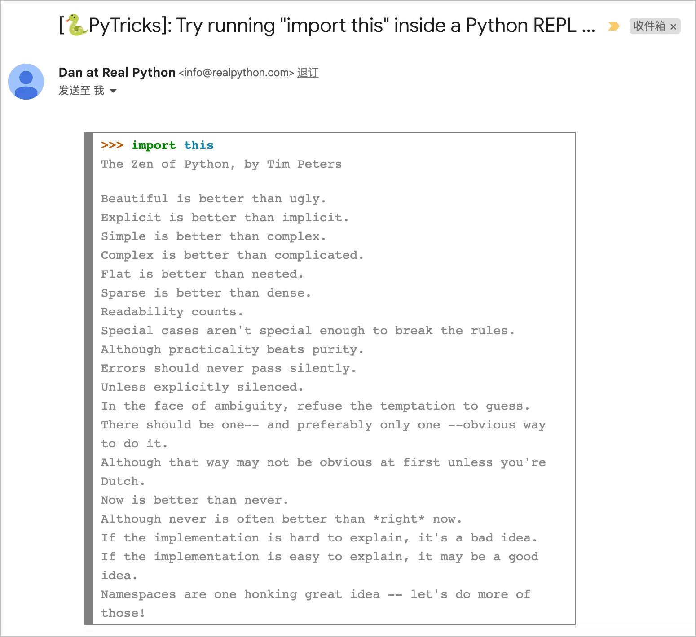
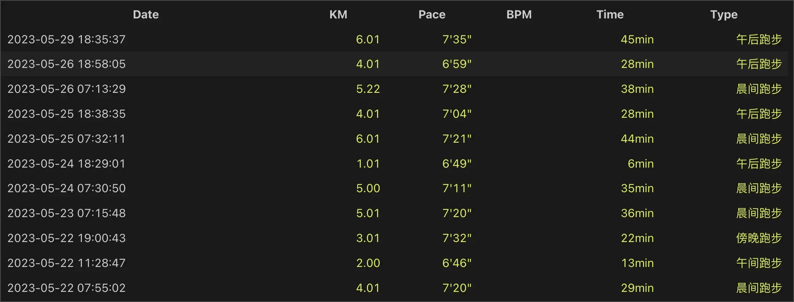
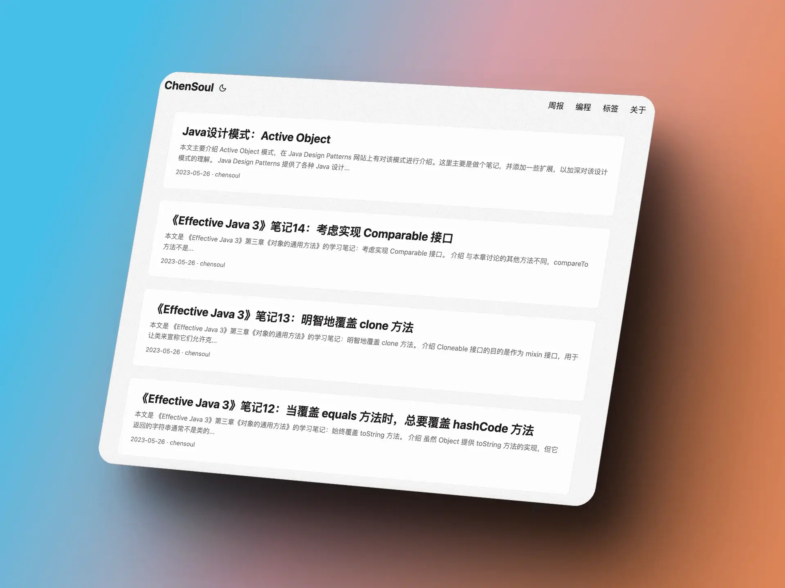

## 前言

  
<i>公司价值观</i>

本篇是对 `2023-05-22` 到 `2023-05-28` 这周生活的记录与思考。首发在我的个人 [博客](https://blog.chensoul.cc/)，你可以移步了解更多或者给我留言。

周一，休产假的产品经理回来上班，得知她被优化之后，内心有些不舍和伤感。中午，组长请大家一起吃了饭。晚上，产品经理交割完办公用户之后，就没来上班了。自此，过完年后，公司至少有三位女同事修完产假之后就离职了，有的是主动，更多的应该是被动。虽然有 N+1 赔偿，但是，这个社会对女性还是不够公平。

还有 3 个月就要到端午节，老婆买了粽叶包粽子，我也动手包了一部分。虽然包的不好看，但心里还是很满足的。自己包的粽子送节，显然更有意义。结婚之后的第一个端午节，周末开车去给长辈送了端午节。看着长辈们的头发日渐斑白，不禁感叹岁月无情。趁着年轻的时候，要对身边的亲人好一些。不要等到来不及了才知道后悔。

这周在 docker 里部署了 Plausible ，使用过程中发现 Plausible 架构过于复杂，使用了 postgres 和 clickhouse 数据库，docker-compose 启动了 4 个容器，所以最后还是放弃了使用 Plausible。umami 的 postgres 数据库只包括几张表，操作起来比较容易，比如：时不时地，我会把来自 localhost 的访问记录删除掉，这样统计数据更加真实准确。

## Python 之禅

这是最近的一个 PyTricks：在 python REPL 里面输入 `import this` 会输出 `The Zen of Python, by Tim Peters`：

英文：

> The Zen of Python, by Tim Peters
>
> Beautiful is better than ugly.
>
> Explicit is better than implicit.
>
> Simple is better than complex.
>
> Complex is better than complicated.
>
> Flat is better than nested.
>
> Sparse is better than dense.
>
> Readability counts.
>
> Special cases aren't special enough to break the rules.
>
> Although practicality beats purity.
>
> Errors should never pass silently.
>
> Unless explicitly silenced.
>
> In the face of ambiguity, refuse the temptation to guess.
>
> There should be one-- and preferably only one --obvious way to do it.
>
> Although that way may not be obvious at first unless you're Dutch.
>
> Now is better than never.
>
> Although never is often better than _right_ now.
>
> If the implementation is hard to explain, it's a bad idea.
>
> If the implementation is easy to explain, it may be a good idea.
>
> Namespaces are one honking great idea -- let's do more of those!

中文：

> Python 之禅，作者为 Tim Peters
>
> 美丽胜于丑陋。
>
> 明确胜于含蓄。
>
> 简单胜于复杂。
>
> 复杂胜于繁琐。
>
> 扁平胜于嵌套。
>
> 宽松胜于紧凑。
>
> 可读性很重要。
>
> 特例并不足以打破规则。
>
> 虽然实用性优先于纯粹性。
>
> 错误绝不能悄悄地通过。
>
> 除非明确地沉默。
>
> 面对模棱两可，拒绝猜测。
>
> 应该有一种-- 最好只有一种 --显而易见的方法来做到这一点。
>
> 虽然这种方法可能一开始并不明显，除非你是荷兰人。
>
> 现在比永远好。
>
> 虽然永远不如 _现在就做_ 好。
>
> 如果实现很难解释，那这是个坏主意。
>
> 如果实现容易解释，那可能是个好主意。
>
> 名称空间是一个非常好的想法 -- 让我们做更多的这样的事情！

Python 之禅是一组编写 Python 语言程序的指导原则，由著名 Python 开发者 Tim Peters 撰写而成，这些格言反映了 Python 社区的哲学。

第一原则“美丽胜于丑陋”强调编写美学上令人愉悦且易于阅读的代码的重要性，包括使用适当的缩进、命名规范和格式化。

第二原则“明确胜于含蓄”强调在代码中要清晰明确，避免捷径并尽可能具体地定义代码。

第三原则“简单胜于复杂”强调编写易于理解和维护的代码的重要性，包括避免不必要的复杂性并尽可能使用简单的解决方案。

第四原则“复杂胜于繁琐”强调在必要时使用复杂的解决方案，但避免过度复杂。

第五原则“扁平胜于嵌套”强调保持代码简单，避免深度嵌套结构。

第六原则“宽松胜于紧凑”强调使用空格和格式化使代码更易读。

第七原则“可读性很重要”强调编写易于阅读和理解的代码的重要性。

第八原则“特例并不足以打破规则”强调即使在可能会偏离规则的情况下，也要遵循最佳实践和已有约定。

第九原则“虽然实用性优先于纯粹性”强调平衡实用考虑与对优雅和纯粹代码的渴望。

第十原则“错误绝不能悄悄地通过”强调捕捉和处理代码中的错误，而不是忽略它们。

第十一原则“除非明确地沉默”强调在适当情况下允许有意地消除错误信息。

第十二原则“面对模棱两可，拒绝猜测”强调要在代码中清晰明确，即使在存在歧义或不确定性的情况下也要如此。

第十三原则“应该有一种-- 最好只有一种 --显而易见的方法来做到这一点”强调遵循已有的约定和规范，避免不必要的复杂或曲折的解决方案。

第十四原则“虽然这种方法可能一开始并不明显，除非你是荷兰人”是对 Python 的创建者 Guido van Rossum 是荷兰人这一事实的玩味性致敬。

第十五原则“现在比永远好”强调采取行动并推进你的代码，而不是拖延或拖沓。

第十六原则“虽然永远不如 _现在就做_ 好”强调要花时间仔细考虑你的代码，避免匆忙解决可能不是最优解的问题。

第十七原则“如果实现很难解释，那这是个坏主意”强调编写易于理解和解释给他人的代码的重要性。

第十八原则“如果实现容易解释，那可能是个好主意”强调编写简单明了、易于解释的代码的重要性。

第十九原则“名称空间是一个非常好的想法 -- 让我们做更多的这样的事情！”强调使用名称空间以清晰易懂的方式组织和结构化你的代码。名称空间有助于避免命名冲突，并使查找和重用代码更容易。

## 理财

这周总计支出 1939 元，明细如下：

- 5 月 28 日：1064 元，加油充值 1000 元
- 5 月 27 日：642 元，端午节送节买酒 540 元
- 5 月 26 日：173 元
- 5 月 25 日：17 元
- 5 月 24 日：7 元
- 5 月 23 日：20 元
- 5 月 22 日：16 元

## 健身

> 我跑过了一些地方，希望随着时间推移，地图点亮的地方越来越多。2 年里我跑过 2 个省份 2 个城市。更多跑步数据在[跑步](https://run.chensoul.cc/)主页。

本周跑步 39 公里，最长跑步距离为 6 公里。

明细数据如下：

5 月份即将结束，目前这个月跑了 24 天，累计 178 公里，比 4 月的 125 公里多了 53 公里。再跑个 12 公里，这个月跑步里程就可以达到 190 公里了，给自己加油！最长连续跑步时间为 7 天，每次都是到了周末就中断了，有点遗憾。回过头来想想，跑步是一个长期的事情，比起跑的远，更重要的是跑的久。争取每天都跑，不管跑几公里，只要坚持下去就是成功。

## 工作

最近在学习的内容清单：

- [Effective Java（第 3 版）](https://github.com/clxering/Effective-Java-3rd-edition-Chinese-English-bilingual/tree/dev)
- [Java Design Patterns (中文)](https://java-design-patterns.com/zh/)
- [Real Python](https://realpython.com/)

本周完成四篇博客：

- [《Effective Java 3》笔记 12：当覆盖 equals 方法时，总要覆盖 hashCode 方法](/posts/2023/05/26/always-override-tostring/)
- [《Effective Java 3》笔记 13：明智地覆盖 clone 方法](/posts/2023/05/26/override-clone-judiciously/)
- [《Effective Java 3》笔记 14：考虑实现 Comparable 接口](/posts/2023/05/26/consider-implementing-comparable/)
- [Java 设计模式：Active Object](/posts/2023/05/26/java-design-patterns-active-object/)

至此，《Effective Java 3》第三章学习完了。第三章介绍了 Java 中对象的创建和销毁，其中第三章讲述了所有对象通用的方法，主要内容如下：

1. equals 方法：用于比较两个对象是否相等，需要遵循一些通用约定，包括自反性、对称性、传递性、一致性和非空性等。
2. hashCode 方法：用于返回对象的哈希码，需要与 equals 方法一起实现，保证相等的对象具有相等的哈希码。
3. toString 方法：用于返回对象的字符串表示形式，方便调试和日志记录等。
4. clone 方法：用于复制对象，需要实现 Cloneable 接口，并覆盖 Object 类中的 clone 方法。
5. finalize 方法：用于在对象被垃圾回收前执行一些清理操作，但是该方法的使用非常危险，应该尽量避免使用。

本章重点介绍了所有对象通用的方法，这些方法在 Java 中非常重要，需要程序员掌握。equals 和 hashCode 方法是一对重要的方法，需要同时实现，保证对象的相等和哈希码的正确性。toString 方法可以方便地输出对象的信息，方便调试和日志记录等。clone 方法可以用于复制对象，但需要注意实现 Cloneable 接口，并覆盖 Object 类中的 clone 方法。最后，finalize 方法虽然可以用于对象清理，但是使用非常危险，应该尽量避免使用。

## 本周分享

大部分有意思的内容会分享在 『[ChenSoul Share](https://t.me/ichensoul)』Telegram 频道或者我的 [memos](https://memos.chensoul.cc/) 中。我写了一个 python 脚本从 memos 读取最近一周的 memos 记录。

- 📌`2023-05-27` 365 资讯简报，每天精选 15 条热点新闻简报 1 条微语，每天一分钟，知晓天下事！ 2023 年 5 月 26 日 星期五 农历四月初八 1、工信部等十四部门：部署推进新一轮电信基础设施共建共享工作。 2、两高两部：对在校园等场所对未成年人实施猥亵等犯罪的，加重处罚。 3、国家疾控局：4 月全国报告法定传染病超 210 万例。 4、集体婚礼走红，民政部推行婚俗改革，高价彩礼得到有效遏制。 5、广东出台办法：失信联合惩戒对象不得报名参加事业单位招聘。 6、北京：新冠连续 4 周列传染病榜首，上周报告发病数是 4 月底的近 4 倍。 7、天津：在津无房家庭首次公积金贷款还清后，仍可按首套房贷款。 8、上海部分社区开打 mRNA 新冠疫苗，可通过“健康云”预约。 9、17 级超强台风"玛娃"已成今年以来全球风王，下周将影响我国南方。 10、长城汽车公开举报比亚迪：两款车型污染物排放不达标，比亚迪回应：检测报告无效，反对任何形式不正当竞争。 11、微信电脑版新增锁定功能，只能通过手机端解锁。 12、韩自研运载火箭“世界”号载星发射成功。 13、造假数量超 2 亿件！最长可追溯 40 年前！本田合资零部件厂商承认造假。 14、普京：俄罗斯正减少不友好国家货币在贸易结算中的份额。 15、美情报披露：克宫遭无人机袭击幕后黑手为乌克兰。 【微语】真正的贫穷，不是金钱上的匮乏，而是认知上的贫瘠。 新闻来源：[https://www.163.com/dy/article/I5L6PQL30534QBVQ.html?spss=dy_author](https://www.163.com/dy/article/I5L6PQL30534QBVQ.html?spss=dy_author) `#每日早报` `#memos`
- 📌`2023-05-26` 365 资讯简报，每天精选 15 条热点新闻简报 1 条微语，每天一分钟，知晓天下事！ 2023 年 5 月 25 日 星期四 农历四月初七 1、教育部：2023 年为中西部乡镇定向免费培养本科医学生 6150 人。 2、中国互联网协会：警惕 AI 换脸新骗局，远程转账务必多重验证。 3、交通运输部在南沙群岛火艾礁、牛轭礁和南薰礁附近海域布设 3 座灯浮标。 4、数据显示：今年以来全国已有超 40 城调整首套房贷利率下限至 4%以下。 5、财政部：4 月份全国共销售彩票 503.26 亿元，同比增长 62.0%。 6、吉林省印发公务接待新办法：不得安排群众迎送，公务接待工作餐每人不超 120 元。 7、香港：调整签证及进入许可申请流程，外佣及学生等须申报刑事记录。 8、广东海珠：举报电动车进出租屋充电等，最高奖励 1 万元。 9、韩国三大运营商夸大 5G 网速被罚 336 亿韩元：号称 20G 实际 800M。 10、51 岁马斯克公开回应：已确定特斯拉接班人，若我出现意外，可以确保公司继续运营下去。 11、微软发布重磅更新：Windows 系统全面接入 AI 助手，ChatGPT 内置必应搜索最新答案。 12、岸田文雄称日本正考虑设立北约联络处但不会加入北约，中方回应：不欢迎军事集团。 13、俄罗斯：俄中之间 70％的跨境结算已用本币完成。 14、英国首相苏纳克拒绝停火呼吁，称乌克兰应该继续战斗。 15、俄媒：乌克兰最高将领在俄军攻击中受重伤，可能将无法继续指挥。 【微语】放弃不难，但坚持一定很酷。撑住，才有后来的一切。 新闻来源：[https://www.163.com/dy/article/I5IJEHQK0534QBVQ.html?spss=dy_author](https://www.163.com/dy/article/I5IJEHQK0534QBVQ.html?spss=dy_author) `#每日早报` `#memos`
- 📌`2023-05-25` 365 资讯简报，每天精选 15 条热点新闻简报 1 条微语，每天一分钟，知晓天下事！ 2023 年 5 月 25 日 星期四 农历四月初七 1、教育部：2023 年为中西部乡镇定向免费培养本科医学生 6150 人。 2、中国互联网协会：警惕 AI 换脸新骗局，远程转账务必多重验证。 3、交通运输部在南沙群岛火艾礁、牛轭礁和南薰礁附近海域布设 3 座灯浮标。 4、数据显示：今年以来全国已有超 40 城调整首套房贷利率下限至 4%以下。 5、财政部：4 月份全国共销售彩票 503.26 亿元，同比增长 62.0%。 6、吉林省印发公务接待新办法：不得安排群众迎送，公务接待工作餐每人不超 120 元。 7、香港：调整签证及进入许可申请流程，外佣及学生等须申报刑事记录。 8、广东海珠：举报电动车进出租屋充电等，最高奖励 1 万元。 9、韩国三大运营商夸大 5G 网速被罚 336 亿韩元：号称 20G 实际 800M。 10、51 岁马斯克公开回应：已确定特斯拉接班人，若我出现意外，可以确保公司继续运营下去。 11、微软发布重磅更新：Windows 系统全面接入 AI 助手，ChatGPT 内置必应搜索最新答案。 12、岸田文雄称日本正考虑设立北约联络处但不会加入北约，中方回应：不欢迎军事集团。 13、俄罗斯：俄中之间 70％的跨境结算已用本币完成。 14、英国首相苏纳克拒绝停火呼吁，称乌克兰应该继续战斗。 15、俄媒：乌克兰最高将领在俄军攻击中受重伤，可能将无法继续指挥。 【微语】放弃不难，但坚持一定很酷。撑住，才有后来的一切。 新闻来源：[https://www.163.com/dy/article/I5IJEHQK0534QBVQ.html?spss=dy_author](https://www.163.com/dy/article/I5IJEHQK0534QBVQ.html?spss=dy_author) `#每日早报` `#memos`
- 📌`2023-05-25` 前后端均基于 vercel 的每日早报项目 [https://icodeq.com/2022/5fe2010403bb/](https://icodeq.com/2022/5fe2010403bb/) `#memos`
- 📌`2023-05-24` GitHub - resumejob/awesome-resume: Resume，Resume Templates，程序员简历例句，简历模版`#memos` [https://github.com/resumejob/awesome-resume](https://github.com/resumejob/awesome-resume)

以上。
