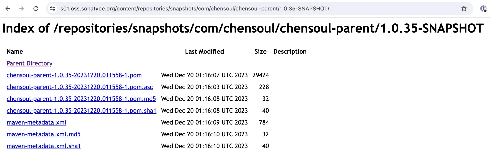
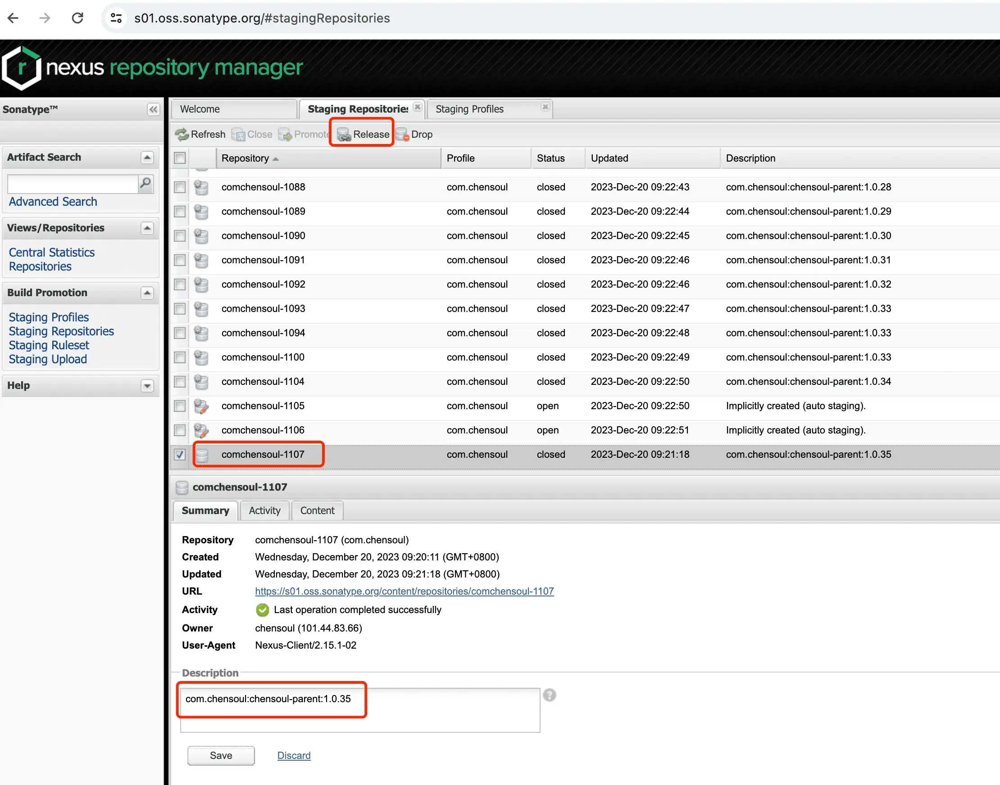

Today I Learned. 今天分享内容：发布到 Maven 中央仓库的第一个项目。

最近在 Github 上创建了一个 Pom 类型的 Maven 项目 [chensoul-parent](https:/github.com/chensoul/chensoul-parent/)，该项目主页 https:/chensoul.github.io/chensoul-parent/ ，这是我的第一个发布对 Maven 中央仓库的项目。


其主要用途是管理常用的 Maven Plugin 插件。在编写该项目的过程中，参考了一些开源项目，他们分别是：

- https:/github.com/eclipse/microprofile Eclipse 的一套开源微服务框架实现
- https:/github.com/microbean/microbean-function microBean™ 的 Java 扩展
- https:/github.com/naturalett/maven-hello-world 一个 Maven 发布 Jar 的 hello world 的示例项目
- https:/github.com/eclipse-store/store Eclipse 开源的一个高性能 Java 原生持久存储。微秒响应时间。超高吞吐量。最小延迟。创建超快速内存数据库应用程序和微服务。

该项目打包之后是一个 pom 文件，任何 Maven 项目都可以继承这个项目，这样可以免去自己管理 Mave Plugin 插件的麻烦。这里面的 Mave Plugin 插件包括：

- 编译
- 打包
- 发布
- 测试，并生成测试报告
- 质量检测，包括代码风格检查、漏洞检测
- 生成网站并发布到 github pages

发布先是使用的 Maven Release Plugin 和 Nexus Staging Maven Plugin 插件，后来觉得 Maven Release Plugin 插件做的事情太多了，不如手动执行命令，于是去掉了 Maven Release Plugin 插件。

关于 Nexus Staging Maven Plugin 插件的使用了，起初我使用了这个仓库发布 Maven 构建的[脚本](https:/github.com/microbean/microbean-function/blob/main/.github/workflows/mvn-release-prepare-perform.yaml) 。这个脚本比较复杂，于是找到了 https:/github.com/naturalett/maven-hello-world 这个仓库，其对应的博客 《[Publishing Artifacts to Maven Central using GitHub Actions: A Step-by-Step Guide](https:/itnext.io/publishing-artifacts-to-maven-central-using-github-actions-a-step-by-step-guide-fd65ef075fd4)》，对于如何部署构建到 Maven 中央仓库、如何使用 Github Action 说的比较清楚。如果你对于如何使用这个插件，可以阅读该文章，本文不作赘述。

我对 Github Action 的 Workflow 做过一些优化。优化后的 Workflow 文件内容如下：

```yml
name: "Maven Release"

on:
  workflow_dispatch:
    inputs:
      releaseVersion:
        description: "Define the RELEASE version"
        required: false
        default: ""
      developmentVersion:
        description: "Define the SNAPSHOT version"
        required: false
        default: ""
      autoReleaseAfterClose:
        description: "Auto release after close"
        required: false
        default: "false"

jobs:
  build:
    runs-on: ubuntu-latest
    steps:
      - uses: actions/checkout@v2
      - name: Set up Maven Central Repository
        uses: actions/setup-java@v4
        with:
          java-version: 11
          distribution: "temurin"
          java-package: "jdk"
          cache: "maven"
          server-id: ossrh
          server-username: OSSRH_USERNAME
          server-password: OSSRH_TOKEN
          gpg-passphrase: MAVEN_GPG_PASSPHRASE
          gpg-private-key: ${{ secrets.MAVEN_GPG_PRIVATE_KEY }}
      
      - name: Configure Git User
        run: |
          git config --global user.email "github-actions[bot]@users.noreply.github.com"
          git config --global user.name "github-actions[bot]"
          echo "sha_short=$(git rev-parse --short HEAD)" >> $GITHUB_ENV
      
      - name: Verify Whether a Release is Ready
        shell: bash
        run: |
          if [ "${{ github.event.inputs.autoReleaseAfterClose }}" == "true" ] ; then
            echo "auto_release=true" >> $GITHUB_ENV
          else
            echo "auto_release=false" >> $GITHUB_ENV
          fi
      
      - name: Fetch Artifact Information
        shell: bash
        run: |
          # remove '-SNAPSHOT' from version
          echo "artifact_version=$(grep -m1 '<version>' pom.xml | sed 's/.*<version>\([^<]*\)<\/version>.*/\1/' | sed 's/-SNAPSHOT$/')" >> "$GITHUB_ENV"
          echo "artifact_name=$(grep -m1 '<artifactId>' pom.xml | sed 's/.*<artifactId>\([^<]*\)<\/artifactId>.*/\1/')" >> "$GITHUB_ENV"
          echo "artifact_packaging=$(grep -m1 '<packaging>' pom.xml | sed 's/.*<packaging>\([^<]*\)<\/packaging>.*/\1/')" >> "$GITHUB_ENV"
      
      - name: Release With Maven
        run: |
          echo "${{ env.artifact_name }} ${{ env.artifact_version }} ${{ env.artifact_packaging }}"
          mvn --ntp -B -U \
            release:prepare \
            release:perform \
            -DreleaseVersion=${{ github.event.inputs.releaseVersion }} \
            -DdevelopmentVersion=${{ github.event.inputs.developmentVersion }} \
            deploy \
            -Prelease \
            -Dgpg.passphrase=${{ secrets.MAVEN_GPG_PASSPHRASE }}
          ls -al ./target/
        env:
          OSSRH_USERNAME: ${{ secrets.OSSRH_USERNAME }}
          OSSRH_TOKEN: ${{ secrets.OSSRH_TOKEN }}
          MAVEN_GPG_PASSPHRASE: ${{ secrets.MAVEN_GPG_PASSPHRASE }}
          AUTO_RELEASE_AFTER_CLOSE: ${{ env.auto_release }}
      
      - name: Upload Artifact
        uses: actions/upload-artifact@v3
        with:
          name: ${{ env.artifact_name }}-${{ env.artifact_version }}
          path: ./target/${{ env.artifact_name }}-${{ env.artifact_version }}.${{ env.artifact_packaging }}
      
      - name: Workflow Release Notes
        uses: peter-evans/repository-dispatch@v2
        with:
          event-type: github-release
          client-payload: '{"auto_release": "${{ env.auto_release }}", "artifact": "${{ env.artifact_name }}-${{ env.artifact_version }}"}'
```

在 Github Action 手动执行该 Workflow 文件时，可以指定正式版本、开发版本以及是否将 Maven 构建发布到中央仓库。如果是，则会触发 github-release.yml 这个 Workflow 在该 github 仓库创建一个 Release，效果如下：


https:/github.com/naturalett/maven-hello-world 这个仓库使用了 settings.xml 文件用于在 Github Action 中设置用户名和密码，这不是一个很好的解决方案。

随后，在 https:/github.com/eclipse-store/store 仓库中找到了使用 Github Action 发布 Maven 构建 的一个比较[简洁的实现](https:/github.com/eclipse-store/store/blob/main/.github/workflows/maven_release.yml)。从该文件的注释可以看到 Github Action 官方文档有关于[使用 Maven 的介绍](https:/github.com/actions/setup-java/blob/main/docs/advanced-usage.md#apache-maven-with-a-settings-path) 。

于是，在去掉 Maven Release Plugin 之后，又把 settings.xml 文件删除了。个人觉得是否创建 Github Release 应该手动控制更好一些，于是将 github-release.yml 这个 Workflow 也从我的仓库中删除了。

在 [microprofile-config](https:/github.com/eclipse/microprofile-config) 仓库里发现了一个 [dependabot.yml](https:/github.com/eclipse/microprofile-config/blob/main/.github/dependabot.yml) ，于是把这个文件加入了我的项目中。添加该文件之后，会有一个机器人每天检查项目中使用的 maven 插件版本是否是最新版本，如果不是，则会创建一个 pull request。


更多技术内容和如此使用，请查看[源码](https:/github.com/chensoul/chensoul-parent/blob/main/pom.xml)。

## Maven 项目到中央仓库流程

发布 Maven 项目到中央仓库流程：

### 1. pom.xml 配置如下信息

- License 信息
- 开发人员信息
- SCM 信息
- Javadoc 和 Sources 插件
- Distribution 管理
- 设置一个 profile （可选）

以 [chensoul-parent](https:/github.com/chensoul/chensoul-parent/) 项目为例，License 信息如下：

```xml
		<licenses>
        <license>
            <name>Apache License 2.0</name>
            <url>https:/www.apache.org/licenses/LICENSE-2.0.txt</url>
            <comments>The Apache License, Version 2.0</comments>
            <distribution>repo</distribution>
        </license>
    </licenses>
```

开发人员信息：

```xml
		<organization>
        <name>ChenSoul™</name>
        <url>https:/blog.chensoul.cc/</url>
    </organization>

    <developers>
        <developer>
            <id>chensoul</id>
            <name>chensoul</name>
            <email>chensoul.eth@gmail.com</email>
            <url>https:/blog.chensoul.cc</url>
            <roles>
                <role>architect</role>
                <role>developer</role>
            </roles>
            <timezone>+8</timezone>
        </developer>
    </developers>
```

SCM 信息：

```xml
		<scm>
        <connection>scm:git:https:/github.com/chensoul/chensoul-parent.git</connection>
        <developerConnection>scm:git:https:/github.com/chensoul/chensoul-parent.git</developerConnection>
        <url>https:/github.com/chensoul/chensoul-parent.git</url>
        <tag>HEAD</tag>
    </scm>
```

Javadoc 和 Sources 插件：

```xml
<build>
  <pluginManagement>
     <plugins>
        <plugin>
          <groupId>org.apache.maven.plugins</groupId>
          <artifactId>maven-source-plugin</artifactId>
          <version>3.3.0</version>
          <executions>
              <execution>
                  <id>attach-sources</id>
                  <goals>
                      <goal>jar-no-fork</goal>
                  </goals>
              </execution>
          </executions>
      </plugin>
      <plugin>
          <groupId>org.apache.maven.plugins</groupId>
          <artifactId>maven-javadoc-plugin</artifactId>
          <version>3.6.3</version>
          <configuration>
              <additionalJOptions combine.children="append">
                  <additionalJOption>-J-Dhttp.agent=maven-javadoc-plugin</additionalJOption>
              </additionalJOptions>
              <attach>true</attach>
              <doclint>none</doclint>
              <doctitle>&lt;a href="${project.url}" target="_top"&gt;${project.artifactId}&lt;/a&gt;
                  ${project.version}
              </doctitle>
              <docfilessubdirs>true</docfilessubdirs>
              <windowtitle>${project.name}</windowtitle>
              <header><![CDATA[<br>${project.name} v${project.version}]]></header>
              <bottom>
                  <![CDATA[Copyright &copy; ${project.inceptionYear}&ndash;{currentYear}, <a href="${project.organization.url}" target="_parent">${project.organization.name}</a>. All rights reserved.]]>
              </bottom>
          </configuration>
          <executions>
              <execution>
                  <id>attach-javadocs</id>
                  <goals>
                      <goal>jar</goal>
                  </goals>
              </execution>
          </executions>
      </plugin>
     </plugins>
  </pluginManagement>
</build>
```

Distribution 管理信息：

```xml
<distributionManagement>
    <repository>
        <id>ossrh</id>
        <url>https:/s01.oss.sonatype.org/service/local/staging/deploy/maven2/</url>
    </repository>
    <snapshotRepository>
        <id>ossrh</id>
        <url>https:/s01.oss.sonatype.org/content/repositories/snapshots</url>
        <uniqueVersion>true</uniqueVersion>
    </snapshotRepository>
</distributionManagement>
```

设置一个 profile：

```xml
<profile>
  <id>release</id>
  <build>
    <plugins>
      <plugin>
        <groupId>org.apache.maven.plugins</groupId>
        <artifactId>maven-javadoc-plugin</artifactId>
      </plugin>
      <plugin>
        <groupId>org.apache.maven.plugins</groupId>
        <artifactId>maven-release-plugin</artifactId>
      </plugin>
      <plugin>
        <groupId>org.apache.maven.plugins</groupId>
        <artifactId>maven-enforcer-plugin</artifactId>
      </plugin>
      <plugin>
        <groupId>org.apache.maven.plugins</groupId>
        <artifactId>maven-gpg-plugin</artifactId>
      </plugin>
      <plugin>
        <groupId>pl.project13.maven</groupId>
        <artifactId>git-commit-id-plugin</artifactId>
      </plugin>
      <plugin>
        <groupId>org.sonatype.plugins</groupId>
        <artifactId>nexus-staging-maven-plugin</artifactId>
      </plugin>
    </plugins>
  </build>
</profile>
```

### 2. GPG 设置

- 安装 GPG
- 生成 key
- 上传 key

MacOs 上操作如下：

```bash
brew install gpg

# Generate a key
gpg --gen-key

# List your key
gpg --list-keys

# Define a key expiration
: '
  Press 1
  Type expire
  Type the expiration Months\Years
  Type save
'
gpg --edit-key <Your Key - You Can Get From The Command Above --list-keys>

# Distribute your public key to a key server
gpg --keyserver keyserver.ubuntu.com --send-keys <Your Key - You Can Get From The Command Above --list-keys>
```

### 3. 创建 Sonatype 账号

- 在 [Sonatype Jira](https:/issues.sonatype.org/) 上创建用户，并提交 Issure

- 在 settings.xml 中配置 Sonatype 用户名和密码以及 gpg 密钥

  ```xml
  <servers>
      <server>
          <id>gpg.passphrase</id>
          <passphrase>xxxx</passphrase>
      </server>
      <server>
          <id>ossrh</id>
          <username>xxxx</username>
          <password>xxxxx</password>
      </server>
  </servers>
  ```

### 4. 部署 Maven

deploy 命令：

```bash
mvn clean source:jar javadoc:jar deploy -DskipTests -P release
```

执行成功之后，可以在下面三个仓库查看：

- [SNAPSHOT artifacts](https:/s01.oss.sonatype.org/content/repositories/snapshots/com/chensoul/chensoul-parent/)
- [Sontype Release artifacts](https:/central.sonatype.com/artifact/com.chensoul/chensoul-parent)
- [Maven Release artifacts](https:/repo.maven.apache.org/maven2/com/chensoul/chensoul-parent/)
- [Maven central release](https:/central.sonatype.com/artifact/com.chensoul/chensoul-parent)

例如，如果当前项目为快照版本：1.0.35-SNAPSHOT，执行上面 deploy 命令之后，在 [SNAPSHOT artifacts](https:/s01.oss.sonatype.org/content/repositories/snapshots/com/chensoul/chensoul-parent/1.0.35-SNAPSHOT/) 可以看到上传的内容：



如果当前项目为正式版本：1.0.35，执行上面 deploy 命令之后，可以看到输出日志：

```bash
Uploaded to ossrh: https:/s01.oss.sonatype.org:443/service/local/staging/deployByRepositoryId/comchensoul-1107/com/chensoul/chensoul-parent/1.0.35/chensoul-parent-1.0.35.pom.asc (228 B at 425 B/s)
[INFO]  * Upload of locally staged artifacts finished.
[INFO]  * Closing staging repository with ID "comchensoul-1107".

Waiting for operation to complete...
.................

[INFO] Remote staged 1 repositories, finished with success.
[INFO] ------------------------------------------------------------------------
[INFO] BUILD SUCCESS
[INFO] ------------------------------------------------------------------------
[INFO] Total time:  01:15 min
[INFO] Finished at: 2023-12-20T09:21:20+08:00
[INFO] ------------------------------------------------------------------------
```

登陆 https:/s01.oss.sonatype.org/ 之后，在 https:/s01.oss.sonatype.org/#stagingRepositories 可以查看到 comchensoul-1107 这个 staging 仓库。



staging 意思是该仓库还不是正式仓库，在 [Maven Release artifacts](https:/repo.maven.apache.org/maven2/com/chensoul/chensoul-parent/) 还查询不到。如果想将该 staging 仓库发布到 Release 仓库，则需要点击上图中的 Release 按钮。然后等几分钟就可以中 Release 仓库看到：


[https:/repo.maven.apache.org](https:/repo.maven.apache.org/maven2/com/chensoul/chensoul-parent/) 、[https:/mvnrepository.com/](https:/mvnrepository.com/artifact/com.chensoul/chensoul-parent) 同步有延时，还没有查询到。

如果想在 staging 仓库关闭之后自动 Release 到正式仓库，可以使用 nexus-staging-maven-plugin 插件。在 release profile 中添加：

```xml
<!-- https:/itnext.io/publishing-artifacts-to-maven-central-using-github-actions-a-step-by-step-guide-fd65ef075fd4 -->
<plugin>
    <groupId>org.sonatype.plugins</groupId>
    <artifactId>nexus-staging-maven-plugin</artifactId>
    <version>1.7.0</version>
    <extensions>true</extensions>
    <configuration>
      <serverId>ossrh</serverId>
      <nexusUrl>https:/s01.oss.sonatype.org/</nexusUrl>
      <autoReleaseAfterClose>true</autoReleaseAfterClose>
    </configuration>
</plugin>
```

然后在 deploy 命令后添加参数：

```bash
mvn --ntp -B -U clean source:jar javadoc:jar deploy -P release -DskipTests
```

### 5. 在 GitHub Actions 配置 CICD

配置一个 release.yml 文件，文件内容参考如下：

```yml
name: Release Version

on:
  push:
    branches: [ "main" ]
    tags: [ "*" ]

jobs:
  build:
    runs-on: ubuntu-latest
    if: "!contains(github.event.head_commit.message, '[CI Skip]')"

    strategy:
      matrix:
        java: [ '8' ]

    steps:
      - name: Checkout
        uses: actions/checkout@v4

      - name: Set up Java ${{ matrix.Java }}
        uses: actions/setup-java@v4
        with:
          distribution: 'temurin'
          java-version: ${{ matrix.java }}
          cache: maven
          server-id: ossrh
          server-username: OSSRH_USERNAME
          server-password: OSSRH_TOKEN
          gpg-passphrase: MAVEN_GPG_PASSPHRASE
          gpg-private-key: ${{ secrets.MAVEN_GPG_PRIVATE_KEY }}

      - name: Maven Release
        run: mvn --ntp -B -U clean source:jar javadoc:jar deploy -P release -DskipTests
        env:
          OSSRH_USERNAME: ${{ secrets.OSSRH_USERNAME }}
          OSSRH_TOKEN: ${{ secrets.OSSRH_TOKEN }}
          # https:/maven.apache.org/plugins/maven-gpg-plugin/usage.html#sign-artifacts-with-gnupg
          MAVEN_GPG_PASSPHRASE: ${{ secrets.MAVEN_GPG_PASSPHRASE }}
```

需要自 GitHub Actions 的 Actions 页面配置以下 Secrets：

- OSSRH_USERNAME
- OSSRH_TOKEN
- MAVEN_GPG_PASSPHRASE
- MAVEN_GPG_PRIVATE_KEY

其 Maven 执行命令：

```bash
mvn -ntp -B -U clean deploy -P release
```

### 6. 在项目里面配置 sonatype 仓库

在 pom.xml 中添加：

```xml
<repositories>
    <!-- 如果使用浏览器访问时，需要添加 groupId 才显示内容 -->
    <repository>
        <id>oss-snapshots</id>
        <url>https:/oss.sonatype.org/content/repositories/snapshots/</url>
        <releases>
            <enabled>false</enabled>
        </releases>
        <snapshots>
            <enabled>true</enabled>
        </snapshots>
    </repository>

    <repository>
        <id>oss-snapshots-s01</id>
        <url>https:/s01.oss.sonatype.org/content/repositories/snapshots/</url>
        <releases>
            <enabled>false</enabled>
        </releases>
        <snapshots>
            <enabled>true</enabled>
        </snapshots>
    </repository>
</repositories>
```

-- EOF
