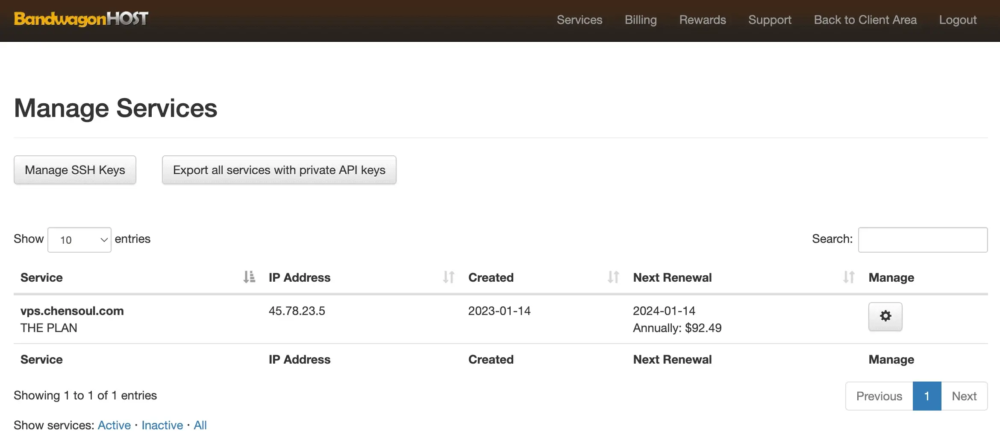

Today I Learned. 今天分享内容：购买新的 VPS 服务器、最近在做什么。

## 购买新的 VPS 服务器

今天看到搬瓦工上的 VPS 还有一个月到期，该 VPS 配置是 40 GB SSD、2 GB RAM、2 TB Bandwidth、3x Intel Xeon CPU、1 Gigabit Network，一年费用是 99 美元。

在中文博客圈微信群里面看到 CloudCone 最近在做 CloudCone 2023 年圣诞节活动。

> [CloudCone](https:/app.cloudcone.com.cn/?ref=10783) 成立于 2017 年，美国注册公司 (怀俄明州 2017-000753144)。主营美国洛杉矶 MultaCom 机房的云服务器 / VPS、独立服务器、电子邮件托管等业务。VPS 基于 KVM 虚拟，采用自行研发的控制面板。其所在的 MultaCom 机房采用动态路由网络，会根据不同网络状态调整线路，很多地区的电信网络会走 CN2 线路，因此延迟和稳定性在非高峰时段都较为优秀。同时该主机商提供了按秒计费、随删随用、定期备份服务。支持**支付宝**、**Paypal**、**信用卡**等方式付款。

CloudCone 2023 年圣诞节 VPS 优惠促销活动。美国西海岸洛杉矶 MultaCom 机房，千兆带宽，1 个 IPv4 地址，3 个 IPv6 地址，基于 KVM 虚拟，SSD Cached RAID 10 存储。

活动地址：[https:/hello.cloudcone.com/2023-christmas-vps-sale](https:/hello.cloudcone.com/2023-christmas-vps-sale/?ref=10783)

|  CPU  | 内存 | 硬盘（SSD） | 流量 | 带宽  |   价格   |                                         购买地址                                         |
| :---: | :--: | :---------: | :--: | :---: | :------: | :--------------------------------------------------------------------------------------: |
| 1 核  | 0.5G |     30G     |  3T  | 1Gbps | $9.5/年  | [点击购买](https:/app.cloudcone.com.cn/vps/220/create?ref=10783&token=xmas-cs-vps-23-1) |
| 2 核  |  1G  |     45G     |  3T  | 1Gbps |  $15/年  | [点击购买](https:/app.cloudcone.com.cn/vps/221/create?ref=10783&token=xmas-cs-vps-23-2) |
| 2 核  |  1G  |     50G     |  3T  | 1Gbps | $16.5/年 |  [点击购买](https:/app.cloudcone.com.cn/vps/212/create?ref=10783&token=xmas-vps-23-1)   |
| 2 核  |  2G  |    100G     |  6T  | 1Gbps |  $26/年  | [点击购买](https:/app.cloudcone.com.cn/vps/222/create?ref=10783&token=xmas-cs-vps-23-3) |
| 2 核  |  2G  |    105G     |  6T  | 1Gbps |  $29/年  |  [点击购买](https:/app.cloudcone.com.cn/vps/213/create?ref=10783&token=xmas-vps-23-2)   |
| 4 核  |  4G  |    205G     |  8T  | 1Gbps | $48.5/年 | [点击购买](https:/app.cloudcone.com.cn/vps/223/create?ref=10783&token=xmas-cs-vps-23-4) |
| 4 核  |  4G  |    210G     |  8T  | 1Gbps |  $54/年  |  [点击购买](https:/app.cloudcone.com.cn/vps/214/create?ref=10783&token=xmas-vps-23-3)   |
| 6 核  |  8G  |    400G     |  8T  | 1Gbps |  $93/年  | [点击购买](https:/app.cloudcone.com.cn/vps/224/create?ref=10783&token=xmas-cs-vps-23-5) |
| 6 核  |  8G  |    410G     |  8T  | 1Gbps | $104/年  | [点击购买](https:/app.cloudcone.com.cn/vps/215/create?ref=10783&token=xmas-cs-vps-23-4) |
| 8 核  | 16G  |    850G     | 10T  | 1Gbps | $188/年  | [点击购买](https:/app.cloudcone.com.cn/vps/225/create?ref=10783&token=xmas-cs-vps-23-6) |
| 8 核  | 16G  |    850G     | 10T  | 1Gbps | $210/年  |  [点击购买](https:/app.cloudcone.com.cn/vps/216/create?ref=10783&token=xmas-vps-23-5)   |
| 16 核 | 32G  |    1024G    | 10T  | 1Gbps | $340/年  | [点击购买](https:/app.cloudcone.com.cn/vps/226/create?ref=10783&token=xmas-cs-vps-23-7) |
| 16 核 | 32G  |     1TB     | 10T  | 1Gbps | $390/年  |  [点击购买](https:/app.cloudcone.com.cn/vps/217/create?ref=10783&token=xmas-vps-23-6)   |

于是买了一个 4 核 4 GB 内存 205 GB 硬盘的 VPS。配置比搬瓦工的 VPS 高了一倍，价格却便宜了一半。瞬间觉得 CloudCone 真香！

接下来的工作就是将原来 VPS 上的服务迁移到新的 VPS 上面。新 VPS 的设置可以参考我之前的一篇博客 [我的 VPS 服务部署记录](https:/blog.chensoul.cc/posts/2023/01/25/notes-about-deploy-services-in-vps/)。

## 今天还做了什么

- 更新博客 [我的 VPS 服务部署记录](https:/blog.chensoul.cc/posts/2023/01/25/notes-about-deploy-services-in-vps/)

## 最近在做什么

最近在看 [小马哥的 Java 项目实战营](https:/u.geekbang.org/subject/java2nd)，看到了 "01 JavaEE 单体架构" 的第 11 节，需要整理笔记，加深理解。总共涉及到的知识点：

- JNDI
- JDBC
- JPA
- 数据校验
- 事务
- Servlet
- 配置管理和 Java Logging
- JMX
- Maven

-- EOF
