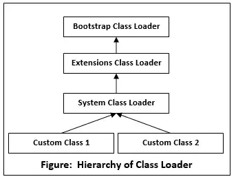
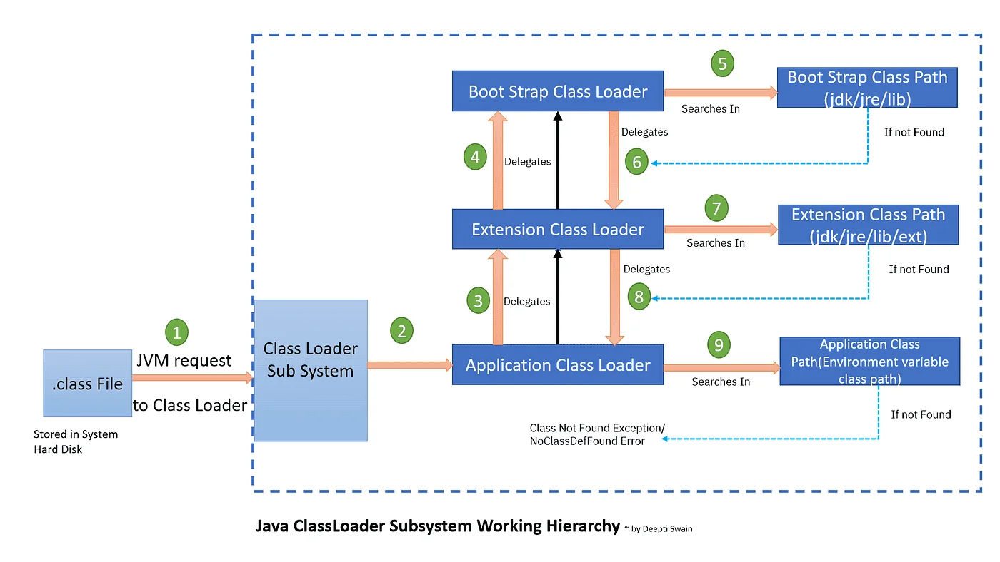

Today I Learned. 今天分享内容：JNDI InitialContext源码分析、ClassLoader加载机制。

## JNDI InitialContext 源码分析

### JNDI包结构

**javax.naming**

- Context
  - InitialContext
- Name
  - CompositeName
  - CompoundName
- NameImpl
- NameParser
- NamingEnumeration
- Referenceable
- RefAddr
  - BinaryRefAddr
  - StringRefAddr
- NameClassPair
  - Binding
- Reference
  - LinkRef

**javax.naming.directory**

- Attribute
  - BasicAttribute

- Attributes
  - BasicAttributes
- DirContext
  - InitialDirContext

- ModificationItem
- SearchControls
- SearchResult

**javax.naming.spi**

- NamingManager
  - DirectoryManager
- ObjectFactory
  - DirObjectFactory
- ObjectFactoryBuilder
- StateFactory
  - DirStateFactory
- InitialContextFactory
- InitialContextFactoryBuilder
- Resolver
  - ContinuationContext
    - ContinuationDirContext
- ResolveResult

### InitialContext 构造方法

InitialContext的初始化有几种方式：

- 通过构造方法
- 通过 `InitialContextFactory#getInitialContext`
- 通过协议转换创建 `InitialContext.getURLOrDefaultInitCtx(String name)`

一个 JNDI 示例：

```java
public class DNSClient {
	public static void main(String[] args) {
		Hashtable<String, String> env = new Hashtable<>();
		env.put(Context.INITIAL_CONTEXT_FACTORY, "com.sun.jndi.dns.DnsContextFactory");
		env.put(Context.PROVIDER_URL, "dns://114.114.114.114");

		try {
			DirContext ctx = new InitialDirContext(env);
			Attributes res = ctx.getAttributes("example.com", new String[]{"A"});
			System.out.println(res);
		} catch (NamingException e) {
			e.printStackTrace();
		}
	}
}
```

InitialDirContext 构造方法初始化过程：

调用 `new InitialContext(Hashtable<?,?> environment)`

- 如果 environment 不为空，则克隆一个 

- 调用 `init(environment)`

  - 调用 `ResourceManager.getInitialEnvironment(environment)` 获取初始化的环境变量

    - 如果入参为空，则 new 一个 Hashtable ，大小 11
    - JNDI 有7个预定义的变量，key 值如下
      - `java.naming.factory.initial`
      - `java.naming.factory.object`
      - `java.naming.factory.state`
      - `java.naming.factory.url.pkgs`
      - `java.naming.provider.url`
      - `java.naming.dns.url`
      - `java.naming.factory.control`

    - 如果定义了 `java.naming.applet`，则调用 AppletParameter 获取变量的值；否则从 System Properties 中获取
    - 如果定义了 `com.sun.naming.disable.app.resource.files`，且该变量的值为 true，即禁用应用的资源文件，则返回；否则调用 `ResourceManager.getApplicationResources()` 读取应用资源文件（即  jndi.properties）定义的变量调用 `mergeTables` 方法合并到 environment
      - 通过 classloader 读取应用资源即 jndi.properties 文件内容，可能会读取到多个，读取到之后合并到 environment
      - 通过 IO 读取 JavaHome 的 lib 目录下的 jndi.properties 文件内容，然后合并到 environment
      - `mergeTables` 合并逻辑：
        - 变量新的 environment 的 key，如果旧的 environment对应 key 的值为空，则使用新的值；如果不为空，并且 key 是 JNDI 预定义的` java.naming.factory.object`、`java.naming.factory.url.pkgs`、`java.naming.factory.state`、`java.naming.factory.control`，则使用冒号连接新旧的值。相当于则几个值的属性可以配置多个值。

- 如果 `java.naming.factory.initial` 不为空，则调用 `getDefaultInitCtx()` 初始化默认的 Context

  - gotDefault 变量控制只能初始化一次

  - 调用 `NamingManager.getInitialContext(myProps)` 获取默认的 Context

    - 如果 `InitialContextFactoryBuilder` 不为空，则使用 `InitialContextFactoryBuilder` 创建 `InitialContextFactory`；否则，使用反射创建 InitialContextFactory
      - 获取 ClassLoader 使用的是 VersionHelper 工具栏的 getContextClassLoader 方法
        - 先获取当前线程的 ClassLoader，如果为空，再获取 `SystemClassLoader` 

    - 调用 InitialContextFactory 的 `getInitialContext(env) `创建 Context

说明：

- 1、读取或者合并 environment 的顺序 
  - 程序设置 -> Applet -> System Properties -> 应用的  jndi.properties -> JavaHome 的 jndi.properties 

- 2、VersionHelper 工具类有读取 System Properties（使用 Java Security 的 AccessController ） 、获取 ClassLoader、反射的方法

  VersionHelper是抽象的单例类，定义为抽象类的好处是可以将方法和实现进行分离。

  ```java
  public abstract class VersionHelper {
      private static VersionHelper helper = null;
    	
    	VersionHelper() {} / Disallow anyone from creating one of these.
  
      static {
          helper = new VersionHelper12();
      }
  
      public static VersionHelper getVersionHelper() {
          return helper;
      }
  }  
  ```

  

- 3、`ResourceManager.getApplicationResources()` 使用了缓存和同步。缓存使用的是 WeakHashMap

  > `WeakHashMap` 是 Java 中的一种特殊类型的 `Map` 实现，它使用弱引用（Weak Reference）来存储键对象。在 `WeakHashMap` 中，当键对象没有被其他强引用所引用时，它们可以被垃圾回收器回收，即使它们存在于 `WeakHashMap` 中。

  ```java
  / WeakHashMap<Class | ClassLoader, Hashtable>
  private static final WeakHashMap<Object, Hashtable<? super String, Object>>
          propertiesCache = new WeakHashMap<>(11);
  ```

  > 需要注意的是，`WeakHashMap` 的性能可能会受到影响，因为它需要在垃圾回收时清理无效的键值对。此外，由于键对象的弱引用特性，可能会导致一些与预期不符的行为，因此在使用 `WeakHashMap` 时需要仔细考虑其适用性和潜在的影响。

  读写 propertiesCache 时，对 propertiesCache 对象添加 synchronized 关键字

  ```java
  	private static Hashtable<? super String, Object>
          getProviderResource(Object obj)throws NamingException{
          if (obj == null) {
              return (new Hashtable<>(1));
          }
          synchronized (propertiesCache) {
              Class<?> c = obj.getClass();
  
              Hashtable<? super String, Object> props = propertiesCache.get(c);
              if (props != null) {
                  return props;
              }
              props = new Properties();
  
              InputStream istream =
                  helper.getResourceAsStream(c, PROVIDER_RESOURCE_FILE_NAME);
  
              if (istream != null) {
                  try {
                      ((Properties)props).load(istream);
                  } catch (IOException e) {
                      NamingException ne = new ConfigurationException(
                              "Error reading provider resource file for " + c);
                      ne.setRootCause(e);
                      throw ne;
                  }
              }
              propertiesCache.put(c, props);
              return props;
          }
      }
  ```

  > `WeakHashMap` 是非线程安全的，它不是设计用于在多线程环境下进行并发访问的。如果多个线程同时对 `WeakHashMap` 进行修改操作，可能会导致不一致的结果或抛出异常。
  >
  > 如果需要在多线程环境中使用 `WeakHashMap`，可以考虑以下两种方式：
  >
  > 1. 使用同步机制：您可以使用 `synchronized` 关键字或其他同步机制（如 `ReentrantLock`）来保护对 `WeakHashMap` 的访问。通过确保只有一个线程可以同时修改 `WeakHashMap`，可以避免并发访问的问题。
  > 2. 使用线程安全的替代类：如果需要在多线程环境中使用并发访问的 `Map`，可以考虑使用线程安全的实现，如 `ConcurrentHashMap`。

- 4、JNDI 还使用了工厂模式和构造者模式。相关类：InitialContextFactory、InitialContextFactoryBuilder，则两个类的方法参数都是使用的 `Hashtable<?,?> environment`，这样可以传入多个参数。JNDI 有定义 spi 包，但是却没有使用Java 的 ServiceLoader 类实现 SPI。原因是 JNDI 是 Java 1.3 引入的，而 ServiceLoader 是在 Java 1.6 引入的。

### Context 初始化

InitialContext 实现了 Context 接口，其内部有一个 Context 引用，表示默认的 Context。Context 接口定义的方法都和命名有关，每个命名都有一个名称，通过这个名称获取 Context 时，可能会获取默认的 Context ，也可能获取自定义的 Context 。

代码如下：

```java
protected Context getURLOrDefaultInitCtx(String name)
    throws NamingException {
    if (NamingManager.hasInitialContextFactoryBuilder()) {
        return getDefaultInitCtx();
    }
    String scheme = getURLScheme(name);
    if (scheme != null) {
        Context ctx = NamingManager.getURLContext(scheme, myProps);
        if (ctx != null) {
            return ctx;
        }
    }
    return getDefaultInitCtx();
}
```

1、如果设置了`InitialContextFactoryBuilder`，则直接返回默认的 Context

2、如果名称中有 schema，则调用 `NamingManager.getURLContext(scheme, myProps)` 获取 Context。例如：`java:comp/env/jdbc/UserPlatformDB`

- 调用 getURLObject 方法 返回对象
  - 通过 ResourceManager 获取 ObjectFactory
    - 读取 `java.naming.factory.url.pkgs` 值作为包名，如果值为空，则使用 `com.sun.jndi.url`；否则将该值使用冒号拼接上 `com.sun.jndi.url`
    - 类名前缀为 `"." + scheme + "." + scheme + "URLContextFactory"`
    - 使用冒号分隔符遍历包名，将包名加上类名，得到全类名的 URLContextFactory，然后通过反射加载类，直到得到一个不为空的 factory，并放入二级缓存中（`WeakHashMap<ClassLoader, Map<String, List<NamedWeakReference<Object>>>>`）。
      - 例如，对于 `java:comp/env/jdbc/UserPlatformDB`，如果没有指定 `java.naming.factory.url.pkgs`，则得到的包名为：`com.sun.jndi.url.java.javaURLContextFactory`
  - 如果 factory 不为空，则调用 `factory.getObjectInstance(urlInfo, name, nameCtx, environment) `返回对象 
- 如果返回的对象是  Context，则返回

3、返回默认的 Context

## Java 类加载机制

Java的ClassLoader（类加载器）机制是Java虚拟机（JVM）用于加载Java类的一种机制。它负责在运行时查找、加载和链接Java类，并生成对应的Class对象。

ClassLoader 机制的主要目标是实现Java的动态扩展性和代码的隔离性。它允许开发人员加载来自不同来源的类，例如本地文件系统、网络、JAR文件等，并将它们组织成一个类层次结构。


### ClassLoader 类结构

ClassLoader 类继承结构：

- `SecureClassLoader`
  - `URLClassLoader`
  - `FactoryURLClassLoader`
  - `AppClassLoader`：
  - `ExtClassLoader`：

常见的ClassLoader包括：

1. Bootstrap ClassLoader：也称为原生类加载器，它是JVM的一部分并且是使用 native 代码编写，负责加载JVM运行时，如`java.lang.Object`。Bootstrap ClassLoader 是所有 ClassLoader 的父类。
2. Extension ClassLoader：`ExtClassLoader`，用于加载Java的扩展类库，位于`jre/lib/ext`目录中 或者由 `java.ext.dirs` 指定目录下的JAR文件。
3. System ClassLoader：`AppClassLoader`，也称为应用程序类加载器，加载用户自定义的类和第三方类库。

`AppClassLoader`是默认的类加载器，如果类加载时我们不指定类加载器的情况下，默认会使用`AppClassLoader`加载类，`ClassLoader.getSystemClassLoader()`返回的系统类加载器也是`AppClassLoader`。


Java中的ClassLoader是一个层次结构，由多个ClassLoader组成。每个ClassLoader都有一个父ClassLoader，除了顶层的原生类加载器（bootstrap class loader）之外。当需要加载一个类时，ClassLoader会首先尝试委托给其父ClassLoader进行加载。只有当父ClassLoader无法加载时，ClassLoader才会尝试自己加载。



### ClassLoader 如何工作




类加载器是 Java 运行时环境的一部分。当 JVM 请求一个类时，类加载器会尝试定位该类，并使用完全限定的类名将类定义加载到运行时中。

`java.lang.ClassLoader.loadClass() `方法负责将类定义加载到运行时。它尝试根据完全限定名称加载类。

如果该类尚未加载，它将请求委托给父类加载器。这个过程递归地发生。

最终，如果父类加载器找不到该类，则子类将调用 `java.net.URLClassLoader.findClass()` 方法在文件系统本身中查找类。

如果最后一个子类加载器也无法加载该类，则会抛出 `java.lang.NoClassDefFoundError` 或 `java.lang.ClassNotFoundException`。


让我们看一下抛出 `ClassNotFoundException` 时的输出示例：

```java
java.lang.ClassNotFoundException:     
    at java.net.URLClassLoader.findClass(URLClassLoader.java:381)    
    at java.lang.ClassLoader.loadClass(ClassLoader.java:424)    
    at java.lang.ClassLoader.loadClass(ClassLoader.java:357)    
    at java.lang.Class.forName0(Native Method)    
    at java.lang.Class.forName(Class.java:348)
```

如果我们从调用 `java.lang.Class.forName() `开始查看错误日志，我们可以看到它首先尝试通过父类加载器加载该类，然后 `java.net.URLClassLoader.findClass() `来加载该类。当它仍然找不到该类时，它会抛出 `ClassNotFoundException`。

### ClassLoader 三个特性

1. **双亲委派模型**

   类加载器遵循委托模型，在请求查找类或资源时，ClassLoader 实例会将类或资源的搜索委托给父类加载器。

   假设我们有一个将应用程序类加载到 JVM 中的请求。系统类加载器首先将该类的加载委托给其父扩展类加载器，后者又将其委托给引导类加载器。

   仅当引导程序和扩展类加载器加载类失败时，系统类加载器才会尝试加载类本身。

2. **可见性**

   子类加载器对其父类加载器加载的类是可见的。

   例如，系统类加载器加载的类可以看到扩展和引导类加载器加载的类，但反之则不然。

   为了说明这一点，如果类 A 由应用程序类加载器加载，类 B 由扩展类加载器加载，则就应用程序类加载器加载的其他类而言，A 类和 B 类都是可见的。

   然而，B 类是唯一对扩展类加载器加载的其他类可见的类。

3. **唯一性**

   由于委托模型的结果，很容易确保唯一的类，因为我们总是尝试向上委托。如果父类加载器无法找到该类，只有当前实例才会尝试自行查找。

### ClassLoader 源码

1、**loadClass() 方法**

```java
public Class<?> loadClass(String name, boolean resolve) throws ClassNotFoundException {
```

该方法负责加载给定名称参数的类。 `name` 参数指的是完全限定的类名。

Java虚拟机调用 `loadClass()` 方法来解析类引用，并将 `resolve` 设置为true。然而，并不总是需要解析一个类。如果我们只需要判断类是否存在，那么 `resolve` 参数设置为 false。

该方法充当类加载器的入口点。

我们可以尝试 `从java.lang.ClassLoader `的源码中了解 `loadClass() `方法的内部工作原理：

```java
protected Class<?> loadClass(String name, boolean resolve)
throws ClassNotFoundException {

  synchronized (getClassLoadingLock(name)) {
      / First, check if the class has already been loaded
      Class<?> c = findLoadedClass(name);
      if (c == null) {
          long t0 = System.nanoTime();
              try {
                  if (parent != null) {
                      c = parent.loadClass(name, false);
                  } else {
                      c = findBootstrapClassOrNull(name);
                  }
              } catch (ClassNotFoundException e) {
                  / ClassNotFoundException thrown if class not found
                  / from the non-null parent class loader
              }

              if (c == null) {
                  / If still not found, then invoke findClass in order
                  / to find the class.
                  c = findClass(name);
              }
          }
          if (resolve) {
              resolveClass(c);
          }
          return c;
      }
  }
```

该方法的默认实现按以下顺序搜索类：

- 调用 `findLoadedClass(String)` 方法以查看该类是否已加载。
- 调用父类加载器上的 `loadClass(String)` 方法。
- 调用 `findClass(String) `方法来查找该类。

2、**defineClass() 方法**

```java
protected final Class<?> defineClass(
  String name, byte[] b, int off, int len) throws ClassFormatError
```

该方法负责将字节数组转换为类的实例。在使用该类之前，我们需要定义它。如果数据不包含有效的类，则会抛出 `ClassFormatError`。

此外，我们无法重写此方法，因为它被标记为最终方法。

3、**findClass() 方法**

```java
protected Class<?> findClass(String name) throws ClassNotFoundException
```

此方法查找以完全限定名称作为参数的类。我们需要在遵循加载类的委托模型的自定义类加载器实现中重写此方法。

此外，如果父类加载器找不到所请求的类，`loadClass() `会调用此方法。

如果类加载器的父级没有找到该类，则默认实现会抛出 `ClassNotFoundException`。

4、**getParent() 方法**

```java
public final ClassLoader getParent()
```

该方法返回委托的父类加载器。某些实现使用 `null` 来表示引导类加载器。

5、**getResource() 方法**

```java
public URL getResource(String name)
```

此方法尝试查找具有给定名称的资源。

它首先将资源委托给父类加载器。如果 parent 为null，则查找虚拟机内置的类加载器的路径。如果失败，该方法将调用 `findResource(String)` 来查找资源。指定为输入的资源名称可以是相对于类路径的，也可以是绝对的。

它返回一个用于读取资源的 URL 对象，如果找不到资源或调用者没有足够的权限来返回资源，则返回 null。

需要注意的是，Java 从类路径加载资源。

最后，Java 中的资源加载被认为是与位置无关的，因为只要设置环境来查找资源，代码在哪里运行并不重要。

### Context Classloaders 

一般来说，上下文类加载器为 J2SE 中引入的类加载委托方案提供了一种替代方法。

正如我们之前了解到的，JVM 中的类加载器遵循分层模型，因此除了引导类加载器之外，每个类加载器都有一个父类加载器。

然而，有时当 JVM 核心类需要动态加载应用程序开发人员提供的类或资源时，我们可能会遇到问题。

例如，在  JNDI 中，核心功能是由 `rt.jar` 中的引导类实现的。但这些 JNDI 类可能会加载由独立供应商实现的 JNDI 提供程序（部署在应用程序类路径中）。这种情况需要引导类加载器（父类加载器）来加载应用程序加载器（子类加载器）可见的类。

**J2SE 委托在这里不起作用，为了解决这个问题，我们需要找到类加载的替代方法。这可以使用线程上下文加载器来实现。**

`java.lang.Thread` 类有一个方法 `getContextClassLoader()`，它返回特定线程的 Context ClassLoader。 Context ClassLoader 是线程的创建者在加载资源和类时提供的。如果未设置该值，则默认为父线程的  Context ClassLoader。

正如前面在 JNDI 源码分析中提到的，在  JNDI 中，获取 ClassLoader 的代码在 VersionHelper12 类的 `getContextClassLoader` 方法中。

```java
final class VersionHelper12 extends VersionHelper {
		
		ClassLoader getContextClassLoader() {
        return AccessController.doPrivileged(
            new PrivilegedAction<ClassLoader>() {
                public ClassLoader run() {
                    ClassLoader loader =
                            Thread.currentThread().getContextClassLoader();
                    if (loader == null) {
                        / Don't use bootstrap class loader directly!
                        loader = ClassLoader.getSystemClassLoader();
                    }

                    return loader;
                }
            }
        );
    }
} 
```


### 参考

-  [ClassLoader](https://javasec.org/javase/ClassLoader/) 

- [Class Loaders in Java](https://www.baeldung.com/java-classloaders)
