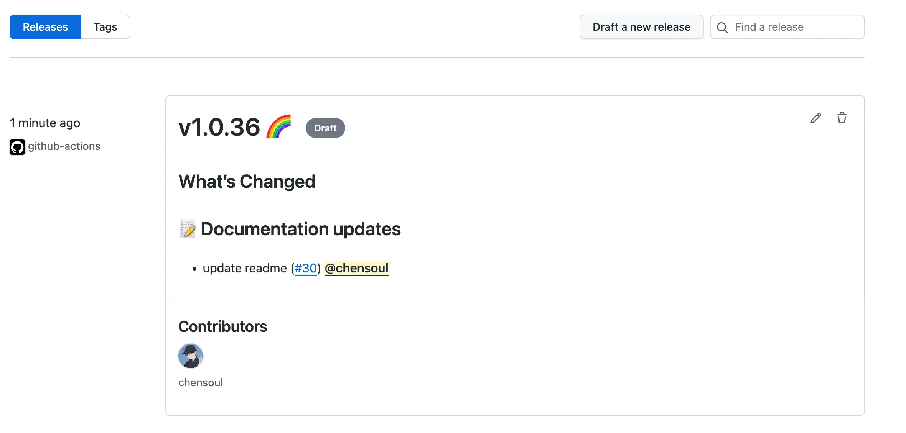
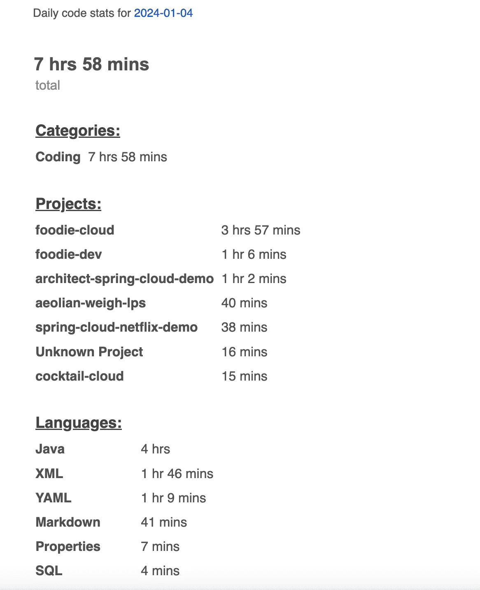

今天做了什么：

- 修改个人联系方式
- 注销亚马逊账号
- 利用GitHub Actions自动优雅地为项目构建Releases
- 利用GitHub Actions自动构建项目的docker镜像并发布到DockerHub


## 修改个人联系方式

使用 ichensoul 注册了新的 Gmail、163 邮箱，并将各种网站绑定的邮箱修改到新的 gmail 邮箱。自此，gmail、github、推特、微信、163 的账号都保持为一致，都是 ichensoul。


以下是 [github](https://github.com/chensoul) 上我的个人联系方式。

> 健康，爱情和使命，按照这个顺序，其它的都不重要。 ------ 纳瓦尔

我是 ChenSoul，一个 Java 软件开发工程师，目前工作在武汉。

热爱编程，喜欢跑步。读书、健身、定投、帮朋友、陪家人，做一个长期主义者。

### 网站

- 博客：[https://blog.chensoul.cc/](https://blog.chensoul.cc/)
- 跑步：[https://run.chensoul.cc/](https://run.chensoul.cc/)
- Memos：[https://memos.chensoul.cc/](https://memos.chensoul.cc/)

### 找到我

- 微信：@ichensoul
- 邮箱：[ichensoul@gmail.com](mailto:ichensoul@gmail.com)
- Github：[https://github.com/chensoul](https://github.com/chensoul)、[https://github.com/ichensoul](https://github.com/ichensoul)
- Twitter：[https://twitter.com/ichensoul](https://twitter.com/ichensoul)
- Telegram频道：[https://t.me/chensouls](https://t.me/chensouls)


## 注销亚马逊账号

缘由是，之前总是收到亚马逊的付款账单（每个月 0.5 美元，有时候1 美元），故元旦放假的时候登陆了亚马逊账号查找付费原因。找了半天没有找到是哪里产生的费用，就一怒之下把在亚马逊注册的域名（chensoul.com，一年 12 美元，一次性付费了 5 年）删除了。


这几天发现本博客无法访问，于是提工单询问是否可以恢复域名。得到的回复是必须支付 66 美元，才能恢复一年。对此，我肯定无法接受。于是，决定注销亚马逊，在其他平台重新注册一个域名。


今天在 CF 上注册了一个新的域名 chensoul.cc，一年 8 美元，一次性付费 5 年。在重新设置 DNS，修改 VPS 上的相关服务的域名为新域名之后，博客恢复正常。


# 利用GitHub Actions自动优雅地为项目构建Releases

参考 [利用GitHub Actions自动优雅地为项目构建Releases](https://wiki.eryajf.net/pages/f3e878) 为 github 上的项目 [https://github.com/chensoul/chensoul-parent](https://github.com/chensoul/chensoul-parent) 添加一个机器人字段构建 Release。


使用方法：

1、参考 [官方文档](https://github.com/release-drafter/release-drafter?tab=readme-ov-file#usage)，在仓库里面配置一个 [GitHub Action](https://github.com/marketplace/actions/release-drafter) ，例如：.github/workflows/release-drafter.yml

```yaml
# https://github.com/release-drafter/release-drafter

name: Release Drafter

on:
  push:
    branches:
      - main
  pull_request:
    types: [opened, reopened, synchronize]

permissions:
  contents: read

jobs:
  update_release_draft:
    permissions:
      contents: write
      pull-requests: write
    runs-on: ubuntu-latest
    steps:
      - uses: release-drafter/release-drafter@v6
        env:
          GITHUB_TOKEN: ${{ secrets.GITHUB_TOKEN }}
```

说明：

- 该 action 只对 main 分支起作用
- 该 action 只对 opened, reopened, synchronize 类型的 pull_request 起作用


2、添加 .github/release-drafter.yml 配置生成的 Release 内容

```yaml
# https://github.com/toolmantim/release-drafter

# 新项目，第一次 release 为 0.1.0, 可以在 github 上手动修改为 0.0.1
name-template: 'v$NEXT_PATCH_VERSION'
tag-template: 'v$NEXT_PATCH_VERSION'

# Emoji reference: https://gitmoji.carloscuesta.me/
categories:
  - title: 🚀 New features
    labels:
      - enhancement
      - feature
  - title: 🐛 Bug fixes
    labels:
      - bug
      - fix
      - hotfix
      - bugfix
  - title: 📝 Documentation updates
    labels:
      - documentation
      - localization
  - title: 🚦Tests
    labels:
      - test
      - tests
  - title: 🧰 Dependency updates
    labels:
      - dependencies
      - dependabot
      - DEPENDABOT
    collapse-after: 15

exclude-labels:
  - reverted
  - no-changelog
  - skip-changelog
  - invalid

autolabeler:
  - label: 'documentation'
    files:
      - '*.md'
    branch:
      - '/docs{0,1}\/.+/'
  - label: 'bug'
    branch:
      - '/bugfix\/.+/'
  - label: 'enhancement'
    branch:
      - '/feature\/.+/'

template: |
  ## What’s Changed

  $CHANGES

  All contributors: $CONTRIBUTORS
```

模板的含义是当提交的 PR 符合其中的 labels 时，对应提交的标题会作为当次提交的说明信息，生成在 release 的草稿中。

有了这些内容，在每次 push 或者 pr 的时候，Actions 都会自动将当次的内容写入到 release 的草稿中，下次再有 pr 则内容将会是追加，并不会覆盖一开始的草稿。


3、通常普通协作者在提交 pr 的时候，大概都很少会有主动给 pr 添加 labels 的，每次还需要项目负责人自己添加，会比较麻烦，而这个功能又是依赖 pr 的 labels 的，因此可以再加一个配置 `.github/PULL_REQUEST_TEMPLATE.md`，该文件配置可以仓库 [GitHub pull request template](https://axolo.co/blog/p/part-3-github-pull-request-template)。

[spring-boot](https://raw.githubusercontent.com/spring-projects/spring-boot/main/.github/PULL_REQUEST_TEMPLATE.md) 项目中的 `.github/PULL_REQUEST_TEMPLATE.md` 内容如下：

```markdown
<!--
Thanks for contributing to Spring Boot. Please review the following notes before
submitting a pull request.

Please submit only genuine pull-requests. Do not use this repository as a GitHub
playground.

Security Vulnerabilities

STOP! If your contribution fixes a security vulnerability, please do not submit it.
Instead, please head over to https://spring.io/security-policy to learn how to disclose a
vulnerability responsibly.

Dependency Upgrades

Please do not open a pull request for a straightforward dependency upgrade (one that
only updates the version property). We have a semi-automated process for such upgrades
that we prefer to use. However, if the upgrade is more involved (such as requiring
changes for removed or deprecated API) your pull request is most welcome.

Describing Your Changes

If, having reviewed the notes above, you're ready to submit your pull request, please
provide a brief description of the proposed changes. If they fix a bug, please
describe the broken behaviour and how the changes fix it. If they make an enhancement,
please describe the new functionality and why you believe it's useful. If your pull
request relates to any existing issues, please reference them by using the issue number
prefixed with #.
-->
```

综合上面的例子，我的  `.github/PULL_REQUEST_TEMPLATE.md` 内容如下：

```markdown
<!--
Thanks for contributing to this project. Please review the following notes before
submitting a pull request.

Please submit only genuine pull-requests. Do not use this repository as a GitHub
playground.

Dependency Upgrades

Please do not open a pull request for a straightforward dependency upgrade (one that
only updates the version property). We have a semi-automated process for such upgrades
that we prefer to use. However, if the upgrade is more involved (such as requiring
changes for removed or deprecated API) your pull request is most welcome.

Describing Your Changes

If, having reviewed the notes above, you're ready to submit your pull request, please
provide a brief description of the proposed changes. If they fix a bug, please
describe the broken behaviour and how the changes fix it. If they make an enhancement,
please describe the new functionality and why you believe it's useful. If your pull
request relates to any existing issues, please reference them by using the issue number
prefixed with #.
-->

## Describing Your Changes

## Checklist before requesting a review
- [ ] I have performed a self-review of my code
- [ ] If it is a core feature, I have added thorough tests.
- [ ] Do we need to implement analytics?
- [ ] Will this be part of a product update? If yes, please write one phrase about this update.
```


这样协作者提交 pr 的时候就会主动提示协作者尽量给当次 pr 添加一个或多个合适的 labels。

最后来看下生成的 release drafter：



## 利用GitHub Actions自动构建项目的docker镜像并发布到DockerHub

参考 [利用GitHub Actions自动构建项目的docker镜像并发布到DockerHub](https://wiki.eryajf.net/pages/5baf0a) ，给 [https://github.com/chensoul/maven-hello-world](https://github.com/chensoul/maven-hello-world) 添加了一个 docker action： `.github/workflows/docker-image.yml `

```yaml
name: Build Docker Image

on:
  push:
    branches: [ "main" ]
    tags: [ "*" ]
  release:
    types: [ created ]

jobs:
  build:
    runs-on: ubuntu-latest
    steps:
      # 暴漏 Github Action 关键变量 https://wiki.eryajf.net/pages/77e2fe
      - name: Inject slug/short variables
        uses: rlespinasse/github-slug-action@v4.5.0

      - name: Docker meta
        id: meta
        uses: docker/metadata-action@v5
        with:
          # list of Docker images to use as base name for tags
          images: |
            ${{ secrets.DOCKER_USERNAME }}/${{ env.GITHUB_REPOSITORY_NAME_PART }}
          # generate Docker tags based on the following events/attributes
          tags: |
            type=ref,event=tag
            type=semver,pattern={{version}}
            type=semver,pattern={{major}}.{{minor}}
            type=semver,pattern={{major}}
            type=raw,latest

      - name: Set up Docker Buildx
        uses: docker/setup-buildx-action@v3

      - name: Set up QEMU
        uses: docker/setup-qemu-action@v3

      - name: Set up Docker Buildx
        uses: docker/setup-buildx-action@v3

      - name: Login to Docker Hub
        if: github.event_name != 'pull_request'
        uses: docker/login-action@v3
        with:
          username: ${{ secrets.DOCKER_USERNAME }}
          password: ${{ secrets.DOCKER_TOKEN }}

      - name: Build and push
        uses: docker/build-push-action@v6
        with:
          platforms: linux/amd64,linux/arm64
          tags: ${{ steps.meta.outputs.tags }}
          push: ${{ github.event_name != 'pull_request' }}
          labels: ${{ steps.meta.outputs.labels }}
```

关键点：使用 rlespinasse/github-slug-action@v4  暴漏Github Action上下文中的关键变量。请参考：[利用github-slug-action暴漏Github Action上下文中的关键变量 ](https://wiki.eryajf.net/pages/77e2fe) 。

## Wakatime 编码统计

Wakatime记录的今日编码时间统计：



## 参考文章

- [利用GitHub Actions自动优雅地为项目构建Releases](https://wiki.eryajf.net/pages/f3e878)
- [利用GitHub Actions自动构建项目的docker镜像并发布到DockerHub](https://wiki.eryajf.net/pages/5baf0a)
- [利用github-slug-action暴漏Github Action上下文中的关键变量 ](https://wiki.eryajf.net/pages/77e2fe)
