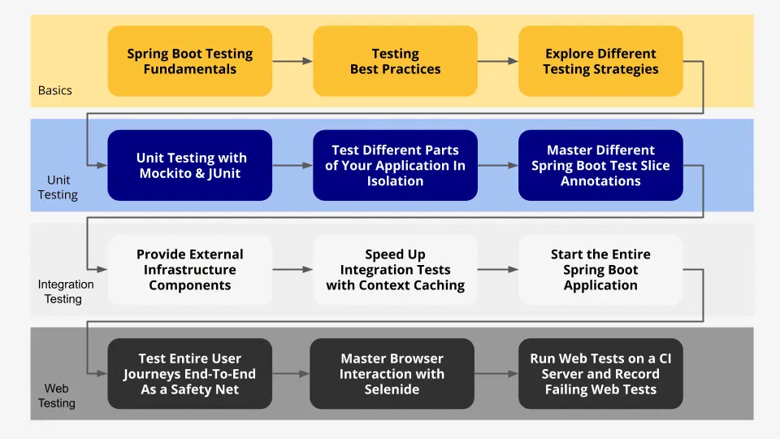

以下是 [SivaLabs 博客](https:/www.sivalabs.in/) 中的一些文章，记录在此，方便后面阅读。


- 如果你正在寻找使用 SpringBoot 实现微服务的详细实用指南，那么 [Java 微服务：实用指南就是你的最佳选择](https:/www.marcobehler.com/guides/java-microservices-a-practical-guide)
- 在使用 JPA 时，我们多少次希望看到使用实际参数值而不是占位符生成的 SQL 查询？我们可以使用[p6spy-spring-boot-starter](https:/github.com/gavlyukovskiy/spring-boot-data-source-decorator)来记录使用实际参数生成的 SQL 语句。

- 如果你刚刚开始使用**GitHub Actions**或考虑从**TravisCI**迁移，那么 [使用 GitHub Actions 进行 Java 项目的持续集成](https:/medium.com/faun/continuous-integration-of-java-project-with-github-actions-7a8a0e8246ef)
- 您可能听说过**六边形架构**，并且想知道如何使用 Spring 实现它，那么本文适合您。利用 [接口和六边形架构的力量实现独立于框架的禅宗](https:/rskupnik.github.io/framework-independence-with-hexagonal-architecture)
- **Docker**已成为日常工作的一部分，有时我们想清理一些不必要的东西。 [如何删除 Docker 容器、镜像、卷和网络](https:/linuxize.com/post/how-to-remove-docker-images-containers-volumes-and-networks/)
- 如果你正在尝试学习**在 Kubernetes 上部署 SpringBoot + SpringCloud 应用程序**，那么我强烈推荐这门课程https:/udemy.com/course/kubernetes-crash-course-for-java-developers/ by **Ranga Karanam** [In28Minutes](https:/twitter.com/In28Minutes)。这是一门非常实用和动手的课程，涵盖了从基础到高级主题。
- 如果您的应用程序严重依赖**Spring 生态系统**，您可能还需要遵循**Spring 风格的编码/格式标准**。在这种情况下，这个[spring-javaformat-maven-plugin](https:/github.com/spring-io/spring-javaformat)可能会派上用场。此外，您还可以查看**JHipster**团队的[Prettier Java](https:/github.com/jhipster/prettier-java)。

- [测试 Spring Boot 应用程序大师课程](https:/rieckpil.de/testing-spring-boot-applications-masterclass/)。**涵盖了测试典型 SpringBoot 应用程序所需的一切：** 本课程几乎涵盖了测试 SpringBoot 应用程序的所有内容（ **JUnit5、Mockito、WebLayer、DataLayer、Security、Testcontainers、Wiremock、WebClient、Localstack、Selenide等）。** 代码仓库：https:/github.com/rieckpil/testing-spring-boot-applications-masterclass

  

- [SpringBoot应用部署与监控系列](https:/www.sivalabs.in/springboot-application-deployment-monitoring-series/)。基于书签服务，**使用Prometheus**和**Grafana**实现监控，使用**ELK/EFK**或**Loki**实现**集中式日志记录**，在Kubernetes(Minikube)上部署SpringBoot应用，使用 Jenkins CICD
- [Kubernetes 入门](https:/www.sivalabs.in/getting-started-with-kubernetes/)。基于 spring boot 部署应用。
- [我最喜欢的 20 场鼓舞人心的技术演讲](https:/www.sivalabs.in/my-all-time-favourite-20-inspiring-tech-talks/)。作为软件开发人员，我们渴望通过学习新工具和技术来提高自己。除此之外，我发现听取专家的意见并借鉴他们的经验也是提升自己技能的好方法。
- [Spring Boot 3：使用 HTTP API 问题详细信息的错误响应](https:/www.sivalabs.in/spring-boot-3-error-reporting-using-problem-details/)。在本文中，我们将学习如何处理 SpringBoot 3 REST API（使用 Spring Framework 6）中的异常并使用**ProblemDetails** API 提供错误响应。
- [使用 Intellij 文件模板提高工作效率](https:/www.sivalabs.in/get-super-productive-with-intellij-file-templates/)
- 如果您正在考虑如何更好地构建代码，那么我强烈建议您观看 [有关 CQRS 的事实与神话 • Oskar Dudycz • Devoxx Poland 2023 的](https:/www.youtube.com/watch?v=9COWKz1E32w)演讲。

- [我在印度作为软件开发人员的生活](https:/www.sivalabs.in/my-life-as-software-developer-in-india/)

- [使用 Travis-CI 为 SpringBoot 应用程序进行 CI/CD](https:/www.sivalabs.in/ci-cd-springboot-applications-using-travis-ci/)

- [SpringBoot 最佳实践](https:/www.sivalabs.in/spring-boot-best-practices/)

- [Kafka 教程 - Java 生产者和消费者](https:/www.sivalabs.in/kafka-tutorial-java-producer-consumer/)

- [Kafka 教程 - 使用 SpringBoot 的生产者和消费者](https:/www.sivalabs.in/kafka-tutorial-producer-consumer-using-spring-boot/)

- [测试 SpringBoot 应用程序](https:/www.sivalabs.in/spring-boot-testing/)

- [创建基于 Yeoman 的 SpringBoot Generator](https:/www.sivalabs.in/creating-yeoman-based-springboot-generator/)

- [使用 ArchUnit 实施代码结构指南](https:/www.sivalabs.in/impose-architecture-guidelines-using-archunit/)

- [作为 Java 和 Spring 应用程序开发人员所需的所有资源](https:/www.sivalabs.in/all-the-resources-you-ever-need-as-a-java-spring-application-developer/)

  

## yeoman 和代码生成器

Yeoman ( http:/yeoman.io/ ) 通过使用 bower、grunt 或 gulp 自动执行各种任务，可以轻松开发前端应用程序。

安装 yeoman：

```bash
sudo npm install -g yo bower grunt-cli gulp
```

安装各种 generator

```bash
sudo npm install -g generator-webapp
sudo npm install -g generator-angular
sudo npm install -g generator-jhipster
sudo npm install -g generator-meanjs
sudo npm install -g cordova ionic
```
