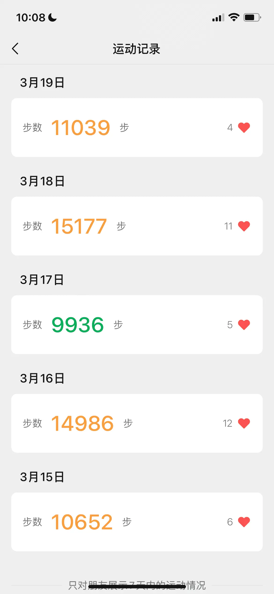
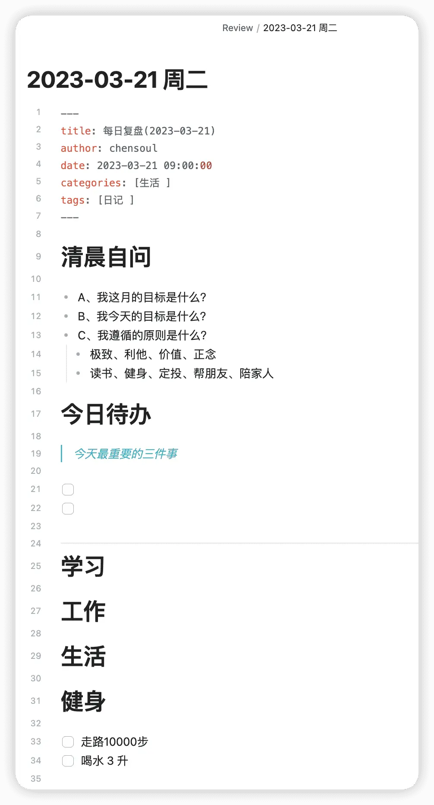
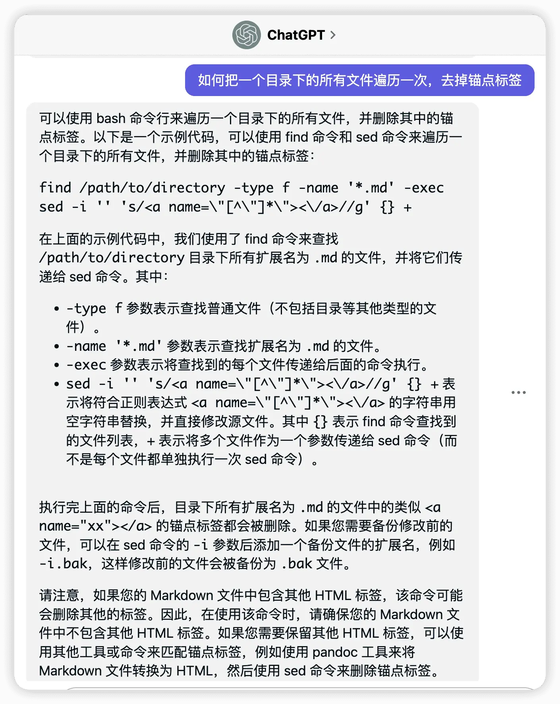

## 前言


图片：_涨渡湖湿地水上森林公园_

本篇是对 `2023-03-13` 到 `2023-03-19` 这周生活的记录与思考。首发在我的个人 [博客](https://blog.chensoul.cc/)，你可以移步了解更多或者给我留言。

这周的工作主要是重构、优化系统，工作节奏比之前轻缓了很多。这周也开始了开车上下班，除去周五去医院做检查，一共开了 4 天车。从汉口到光谷，一共 29 公里，如果早上 6:30 出发，就只需要 50 分钟；如果 6:45 出发，竟然需要两个小时，真是无语了。无奈之下，只能每天早点出门早点到公司，然后，打完卡之后，在公司楼下走路。

这周开始心里默默定了一个 flag，就是每天走路 10000 步。看了一下微信运动，基本上达成了，除了周五晚上因为加班，而少走了 64 步。



## 从语雀迁移到 Obsidian

上周提到开始使用格志 APP 来写日志，使用了一段时间之后，发现了一些缺点：

- 部分功能收费
- 导出的 markdown 不支持图片显示
- 不支持本地存储

于是，放弃了使用格志 APP，继而在使用了一段时间 Obsidian 之后，改为使用 Obsidian 来写日志和周报。



为了不给自己太大压力，日报每天复盘内容包括以下几方面：

- 今日待办

- 学习
- 工作
- 生活
- 健身

### 导出语雀文档为 markdown

参考 [yuque/yuque-exporter](https://github.com/yuque/yuque-exporter) 文档，下载 yuque-exporter 之后进行导出操作，发现以下问题：

- 该项目需要使用的 nodejs 版本为 18.0.4
- nodejs 使用正确的版本还是导出失败

于是，改为使用源码编译和运行导出。

1、先下载代码：

```bash
git clone https://github.com/yuque/yuque-exporter.git
```

2、修改 main.ts 中需要导出的语雀知识库地址为自己的仓库地址：

```ts
/ Determining if an ESM module is main then run the code
if (import.meta.url.startsWith("file:")) {
  const modulePath = fileURLToPath(import.meta.url);
  if (process.argv[1] === modulePath) {
    const urlPaths = ["chensoul/rose", "chensoul/growup", "chensoul/tech"];
    await start({ urlPaths });
  }
}
```

3、参考 [文档](https://www.yuque.com/yuque/developer/api#785a3731) 申请语雀 TOKEN。

4、下载项目依赖：

```bash
npm i
```

5、运行项目，开始导出：

```bash
YUQUE_TOKEN=XXXXXX npm start
```

> 导出的文件在 storage 目录，接下来可以拷贝到 Obsidian 目录里。

6、另外，可以对 yuque-exporter 源码做一些修改：

- 导出的 markdown 文件不要有 frontmatter，修改 doc.ts 中 buildDoc 方法：

```ts
export async function buildDoc(
  doc: TreeNode,
  mapping: Record<string, TreeNode>
) {
  const docDetail = await readJSON(
    path.join(metaDir, doc.namespace, "docs", `${doc.url}.json`)
  );
  const content = await remark()
    .data("settings", { bullet: "-", listItemIndent: "one" })
    .use([
      [replaceHTML],
      [relativeLink, { doc, mapping }],
      [downloadAsset, { doc, mapping }],
    ])
    .process(docDetail.body);

  /  doc.content = frontmatter(doc) + content.toString();
  doc.content = content.toString();

  / FIXME: remark will transform `*` to `\*`
  doc.content = doc.content.replaceAll("\\*", "*");

  return doc;
}
```

- 导出的段落之间增加换行，修改 doc.ts 中 replaceHTML 方法：

```ts
function replaceHTML() {
  return (tree) => {
    const htmlNodes = selectAll("html", tree) as Text[];
    for (const node of htmlNodes) {
      if (node.value === "<br />" || node.value === "<br/>") {
        node.type = "text";
        node.value = "\n\n\n";
      }
    }
  };
}
```

7、删除导出的 markdown 文件当中的锚点标签（例如：`<a name="xx"></a>`）

```bash
cd storage
# macos 上执行
find . -type f -name '*.md' -exec sed -i '' 's/<a name=\"[^\"]*\"><\/a>/g' {} +
```



在上面的示例代码中，我们使用了 sed 命令来删除 Markdown 文件中所有的类似 `<a name="xx"></a>` 的锚点标签。其中：

- `-i ''` 参数表示直接修改源文件，而不是输出到标准输出流。`''` 表示在 macOS 系统上备份修改前的文件，如果在 Linux 系统上使用该命令，可以省略该参数。
- `s/<a name=\"[^\"]*\"><\/a>/g` 表示用空字符串替换所有符合正则表达式 `<a name=\"[^\"]*\"><\/a>` 的字符串。该正则表达式匹配所有以 `<a name=` 开头，以 `"></a>` 结尾的标签，且中间的文本不包含双引号。

8、将导出的 markdown 文件中的本地图片批量上传到图床，操作方法：使用 typora 打开 storage 目录，然后依次点击 格式、图像、上传所有本地图片

## 好物分享

虽然大部分有意思的内容会分享在 『[ChenSoul Share](https://t.me/ichensoul)』Telegram 频道，不过还是挑选一部分在这里列举一下，感觉更像一个 newsletter 了。

### 一些文章

- [GitHub Actions 成本优化：让你的团队更具竞争力](https://moelove.info/2023/03/21/GitHub-Actions-%E6%88%90%E6%9C%AC%E4%BC%98%E5%8C%96%E8%AE%A9%E4%BD%A0%E7%9A%84%E5%9B%A2%E9%98%9F%E6%9B%B4%E5%85%B7%E7%AB%9E%E4%BA%89%E5%8A%9B/)

- [Nginx 开启 gzip 压缩](https://juemuren4449.com/archives/open-gzip-on-nginx)
- [Obsidan 日记、记账与自动同步](https://www.superheaoz.top/2022/06/57091/)
- [Doprax 搭建免费 V2ray 节点](https://elmagnifico.tech/2023/03/16/Doprax-V2ray/)
- [Hi，土区 iCloud](https://elizen.me/posts/2023/03/hi-icloud/)
- [国区使用土耳其 iCloud 服务，手把手保姆级上车教程](https://btsogiwudc.feishu.cn/docx/CgoJdHyWKopl3UxV12GcG3psnjf)

以上。
