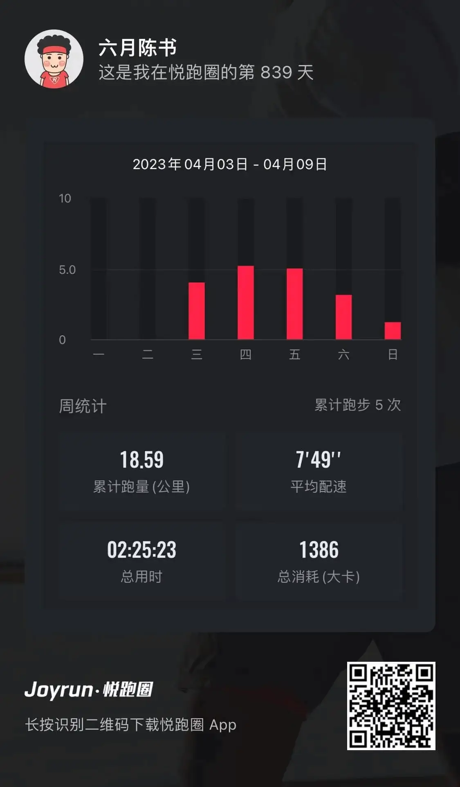

## 前言

本篇是对 `2023-04-03` 到 `2023-04-09` 这周生活的记录与思考。首发在我的个人 [博客](https://blog.chensoul.cc/)，你可以移步了解更多或者给我留言。

这周还是和以前一样每天运动，并开始施行断食。因为是刚开始断食，有时候忍不住饥饿感而吃了一些东西。

本周工作主要是发布了一个版本，其余时间用来学习 Rust 和 Python，初学这两种语言，他们语法上有很多相似之处。如何学习一门编程语言？整理了一些步骤。尝试了一下用多种语言编写猜数游戏，这些语言包括 Rust、Ptyhon、Go、NodeJs、JavaScript、Kotlin、Bash，除了 Java。这是一个很有意思的事情，如果能够把这些语言都熟练掌握，那就更好了。

## 关于健身

完成了每天一万步的计划，并且共跑步 5 次，一共 18.6 公里，平均配速 7 分钟 4 9 秒，每天跳绳 500+。

## 关于记账

本周继续使用微信记账本记录每天支出。累计消费 835 元，明细如下：

- 4 月 3 日，周一：支出 59 元，餐饮

- 4 月 4 日，周二：支出 0 元，

- 4 月 5 日，周三：支出 228 元，超市购物

- 4 月 6 日，周四：支出 15 元，停车费

- 4 月 7 日，周五：支出 12 元

- 4 月 8 日，周六：支出 415 元，加油+餐饮

- 4 月 8 日，周日：支出 106 元，餐饮

## 如何学习一门编程语言

学习一门编程语言的基础语法对于初学者来说非常重要，以下是一些详细的步骤：

1. 了解编程语言的基础概念：在学习编程语言之前，了解编程的基础概念是非常重要的。例如，变量、数据类型、条件语句、循环、函数等等。
2. 寻找学习资源：学习编程语言的基础语法可以通过各种学习资源来实现，如书籍、教程、在线视频和交互式学习平台等。选择适合自己的学习资源是非常重要的。
3. 学习变量和数据类型：在学习编程语言之前，学习变量和数据类型是必须的。了解如何定义变量、赋值和使用不同的数据类型，例如字符串、整数、浮点数、布尔值等等。
4. 学习条件语句：条件语句是编程语言中的重要概念之一。例如，学习如何使用 if 语句和 else 语句，使程序在特定条件下执行不同的代码块。
5. 学习循环：循环是编程语言中的另一个重要概念。例如，学习如何使用 while 循环和 for 循环，使程序在特定条件下重复执行代码块。
6. 学习函数：函数是编程语言中的重要概念之一。学习如何定义和使用函数，以将代码结构化并重用。
7. 练习编写代码：练习编写代码是学习编程语言基础语法的重要方式。编写小程序或项目，例如打印"Hello World"、计算器或猜数字游戏等。
8. 学习调试和错误处理：学习如何调试代码和处理常见错误，例如语法错误、逻辑错误和运行时错误等。

总结一下，学习一门编程语言的步骤：

- 安装
- Hello World
  - 注释
  - 格式化输出
- 变量和常量
- 数据类型
  - 基本类型
    - 运算
    - 类型转换
  - 复杂类型
- 表达式和语句
  - 条件
  - 循环
  - 断言
- 函数
- 类和对象
- 包和模块
- 异常处理
- 标准库

  - IO
  - 网络
  - 多线程

- 单元测试

接下来，打算按照上面的步骤来学习 Rust、Python、Go，也许还会有 NodeJs 和 Kotlin，并整理相关笔记。

## 工作

### Effective Java 3 笔记

请参考 [《Effective Java 3》笔记：使用私有构造函数或枚举类型创建单例](/posts/2023/04/11/enforce-the-singleton-property-with-a-private-constructor-or-an-enum-type/)

### Rust

因为对 [Tauri](https://tauri.app/) 这个 GUI 框架挺感兴趣，所以我开始学习 Rust 了，目前在参考 https://rustwiki.org/ 上的 [通过例子学 Rust](https://rustwiki.org/zh-CN/rust-by-example/) 和 《Rust 权威指南》 学习 Rust。

## 好物分享

虽然大部分有意思的内容会分享在 『[ChenSoul Share](https://t.me/chensouls)』Telegram 频道，不过还是挑选一部分在这里列举一下，感觉更像一个 newsletter 了。

### 一些文章

- [Where to find the EPUB file in iBooks for Mac under OS X 10.9 Mavericks](http://ebookconverter.blogspot.com/2013/11/where-to-find-epub-file-in-ibooks-for.html)
- [使用 CDN 加速 Umami 静态资源](https://roy.wang/umami-js-quicken/)
- [实用 Web API 规范](https://blog.alswl.com/2023/04/web-api-guidelines/)
- [一次本地免费过滤 RSS 的尝试：NetNewsWire](https://utgd.net/article/9367)
- [不想当作家的程序员写不出 Redis](https://catcoding.me/p/redis-antriez/)
- [Kotlin 语法一站式手册](https://www.lijiaocn.com/%E7%BC%96%E7%A8%8B/2023/03/30/kotlin-syntax.html)

### 一些工具

- [Listmonk](https://listmonk.app/) 一款自主托管的电子邮件列表管理工具。它允许您将邮件列表导入到自己的服务器中，并使用它来管理您的邮件列表和发送电子邮件。Listmonk 具有良好的可扩展性和自定义性，可通过 REST API 进行操作，并支持高级功能，例如自定义字段、模板和自动化工作流程，从而使其成为一个非常有用和灵活的电子邮件列表管理工具。与其他在线邮件列表服务相比，Listmonk 的优势之一是您完全掌控自己的数据和服务器，因此您不必担心第三方公司的数据隐私问题。
- [SiteSucker](https://ricks-apps.com/osx/sitesucker/index.html) SiteSucker 是一款 MacOS 平台上的免费工具，它可以帮助用户将整个网站下载到本地电脑中。使用 SiteSucker，用户只需要输入目标网站的 URL，它就会自动下载该网站的所有页面、图像、视频和其他资源，并将它们保存在本地硬盘上，以便用户离线浏览或备份。SiteSucker 支持多线程下载和断点续传，可以在不中断下载的情况下暂停和恢复下载任务。此外，它还可以过滤 URL，以便用户只下载特定类型的文件，例如 HTML、图像或视频文件。总之，SiteSucker 是一款非常实用的工具，适用于需要离线浏览网站、备份网站或进行网站抓取的用户。
- [Montaigne](https://montaigne.io/) 用苹果笔记来创建网站、博客或作品集
- [WechatExporter](https://github.com/BlueMatthew/WechatExporter) 聊天记录导出
- [RapidAPI](https://paw.cloud/) 一款 MacOS 平台上的 API 开发工具，它旨在帮助开发人员更轻松地设计、测试和调试 API。Paw 提供了一个直观的用户界面，可以让用户轻松地构建和调试 API 请求，并查看服务器响应。Paw 支持多种 API 协议和格式，例如 REST、SOAP、GraphQL、JSON 和 XML 等，可以与多种服务器端点和身份验证方式进行集成。此外，Paw 还具有强大的自动化和脚本化功能，允许用户使用 JavaScript 或 Python 编写自定义脚本，以自动化 API 测试和集成工作流程。
- [卸载 MacOS 微信键盘](https://gist.github.com/VincentSit/a682f4162b998c7f24d08ab34bf233da)

以上。
