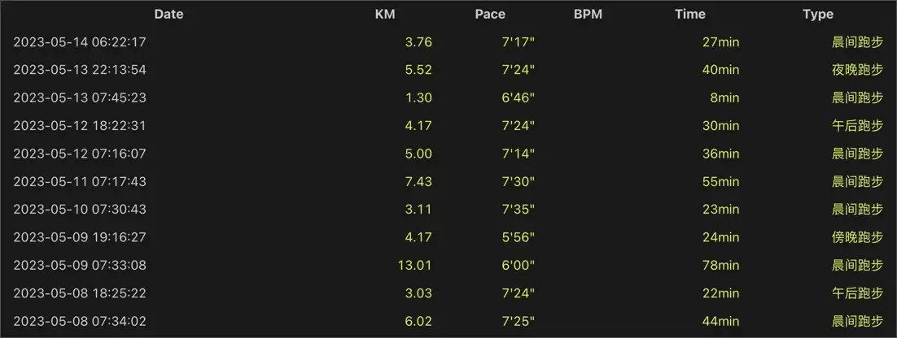
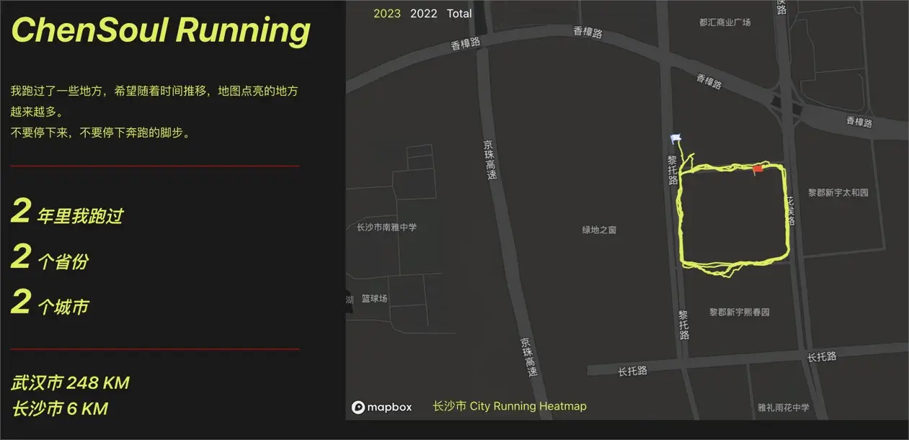

## 前言


本篇是对 `2023-05-08` 到 `2023-05-14` 这周生活的记录与思考。首发在我的个人 [博客](https:/blog.chensoul.cc/)，你可以移步了解更多或者给我留言。

本周继续学习 python，发现一个质量非常高的 python 学习网站 [Real Python](https:/realpython.com/)，该网站有学习 python 的一些教程，是收费的，部分章节是可以免费观看的。

另外，周五晚上老婆临时起意想去武功山看日出，于是立即规划行程并购买火车票。因为一年半之前，我去过一次，所以规划起来还是很轻松的。上一次去是国庆节碰到下雨，没有看到日出。幸运的是，这次是晴天，不仅看到了日落还看到了日出。这一次没有选择住帐篷，而是住在了云中雾客栈，没想到这个客栈离金顶需要 40 分钟左右的路程，而且有段路程是坑坑洼洼。

去武功山之前，先去了长沙，再次游了橘子洲头，并第一次在长沙跑步打卡。本想在萍乡也跑步打卡，奈何没有得逞。

这次去了长沙和武功山，下次基本上是再也不会去爬武功山了。长沙还会去，因为从武功山回来路上，就和老婆规划着什么时候去张家界。

## 武功山看日出


## 理财

这周总计支出 1784 元，明细如下：

- 5 月 8 日：12 元
- 5 月 9 日：18 元
- 5 月 10 日：200 元
- 5 月 11 日：12 元
- 5 月 12 日：445 元
- 5 月 13 日：662 元
- 5 月 14 日：435 元

因为周末出去旅游，所以本周支出有所增多。

## 健身

本周跑步 56 公里，最长跑步距离为 13 公里。


明细数据如下：



周末出去旅游，路过长沙，在长沙跑了两天，累计跑了 6 公里。这样，我的[跑步数据](https:/run.chensoul.cc/) 从 `2 年里我跑过 1 个省份 1 个城市` 变成了` 2 年里我跑过 2 个省份 2 个城市`。



## 工作

### Java

#### 博客

本周完成两篇博客

- [《Effective Java 3》笔记 10：覆盖 equals 方法时应遵守的约定](/posts/2023/05/17/obey-the-general-contract-when-overriding-equals/)
- [JSR 166 规范](/posts/2023/05/18/jsr-166/)

### Python

#### Python 初学建议

**1、新手如何学习 python？**

推荐几篇文章：

- [cPython - 给大学生的入门教程](http:/cpython.org/)

- [如何学 Python？](https:/www.kawabangga.com/how-to-learn-python)

**2、学习 python 编程的 11 个建议**


原文：[11 Beginner Tips for Learning Python Programming](https:/realpython.com/python-beginner-tips/)，总结出以下 11 条新手编程建议：

- 提示 #1：每天编写代码
- 提示#2：写出来
- 提示#3：互动
- 提示#4：休息
- 提示#5：成为漏洞赏金猎人
- 提示#6：与正在学习的其他人在一起
- 技巧#7：教导
- 技巧#8：结对编程
- 提示#9：提出“好的”问题
- 技巧#10：构建一些东西
- 技巧#11：为开源做贡献

  **3、Pyhton 播客：** [Ep 01. 新人到底需要什么](https:/pythonhunter.org/episodes/1)


播客中提到的内容：

- [Tech lead](https:/www.youtube.com/channel/UC4xKdmAXFh4ACyhpiQ_3qBw)
- [starlette](https:/github.com/encode/starlette)
- [Python’s super() considered super!](https:/rhettinger.wordpress.com/2011/05/26/super-considered-super/)
- [huey](https:/github.com/coleifer/huey)
- [apscheduler](https:/github.com/agronholm/apscheduler)
- [Python 3: ten years later - PyCon 2018](https:/www.youtube.com/watch?v=Aj3KMefwOqI)
- [David Beazley - Python Concurrency From the Ground Up: LIVE! - PyCon 2015](https:/www.youtube.com/watch?v=MCs5OvhV9S4)
- [pyflame](https:/github.com/uber/pyflame)
- [提问的智慧](https:/github.com/ryanhanwu/How-To-Ask-Questions-The-Smart-Way/blob/master/README-zh_CN.md)
- [XY 问题](http:/xyproblem.info/)
- [Python Logger](https:/docs.python.org/3/library/logging.html)
- [pdb](https:/docs.python.org/3/library/pdb.html)
- [PyCharm](https:/www.jetbrains.com/pycharm/)
- [Jupyter notebook](https:/jupyter.org/)
- [Let me google that](http:/www.letmegooglethat.com/), [let me google that for you](https:/lmgtfy.com/)
- [学习操作系统的知识，看哪本书好？](https:/www.zhihu.com/question/27871198)
- [PHP 黑系列之二：PHP 为什么函数命名是如此不一致？](https:/zhuanlan.zhihu.com/p/27288770)
- [Scheme](<https:/en.wikipedia.org/wiki/Scheme_(programming_language)>)
- [The Little Schemer](https:/7chan.org/pr/src/The_Little_Schemer_4th_2.pdf)
- [SICP](https:/en.wikipedia.org/wiki/Structure_and_Interpretation_of_Computer_Programs)
- [CS 61A: Structure and Interpretation of Computer Programs](https:/cs61a.org/)

#### Python Tips


本周订阅了 [**Real Python**](https:/realpython.com/) 的 Python Tricks，收到两封邮件，分享如下：

**1、如何一行代码合并两个字典**

```python
# How to merge two dictionaries
# in Python 3.5+

>>> x = {'a': 1, 'b': 2}
>>> y = {'b': 3, 'c': 4}

>>> z = {**x, **y}

>>> z
{'c': 4, 'a': 1, 'b': 3}

# In Python 2.x you could
# use this:
>>> z = dict(x, **y)
>>> z
{'a': 1, 'c': 4, 'b': 3}

# In these examples, Python merges dictionary keys
# in the order listed in the expression, overwriting
# duplicates from left to right.
#
# See: https:/www.youtube.com/watch?v=Duexw08KaC8
```

> **说明：**
>
> 这段代码用于将两个字典 `x` 和 `y` 合并成一个新字典 `z`，其中 `**` 是 Python 中的解包运算符，可以将一个字典拆分成多个键值对，然后将这些键值对作为参数传递给一个函数或用于创建一个新的字典。
>
> 在这个例子中，`{**x, **y}` 表示将字典 `x` 和 `y` 拆分成多个键值对，然后将这些键值对合并成一个新字典。由于字典 `y` 中的键 `b` 与字典 `x` 中的键 `b` 相同，因此在合并后的字典中，键 `b` 对应的值将被更新为字典 `y` 中的值（即 `3`）。

除了上面的方法之外，还可以使用 `update()` 方法

```python
x = {'a': 1, 'b': 2}
y = {'b': 3, 'c': 4}
z = x.copy()
z.update(y)
```

> 在上面的代码中，首先将字典 `x` 复制一份到 `z` 中，然后使用 `update()` 方法将字典 `y` 合并到 `z` 中。如果字典 `y` 中的键在字典 `x` 中已经存在，则会使用字典 `y` 中的值来更新字典 `z` 中的值。最终得到一个新字典 `z`，它包含了字典 `x` 和 `y` 中的所有键值对。

**2、在 Python 中一次测试多个标志的不同方法**

```python
# Different ways to test multiple
# flags at once in Python
x, y, z = 0, 1, 0

if x == 1 or y == 1 or z == 1:
    print('passed')

if 1 in (x, y, z):
    print('passed')

# These only test for truthiness:
if x or y or z:
    print('passed')

if any((x, y, z)):
    print('passed')
```

除了前面提到的四种方法外，还有其他几种方式来测试多个变量是否至少有一个等于某个值：

1. **使用列表解析式**

```python
x, y, z = 0, 1, 0

if any([i == 1 for i in (x, y, z)]):
    print('passed')
```

> 在上面的代码中，使用列表解析式生成一个新列表，其中包含变量 `x`、`y`、`z` 中每个变量是否等于 1 的布尔值。然后，使用 `any()` 函数来测试新列表中是否存在至少一个为真的元素，如果存在，则条件为真，执行 `print()` 语句。

2. **使用 `sum()` 函数**

```python
x, y, z = 0, 1, 0

if sum((i == 1 for i in (x, y, z))):
    print('passed')
```

> 在上面的代码中，使用生成器表达式生成一个新的迭代器对象，其中包含变量 `x`、`y`、`z` 中每个变量是否等于 1 的布尔值。然后，将迭代器对象传递给 `sum()` 函数，它会将所有为真的元素加起来并返回一个整数。如果返回的整数大于 0，则条件为真，执行 `print()` 语句。

3. **使用 `map()` 函数和 `any()` 函数**

```python
x, y, z = 0, 1, 0

if any(map(lambda i: i == 1, (x, y, z))):
    print('passed')
```

> 在上面的代码中，使用 `map()` 函数将一个匿名函数 `lambda i: i == 1` 应用于变量 `x`、`y`、`z` 中的每个元素，它会将每个元素与 1 进行比较并返回一个布尔值。然后，使用 `any()` 函数来测试返回的布尔值序列中是否存在至少一个为真的元素，如果存在，则条件为真，执行 `print()` 语句。

4. **使用 `reduce()` 方法**

```python
from functools import reduce

x, y, z = 0, 1, 0

if reduce(lambda a, b: a or b, (i == 1 for i in (x, y, z))):
    print('passed')
```

> 在上面的代码中，使用生成器表达式生成一个新的迭代器对象，其中包含变量 `x`、`y`、`z` 中每个变量是否等于 1 的布尔值。然后，使用 `reduce()` 函数将一个匿名函数 `lambda a, b: a or b` 应用于迭代器对象中的所有元素，它会将所有元素按照布尔逻辑 `or` 进行聚合，并返回一个布尔值。如果返回的布尔值为真，则条件为真，执行 `print()` 语句。

## 本周分享

大部分有意思的内容会分享在 『[ChenSoul Share](https:/t.me/chensouls)』Telegram 频道或者我的 [memos](https:/memos.chensoul.cc/) 中。我写了一个 python 脚本从 memos 读取最近一周的 memos 记录。

- **2023-05-10** 一些非常有趣的 python 爬虫例子,对新手比较友好,主要爬取淘宝、天猫、微信、微信读书、豆瓣、QQ 等网站。[查看链接](https:/github.com/shengqiangzhang/examples-of-web-crawlers) `#memos` `#python` `#tool`
- **2023-05-08** 这个网站整理了开发者的学习成长路线图，有比较详细的技能树，推荐学习内容等等，偏向开发者。 [查看链接](https:/roadmap.sh/python) `#memos` `#tool`

以上。
