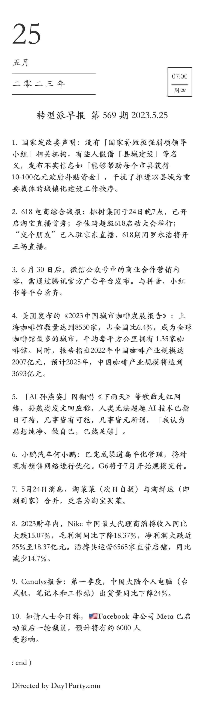
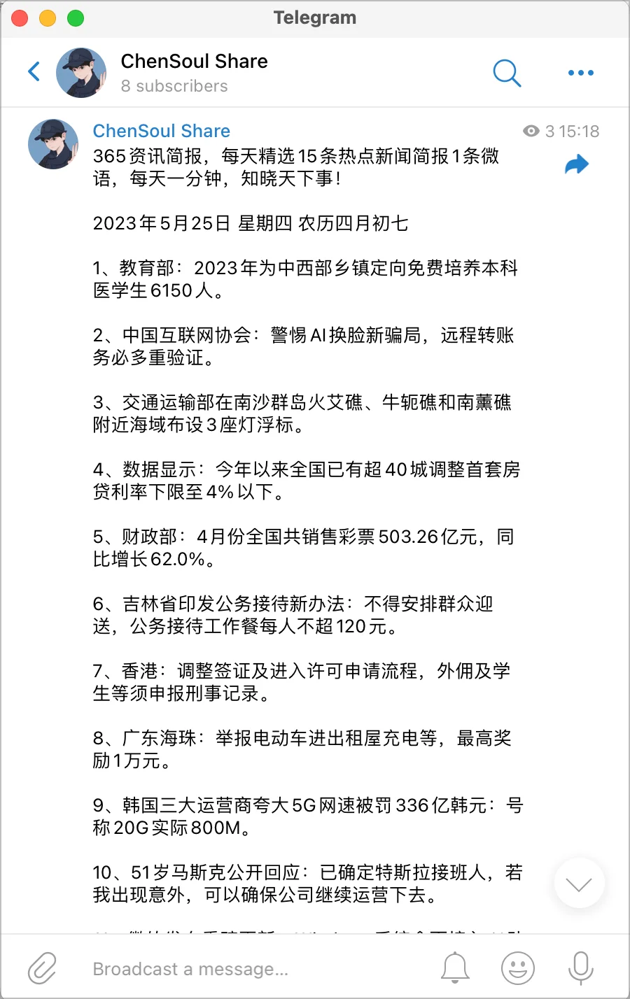
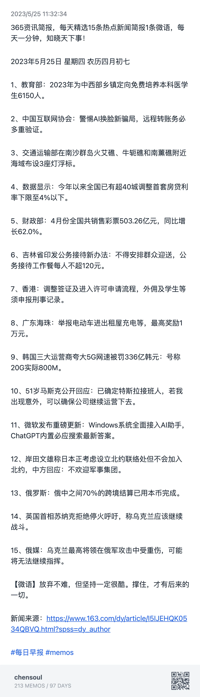
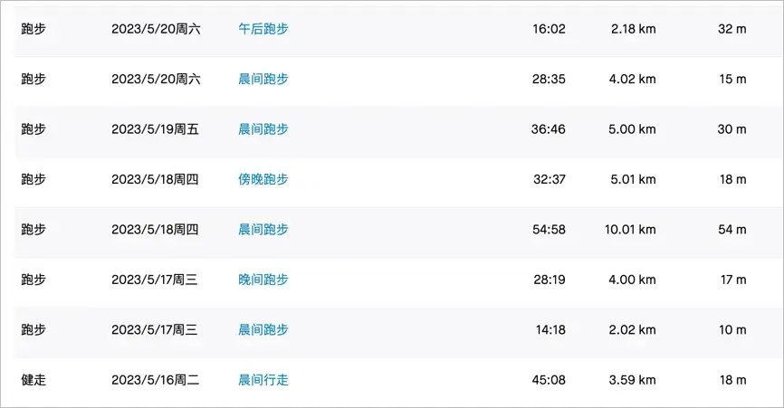

## 前言

<i>乐农湖畔生态园</i>

 

本篇是对 `2023-05-15` 到 `2023-05-21` 这周生活的记录与思考。首发在我的个人 [博客](https:/blog.chensoul.cc/)，你可以移步了解更多或者给我留言。

不知不觉，这已经是第 20 篇周报了。这周依旧是健身、理财、学习和写博客。

## 自动生成每日早报

最近在朋友圈看到这样一个早报，就在想能否通过代码自动抓取新闻并生成这样一个早报图片？

于是，在网上找到一篇文章：[前后端均基于 vercel 的每日早报项目](https:/icodeq.com/2022/5fe2010403bb/)

参考源代码，做了一些修改，代码见：[fetch_news.py](https:/github.com/chensoul/chensoul/blob/main/fetch_news.py)。修改后的逻辑是将抓取的新闻发送到 memos，例如：[https:/memos.chensoul.cc/m/349](https:/memos.chensoul.cc/m/349) 。可以在 github action 设置每天早上 7 点自动发送到 memos，然后再通过 n8n 同步到 『[ChenSoul Share](https:/t.me/chensouls)』Telegram 频道。

在 memos 中导出的图片如下：

如果能够通过 python 自动生成图片，那就更好了。记录一下，待以后实现。

## 团建

公司团建选择在周六，而且还是 520 这一天，真是会挑日子。很多人请假，最后只有 13 人参加团建，其中有 8 人是我们开发组的 🤣。挑两张照片发到这里～

## 理财

这周总计支出 1861 元，明细如下：

- 5 月 15 日：1027 元，武功山旅游，加油 327
- 5 月 16 日：42 元
- 5 月 17 日：12 元
- 5 月 18 日：16 元
- 5 月 19 日：25 元
- 5 月 20 日：562 元，看望六舅
- 5 月 21 日：177 元

## 健身

本周跑步 36 公里，最长跑步距离为 10 公里。明细数据如下：

我跑过了一些地方，希望随着时间推移，地图点亮的地方越来越多。2 年里我跑过 2 个省份 2 个城市。更多跑步数据在[跑步](https:/run.chensoul.cc/)主页。

## 工作

#### 博客

本周完成五篇博客：

- [Java 设计模式：Abstract Document](/posts/2023/05/22/java-design-patterns-abstract-document/)
- [Java 设计模式：Abstract Factory](/posts/2023/05/22/java-design-patterns-abstract-factory/)

- [《Effective Java 3》笔记 11：当覆盖 equals 方法时，总要覆盖 hashCode 方法](/posts/2023/05/23/always-override-hashcode-when-you-override-equals/)

- [[译]Build Robust Continuous Integration With Docker and Friends](/posts/2023/05/22/docker-continuous-integration/)

- [Python 学习 1：注释、变量和常量](/posts/2023/05/23/python-comment-and-variable/)

## 本周分享

大部分有意思的内容会分享在 『[ChenSoul Share](https:/t.me/chensouls)』Telegram 频道或者我的 [memos](https:/memos.chensoul.cc/) 中。我写了一个 python 脚本从 memos 读取最近一周的 memos 记录。

- **2023-05-19** 陈皓（左耳朵耗子）前年做过一次直播访谈，谈到了技术、行业、创业的各个方面。本文是访谈内容的文字整理，以此纪念他。 [https:/mp.weixin.qq.com/s/bOnW8gDJ-dXp4KbAjhDw9A](https:/mp.weixin.qq.com/s/bOnW8gDJ-dXp4KbAjhDw9A) `#memos` `#skill` `#tool`
- **2023-05-17** 用 Material for MkDocs 来生成专业的技术文档 [https:/vra.github.io/2023/05/17/mkdocs-material-tutorial/](https:/vra.github.io/2023/05/17/mkdocs-material-tutorial/) `#memos` `#tool`
- **2023-05-17** 基于 Popsy 创建自己的个人主页 [https:/popsy.co/](https:/popsy.co/) `#memos` `#tool`
- **2023-05-17** Hellonext 是一种反馈管理平台，它可以帮助组织、企业和开发团队更好地管理用户反馈和需求。它提供了一个用户友好的界面，使用户可以轻松地提交反馈和建议，而管理人员可以使用该平台来跟踪和组织这些反馈，并确定哪些反馈应该优先考虑实现。Hellonext 还提供了数据分析和报告功能，帮助管理人员了解用户反馈的趋势和优先级，以便更好地满足用户需求。 [https:/hellonext.co/](https:/hellonext.co/) `#memos` `#tool`
- **2023-05-17** Dify 是一个简单且能力丰富的自然语言编程工具。你可以用它搭建商用级应用，个人助理。如果你想自己开发应用，Dify 也能为你省下接入 OpenAI 的后端工作，但使用我们逐步提供高的可视化运营能力，你可以持续的改进和训练你的 GPT 模型。 [https:/docs.dify.ai/v/zh-hans/getting-started/intro-to-dify](https:/docs.dify.ai/v/zh-hans/getting-started/intro-to-dify) `#tool` `#memos`
- **2023-05-17** 用 200 行 python 代码实现 dns 服务器的教程 [https:/implement-dns.wizardzines.com/](https:/implement-dns.wizardzines.com/) `#memos` `#tool`
- **2023-05-17** postman 推出了 postbot，使用人工智能帮助您调试和理解 API、更快地编写测试 [https:/blog.postman.com/introducing-postbot-postmans-new-ai-assistant/](https:/blog.postman.com/introducing-postbot-postmans-new-ai-assistant/) `#tool` `#memos`
- **2023-05-17** [https:/imgg.gg/](https:/imgg.gg/) 是一个可以将任意 sms 内容转换成为图片的工具，不用担心在 APP 上截图会泄漏隐私。生成的图片的样式很像 [https:/poet.so/](https:/poet.so/) ，不过 Poet.so 只能生成推特、linkedin、shopify 的分享图。 `#tool` `#memos`
- **2023-05-17** 都知道 ffmpeg 是媒体文件处理的瑞士军刀，但命令行的操作对大部分人来说确实会面临迷茫和繁琐。FFmpeg.guide 就是一个图形化生成 ffmpeg 命令的工具。 网站地址：[https:/ffmpeg.guide/](https:/ffmpeg.guide/) `#tool` `#memos`

以上。
