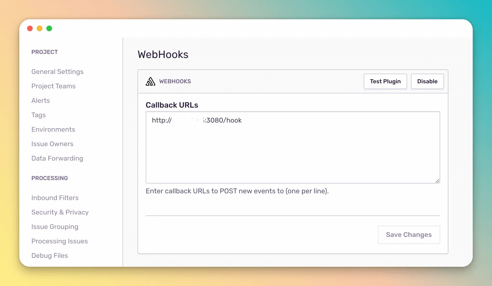
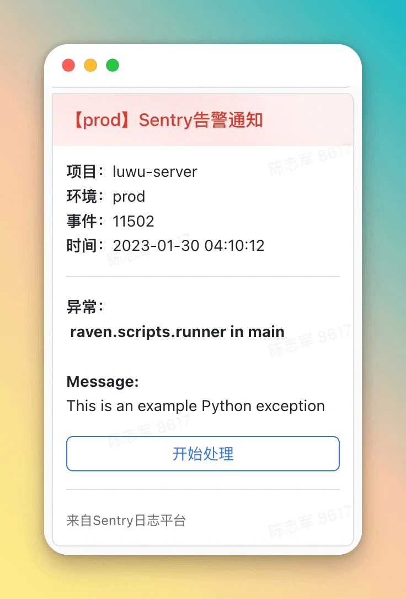
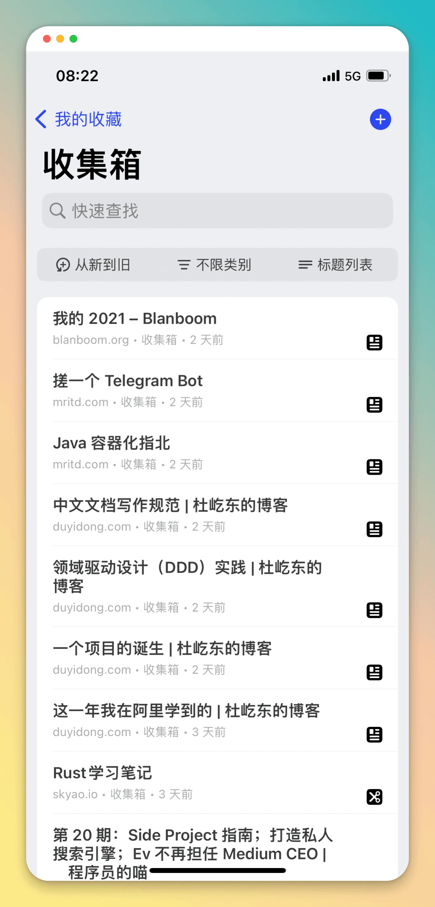

## 前言

本篇是对 `2023-01-23` 到 `2023-01-29` 这周生活的记录与思考。首发在我的个人 [博客](https:/blog.chensoul.cc/)，你可以移步了解更多或者给我留言。

## 过年

这周处于过年吃喝拜年模式，除了腊月二十九和正月初一，其他时间都是和老婆在路上。因为是结婚第一个新年，需要带着老婆去各个亲戚家拜年。因为是第一次在新房过年，就把老爸从农村接过来一起过年。因为年前没有来得及买车，去哪里都不方便，都要需要滴滴打车。为此，打车花了不少钱，当然，给红包也给了不少钱。趁初一不用拜年的缝隙时间，带老婆和老爸去看了两场电影《无名》和《交换人生》。老爸很少去看电影院看电影，听到要去看电影，像个小孩似的，饭还吃完，就跑去电梯门口等电梯。这两场电影，看的我瞌睡来了，倒是初二晚上看《满江红》睡意全无。

总结下来，这个年过的不轻松，身体忙碌，心里幸福 🥰。

## 向上管理

年前，部门领导找我谈 2022 年绩效结果时候，提到我可以 “向上管理” 他。最近从 [杜屹东](https:/www.duyidong.com/) 的博客 [这一年我在阿里学到的](https:/www.duyidong.com/2020/01/01/2019-learn-from-alibaba/) 也看到了他在阿里工作一年后悟到对向上管理的理解。

- 及时和老板表达想法
- 让老板知道你在忙什么
- 主动帮老板做一些脏活累活

前两条是老板知道你的想法，后面一条是帮老板解决问题。此外，还可以帮老板规避风险。

## 本周工作

这是年后的第一周，主要是处理年前没有完成的项目迭代。

### Feign 集成 Micometer

OpenFeign 官方提供了 feign-micrometer 来支持 feign 集成 micrometer。

```java
GitHub github = Feign.builder()
  .addCapability(new MicrometerCapability())
  .target(GitHub.class, "https:/api.github.com");
```

其本质是对 feign 拦截器、client、encoder、decoder 进行封装，测试过程中在没有获取到指标。故，改为使用 z 自定义拦截器和 ErrorCoder 来记录请求次数和失败次数。

```java
@Bean
public GitHub gihhub(MetricsInterceptor metricsInterceptor){
  GitHub github = Feign.builder()
  .requestInterceptor(metricsInterceptor)
  .errorDecoder(new MetricsErrorDecoder())
  .target(GitHub.class, "https:/api.github.com");
}
```

MetricsInterceptor 代码如下：

```java
public class MetricsInterceptor implements RequestInterceptor, MeterBinder {
    private static MeterRegistry meterRegistry;
    public static final String FEIGN_REQUEST = "feign.requests";
    public static final String FEIGN_REQUEST_ERROR = "feign.requests.error";

    public MetricsInterceptor() {
    }

    public void apply(RequestTemplate template) {
        Micrometers.async(() -> {
            String methodKey = template.methodMetadata().configKey();
            Counter counter = Counter.builder("feign.requests").tags(new String[]{"method", StringUtils.substringBefore(methodKey, "(")}).register(meterRegistry);
            counter.increment();
        });
    }

    public void bindTo(MeterRegistry registry) {
        meterRegistry = registry;
    }
}
```

MetricsErrorDecoder 代码如下：

```java
public class MetricsErrorDecoder implements ErrorDecoder {
    private static final Logger log = LoggerFactory.getLogger(MetricsErrorDecoder.class);
    private static MeterRegistry registry = new SimpleMeterRegistry();

    public MetricsErrorDecoder() {
    }

    protected void metrics(String methodKey) {
        Micrometers.async(() -> {
            Metrics.counter("feign.requests.error", new String[]{"method", StringUtils.substringBefore(methodKey, "(")}).increment();
        });
    }

    public Exception decode(String methodKey, Response response) {
        this.metrics(methodKey);
        FeignException exception = FeignException.errorStatus(methodKey, response);
        return exception;
    }

    static {
        Counter.builder("feign.requests.error").register(registry);
    }
}
```

### Sentry 集成飞书通知

参考 [通过 Webhook 实现 Sentry 错误自动化飞书机器人报警](https:/www.ytjia.xyz/blog/2022/05/20/sentry-webhook.html) 这篇文章，使用 fastapi 部署一个 http 服务将 sentry 的回调转发到飞书群的机器人。由于，fastapi 需要在服务器上安装 python3，为了不污染我的 vps，我创建一个 docker 镜像 [sentry-feishu-hook](https:/github.com/chensoul/dockerfiles/tree/master/sentry-feishu-hook)，修改了 python 脚本中的编译错误，并在 vps 上通过 docker 启动该服务。

先编译镜像，再运行：

```bash
docker build -t sentry-feishu-hook .
docker run -d --name sentry-feishu-hook -p 3080:3080 sentry-feishu-hook
```

接下来在 sentry 项目的 WebHooks 里添加 http:/ip:3080/hook



点击 Test Plugin，飞书群组可以收到消息：



## 好物分享

- https:/www.warp.dev/：一个 Rust 编写，使用 GPU 渲染的终端应用。目标是提升开发者的效率。
- [Restful API Mock 工具：JSONPlaceholder](https:/strrl.dev/post/before-2022/restful-api-mock-%E5%B7%A5%E5%85%B7-jsonplaceholder/)
- [NetNewsWire](https:/netnewswire.com/)。Inoreader 最近总是抽风，就改为使用 NetNewsWire 了。使用起来，还是比较顺滑，遗憾的是没有安卓 App。
- [Cubox](https:/cubox.pro/)。最近看到这个收藏工具，下载了使用起来。



以上。
