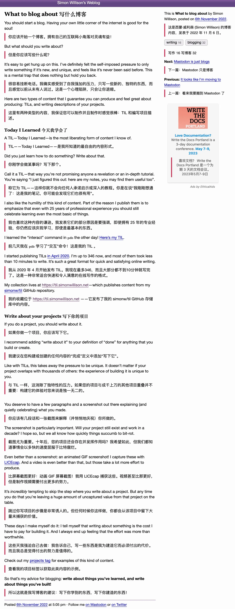
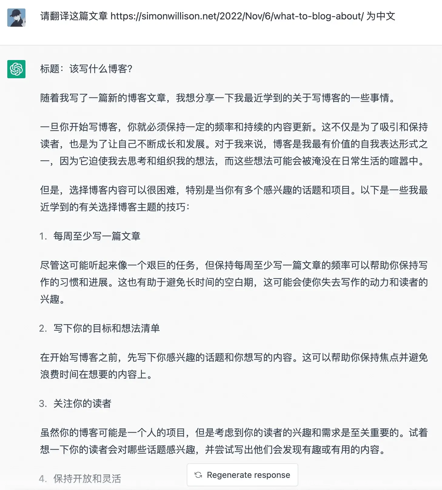
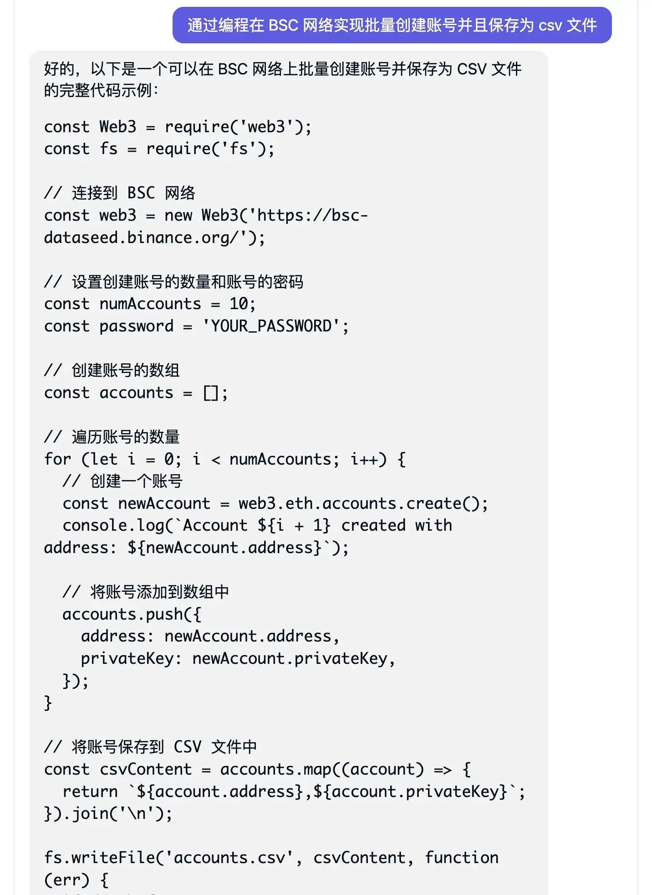
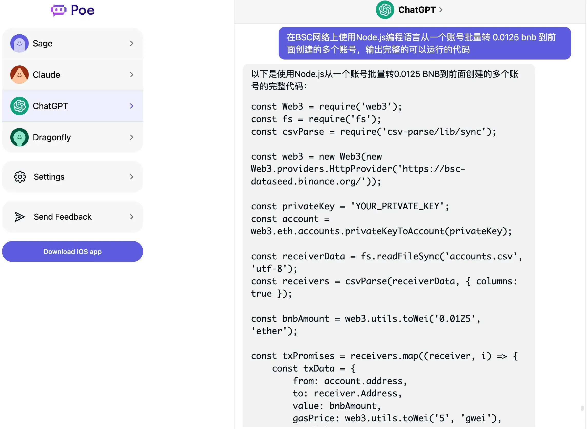
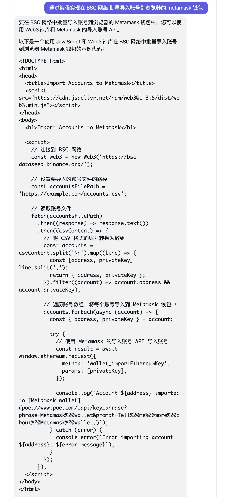
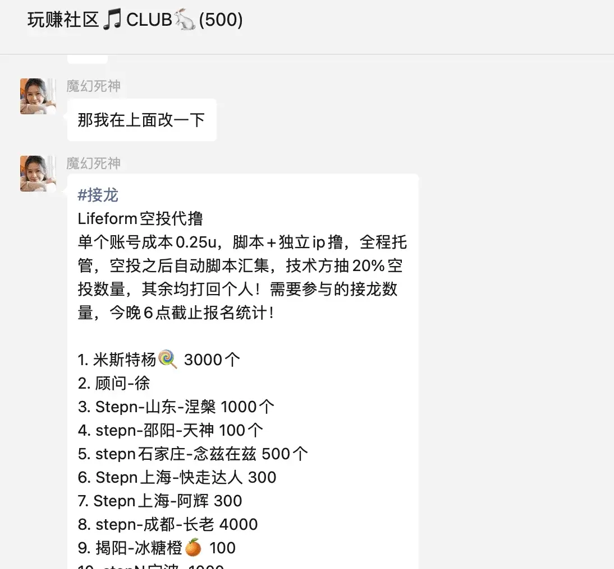

## 前言

本篇是对 `2023-02-27` 到 `2023-03-05` 这周生活的记录与思考。首发在我的个人 [博客](https:/blog.chensoul.cc/)，你可以移步了解更多或者给我留言。

这周的主要工作是版本测试和项目上线，在大家的共同努力下，最后是成功上线。

由于公司最近在裁员，留下来的都开始卷起来，每天晚上 8 点之后下班，这样平均一天的工作时间才有 11 小时。据说，旁边组的同事平均每天都是 12 个小时工作时间。裁了三位同事之后，我们软件组还有 8 人，算法组有 7 人，产品组有 6 人，终端组有 4 人。距集团公司六月上市还有两个月，裁员估计还会继续，同志们还需努力加班，争取被裁的不是自己。

这周还是没有开车，每天坐地铁上下班，刷刷 rss 看看 b 站视频，了解一些行业最新动态，同时也看看同样在写博客的那些独立开发者每周都在做什么，也学习一些新技术或者新技能。

这周接触了 web3 空投，花了几个小时使用自动加手动的方式刷了 120 多个账号。自动的方式，就是用 nodejs 代码在 bsc 网络批量创建账号并保存为 csv 文件；其次，通过 onekey web 上的批量转账功能，给每个账户转了 0.00125bnb。手动操作的部分就是，一个个的将账号私钥导入狐狸钱包，然后，用 lifeform cartoon 连接钱包账户，mint 成功之后，分享链接，再继续连接狐狸的下一个账号，重复上面操作。

因为太耗时间，所以只刷了 120 个账号。趁工作不忙的时候，用 chatgpt 搜索一下如何将上面的操作全部自动化。

周末两天，继续练车，从汉口到阳逻，再到新洲，最后去新洲的将军山爬山、去道观河看风景。算下来，最近这三个周末六天时间，我一共开了 800 多公里了。目前，暂时没有收到违规通知，但还是存在很多不足的地方。

## 开车总结

这周开车，发现存在以下问题：

- 1、停车还是会忘记熄火拔钥匙。
- 2、红绿灯口，停在大货车后面，并靠得近，前方视线受阻。经过红绿灯时，感觉像是闯了红灯。
- 3、超车时候，没有加速。
- 4、在山路行驶，入弯和出弯都会减速。
- 5、判断车距的经验不足。表现在行驶过程中、侧方停车、倒车入库。

针对以上问题，晚上刷了一些视频，做了一些笔记，希望能够帮助自己改正上面这些问题。

- 1、目光看远。入弯提前收油，脚备刹车。如果弯道过急，就带点刹车，如果车速你可以控制，直接收油过弯；出弯加油，眼睛看出弯口。身体跟随方向盘靠。这样，车速不降，可以控制车速。如果以 80 码速度过弯，且这个车还在车道内，这个车的速度你就控制住了。但凡有点越线，说明车速过快，你就要降低速度。

- 2、靠右行驶。会车时，主动靠右。转弯时，发现对面有来车，鸣笛示意。

- 3、路口远道的原则，跟小车不跟大车。如果跟着大车，留一个车位空间，让大车先走，确认绿灯再走。

- 4、红绿灯路口，提前减速，提醒后面车减速，不要急刹车，防止后面车追尾。特别是在绿灯闪的时候，不要没有减速，突然停车。否则后面车会以为你要加速冲过去，他也加速，这样，他就会追尾你。

## 博客该写什么

看到一篇博客 [What to blog about](https:/simonwillison.net/2022/Nov/6/what-to-blog-about/)，里面聊到了博客该写什么。一时兴起，想翻译成中文。于是，分别使用了 chrome 沉浸式翻译插件和 chatgpt 来翻译这篇文章，得到结果如下：

1、**使用 [chrome 沉浸式翻译插件](https:/chrome.google.com/webstore/detail/immersive-translate/bpoadfkcbjbfhfodiogcnhhhpibjhbnh) 翻译这篇文章：**

总结来说，博客可以写两部分内容：

- 今天学到的东西
- 正在做的项目

2、**使用 chatgpt 翻译这篇文章：**

请 chatgpt 翻译这篇文章 https:/simonwillison.net/2022/Nov/6/what-to-blog-about/ 为中文，得到的结果如下：

标题：该写什么博客？

随着我写了一篇新的博客文章，我想分享一下我最近学到的关于写博客的一些事情。

一旦你开始写博客，你就必须保持一定的频率和持续的内容更新。这不仅是为了吸引和保持读者，也是为了让自己不断成长和发展。对于我来说，博客是我最有价值的自我表达形式之一，因为它迫使我去思考和组织我的想法，而这些想法可能会被淹没在日常生活的喧嚣中。

但是，选择博客内容可以很困难，特别是当你有多个感兴趣的话题和项目。以下是一些我最近学到的有关选择博客主题的技巧：

- 每周至少写一篇文章

尽管这可能听起来像一个艰巨的任务，但保持每周至少写一篇文章的频率可以帮助你保持写作的习惯和进展。这也有助于避免长时间的空白期，这可能会使你失去写作的动力和读者的兴趣。

- 写下你的目标和想法清单

在开始写博客之前，先写下你感兴趣的话题和你想写的内容。这可以帮助你保持焦点并避免浪费时间在想要的内容上。

- 关注你的读者

虽然你的博客可能是一个人的项目，但是考虑到你的读者的兴趣和需求是至关重要的。试着想一下你的读者会对哪些话题感兴趣，并尝试写出他们会发现有趣或有用的内容。

- 保持开放和灵活

不要把自己局限在一个主题或领域中。保持开放和灵活，尝试不同的话题和领域。这不仅可以让你发现新的兴趣和机会，还可以让你在写作方面更有创意和灵感。

- 尝试不同的博客格式

不仅可以通过写作来表达自己，还可以通过不同的博客格式来实现这一点。尝试写一篇教程、一篇演示、一篇评论或一篇问题解答文章。这可以让你更好地探索和展示你的技能和知识。

总之，写博客可以是一种令人满意的表达方式，可以帮助你探索和发现新的想法和机会。关键是要保持频率和灵活性，并尝试不同的博客格式。

## Web3 批量空投

最近，参与了 [Lifeform Cartoon](https:/cartoon.lifeform.cc/login) 的空投，这是我第一次参与 web3。下面是记录一下操作步骤：

- 下载狐狸钱包
- 批量创建账号
- 批量从一个账号转币到多个账号
- 批量导入账号到狐狸钱包
- 访问 Lifeform Cartoon 的邀请链接地址，比如：https:/cartoon.lifeform.cc?referral=0x068b021B7d44e4795c6ec07234D66c144644dC37，然后，连接狐狸钱包里的账号，mint 之后，分享链接再使用新的链接重复上面动作

上面的步骤，如果是几百个账号手动执行，则需要花费很长时间。作为一个程序员，有没有办法让程序自动实现呢？

在网上查找了一些资料，同时使用 chatgpt（备注：https:/poe.com/chatgpt）找到了使用 nodejs 实现的相关代码。

### 1、批量创建账号

在 BSC 网络上使用 Node.js 编程语言批量创建账户并保存为 CSV 文件的完整代码，不使用 csv-writer 库

### 2、批量转账

在 BSC 网络上使用 Node.js 编程语言从一个账号批量转 0.0125bnb 到前面创建的多个账号，输出完整的可以运行的代码

### 3、批量导入账号到 metamask 钱包

通过编程实现在 BSC 网络 批量导入账号到浏览器的 metamask 钱包

下一步，就是测试上面代码，实现全流程代码托管。

## 好物分享

虽然大部分有意思的内容会分享在 『[ChenSoul Share](https:/t.me/chensouls)』Telegram 频道，不过还是挑选一部分在这里列举一下，感觉更像一个 newsletter 了。

### 一些文章

- [Service Profiles in Docker | Baeldung](https:/feeds.feedblitz.com/~/729974291/0/baeldung~Service-Profiles-in-Docker)
- [ChatGPT 终极指南](https:/geekr.dev/posts/chatgpt-ultimate-guide)
- [谈谈我对 ChatGPT 应用的 prompt 的看法](https:/reorx.com/makers-daily/004-prompts-and-parameters-transparancy/)
- [支持 OpenAI ChatGPT API 的优秀软件](https:/anotherdayu.com/2023/4866/)
- [编程新手如何通过 ChatGPT 一天完成一个 MVP 产品](https:/geekr.dev/posts/chatgpt-start)
- [让 OpenAI 生成 git commit message](https:/github.com/Zhengqbbb/cz-git)
- [好代码的五个特质 - Thoughtworks 洞见](https:/insights.thoughtworks.cn/good-code-five-qualities-cupid/)
- [我如何搭建自己的博客](https:/www.joshwcomeau.com/blog/how-i-built-my-blog/)（英文）
- [从 Mac 开箱开始 设置一个开发环境 - ZedeX](https:/zedex.cn/8399.html)
- [创始人 CEO 为什么要写作（原创 5000 字长文尝试说透）](https:/mp.weixin.qq.com/s/eil_zYS4ISK-4ojezzP-pg)
- [从抄书到开源之巅：章亦春的程序人生](https:/mp.weixin.qq.com/s/xfphy67PTbtjeggo7LpjSA)

### 一些工具

#### 1、[**poe.com**](https:/poe.com/)

美国问答网站 Quora 开发的 ChatBot 产品，整合不同聊天机器，包括 ChatGPT。响应速度非常快，比 chat.openai.com 的免费账户快非常多。有 ios 版，手机也能用了。ios 版有社区，可以分享聊天记录。

#### 2、[**FounderBeats**](https:/founderbeats.com/)

Founder Beats 是一家面向初创企业和创业者的音乐制作工作室，专门为他们提供高质量的背景音乐和音效。Founder Beats 的音乐库包含了各种类型的音乐，如流行、摇滚、电子、嘻哈、民谣等，以及各种音效和配乐，可以满足不同用户的需求。Founder Beats 的音乐都是由专业音乐人和制作人制作的，具有高品质和原创性。

除了音乐制作，Founder Beats 还提供了其他服务，如音频制作、混音和母带处理等，可以帮助客户制作高质量的音频内容。Founder Beats 的团队拥有丰富的音乐制作和音频处理经验，可以为客户提供专业的建议和支持。

Founder Beats 的客户包括初创企业、广告代理商、视频制作公司、游戏开发商等，他们可以使用 Founder Beats 的音乐和音效来增强他们的品牌形象、视频内容、游戏体验等。Founder Beats 的定价模式灵活，客户可以根据自己的需求选择适合自己的价格和许可证。

#### 3、[Manticore Search](https:/github.com/manticoresoftware/manticoresearch)

Manticore Search 是一款开源的全文搜索引擎，支持高性能的搜索和分析。它是 Sphinx Search 的后继者，使用了类似的架构和 API，并且在功能和性能方面有很多改进。Manticore Search 使用 C++编写，具有高效的索引和查询引擎，可以处理大量的数据和高并发访问。它支持多种数据源和数据格式，包括 MySQL、PostgreSQL、XML、JSON、CSV 等。

Manticore Search 提供了丰富的查询语言和 API，包括 SQL、SPHINQL 和 HTTP API 等，可以满足不同用户的需求。它支持全文搜索、模糊搜索、短语搜索、近义词搜索、地理位置搜索等多种搜索方式，并且支持高级过滤、排序、分组、聚合等功能。Manticore Search 还具有高可用性和可扩展性，支持主从复制、分片、集群等部署方式，可以满足不同规模和负载的应用场景。

Manticore Search 是一款使用广泛的全文搜索引擎，它被广泛应用于电子商务、社交网络、新闻媒体、在线教育等领域，帮助用户快速检索和发现所需信息。Manticore Search 在 GitHub 上开源，拥有活跃的社区和开发者，用户可以通过 GitHub 社区获得支持和贡献代码。

#### 4、[Unsilence](https:/github.com/lagmoellertim/unsilence)

unsilence 是一个基于 Python 的命令行工具，用于检测和修复音频文件中的静音区域。它可以帮助用户自动检测和删除音频文件中的静音部分，从而提高音频的质量和可听性。unsilence 支持多种音频格式，如 MP3、WAV、OGG 等，可以在不损失音频质量的情况下删除静音。

使用 unsilence 非常简单，用户只需在命令行中输入 unsilence 命令和音频文件名，unsilence 就会自动检测和修复音频文件中的静音部分。用户也可以通过设置参数来调整 unsilence 的处理方式，如设置最小静音长度、最小音量阈值等。

#### 5、[CSS Bed](https:/www.cssbed.com/)

这个网页收集并展示各种无类的极简化 CSS 框架。如果你想选一个简单的 CSS 框架，可以看看它

#### 6、[lightrun](https:/lightrun.com/)

lightrun.com 是一款基于云的实时 Java 和 Kotlin 应用程序调试和观察工具。它提供了一种无需修改代码即可实时调试 Java 和 Kotlin 应用程序的方式，减少了开发人员的调试时间，提高了应用程序的稳定性和可靠性。lightrun.com 还提供了实时日志查看和分析，可以帮助开发人员快速定位问题和解决问题，提高了应用程序的可维护性。

lightrun.com 可以与常见的 Java 开发工具集成，如 Eclipse、IntelliJ IDEA 和 VS Code。它还支持多种操作系统和云平台，如 Windows、Linux、Docker、AWS 和 Azure 等。开发人员可以使用 lightrun.com 来调试和监视本地应用程序，也可以在云端快速诊断生产环境中的问题。

lightrun.com 采用了安全的云架构，并且使用了端到端加密来保护用户数据的安全性。它还提供了灵活的计费模式，用户可以根据自己的需求选择适合自己的计费方式。

#### 7、https:/github.com/apps/cr-gpt

基于 ChatGPT 的 Github Code Review 机器人

#### 8、[妙记多 Mojidoc ](https:/mojidoc.com/)

新一代生产协同工具

以上。
