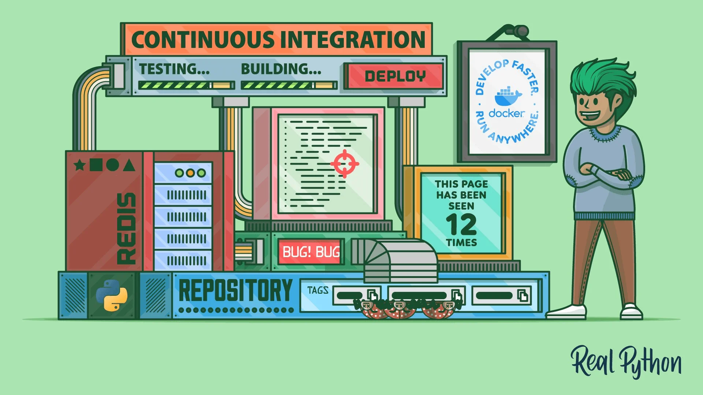

持续集成 (CI) 已成为软件开发的关键，它允许团队频繁合并代码更改并及早发现错误。

Docker 容器通过提供一致的环境帮助促进持续集成过程，您可以在其中测试和发送每次提交的代码。

在本教程中，您将学习如何使用 Docker 为 Flask Web 应用程序创建强大的持续集成管道。

您将完成在本地开发和测试应用程序、将其容器化、使用 Docker Compose 编排容器以及使用 GitHub Actions 定义 CI 管道的步骤。

在本教程结束时，您将能够为您的 Web 应用程序创建一个完全自动化的 CI 管道。

**在本教程中，您将**：

- 在 Docker 容器中本地运行 Redis 服务器
- 用 Docker 编排 Flask 编写的 Python Web 应用程序
- 构建 Docker 镜像并将它们推送到 Docker Hub 仓库
- 使用 Docker Compose 编排多容器应用程序
- 在任何地方复制类似生产的基础设施
- 使用 GitHub Actions 定义持续集成工作流

理想情况下，您应该具有使用 Python 进行 [Web 开发](https://realpython.com/learning-paths/become-python-web-developer/)、[测试自动化](https://realpython.com/learning-paths/test-your-python-apps/)、将 [Redis 与 Python 结合使用](https://realpython.com/python-redis/)以及[使用 Git 和 GitHub 进行源代码版本控制](https://realpython.com/python-git-github-intro/)的经验。以前接触过 [Docker](https://realpython.com/python-versions-docker/) 会更好，但不是必需的。您还应该拥有一个 Git 客户端和一个 GitHub 帐户，以便跟随并复制本教程的步骤。

> 注意：本教程大致基于名为 Docker in Action - Fitter, Happier, More Productive 的旧教程，该教程由 Michael Herman 编写，他于 2015 年 2 月 8 日在 PyTennessee 展示了他的 CI 工作流程。如果你有兴趣，您可以查看展示的相应幻灯片在会议上。
>
> 不幸的是，原始教程中描述的许多工具不再受支持或免费提供。在此更新的教程中，您将使用最新的工具和技术，例如 GitHub Actions。

如果您想跳过在计算机上设置 Docker 和构建示例 Web 应用程序的初始步骤，那么直接跳到定义持续集成管道。无论哪种方式，您都需要下载支持材料，它们与完成的 Flask Web 应用程序和相关资源一起提供，它们将帮助您学习本教程：

> 免费下载：单击[此处](https://realpython.com/bonus/docker-continuous-integration-code/)下载您的 Flask 应用程序和相关资源，以便您可以使用 Docker 定义持续集成管道。

## 项目架构概览

在本教程结束时，您将拥有一个 Flask Web 应用程序，用于跟踪持久存储在 Redis 数据存储中的页面视图。

它将是一个由 Docker Compose 编排的多容器应用程序，您将能够在本地和云端构建和测试，为持续集成铺平道路：

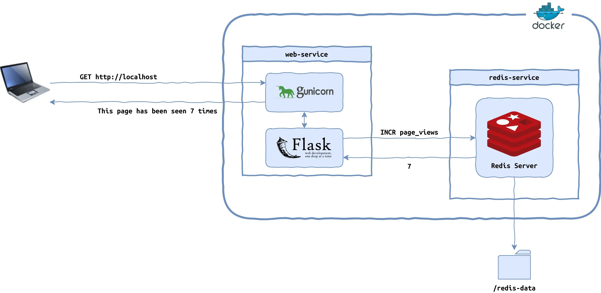

该应用程序由两个 Docker 容器组成。第一个容器将在 Gunicorn 之上运行一个 Flask 应用程序，响应 HTTP 请求并更新页面浏览量。

第二个容器将运行一个 Redis 实例，用于将页面视图数据持久存储在主机上的本地卷中。

Docker 是运行此应用程序所需的全部，您现在将对其进行设置。

## 在您的计算机上设置 Docker

Docker 是一个总称，根据上下文，它对不同的人有不同的含义。例如，当有人提到 docker 时，他们可能指以下之一：

- Docker, Inc.：平台和相关工具背后的公司
- Docker：开源容器平台
- Docker CLI： `docker` 客户端命令行程序
- `dockerd` : 管理容器的 Docker 守护进程

还有一些与 Docker 平台相关的工具和项目，例如：

- Docker Compose
- Docker Desktop
- Docker Engine
- Docker Hub
- Docker Swarm Mode Docker 集群模式

在本教程中，您将使用上面列表中除最后一个之外的所有内容。顺便说一句，不要将遗留的 [Docker Classic Swarm](https://github.com/docker-archive/classicswarm) 与 1.12 版以来内置于 Docker 引擎中的 Docker Swarm Mode 混淆，后者是一个外部工具。

> 注意：您可能听说过 Docker Machine 和 Docker Toolbox。这些是不再维护的旧工具。

Docker 解决的主要问题是能够在几乎没有或没有配置的情况下在一致且可重现的环境中的任何地方运行应用程序。它可以将您的应用程序代码、二进制文件和依赖项（例如语言运行时和库）打包到一个工件中。您将在开发期间和持续集成服务器上使用 Docker 在本地计算机上模拟假设的生产环境。

安装 Docker 有两种选择：

1. [Docker Engine](https://docs.docker.com/engine/)
2. [Docker Desktop](https://docs.docker.com/desktop/)

如果您熟悉终端并喜欢额外的控制级别，那么开源 Docker 引擎就是您的最佳选择，它提供核心运行时和用于管理容器的命令行界面。另一方面，如果您更喜欢具有直观图形用户界面的一站式解决方案，那么您应该考虑使用 Docker Desktop。

> 注意：开箱即用的桌面应用程序附带 [Docker Compose](https://docs.docker.com/compose/)，稍后在[编排容器](https://realpython.com/docker-continuous-integration/#orchestrate-containers-using-docker-compose)以进行持续集成时将需要它。

当您浏览 [Docker 官方文档](https://docs.docker.com/)时，您可能会觉得 Docker Desktop 占据了聚光灯下。这是一个非常棒的工具，但您必须记住，Docker Desktop 仍然免费供个人使用。自 2021 年 8 月起，您需要[付费订阅](https://www.docker.com/pricing/)才能在商业项目中使用它。

虽然在技术上可以并排安装这两种工具，但您通常应该避免同时使用它们，以尽量减少虚拟网络或端口绑定之间任何潜在干扰的风险。您可以通过停止其中之一并在 Docker Engine 和 Docker Desktop 之间[切换上下文](https://docs.docker.com/desktop/faqs/linuxfaqs/#context)来实现。

> 注意：Docker Desktop 过去只能在 Windows 和 macOS 上使用，但现在情况发生了变化，您现在也可以在某些 Linux 发行版上安装它，包括 [Ubuntu](https://docs.docker.com/desktop/install/ubuntu/)、[Debian](https://docs.docker.com/desktop/install/debian/) 和 [Fedora](https://docs.docker.com/desktop/install/fedora/)。但是，Linux 版本的 Docker Desktop 运行在[虚拟机](https://docs.docker.com/desktop/faqs/linuxfaqs/#why-does-docker-desktop-for-linux-run-a-vm)之上，以模仿在其他操作系统上使用它的用户体验。

要验证您是否已在系统上成功安装 Docker（作为 Docker Engine 或 Docker Desktop 包装器应用程序），请打开终端并键入以下命令：

```bash
$ docker --version
Docker version 23.0.4, build f480fb1
```

您应该会看到您的 Docker 版本以及内部版本号。如果您使用的是 Linux，那么您可能希望按照[安装后的步骤](https://docs.docker.com/engine/install/linux-postinstall/)使用 `docker` 命令，而无需在其前面加上 `sudo` 以获得管理权限。

在开始使用 Docker 来帮助进行持续集成之前，您需要创建一个基本的 Web 应用程序。

## 在 Flask 中开发页面视图跟踪器

在接下来的几节中，您将使用 [Flask](https://realpython.com/tutorials/flask/) 框架实现一个基本的 Web 应用程序。您的应用程序将跟踪页面浏览总数，并在每次请求时向用户显示该数字：

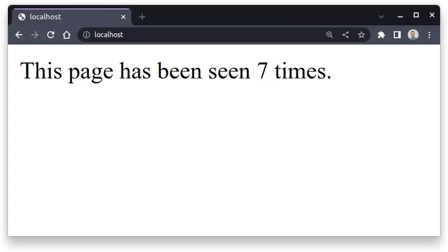

应用程序的当前状态将保存在 [Redis](https://redis.io/) 数据存储中，该存储通常用于缓存和其他类型的数据持久化。这样，停止您的网络服务器不会重置观看次数。您可以将 Redis 视为一种数据库。

如果您对从头开始构建此应用程序不感兴趣，请随时通过单击下面的链接下载其完整源代码，然后跳到对您的 Flask Web 应用程序[进行 docker 化](https://realpython.com/docker-continuous-integration/#dockerize-your-flask-web-application)：

即使您打算自己编写代码，下载完成的项目并将其用作参考与您的实现进行比较仍然是个好主意，以防您遇到困难。

> 免费下载：单击[此处](https://realpython.com/bonus/docker-continuous-integration-code/)下载您的 Flask 应用程序和相关资源，以便您可以使用 Docker 定义持续集成管道。

在开始开发应用程序之前，您需要设置工作环境。

### 准备环境

与每个 [Python 项目](https://realpython.com/tutorials/projects/)一样，您在开始时应该遵循大致相同的步骤，包括创建一个新目录，然后为您的项目创建并激活一个隔离的[虚拟环境](https://realpython.com/python-virtual-environments-a-primer/)。您可以直接从您最喜欢的[代码编辑器](https://realpython.com/python-ides-code-editors-guide/)（如 [Visual Studio Code](https://realpython.com/python-development-visual-studio-code/)）或功能齐全的 IDE（如 [PyCharm](https://realpython.com/pycharm-guide/)）执行此操作，或者您可以在终端中键入一些命令：

Windows：

```bash
PS> mkdir page-tracker
PS> cd page-tracker
PS> python -m venv venv --prompt page-tracker
PS> venv\Scripts\activate
(page-tracker) PS> python -m pip install --upgrade pip
```

Linux + MacOS：

```bash
$ mkdir page-tracker/
$ cd page-tracker/
$ python3 -m venv venv/ --prompt page-tracker
$ source venv/bin/activate
(page-tracker) $ python -m pip install --upgrade pip
```

首先，创建一个名为 `page-tracker/` 的新目录，然后在其中创建一个名为 `venv/` 的 Python 虚拟环境。为虚拟环境提供描述性提示，使其易于识别。最后，激活新建的虚拟环境后，将 [`pip`](https://realpython.com/what-is-pip/) 升级到最新版本，以免以后安装[Python 包](https://realpython.com/python-modules-packages/)时出现问题。

> 注意：在 Windows 上，您可能需要先以管理员身份运行 [Windows Terminal](https://realpython.com/python-coding-setup-windows/#discovering-the-windows-terminal) 并在创建虚拟环境之前[放宽脚本执行策略](https://realpython.com/python-coding-setup-windows/#loosening-your-execution-policy)。

在本教程中，您将使用现代方式通过 [pyproject.toml](https://realpython.com/courses/packaging-with-pyproject-toml/) 配置文件和 [setuptools](https://setuptools.pypa.io/en/latest/) 指定项目的依赖项和元数据[作为构建后端](https://peps.python.org/pep-0517/)。此外，您将遵循 [src 布局](https://packaging.python.org/en/latest/discussions/src-layout-vs-flat-layout/)，将应用程序的源代码放在单独的 `src/` 子目录中，以更好地组织项目中的文件。这将使您可以直接打包代码，而无需稍后添加的自动化测试。

继续使用以下命令构建您的 Python 项目占位符：

Windows：

```bash
(page-tracker) PS> mkdir src\page_tracker
(page-tracker) PS> ni src\page_tracker\__init__.py
(page-tracker) PS> ni src\page_tracker\app.py
(page-tracker) PS> ni constraints.txt
(page-tracker) PS> ni pyproject.toml
```

Linux + MacOS：

```bash
(page-tracker) $ mkdir -p src/page_tracker
(page-tracker) $ touch src/page_tracker/__init__.py
(page-tracker) $ touch src/page_tracker/app.py
(page-tracker) $ touch constraints.txt
(page-tracker) $ touch pyproject.toml
```

完成后，您应该具有以下目录结构：

```bash
page-tracker/
│
├── src/
│   └── page_tracker/
│       ├── __init__.py
│       └── app.py
│
├── venv/
│
├── constraints.txt
└── pyproject.toml
```

如您所见，您将只有一个 Python 模块， `app` ，定义在一个名为 `page_tracker` 的包中，位于 `src/` 目录中。 `constraints.txt` 文件将指定项目依赖项的固定版本，以实现可[重复安装](https://pip.pypa.io/en/stable/topics/repeatable-installs/)。

该项目将依赖于两个外部库， [Flask](https://pypi.org/project/Flask/) 和 [Redis](https://pypi.org/project/redis/) ，您可以在 `pyproject.toml` 文件中声明它们：

```toml
# pyproject.toml

[build-system]
requires = ["setuptools>=67.0.0", "wheel"]
build-backend = "setuptools.build_meta"

[project]
name = "page-tracker"
version = "1.0.0"
dependencies = [
    "Flask",
    "redis",
]
```

请注意，您通常不会在此处指定依赖项版本。相反，您可以将它们与[需求](https://pip.pypa.io/en/stable/user_guide/#requirements-files)或[约束文件](https://pip.pypa.io/en/stable/user_guide/#constraints-files)中的任何[传递依赖项](https://en.wikipedia.org/wiki/Transitive_dependency)一起[冻结](https://pip.pypa.io/en/stable/cli/pip_freeze/#pip-freeze)。第一个告诉 `pip` 要安装什么包，后者强制执行传递依赖项的特定包版本，类似于 [Pipenv](https://realpython.com/pipenv-guide/) 或 [Poetry](https://realpython.com/dependency-management-python-poetry/) 锁定文件。

要生成约束文件，您必须首先将您的 `page-tracker` 项目安装到活动的虚拟环境中，这将从 [Python 包索引 (PyPI)](https://pypi.org/) 中获取所需的外部库。确保您已经创建了所需的文件夹结构，然后发出以下命令：

```bash
(page-tracker) $ python -m pip install --editable .
(page-tracker) $ python -m pip freeze --exclude-editable > constraints.txt
```

即使您还没有输入一行代码，Python 也会识别并安装您的包占位符。因为您的包遵循 `src` 布局，所以在开发期间以[可编辑模式](https://setuptools.pypa.io/en/latest/userguide/development_mode.html)安装它很方便。这将允许您更改源代码并立即将它们反映在虚拟环境中，而无需重新安装。但是，您想从约束文件中排除可编辑包。

> 注意：如果您打算共享您的项目，生成的约束文件非常有价值。这意味着其他人可以在他们的终端中运行以下命令来重现与您相同的环境：
>
> ```bash
> (page-tracker) $ python -m pip install -c constraints.txt .
> ```
>
> 因为您通过 `-c` 选项提供了一个约束文件， `pip` 安装了固定的依赖项而不是最新的可用依赖项。这意味着您有可重复的安装。稍后您将使用类似的命令来构建 Docker 镜像。

好的。您几乎已经准备好开始编写您的 Flask Web 应用程序了。在执行此操作之前，您将切换一下方式并准备一个本地 Redis 服务器以通过网络连接。

### 通过 Docker 运行 Redis 服务器

Redis 这个名字是单词远程字典服务器的合成词，它非常准确地表达了它作为远程内存数据结构存储的目的。作为一个键值存储，Redis 就像一个远程 [Python 字典](https://realpython.com/python-dicts/)，您可以从任何地方连接到它。它也被认为是在许多不同环境中使用的最流行的 NoSQL 数据库之一。通常，它用于关系数据库之上的[缓存](https://realpython.com/caching-in-django-with-redis/)。

> 注意：虽然 Redis 将其所有数据保存在易失性内存中，这使其速度极快，但该服务器具有多种持久性选项。在断电或重启的情况下，它们可以确保不同级别的数据持久性。然而，正确配置 Redis 通常很困难，这就是为什么许多团队决定使用外包给云提供商的托管服务的原因。

在您的计算机上安装 Redis 非常简单，但假设您之前已经安装和配置了 Docker，通过 Docker 运行它会更加简单和优雅。当您在 Docker 容器中运行诸如 Redis 之类的服务时，它会与系统的其余部分保持隔离，而不会造成混乱或占用有限的网络端口号等系统资源。

要在不将 Redis 安装在主机上的情况下运行 Redis，您可以通过调用以下命令从[官方 Redis 镜像](https://hub.docker.com/_/redis)运行新的 Docker 容器：

```bash
$ docker run -d --name redis-server redis
Unable to find image 'redis:latest' locally
latest: Pulling from library/redis
26c5c85e47da: Pull complete
39f79586dcf2: Pull complete
79c71d0520e5: Pull complete
60e988668ca1: Pull complete
873c3fc9fdc6: Pull complete
50ce7f9bf183: Pull complete
Digest: sha256:f50031a49f41e493087fb95f96fdb3523bb25dcf6a3f0b07c588ad3cdb...
Status: Downloaded newer image for redis:latest
09b9842463c78a2e9135add810aba6c4573fb9e2155652a15310009632c40ea8
```

这将基于最新版本的 `redis` 镜像创建一个新的 Docker 容器，自定义名称为 `redis-server` ，稍后您将引用它。容器以分离模式 ( `-d` ) 在后台运行。当您第一次运行此命令时，Docker 会从 Docker Hub 中拉取相应的 Docker 镜像，这是 Docker 镜像的官方存储库，类似于 PyPI。

只要一切按计划进行，您的 Redis 服务器就应该启动并运行。因为您以分离模式 ( `-d` ) 启动了容器，所以它将在后台保持活动状态。要验证这一点，您可以使用 `docker container ls` 命令或等效的 `docker ps` 别名列出您的 Docker 容器：

```bash
$ docker ps
CONTAINER ID   IMAGE   ...   STATUS              PORTS      NAMES
09b9842463c7   redis   ...   Up About a minute   6379/tcp   redis-server
```

在这里，您可以看到一个 ID 前缀与您在运行 `docker run` 命令时获得的 ID 前缀匹配的容器从大约一分钟前开始启动。该容器基于 `redis` 镜像，已命名为 `redis-server` ，并使用 TCP 端口号 `6379` ，这是 Redis 的默认端口。

接下来，您将尝试以各种方式连接到该 Redis 服务器。

### 测试与 Redis 的连接

在 Docker Hub 上官方 Redis 镜像的概述页面上，您将找到有关如何连接到在 Docker 容器中运行的 Redis 服务器的说明。具体而言，此页面讨论了如何使用 Docker 镜像附带的专用交互式命令行界面 Redis CLI 。

您可以从同一个 `redis` 镜像启动另一个 Docker 容器，但这一次，将容器的入口点设置为 `redis-cli` 命令而不是默认的 Redis 服务器二进制文件。当您设置多个容器一起工作时，您应该使用 Docker 网络，这需要一些额外的配置步骤。

首先，新建一个以你的项目命名的自定义桥接网络，例如：

```bash
$ docker network create page-tracker-network
c942131265bf097da294edbd2ac375cd5410d6f0d87e250041827c68a3197684
```

通过定义这样的虚拟网络，您可以连接任意数量的 Docker 容器，并让它们通过描述性名称相互发现。您可以通过运行以下命令列出您创建的网络：

```bash
$ docker network ls
NETWORK ID     NAME                   DRIVER    SCOPE
1bf8d998500e   bridge                 bridge    local
d5cffd6ea76f   host                   host      local
a85d88fc3abe   none                   null      local
c942131265bf   page-tracker-network   bridge    local
```

接下来，将现有的 `redis-server` 容器连接到这个新的虚拟网络，并在启动相应容器时为 Redis CLI 指定相同的网络：

```bash
$ docker network connect page-tracker-network redis-server
$ docker run --rm -it \
             --name redis-client \
             --network page-tracker-network \
             redis redis-cli -h redis-server
```

`--rm` 标志告诉 Docker 在您终止它后立即删除创建的容器，因为这是一个您不需要再次启动的临时或临时容器。 `-i` 和 `-t` 标志，缩写为 `-it` ，以交互方式运行容器，让您通过连接到终端的标准流来键入命令。使用 `--name` 选项，您可以为新容器指定一个描述性名称。

`--network` 选项将你的新 `redis-client` 容器连接到之前创建的虚拟网络，允许它与 `redis-server` 容器通信。这样，两个容器都将收到与 `--name` 选项给定的名称相对应的主机名。请注意，通过使用 `-h` 参数，您告诉 Redis CLI 连接到由其容器名称标识的 Redis 服务器。

> 注意：有一种更快的方法可以通过虚拟网络连接两个容器，而无需显式创建容器。您可以在运行新容器时指定 `--link` 选项：
>
> ```bash
> $ docker run --rm -it \
>              --name redis-client \
>              --link redis-server:redis-client \
>              redis redis-cli -h redis-server
> ```
>
> 但是，此选项已被弃用，并且可能会在某个时候从 Docker 中删除。

当您的新 Docker 容器启动时，您将进入一个交互式 Redis CLI，它类似于带有以下提示的 Python REPL：

```bash
redis-server:6379> SET pi 3.14
OK
redis-server:6379> GET pi
"3.14"
redis-server:6379> DEL pi
(integer) 1
redis-server:6379> KEYS *
(empty array)
```

在那里，您可以测试一些 Redis 命令，例如，设置键值对、获取相应键的值、删除该键值对或检索当前存储在服务器中的所有键的列表。要退出交互式 Redis CLI，请按键盘上的 Ctrl+C。

> 如果您安装了 Docker Desktop，那么在大多数情况下，它不会将流量从您的主机路由到容器。你的本地网络和默认的 Docker 网络之间没有连接：
>
> - Docker Desktop for Mac 无法将流量路由到容器。
>
> - 适用于 Windows 的 Docker Desktop 无法将流量路由到 Linux 容器。但是，您可以对 Windows 容器执行 ping 操作。
>
> Linux 上的 Docker Desktop 也是如此。另一方面，如果您使用 Docker 引擎或在 Windows 主机上运行 Windows 容器，那么您将能够通过它们的 IP 地址访问这些容器。
>
> 因此，有时您可以直接从主机与 Redis 服务器通信。首先，找出对应的 Docker 容器的 IP 地址：
>
> ```bash
> $ docker inspect redis-server \
>   -f '{{range .NetworkSettings.Networks}}{{.IPAddress}}{{println}}{{end}}'
> 172.17.0.2
> 172.18.0.2
> ```
>
> 如果您看到多个 IP 地址，则表示您的容器连接到多个网络。当您启动容器时，容器会自动连接到默认的 Docker 网络。
>
> 记下其中一个地址，您可能会有所不同。现在，您可以将此 IP 地址用作 `-h` 参数的值，而不是 `redis-cli` 中的链接容器名称。您还可以使用此 IP 地址通过 `netcat` 或 Telnet 客户端连接到 Redis，例如 PuTTY 或 `telnet` 命令：
>
> ```bash
> $ telnet 172.17.0.2 6379
> Trying 172.17.0.2...
> Connected to 172.17.0.2.
> Escape character is '^]'.
> SET pi 3.14
> +OK
> GET pi
> $4
> 3.14
> DEL pi
> :1
> KEYS *
> *0
> ^]
> telnet> Connection closed.
> ```
>
> 请记住提供默认为 `6379` 的端口号，Redis 会在该端口上侦听传入连接。您可以在此处以明文形式键入 Redis 命令，因为服务器使用未加密的协议，除非您在配置中明确启用 TLS 支持。

最后，您可以利用端口映射使 Redis 在 Docker 容器之外可用。在开发过程中，您将希望直接连接到 Redis，而不是通过来自另一个容器的虚拟网络，因此您不必将它连接到任何网络。

要使用端口映射，请停止并删除现有的 `redis-server` ，然后使用定义如下的 `-p` 选项运行一个新容器：

```bash
$ docker stop redis-server
$ docker rm redis-server
$ docker run -d --name redis-server -p 6379:6379 redis
```

冒号左边的数字（ `:` ）代表主机或你电脑上的端口号，而右边的数字代表即将运行的 Docker 容器内的映射端口。

在两侧使用相同的端口号可以有效地转发它，这样您就可以连接到 Redis，就像它在您的计算机上本地运行一样：

```bash
$ telnet localhost 6379
Trying 127.0.0.1...
Connected to localhost.
Escape character is '^]'.
INCR page_views
:1
INCR page_views
:2
INCR page_views
:3
^]
telnet> Connection closed.
```

连接到现在在本地主机和默认端口上可见的 Redis 后，您可以使用 `INCR` 命令增加页面浏览量。如果底层键尚不存在，则 Redis 将使用值 `1` 对其进行初始化。

> 注意：如果您在本地安装了 Redis，或者某些系统进程也在您的主机上使用端口 `6379` ，那么您需要使用未占用的端口以不同方式映射您的端口号。例如，您可以执行以下操作：
>
> ```bash
> $ docker run -d --name redis-server -p 9736:6379 redis
> ```
>
> 这将允许您连接到端口 `9736` 上的本地主机（如果该端口尚未被其他服务占用）。只要可用，使用哪个端口并不重要。

现在您已经知道如何从命令行连接到 Redis，您可以继续看看如何通过 Python 程序执行相同的操作。

### 从 Python 连接到 Redis

此时，您有一个在 Docker 容器中运行的 Redis 服务器，您可以使用 Redis 的默认端口号在本地主机上访问它。

如果您想了解有关您的容器或任何其他 Docker 资源的更多信息，那么您始终可以通过检查手头的对象来检索有价值的信息：

```bash
$ docker inspect redis-server
[
    {
        "Id": "09b9842463c78a2e9135add810aba6...2a15310009632c40ea8",
        ⋮
        "NetworkSettings": {
            ⋮
            "Ports": {
                "6379/tcp": null
            },
            ⋮
            "IPAddress": "172.17.0.2",
            ⋮
        }
    }
]
```

在这种情况下，您要询问有关 `redis-server` 容器的信息，其中包括大量详细信息，例如容器的网络配置。 `docker inspect` 命令默认返回 JSON 格式的数据，您可以使用 Go 模板进一步过滤。

接下来，打开终端，激活项目的虚拟环境，并启动一个新的 Python REPL：

Windows：

```bash
PS> venv\Scripts\activate
(page-tracker) PS> python
```

Linux + MacOS：

```bash
$ source venv/bin/activate
(page-tracker) $ python
```

假设您之前在此虚拟环境中安装了 `redis` 包，您应该能够导入 Python 的 Redis 客户端并调用其中一种方法：

```python
>>> from redis import Redis
>>> redis = Redis()
>>> redis.incr("page_views")
4
>>> redis.incr("page_views")
5
```

当您在不指定任何参数的情况下创建新的 `Redis` 实例时，它将尝试连接到在本地主机和默认端口 `6379` 上运行的 Redis 服务器。在这种情况下，调用 `.incr()` 确认您已成功与位于 Docker 容器中的 Redis 建立连接，因为它记住了 `page_views` 键的最后一个值。

如果您需要连接到位于远程计算机上的 Redis，请提供自定义主机和端口号作为参数：

```python
>>> from redis import Redis
>>> redis = Redis(host="127.0.0.1", port=6379)
>>> redis.incr("page_views")
6
```

请注意，您应该将端口号作为整数传递，但如果您传递一个字符串，库也不会抱怨。

连接到 Redis 的另一种方法是使用特殊格式的字符串，它代表一个 URL：

```python
>>> from redis import Redis
>>> redis = Redis.from_url("redis://localhost:6379/")
>>> redis.incr("page_views")
7
```

如果您想将 Redis 配置存储在文件或环境变量中，这会特别方便。

好极了！您可以获取这些代码片段之一并将其与您的 Flask Web 应用程序集成。在下一节中，您将看到如何做到这一点。

### 在本地实现并运行 Flask 应用程序

返回代码编辑器，打开 `page-tracker` 项目中的 `app` 模块，并编写以下几行 Python 代码：

```python
# src/page_tracker/app.py

from flask import Flask
from redis import Redis

app = Flask(__name__)
redis = Redis()

@app.get("/")
def index():
    page_views = redis.incr("page_views")
    return f"This page has been seen {page_views} times."
```

您首先从项目各自列为依赖项的第三方库中导入 `Flask` 和 `Redis` 。接下来，您使用默认参数实例化 Flask 应用程序和 Redis 客户端，这意味着客户端将尝试连接到本地 Redis 服务器。

最后，您定义一个控制器函数来处理到达 Web 服务器根地址 ( `/` ) 的 HTTP GET 请求。

您的端点会增加 Redis 中的页面浏览量，并在客户端的 Web 浏览器中显示合适的消息。就是这样！您拥有一个完整的 Web 应用程序，它可以使用不到十行的代码处理 HTTP 流量并将状态持久保存在远程数据存储中。

要验证您的 Flask 应用程序是否按预期工作，请在终端中发出以下命令：

```bash
(page-tracker) $ flask --app page_tracker.app run
 * Serving Flask app 'page_tracker.app'
 * Debug mode: off
WARNING: This is a development server. Do not use it in a production
⮑ deployment. Use a production WSGI server instead.
 * Running on http://127.0.0.1:5000
Press CTRL+C to quit
```

你可以在你的文件系统的任何地方运行这个命令，只要你已经激活了正确的虚拟环境并安装了你的 `page-tracker` 包。这应该在禁用调试模式的情况下在本地主机和端口 `5000` 上运行 Flask 开发服务器。

如果你想从同一网络上的另一台计算机访问你的服务器，那么你必须使用特殊地址 `0.0.0.0` 而不是默认的 localhost 将它绑定到所有网络接口，它代表环回接口：

```bash
(page-tracker) $ flask --app page_tracker.app run --host=0.0.0.0 \
                                                  --port=8080 \
                                                  --debug
 * Serving Flask app 'page_tracker.app'
 * Debug mode: on
WARNING: This is a development server. Do not use it in a production
⮑ deployment. Use a production WSGI server instead.
 * Running on all addresses (0.0.0.0)
 * Running on http://127.0.0.1:8080
 * Running on http://192.168.0.115:8080
Press CTRL+C to quit
 * Restarting with stat
 * Debugger is active!
 * Debugger PIN: 123-167-546
```

如果需要，您还可以使用适当的命令行选项或标志更改端口号并启用调试模式。

启动服务器后，您可以点击终端中显示的链接，并在您的网络浏览器中查看包含浏览量的页面。每次刷新此页面时，计数器应加一：

做得很好！您已经成功创建了一个基本的 Flask 应用程序，它使用 Redis 跟踪页面浏览量。接下来，您将学习如何测试和保护您的 Web 应用程序。

## 测试和保护您的 Web 应用程序

在将任何项目打包并部署到生产环境之前，您应该彻底测试、检查和保护底层源代码。在本教程的这一部分，您将练习单元测试、集成测试和端到端测试。您还将执行静态代码分析和安全扫描，以在修复成本仍然低廉的情况下识别潜在的问题和漏洞。

### 用单元测试覆盖源代码

单元测试涉及测试程序的各个单元或组件，以确保它们按预期工作。如今，它已成为软件开发的必要组成部分。许多工程师甚至更进一步，严格遵循[测试驱动开发](https://realpython.com/python-hash-table/#take-a-crash-course-in-test-driven-development)方法，首先编写单元测试来驱动代码设计。

在编写单元测试时，Python 社区中的人们选择 [pytest](https://realpython.com/pytest-python-testing/) 而不是标准库的 `unittest` 模块是很常见的。由于 `pytest` 相对简单，这个测试框架上手很快。继续并将 `pytest` 添加为项目的可选依赖项：

```toml
# pyproject.toml

[build-system]
requires = ["setuptools>=67.0.0", "wheel"]
build-backend = "setuptools.build_meta"

[project]
name = "page-tracker"
version = "1.0.0"
dependencies = [
    "Flask",
    "redis",
]

[project.optional-dependencies]
dev = [
    "pytest",
]
```

您可以将以某种方式相关的可选依赖项分组在一个通用名称下。例如，在这里，您创建了一个名为 `dev` 的组来收集您将在开发过程中使用的工具和库。通过将 `pytest` 与主要依赖项分开，您将能够仅在需要时按需安装它。毕竟，将您的测试或相关的测试框架与构建的分发包捆绑在一起是没有意义的。

不要忘记重新安装带有可选依赖项的 Python 包，以使 `pytest` 进入项目的虚拟环境：

```bash
(page-tracker) $ python -m pip install --editable ".[dev]"
```

您可以使用方括号列出在您的 `pyproject.toml` 文件中定义的可选依赖组的名称。在这种情况下，您要求安装用于开发目的的依赖项，包括测试框架。请注意，建议在方括号周围使用引号 ( `""` ) 以防止 shell 中潜在的文件名扩展。

因为您在项目中遵循了 `src` 布局，所以您不必将测试模块保存在与被测代码相同的文件夹或相同的命名空间包中。您可以为测试创建一个单独的目录分支，如下所示：

```bash
page-tracker/
│
├── src/
│   └── page_tracker/
│       ├── __init__.py
│       └── app.py
│
├── test/
│   └── unit/
│       └── test_app.py
│
├── venv/
│
├── constraints.txt
└── pyproject.toml
```

您已将测试模块放在 `test/unit/` 文件夹中以保持井井有条。 `pytest` 框架将在您为测试添加前缀 `test` 时发现您的测试。虽然您可以更改它，但通常在使用相应的测试模块镜像每个 Python 模块时保持默认约定。例如，您将在 `test/unit/` 文件夹中用 `test_app` 覆盖 `app` 模块。

您将从测试 Web 应用程序的成功路径开始，这通常意味着向服务器发送请求。每个 Flask 应用程序都带有一个方便的测试客户端，您可以使用它来发出模拟的 HTTP 请求。因为测试客户端不需要运行实时服务器，所以你的单元测试执行得更快并且会变得更加孤立。

您可以获得测试客户端并将其方便地包装在测试装置中，以使其可用于您的测试功能：

```python
# test/unit/test_app.py

import pytest

from page_tracker.app import app

@pytest.fixture
def http_client():
    return app.test_client()
```

首先，您导入 `pytest` 包以针对您的自定义函数利用其 `@fixture` 装饰器。仔细选择您的函数名称，因为它也会成为您可以作为参数传递给各个测试函数的夹具的名称。您还可以从 `page_tracker` 包中导入 Flask 应用程序以获取相应的测试客户端实例。

当您打算编写单元测试时，您必须始终通过消除代码单元可能具有的任何依赖关系来隔离它。这意味着您应该模拟或存根您的代码所依赖的任何外部服务、数据库或库。在您的情况下，Redis 服务器就是这样的依赖项。

不幸的是，您的代码目前使用硬编码的 Redis 客户端，这会阻止模拟。这是从一开始就遵循测试驱动开发的一个很好的论据，但这并不意味着您必须返回并重新开始。相反，您将通过实施依赖注入设计模式来[重构](https://realpython.com/python-refactoring/)您的代码：

```diff
# src/page_tracker/app.py

+from functools import cache

 from flask import Flask
 from redis import Redis

 app = Flask(__name__)
-redis = Redis()

 @app.get("/")
 def index():
-    page_views = redis.incr("page_views")
+    page_views = redis().incr("page_views")
     return f"This page has been seen {page_views} times."

+@cache
+def redis():
+    return Redis()
```

本质上，您将 Redis 客户端创建代码从[全局范围](https://realpython.com/python-scope-legb-rule/#modules-the-global-scope)移动到一个新的 `redis()` 函数，您的控制器函数会在运行时针对每个传入请求调用该函数。这将允许您的测试用例在正确的时间用模拟对应物替换返回的 Redis 实例。但是，为了确保内存中只有一个客户端实例，有效地使其成为一个单例，您还[缓存](https://realpython.com/lru-cache-python/)了新函数的结果。

现在回到您的测试模块并实施以下单元测试：

```python
# test/unit/test_app.py

import unittest.mock

import pytest

from page_tracker.app import app

@pytest.fixture
def http_client():
    return app.test_client()

@unittest.mock.patch("page_tracker.app.redis")
def test_should_call_redis_incr(mock_redis, http_client):
    # Given
    mock_redis.return_value.incr.return_value = 5

    # When
    response = http_client.get("/")

    # Then
    assert response.status_code == 200
    assert response.text == "This page has been seen 5 times."
    mock_redis.return_value.incr.assert_called_once_with("page_views")
```

您使用 Python 的 `@patch` 装饰器包装您的测试函数，以将模拟的 Redis 客户端作为参数注入其中。您还告诉 `pytest` 将您的 HTTP 测试客户端装置作为另一个参数注入。测试函数有一个描述性名称，以动词 should 开头并遵循 Given-When-Then 模式。这两个常用于行为驱动开发的约定，使您的测试被解读为行为规范。

在您的测试用例中，您首先将模拟 Redis 客户端设置为在其 `.incr()` 方法被调用时始终返回 `5` 。然后，您向根端点 ( `/` ) 发出伪造的 HTTP 请求并检查服务器的响应状态和正文。因为模拟可以帮助您测试单元的行为，所以您只需验证服务器是否使用预期参数调用了正确的方法，并相信 Redis 客户端库可以正常工作。

要执行单元测试，您可以使用代码编辑器中集成的测试运行器，也可以在终端中键入以下命令：

```bash
(page-tracker) $ python -m pytest -v test/unit/
```

您从虚拟环境中将 `pytest` 作为 Python 模块运行，指示它扫描 `test/unit/` 目录以便在那里查找测试模块。 `-v` 开关增加了测试报告的详细程度，以便您可以看到有关各个测试用例的更多详细信息。

在所有单元测试都通过后盯着绿色报告会感到满足。它使您对代码有一定程度的信心，但不足以做出任何形式的保证。许多模因说明了即使在单元测试通过后运行集成测试的重要性。

例如，其中一个经典模因显示有两个抽屉，但一次只能打开一个。虽然每个单独的抽屉或单元都经过测试并独立工作，但当您尝试将它们集成到一件家具中时，就会出现问题。接下来，您将向您的项目添加一个基本的集成测试。

### 通过集成测试检查组件交互

集成测试应该是运行单元测试后的下一个阶段。集成测试的目标是检查您的组件作为更大系统的一部分如何相互交互。

例如，您的页面跟踪器 Web 应用程序可能具有集成测试，用于检查与真正的 Redis 服务器而不是模拟服务器的通信。

您可以重复使用 `pytest` 来实施和运行集成测试。但是，您将安装一个额外的 `pytest-timeout` 插件，以允许您强制运行时间过长的测试用例失败：

```toml
# pyproject.toml

[build-system]
requires = ["setuptools>=67.0.0", "wheel"]
build-backend = "setuptools.build_meta"

[project]
name = "page-tracker"
version = "1.0.0"
dependencies = [
    "Flask",
    "redis",
]

[project.optional-dependencies]
dev = [
    "pytest",
    "pytest-timeout",
]
```

理想情况下，您不必担心单元测试超时，因为它们应该针对速度进行优化。另一方面，集成测试将需要更长的时间来运行，并且可能会在停滞的网络连接上无限挂起，从而阻止您的测试套件完成。因此，在这种情况下有办法中止它们很重要。

请记住再次重新安装带有可选依赖项的包，以使 `pytest-timeout` 插件可用：

```bash
(page-tracker) $ python -m pip install --editable ".[dev]"
```

在继续之前，为您的集成测试添加另一个子文件夹，并在您的 `test/` 文件夹中定义一个 `conftest.py` 文件：

```bash
page-tracker/
│
├── src/
│   └── page_tracker/
│       ├── __init__.py
│       └── app.py
│
├── test/
│   ├── integration/
│   │   └── test_app_redis.py
│   │
│   ├── unit/
│   │   └── test_app.py
│   │
│   └── conftest.py
│
├── venv/
│
├── constraints.txt
└── pyproject.toml
```

您将在 `conftest.py` 中放置公共装置，不同类型的测试将共享这些装置。

虽然您的 Web 应用程序只有一个组件，但您可以将 Redis 视为 Flask 需要使用的另一个组件。因此，集成测试可能看起来与您的单元测试类似，只是不再模拟 Redis 客户端：

```python
# test/integration/test_app_redis.py

import pytest

@pytest.mark.timeout(1.5)
def test_should_update_redis(redis_client, http_client):
    # Given
    redis_client.set("page_views", 4)

    # When
    response = http_client.get("/")

    # Then
    assert response.status_code == 200
    assert response.text == "This page has been seen 5 times."
    assert redis_client.get("page_views") == b"5"
```

从概念上讲，您的新测试用例包含与以前相同的步骤，但它与真正的 Redis 服务器交互。这就是为什么你给测试最多 `1.5` 秒来完成使用 `@pytest.mark.timeout` 装饰器。测试函数将两个夹具作为参数：

- 连接到本地数据存储的 Redis 客户端
- Flask 的测试客户端连接到您的 Web 应用程序

为了使第二个在您的集成测试中也可用，您必须将 `http_client()` 夹具从 `test_app` 模块移动到 `conftest.py` 文件：

```python
# test/conftest.py

import pytest
import redis

from page_tracker.app import app

@pytest.fixture
def http_client():
    return app.test_client()

@pytest.fixture(scope="module")
def redis_client():
    return redis.Redis()
```

由于此文件位于文件夹层次结构的上一层， `pytest` 将选取其中定义的所有灯具，并使它们在整个嵌套文件夹中可见。除了您从另一个 Python 模块移动的熟悉的 `http_client()` 夹具之外，您还定义了一个返回默认 Redis 客户端的新夹具。请注意，您为它指定了 `module` 范围，以便为测试模块中的所有函数重用相同的 Redis 客户端实例。

要执行集成测试，您必须仔细检查 Redis 服务器是否在本地默认端口 `6379` 上运行，然后像以前一样启动 `pytest` ，但将其指向包含集成测试的文件夹：

```bash
(page-tracker) $ python -m pytest -v test/integration/
```

因为您的集成测试连接到实际的 Redis 服务器，所以它会覆盖您之前可能存储在 `page_views` 键下的值。但是，如果在执行集成测试时 Redis 服务器未运行，或者如果 Redis 在其他地方运行，那么您的测试将失败。这种失败可能是出于错误的原因，使结果成为假阴性错误，因为您的代码实际上可能按预期工作。

要观察此问题，请立即停止 Redis 并重新运行集成测试：

```bash
(page-tracker) $ docker stop redis-server
redis-server
(page-tracker) $ python -m pytest -v test/integration/
⋮
========================= short test summary info ==========================
FAILED test/integration/test_app_redis.py::test_should_update_redis -
⮑redis.exceptions.ConnectionError: Error 111 connecting to localhost:6379.
⮑Connection refused
============================ 1 failed in 0.19s =============================
```

这揭示了您的代码中的一个问题，该问题目前无法妥善处理 Redis 连接错误。本着测试驱动开发的精神，您可以首先编写一个重现该问题的测试用例，然后修复它。切换一下，使用模拟的 Redis 客户端在 `test_app` 模块中添加以下单元测试：

```python
# test/unit/test_app.py

import unittest.mock

from redis import ConnectionError

# ...

@unittest.mock.patch("page_tracker.app.redis")
def test_should_handle_redis_connection_error(mock_redis, http_client):
    # Given
    mock_redis.return_value.incr.side_effect = ConnectionError

    # When
    response = http_client.get("/")

    # Then
    assert response.status_code == 500
    assert response.text == "Sorry, something went wrong \N{pensive face}"
```

您设置模拟的 `.incr()` 方法的副作用，以便调用该方法将引发 `redis.ConnectionError` 异常，这是您在集成测试失败时观察到的。您的新单元测试是负面测试的一个示例，它期望 Flask 以 HTTP 状态代码 500 和描述性消息进行响应。以下是满足该单元测试的方法：

```python
# src/page_tracker/app.py

from functools import cache

from flask import Flask
from redis import Redis, RedisError

app = Flask(__name__)

@app.get("/")
def index():
    try:
        page_views = redis().incr("page_views")
    except RedisError:
        app.logger.exception("Redis error")
        return "Sorry, something went wrong \N{pensive face}", 500
    else:
        return f"This page has been seen {page_views} times."

@cache
def redis():
    return Redis()
```

您拦截顶级异常类 `redis.RedisError` ，它是 Redis 客户端引发的所有异常类型的祖先。如果出现任何问题，您将返回预期的 HTTP 状态代码和一条消息。为方便起见，您还使用 Flask 内置的[记录](https://realpython.com/python-logging/)器记录异常。

> 注意：虽然父类是子类直接扩展的直接基类，但祖先类可以位于[继承](https://realpython.com/python-classes/#using-inheritance-and-building-class-hierarchies)层次结构中更上层的任何位置。

好极了！由于测试，您修改了单元测试，实施了集成测试，并在发现代码中的缺陷后修复了它。

尽管如此，当您将应用程序部署到远程环境时，您如何知道所有部分都组合在一起并且一切都按预期工作？

在下一节中，您将通过对实际 Flask 服务器而不是测试客户端执行端到端测试来模拟真实场景。

### 测试真实场景端到端

端到端测试，也称为广泛堆栈测试，包含多种测试，可以帮助您验证整个系统。他们通过模拟实际用户通过应用程序的流程来测试完整的软件堆栈。因此，端到端测试需要一个尽可能模拟生产环境的部署环境。通常还需要专门的测试工程师团队。

> 注意：由于端到端测试的维护成本很高，而且往往需要花费大量时间来设置和运行，因此它们位于 Google 测试金字塔的顶端。换句话说，您的目标应该是进行更多的集成测试，甚至在您的项目中进行更多的单元测试。

由于您最终希望为您的 Docker 应用程序构建一个成熟的持续集成管道，因此进行一些端到端测试将变得至关重要。首先为您的 E2E 测试添加另一个子文件夹：

```bash
page-tracker/
│
├── src/
│   └── page_tracker/
│       ├── __init__.py
│       └── app.py
│
├── test/
│   ├── e2e/
│   │   └── test_app_redis_http.py
│   │
│   ├── integration/
│   │   └── test_app_redis.py
│   │
│   ├── unit/
│   │   └── test_app.py
│   │
│   └── conftest.py
│
├── venv/
│
├── constraints.txt
└── pyproject.toml
```

您将要实施的测试场景将类似于您的集成测试。不过，主要区别在于您将通过网络将实际的 HTTP 请求发送到实时 Web 服务器，而不是依赖 Flask 的测试客户端。

为此，您将使用第三方 [requests](https://realpython.com/python-requests/) 库，您必须首先在 `pyproject.toml` 文件中将其指定为另一个可选依赖项：

```toml
# pyproject.toml

[build-system]
requires = ["setuptools>=67.0.0", "wheel"]
build-backend = "setuptools.build_meta"

[project]
name = "page-tracker"
version = "1.0.0"
dependencies = [
    "Flask",
    "redis",
]

[project.optional-dependencies]
dev = [
    "pytest",
    "pytest-timeout",
    "requests",
]
```

您不会使用 `requests` 在生产环境中运行服务器，因此无需将其作为常规依赖项。同样，使用可编辑模式重新安装带有可选依赖项的 Python 包：

```bash
(page-tracker) $ python -m pip install --editable ".[dev]"
```

您现在可以在端到端测试中使用已安装的 `requests` 库：

```python
 # test/e2e/test_app_redis_http.py

import pytest
import requests

@pytest.mark.timeout(1.5)
def test_should_update_redis(redis_client, flask_url):
    # Given
    redis_client.set("page_views", 4)

    # When
    response = requests.get(flask_url)

    # Then
    assert response.status_code == 200
    assert response.text == "This page has been seen 5 times."
    assert redis_client.get("page_views") == b"5"
```

除了负责发送 HTTP GET 请求的第 12 行之外，此代码与您的集成测试几乎相同。之前，您将该请求发送到测试客户端的根地址，用斜杠字符 ( `/` ) 表示。现在，您不知道可能在远程主机上运行的 Flask 服务器的确切域或 IP 地址。因此，您的函数接收一个 Flask URL 作为参数， `pytest` 将其作为固定装置注入。

您可以通过命令行提供特定的网络服务器地址。同样，您的 Redis 服务器可能在不同的主机上运行，因此您也需要提供其地址作为命令行参数。可是等等！您的 Flask 应用程序当前期望 Redis 始终在本地主机上运行。继续并更新您的代码以使其可配置：

```python
# src/page_tracker/app.py

import os
from functools import cache

from flask import Flask
from redis import Redis, RedisError

app = Flask(__name__)

@app.get("/")
def index():
    try:
        page_views = redis().incr("page_views")
    except RedisError:
        app.logger.exception("Redis error")
        return "Sorry, something went wrong \N{pensive face}", 500
    else:
        return f"This page has been seen {page_views} times."

@cache
def redis():
    return Redis.from_url(os.getenv("REDIS_URL", "redis://localhost:6379"))
```

通常使用环境变量来设置敏感数据，例如数据库 URL，因为它提供了额外级别的安全性和灵活性。在这种情况下，您的程序需要一个自定义的 `REDIS_URL` 变量。如果在给定环境中未指定该变量，则您将回退到默认主机和端口。

要使用自定义命令行参数扩展 `pytest` ，您必须编辑 `conftest.py` 并按以下方式连接到框架的参数解析器：

```python
# test/conftest.py

import pytest
import redis

from page_tracker.app import app

def pytest_addoption(parser):
    parser.addoption("--flask-url")
    parser.addoption("--redis-url")

@pytest.fixture(scope="session")
def flask_url(request):
    return request.config.getoption("--flask-url")

@pytest.fixture(scope="session")
def redis_url(request):
    return request.config.getoption("--redis-url")

@pytest.fixture
def http_client():
    return app.test_client()

@pytest.fixture(scope="module")
def redis_client(redis_url):
    if redis_url:
        return redis.Redis.from_url(redis_url)
    return redis.Redis()
```

您使用类似于 Python 的 `argparse` 模块的语法定义两个可选参数， `--flask-url` 和 `--redis-url` 。然后，您将这些参数包装在会话范围的固定装置中，您将能够将其注入到您的测试函数和其他固定装置中。具体来说，您现有的 `redis_client()` fixture 现在可以利用可选的 Redis URL。

> 注意：因为您的端到端测试和集成测试依赖于相同的 `redis_client()` fixture，所以您可以通过在两种类型的测试中指定 `--redis-url` 选项来连接到远程 Redis 服务器。

这是通过指定 Flask Web 服务器和相应的 Redis 服务器的 URL 来使用 `pytest` 运行端到端测试的方法：

```bash
(page-tracker) $ python -m pytest -v test/e2e/ \
  --flask-url http://127.0.0.1:5000 \
  --redis-url redis://127.0.0.1:6379
```

在这种情况下，您可以通过本地主机 ( `127.0.0.1` ) 访问 Flask 和 Redis，但您的应用程序可能会部署到由多台远程计算机组成的地理分布式环境中。当你在本地执行此命令时，确保 Redis 正在运行并首先单独启动你的 Flask 服务器：

```bash
(page-tracker) $ docker start redis-server
(page-tracker) $ flask --app page_tracker.app run
```

为了提高代码质量，如果您有能力，可以不断向您的应用程序添加更多类型的测试。不过，这通常需要一个全职软件质量保证工程师团队。另一方面，执行代码审查或其他类型的静态代码分析是相当容易实现的，可以发现许多令人惊讶的问题。您现在将查看此过程。

### 执行静态代码分析和安全扫描

现在您的应用程序已按预期运行，是时候在不执行底层代码的情况下执行静态代码分析了。这是软件开发行业的一种常见做法，可帮助开发人员识别其代码中的潜在软件缺陷和安全风险。

虽然静态分析的某些步骤可以自动完成，但其他步骤通常需要手动完成，例如同行评审。

您将使用以下自动化工具，因此请将它们作为可选依赖项添加到您的 `pyproject.toml` 文件中：

```toml
# pyproject.toml

[build-system]
requires = ["setuptools>=67.0.0", "wheel"]
build-backend = "setuptools.build_meta"

[project]
name = "page-tracker"
version = "1.0.0"
dependencies = [
    "Flask",
    "redis",
]

[project.optional-dependencies]
dev = [
    "bandit",
    "black",
    "flake8",
    "isort",
    "pylint",
    "pytest",
    "pytest-timeout",
    "requests",
]
```

之后不要忘记重新安装并固定您的依赖项：

```bash
(page-tracker) $ python -m pip install --editable ".[dev]"
(page-tracker) $ python -m pip freeze --exclude-editable > constraints.txt
```

这会将一些命令行实用工具带入您的虚拟环境。首先，您应该通过一致地格式化代码、对 `import` 语句进行排序并检查 PEP 8 合规性来清理代码：

```bash
(page-tracker) $ python -m black src/ --check
would reformat /home/realpython/page-tracker/src/page_tracker/app.py

Oh no! 💥 💔 💥
1 file would be reformatted, 1 file would be left unchanged.

(page-tracker) $ python -m isort src/ --check
ERROR: /home/.../app.py Imports are incorrectly sorted and/or formatted.

(page-tracker) $ python -m flake8 src/
src/page_tracker/app.py:23:1: E302 expected 2 blank lines, found 1
```

您使用 `black` 标记代码中的任何格式不一致，使用 `isort` 确保您的 `import` 语句根据官方建议保持组织，使用 `flake8` 检查任何其他 PEP 8 样式违规。

如果您在运行这些工具后没有看到任何输出，则意味着没有什么可以修复的。另一方面，如果出现警告或错误，那么您可以手动更正任何报告的问题，或者让这些工具在您删除 `--check` 标志时自动执行：

```bash
(page-tracker) $ python -m black src/
reformatted /home/realpython/page-tracker/src/page_tracker/app.py

All done! ✨ 🍰 ✨
1 file reformatted, 1 file left unchanged.

(page-tracker) $ python -m isort src/
Fixing /home/realpython/page-tracker/src/page_tracker/app.py

(page-tracker) $ python -m flake8 src/
```

如果没有 `--check` 标志， `black` 和 `isort` 都会继续并在不询问的情况下重新格式化受影响的文件。运行这两个命令还解决了 PEP 8 合规性问题，因为 `flake8` 不再返回任何样式违规。

> 注意：遵循整个团队的通用代码风格约定有助于保持代码整洁。这样，当一个人更新源文件时，团队成员就不必对不相关代码部分（例如空格）的更改进行分类。

一旦一切都干净了，您就可以对代码进行 lint 以查找潜在的代码异味或改进它的方法：

```bash
(page-tracker) $ python -m pylint src/
```

当您针对 Web 应用程序的源代码运行 `pylint` 时，它可能会开始抱怨或多或少有用的东西。它通常发出属于几个类别的消息，包括：

- **E:** Errors
- **W:** Warnings
- **C:** 违反公约
- **R:** 重构建议

每条评论都有一个唯一的标识符，例如 `C0116` ，如果您觉得它没有帮助，您可以将其隐藏。您可以在全局配置文件中包含抑制的标识符以获得永久效果，或者使用命令行开关忽略给定运行中的某些错误。

您还可以在给定行上添加特殊格式的 Python 注释以说明特殊情况：

```python
# src/page_tracker/app.py

import os
from functools import cache

from flask import Flask
from redis import Redis, RedisError

app = Flask(__name__)

@app.get("/")
def index():
    try:
        page_views = redis().incr("page_views")
    except RedisError:
        app.logger.exception("Redis error")  # pylint: disable=E1101
        return "Sorry, something went wrong \N{pensive face}", 500
    else:
        return f"This page has been seen {page_views} times."

@cache
def redis():
    return Redis.from_url(os.getenv("REDIS_URL", "redis://localhost:6379"))
```

在这种情况下，您告诉 `pylint` 忽略错误 E1101 的特定实例，而不是完全抑制它。这是一个误报，因为 `.logger` 是 Flask 在运行时生成的动态属性，在静态分析过程中不可用。

> 注意：如果您打算使用 `pylint` 作为自动化持续集成管道的一部分，那么您可能需要指定它何时应该退出并显示错误代码，这通常会停止管道的后续步骤。例如，您可以将其配置为始终返回中性退出代码零：
>
> ```bash
> (page-tracker) $ python -m pylint src/ --exit-zero
> ```
>
> 这永远不会停止管道运行，即使 `pylint` 在代码中发现一些问题。或者，使用 `--fail-under` ，您可以指定任意分数阈值， `pylint` 将在该阈值时退出并显示错误代码。

您会注意到 `pylint` 为您的代码打分并对其进行跟踪。当您以某种方式解决问题并再次运行该工具时，它会报告一个新分数并告诉您它改善或恶化了多少。使用您的最佳判断来决定 `pylint` 报告的问题是否值得修复。

最后，无意中通过源代码泄露敏感数据或暴露其他安全漏洞的情况非常普遍。它甚至发生在最好的软件工程师身上。最近，GitHub 在一个公共存储库中[暴露了它的私钥](https://github.blog/2023-03-23-we-updated-our-rsa-ssh-host-key/#what-happened-and-what-actions-have-we-taken)，这可能让攻击者冒充这个巨头。为了降低此类事件的风险，您应该在将源代码部署到任何地方之前对其进行安全或漏洞扫描。

要扫描您的代码，您可以使用 [bandit](https://bandit.readthedocs.io/en/latest/) ，它是您之前作为可选依赖项安装的：

```bash
(page-tracker) $ python -m bandit -r src/
```

当您指定文件夹路径而不是文件路径时，还必须包含 `-r` 标志以递归扫描它。此时， `bandit` 应该不会在您的代码中发现任何问题。但是，如果您在 Flask 应用程序底部添加以下两行后再次运行它，那么该工具将报告不同严重级别的问题：

```python
# src/page_tracker/app.py

# ...

if __name__ == "__main__":
    app.run(host="0.0.0.0", port=5000, debug=True)
```

这种 [name-main 惯用语](https://realpython.com/if-name-main-python/)是许多 Flask 应用程序中常见的模式，因为它使开发更方便，让您直接运行 Python 模块。另一方面，它暴露了 Flask 的调试器，允许执行任意代码，并通过地址 `0.0.0.0` 绑定到所有网络接口，为公共流量打开您的服务。

因此，为了确保您的 Flask 应用程序是安全的，您应该始终在将代码部署到生产环境之前运行 `bandit` 或类似工具。

好的。您的 Web 应用程序包含单元、集成和端到端测试。这意味着许多自动化工具已经静态分析和修改了它的源代码。

接下来，您将继续通过将应用程序包装在 Docker 容器中来实现持续集成，这样您就可以将整个项目部署到远程环境或忠实地将其复制到本地计算机上。

## 将您的 Flask Web 应用程序 Docker 化

在本节中，您将以 Docker 容器的形式运行您的页面跟踪器 Web 应用程序，该容器可以与在另一个容器中运行的 Redis 通信。这样的设置对于开发和测试以及将应用程序部署到远程环境很有用。

即使您的计算机上没有安装 Python 或 Redis，您仍然可以通过 Docker 运行您的项目。

### 理解 Docker 术语

对应用程序进行 Docker 化涉及创建 Dockerfile，它是对环境所需状态的声明性描述。它为运行时环境、配置以及运行应用程序所需的所有依赖项和库提供模板。

要为您的应用程序注入活力，您必须根据该描述构建一个 Docker 镜像。您可以将 Docker 镜像视为操作系统在给定时间的快照。当您与世界或公司内部共享您的 Docker 镜像时，其他人可以重现与您完全相同的环境并运行相同的应用程序。

这回避了经典，但它适用于我的机器问题。

Docker 镜像是 Docker 容器的蓝图。每个 Docker 容器都是 Docker 镜像的一个实例。一个容器有独立的状态和资源，包括它自己的文件系统、环境变量和网络接口。单个 Docker 容器通常运行单个进程，使其成为托管特定[微服务](https://realpython.com/python-microservices-grpc/)的理想选择。

通过添加更多容器，您可以临时扩展一个或多个微服务以处理流量高峰，例如，这在假期期间可能很常见。但是，您的微服务必须架构良好并保持无状态才能使其有效。

> 注意：Docker 容器类似于 Vagrant 或 VirtualBox 等虚拟机，但更轻巧且启动速度更快。因此，您可以同时在主机上运行比虚拟机更多的容器。
>
> 这样做的原因是容器的开销较小，因为它们共享操作系统的内核，而虚拟机运行在模拟完整硬件堆栈的管理程序上。另一方面，容器不那么安全，它们也不提供与虚拟机相同级别的隔离。

典型的应用程序包括在隔离的 Docker 容器中运行的多个服务，这些容器可以相互通信。您的页面跟踪器应用程序有以下两个：

1. Web service
2. Redis service

您已经知道如何通过 Docker 运行 Redis。现在，是时候将您的 Flask Web 应用程序沙盒化到 Docker 容器中，以简化这两种服务的开发和部署过程。

### 了解 Dockerfile 的剖析

首先，您将定义一个适用于开发阶段的相对较短的 Dockerfile。在项目根文件夹中创建一个名为 `Dockerfile` 的文件，该文件与文件层次结构中的 `src/` 子文件夹和 `pyproject.toml` 配置文件处于同一级别：

```bash
page-tracker/
│
├── src/
│   └── page_tracker/
│       ├── __init__.py
│       └── app.py
│
├── test/
│
├── venv/
│
├── constraints.txt
├── Dockerfile
└── pyproject.toml
```

您可以随意命名此文件，但坚持默认命名约定将使您不必在每次构建镜像时都指定文件名。 Docker 期望的默认文件名是 `Dockerfile` ，没有文件扩展名。请注意，它以大写字母 `D` 开头。

Dockerfile 是一个纯文本文档，其中列出了组装镜像所需的步骤。它遵循特定格式，定义了一套固定的说明供您使用。

> 注意：您必须将 Dockerfile 中的每条指令放在单独的一行中，但看到非常长的行被行连续字符 ( `\` ) 多次打断的情况并不少见。事实上，通常需要在一行中塞入多个操作，以利用您现在将要了解的缓存机制。

当您从 Dockerfile 构建镜像时，您依赖于一系列层。每条指令都会在前一层之上创建一个只读层，封装对镜像底层文件系统的一些修改。图层具有全局唯一标识符，这允许 Docker 将图层存储在缓存中。这有两个主要优点：

- 速度：Docker 可以跳过自上次构建以来未更改的层，而是从缓存中加载它们，从而显着加快镜像构建速度。
- 大小：多个镜像可以共享公共图层，从而减小它们各自的大小。除此之外，层数越少，镜像尺寸越小。

现在您已经了解了 Dockerfile 的这种分层结构，您可以开始向其中添加指令，同时了解创建高效 Docker 镜像的最佳实践。

### 选择基础 Docker 镜像

每个 Dockerfile 中的第一条指令 `FROM` 必须始终定义用于构建新镜像的基础镜像。这意味着您不必从头开始，而是可以选择一个已经构建的合适镜像。例如，您可以使用 Python 解释器附带的镜像：

```dockerfile
# Dockerfile

FROM python:3.11.2-slim-bullseye
```

在这里，您使用名为 `python` 的官方 Python 镜像，它托管在 Docker Hub 上。官方镜像由相应语言或技术的官方维护者构建和维护。它们不属于 Docker Hub 上的任何特定用户或团队，但在全局命名空间中可用，隐式称为 `library/` ，而不是更专业的变体，如 `circleci/python` 。

您还可以在冒号 ( `:` ) 后指定一个可选的标签或标签名称，以缩小基本镜像的特定版本。您可以通过单击相应 Docker Hub 页面上的“标签”选项卡来浏览给定 Docker 镜像的所有可用标签。

注意：标签不是强制性的，但将它们包含在 `FROM` 指令中被认为是最佳实践。您应该尽可能具体，以避免不必要的意外。如果您省略该标记，那么 Docker 将拉取一个标记为 `latest` 的镜像，其中可能包含不合适的操作系统或影响您的应用程序的运行时意外更改。

标签 `3.11.2-slim-bullseye` 表示您的基础镜像将是 Debian Bullseye 的精简变体，仅包含基本要素，让您稍后可以根据需要安装任何其他软件包。这减小了镜像的大小并加快了下载时间。此镜像的常规变体和超薄变体之间的大小差异高达八百兆字节！

该标记还表明您的基础镜像将随已安装的 Python 3.11.2 一起提供，因此您可以立即开始使用它。

在拉取基础镜像后，您可能想要立即执行的下一个任务是使用最新的安全更新和错误修复对其进行修补，这些更新和错误修复可能是自镜像在 Docker Hub 上发布以来发布的：

```dockerfile
# Dockerfile

FROM python:3.11.2-slim-bullseye

RUN apt-get update && \
    apt-get upgrade --yes
```

在 Debian 中，您可以使用 `apt-get` 命令获取最新的软件包列表并升级任何有可用更新的软件包。请注意，这两个命令都作为一个 `RUN` 指令的一部分执行，以最大限度地减少文件系统中的层数，从而避免占用过多的磁盘空间。

> 注意：Dockerfile 中指令的顺序很重要，因为它会影响构建镜像所需的时间。
>
> 特别是，您应该将其层经常更改的指令放在 Dockerfile 的底部，因为它们最有可能使缓存中的所有后续层无效。

好的。您已经选择了基本镜像并安装了最新的安全更新。您几乎已经准备好设置您的 Flask 应用程序，但还有几个步骤。

### 隔离你的 Docker 镜像

使用 Dockerfiles 时的另一个好习惯是，一旦不再需要它们，就创建并切换到没有管理权限的普通用户。默认情况下，Docker 以超级用户身份运行您的命令，恶意攻击者可以利用它来不受限制地访问您的主机系统。是的，Docker 提供了对容器和主机的根级访问权限！

以下是避免这种潜在安全风险的方法：

```python
# Dockerfile

FROM python:3.11.2-slim-bullseye

RUN apt-get update && \
    apt-get upgrade --yes

RUN useradd --create-home realpython
USER realpython
WORKDIR /home/realpython
```

您创建一个名为 `realpython` 的新用户，并告诉 Docker 从现在起在 Dockerfile 中使用该用户。您还将当前工作目录设置为此用户的主目录，这样您就不必在后面的命令中明确指定完整的文件路径。

即使您的 Docker 容器将运行单个 Flask 应用程序，也请考虑在容器本身内部设置一个专用的虚拟环境。虽然您无需担心将多个 Python 项目彼此隔离，并且 Docker 为您的主机提供了一个合理的隔离层，但您仍然存在干扰容器自身系统工具的风险。

不幸的是，许多 Linux 发行版都依赖于全局 Python 安装才能顺利运行。如果您开始将包直接安装到全局 Python 环境中，那么您就为潜在的版本冲突打开了大门。这甚至可能导致破坏您的系统。

> 注意：如果您仍然不相信在 Docker 容器内创建虚拟环境，那么这条警告消息可能会改变您的想法：
>
> ```bash
> WARNING: Running pip as the 'root' user can result in broken permissions
> and conflicting behaviour with the system package manager. It is
> ⮑recommended to use a virtual environment instead:
> ⮑https://pip.pypa.io/warnings/venv
> ```
>
> 在 Debian 或 Ubuntu 等衍生发行版上尝试使用系统的全局 `pip` 命令安装 Python 包后，您可能会看到这一点。

在 Docker 镜像中创建和激活虚拟环境的最可靠方法是直接修改其 `PATH` 环境变量：

```dockerfile
# Dockerfile

FROM python:3.11.2-slim-bullseye

RUN apt-get update && \
    apt-get upgrade --yes

RUN useradd --create-home realpython
USER realpython
WORKDIR /home/realpython

ENV VIRTUALENV=/home/realpython/venv
RUN python3 -m venv $VIRTUALENV
ENV PATH="$VIRTUALENV/bin:$PATH"
```

首先，定义一个辅助变量 `VIRTUALENV` ，其中包含项目虚拟环境的路径，然后使用 Python 的 `venv` 模块在那里创建该环境。但是，不是使用 shell 脚本激活新环境，而是通过覆盖 `python` 可执行文件的路径来更新 `PATH` 变量。

为什么？这是必要的，因为以通常的方式激活您的环境只是暂时的，不会影响从您的镜像派生的 Docker 容器。此外，如果您使用 Dockerfile 的 `RUN` 指令激活虚拟环境，那么它只会持续到 Dockerfile 中的下一条指令，因为每条指令都会启动一个新的 shell 会话。

一旦你有了项目的虚拟环境，你就可以安装必要的依赖项。

### 缓存你的项目依赖

与在主机本地工作相比，在 Dockerfile 中安装依赖项看起来略有不同。通常，您会安装依赖项，然后立即安装 Python 包。

相比之下，当您构建 Docker 镜像时，值得将该过程分为两个步骤以利用层缓存，从而减少构建镜像所需的总时间。

首先， `COPY` 将带有项目元数据的两个文件从您的主机导入到 Docker 镜像中：

```dockerfile
# Dockerfile

FROM python:3.11.2-slim-bullseye

RUN apt-get update && \
    apt-get upgrade --yes

RUN useradd --create-home realpython
USER realpython
WORKDIR /home/realpython

ENV VIRTUALENV=/home/realpython/venv
RUN python3 -m venv $VIRTUALENV
ENV PATH="$VIRTUALENV/bin:$PATH"

COPY --chown=realpython pyproject.toml constraints.txt ./
```

您只需将包含有关项目依赖项信息的 `pyproject.toml` 和 `constraints.txt` 文件复制到 Docker 镜像中 `realpython` 用户的主目录中。默认情况下，文件归超级用户所有，因此您可能希望使用 `--chown` 将其所有者更改为您之前创建的普通用户。 `--chown` 选项类似于 `chown` 命令，它代表更改所有者。

您可以在网上找到的许多 Dockerfile 示例会一次性复制所有内容，但那很浪费！

可能有大量额外文件，例如包含项目整个历史的本地 Git 存储库、代码编辑器设置或项目根文件夹中的其他临时文件。

它们不仅会使生成的镜像膨胀，而且还会增加过早使 Docker 层缓存失效的可能性。

> 注意：您应该只复制您目前需要的单个文件到您的 Dockerfile 中。否则，即使是不相关文件中的最细微变化也会导致剩余图层重建。或者，您可以定义一个 `.dockerignore` 文件，其工作方式与 `.gitignore` 副本类似，但明确说明要复制的内容更安全。

另一个容易遗漏的难题是当您在尝试安装项目依赖项之前忘记升级 `pip` 本身。在极少数情况下， `pip` 的旧版本实际上可以阻止安装其他软件包的最新版本！在您的情况下，还值得升级 `setuptools` ，您将其用作构建后端，以获取最新的安全补丁。

您可以将以下两个命令组合在一条 `RUN` 指令中以安装您的依赖项：

```dockerfile
# Dockerfile

FROM python:3.11.2-slim-bullseye

RUN apt-get update && \
    apt-get upgrade --yes

RUN useradd --create-home realpython
USER realpython
WORKDIR /home/realpython

ENV VIRTUALENV=/home/realpython/venv
RUN python3 -m venv $VIRTUALENV
ENV PATH="$VIRTUALENV/bin:$PATH"

COPY --chown=realpython pyproject.toml constraints.txt ./
RUN python -m pip install --upgrade pip setuptools && \
    python -m pip install --no-cache-dir -c constraints.txt ".[dev]"
```

您将 `pip` 和 `setuptools` 升级到最新版本。然后，安装项目所需的第三方库，包括用于开发的可选依赖项。您限制它们的版本以确保一致的环境，并告诉 `pip` 使用 `--no-cache-dir` 禁用缓存。您在虚拟环境之外不需要这些包，因此无需缓存它们。这样，您就可以使 Docker 镜像更小。

> 注意：因为您安装了依赖项而没有在 Docker 镜像中安装 `page-tracker` 包，所以它们将保留在缓存层中。因此，对源代码的任何更改都不需要重新安装这些依赖项。

您的 Dockerfile 正在增长并变得越来越复杂，但请不要担心。只需要完成几个步骤，就快完成了。

### 作为构建过程的一部分运行测试

最后，是时候将您的源代码复制到 Docker 镜像中，并与 linters 和其他静态分析工具一起运行您的测试了：

```dockerfile
# Dockerfile

FROM python:3.11.2-slim-bullseye

RUN apt-get update && \
    apt-get upgrade --yes

RUN useradd --create-home realpython
USER realpython
WORKDIR /home/realpython

ENV VIRTUALENV=/home/realpython/venv
RUN python3 -m venv $VIRTUALENV
ENV PATH="$VIRTUALENV/bin:$PATH"

COPY --chown=realpython pyproject.toml constraints.txt ./
RUN python -m pip install --upgrade pip setuptools && \
    python -m pip install --no-cache-dir -c constraints.txt ".[dev]"

COPY --chown=realpython src/ src/
COPY --chown=realpython test/ test/

RUN python -m pip install . -c constraints.txt && \
    python -m pytest test/unit/ && \
    python -m flake8 src/ && \
    python -m isort src/ --check && \
    python -m black src/ --check --quiet && \
    python -m pylint src/ --disable=C0114,C0116,R1705 && \
    python -m bandit -r src/ --quiet
```

从主机复制 `src/` 和 `test/` 文件夹后，将 `page-tracker` 包安装到虚拟环境中。通过将自动化测试工具融入构建过程，您可以确保如果其中任何一个工具返回非零退出状态代码，则构建您的 Docker 镜像将失败。这正是您在实施持续集成管道时想要的。

请注意，您必须禁用严重性低的 `pylint` 问题 C0114 、 C0116 和 R1705 ，它们现在并不重要。否则，它们会阻止您的 Docker 镜像成功构建。

将各个命令组合在一个 `RUN` 指令中的原因是为了减少要缓存的层数。请记住，您拥有的层越多，生成的 Docker 镜像就越大。

> 注意：此时，您无法执行需要 Redis 的集成或端到端测试，因为您的 Docker 镜像只涉及 Flask 应用程序。在将应用程序部署到某个环境后，您将能够执行它们。

当所有测试都通过并且没有任何静态分析工具报告任何问题时，您的 Docker 镜像就差不多完成了。但是，当您从镜像创建新容器时，您仍然需要告诉 Docker 要运行什么命令。

### 指定要在 Docker 容器中运行的命令

最后一步是指定要在从 Docker 镜像派生的每个新 Docker 容器中执行的命令。在此阶段，您可以在 Flask 的内置开发服务器上启动您的 Web 应用程序：

```dockerfile
# Dockerfile

FROM python:3.11.2-slim-bullseye

RUN apt-get update && \
    apt-get upgrade --yes

RUN useradd --create-home realpython
USER realpython
WORKDIR /home/realpython

ENV VIRTUALENV=/home/realpython/venv
RUN python3 -m venv $VIRTUALENV
ENV PATH="$VIRTUALENV/bin:$PATH"

COPY --chown=realpython pyproject.toml constraints.txt ./
RUN python -m pip install --upgrade pip setuptools && \
    python -m pip install --no-cache-dir -c constraints.txt ".[dev]"

COPY --chown=realpython src/ src/
COPY --chown=realpython test/ test/

RUN python -m pip install . -c constraints.txt && \
    python -m pytest test/unit/ && \
    python -m flake8 src/ && \
    python -m isort src/ --check && \
    python -m black src/ --check --quiet && \
    python -m pylint src/ --disable=C0114,C0116,R1705 && \
    python -m bandit -r src/ --quiet

CMD ["flask", "--app", "page_tracker.app", "run", \
     "--host", "0.0.0.0", "--port", "5000"]
```

在这里，您使用 `CMD` 指令的三种形式之一，它类似于 Python 的 `subprocess.run()` 函数的语法。请注意，您必须将主机绑定到 `0.0.0.0` 地址，以便从 Docker 容器外部访问您的应用程序。

您现在可以基于现有的 Dockerfile 构建 Docker 镜像，并开始运行从中派生的 Docker 容器。以下命令会将您的 Dockerfile 转换为名为 `page-tracker` 的 Docker 镜像：

```bash
$ docker build -t page-tracker .
```

它将在当前工作目录中查找 Dockerfile，用点 ( `.` ) 表示，并使用默认标签 `latest` 标记生成的镜像。因此，完整的镜像名称将是 `page-tracker:latest` 。

不幸的是，您的镜像目前包含很多杂物，例如您在生产中永远不需要的源代码、测试和 linter。

它们会增加镜像的大小，使下载和部署速度变慢，如果您没有正确维护它们，它们还会导致安全漏洞。此外，这些额外的组件可能会在排除错误时引起问题。

幸运的是，有一种更好的方法来组织您的 Dockerfile，允许您分多个阶段构建一个镜像，您现在将探索它。

### 为多阶段构建重新组织 Dockerfile

到目前为止，您创建的 Dockerfile 相当简单，应该适合开发。保留它，因为稍后您将需要它来使用 Docker Compose 运行端到端测试。您现在可以复制此文件并为其指定一个不同的名称。例如，您可以将 `.dev` 后缀附加到两个副本之一：

```bash
page-tracker/
│
├── src/
│   └── page_tracker/
│       ├── __init__.py
│       └── app.py
│
├── test/
│
├── venv/
│
├── constraints.txt
├── Dockerfile
├── Dockerfile.dev
└── pyproject.toml
```

现在，编辑名为 `Dockerfile` 的文件并在将构建过程分解为多个阶段时保持打开状态。

> 注意：要在构建镜像时指定自定义文件名而不是默认的 `Dockerfile` ，请使用 `-f` 或 `--file` 选项：
>
> ```bash
> $ docker build -f Dockerfile.dev -t page-tracker .
> ```
>
> 这个文件名可以是任何你想要的。只需确保在 `docker build` 命令中正确引用它即可。

多阶段构建背后的想法是将 Dockerfile 划分为多个阶段，每个阶段都可以基于完全不同的镜像。当您的应用程序的开发环境和运行时环境不同时，这尤其有用。

例如，您可以在仅用于构建和测试应用程序的临时镜像中安装必要的构建工具，然后将生成的可执行文件复制到最终镜像中。

多阶段构建可以使您的镜像更小、更高效。这是使用当前 Dockerfile 构建的同一镜像与您将要编写的镜像的比较：

```bash
$ docker images
REPOSITORY     TAG       IMAGE ID       CREATED          SIZE
page-tracker   prod      9cb2e3233522   5 minutes ago    204MB
page-tracker   dev       f9918cb213dc   5 minutes ago    244MB
(...)
```

在这种情况下，大小差异并不显着，但当您有多个镜像要管理和移动时，它会迅速增加。

Dockerfile 中的每个阶段都以其自己的 `FROM` 指令开始，因此您将有两个。第一个阶段看起来与您当前的 Dockerfile 几乎完全相同，除了您将为这个阶段命名 `builder` ，您可以稍后参考：

```diff
# Dockerfile

-FROM python:3.11.2-slim-bullseye
+FROM python:3.11.2-slim-bullseye AS builder

 RUN apt-get update && \
     apt-get upgrade --yes

 RUN useradd --create-home realpython
 USER realpython
 WORKDIR /home/realpython

 ENV VIRTUALENV=/home/realpython/venv
 RUN python3 -m venv $VIRTUALENV
 ENV PATH="$VIRTUALENV/bin:$PATH"

 COPY --chown=realpython pyproject.toml constraints.txt ./
 RUN python -m pip install --upgrade pip setuptools && \
     python -m pip install --no-cache-dir -c constraints.txt ".[dev]"

 COPY --chown=realpython src/ src/
 COPY --chown=realpython test/ test/

 RUN python -m pip install . -c constraints.txt && \
     python -m pytest test/unit/ && \
     python -m flake8 src/ && \
     python -m isort src/ --check && \
     python -m black src/ --check --quiet && \
     python -m pylint src/ --disable=C0114,C0116,R1705 && \
-    python -m bandit -r src/ --quiet
+    python -m bandit -r src/ --quiet && \
+    python -m pip wheel --wheel-dir dist/ . -c constraints.txt

-CMD ["flask", "--app", "page_tracker.app", "run", \
-     "--host", "0.0.0.0", "--port", "5000"]
```

因为您要将打包的页面跟踪器应用程序从一个镜像传输到另一个镜像，所以您必须添加使用 Python wheel 格式构建分发包的额外步骤。 `pip wheel` 命令将在 `dist/` 子文件夹中创建一个名为 `page_tracker-1.0.0-py3-none-any.whl` 的文件。您还可以从此阶段删除 `CMD` 指令，因为它将成为下一阶段的一部分。

第二个也是最后一个阶段，隐式命名为 `stage-1` ，看起来有点重复，因为它基于相同的镜像：

```dockerfile
# Dockerfile

FROM python:3.11.2-slim-bullseye AS builder

# ...

FROM python:3.11.2-slim-bullseye

RUN apt-get update && \
    apt-get upgrade --yes

RUN useradd --create-home realpython
USER realpython
WORKDIR /home/realpython

ENV VIRTUALENV=/home/realpython/venv
RUN python3 -m venv $VIRTUALENV
ENV PATH="$VIRTUALENV/bin:$PATH"

COPY --from=builder /home/realpython/dist/page_tracker*.whl /home/realpython

RUN python -m pip install --upgrade pip setuptools && \
    python -m pip install --no-cache-dir page_tracker*.whl

CMD ["flask", "--app", "page_tracker.app", "run", \
     "--host", "0.0.0.0", "--port", "5000"]
```

您首先按照熟悉的步骤升级系统包、创建用户和创建虚拟环境。然后，突出显示的行负责从 `builder` 阶段复制 wheel 文件。你像以前一样用 `pip` 安装它。最后，您添加 `CMD` 指令以使用 Flask 启动您的 Web 应用程序。

当您使用这样的多阶段 Dockerfile 构建镜像时，您会注意到第一阶段需要更长的时间才能完成，因为它必须安装所有依赖项、运行测试并创建 wheel 文件。

但是，构建第二阶段会快很多，因为它只需要复制并安装完成的 wheel 文件。另外请注意， `builder` 阶段是临时的，因此之后不会在您的 Docker 镜像中留下任何痕迹。

好的。你终于准备好构建你的多阶段 Docker 镜像了！

### 构建和版本控制你的 Docker 镜像

在构建镜像之前，强烈建议您为 Docker 镜像选择一个版本控制方案，并始终使用唯一标签对其进行标记。这样，您就会知道在任何给定环境中部署了什么，并能够在需要时回滚到之前的稳定版本。

对 Docker 镜像进行版本控制有几种不同的策略。例如，一些流行的包括：

- 语义版本控制使用以点分隔的三个数字来指示主要版本、次要版本和补丁版本。
- Git 提交哈希使用绑定到镜像中源代码的 Git 提交的 SHA-1 哈希。
- 时间戳使用时间信息（例如 Unix 时间）来指示镜像的构建时间。

没有什么能阻止您结合其中的一些策略来创建一个有效的版本控制系统，该系统将帮助您跟踪镜像中的更改。

在本教程中，您将坚持使用 Git 提交哈希方法，因为它可以确保您的 Docker 镜像的标签是唯一且不可变的。花点时间在您的 `page-tracker/` 文件夹中初始化一个本地 Git 存储库，并使用与您的工作环境相关的文件模式定义一个 `.gitignore` 。您可以通过使用 `pwd` 命令打印您的工作目录来仔细检查您是否在正确的文件夹中：

```bash
$ pwd
/home/realpython/page-tracker

$ git init
Initialized empty Git repository in /home/realpython/page-tracker/.git/

$ curl -sL https://www.gitignore.io/api/python,pycharm+all > .gitignore
```

在这里，您使用 `curl` 从 gitignore.io 下载内容，请求 Git 从跟踪中排除 Python 和 PyCharm 相关的文件模式。 `-L` 标志是跟随重定向所必需的，因为该网站最近移动到具有更长域的不同地址。或者，您可以从 GitHub 的 `gitignore` 存储库中获取其中一个模板，某些代码编辑器会使用该模板。

初始化本地 Git 存储库后，您可以进行第一次提交并获取相应的哈希值，例如，使用 `git rev-parse` 命令：

```bash
$ git add .
$ git commit -m "Initial commit"
[master (root-commit) dde1dc9] Initial commit
 11 files changed, 535 insertions(+)
 create mode 100644 .gitignore
 create mode 100644 Dockerfile
 create mode 100644 Dockerfile.dev
 create mode 100644 constraints.txt
 create mode 100644 pyproject.toml
 create mode 100644 src/page_tracker/__init__.py
 create mode 100644 src/page_tracker/app.py
 create mode 100644 test/conftest.py
 create mode 100644 test/e2e/test_app_redis_http.py
 create mode 100644 test/integration/test_app_redis.py
 create mode 100644 test/unit/test_app.py

$ git rev-parse HEAD
dde1dc9303a2a9f414d470d501572bdac29e4075
```

如果你不喜欢长输出，那么你可以在命令中添加 `--short` 标志，这将为你提供相同提交哈希的缩写版本：

```bash
$ git rev-parse --short HEAD
dde1dc9
```

默认情况下，它将返回可以唯一标识该特定提交而不会产生歧义的最短前缀。

现在您已经有了 Git 提交哈希，您可以将它用作 Docker 镜像的标签。要构建镜像，请在指定 `-t` 或 `--tag` 选项的同时运行 `docker build` 命令，以便为新镜像添加标签。尾随点表示您当前的工作目录是查找 Dockerfile 的位置：

```bash
$ docker build -t page-tracker:$(git rev-parse --short HEAD) .
```

冒号之前的第一部分 `page-tracker` 是您的 Docker 镜像的助记名称。请注意，在现实生活中，您可能会附加某种后缀来传达此服务的角色。例如，因为这是一个 Flask 网络应用程序，您可以将镜像命名为 `page-tracker-web` 或类似的名称。冒号后面的是实际标记，在本例中，它是当前提交的 Git 提交哈希。

如果您之前构建 Docker 镜像时没有给它明确的标签，或者如果您以其他方式标记它，那么您可能会注意到现在构建它只需要几分之一秒！

那是因为 Docker 缓存了每个文件系统层，只要项目中的重要文件没有更改，就不需要重建这些层。

另一点值得注意的是，在表面之下，Docker 仅存储您的镜像的一个副本。它有一个唯一的标识符，例如 `9cb2e3233522` ，多个标签可以引用：

```bash
$ docker images
REPOSITORY     TAG                    IMAGE ID       CREATED       SIZE
page-tracker   dde1dc9                9cb2e3233522   1 hour ago    204MB
page-tracker   prod                   9cb2e3233522   1 hour ago    204MB
page-tracker   dev                    f9918cb213dc   1 hour ago    244MB
(...)
```

这就是标记 Docker 镜像的力量。它允许您使用不同的标签引用同一镜像，例如 `page-tracker:prod` 或 `page-tracker:dde1dc9` ，同时保留唯一标识。每个标签都包含存储库名称（您将在下一节中了解）和一个特定的标签名称。

您现在可以使用您从 Dockerfile 构建的闪亮的新 Docker 镜像来启动一个成熟的 Docker 容器。具体来说，您可以在笔记本电脑或支持 Docker 的远程基于云的服务器上本地运行容器。

这可能是您进行端到端测试的唯一方法。

但是如何将容器放到远程环境中呢？你会在下一节中找到答案。

### 将镜像推送到 Docker Registry

当您与他人协作处理一段代码时，您通常会使用 Git 等版本控制来跟踪所有相关人员所做的所有更改。虽然 Git 本身是一个分布式版本控制系统，允许您集成任何两个人之间的贡献，但它缺乏集中托管服务来促进多方之间的同时协作。这就是为什么大多数人选择 GitHub 或竞争对手的原因。

GitHub 是您通常上传源代码的地方，而 Docker Registry 是存储构建的 Docker 镜像的常用位置。从事商业产品的公司将希望在私有云或本地建立自己的 Docker Registry，以获得额外级别的控制和安全性。许多流行的云提供商以托管服务的形式提供高度安全的 Docker 注册表。

您也可以使用私有注册表，例如，通过 Docker 运行开源分发容器。

或者，如果这太麻烦，那么您会很高兴得知 Docker Hub 提供了一个安全的托管注册表，您可以开始免费使用它。虽然免费层为您提供了无限数量的公共存储库，但您将只有一个私有存储库，并且对外界不可见。考虑到您不必支付一分钱，这对于个人或业余爱好项目来说是一笔不错的交易。

> 注意：您的 Docker Hub 帐户上的存储库是用户可以上传或下载的 Docker 镜像的集合。每个存储库可以包含同一镜像的多个标记版本。
>
> 在这方面，Docker Hub 存储库类似于 GitHub 存储库，但专门用于 Docker 镜像而不是代码。私有存储库允许您仅允许授权用户访问，而公共存储库可供所有人使用。

为什么要使用 Docker Registry？

好吧，您不必这样做，但它有助于在整个组织内共享 Docker 镜像或设置持续集成管道。例如，将提交推送到 GitHub 或其他源代码修订系统可以通过自动构建功能启动构建过程。反过来，注册中心会宣布新的 Docker 镜像已成功构建或使用 webhook 开始部署到远程环境以进行进一步测试。

如果还没有，请立即在 Docker Hub 上注册一个帐户。请注意，除了电子邮件地址和密码外，您还需要提供唯一的用户名，就像在 GitHub 上一样：

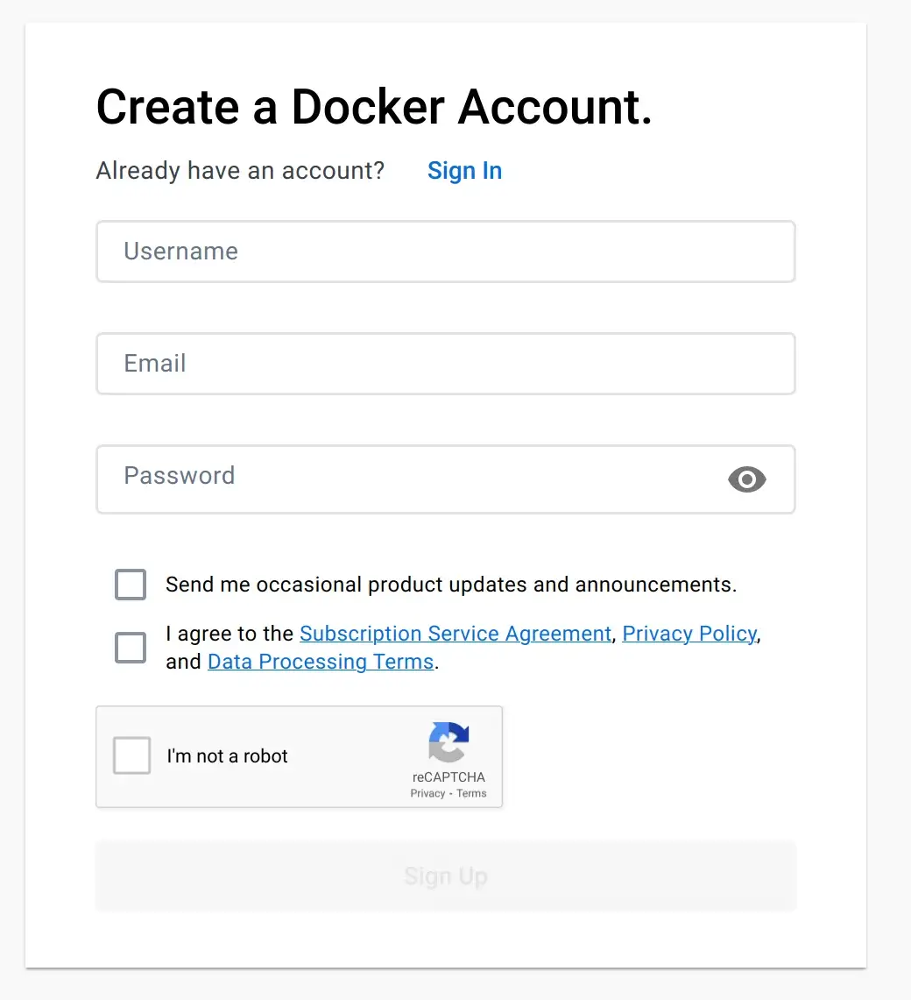

选择一个好记的用户名至关重要，因为它将成为您在 Docker Hub 上的独特句柄。为了避免不同用户拥有的镜像之间的名称冲突，Docker Hub 通过用户名和存储库名称的组合来识别每个存储库。

例如，如果您的用户名是 `realpython` ，那么您的一个存储库可以由字符串 `realpython/page-tracker` 标识，它类似于 GitHub 上存储库的名称。

在 Web 浏览器中注册并登录到您的新 Docker Hub 帐户后，您应该做的第一件事是为您的镜像创建一个存储库。单击“创建存储库”磁贴或转到顶部导航栏中的“存储库”选项卡，然后单击“创建存储库”按钮。然后，将您的存储库命名为 `page-tracker` ，如果需要，请为其提供有意义的描述，然后选择 Private 选项以使其仅对您可见：

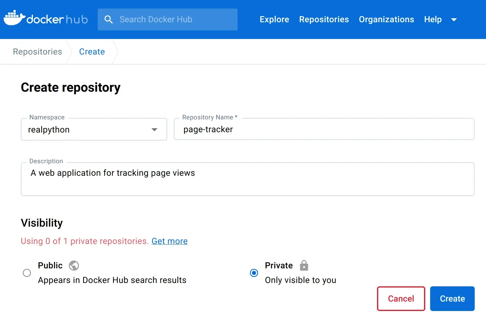

之后，您将看到带有终端命令的说明，这些命令将允许您将 Docker 镜像推送到您的存储库。但首先，您必须从命令行登录 Docker Hub，提供您的用户名和密码：

```bash
$ docker login -u realpython
Password:
```

即使您打算仅使用公共存储库，也需要使用 `docker login` 进行身份验证。

> 注意：如果您在 Docker Hub 帐户的安全设置中启用了双因素身份验证，那么您将需要生成一个具有适当权限的访问令牌，以便在命令行中使用 `docker` 登录。当它要求您输入密码时，只需提供您的令牌即可。
>
> 否则，如果您没有配置双因素身份验证，那么您将能够使用您的 Docker Hub 密码登录。尽管如此，如文档所述，仍然值得生成一个令牌以获得更好的安全性。

当你使用 Git 将代码推送到远程存储库时，你必须首先从某个地方克隆它或手动设置默认源，它配置本地存储库的元数据。

相比之下，使用 Docker Hub 或任何其他 Docker 注册表，将本地镜像映射到远程镜像的过程有点不同——您使用标记。具体来说，您使用 Docker Hub 的用户名和存储库名称作为前缀来标记构建的镜像。

首先，您必须提供要发布的本地 Docker 镜像的源标签，例如 `page-tracker:dde1dc9` 。要找到您刚刚构建的 `page-tracker` 镜像的确切标签，请检查您当前的 Git 提交哈希或列出您现有的 `docker images` 。

一旦知道如何标记镜像，就可以使用相同的提交哈希来构建目标标签，该标签将在 Docker 注册表中标识您的存储库。请记住在创建新标签之前将 `realpython` 替换为您自己的 Docker Hub 用户名：

```bash
$ docker tag page-tracker:dde1dc9 realpython/page-tracker:dde1dc9
```

这会将新标签 `realpython/page-tracker:dde1dc9` 添加到标记为 `page-tracker:dde1dc9` 的本地镜像。目标标签的完整形式如下所示：

```bash
registry/username/repository:tag
```

当你想推送到默认的 Docker Hub 时，可以省略注册表部分。否则，它可以是域地址，例如 `docker.io` ，或带有私有注册表实例的可选端口号的 IP 地址。用户名和存储库必须与您在 Docker Hub 或您使用的任何注册表上创建的用户名和存储库相对应。如果您不提供标签，那么 Docker 将隐式应用标签 `latest` ，这可能是未定义的。

您可以使用多个标签来标记同一镜像：

```bash
$ docker tag page-tracker:dde1dc9 realpython/page-tracker:latest
```

正确标记镜像后，您可以使用 `docker push` 将它们发送到所需的注册表：

```bash
$ docker push realpython/page-tracker:dde1dc9
$ docker push realpython/page-tracker:latest
```

不要担心发送相同的镜像两次。 Docker 足够聪明，可以知道您之前何时推送过镜像，如果它在注册表中检测到该镜像，则只会传输必要的元数据。

当您在 Docker Hub 上刷新您的配置文件时，它应该反映您刚刚推送到存储库中的两个标签：

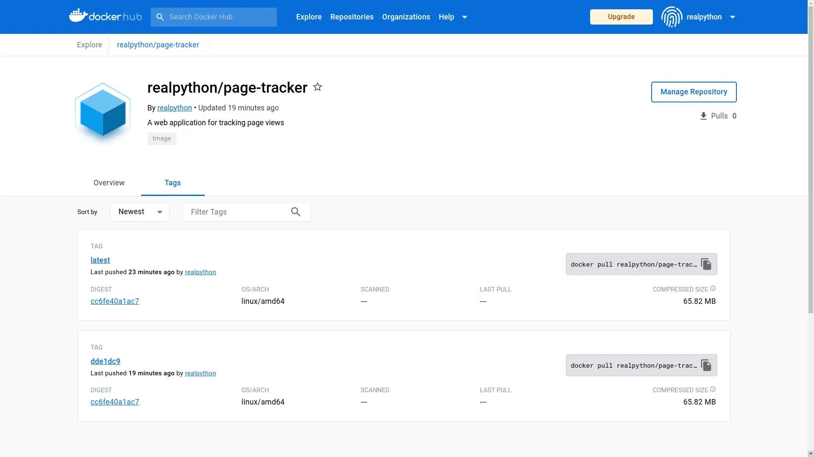

现在，当您将协作者添加到您的私有存储库时，他们将能够推送或拉取镜像。请记住，这需要在 Docker Hub 上升级订阅计划。

另一种方法是生成一个对所有存储库具有只读权限的访问令牌，或者创建一个公共存储库。

好的。终于到了通过在 Docker 容器中运行您的 dockerized Flask web 应用程序的机会了。

### 运行一个 Docker 容器

如果你从一个干净的 Docker 环境开始，也许在另一台计算机上，那么你可以通过从 Docker Hub 拉取它来下载你的镜像，只要你有读取该存储库的权限：

```bash
$ docker pull realpython/page-tracker
Using default tag: latest
latest: Pulling from realpython/page-tracker
f1f26f570256: Pull complete
2d2b01660885: Pull complete
e4e8e4c0b0e1: Pull complete
1ba60f086308: Pull complete
3c2fccf90be1: Pull complete
15e9066b1610: Pull complete
e8271c9a01cc: Pull complete
4f4fb700ef54: Pull complete
bb211d339643: Pull complete
8690f9a37c37: Pull complete
7404f1e120d1: Pull complete
Digest: sha256:cc6fe40a1ac73e6378d0660bf386a1599880a30e422dc061680769bc4d501164
Status: Downloaded newer image for realpython/page-tracker:latest
docker.io/realpython/page-tracker:latest
```

由于您没有为镜像指定任何标签，因此 Docker 会拉取标记为 `latest` 的标签。请注意，输出还包括镜像各个层的标识符，对应于用于构建该镜像的原始 Dockerfile 中的 11 条指令。

不过，您不必手动拉取镜像，因为 Docker 会在您第一次尝试运行它们时为您完成。如果指定的镜像已经在缓存中，那么一个新的容器将立即启动，而不会等到下载完成。

下面是基于新镜像运行新 Docker 容器的命令：

```bash
$ docker run -p 80:5000 --name web-service realpython/page-tracker
 * Serving Flask app 'page_tracker.app'
 * Debug mode: off
WARNING: This is a development server. Do not use it in a production
⮑ deployment. Use a production WSGI server instead.
 * Running on all addresses (0.0.0.0)
 * Running on http://127.0.0.1:5000
 * Running on http://172.17.0.3:5000
Press CTRL+C to quit
```

当您在本地开发项目时，使用端口转发通过主机的 localhost 访问 Web 服务器通常很方便。在这种情况下， `-p` 选项可让您导航到地址 `http://localhost:80` 或只是 `http://localhost` ，而无需知道正在运行的 Docker 容器的确切 IP 地址。端口 `80` 是 HTTP 协议的默认端口，这意味着您可以在 Web 浏览器中键入地址时省略它。

此外，此端口映射将确保在 `http://localhost:5000` 处没有网络端口冲突，以防您没有停止本地 Flask 实例。请记住，您之前启动了一个来执行端到端测试。如果进程仍在后台某处运行，它将占用 Flask 的默认端口 `5000` 。

> 注意：为您的 Docker 容器提供一个描述性名称也很有用，例如 `web-service` ，这样您就可以通过名称重新启动或删除它，而无需查找相应的容器标识符。如果你不这样做，那么 Docker 会给你的容器一个愚蠢的名字，比如随机选择的 `admiring_jang` 或 `frosty_almeida` 。
>
> 如果您不想手动操作，请考虑添加 `--rm` 标志以在容器停止时自动删除它。

正如您在上面的输出中看到的，Flask 服务器正在其容器内的所有网络接口 ( `0.0.0.0` ) 上运行，正如您在 Dockerfile 的 `CMD` 层中指示的那样。

继续并在您的 Web 浏览器中访问地址 `http://localhost` 或使用 `curl` 之类的命令行工具来访问 dockerized 页面跟踪器：

```bash
$ curl http://localhost
Sorry, something went wrong 😔
```

由于 Redis 连接失败，您将看到预期的错误消息，但至少您可以访问在 Docker 容器中运行的 Flask 应用程序。要修复错误，您需要通过传递给 `web-service` 容器的环境变量指定正确的 Redis URL。

现在通过按键盘上的 Ctrl+C 或 Cmd+C 停止该容器。然后，找到容器的标识符并删除关联的容器：

```bash
$ docker ps -a
CONTAINER ID   IMAGE                     COMMAND                  CREATED
dd446a1b72a7   realpython/page-tracker   "flask --app page_tr…"   1 minute ago

$ docker rm dd446a1b72a7
```

`-a` 标志确保显示所有容器，包括已停止的容器。否则，你不会看到你的。

通过 Docker 将 Flask Web 应用程序连接到 Redis 的正确方法是创建专用虚拟网络。首先，列出可用网络以检查您是否已经创建了 `page-tracker-network` ：

```bash
$ docker network ls
NETWORK ID     NAME                   DRIVER    SCOPE
46e9ff2ec568   bridge                 bridge    local
4795b850cb58   host                   host      local
f8f99d305c5e   none                   null      local
84b134794660   page-tracker-network   bridge    local
```

如果它不存在，那么您现在可以通过发出以下命令来创建一个：

```bash
$ docker network create page-tracker-network
```

以类似的方式，您可以为 Redis 服务器创建一个卷，以将其数据持久存储在您的主机上。这样，您可以重新启动甚至删除并从头开始创建一个新容器，Redis 将可以访问其之前的状态。这是使用 Docker 创建命名卷的方法：

```bash
$ docker volume create redis-volume
```

接下来，停止并移除任何可能挂起的 Redis 容器，然后启动一个新容器。这一次，您将容器连接到 `page-tracker-network` 并将其 `/data` 文件夹绑定到您刚刚创建的名为 `redis-volume` 的卷：

```bash
$ docker run -d \
             -v redis-volume://data \
             --network page-tracker-network \
             --name redis-service \
             redis:7.0.10-bullseye
```

当您在 GitHub 上查看 Redis 的官方 Docker 镜像时，您会看到一个在 `/data` 文件夹中定义挂载点的层。 Redis 会不时地将其状态转储到该文件夹中。通过将目录从您的主机挂载到此挂载点，即使容器重新启动，您也可以保持状态。

通过给你的容器一个描述性的名称， `redis-service` ，你将能够从同一网络上的另一个容器连接到它。就是这样：

```bash
$ docker run -d \
             -p 80:5000 \
             -e REDIS_URL=redis://redis-service:6379 \
             --network page-tracker-network \
             --name web-service \
             realpython/page-tracker
```

您启动一个从 `page-tracker` 镜像派生的新容器，其中包含相当多的参数。以下是上述 `docker run` 命令中各个标志和选项的快速细分：

- `-d` ：在后台运行容器，与终端分离。这意味着您将看不到 Flask 服务器的任何输出，并且您将无法再使用 Ctrl+C 或 Cmd+C 停止容器。
- `-p 80:5000` ：将容器的端口 `5000` 暴露在主机的端口 `80` 上，这样你就可以通过本地主机访问你的 web 应用程序。
- `-e REDIS_URL=...` : 将容器的环境变量设置为在同一网络上的另一个容器中运行的 Redis 服务器的地址。
- `--network page-tracker-network` : 指定容器使用的虚拟网络。这将允许同一网络上的其他容器通过抽象名称而不是 IP 地址与该容器通信。
- `--name web-service` : 为容器分配一个有意义的名称，这样更容易从 Docker 命令中引用容器。

现在，当您在 Web 浏览器或终端中访问 Flask Web 应用程序时，您应该观察到正确的行为：

```bash
$ curl http://localhost
This page has been seen 1 times.

$ curl http://localhost
This page has been seen 2 times.

$ curl http://localhost
This page has been seen 3 times.
```

每次发送请求时，服务器都会以不同数量的页面浏览量进行响应。请注意，您正在通过本地主机访问服务器。如果您在 `web-service` 之前启动了 `redis-service` ，那么容器的 IP 地址可能已更改。

哇！光是启动和运行两项服务就需要做大量工作。如您所见，手动管理 Docker 镜像、容器、卷、网络、端口和环境变量会让人感到不知所措。而这只是表面现象！

想象一下，管理一个包含数十种服务的复杂应用程序需要付出多少努力，其中包括生产就绪监控、负载平衡、自动缩放等。

幸运的是，有更好的方法可以达到同样的效果。在下一节中，您将研究 Docker 之上的一个方便的抽象层，让您在定义持续集成管道之前使用单个命令编排这两种服务。

## 使用 Docker Compose 编排容器

大多数现实世界的应用程序由多个组件组成，这些组件自然会转化为 Docker 容器。例如，一个涉及更多的 Web 应用程序可能具有以下内容：

- **Back end:** [Django](https://realpython.com/learning-paths/django-web-development/), [FastAPI](https://realpython.com/fastapi-python-web-apis/), [Flask](https://realpython.com/learning-paths/flask-by-example/)
- **Front end:** [Angular](https://realpython.com/flask-by-example-integrating-flask-and-angularjs/), [React](https://realpython.com/the-ultimate-flask-front-end/#react-explained), [Vue](https://realpython.com/python-django-blog/#step-5-set-up-vuejs)
- **Cache:** Couchbase, [Memcached](https://realpython.com/python-memcache-efficient-caching/), [Redis](https://realpython.com/python-redis/)
- **Queue:** ActiveMQ, [Kafka](https://realpython.com/queue-in-python/#apache-kafka-kafka-python3), [RabbitMQ](https://realpython.com/queue-in-python/#rabbitmq-pika)
- **Database:** [MySQL](https://realpython.com/python-mysql/), [PostgreSQL](https://realpython.com/python-sql-libraries/#postgresql), [SQLite](https://realpython.com/python-sqlite-sqlalchemy/)

更大的应用程序可能会选择将其后端或前端组件细分为更多的微服务，负责身份验证、用户管理、订单处理、支付或消息传递等。

为了帮助管理并在某种程度上编排此类应用程序的多个 Docker 容器，您可以使用 Docker Compose。它是一种在 Docker 之上运行的工具，可简化运行多容器 Docker 应用程序。 Docker Compose 允许您根据相互依赖的服务及其配置和要求来定义您的应用程序。然后它将协调它们并将它们作为一个连贯的应用程序运行。

> 注意：容器编排自动化分布式应用程序的部署、扩展和配置管理。虽然 Docker Compose 可以帮助进行基本形式的编排，但您最好在更复杂的大型系统中使用 Kubernetes 等工具。

您将使用 Docker Compose 以声明方式描述您的多容器页面跟踪器应用程序，以及它的服务、网络和卷，使用单个配置文件。通过这样做，您将能够跟踪更改并将您的应用程序部署到任何环境。

不过，在深入研究之前，请确保您的计算机上安装了 Docker Compose。

### 在您的计算机上设置 Docker Compose

如果您按照有关设置 Docker Desktop 的说明进行操作，那么您应该已经安装了 Docker Compose。在您的终端中运行以下命令以确认这一点：

```bash
$ docker compose version
Docker Compose version v2.17.2
```

使用捆绑了 Docker Compose 和一些其他组件的 Docker Desktop，目前是在 macOS 和 Windows 上获取 Docker Compose 的推荐方式。如果您使用的是 Linux，那么您可以尝试通过手动安装 Compose 插件或从您的发行版的软件包存储库安装替代路径。不幸的是，此方法可能不适用于最新和推荐的 Docker Compose 版本。

> 注意：在过去，Docker Compose 是一个独立于 Docker 单独维护的项目。它最初是作为 Python 脚本实现的，最终被重写为 Go。
>
> 要使用 Docker Compose，您必须在命令行中调用 `docker-compose` （带连字符）可执行文件。但是，它现在已集成到 Docker 平台中，因此您可以将 Docker Compose 作为 `docker compose` 插件调用。这两个命令的工作原理应该相同，因为该插件是一种直接替代品。

一旦您确认 Docker Compose 在您的终端中可用，您就可以开始了！

### 定义多容器 Docker 应用程序

由于您将定义一个多容器 Docker 应用程序，该应用程序可能会在未来增长以包含更多服务，因此有必要重新安排项目中的文件夹结构。在项目根文件夹中创建一个名为 `web/` 的新子文件夹，您将在其中存储与 Flask Web 服务相关的所有文件。

您的虚拟环境也属于这个新的子文件夹，因为其他服务可能是用完全外国的编程语言（如 C++ 或 Java）实现的。不幸的是，移动 `venv/` 文件夹可能会破坏相应激活脚本中硬编码的绝对路径。因此，移除旧的虚拟环境并在 `web/` 子文件夹中创建一个新的虚拟环境以确保安全：

Windows：

```bash
(page-tracker) PS> deactivate
PS> cd page-tracker\
PS> rmdir venv\ /s
PS> python -m venv web\venv\ --prompt page-tracker
PS> web\venv\Scripts\activate
(page-tracker) PS> python -m pip install --upgrade pip
```

Linux + MacOS：

```bash
(page-tracker) $ deactivate
$ cd page-tracker/
$ rm -rf venv/
$ python3 -m venv web/venv/ --prompt page-tracker
$ source web/venv/bin/activate
(page-tracker) $ python -m pip install --upgrade pip
```

然后，将 Flask 应用程序移动到新的 `web/` 子文件夹，只留下 `.git/` 文件夹、 `.gitignore` 和任何其他与编辑器相关的配置文件。您可以将它们保存在项目根文件夹中，因为它们对项目中所有可能的服务都是通用的。之后，您的项目结构应如下所示：

```bash
page-tracker/
│
├── web/
│   │
│   ├── src/
│   │   └── page_tracker/
│   │       ├── __init__.py
│   │       └── app.py
│   │
│   ├── test/
│   │   ├── e2e/
│   │   │   └── test_app_redis_http.py
│   │   │
│   │   ├── integration/
│   │   │   └── test_app_redis.py
│   │   │
│   │   ├── unit/
│   │   │   └── test_app.py
│   │   │
│   │   └── conftest.py
│   │
│   ├── venv/
│   │
│   ├── constraints.txt
│   ├── Dockerfile
│   ├── Dockerfile.dev
│   └── pyproject.toml
│
├── .git/
│
├── .gitignore
└── docker-compose.yml
```

上面文件树的一个新添加是位于顶层的 `docker-compose.yml` 文件，您现在将编写该文件。

Docker Compose 使用 YAML 格式以声明方式描述应用程序的服务，这些服务将成为 Docker 容器、它们的网络、卷、端口映射、环境变量等。

以前，您必须手动定义应用程序架构的每一部分，但使用 Docker Compose，您可以在一个文件中定义所有内容。该工具甚至可以为您拉取或构建镜像！

> 注意：如果您以前从未使用过 YAML，但熟悉 JSON，那么它的语法应该很熟悉，因为 YAML 是 JSON 的超集。查看 YAML：Python 中丢失的电池了解更多详细信息。

Docker Compose 文件是您定义服务、网络和卷的地方。这是完整的 `docker-compose.yml` 文件，它反映了您在前面部分中为页面跟踪器应用程序手动定义的所有内容：

```yaml
# docker-compose.yml

services:
  redis-service:
    image: "redis:7.0.10-bullseye"
    networks:
      - backend-network
    volumes:
      - "redis-volume://data"
  web-service:
    build: ./web
    ports:
      - "80:5000"
    environment:
      REDIS_URL: "redis://redis-service:6379"
    networks:
      - backend-network
    depends_on:
      - redis-service

networks:
  backend-network:

volumes:
  redis-volume:
```

你现在要逐行剖析它：

- 第 3 行标志着两个服务 `redis-service` 和 `web-service` 声明的开始，它们包含一个多容器 Docker 应用程序。请注意，您可以扩展每个服务，因此 Docker 容器的实际数量可能大于此处声明的服务数量。
- 第 4 行到第 9 行定义了 `redis-service` 的配置，包括要运行的 Docker 镜像、要连接的网络以及要挂载的卷。
- 第 10 到 19 行通过指定包含要构建的 Dockerfile 的文件夹、要公开的端口、要设置的环境变量以及要连接的网络来配置 `web-service` 。 `depends_on` 语句要求 `redis-service` 在 `web-service` 开始之前可用。
- 第 21 和 22 行为您的两个服务定义了一个虚拟网络。此声明并非绝对必要，因为 Docker Compose 会自动创建容器并将其连接到新网络。但是，如果需要，显式网络声明可以让您更好地控制其设置和地址范围。
- 第 24 和 25 行为您的 Redis 服务器定义了一个持久卷。

上面配置文件中的一些值被引用，而另一些则没有。这是针对旧 YAML 格式规范中已知怪癖的预防措施，该规范将某些字符视为特殊字符，如果它们出现在未加引号的字符串中。例如，冒号 ( `:` ) 可以使一些 YAML 解析器将文字解释为六十进制数字而不是字符串。

> 注意：此文件符合最新和推荐的 Compose 规范，该规范不再需要顶级 `version` 字段，而早期的模式版本需要。阅读官方文档中的 Compose 文件版本控制以了解更多信息。

停止任何可能仍在运行的与您的项目相关的 Docker 容器，并立即删除它们的关联资源：

```bash
$ docker stop -t 0 web-service redis-service
$ docker container rm web-service redis-service
$ docker network rm page-tracker-network
$ docker volume rm redis-volume
```

这将删除您之前创建的两个容器、一个网络和一个卷。请注意，您可以将 `docker container rm` 命令缩写为更短的 `docker rm` 别名。

要优雅地删除容器，您应该首先停止它。默认情况下， `docker stop` 命令将在终止容器之前等待十秒钟，使其有足够的时间在退出之前执行任何必要的清理操作。因为您的 Flask 应用程序在停止运行后不需要做任何事情，您可以使用 `-t` 选项将此超时设置为零秒，这将立即终止列出的容器。

要删除所有关联的 Docker 镜像标签，您必须首先找到它们的公共标识符：

```bash
$ docker images
REPOSITORY                TAG              IMAGE ID       CREATED      SIZE
page-tracker              dde1dc9          9cb2e3233522   1 hour ago   204MB
page-tracker              latest           9cb2e3233522   1 hour ago   204MB
realpython/page-tracker   dde1dc9          9cb2e3233522   1 hour ago   204MB
realpython/page-tracker   latest           9cb2e3233522   1 hour ago   204MB
(...)
```

在这种情况下， `page-tracker` 镜像的所有标签共有的短 ID 等于 `9cb2e3233522` ，您可以使用它来取消标记和删除底层 Docker 镜像：

```bash
$ docker rmi -f 9cb2e3233522
Untagged: page-tracker:dde1dc9
Untagged: page-tracker:latest
Untagged: realpython/page-tracker:dde1dc9
Untagged: realpython/page-tracker:latest
Deleted: sha256:9cb2e3233522e020c366880867980232d747c4c99a1f60a61b9bece40...
```

`docker rmi` 命令是 `docker image rm` 和 `docker image remove` 的别名。

> 注意：如果你想从头开始使用全新的 Docker 环境，并且不介意丢失数据，那么你可以使用以下命令修剪所有系统资源：
>
> ```bash
> $ docker system prune --all --volumes
> ```
>
> 警告！这将删除您到目前为止使用 Docker 创建的所有内容，包括可能在本教程之外创建的资源，因此请谨慎操作。

确认删除 Docker 资源后，您可以通过一条指令立即恢复您的页面跟踪器应用程序。在与 `docker-comopse.yml` 文件相同的文件夹中发出以下命令以避免指定其路径：

```bash
$ docker compose up -d
(...)
[+] Running 4/4
 ⠿ Network page-tracker_backend-network    Created                      0.1s
 ⠿ Volume "page-tracker_redis-volume"      Created                      0.0s
 ⠿ Container page-tracker-redis-service-1  Started                      1.0s
 ⠿ Container page-tracker-web-service-1    Started                      1.3s
```

第一次运行此命令时，可能需要更长的时间，因为 Docker Compose 必须从 Docker Hub 下载 Redis 镜像并再次从 Dockerfile 构建另一个镜像。但在那之后，它应该感觉几乎是瞬间的。

您可以在上面的输出中看到 Docker Compose 创建了请求的网络、卷和两个容器。请注意，它始终在此类资源名称前加上您的 Docker Compose 项目名称前缀，该名称默认为包含您的 `docker-compose.yml` 文件的文件夹名称。在这种情况下，项目名称是 `page-tracker` 。此功能有助于防止不同 Docker Compose 项目的资源名称发生冲突。

此外，如果您想启动同一服务的多个副本，Docker Compose 会将连续的数字附加到您的容器名称中。

Docker Compose 插件提供了几个有用的命令来管理您的多容器应用程序。这里只是其中的几个：

```bash
$ docker compose ps
NAME                           COMMAND                  SERVICE        ...
page-tracker-redis-service-1   "docker-entrypoint.s…"   redis-service  ...
page-tracker-web-service-1     "flask --app page_tr…"   web-service    ...

$ docker compose logs --follow
(...)
page-tracker-web-service-1    |  * Running on all addresses (0.0.0.0)
page-tracker-web-service-1    |  * Running on http://127.0.0.1:5000
page-tracker-web-service-1    |  * Running on http://172.20.0.3:5000
page-tracker-web-service-1    | Press CTRL+C to quit

$ docker compose stop
[+] Running 2/2
 ⠿ Container page-tracker-web-service-1    Stopped                     10.3s
 ⠿ Container page-tracker-redis-service-1  Stopped                      0.4s

$ docker compose restart
[+] Running 2/2
 ⠿ Container page-tracker-redis-service-1  Started                      0.4s
 ⠿ Container page-tracker-web-service-1    Started                      0.5s

$ docker compose down --volumes
[+] Running 4/4
 ⠿ Container page-tracker-web-service-1    Removed                      6.0s
 ⠿ Container page-tracker-redis-service-1  Removed                      0.4s
 ⠿ Volume page-tracker_redis-volume        Removed                      0.0s
 ⠿ Network page-tracker_backend-network    Removed                      0.1s
```

例如，您可以列出 Docker Compose 项目中的容器而不显示任何其他容器。使用相关命令，您可以查看它们的实时输出、停止、启动和重新启动它们。

完成项目后，您可以将其拆除，Docker Compose 将删除关联的容器和网络。但是，它不会触及持久数据存储，除非您使用 `--volumes` 标志明确请求。

您可能已经在日志中注意到一件事，Flask 已经抱怨了很长时间，那就是使用其不安全、低效且不稳定的开发 Web 服务器来运行您的应用程序。您现在将使用 Docker Compose 来解决这个问题。

### 将 Flask 的开发 Web 服务器替换为 Gunicorn

Docker 允许您在运行新容器时覆盖 Dockerfile 中列出的默认命令或入口点。例如， `redis` 镜像中的默认命令启动 Redis 服务器。但是，您之前使用相同的镜像在另一个容器中启动 `redis-cli` 。同样，您可以在 `docker-compose.yml` 文件中为您的 Docker 镜像指定自定义命令。您将使用此功能通过生产级 Web 服务器运行 Flask。

> 注意：有时，您想要调查现有容器。要在正在运行的容器中运行命令而不是启动新容器，可以使用 `docker exec` 命令：
>
> ```bash
> $ docker exec -it -u root page-tracker-web-service-1 /bin/bash
> root@6e23f154a5b9://home/realpython#
> ```
>
> 通过运行 Bash 可执行文件 `/bin/bash` 并使用 `-u` 选项指定用户，您可以有效地访问容器，就像通过 SSH 登录远程服务器一样。 `-it` 标志是运行交互式终端会话所必需的。否则，该命令将立即退出。

有几个选项可以替换 Flask 的内置开发 Web 服务器，官方文档在部署到生产时推荐使用这些选项。最受欢迎的选择之一是 Gunicorn (Green Unicorn)，它是 Web 服务器网关接口 (WSGI) 协议的纯 Python 实现。要开始使用它，您必须将 `gunicorn` 包添加为项目中的另一个依赖项：

```toml
# web/pyproject.toml

[build-system]
requires = ["setuptools>=67.0.0", "wheel"]
build-backend = "setuptools.build_meta"

[project]
name = "page-tracker"
version = "1.0.0"
dependencies = [
    "Flask",
    "gunicorn",
    "redis",
]

[project.optional-dependencies]
dev = [
    "bandit",
    "black",
    "flake8",
    "isort",
    "pylint",
    "pytest",
    "pytest-timeout",
    "requests",
]
```

请注意，您将 `gunicorn` 添加到常规依赖项列表中，因为它将成为您应用程序不可或缺的一部分。您希望在构建最终 Docker 镜像后它可用。

像往常一样，在本地重新安装您的 `page-tracker` 包并将其依赖项固定在约束文件中。请记住，您可能需要先激活您的虚拟环境，因为您之前在 `web/` 子文件夹中重新创建了它：

```bash
(page-tracker) $ python -m pip install --editable "web/[dev]"
(page-tracker) $ python -m pip freeze --exclude-editable > web/constraints.txt
```

请注意，当您从项目的根文件夹中执行这些命令时，它们看起来会略有不同。在这种情况下，您必须将指示当前工作目录的点 ( `.` ) 替换为您的 `web/` 子文件夹的路径。

现在您已经安装了 Gunicorn，您可以开始使用它了。通过在 `web-service` 键下添加新的 `command` 属性来修改 `docker-compose.yml` ：

```yaml
# docker-compose.yml

services:
  redis-service:
    image: "redis:7.0.10-bullseye"
    networks:
      - backend-network
    volumes:
      - "redis-volume://data"
  web-service:
    build: ./web
    ports:
      - "80:8000"
    environment:
      REDIS_URL: "redis://redis-service:6379"
    networks:
      - backend-network
    depends_on:
      - redis-service
    command: "gunicorn page_tracker.app:app --bind 0.0.0.0:8000"

networks:
  backend-network:

volumes:
  redis-volume:
```

此命令将优先于 Dockerfile 的默认命令，后者依赖于 Flask 的开发服务器。从现在开始，Docker Compose 将改为使用 Gunicorn 运行您的 Web 应用程序。为了显示差异，您将在端口 `8000` 而不是 `5000` 上运行服务器，因此您还更改了端口映射。

通过在主机上公开端口 `80` ，您仍然可以在不指定端口号的情况下访问 `http://localhost` 上的应用程序。

不要忘记提交更改以将您的工作保存在本地 Git 存储库中：

```bash
$ git add .
$ git commit -m "Refactor folders and add Docker Compose"
```

进行小而频繁的提交总是一个好主意，这样您就可以随着时间的推移跟踪增量更改并更好地了解您的工作历史。如果您不确定如何描述您的提交，请尝试解释为什么您进行了特定更改，因为 Git 已经跟踪更改的内容。

好的。如果您现在尝试重新启动 Docker Compose 应用程序，那么它将失败，因为 Docker 在容器启动期间找不到请求的 `gunicorn` 可执行文件。您已经添加了您之前构建的 Docker 镜像中缺少的额外依赖项。因此，你必须告诉 Docker Compose 重建你的镜像。您可以使用以下任一命令执行此操作：

- docker compose build
- docker compose up --build

在第一种情况下，您会明确告诉 Docker 预先构建镜像。每当您更改项目依赖项或 Dockerfile 时，您都必须再次运行 `docker compose build` 以应用这些更改。

在第二种情况下， `docker compose up --build` 将指示 Docker 在每次启动容器时即时构建镜像。如果您试图快速迭代对源代码或 Dockerfile 的更改，这将特别有用。

无论哪种方式，这两个命令都应该在启动相应容器之前在任何受影响的 Docker 镜像中成功构建修改后的层。然后，您可以放心，当您的 Docker Compose 应用程序再次启动时，所有依赖项都将可用。

继续并立即运行这些命令之一。

因为您了解如何使用 Docker Compose 来管理应用程序的服务，所以您现在可以了解如何在接近生产的环境中运行端到端测试。

### 针对服务运行端到端测试

在第一次尝试中，您将从主机本地执行端到端测试。请注意，必须可以从您的本地网络访问所有必要的服务才能使其正常工作。

虽然这并不理想，因为您不想向公众公开任何敏感服务（如数据库），但稍后您将了解更好的方法。同时，您可以更新您的 `docker-compose.yml` 配置以转发 Redis 端口：

```yaml
# docker-compose.yml

services:
  redis-service:
    image: "redis:7.0.10-bullseye"
    ports:
      - "6379:6379"
    networks:
      - backend-network
    volumes:
      - "redis-volume://data"
  web-service:
    build: ./web
    ports:
      - "80:8000"
    environment:
      REDIS_URL: "redis://redis-service:6379"
    networks:
      - backend-network
    depends_on:
      - redis-service
    command: "gunicorn page_tracker.app:app --bind 0.0.0.0:8000"

networks:
  backend-network:

volumes:
  redis-volume:
```

如果您有一个用于 `redis-service` 的现有 Docker 容器，那么您需要先删除该容器，即使它当前已停止，以反映新的端口转发规则。幸运的是，Docker Compose 会自动检测 `docker-compose.yml` 文件中的更改，并在您发出 `docker compose up` 命令时根据需要重新创建容器：

```bash
$ docker compose up -d
[+] Running 2/2
 ⠿ Container page-tracker-redis-service-1  Started                      1.0s
 ⠿ Container page-tracker-web-service-1    Started                      1.2s

$ docker compose ps
NAME                           ...   PORTS
page-tracker-redis-service-1   ...   0.0.0.0:6379->6379/tcp
page-tracker-web-service-1     ...   0.0.0.0:80->8000/tcp
```

列出新容器后，您应该会看到 Redis 容器上的端口 `6379` 被转发到主机。有了这个，您现在可以使用安装在开发机器上的虚拟环境中的 `pytest` 运行端到端测试：

```bash
(page-tracker) $ python -m pytest web/test/e2e/ \
  --flask-url http://localhost \
  --redis-url redis://localhost:6379
```

由于端口映射，您可以使用 localhost 连接到容器，而无需知道它们各自的 IP 地址。

> 注意：如果您的测试成功，那么它将覆盖 Redis 中的页面浏览量。根据经验，您永远不应该在带有客户数据的实时环境中运行测试，以避免破坏它。通常建议使用带有虚假或匿名数据的暂存或认证环境来安全地执行全面的端到端测试。

要模拟故障，您可以在测试执行期间暂时暂停容器：

```bash
$ docker compose pause
[+] Running 2/0
 ⠿ Container page-tracker-web-service-1    Paused                       0.0s
 ⠿ Container page-tracker-redis-service-1  Paused                       0.0s
```

这将使 Redis 和您的 Flask 应用程序无法再访问。与停止容器不同，暂停它不会终止底层进程，因此暂停会保持容器的状态并导致更快的恢复。

之后不要忘记取消暂停容器以避免以后出现错误：

```bash
$ docker compose unpause
[+] Running 2/0
 ⠿ Container page-tracker-web-service-1    Unpaused                     0.0s
 ⠿ Container page-tracker-redis-service-1  Unpaused                     0.0s
```

或者，您可以从同一网络上的另一个容器运行它，而不是在本地针对公开服务运行端到端测试。您可以手动制作这样的容器。

然而，最近版本的 Docker Compose 提供了一个更优雅的解决方案，它允许您有条件地运行服务的子集。为此，您可以将所需的服务分配给可按需激活的自定义配置文件。

首先，打开你的 `docker-compose.yml` 文件并从 Redis 中删除端口转发，因为你不想再将它暴露给外界。然后，基于您的旧 `Dockerfile.dev` 添加一个新服务，它捆绑了测试框架、测试装置和您的测试代码。您将使用相应的 Docker 镜像来执行端到端测试：

```yaml
# docker-compose.yml

services:
  redis-service:
    image: "redis:7.0.10-bullseye"
    networks:
      - backend-network
    volumes:
      - "redis-volume://data"
  web-service:
    build: ./web
    ports:
      - "80:8000"
    environment:
      REDIS_URL: "redis://redis-service:6379"
    networks:
      - backend-network
    depends_on:
      - redis-service
    command: "gunicorn page_tracker.app:app --bind 0.0.0.0:8000"
  test-service:
    profiles:
      - testing
    build:
      context: ./web
      dockerfile: Dockerfile.dev
    environment:
      REDIS_URL: "redis://redis-service:6379"
      FLASK_URL: "http://web-service:8000"
    networks:
      - backend-network
    depends_on:
      - redis-service
      - web-service
    command: >
      sh -c 'python -m pytest test/e2e/ -vv
      --redis-url $$REDIS_URL
      --flask-url $$FLASK_URL'

networks:
  backend-network:

volumes:
  redis-volume:
```

`docker-compose.yml` 文件的大部分内容保持不变，因此您可以将注意力集中在突出显示的行上：

- 第 22 行定义了您的新服务将属于的配置文件列表。只有一个配置文件，称为 `testing` ，您将启用它来运行测试。
- 第 24 到 26 行指定包含要构建的 Dockerfile 的目录的路径。由于该文件有一个非标准名称，您需要明确提供它。
- 第 27 到 29 行定义了两个环境变量，您的测试将使用它们连接到在 Gunicorn 服务器后面运行的 Redis 和 Flask。请注意，您使用 Docker Compose 服务名称作为主机名。

- 第 30 和 31 行将服务连接到与其他两个服务相同的网络。
- 第 32 到 34 行确保 Redis 和 Flask 在端到端测试之前启动。
- 第 35 到 38 行定义了在服务启动时运行的命令。请注意，您使用 YAML 的多行文字折叠 ( `>` ) 以更具可读性的方式格式化长 shell 命令。

因为 Docker Compose 可以访问您主机的 shell，所以它会尝试插入对环境变量的任何引用，例如 `$REDIS_URL` 或 `$FLASK_URL` ，一旦文件被解析，就会出现在您的 `docker-compose.yml` 中。不幸的是，这些变量很可能尚未定义。您通过服务的 `environment` 部分指定它们，这意味着您的容器稍后将获取这些变量。

要禁用 Docker Compose 过早替换环境变量，您可以使用两个美元符号 ( `$$` ) 转义美元符号。这反过来会在将在生成的容器中执行的命令中生成文字字符串 `$REDIS_URL` 和 `$FLASK_URL` 。要在容器启动时插入这些变量，您必须将整个命令用单引号 ( `'` ) 括起来，并将其传递给 shell ( `sh` )。

当您使用 Docker Compose 启动多容器应用程序时，只有不属于任何配置文件的核心服务会启动。如果您还希望启动分配给一个或多个配置文件的服务，则必须使用 `--profile` 选项列出这些配置文件：

```bash
$ docker compose --profile testing up -d
[+] Running 3/3
 ⠿ Container page-tracker-redis-service-1  Running                      0.0s
 ⠿ Container page-tracker-web-service-1    Running                      0.0s
 ⠿ Container page-tracker-test-service-1   Started                      0.6s

$ docker compose ps -a
NAME                           ...   SERVICE             STATUS       ...
page-tracker-redis-service-1   ...   redis-service       running      ...
page-tracker-test-service-1    ...   test-service        exited (0)   ...
page-tracker-web-service-1     ...   web-service         running      ...
```

请注意，这是 `docker compose` 命令的一个选项，而不是它的 `up` 子命令，因此请注意参数顺序。输出显示启动了一个额外的服务，但是当您调查它时，您会注意到 `test-service` 以成功状态零快速退出。

要显示有关此服务的更多信息，您可以查看其日志：

```bash
$ docker compose logs test-service
============================= test session starts ==========================
platform linux -- Python 3.11.2, pytest-7.2.2, pluggy-1.0.0 -- /home/realp..
cachedir: .pytest_cache
rootdir: /home/realpython
plugins: timeout-2.1.0
collecting ... collected 1 item

test/e2e/test_app_redis_http.py::test_should_update_redis ... PASSED [100%]

============================== 1 passed in 0.10s ===========================
```

这将向您显示有关该服务的详细信息，包括 `pytest` 报告形式的测试结果，以及可能发生的任何错误。在这种情况下，测试成功通过。请注意，为简洁起见，对上面的输出进行了编辑。

到目前为止，您已经使用 Git 对源代码进行了版本控制。您自动化了各种级别的测试并使用 Docker 构建了您的应用程序。最后，您使用 Docker Compose 编排了多个容器。

此时，您已准备好继续下一步，即使用 Docker 构建持续集成管道。

## 定义一个基于 Docker 的持续集成管道

持续集成 (CI) 的目标是通过尽可能频繁地集成团队中多个开发人员的代码更改来实现更快、更可预测的软件发布。

在过去，集成是一项重大任务，通常需要数周甚至数月才能完成，有时还需要专门的集成工程师团队。

这种方法的问题是团队中的每个人都在自己的项目副本上工作。集成阶段延迟的时间越长，项目的不同版本就越有可能出现分歧，从而难以将它们结合起来。

在某些情况下，集成可能比项目的实际开发花费更多的时间！

连续这个词意味着集成应该经常进行，以最小化更改的范围并降低将缺陷引入代码库的风险。团队每天至少整合一次开发人员的工作，最好是一天多次，这已成为标准做法。

为了使这成为可能，持续集成需要构建和测试自动化以及具有相对较小功能的短期代码分支来实现。功能切换可以帮助实现需要更长时间开发的更大功能。此外，在尝试集成更改失败后修复失败的构建应该是团队的优先事项，以保持流程真正连续。

要在您的项目中引入持续集成，您需要以下元素：

- 版本控制系统
- 分支策略
- 自动构建
- 自动化测试
- 持续集成服务器
- 频繁集成

像 Git 这样的版本控制系统允许多人同时处理同一段代码。根据您的团队结构、经验和其他因素，您可以选择不同的源代码控制分支模型，也称为工作流。一些最受欢迎的包括：

- [Trunk-Based Development](https://trunkbaseddevelopment.com/)
- [GitHub Flow](https://docs.github.com/en/get-started/quickstart/github-flow)
- [Forking Workflow](https://www.atlassian.com/git/tutorials/comparing-workflows/forking-workflow)
- [Release Branching](https://martinfowler.com/articles/branching-patterns.html#release-branch)
- [Git Flow](https://nvie.com/posts/a-successful-git-branching-model/)

各有利弊，适用于不同的场景。例如，分叉策略在开源项目中运作良好，因为它允许任何人在没有特别许可的情况下做出贡献。在本教程中，您将使用称为 GitHub Flow 的流行功能分支工作流程。它只有一个长期存在的主线或主干，传统上称为 master 分支，您可以从中分支出几个短期存在的功能分支。

> 注意：尽管使用术语 `master` 来指代主分支的传统由来已久，但 GitHub 最近宣布将其默认分支名称更改为 `main` 以更好地反映其目的并避免冒犯性语言。
>
> 同时，当您初始化一个新的存储库时，Git 会继续使用 `master` ，这在您尝试同步本地和远程存储库时偶尔会出现问题。因此，您将坚持在本教程中使用 `master` 来保持简单，但如果您想更改默认分支名称，请随时采取额外的步骤。您可以在 GitHub 存储库设置中调整默认分支名称。

虽然您会发现几种不同的方法来实现与 GitHub Flow 的持续集成，但这些是您将针对 Docker 应用程序遵循的步骤：

- 将最新版本的主线获取到您的计算机。
- 从主线创建一个功能分支。
- 打开拉取请求以从其他人那里获得早期反馈。
- 继续在你的功能分支上工作。
- 经常获取主线，将其合并到您的功能分支并在本地解决任何潜在的冲突。
- 在本地分支上构建、lint 和测试代码。
- 只要本地构建和测试成功，就推送您的更改。
- 每次推送时，检查针对您的功能分支在 CI 服务器上运行的自动化测试。
- 在再次推送代码之前，在本地重现并修复任何已识别的问题。
- 完成并通过所有测试后，请求一名或多名同事审查您的更改。
- 应用他们的反馈，直到审阅者批准您的更新并且所有测试在推送您的最新更改后通过 CI 服务器。
- 通过将功能分支合并到主线来关闭拉取请求。
- 对照主线检查 CI 服务器上运行的自动化测试，并集成功能分支的更改。
- 调查并修复可能发现的任何问题，例如，由于在您上次推送和合并之间其他人向主线引入了新更新。

此列表非常全面，但没有适合所有人的单一持续集成流程。您甚至可以比这更彻底，例如，使用 Terraform 或 GitHub Codespaces 提供专用的暂存环境，并将您的功能分支部署到云中，以便在关闭拉取请求之前进行额外的手动测试。但是，为每个拉取请求启动一个新环境可能不符合成本效益。

> 注意：软件工程团队通常将持续集成与持续交付结合起来，形成一个称为 CI/CD 的流程。持续交付是持续集成的扩展，它增加了额外的步骤来将经过验证和集成的构建部署到生产环境。
>
> 虽然持续交付提供了将构建自动部署到生产环境的技术手段，但它仍然需要业务决策和手动触发。
>
> 不要混淆持续交付和持续部署，后者是一个完全自动化的过程，无需人工干预即可将应用程序部署到生产环境。在持续部署中，一旦你推送代码，它就会被测试并集成到主线中，然后最终进入生产环境。
>
> 但是，要成功做到这一点，您需要广泛的测试范围和对自动化过程的信任。

值得强调的重要一点是涉及的测试量。您应该在本地和持续集成服务器上测试您的功能分支，然后针对集成主线再次运行测试。

这是为了确保您的功能正常工作并且不会破坏主线。

您有许多选项可以为您的 Docker 应用程序设置持续集成服务器，包括在线和自托管。流行的选择包括 CircleCI、Jenkins 和 Travis。在本教程中，您将使用 GitHub Actions，这是 GitHub 提供的免费 CI 解决方案。

### 将代码推送到 GitHub 存储库

要利用 GitHub Actions，您必须首先在 GitHub 上创建一个存储库。如果您还没有帐户，请注册，然后登录并创建一个名为 `page-tracker` 的新存储库。

公共存储库可以无限制地使用 GitHub Actions，而私有存储库每月可在免费层获得 2000 分钟和 500 兆字节的存储空间。

但是，在 Windows 上运行的作业将消耗比在 Linux 上多一倍的分钟数，而在 macOS 上运行的作业将消耗十倍的分钟数！您可以在官方文档中找到有关 GitHub Actions 计费的更多详细信息。

稍后，您将启用分支保护规则，该规则目前仅适用于免费层的公共存储库，因此最好现在就创建一个公共存储库。

保留建议的默认值而不使用 GitHub 的占位符文件初始化新存储库，因为您将推送现有项目。接下来，转到终端并将工作目录更改为您的 `page-tracker` 项目所在的位置。它应该已经初始化了一个本地 Git 存储库，稍后您将连接到 GitHub。但首先，将所有未决更改提交到本地存储库：

```bash
$ git status
On branch master
Changes not staged for commit:
  (use "git add <file>..." to update what will be committed)
  (use "git restore <file>..." to discard changes in working directory)
        modified:   docker-compose.yml

no changes added to commit (use "git add" and/or "git commit -a")

$ git commit -am "Add a test-service to Docker Compose"
```

在提交任何更改之前检查存储库的状态始终是个好主意。您现在可以使用以下两个命令将本地存储库连接到 GitHub：

```bash
$ git remote add origin git@github.com:realpython/page-tracker.git
$ git push -u origin master
```

确保将 `realpython` 替换为您的 GitHub 用户名。第一个命令会将您刚刚创建的 GitHub 上的远程存储库添加到您在 `origin` 别名下的本地副本。第二个命令会将本地存储库的内容推送到 GitHub。

之后您可以使用您的 GitHub 存储库刷新网页以确认您的文件已成功发送。当您这样做时，您将准备好使用 GitHub Actions 为您的 Docker 应用程序构建持续集成工作流程！

### 学习 GitHub Actions

首先，熟悉一些新术语会有所帮助。 GitHub Actions 允许您指定一个或多个由特定事件触发的工作流程，例如将代码推送到分支或打开新的拉取请求。每个工作流都可以定义许多由步骤组成的作业，这些作业将在运行器上执行。有两种类型的跑步者：

- GitHub 托管的运行器：Ubuntu Linux、Windows、macOS
- 自托管运行器：您拥有和维护的本地服务器

在本教程中，您将只使用 GitHub 提供的最新 Ubuntu Linux 运行器。请注意，可以在多个运行器上执行相同的作业，例如检查跨平台兼容性。

除非您另有说明，否则一个工作流程中的作业将在不同的运行器上并行运行，这对于加快构建速度很有用。同时，您可以使一项工作依赖于其他工作。

使用 GitHub Actions 减少构建时间的另一种方法是启用工作流依赖缓存。

作业的每个步骤都由一个动作实现，该动作可以是：

- 自定义 shell 命令或脚本
- 在另一个 GitHub 存储库中定义的 GitHub 操作

有许多预定义的 GitHub 操作，您可以在 GitHub Marketplace 上浏览和查找。社区提供并维护它们。例如，有一个用于在 GitHub 上构建和推送 Docker 组织拥有的 Docker 镜像。由于有许多相互竞争的插件，有时有不止一种方法可以使用 GitHub Actions 达到预期的结果。

与如今与 DevOps 相关的许多工具一样，GitHub 使用 YAML 格式来配置工作流。它会在您的存储库的根文件夹中寻找一个特殊的 `.github/workflows/` 文件夹，您可以在其中放置多个 YAML 文件，每个文件对应一个不同的工作流程。此外，您可以在其中包含其他文件，例如要在运行器上执行的配置文件或自定义脚本。

您只会为持续集成定义一个工作流程，因此请继续创建必要的文件夹结构，其中包含一个名为 `ci.yml` 的文件：

```bash
page-tracker/
│
├── web/
│
├── .git/
│
├── .github/
│   └── workflows/
│       └── ci.yml
│
├── .gitignore
└── docker-compose.yml
```

尽管您可以使用任何您喜欢的代码编辑器为 GitHub Actions 编写工作流文件，但在这种情况下请考虑使用 GitHub 的基于 Web 的编辑器。它不仅提供通用的 YAML 语法突出显示，还提供架构验证和对可用 GitHub Actions 属性的智能建议。因此，您可以先将代码推送到 GitHub，然后使用内置编辑器直接在那里编辑您的 `ci.yml` 文件。

要打开 GitHub 内置的编辑器，请将 Web 浏览器导航到 `ci.yml` 文件，然后按 E 或单击铅笔图标。您现在可以开始编写 GitHub Actions 工作流文件。

### 使用 GitHub Actions 创建工作流

在编辑 `ci.yml` 文件时，为新工作流指定一个描述性名称并定义应触发它的事件：

```yaml
# .github/workflows/ci.yml

name: Continuous Integration

on:
  pull_request:
    branches:
      - master
  push:
    branches:
      - master
```

将触发此工作流的两个事件是：

1. 打开或更改针对 `master` 分支的拉取请求
2. 推送代码或将分支合并到 `master` 分支

除了分支名称之外，您还可以为每个事件添加更多属性以缩小触发条件。例如，您可以提供充当正过滤器的文件路径模式，该模式仅在某些文件发生更改时才运行工作流。

毕竟，您可能不想在编辑 README 文件或更新文档后运行整个持续集成工作流程。不管怎样，你现在会让事情保持简单。

您的持续集成工作流程的工作是构建 Docker 镜像，使用 Docker Compose 运行端到端测试，如果一切顺利，将构建的镜像推送到 Docker Hub。

感谢您全面的 Dockerfile，将单元测试、各种静态代码分析工具和安全扫描集成到一个命令中。因此，您无需为 CI 工作流程编写大量 YAML。

GitHub Action 工作流中的几乎每项工作都是从从 GitHub 存储库中检出代码开始的：

```yaml
# .github/workflows/ci.yml

name: Continuous Integration

on:
  pull_request:
    branches:
      - master
  push:
    branches:
      - master

jobs:
  build:
    name: Build Docker image and run end-to-end tests
    runs-on: ubuntu-latest
    steps:
      - name: Checkout code from GitHub
        uses: actions/checkout@v3
```

您指定一个标识为 `build` 的作业，它将在 GitHub 提供的最新 Ubuntu 运行器上运行。它的第一步是使用 `actions/checkout` GitHub 操作检查触发工作流的单个提交。因为 GitHub Actions 实际上是伪装的 GitHub 存储库，所以您可以在 at 符号 ( `@` ) 后提供 Git 标记或提交哈希以选择特定版本的操作。

作为持续集成管道的下一步，您希望在通过 Docker Compose 执行端到端测试之前为您的 Web 和测试服务构建 Docker 镜像。这次您将在运行器上运行一个 shell 命令，而不是使用现有的操作：

```yaml
# .github/workflows/ci.yml

name: Continuous Integration

on:
  pull_request:
    branches:
      - master
  push:
    branches:
      - master

jobs:
  build:
    name: Build Docker image and run end-to-end tests
    runs-on: ubuntu-latest
    steps:
      - name: Checkout code from GitHub
        uses: actions/checkout@v3
      - name: Run end-to-end tests
        run: >
          docker compose --profile testing up
          --build
          --exit-code-from test-service
```

这两个步骤将始终运行以响应文件顶部列出的事件，即打开拉取请求或将功能分支合并到主线中。

此外，在成功将分支合并到主线后，当所有测试都通过时，您需要将新的 Docker 镜像推送到 Docker Hub。因此，只有当 `push` 事件触发您的工作流程时，您才会有条件地运行后续步骤。

但是，如何使用 GitHub Actions 安全访问 Docker Hub 而不会泄露您的秘密？你现在就会知道了。

### 通过 GitHub Actions Secrets 访问 Docker Hub

早些时候，当您将其中一个 Docker 镜像从终端推送到 Docker Registry 时，您必须通过调用 `docker login` 并提供您的用户名和密码来登录 Docker Hub。此外，如果启用双因素身份验证，则必须生成具有足够权限的个人访问令牌并提供它而不是密码。

从自动化工作流程推送镜像的步骤相似，因此您必须先进行身份验证。您可以使用 shell 命令或预定义的 GitHub 操作来执行此操作，例如 `docker/login-action` ：

```yaml
# .github/workflows/ci.yml

name: Continuous Integration

on:
  pull_request:
    branches:
      - master
  push:
    branches:
      - master

jobs:
  build:
    name: Build Docker image and run end-to-end tests
    runs-on: ubuntu-latest
    steps:
      - name: Checkout code from GitHub
        uses: actions/checkout@v3
      - name: Run end-to-end tests
        run: >
          docker compose --profile testing up
          --build
          --exit-code-from test-service
      - name: Login to Docker Hub
        uses: docker/login-action@v2
        if: ${{ github.event_name == 'push' }}
        with:
          username: ${{ secrets.DOCKERHUB_USERNAME }}
          password: ${{ secrets.DOCKERHUB_TOKEN }}
```

您有条件地运行此步骤，方法是使用包含在美元符号和双大括号中的 JavaScript 表达式从 `github` 上下文获取事件类型。然后，您通过另一个预定义的 `secrets` 上下文和您现在将要定义的两个自定义常量提供您的秘密 Docker Hub 凭据。

通过单击顶部工具栏中带有齿轮图标的选项卡打开 GitHub 存储库的设置，找到并展开安全部分下的秘密和变量，然后单击操作。这将带您进入一个面板，您可以在该面板中为 GitHub Actions 运行器定义环境变量和加密机密。现在，指定您的 `DOCKERHUB_USERNAME` 和 `DOCKERHUB_TOKEN` 机密：

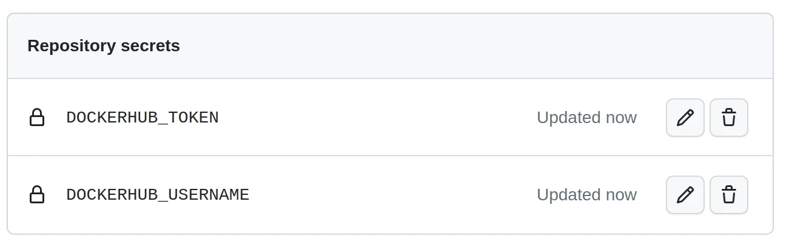

请注意，这些秘密是加密的，GitHub 不会再次向您显示它们，因此请确保将它们保存在安全的地方。但是，如果您足够努力，那么您将能够恢复它们——例如，通过您工作流程中的 shell 命令。

当您将功能分支合并到主线时，此操作也会有条件地运行。在 `with` 部分，您指定 Dockerfile 的路径，请求推送镜像的操作，并列出镜像的标签。请注意，您再次使用 `github` 上下文来获取当前提交的哈希值，尽管是长格式。

> 注意：GitHub Packages 是集成到 GitHub 中的另一项服务。它可以作为 Docker Hub 的替代品。它支持各种包类型，包括 Docker 镜像，让您可以将源代码和二进制包存储在一个地方。 `docker/build-push-action` 可以利用您的 GitHub 令牌推送到 GitHub Packages。

此时，您的持续集成工作流已配置完毕并准备就绪。如果您还没有使用 GitHub 内置的代码编辑器，那么请记住提交并推送您的本地存储库以使更改生效：

```bash
$ git status
On branch master
Untracked files:
  (use "git add <file>..." to include in what will be committed)
        .github/

nothing added to commit but untracked files present (use "git add" to track)

$ git add .github/
$ git commit -m "Add a continuous integration workflow"
$ git push
```

在下一节中，您将启用一些分支保护规则以防止任何人将他们的代码直接推送到 `master` 分支。因此，工作流中的 `push` 事件将仅适用于通过拉取请求将功能分支合并到主线中。

### 启用分支保护规则

再次转到存储库的设置，单击代码和自动化部分下的分支，然后单击标记为添加分支保护规则的按钮。然后，在 Branch name pattern 字段中输入您的主线名称。如果您遵循本教程中使用的命名约定，则应在输入字段中键入 `master` ：

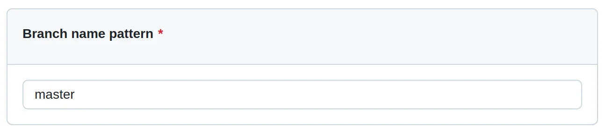

接下来，启用其正下方的一个选项，该选项显示 Require a pull request before merging。这将自动需要至少一位审阅者的批准。如果您在 GitHub 上没有其他帐户，您可以暂时取消选中此选项。否则，如果没有其他人批准，您将无法合并您的拉取请求：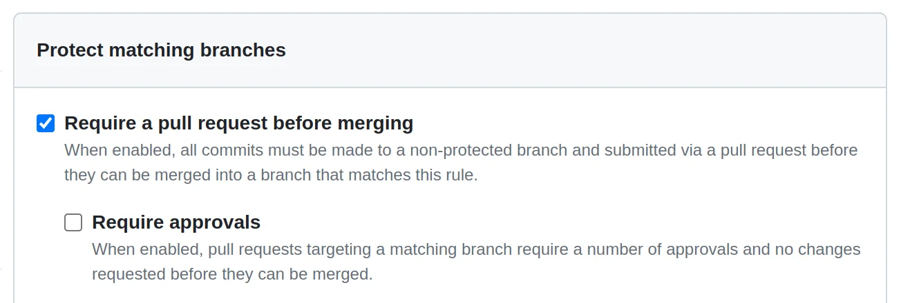

向下滚动一点后，您会看到一个选项，上面写着 Require status checks to pass before merging。选择它以显示更多选项。当你这样做时，检查另一个选项 Require branches to be update before merging，这将防止在你的 `master` 分支有新提交时关闭拉取请求。最后，在下面的搜索框中输入您的工作名称 `build` ：

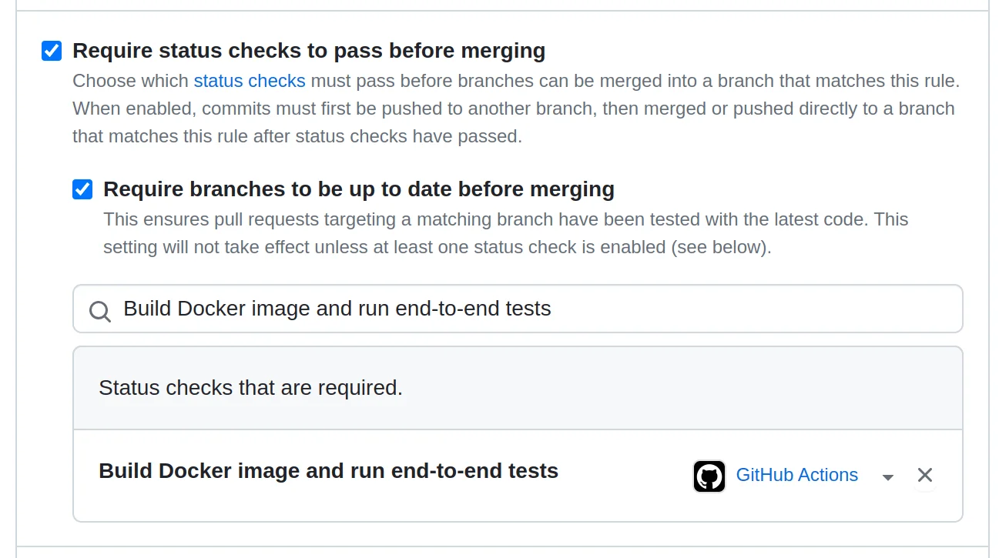

现在，每个拉取请求都需要在允许合并之前通过端到端测试。

要在不允许管理员和其他具有提升权限的用户绕过这些规则的情况下强制执行这些规则，您可以在底部选择一个标记为不允许绕过上述设置的选项：

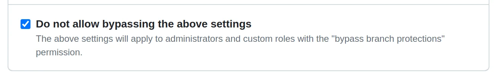

好的。一切就绪！如何使用您的 Docker 应用程序来测试您的持续集成工作流程？

### 集成来自功能分支的更改

遵循本教程前面概述的基于 Docker 的持续集成管道。首先创建一个单独的功能分支，以破坏测试的方式修改代码，提交更改并将它们推送到 GitHub：

Windows：

```bash
PS> git checkout -b feature/replace-emoji-face
Switched to a new branch 'feature/replace-emoji-face'

PS> cd web\src\page_tracker

PS> (Get-Content app.py).replace('pensive', 'thinking') | Set-Content app.py

PS> git commit -am "Replace the emoji in an error message"
[feature/replace-emoji-face 9225d18] Replace the emoji in an error message
 1 file changed, 1 insertion(+), 1 deletion(-)

PS> git push --set-upstream origin feature/replace-emoji-face
⋮
remote: Create a pull request for 'feature/replace-emoji-face' on GitHub...
remote:      https://github.com/realpython/page-tracker/pull/new/feature...
```

Linx + MacOS：

```bash
$ git checkout -b feature/replace-emoji-face
Switched to a new branch 'feature/replace-emoji-face'

$ sed -i 's/pensive/thinking/g' web/src/page_tracker/app.py

$ git commit -am "Replace the emoji in an error message"
[feature/replace-emoji-face 9225d18] Replace the emoji in an error message
 1 file changed, 1 insertion(+), 1 deletion(-)

$ git push --set-upstream origin feature/replace-emoji-face
⋮
remote: Create a pull request for 'feature/replace-emoji-face' on GitHub...
remote:      https://github.com/realpython/page-tracker/pull/new/feature...
⋮
```

您创建并切换到一个名为 `feature/replace-emoji-face` 的新本地分支，然后将错误消息中的表情符号从沉思脸更改为思考脸，而不更新相应的单元测试。将分支提交并推送到 GitHub 后，您可以通过突出显示行中的链接从您的功能分支打开一个新的拉取请求到 `master` 。只要您这样做，您的持续集成工作流程就会启动。

当 GitHub Actions 运行器完成其工作时，由于检查失败，您将无法合并您的分支：

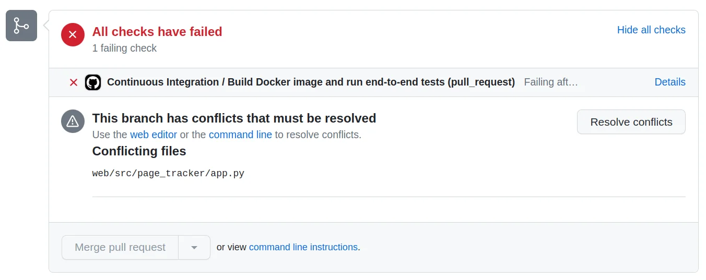

在这种情况下，您只有一个检查对应于工作流中的 `build` 作业，您在上一节中将其配置为分支保护规则之一。您可以单击右侧的 Details 链接来调查失败检查的日志，并且您可以选择以调试模式重新运行相应的作业以收集更多数据。

此外，上面的屏幕截图描述了您的功能分支和目标主线之间的假设冲突。这表明其他人修改了与您相同的文件，并且他们在您修改表情符号时成功地将他们的更改与 `master` 分支集成。

没有自动解决此类冲突的方法，因为它涉及理解代码的逻辑并做出关于保留哪些更改以及丢弃哪些更改的主观决定。

解决此冲突的唯一方法是将更新后的主线合并到您本地的功能分支中，并手动整合冲突的更改。

即使没有任何冲突，如果主线在您的功能分支之前有几个提交，那么无论测试结果如何，您仍然必须将 `master` 中的最新更改合并到您的分支中。这是因为您之前制定的另一个分支保护规则：

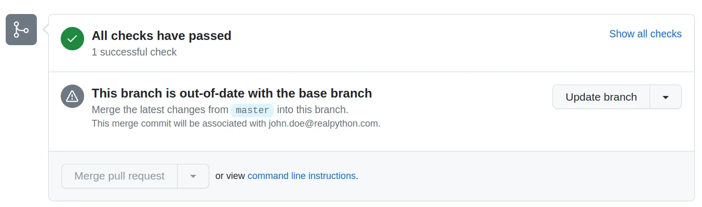

合并拉取请求按钮将保持灰色和禁用状态，直到您采取措施解决所有这些问题。

在现实生活中，您现在应该获取最新的 `master` 并将其合并到您的功能分支，必要时解决任何冲突。然后，您将更新代码以使所有测试再次通过。返回代码编辑器并使用预期的表情符号修复失败的单元测试：

```diff
 # web/test/unit/test_app.py

 # ...

 @unittest.mock.patch("page_tracker.app.redis")
 def test_should_handle_redis_connection_error(mock_redis, http_client):
     # Given
     mock_redis.return_value.incr.side_effect = ConnectionError

     # When
     response = http_client.get("/")

     # Then
     assert response.status_code == 500
-    assert response.text == "Sorry, something went wrong \N{pensive face}"
+    assert response.text == "Sorry, something went wrong \N{thinking face}"
```

在本地运行测试并对代码的正确性获得信心后，在同一分支上再次提交并将其推送到 GitHub。在这样做之前，值得仔细检查当前分支：

```bash
$ git branch
* feature/replace-emoji-face
  master
$ git add web/test/unit/test_app.py
$ git commit -m "Fix the failing unit test"
$ git push
```

拉取请求应该接受您的更改并开始另一个 CI 构建。一旦满足所有保护规则，您最终可以通过单击绿色按钮将您的功能分支合并到受保护的主线中：

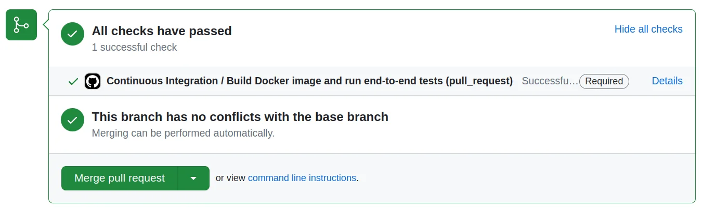

请注意，合并将触发针对 `master` 分支的另一个 CI 构建，以测试您的更改是否与代码库的其余部分很好地集成。事情总是有可能出错。另一方面，如果 CI 构建成功，则工作流将标记并将镜像推送到您的 Docker Hub 存储库：

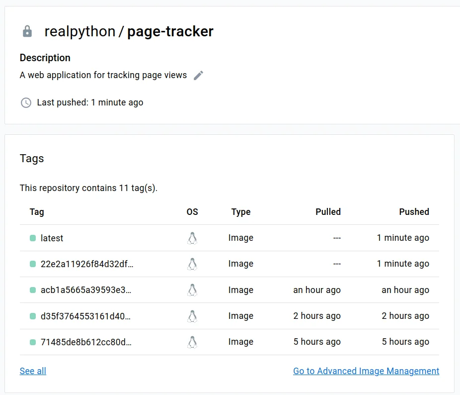

每次 CI 工作流成功时，推送的 Docker 镜像都会被标记为当前 Git 提交哈希和标签 `latest` 。

恭喜！关于使用 Docker 和朋友构建持续集成管道的整个教程到此结束。给自己当之无愧的表扬，因为这绝非易事！

## 后续步骤

您总是可以做很多事情来改进和微调现有的持续集成流程。尽管这是关于构建强大的 CI 管道的详尽且实用的教程，但您只是触及了皮毛！

以下是一些供您考虑的想法：

- 自动部署到云以实现持续交付。

- 通过全流程自动化转向持续部署。
- 引入负载均衡器和服务副本以获得更好的可扩展性。
- 使用身份验证令牌保护敏感数据存储。
- 配置服务的持久日志记录和监控。
- 实施蓝绿部署以实现零停机。
- 添加功能切换以试验金丝雀发布和 A/B 测试。

通过本教程，您已经为入门打下了良好的基础。您当然可以从这里开始构建一个充分自动化和生产就绪的持续集成系统，利用 Docker 和朋友的力量。

## 总结

您现在对如何在容器化环境中构建、部署和管理多容器 Web 应用程序有了深入的了解。您介绍了挂接到 Redis 服务器的 Flask Web 应用程序的开发、测试、保护、码头化和编排。

您还了解了如何使用 Docker、GitHub Actions 和各种其他工具定义持续集成管道。

**在本教程中，您已经：**

- 在 Docker 容器中本地运行 Redis 服务器
- Docker 编排 一个用 Flask 编写的 Python Web 应用程序
- 构建 Docker 镜像并将它们推送到 Docker Hub 注册表
- 使用 Docker Compose 编排多容器应用程序
- 在任何地方复制类似生产的基础设施
- 使用 GitHub Actions 定义持续集成工作流程

您准备好构建自己的持续集成管道了吗？在评论中让大家知道！

> 免费下载：单击[此处](https://realpython.com/bonus/docker-continuous-integration-code/)下载您的 Flask 应用程序和相关资源，以便您可以使用 Docker 定义持续集成管道。

原文链接：[Build Robust Continuous Integration With Docker and Friends ](https://realpython.com/docker-continuous-integration/)
