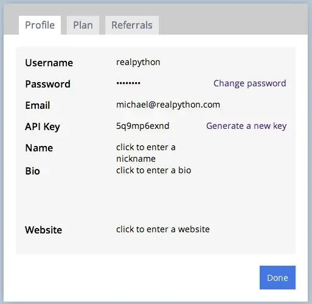
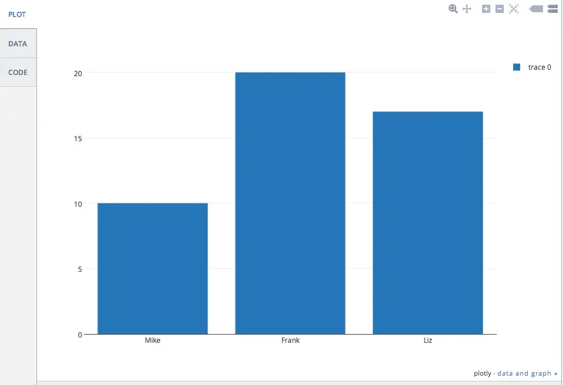

我喜欢 [bottle](http://bottlepy.org/docs/stable/)。它是一个简单、快速且功能强大的 Python 微框架，非常适合小型 Web 应用程序和快速原型设计。对于那些刚刚开始 Web 开发的人来说，它也是一个出色的学习工具。

让我们看一个简单的例子。

> 注意：本教程假设您正在运行基于 Unix 的环境 - 例如 Mac OS X、Linux 版本或通过虚拟机支持的 Linux 版本。

**06/13/2015 更新**：更新了代码示例和解释。

## 启动

首先，让我们创建一个工作目录：

```bash
$ mkdir bottle && cd bottle
```

接下来，您需要安装 [pip](https://realpython.com/what-is-pip/)、virtualenv 和 git。

[virtualenv](https://pypi.python.org/pypi/virtualenv) 是一个 Python 工具，可以[轻松管理特定项目所需的 Python 包](https://realpython.com/python-virtual-environments-a-primer/)；它可以防止一个项目中的包与其他项目中的包发生冲突。同时，pip 是一个包管理器，用于管理 Python [包的安装](https://realpython.com/python-modules-packages/)。

如需在 Unix 环境中安装 pip（及其依赖项）的帮助，请按照 [此 Gist](https://gist.github.com/mjhea0/5692708) 中的说明进行操作。如果您使用的是 Windows 环境，请观看此视频以获取帮助。

安装 [pip](https://realpython.com/courses/what-is-pip/) 后，运行以下命令来安装 virtualenv：

```bash
$ pip install virtualenv==12.0.7
```

现在我们可以轻松设置本地环境：

```bash
$ virtualenv venv
$ source venv/bin/activate
```

安装 bottle：

```bash
$ pip install bottle==0.12.8
$ pip freeze > requirements.txt
```

最后，让我们使用 Git 将我们的应用程序置于版本控制之下。有关 Git 的更多信息，请 [查看本文](https://realpython.com/python-git-github-intro/)，其中还包括安装说明。

## 编写你的应用程序

我们准备好编写我们的瓶子应用程序了。打开 Sublime Text 3 或您选择的文本编辑器。创建您的应用程序文件 app.py，它将保存我们第一个应用程序的全部内容：

```python
import os
from bottle import route, run, template

index_html = '''My first web app! By <strong>{{ author }}</strong>.'''


@route('/')
def index():
    return template(index_html, author='Real Python')


@route('/name/<name>')
def name(name):
    return template(index_html, author=name)


if __name__ == '__main__':
    port = int(os.environ.get('PORT', 8080))
    run(host='0.0.0.0', port=port, debug=True)
```

保存文件。

现在您可以在本地运行您的应用程序：

```bash
$ python app.py
```

您应该能够连接到 [http://localhost:8080/](http://localhost:8080/) 并看到您的应用程序正在运行！

```
My first web app! By RealPython.
```

因此， `@route` [装饰器](https://realpython.com/primer-on-python-decorators/)将一个函数绑定到路由。在第一个路由 `/` 中， `index()` 函数绑定到该路由，该路由渲染 `index_html` 模板并传入[变量](https://realpython.com/python-variables/) `author` 作为关键字参数。然后可以在模板中访问该变量。

现在导航到下一条路由，确保在路由末尾添加您的名字 - 即 http://localhost:8080/name/Michael。您应该看到类似以下内容：

```
My first web app! By Michael.
```

**这是怎么回事？**

- 同样， `@route` 装饰器将一个函数绑定到路由。在本例中，我们使用包含通配符 `<name>` 的动态路由。

- 然后，该通配符作为参数传递给视图函数 - `def name(name)` 。

- 然后我们将其作为关键字参数传递给模板 - `author=name`

- 然后模板渲染作者变量 - `{{ author }}` 。

## Shell 脚本

想快速入门吗？使用此 Shell 脚本在几秒钟内生成入门应用程序。

```bash
mkdir bottle
cd bottle
pip install virtualenv==12.0.7
virtualenv venv
source venv/bin/activate
pip install bottle==0.12.8
pip freeze > requirements.txt
git init
git add .
git commit -m "initial commit"

cat >app.py <<EOF
import os
from bottle import route, run, template

index_html = '''My first web app! By <strong>{{ author }}</strong>.'''


@route('/')
def index():
    return template(index_html, author='Real Python')


@route('/name/<name>')
def name(name):
    return template(index_html, author=name)


if __name__ == '__main__':
    port = int(os.environ.get('PORT', 8080))
    run(host='0.0.0.0', port=port, debug=True)
EOF

chmod a+x app.py

git init
git add .
git commit -m "Updated"
```

从[此要点](https://gist.github.com/mjhea0/5784132)下载此脚本，然后使用以下命令运行它：

```bash
$ bash bottle.sh
```

## 下一步

从这一点来看，创建新页面就像添加新的 `@route` 装饰函数一样简单。

创建 HTML 很简单：在上面的应用程序中，我们只是将 HTML 内联到文件本身中。修改它以从文件加载模板很容易。例如：

```python
@route('/main')
def main(name):
    return template('main_template')
```

这将加载模板文件 `main_template.tpl` ，该文件必须放置在项目结构中的 `views` 文件夹中，并将其呈现给最终用户。

有关详细信息，请参阅 bottle [文档](http://bottlepy.org/docs/dev/)。

## 基本设置

首先从第 1 部分下载此 [Gist](https://gist.github.com/mjhea0/5784132)，然后使用以下命令运行它：

```bash
$ bash bottle.sh
```

这将创建一个基本的项目结构：

```
├── app.py
├── requirements.txt
└── testenv
```

激活虚拟环境：

```bash
$ cd bottle
$ source testenv/bin/activate
```

安装要求：

```bash
$ pip install -r requirements.txt
```

导航到 https://www.plot.ly/api，注册一个新帐户，登录，然后创建一个新的 API 密钥：



复制该密钥。

安装 plot.ly：

```bash
$ pip install plotly==1.2.6
```

接下来更新 app.py 中的代码：

```python
import os
from bottle import run, template, get, post, request

import plotly.plotly as py
from plotly.graph_objs import *


# add your username and api key
py.sign_in("realpython", "lijlflx93")


@get('/plot')
def form():
    return '''<h2>Graph via Plot.ly</h2>
              <form method="POST" action="/plot">
                Name: <input name="name1" type="text" />
                Age: <input name="age1" type="text" /><br/>
                Name: <input name="name2" type="text" />
                Age: <input name="age2" type="text" /><br/>
                Name: <input name="name3" type="text" />
                Age: <input name="age3" type="text" /><br/>
                <input type="submit" />
              </form>'''


@post('/plot')
def submit():
    # grab data from form
    name1 = request.forms.get('name1')
    age1 = request.forms.get('age1')
    name2 = request.forms.get('name2')
    age2 = request.forms.get('age2')
    name3 = request.forms.get('name3')
    age3 = request.forms.get('age3')

    data = Data([
        Bar(
            x=[name1, name2, name3],
            y=[age1, age2, age3]
        )
    ])

    # make api call
    response = py.plot(data, filename='basic-bar')

    if response:
        return template('''
            <h1>Congrats!</h1>
            <div>
              View your graph here: <a href="{{response}}"</a>{{response}}
            </div>
            ''',
            response=response
        )

if __name__ == '__main__':
    port = int(os.environ.get('PORT', 8080))
    run(host='0.0.0.0', port=port, debug=True)
```

这里发生了什么？

- 第一个函数 `form()` 创建一个 HTML 表单，用于捕获制作简单条形图所需的数据。
- 与此同时，第二个函数 `submit()` 抓取表单输入，将它们分配给变量，然后调用 plot.ly API，传递我们的凭据和数据，以生成新图表。确保将我的用户名和 API 密钥替换为您自己的凭据。不要使用我的。不起作用。

### 测试

在本地运行您的应用程序， `python app.py` ，并将浏览器指向 [http://localhost:8080/plot](http://localhost:8080/plot)。

输入三个人的姓名及其各自的年龄。按“提交”，如果一切顺利，您应该会看到一条祝贺消息和一个 URL。单击 URL 查看您的图表：



如果您收到此消息的 500 错误 - `Aw, snap! Looks like you supplied the wrong API key. Want to try again? You can always view your key at https://plot.ly/api/key. When you display your key at https://plot.ly/api/key, make sure that you're logged in as realpython.` - 您需要更新您的 API 密钥。

> 另外，如果这是一个真正的、面向客户端的应用程序，您会希望比这更优雅地处理错误。仅供参考。

## 群组分析

接下来，让我们看一个更复杂的示例，为以下队列分析统计数据创建图表：

| Cohort | 2011 | 2012 | 2013 | 2014 |
| ------ | ---- | ---- | ---- | ---- |
| 0      | 310  | 348  | 228  | 250  |
| 1      | 55   | 157  | 73   | 34   |
| 2      | 18   | 37   | 33   | 34   |
| 3      | 2    | 4    | 4    | 3    |

我们将基于同一个应用程序 - app.py 进行构建，但创建一个新文件：打开 app.py，然后“另存为”cohort.py。

首先升级到[简单模板引擎](http://bottlepy.org/docs/dev/stpl.html)，这样我们就可以将样式和 Javascript 文件添加到我们的模板中。添加一个名为“views”的新文件夹，然后在该目录中创建一个名为 template.tpl 的新文件。将以下代码添加到该文件中：

```html
<!DOCTYPE html>
<html>
  <head>
    <meta charset="utf-8">
    <title>{{ title }}</title>
    <meta name="viewport" content="width=device-width, initial-scale=1.0">
    <link href="http://netdna.bootstrapcdn.com/bootstrap/3.0.0/css/bootstrap.min.css" rel="stylesheet" media="screen">
    <style>
      body {
        padding: 60px 0px;
      }
    </style>
  </head>
  <body>
    <div class="container">
      <h1>Graph via Plot.ly</h1>
      <form role="form" method="post" action="/plot">
        <table>
            <td>
              <h3>2011</h3>
              <div class="form-group" "col-md-2">
                <input type="number" name="Y01" class="form-control" placeholder="Cohort 0">
                <input type="number" name="Y02" class="form-control" placeholder="Cohort 1">
                <input type="number" name="Y03" class="form-control" placeholder="Cohort 2">
                <input type="number" name="Y04" class="form-control" placeholder="Cohort 3">
              </div>
            </td>
            <td>
              <h3>2012</h3>
              <div class="form-group" "col-md-2">
                <input type="number" name="Y11" class="form-control" placeholder="Cohort 0">
                <input type="number" name="Y12" class="form-control" placeholder="Cohort 1">
                <input type="number" name="Y13" class="form-control" placeholder="Cohort 2">
                <input type="number" name="Y44" class="form-control" placeholder="Cohort 3">
              </div>
            </td>
            <td>
              <h3>2013</h3>
              <div class="form-group" "col-md-2">
                <input type="number" name="Y21" class="form-control" placeholder="Cohort 0">
                <input type="number" name="Y22" class="form-control" placeholder="Cohort 1">
                <input type="number" name="Y23" class="form-control" placeholder="Cohort 2">
                <input type="number" name="Y24" class="form-control" placeholder="Cohort 3">
              </div>
            </td>
            <td>
              <h3>2014</h3>
              <div class="form-group" "col-md-2">
                <input type="number" name="Y31" class="form-control" placeholder="Cohort 0">
                <input type="number" name="Y32" class="form-control" placeholder="Cohort 1">
                <input type="number" name="Y33" class="form-control" placeholder="Cohort 2">
                <input type="number" name="Y34" class="form-control" placeholder="Cohort 3">
              </div>
            </td>
          </tr>
        </table>
        <button type="submit" class="btn btn-default">Submit</button>
      </form>
    </div>
    <script src="http://code.jquery.com/jquery-1.10.2.min.js"></script>
    <script src="http://netdna.bootstrapcdn.com/bootstrap/3.0.0/js/bootstrap.min.js"></script>
  </body>
</html>
```

您可能知道，这看起来就像一个 HTML 文件。不同之处在于我们可以使用语法 - `{{ python_variable }}` 将 Python 变量传递到文件。

创建 data.json 文件并添加您的 Plot.ly 用户名和 API 密钥。您可以在 [此处](https://github.com/mjhea0/bottle-plotly-python/blob/master/bottle/data_sample.json) 查看示例文件。

将以下代码添加到 cohort.py 中，以便在我们进行 API 调用时访问 data.json 以使用凭据：

```python
import os
from bottle import run, template, get, post, request

import plotly.plotly as py
from plotly.graph_objs import *

import json

# grab username and key from config/data file
with open('data.json') as config_file:
    config_data = json.load(config_file)
username = config_data["user"]
key = config_data["key"]

py.sign_in(username, key)
```

现在我们不必将我们的密钥暴露给整个宇宙。只要确保使其不受版本控制即可。

接下来更新功能：

```python
import os
from bottle import run, template, get, post, request

import plotly.plotly as py
from plotly.graph_objs import *

import json

# grab username and key from config/data file
with open('data.json') as config_file:
    config_data = json.load(config_file)
username = config_data["user"]
key = config_data["key"]

py.sign_in(username, key)


@get('/plot')
def form():
    return template('template', title='Plot.ly Graph')


@post('/plot')
def submit():
    # grab data from form
    Y01 = request.forms.get('Y01')
    Y02 = request.forms.get('Y02')
    Y03 = request.forms.get('Y03')
    Y04 = request.forms.get('Y04')
    Y11 = request.forms.get('Y11')
    Y12 = request.forms.get('Y12')
    Y13 = request.forms.get('Y13')
    Y14 = request.forms.get('Y14')
    Y21 = request.forms.get('Y21')
    Y22 = request.forms.get('Y22')
    Y23 = request.forms.get('Y23')
    Y24 = request.forms.get('Y24')
    Y31 = request.forms.get('Y31')
    Y32 = request.forms.get('Y32')
    Y33 = request.forms.get('Y33')
    Y34 = request.forms.get('Y34')

    trace1 = Scatter(
        x=[1, 2, 3, 4],
        y=[Y01, Y02, Y03, Y04]
    )
    trace2 = Scatter(
        x=[1, 2, 3, 4],
        y=[Y11, Y12, Y13, Y14]
    )
    trace3 = Scatter(
        x=[1, 2, 3, 4],
        y=[Y21, Y22, Y23, Y24]
    )
    trace4 = Scatter(
        x=[1, 2, 3, 4],
        y=[Y31, Y32, Y33, Y34]
    )

    data = Data([trace1, trace2, trace3, trace4])

    # api call
    plot_url = py.plot(data, filename='basic-line')

    return template('template2', title='Plot.ly Graph', plot_url=str(plot_url))

if __name__ == '__main__':
    port = int(os.environ.get('PORT', 8080))
    run(host='0.0.0.0', port=port, debug=True)
```

请注意 `return` 声明。我们传入模板的名称以及任何变量。让我们创建一个名为 template2.tpl 的新模板：

```html
<!DOCTYPE html>
<html>
  <head>
    <meta charset="utf-8" />
    <title>{{ title }}</title>
    <meta name="viewport" content="width=device-width, initial-scale=1.0" />
    <link
      href="http://netdna.bootstrapcdn.com/bootstrap/3.0.0/css/bootstrap.min.css"
      rel="stylesheet"
      media="screen"
    />
    <style>
      body {
        padding: 60px 0px;
      }
    </style>
  </head>
  <body>
    <div class="container">
      <h1>Graph via Plot.ly</h1>
      <br />
      <a href="/plot"><button class="btn btn-default">Back</button></a>
      <br /><br />
      <iframe
        id="igraph"
        src="{{plot_url}}"
        width="900"
        height="450"
        seamless="seamless"
        scrolling="no"
      ></iframe>
    </div>
    <script src="http://code.jquery.com/jquery-1.10.2.min.js"></script>
    <script src="http://netdna.bootstrapcdn.com/bootstrap/3.0.0/js/bootstrap.min.js"></script>
  </body>
</html>
```

因此，iframe 允许我们更新表单，然后显示实际内容/图表以及更新后的更改。换句话说，我们不必离开站点即可查看图表。

运行。将值添加到表单中。然后提交。您的图表现在应如下所示：


## 结论

您可以从此[存储库](https://github.com/mjhea0/bottle-plotly-python)中获取所有文件。

下次见！

原文链接：

- https://realpython.com/developing-with-bottle-part-1/
- https://realpython.com/developing-with-bottle-part-2-plot-ly-api
