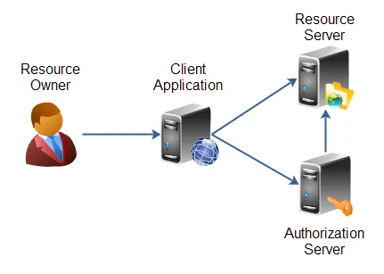
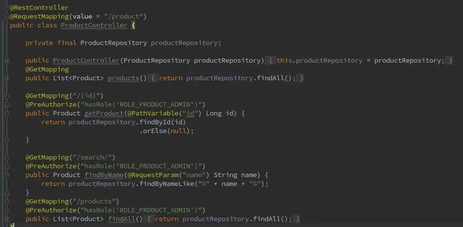
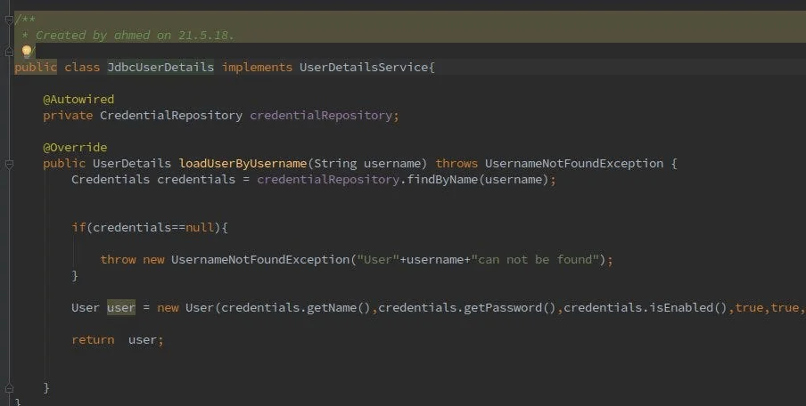
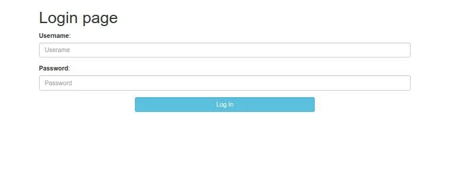
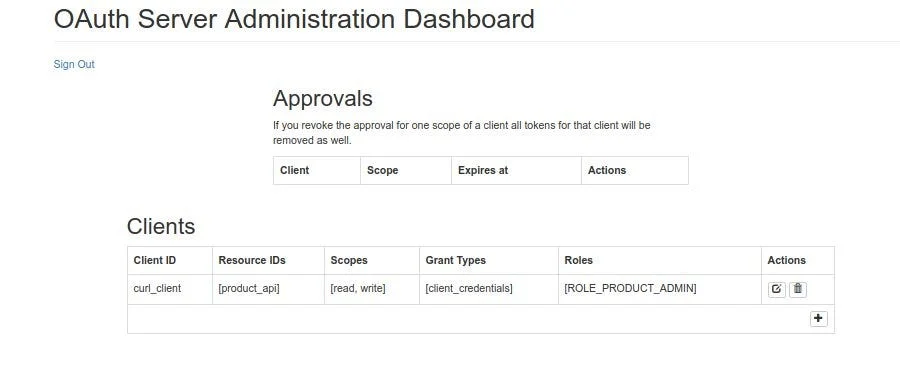

在这篇文章中，我们将了解如何使用 Spring Boot 2 和 Spring Security 5 OAuth2 来实现集中授权的授权服务器以及如何通过 GUI 对其进行管理，还将提供资源服务器演示以及 github 下的整个项目。

很多示例涵盖了基于早期版本的 Spring boot 2 和 Spring Security 5 使用内存令牌实现 Oauth2，因此想法是使用 MySql 数据库作为令牌存储。

为了深入探讨这个主题，我们必须：

- 配置 Spring 安全。
- 配置数据库。
- 创建授权服务器。
- 创建资源服务器。
- 使用 curl 客户端使用访问令牌获取安全资源。

## 什么是 Oauth 2？

OAuth 2.0 是行业标准授权协议。 OAuth 2.0 取代了 2006 年创建的原始 OAuth 协议上所做的工作。OAuth 2.0 注重客户端开发人员的简单性，同时为 Web 应用程序、桌面应用程序、移动电话和客厅设备提供特定的授权流程。

该规范及其扩展正在 [IETF OAuth 工作组内](https://www.ietf.org/mailman/listinfo/oauth)开发。

## Oauth 2 角色

OAuth2 定义了 4 个角色：

- 资源所有者：通常是您自己。
- 资源服务器：托管受保护数据的服务器（例如 Google 托管您的个人资料和个人信息）。

- 客户端：请求访问资源服务器的应用程序（网站、Javascript 应用程序或移动应用程序......）。
- 授权服务器：向客户端颁发访问令牌的服务器。该令牌将用于客户端请求资源服务器。该服务器可以与资源服务器相同（相同的物理服务器和相同的应用程序），而且经常是这种情况。

下图说明了角色流程：



## 授权类型

OAuth 2 为不同的用例提供了多种“授权类型”。定义的授权类型型有：

- 授权码：授权码授予是使用您的 Facebook 或 Google 帐户登录应用程序的功能。
- 密码：旨在用于基于用户代理的客户端。其次，授权服务器不会像授权代码授予那样返回授权代码来交换访问令牌，而是返回访问令牌。
- 客户端凭据：客户端可以仅使用其客户端凭据（或其他支持的身份验证方式）请求访问令牌，当客户端请求访问其下的受保护资源控制权，或先前已被其他资源所有者控制的与授权服务器安排。
- 隐式授权：隐式授权是一种简化的授权代码流，针对使用 JavaScript 等脚本语言在浏览器中实现的客户端进行了优化。在隐式流程中，而不是向客户端发出授权代码，直接向客户端颁发访问令牌。

## 示范

让我们动手吧

### **业务层**

为简单起见，我们的主要业务应用程序将是使用一个实体的产品 API，我们的访问规则将是：

- PRODUCT_CREATE
- PRODUCT_UPDATE
- PRODUCT_DISPLAY
- PRODUCT_ADMIN

### OAuth2 客户端设置

要设置 Oauth 2 客户端，我们需要创建下表 [有关更多详细信息，请参阅链接]

- [OAUTH_CLIENT_DETAILS](https://github.com/spring-projects/spring-security-oauth/blob/2.2.1.RELEASE/spring-security-oauth2/src/main/java/org/springframework/security/oauth2/provider/client/JdbcClientDetailsService.java)
- [OAUTH_CLIENT_TOKEN](https://github.com/spring-projects/spring-security-oauth/blob/2.2.1.RELEASE/spring-security-oauth2/src/main/java/org/springframework/security/oauth2/client/token/JdbcClientTokenServices.java)
- [OAUTH_ACCESS_TOKEN](https://github.com/spring-projects/spring-security-oauth/blob/2.2.1.RELEASE/spring-security-oauth2/src/main/java/org/springframework/security/oauth2/provider/token/store/JdbcTokenStore.java)
- [OAUTH_REFRESH_TOKEN](https://github.com/spring-projects/spring-security-oauth/blob/2.2.1.RELEASE/spring-security-oauth2/src/main/java/org/springframework/security/oauth2/provider/token/store/JdbcTokenStore.java)
- [OAUTH CODE ](https://github.com/spring-projects/spring-security-oauth/blob/2.2.1.RELEASE/spring-security-oauth2/src/main/java/org/springframework/security/oauth2/provider/code/JdbcAuthorizationCodeServices.java)
- [OAUTH_APPROVALS](https://github.com/spring-projects/spring-security-oauth/blob/2.2.1.RELEASE/spring-security-oauth2/src/main/java/org/springframework/security/oauth2/provider/approval/JdbcApprovalStore.java)

我们将调用像“product_api”这样的资源服务器 对于该服务器，我们定义一个客户端，称为：

- 读-写-客户端（授权授权类型：读、写）

```sql
INSERT INTO OAUTH_CLIENT_DETAILS(CLIENT_ID, RESOURCE_IDS, CLIENT_SECRET, SCOPE, AUTHORIZED_GRANT_TYPES, AUTHORITIES, ACCESS_TOKEN_VALIDITY, REFRESH_TOKEN_VALIDITY)
VALUES ('read-write-client', 'product-api','$2a$10$BurTWIy5NTF9GJJH4magz.9Bd4bBurWYG8tmXxeQh1vs7r/wnCFG2','read,write', 'client_credentials', 'ROLE_PRODUCT_ADMIN', 10800, 2592000);
#password [hashed with BCCrypt] :user
```

### 权限和用户设置

Spring Security 附带两个有用的接口：

- [UserDetails](https://docs.spring.io/spring-security/site/docs/5.0.x/api/org/springframework/security/core/userdetails/UserDetails.html) — 提供核心用户信息。

- [GrantedAuthority](https://docs.spring.io/spring-security/site/docs/5.0.x/api/org/springframework/security/core/GrantedAuthority.html) — 表示授予身份验证对象的权限。

下面的脚本将加载所有权限和凭据（用户）：

```sql
INSERT INTO authority  VALUES(1,'ROLE_OAUTH_ADMIN');
INSERT INTO authority VALUES(2,'ROLE_ADMIN_PRODUCT');
INSERT INTO authority VALUES(3,'ROLE_RESOURCE_ADMIN');

INSERT INTO credentials VALUES(1,b'1','oauth_admin','$2a$10$BurTWIy5NTF9GJJH4magz.9Bd4bBurWYG8tmXxeQh1vs7r/wnCFG2','0');
INSERT INTO credentials VALUES(2,b'1','resource_admin','$2a$10$BurTWIy5NTF9GJJH4magz.9Bd4bBurWYG8tmXxeQh1vs7r/wnCFG2','0');
INSERT INTO credentials  VALUES(3,b'1','user','$2a$10$BurTWIy5NTF9GJJH4magz.9Bd4bBurWYG8tmXxeQh1vs7r/wnCFG2','0');

INSERT INTO credentials_authorities VALUES (1, 1);
INSERT INTO credentials_authorities VALUES (2, 3);
INSERT INTO credentials_authorities VALUES (3, 2);
#Password : user

```

### API 层

对于演示，基于 Spring Boot 开发了 RESTful 应用程序并公开以下端点：



### Spring 安全配置

我们必须提供 [UserDetailsService](https://docs.spring.io/spring-security/site/docs/4.2.3.RELEASE/apidocs/org/springframework/security/core/userdetails/UserDetailsService.html) 接口的实现，以便获取用户凭据和权限，如下所示



为了向应用程序提供安全性，我们将使用 [@EnableWebSecurity](https://docs.spring.io/spring-security/site/docs/4.2.3.RELEASE/apidocs/org/springframework/security/config/annotation/web/configuration/EnableWebSecurity.html) 注解和 WebSecurityConfigurerAdapter

```java
@EnableWebSecurity
@Configuration
public class WebSecurityConfiguration extends WebSecurityConfigurerAdapter {
    @Bean
    public PasswordEncoder passwordEncoder() {
        return new BCryptPasswordEncoder();
    }

    @Bean
    @Override
    public UserDetailsService userDetailsServiceBean() throws Exception {
        return new JdbcUserDetails();
    }

    @Override
    public void configure(WebSecurity web) throws Exception {
        web.ignoring().antMatchers("/webjars/**");
    }

    @Override
    protected void configure(HttpSecurity http) throws Exception {
        http
                .authorizeRequests()
                .antMatchers("/login","/logout.do").permitAll()
                .antMatchers("/**").authenticated()
                .and()
                .formLogin()
                .loginProcessingUrl("/login.do")
                .usernameParameter("username")
                .passwordParameter("password")
                .loginPage("/login")
                .and()
                .logout()
                .logoutRequestMatcher(new AntPathRequestMatcher("/logout.do"))
                .and()
                .userDetailsService(userDetailsServiceBean());
    }

    @Override
    protected void configure(AuthenticationManagerBuilder auth) throws Exception {
        auth.userDetailsService(userDetailsServiceBean())
        .passwordEncoder(passwordEncoder());
    }
}
```

### OAuth2 配置

要设置 Oauth 2，需要实现两个组件

- Authorization Server 授权服务器
- Resource Server 资源服务器

### 授权服务器

授权服务器负责验证用户身份并提供令牌，使用@EnableAuthorizationServer 注解启用授权服务器配置

```java
@Configuration
@EnableAuthorizationServer
public class AuthorizationServerConfiguration extends AuthorizationServerConfigurerAdapter {
    @Bean
    @ConfigurationProperties(prefix = "spring.datasource")
    public DataSource oauthDataSource() {
        return DataSourceBuilder.create().build();
    }

    @Bean
    public JdbcClientDetailsService clientDetailsService() {
        return new JdbcClientDetailsService(oauthDataSource());
    }

    @Bean
    public TokenStore tokenStore() {
        return new JdbcTokenStore(oauthDataSource());
    }

    @Bean
    public ApprovalStore approvalStore() {
        return new JdbcApprovalStore(oauthDataSource());
    }

    @Bean
    public AuthorizationCodeServices authorizationCodeServices() {
        return new JdbcAuthorizationCodeServices(oauthDataSource());
    }

    @Override
    public void configure(ClientDetailsServiceConfigurer clients) throws Exception {
        clients.withClientDetails(clientDetailsService());
    }

    @Override
    public void configure(AuthorizationServerSecurityConfigurer oauthServer) throws Exception {

    }

    @Override
    public void configure(AuthorizationServerEndpointsConfigurer endpoints) throws Exception {
        endpoints
                .approvalStore(approvalStore())
                .authorizationCodeServices(authorizationCodeServices())
                .tokenStore(tokenStore());
    }
}

```

成功配置运行授权服务器后，您将获得登录页面来管理授权服务器



使用 oauth_admin/user 作为用户名/密码访问 Oauth2 仪表板，您可以在其中创建服务器客户端



## 资源服务器

资源服务器托管受 OAuth2 令牌保护的资源（基本上是我们的产品 API）

```java
@EnableResourceServer
@Configuration
public class ResourcesServerConfiguration  extends ResourceServerConfigurerAdapter {

    @Bean
    @ConfigurationProperties(prefix="spring.datasource")
    public DataSource ouathDataSource(){return DataSourceBuilder.create().build();}

    @Override
    public void configure(ResourceServerSecurityConfigurer resources)throws Exception{
        TokenStore tokenStore=new JdbcTokenStore(ouathDataSource());
        resources.resourceId("product_api").tokenStore(tokenStore);
    }
    @Override

    public void configure(HttpSecurity http) throws Exception{
        http
                .authorizeRequests()
                .antMatchers(HttpMethod.GET, "/**").access("#oauth2.hasScope('read')")
                .antMatchers(HttpMethod.POST, "/**").access("#oauth2.hasScope('write')")
                .antMatchers(HttpMethod.PATCH, "/**").access("#oauth2.hasScope('write')")
                .antMatchers(HttpMethod.PUT, "/**").access("#oauth2.hasScope('write')")
                .antMatchers(HttpMethod.DELETE, "/**").access("#oauth2.hasScope('write')")
                .and()
                .headers().addHeaderWriter((request, response) -> {
            			response.addHeader("Access-Control-Allow-Origin", "*");
                  if (request.getMethod().equals("OPTIONS")) {
                      response.setHeader("Access-Control-Allow-Methods", request.getHeader("Access-Control-Request-Method"));
                      response.setHeader("Access-Control-Allow-Headers", request.getHeader("Access-Control-Request-Headers"));
                  }
        });
    }
}
```

使用以下 Curl 客户端测试产品列表端点：

```bash
#!/bin/sh
TOKEN=`curl -s -u curl_client:user -X POST localhost:8081/oauth/token\?grant_type=client_credentials | egrep -o ‘[a-f0–9-]{20,}’`
echo "Got token for curl client as :$TOKEN"
curl localhost:8083/product/products -H "Authorization: Bearer $TOKEN"
```

运行 Curl 客户端 bash 脚本后得到响应：

```bash
$ ./client.sh
Got token for curl client as : 3be01519–0cab-4049-b87d-617c48bda502
[{“version”:0,”name”:”product_1",”available”:false},{“version”:0,”name”:”product_2",”available”:true}]
```

从 github 上查看整个代码：https://github.com/Akourtiim/oauth2-spring-boot-2.0.2.git

**参考：**

- https://tools.ietf.org/html/rfc6749
- https://dzone.com/articles/secure-spring-rest-with-spring-security-and-oauth2
- http://www.bubblecode.net/en/2016/01/22/understanding-oauth2/
- https://github.com/FrontierPsychiatrist/spring-oauth-example

原文链接：[Oauth 2 Centralized Authorization with Spring Boot 2.0.2 and Spring Security 5 and JDBC token store](https://akourtim-ahmed.medium.com/oauth-2-centralized-authorization-with-spring-boot-2-0-2-and-spring-security-5-and-jdbc-token-store-8dbc063bd5d4) [Spring Boot 2.5.8单体应用接入Nacos 1.3.0配置中心完整指南.md](../../../../../work/ads/Spring Boot 2.5.8单体应用接入Nacos 1.3.0配置中心完整指南.md) 
